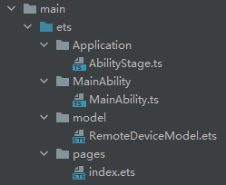
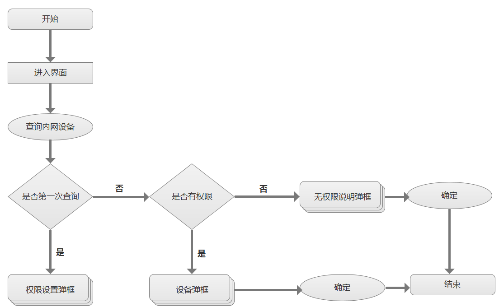
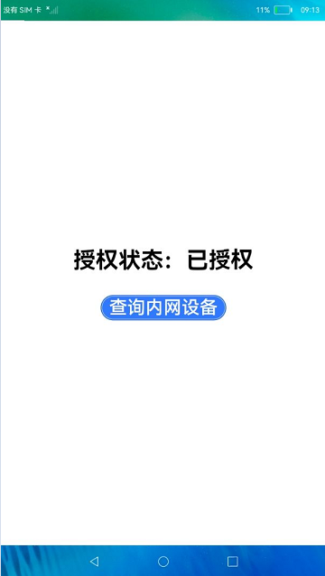
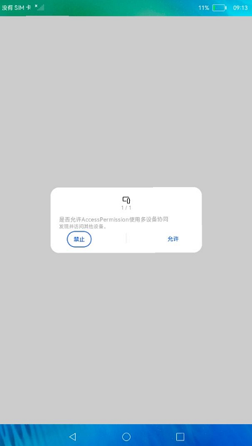
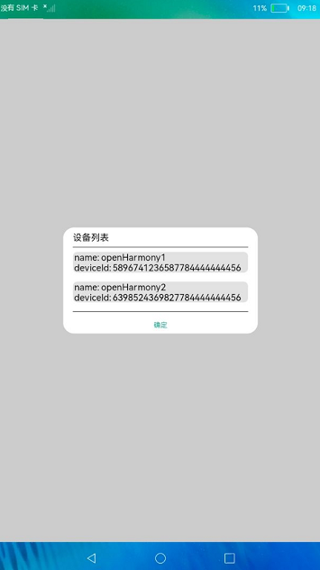
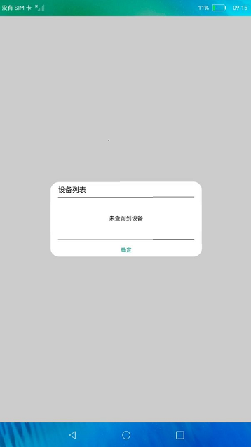
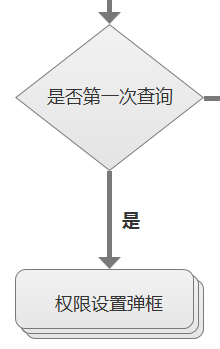
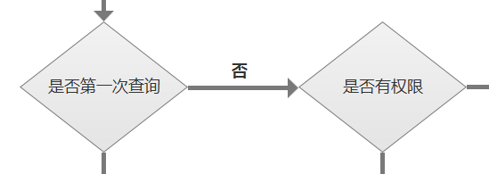
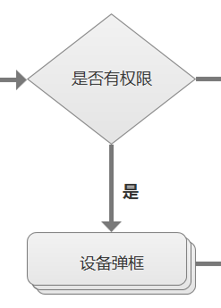
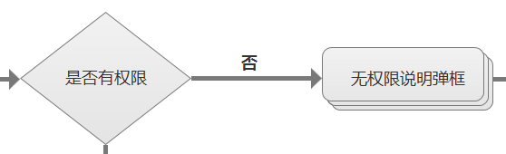

# 介绍

本篇Codelab实现了一个简单的动态权限申请示例。该示例采用基于TS扩展的声明式开发范式进行开发，需要使用OpenHarmony允许不同设备间的数据交换权限。

> **说明：** 
>本示例涉及使用系统接口，需要手动替换Full SDK才能编译通过，具体操作可参考[替换指南](https://gitee.com/openharmony/docs/blob/master/zh-cn/application-dev/quick-start/full-sdk-switch-guide.md)。


本篇Codelab主要讲述以下内容：

-   如何配置动态权限。
-   如何动态申请权限。
-   如何查询应用是否允许某个权限。
-   用户权限与系统权限的差异。
-   如何通过首选项数据库保存、修改、查询数据。

最终效果图如下：

 

# 相关概念

-   [权限类型说明](https://gitee.com/openharmony/docs/blob/master/zh-cn/application-dev/security/accesstoken-overview.md#%E6%9D%83%E9%99%90%E7%B1%BB%E5%9E%8B%E8%AF%B4%E6%98%8E)：根据授权方式的不同，权限类型可分为system\_grant（系统授权）和user\_grant（用户授权）。
-   [权限定义列表](https://gitee.com/openharmony/docs/blob/master/zh-cn/application-dev/security/accesstoken-overview.md#%E6%9D%83%E9%99%90%E5%AE%9A%E4%B9%89%E5%88%97%E8%A1%A8)：展示系统定义的权限信息列表。
-   [访问控制管理](https://gitee.com/openharmony/docs/blob/master/zh-cn/application-dev/reference/apis/js-apis-abilityAccessCtrl.md#%E8%AE%BF%E9%97%AE%E6%8E%A7%E5%88%B6%E7%AE%A1%E7%90%86)：获取访问控制模块对象，管理访问控制模块的实例。
-   [首选项](https://gitee.com/openharmony/docs/blob/master/zh-cn/application-dev/reference/apis/js-apis-data-preferences.md)：为应用提供key-value键值型的数据处理能力，支持应用持久化轻量级数据，并对其修改和查询。数据存储形式为键值对，键的类型为字符串型，值的存储数据类型包括数字型、字符型、布尔型。

# 搭建OpenHarmony环境

完成本篇Codelab我们首先要完成开发环境的搭建，本示例以**RK3568**开发板为例，参照以下步骤进行：

1.  [获取OpenHarmony系统版本](https://gitee.com/openharmony/docs/blob/master/zh-cn/device-dev/get-code/sourcecode-acquire.md#%E8%8E%B7%E5%8F%96%E6%96%B9%E5%BC%8F3%E4%BB%8E%E9%95%9C%E5%83%8F%E7%AB%99%E7%82%B9%E8%8E%B7%E5%8F%96)：标准系统解决方案（二进制）。

    以3.1版本为例：

    

2.  搭建烧录环境。
    1.  [完成DevEco Device Tool的安装](https://gitee.com/openharmony/docs/blob/master/zh-cn/device-dev/quick-start/quickstart-standard-env-setup.md)
    2.  [完成RK3568开发板的烧录](https://gitee.com/openharmony/docs/blob/master/zh-cn/device-dev/quick-start/quickstart-ide-standard-running-rk3568-burning.md)

3.  搭建开发环境。
    1.  开始前请参考[工具准备](https://gitee.com/openharmony/docs/blob/master/zh-cn/application-dev/quick-start/start-overview.md#%E5%B7%A5%E5%85%B7%E5%87%86%E5%A4%87)，完成DevEco Studio的安装和开发环境配置。
    2.  开发环境配置完成后，请参考[使用工程向导](https://gitee.com/openharmony/docs/blob/master/zh-cn/application-dev/quick-start/start-with-ets-stage.md#%E5%88%9B%E5%BB%BAets%E5%B7%A5%E7%A8%8B)创建工程（模板选择“Empty Ability”），选择JS或者eTS语言开发。
    3.  工程创建完成后，选择使用[真机进行调测](https://gitee.com/openharmony/docs/blob/master/zh-cn/application-dev/quick-start/start-with-ets-stage.md#%E4%BD%BF%E7%94%A8%E7%9C%9F%E6%9C%BA%E8%BF%90%E8%A1%8C%E5%BA%94%E7%94%A8)。

# 代码结构解读



```
└── ets                             // ets代码区
    └── Application
    │   └── AbilityStage.ts         // Hap包运行时类
    ├── MainAbility
    │   └── MainAbility.ts          // Ability，提供对Ability生命周期、上下文环境等调用管理
    │── model
    │   └── RemoteDeviceModel.ets   // 远程设备模型类
    └── pages
        └── index.ets               // 主页面
```

# 相关权限

本篇Codelab需要在module.json5中配置如下权限：

```
"requestPermissions": [
  {
    // 允许不同设备间的数据交换
    "name" : "ohos.permission.DISTRIBUTED_DATASYNC",
  }
]
```

> **说明：** 
>应用获取权限的流程取决于相应的权限类型：
>-   如果目标权限是system\_grant类型，开发者需要在module.json5文件中[声明目标权限](https://gitee.com/openharmony/docs/blob/master/zh-cn/application-dev/security/accesstoken-guidelines.md)，系统会在安装应用时为其进行权限预授予。
>-   如果目标权限是user\_grant类型，开发者需要先在module.json5文件中[声明目标权限](https://gitee.com/openharmony/docs/blob/master/zh-cn/application-dev/security/accesstoken-guidelines.md)，然后运行时发送弹窗，请求用户授权。
>-   本篇Codelab用user\_grant类型权限进行讲解，具体可参考[权限定义列表](https://gitee.com/openharmony/docs/blob/master/zh-cn/application-dev/security/accesstoken-overview.md#%E6%9D%83%E9%99%90%E5%AE%9A%E4%B9%89%E5%88%97%E8%A1%A8)。

# 总体流程

1.  用户进入程序主界面，不会弹出权限申请框。
2.  点击【查询内网设备】按钮，查询首选项数据库中标识判断是否为第一次查询。
3.  若为第一次查询，首选项数据库中该标识默认值为空，打开授权弹框（可点击【禁止】（权限未被允许）、【允许】（权限被允许）按钮设置权限）。
4.  若不是第一次查询，查询是否已授权。已授权则打开设备列表弹框，禁止授权则打开无授权说明弹框。
5.  在设备列表、无授权说明弹框中点击【确定】按钮，关闭弹框，流程结束。



# 界面设计

1.  程序主界面中“授权状态”默认为“未授权”，当授权允许之后，“授权状态”更改为“已授权”，如下图所示：

     

2.  弹框界面分为：授权弹框、设备列表弹框（有数据）、设备列表弹框（无数据）、无权限说明弹框。依次如下图所示：

       

# 逻辑说明

点击【查询内网设备】按钮，首先查询首选项数据库的requestPermissionFlag字段是否有值，若为空（未进行过授权操作）打开权限设置弹框，若有值（进行过授权操作）则判断是否有权限，若有权限则打开设备列表弹框，若无权限则打开无权限说明弹框。

1.  点击【查询内网设备】按钮，判断是否第一次查询，流程图如下所示：

    

    从数据库中获得是否第一次查询标识，示例代码如下：

    ```
    globalThis.getData = (() => {
        let promise = data_preferences.getPreferences(this.context, 'mystore')
        return promise
    })
    ```

2.  若是第一次查询，流程图如下所示：

    

    打开权限设置弹框，对权限进行【禁止】或【允许】操作，并将数据库中是否操作过权限字段设置为true，示例代码如下：

    ```
    globalThis.requestPermission = (() => {
        console.log("AccessPermission[MainAbility] request permissions from user")
        this.context.requestPermissionsFromUser(['ohos.permission.DISTRIBUTED_DATASYNC'],(result) => {
            // 判断是否授权，用于界面展示
            globalThis.judgePermission()
            // 设置已进行授权操作
            globalThis.putData(true)
            console.log('requestPermissionsFromUserResult:' + JSON.stringify(result));
        });
    })
    
    globalThis.putData = ((requestPermissionFlag: boolean) => {
        let promise = data_preferences.getPreferences(this.context, 'mystore')
        promise.then((preferences) => {
            let promisePut = preferences.put('requestPermissionFlag', requestPermissionFlag)
            promisePut.then(() => {
                console.info("Put the value of startup successfully.")
            }).catch((err) => {
                console.info("Put the value of startup failed, err: " + err)
            })
        }).catch((err) => {
            console.info("Get the preferences failed, err: " + err)
        })
    })
    ```

3.  若不是第一次查询（进行过授权操作），则判断是否已授权，流程图如下所示：

    

    示例代码如下：

    ```
    let promiseGet = preferences.get('requestPermissionFlag', false)
    promiseGet.then((value) => {
    if(value) {
      // 进行过授权操作，判断是否授权
       globalThis.checkPermission().then(res => {
    	 if (res == globalThis.permissionGranted) {
    	   // 有权限，查询内网设备
    	   ...
    	   this.dialogController.open();
    	 } else {
    	   // 无权限，给出提示
    	   ...
    	 }
       })
    } else {
      // 未进行过授权操作，弹出权限申请框
      globalThis.requestPermission()
    }
    
    // 检查是否有权限
    globalThis.checkPermission = (async() => {
        console.info('AccessPermission[MainAbility] grantPermission')
        // 需要校验的权限
        var permissionNameUser = "ohos.permission.DISTRIBUTED_DATASYNC";
        var bundleFlag = 0;
        // 要校验的目标应用的身份标识
        var tokenID = undefined;
        // userID值，默认100
        var userID = 100;
        // 获取应用信息
        var appInfo = await bundle.getApplicationInfo('com.example.helloworld0218', bundleFlag, userID)
        tokenID = appInfo.accessTokenId;
        console.log("AccessPermission[MainAbility] accessTokenId:" + appInfo.accessTokenId)
        // 获取访问控制模块对象
        var atManager = abilityAccessCtrl.createAtManager();
        // 进行权限校验，0有权限，-1无权限
        var result = await atManager.verifyAccessToken(tokenID, permissionNameUser)
        console.log("AccessPermission[MainAbility] result:" + result)
        return result
    })
    ```

4.  若已授权，则打开设备列表弹框，流程图如下所示：

    

    设备列表弹框，示例代码如下：

    ```
    @CustomDialog
    struct DialogDeviceList {
      controller: CustomDialogController
      action: () => void;
      build() {
        Column() {
          Text('设备列表').fontSize(20).width('90%').textAlign(TextAlign.Start).margin({top: 10})
          Divider().width('90%').margin({top: 10, bottom: 10})
          Column() {
            if(deviceListGlobal.length == 0) {
              Text('未查询到设备')
                .width('100%')
                .height(100)
                .fontSize(16)
                .textAlign(TextAlign.Center)
                .borderRadius(10)
                .backgroundColor(0xFFFFFF)
            } else {
              List({ space: 20, initialIndex: 0 }) {
                ForEach(deviceListGlobal, (item) => {
                  ListItem() {
                    Column() {
                      // 设备名称
                      Row() {
                        Text('name: ')
                          .fontSize(20)
                          .textAlign(TextAlign.Center)
                        Text('' + item.name)
                          .fontSize(20)
                          .textAlign(TextAlign.Center)
                      }.width('100%')
                      // 设备id
                      Row() {
                        Text('deviceId: ')
                          .fontSize(20)
                          .textAlign(TextAlign.Center)
                        Text('' + item.id)
                          .fontSize(20)
                          .textAlign(TextAlign.Center)
                          .textOverflow({overflow: TextOverflow.Ellipsis})
                      }.width('100%')
                    }
                    .justifyContent(FlexAlign.Start)
                    .backgroundColor('#E2E2E2')
                    .borderRadius(10)
                  }
                }, item => item.id)
              }
              .listDirection(Axis.Vertical) // 排列方向
              .divider({ strokeWidth: 2, color: 0xFFFFFF, startMargin: 10, endMargin: 10 }) // 每行之间的分界线
              .edgeEffect(EdgeEffect.None) // 滑动到边缘无效果
              .chainAnimation(false) // 联动特效关闭
              .width('90%').margin({bottom: 10})
            }
          }.flexGrow(1)
          Divider().width('90%').margin({top: 10})
          Row() {
            Text('确定')
              .fontSize(15)
              .width('50%')
              .textAlign(TextAlign.Center)
              .fontColor('#17A98E')
              .onClick(() => {
                this.controller.close();
              })
          }.margin({top: 20, bottom: 10})
        }
      }
    }
    ```

    创建设备管理器，示例代码如下：

    ```
    deviceManager.createDeviceManager('com.example.helloworld0218', (error, value) => {
      ...
      // 获取设备管理器并保存
      self.deviceManager = value;
      // 注册设备列表
      self.registerDeviceListCallback_(callback);
      });
    ```

    获取设备集合，示例代码如下：

    ```
    var list = this.deviceManager.getTrustedDeviceListSync();
    console.info('AccessPermission[RemoteDeviceModel] getTrustedDeviceListSync end, deviceList=' + JSON.stringify(list));
    if (typeof (list) != 'undefined' && typeof (list.length) != 'undefined') {
      this.deviceList = list;
    }
    ```

    监听设备状态改变，示例代码如下：

    ```
    this.deviceManager.on('deviceFound', (data) => {
      console.info('AccessPermission[RemoteDeviceModel] deviceFound data=' + JSON.stringify(data));
      console.info('AccessPermission[RemoteDeviceModel] deviceFound self.deviceList=' + self.deviceList);
      console.info('AccessPermission[RemoteDeviceModel] deviceFound self.deviceList.length=' + self.deviceList.length);
      for (var i = 0; i < self.discoverList.length; i++) {
        if (self.discoverList[i].deviceId === data.device.deviceId) {
          console.info('AccessPermission[RemoteDeviceModel] device founded, ignored');
          return;
        }
      }
      self.discoverList[self.discoverList.length] = data.device;
      self.callback();
    });
    ```

5.  若禁止权限，则打开无权限说明弹框，流程图如下所示：

    

    示例代码如下：

    ```
    // 未申请权限弹框
    @CustomDialog
    struct DialogHints {
      controller: CustomDialogController;
      action: () => void;
      build() {
        Column(){
          Text('权限未申请，不能进行请求配对操作！').fontSize(20).width('90%').textAlign(TextAlign.Center).margin({top: 10})
          Text('如需重新申请权限，请在“设置 -> 应用 -> 应用管理 -> 应用名 -> 存储 -> 删除数据、清空缓存”').fontSize(20).width('90%').textAlign(TextAlign.Center).margin({top: 10})
          Divider().width('90%').margin({top: 10})
          Row() {
            Text('确定').fontSize(15).width('50%').textAlign(TextAlign.Center).fontColor('#17A98E')
              .onClick(() => {
                this.controller.close();
              })
          }.margin({top: 20, bottom: 10})
        }.width('100%')
      }
    }
    ```

# 恭喜您

目前你已经成功完成了Codelab并且学到了：

-   如何配置动态权限。
-   如何动态申请权限。
-   如何查询应用是否允许某个权限。
-   用户权限与系统权限的差异。
-   如何通过首选项数据库保存、修改、查询数据。