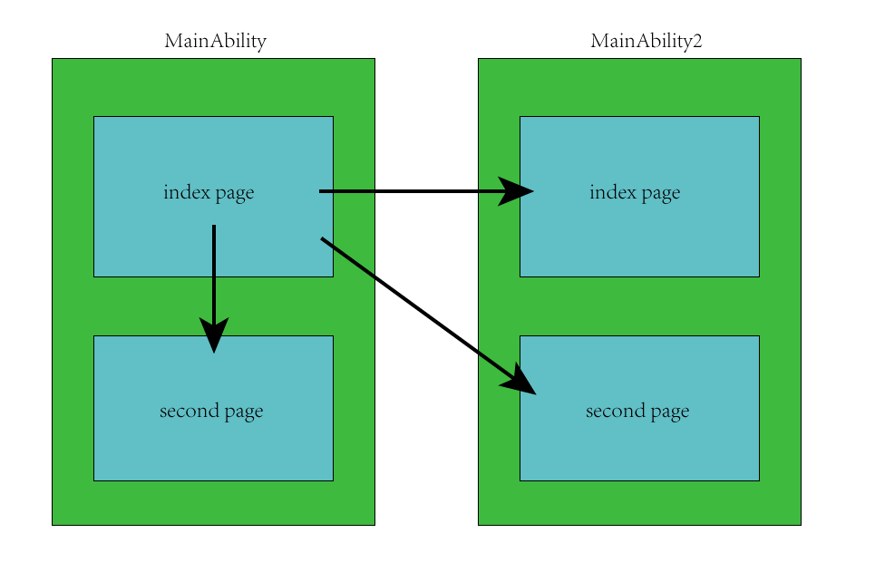
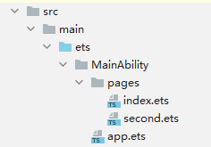
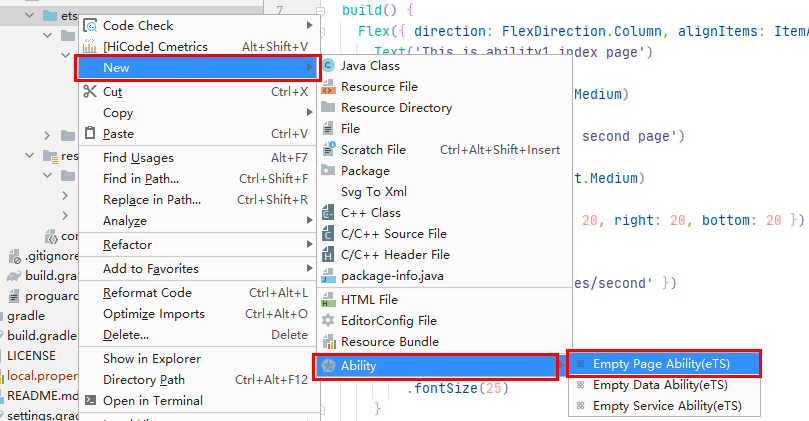
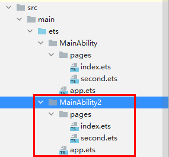

# 介绍<a name="ZH-CN_TOPIC_0000001188508142"></a>

## 应用场景<a name="section225718574575"></a>

本篇Codelab主要是介绍在OpenHarmony上如何进行Ability内部的页面跳转和Ability之间的页面跳转。本片Codelab基于eTS语言。应用场景主要分为三种：

1、同一个Ability内部页面跳转；

2、跳转到指定其他Ability的首页；

3、跳转到指定其他Ability的指定页面（非首页）;

**图 1** <a name="fig98961814192517"></a>  


# 相关概念<a name="ZH-CN_TOPIC_0000001234187659"></a>

Ability：Ability是应用所具备能力的抽象，也是应用程序的重要组成部分。

[PageAbility](https://gitee.com/openharmony/docs/blob/master/zh-cn/application-dev/ability/fa-pageability.md) ：Page模板（以下简称“Page”）是FA唯一支持的模板，用于提供与用户交互的能力。

# 搭建OpenHarmony环境<a name="ZH-CN_TOPIC_0000001188758428"></a>

完成本篇Codelab我们首先要完成开发环境的搭建，本示例以**Hi3516DV300**开发板为例，参照以下步骤进行：

1. [获取OpenHarmony系统版本](https://gitee.com/openharmony/docs/blob/master/zh-cn/device-dev/get-code/sourcecode-acquire.md#%E8%8E%B7%E5%8F%96%E6%96%B9%E5%BC%8F3%E4%BB%8E%E9%95%9C%E5%83%8F%E7%AB%99%E7%82%B9%E8%8E%B7%E5%8F%96) ：标准系统解决方案（二进制）

   以3.0版本为例：

   

2. 搭建烧录环境

   1.  [完成DevEco Device Tool的安装](https://gitee.com/openharmony/docs/blob/master/zh-cn/device-dev/quick-start/quickstart-standard-env-setup.md)

   2.  [完成Hi3516开发板的烧录](https://gitee.com/openharmony/docs/blob/master/zh-cn/device-dev/quick-start/quickstart-lite-steps-hi3516-burn.md)

3. 搭建开发环境

   1. 开始前请参考[工具准备](https://gitee.com/openharmony/docs/blob/master/zh-cn/application-dev/quick-start/start-overview.md#%E5%B7%A5%E5%85%B7%E5%87%86%E5%A4%87) ，完成DevEco Studio的安装和开发环境配置。
   2. 开发环境配置完成后，请参考[使用工程向导](https://gitee.com/openharmony/docs/blob/master/zh-cn/application-dev/quick-start/start-with-ets.md#%E5%88%9B%E5%BB%BAets%E5%B7%A5%E7%A8%8B) 创建工程（模板选择“Empty Ability”），选择JS或者eTS语言开发。
   3. 工程创建完成后，选择使用[真机进行调测](https://gitee.com/openharmony/docs/blob/master/zh-cn/application-dev/quick-start/start-with-ets.md#%E4%BD%BF%E7%94%A8%E7%9C%9F%E6%9C%BA%E8%BF%90%E8%A1%8C%E5%BA%94%E7%94%A8) 。

# 任务一：Ability内页面跳转<a name="ZH-CN_TOPIC_0000001188668058"></a>

- 新建项目时language选择eTS；

- 在eTS目录如下，pages目录下有index.ets和second.ets；

  

  1. 在index.ets中引入router模块；

     ```
     import router from '@system.router';
     ```

  2. 为按钮添加文本、样式和点击事件，点击后跳转到second页面，使用router.push实现跳转；

     ```
     Button() {
       Text('Click to ability1 second page')
         .fontSize(25)
         .fontWeight(FontWeight.Medium)
     }
     .padding({ top: 20, left: 20, right: 20, bottom: 20 })
     .margin({ top: 20 })
     .onClick(() => {
       router.push({ uri: 'pages/second' })
     })
     ```

# 任务二：跳转到指定Ability首页<a id="任务二" name="ZH-CN_TOPIC_0000001188189610"></a>

-   新建Ability，名为MainAbility2，在ets目录下右键新建New-\>Ability-\>Empty Page Ability\(eTS\);



-   目录结构如下：



1. 在MainAbility/pages/index.ets中引入featureAbility模块;

   ```
   import featureAbility from '@ohos.ability.featureAbility';
   ```

2. 在MainAbility/pages/index.ets中添加按钮，并为按钮添加文本、样式和点击事件，点击后跳转到MainAbility2的index页面，通过featureAbility.startAbility实现，调用featureAbility.startAbility时，这里参数want里主要传递bundleName和abilityName；详情请参看[启动本地PageAbility](https://gitee.com/openharmony/docs/blob/master/zh-cn/application-dev/ability/fa-pageability.md#%E5%90%AF%E5%8A%A8%E6%9C%AC%E5%9C%B0pageability)。点击按钮触发点击事件后会默认跳转到MainAbility2的index页面。

   ```
   Button() {
           Text('Click to ability2 index page')
             .fontSize(25)
         }
         .padding({ top: 20, left: 20, right: 20, bottom: 20 })
         .margin({ top: 20 })
         .onClick(() => {
           //启动Ability
           let str = {
             "want": {
               "bundleName": "com.example.pageabilityopenh",
               "abilityName": "com.example.pageabilityopenh.MainAbility2",
             },
           };
           featureAbility.startAbility(str)
             .then((data) => {
               console.info('Operation successful. Data: ' + JSON.stringify(data))
             }).catch((error) => {
             console.error('Operation failed. Cause: ' + JSON.stringify(error));
           })
         })
   ```

# 任务三：跳转到指定Ability指定页面（非首页）<a name="ZH-CN_TOPIC_0000001188668056"></a>

要跳转到指定Ability指定页面，只需要在本文档任务二的基础上，另外在want里添加parameters参数，url设置为指定页面，如：‘pages/second’即可。

```
Button() {
        Text('Click to ability2 second page')
          .fontSize(25)
      }
      .padding({ top: 20, left: 20, right: 20, bottom: 20 })
      .margin({ top: 20 })
      .onClick(() => {
        //启动ability
        let str = {
          "want": {
            "bundleName": "com.example.pageabilityopenh",
            "abilityName": "com.example.pageabilityopenh.MainAbility2",
            "parameters": {
              url: 'pages/second'
            }
          },
        };
        featureAbility.startAbility(str)
          .then((data) => {
            console.info('Operation successful. Data: ' + JSON.stringify(data))
          }).catch((error) => {
          console.error('Operation failed. Cause: ' + JSON.stringify(error));
        })
      })
```

# 恭喜你<a name="ZH-CN_TOPIC_0000001233909219"></a>

学会了如何进行Ability 内部的页面跳转和Ability之间的页面跳转。即如下三种场景：

1、同一个Ability内部页面跳转；

2、跳转到指定其他Ability的首页；

3、跳转到指定其他Ability的指定页面（非首页）;