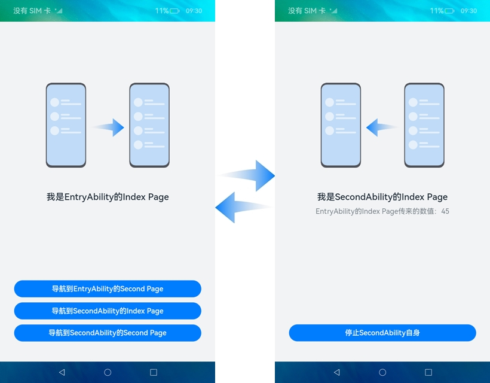
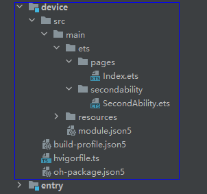
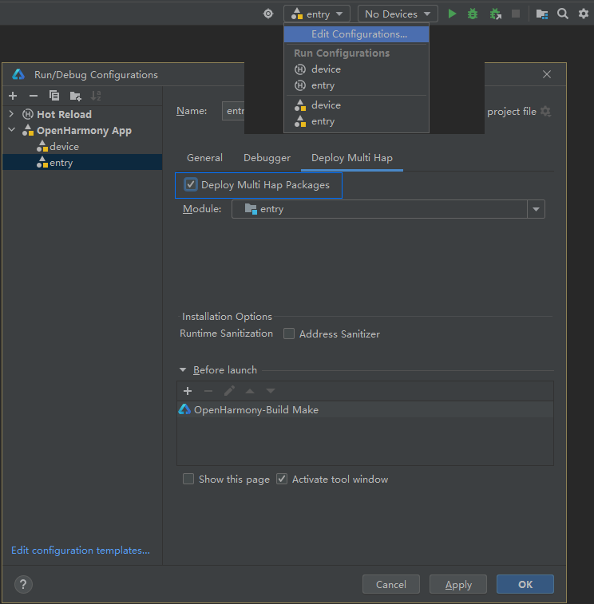
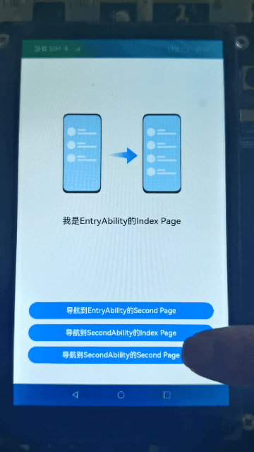
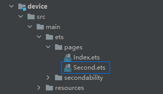

# UIAbility内和UIAbility间页面的跳转（ArkTS）

## 介绍

本篇Codelab基于Stage模型下的UIAbility开发，实现UIAbility内和UIAbility间页面的跳转。包含如下功能：

1.  UIAbility内页面的跳转。
2.  跳转到指定UIAbility的首页。
3.  跳转到指定UIAbility的指定页面（非首页）。

最终效果图如下：


### 相关概念

-   [UIAbility组件概述](https://gitcode.com/openharmony/docs/blob/master/zh-cn/application-dev/application-models/uiability-overview.md)：UIAbility组件是一种包含UI界面的应用组件，主要用于和用户交互。UIAbility组件是系统调度的基本单元，为应用提供绘制界面的窗口。一个应用可以包含一个或多个UIAbility组件。
-   [UIAbilityContext](https://gitcode.com/openharmony/docs/blob/master/zh-cn/application-dev/reference/apis/js-apis-inner-application-uiAbilityContext.md)：UIAbilityContext是[UIAbility](https://gitcode.com/openharmony/docs/blob/master/zh-cn/application-dev/reference/apis/js-apis-app-ability-uiAbility.md)的上下文环境，继承自[Context](https://gitcode.com/openharmony/docs/blob/master/zh-cn/application-dev/reference/apis/js-apis-inner-application-context.md)，提供UIAbility的相关配置信息以及操作UIAbility和ServiceExtensionAbility的方法。
-   [页面路由](https://gitcode.com/openharmony/docs/blob/master/zh-cn/application-dev/reference/apis/js-apis-router.md)：提供通过不同的url访问不同的页面，包括跳转到应用内的指定页面、用应用内的某个页面替换当前页面、返回上一页面或指定的页面等。

-   [Text](https://gitcode.com/openharmony/docs/blob/master/zh-cn/application-dev/reference/arkui-ts/ts-basic-components-text.md)：文本组件，用于呈现一段文本信息。
-   [Button](https://gitcode.com/openharmony/docs/blob/master/zh-cn/application-dev/reference/arkui-ts/ts-basic-components-button.md)：按钮组件，可快速创建不同样式的按钮。

## 环境搭建

### 软件要求

-   [DevEco Studio](https://gitcode.com/openharmony/docs/blob/master/zh-cn/application-dev/quick-start/start-overview.md#%E5%B7%A5%E5%85%B7%E5%87%86%E5%A4%87)版本：DevEco Studio 3.1 Release。
-   OpenHarmony SDK版本：API version 9。

### 硬件要求

-   开发板类型：[润和RK3568开发板](https://gitcode.com/openharmony/docs/blob/master/zh-cn/device-dev/quick-start/quickstart-appendix-rk3568.md)。
-   OpenHarmony系统：3.2 Release。

### 环境搭建

完成本篇Codelab我们首先要完成开发环境的搭建，本示例以**RK3568**开发板为例，参照以下步骤进行：

1. [获取OpenHarmony系统版本](https://gitcode.com/openharmony/docs/blob/master/zh-cn/device-dev/get-code/sourcecode-acquire.md#%E8%8E%B7%E5%8F%96%E6%96%B9%E5%BC%8F3%E4%BB%8E%E9%95%9C%E5%83%8F%E7%AB%99%E7%82%B9%E8%8E%B7%E5%8F%96)：标准系统解决方案（二进制）。以3.2 Release版本为例：

   

2. 搭建烧录环境。

   1.  [完成DevEco Device Tool的安装](https://gitcode.com/openharmony/docs/blob/master/zh-cn/device-dev/quick-start/quickstart-ide-env-win.md)
   2.  [完成RK3568开发板的烧录](https://gitcode.com/openharmony/docs/blob/master/zh-cn/device-dev/quick-start/quickstart-ide-3568-burn.md)

3. 搭建开发环境。

   1.  开始前请参考[工具准备](https://gitcode.com/openharmony/docs/blob/master/zh-cn/application-dev/quick-start/start-overview.md#%E5%B7%A5%E5%85%B7%E5%87%86%E5%A4%87)，完成DevEco Studio的安装和开发环境配置。
   2.  开发环境配置完成后，请参考[使用工程向导](https://gitcode.com/openharmony/docs/blob/master/zh-cn/application-dev/quick-start/start-with-ets-stage.md#创建ets工程)创建工程（模板选择“Empty Ability”）。
   3.  工程创建完成后，选择使用[真机进行调测](https://gitcode.com/openharmony/docs/blob/master/zh-cn/application-dev/quick-start/start-with-ets-stage.md#使用真机运行应用)。

## 代码结构解读

本篇Codelab只对核心代码进行讲解，完整代码可以直接从gitcode获取。

```
├──device/src/main/ets              // device模块的代码区
│  ├──pages
│  │  ├──Index.ets                  // SecondAbility的Index页面
│  │  └──Second.ets                 // SecondAbility的Second页面
│  ├──secondability
│  │  └──SecondAbility.ets          // 程序入口类
├──device/src/main/resources        // device模块的资源文件目录
├──entry/src/main/ets               // entry模块的代码区
│  ├──common
│  │  ├──constants
│  │  │  ├──CommonConstants.ets     // 公共常量类
│  │  │  └──StyleConstants.ets	    // 样式常量类
│  │  ├──utils
│  │  │  ├──GlobalContext.ets       // 全局变量控制类
│  │  │  └──Logger.ets	            // 日志打印类
│  ├──entryability
│  │  └──EntryAbility.ts            // 程序入口类
│  ├──model
│  │  └──ButtonClickMethod.ets      // 按钮点击后调用的方法类
│  ├──pages
│  │  ├──Index.ets                  // EntryAbility的Index页面
│  │  └──Second.ets                 // EntryAbility的Second页面
└──entry/src/main/resources         // entry模块的资源文件目录
```

## UIAbility内页面的跳转

entry模块中，EntryAbility内页面的跳转可以通过页面路由router来实现。页面路由router根据页面url找到目标页面，从而实现跳转。效果图如下：


1. 实现UIAbility内页面的跳转，我们首先需要构建两个页面。在“Project”窗口，点击“entry \> src \> main \> ets \> pages”，打开“Index.ets”文件，可以看到EntryAbility的Index页面由一个Image组件、两个Text组件、三个Button组件组成。“Index.ets”文件的示例代码如下：

   ```typescript
   @Entry
   @Component
   struct Index {
     @State text: string = '';
     @State bottomMargin: string = StyleConstants.MAIN_INDEX_BUTTON_MARGIN_BOTTOM;
   
     build() {
       Column() {
         Image($r('app.media.right'))
           ...
   
         Text($r('app.string.main_index_page_name'))
           ...
   
         // 条件渲染：当text的值不为空时，显示该组件
         if (this.text !== '') {
           Text(this.text)
             ...
         }
   
         // 导航到EntryAbility的Second Page
         Button($r('app.string.to_main_second_page_btn_text'), { type: ButtonType.Capsule, stateEffect: true })
           ...
   
         // 导航到SecondAbility的Index Page
         Button($r('app.string.to_second_index_page_btn_text'), { type: ButtonType.Capsule, stateEffect: true })
           ...
   
         // 导航到SecondAbility的Second Page
         Button($r('app.string.to_second_second_page_btn_text'), { type: ButtonType.Capsule, stateEffect: true })
           ...
       }
       ...
     }
   }
   ```

2. 在“Project”窗口，打开“entry \> src \> main \> ets”，右键点击“pages”文件夹，选择“New \> Page”，命名为“Second”。可以看到EntryAbility的Second页面由一个Image组件、两个Text组件、一个Button组件组成。“Second.ets”文件的示例代码如下：

   ```typescript
   @Entry
   @Component
   struct Second {
     ...
   
     build() {
       Column() {
         Image($r('app.media.left'))
           ...
   
         Text($r('app.string.main_second_page_name'))
           ...
   
         Text(`${this.src}：${this.count}`)
           ...
   
         // 返回到EntryAbility的Index Page
         Button($r('app.string.back_main_index_page_btn_text'), { type: ButtonType.Capsule, stateEffect: true })
           ...
       }
       ...
     }
   }
   ```

3. 从entry模块的Index页面跳转到Second页面，并进行数据传递，通过页面路由router来实现。需要如下几个步骤：

   - 给两个页面导入router模块。
   - 在EntryAbility的Index页面中，点击“导航到EntryAbility的Second Page”按钮后，调用ButtonClickMethod类中的toEntryAbilitySecond方法，跳转到EntryAbility的Second页面。使用router.pushUrl实现跳转，可以通过params来向新页面传入参数，示例代码如下：

   ```typescript
   // 导入router模块
   import router from '@ohos.router';
     
   // 导航到EntryAbility的Second Page
   toEntryAbilitySecond() {
     router.pushUrl({
       url: 'pages/Second',
       params: {
         src: textMessage,
         count: CommonConstants.NUM_VALUES[0]
       }
     });
   }
   ```
   
   - Second页面通过router.getParams\(\)方法获取Index页面传递过来的自定义参数，并用一个Text文本展示从Index页面传递过来的数据，示例代码如下：

   ```typescript
   @Entry
   @Component
   struct Second {
     ...
     // 获取Index页面传递过来的自定义参数
     params = router?.getParams();
     @State src: string = this.params == undefined ? '-' : (this.params as Record<string,Object>)['src'] as string;
     @State count: number = this.params == undefined ? 0 : (this.params as Record<string,Object>)['count'] as number;
     
     build() {
       Column() {
         Image($r('app.media.left'))
           ...
     
         Text($r('app.string.main_second_page_name'))
           ...
     
         // 用一个Text文本展示从Index页面传递过来的数据      
         Text(`${this.src}：${this.count}`)
           ...
     
         // 返回到EntryAbility的Index Page
         Button($r('app.string.back_main_index_page_btn_text'), { type: ButtonType.Capsule, stateEffect: true })
           ...
       }
       ...
     }
   }
   ```
   
4. 从entry模块的Second返回到Index页面，使用router.back来实现。在EntryAbility的Second页面中，点击“返回到EntryAbility的Index Page”按钮后，返回到EntryAbility的Index页面，示例代码如下：

   ```typescript
   // 返回到EntryAbility的Index Page
   router.back();
   ```

## 跳转到指定UIAbility的首页

实现UIAbility间页面的跳转，需要启动另外一个UIAbility，可以通过UIAbilityContext的startAbility的方法来完成。本篇Codelab是用两个模块（entry和device），实现UIAbility间页面的跳转。跳转到指定UIAbility的首页，效果图如下：



1. 在本章节中，实现跳转到指定UIAbility的首页，我们需要新建一个模块。在“Project”窗口，右键点击“entry 文件夹”，选择“New \> Module \> Empty Ability \> Next”，在“Module  name”中给新建的模块命名为“device”，点击“Next”，在“Ability  name”中给新建模块的Ability命名为“SecondAbility”，点击“Finish”。可以看到文件目录结构如下：

   

2. 构建SecondAbility的首页。在“Project”窗口，点击“device \> src \> main \> ets  \> pages”，打开“Index.ets”文件，可以看到SecondAbility的Index页面由一个Image组件、两个Text组件、一个Button组件组成。“Index.ets”文件的示例代码如下：

   ```typescript
   @Entry
   @Component
   struct Index {
     ...
   
     build() {
       Column() {
         Image($r('app.media.left'))
           ...
   
         Text($r('app.string.second_index_page_name'))
           ...
   
         Text(`${this.src}：${this.count}`)
           ...
   
         // 停止SecondAbility自身
         Button($r('app.string.terminate_second_btn_text'), { type: ButtonType.Capsule, stateEffect: true })
           ...
       }
       ...
     }
   }
   ```

3. 从entry模块的EntryAbility的首页，跳转到SecondAbility的首页，即从EntryAbility的Index页面跳转到SecondAbility的Index页面。通过UIAbilityContext的startAbility方法来实现。

   - 首先需要在EntryAbility的“Index.ets”文件中获取UIAbilityContext，示例代码如下：

     ```typescript
     // 获取UIAbilityContext
     let context = getContext(this) as common.UIAbilityContext;
     ```
     
     > **说明：** 如果需要使用UIAbilityContext中的方法，需要在对应的页面获取相应的UIAbilityContext。
   - 在EntryAbility的Index页面中，点击“导航到SecondAbility的Index Page”按钮后，调用ButtonClickMethod类中的toSecondAbilityIndex方法，拉起SecondAbility的Index页面。使用UIAbilityContext.startAbility来实现，可以通过parameters来向被拉起方传递参数，示例代码如下：

     ```typescript
     // 导航到SecondAbility的Index Page
     toSecondAbilityIndex(context: common.UIAbilityContext) {
       let want: Want = {
         'deviceId': '',
         'bundleName': CommonConstants.BUNDLE_NAME,
         'abilityName': CommonConstants.SECOND_ABILITY_NAME,
         'moduleName': CommonConstants.DEVICE_MODULE_NAME,
         'parameters': {
            src: textMessage,
            count: CommonConstants.NUM_VALUES[1]
          }
       };
       context.startAbility(want).then(() => {
         Logger.info(CommonConstants.TAG, `start second ability index page succeed with ${JSON.stringify(want)}`);
       }).catch((error: Error) => {
         Logger.error(CommonConstants.TAG, `start second ability index page failedwith ${error}`);
       });
     }
     ```
   
   - 在SecondAbility的Index页面，获取从EntryAbility的Index页面传递过来的自定义参数，并用一个Text文本展示从Index页面传递过来的数据，示例代码如下：

     ```typescript
     @Entry
     @Component
     struct Index {
       // 获取从EntryAbility的Index页面传递过来的自定义参数
       secondAbilityWant?: Want = GlobalContext.getContext().getObject('secondAbilityWant');
       @State src: string = this.secondAbilityWant?.parameters?.src as string ?? '-';
       @State count: number = this.secondAbilityWant?.parameters?.count as number ?? 0;
     
       build() {
         Column() {
           Image($r('app.media.left'))
             ...
     
           Text($r('app.string.second_index_page_name'))
             ...
     
           // 用一个Text文本展示从Index页面传递过来的数据
           Text(`${this.src}：${this.count}`)
             ...
     
           // 停止SecondAbility自身
           Button($r('app.string.terminate_second_btn_text'), { type: ButtonType.Capsule, stateEffect: true })
             ...
         }
         ...
       }
     }
     ```

4. 在SecondAbility的Index页面，点击“停止SecondAbility自身”按钮，使用UIAbilityContext.terminateSelf方法手动销毁Ability。示例代码如下：

   ```typescript
   // 停止SecondAbility自身
   terminateSecondAbility(context: common.UIAbilityContext) {
     context.terminateSelf().then(() => {
       Logger.info(CommonConstants.TAG, 'terminate second ability self succeed');
     }).catch((error: Error) => {
       Logger.error(CommonConstants.TAG, `terminate second ability self failed with ${error}`);
     });
   }
   ```

5. 运行时，需要在DevEco Studio的entry模块中勾选“Deploy Multi Hap Packages”，如下图所示：

   

## 跳转到指定UIAbility的指定页面（非首页）

跳转到指定UIAbility的指定页面（非首页），本章节以从EntryAbility的Index页面跳转到SecondAbility的Second页面为例。只需要在本文档“跳转到指定UIAbility的首页”章节的基础上，另外在device模块中构建一个Second页面。效果图如下：



1. 构建SecondAbility的Second页面。在“Project”窗口，打开“device \> src \> main \> ets”，右键点击“pages”文件夹，选择“New \> Page”，命名为“Second”。可以看到文件目录结构如下：

   

2. 可以看到SecondAbility的Second页面由一个Image组件、两个Text组件、一个Button组件组成。“Second.ets”文件的示例代码如下：

   ```typescript
   @Entry
   @Component
   struct Second {
     // 用来接收parameters参数传过来的值
     secondAbilityWant?: Want = GlobalContext.getContext().getObject('secondAbilityWant');
     @State src: string = this.secondAbilityWant?.parameters?.src as string ?? '-';
     @State count: number = this.secondAbilityWant?.parameters?.count as number ?? 0;
   
     build() {
       Column() {
         Image($r('app.media.left'))
           ...
   
         Text($r('app.string.second_second_page_name'))
           ...
   
         Text(`${this.src}：${this.count}`)
           ...
   
         // 停止SecondAbility自身并返回结果
         Button($r('app.string.terminate_second_for_result_btn_text'), { type: ButtonType.Capsule, stateEffect: true })
           ...
       }
       ...
     }
   }
   ```

3. 在EntryAbility的Index页面中，点击“导航到SecondAbility的Second Page”按钮后，调用ButtonClickMethod类中的toSecondAbilitySecond方法，拉起SecondAbility的Second页面。

   - 使用UIAbilityContext.startAbilityForResult来实现，并获取被拉起侧销毁后的返回结果。可以通过parameters来向被拉起方传递参数，示例代码如下：

     ```typescript
     // 导航到SecondAbility的Second Page
     toSecondAbilitySecond(context: common.UIAbilityContext, callback: (abilityResult: common.AbilityResult) => void) {
       let want: Want = {
         'deviceId': '',
         'bundleName': CommonConstants.BUNDLE_NAME,
         'abilityName': CommonConstants.SECOND_ABILITY_NAME,
         'moduleName': CommonConstants.DEVICE_MODULE_NAME,
         'parameters': {
            url: 'pages/Second',
            src: textMessage,
            count: CommonConstants.NUM_VALUES[2]
          }
       };
     
       // 被拉起侧销毁后，在startAbilityForResult回调中可以获取到被拉起侧销毁时传递过来的AbilityResult
       context.startAbilityForResult(want).then((result) => {
         callback(result);
         Logger.info(CommonConstants.TAG, `start second ability second page succeed with ${JSON.stringify(want)}`);
       }).catch((error: Error) => {
         Logger.error(CommonConstants.TAG, `start second ability second page failed with ${error}`);
       });
     }
     ```

   - 在“Project”窗口，点击“device \> src \> main \> ets \> SecondAbility”，打开“SecondAbility.ets”文件，在onWindowStageCreate的生命周期回调函数中获取拉起方的意图，展示SecondAbility的指定页面到界面。示例代码如下：

     ```typescript
     onWindowStageCreate(windowStage: Window.WindowStage) {
       ...
       let parameters: Record<string, Object> = (GlobalContext.getContext().getObject('secondAbilityWant') as Want)?.parameters as Record<string, Object>;
       let url = parameters?.url ?
         parameters.url as string : 'pages/Index';
       windowStage.loadContent(url, (err, data) => {
         ...
       });
     }
     ```

4. 在SecondAbility的Second页面，点击“停止SecondAbility自身并返回结果”按钮，使用UIAbilityContext.terminateSelfWithResult方法，传入不同的resultCode和want，手动销毁Ability。成功后发起拉起侧会收到abilityResult的值。示例代码如下：

   ```typescript
   // 停止SecondAbility自身并返回结果
   terminateSecondAbilityForResult(context: common.UIAbilityContext) {
     let abilityResult: common.AbilityResult = {
       resultCode: CommonConstants.RESULT_CODE,
       want: {
         'deviceId': '',
         'bundleName': CommonConstants.BUNDLE_NAME,
         'abilityName': CommonConstants.SECOND_ABILITY_NAME,
         'moduleName': CommonConstants.DEVICE_MODULE_NAME,
         'parameters': {
            src: returnMessage,
            count: CommonConstants.RESULT_NUM_VALUE
          }
       }
     };
   
     // 停止SecondAbility自身，并将abilityResult返回给startAbilityForResult接口调用方
     context.terminateSelfWithResult(abilityResult).then(() => {
       Logger.info(CommonConstants.TAG, `terminate second ability self with
         result succeed with ${JSON.stringify(abilityResult)}`);
     }).catch((error: Error) => {
       Logger.error(CommonConstants.TAG, `terminate second ability self with
         result failed with ${error}`);
     });
   }
   ```

## 总结

您已经完成了本次Codelab的学习，并了解到以下知识点：

1.  如何使用Text文本组件。
2.  如何使用Button按钮组件。
3.  如何实现UIAbility内页面的跳转。
4.  跳转到指定UIAbility的首页。
5.  跳转到指定UIAbility的指定页面（非首页）。

