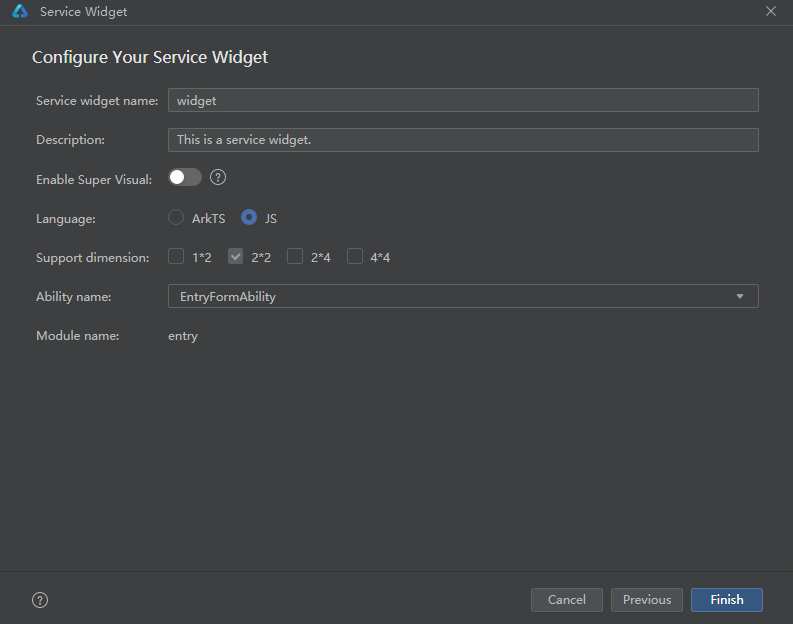
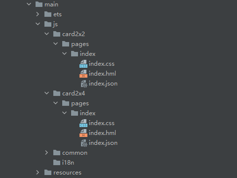
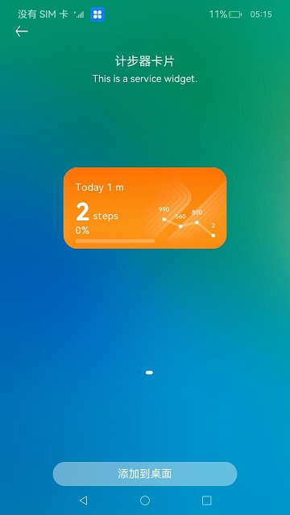

# 计步器卡片（JS）

## 介绍
本篇Codelab基于Stage模型实现带有卡片的计步应用，用于介绍卡片的开发及生命周期实现。需要完成以下功能：

1.  消息通知栏，通知用户今天所行走步数。
2.  元服务卡片，在桌面上添加2x2或2x4规格元服务卡片，能看到步数变化，也能看到当天所行走的进度。
3.  关系型数据库，用于查询，添加用户行走的数据。


### 相关概念

-   [消息通知](https://gitee.com/openharmony/docs/blob/master/zh-cn/application-dev/reference/apis/js-apis-notificationManager.md)：提供通知管理的能力，包括发布、取消发布通知，创建、获取、移除通知通道，订阅、取消订阅通知，获取通知的使能状态、角标使能状态，获取通知的相关信息等。
-   [关系型数据库](https://gitee.com/openharmony/docs/blob/master/zh-cn/application-dev/reference/apis/js-apis-data-relationalStore.md)：关系型数据库基于SQLite组件提供了一套完整的对本地数据库进行管理的机制，对外提供了一系列的增、删、改、查等接口，也可以直接运行用户输入的SQL语句来满足复杂的场景需要。
-   [元服务卡片开发](https://gitee.com/openharmony/docs/blob/master/zh-cn/application-dev/reference/apis/js-apis-app-form-formExtensionAbility.md)：卡片是一种界面展示形式，可以将应用的重要信息或操作前置到卡片，以达到服务直达、减少体验层级的目的。
    -   卡片提供方：显示卡片内容，控制卡片布局以及控件点击事件。
    -   卡片使用方：显示卡片内容的宿主应用，控制卡片在宿主中展示的位置。
    -   卡片管理服务：用于管理系统中所添加卡片的常驻代理服务，包括卡片对象的管理与使用，以及卡片周期性刷新等。


## 环境搭建

### 软件要求

-   [DevEco Studio](https://gitee.com/openharmony/docs/blob/master/zh-cn/application-dev/quick-start/start-overview.md#%E5%B7%A5%E5%85%B7%E5%87%86%E5%A4%87)版本：DevEco Studio 3.1 Release及以上版本。
-   OpenHarmony SDK版本：API version 9及以上版本。

### 硬件要求

-   开发板类型：[润和RK3568开发板](https://gitee.com/openharmony/docs/blob/master/zh-cn/device-dev/quick-start/quickstart-appendix-rk3568.md)。
-   OpenHarmony系统：3.2 Release及以上版本。

### 环境搭建

完成本篇Codelab我们首先要完成开发环境的搭建，本示例以**RK3568**开发板为例，参照以下步骤进行：

1. [获取OpenHarmony系统版本](https://gitee.com/openharmony/docs/blob/master/zh-cn/device-dev/get-code/sourcecode-acquire.md#%E8%8E%B7%E5%8F%96%E6%96%B9%E5%BC%8F3%E4%BB%8E%E9%95%9C%E5%83%8F%E7%AB%99%E7%82%B9%E8%8E%B7%E5%8F%96)：标准系统解决方案（二进制）。以3.2 Release版本为例：

   

2. 搭建烧录环境。

   1.  [完成DevEco Device Tool的安装](https://gitee.com/openharmony/docs/blob/master/zh-cn/device-dev/quick-start/quickstart-ide-env-win.md)
   2.  [完成RK3568开发板的烧录](https://gitee.com/openharmony/docs/blob/master/zh-cn/device-dev/quick-start/quickstart-ide-3568-burn.md)

3. 搭建开发环境。

   1.  开始前请参考[工具准备](https://gitee.com/openharmony/docs/blob/master/zh-cn/application-dev/quick-start/start-overview.md#%E5%B7%A5%E5%85%B7%E5%87%86%E5%A4%87)，完成DevEco Studio的安装和开发环境配置。
   2.  开发环境配置完成后，请参考[使用工程向导](https://gitee.com/openharmony/docs/blob/master/zh-cn/application-dev/quick-start/start-with-ets-stage.md#创建ets工程)创建工程（模板选择“Empty Ability”）。
   3.  工程创建完成后，选择使用[真机进行调测](https://gitee.com/openharmony/docs/blob/master/zh-cn/application-dev/quick-start/start-with-ets-stage.md#使用真机运行应用)。

## 代码结构解读

本篇Codelab只对核心代码进行讲解，对于完整代码，我们会在gitee中提供。

```
├──entry/src/main/ets            // 代码区     
│  ├──common  
│  │  ├──bean
│  │  │  ├──ChartPoint.ets       // 图表点bean
│  │  │  ├──ChartValues.ets      // 图表值bean
│  │  │  ├──FormData.ets         // 表单数据bean
│  │  │  └──PointStyle.ets       // 图表点样式bean
│  │  ├──constants
│  │  │  └──CommonConstants.ets  // 常量类
│  │  ├──database
│  │  │  ├──Form.ets             // 数据库卡片操作
│  │  │  └──SensorData.ets       // 数据库行走步数操作 
│  │  └──utils
│  │     ├──ChartDataUtils.ets   // 图表数据操作工具类  
│  │     ├──DatabaseUtils.ets    // 数据库工具类
│  │     ├──DateUtils.ets        // 日期工具类
│  │     └──Logger.ets           // 日志打印工具类
│  ├──entryability
│  │  └──EntryAbility.ets        // 程序入口类
│  ├──entryformability
│  │  └──EntryFormAbility.ets    // 卡片创建，更新，删除操作类
│  └──pages
│     └──MainPage.ets            // 主界面
├──entry/src/main/js             // js代码区
│  ├──card2x2                    // 2x2卡片目录
│  ├──card2x4                    // 2x4卡片目录
│  ├──common                     // 卡片资源目录
│  └──i18n                       // 卡片国际化目录
└──entry/src/main/resources      // 资源文件目录
```

## 关系型数据库

元服务卡片需要用数据库保存不同时间、不同卡片的数据，而且在添加多张卡片情况下，需要保持数据同步刷新。因此需要创建两张表，一张是保存卡片信息，另一张是记录当天行走步数。

1. 数据库创建使用的SQLite。

   ```typescript
   // CommonConstants.ets
   // 表单SQLite
   static readonly CREATE_TABLE_FORM: string = 'CREATE TABLE IF NOT EXISTS Form ' +
     '(id INTEGER PRIMARY KEY AUTOINCREMENT, formId STRING, formName STRING, dimension INTEGER)';
   // 行走步数SQLite
   static readonly CREATE_TABLE_SENSOR_DATA: string = 'CREATE TABLE IF NOT EXISTS SensorData ' +
     '(id INTEGER PRIMARY KEY AUTOINCREMENT, date STRING, stepsValue INTEGER)';
   ```

2. 在EntryAbility的onCreate方法通过DatabaseUtils.createRdbStore方法创建数据库，并创建相应的表。

   ```typescript
   // EntryAbility.ets
   onCreate(want: Want) {
     globalThis.abilityWant = want;
     DatabaseUtils.createRdbStore(this.context).then((rdbStore: DataRdb.RdbStore) => {
       // 添加前三天行走模拟数据
       DatabaseUtils.addSimulationData(rdbStore);
     }).catch((error) => {
       ...
     });
   }
   ```

## 消息通知

需要在MainPage的aboutToAppear调用requestNotification方法申请通知栏权限，效果如图所示：


```typescript
// MainPage.ets
aboutToAppear() {
  // 申请通知栏权限
  this.requestNotification();
  ...
}

requestNotification() {
  Notification.requestEnableNotification().then(() => {
    ...
  }).catch((err) => {
    ...
  });
}
```

通过aboutToAppear的setInterval方法开启定时器，当定时器到10秒后，通过DatabaseUtils.sendNotifications方法发送消息到通知栏。效果如图所示：


```typescript
// DatabaseUtils.ets
// 发送通知
sendNotifications(stepsValue: string, notificationId: number) {
  // 获取当前系统语言
  let Language: string = I18n.System.getSystemLanguage();
  let notificationBarTitle: string;
  // 判断是否为中文
  if (Language.match(CommonConstants.CHINESE_LANGUAGE)) {
    notificationBarTitle = CommonConstants.NOTIFICATIONS_TITLE_GONE_TODAY_ZH + 
      stepsValue + CommonConstants.NOTIFICATIONS_TITLE_STEPS_ZH;
  } else {
    notificationBarTitle = CommonConstants.NOTIFICATIONS_TITLE_GONE_TODAY_EN + 
      stepsValue + CommonConstants.NOTIFICATIONS_TITLE_STEPS_EN;
  }
  // 构造NotificationRequest对象.
  let notificationRequest = {
    id: notificationId,
    content: {
      contentType: Notification.ContentType.NOTIFICATION_CONTENT_BASIC_TEXT,
      normal: {
        title: notificationBarTitle,
        text: ''
      }
    }
  };
  Notification.publish(notificationRequest).then(() => {
    ...
  });
}
```

## 元服务卡片

使用元服务卡片分为四步：创建、初始化、更新、删除。

### 创建元服务卡片目录

1. 在main目录下，点击鼠标右键 > New > Service Widget。

   

2. 然后选择第一个选项下面带有Hello World字样，点击下一步Next。

   

3. 填写卡片名字（Service widget name）、卡片介绍（Description）、是否开启低代码开发（Enable Super Visual）、开发语言（ArkTS和JS）、支持卡片规格（Support dimension）、关联表单（Ability name）点击Finish完成创建。如需创建多个卡片目录重新按照步骤1执行。

   

4. 创建完卡片后，同级目录出现js目录，然后开发者在js目录下使用hml+css+json开发js卡片页面。

   


### 初始化元服务卡片

应用选择添加元服务卡片到桌面后，在EntryFormAbility的onAddForm方法进行卡片初始化操作，效果如图所示：



```typescript
// EntryFormAbility.ets
onAddForm(want: Want) {
  let formId: string = want.parameters[CommonConstants.FORM_PARAM_IDENTITY_KEY] as string;
  let formName: string = want.parameters[CommonConstants.FORM_PARAM_NAME_KEY] as string;
  let dimensionFlag: number = want.parameters[CommonConstants.FORM_PARAM_DIMENSION_KEY] as number;
  // 创建数据库
  DatabaseUtils.createRdbStore(this.context).then((rdbStore: DataRdb.RdbStore) => {
    // 存储卡片信息
    let form: Form = new Form();
    form.formId = formId;
    form.formName = formName;
    form.dimension = dimensionFlag;
    ...
    DatabaseUtils.insertForm(form, rdbStore);
  }).catch((error) => {
    ...
  });
  ...
  // 初始化卡片数据
  let formData: FormData = new FormData();
  formData.percent = 0;
  formData.steps = 0;
  return FormBindingData.createFormBindingData(formData);
};
```

### 更新元服务卡片

1. 初始化加载主页面布局之前，在MainPage的aboutToAppear方法中，调用setInterval方法开启定时器。时间到则先通过DatabaseUtils.insertValues方法把步数插入到数据库，再通过DatabaseUtils.updateForms方法更新卡片步数。
   ```typescript
   // MainPage.ets
   aboutToAppear() {
     ...
     DatabaseUtils.getSensorData(globalThis.rdbStore, DateUtils.getDate(0))
       .then((sensorData: SensorData) => {
         if (sensorData != null) {
           this.stepsValue = sensorData.stepsValue;
         }
         // 开启定时器
         this.intervalId = setInterval(() => {
           ...
           DatabaseUtils.insertValues(this.stepsValue, globalThis.rdbStore);
           DatabaseUtils.updateForms(this.stepsValue,globalThis.rdbStore);
         }, CommonConstants.INTERVAL_DELAY_TIME);
       });
   }
   
   // DatabaseUtils.ets
   updateForms(stepValue: number, rdbStore: DataRdb.RdbStore) {
     let predicates: DataRdb.RdbPredicates =
       new DataRdb.RdbPredicates(CommonConstants.TABLE_FORM);
     // 查询卡片
     rdbStore.query(predicates).then((resultSet: DataRdb.ResultSet) => {
       ...
       // 查询第一行
       resultSet.goToFirstRow();
       do {
         let formId: string = resultSet.getString(resultSet.getColumnIndex(CommonConstants.FIELD_FORM_ID));
         let dimension: number = resultSet.getLong(resultSet.getColumnIndex(CommonConstants.FIELD_DIMENSION));
         ChartDataUtils.getFormData(formId, stepValue, dimension, rdbStore)
           .then((formData: FormData) => {
             // 更新多张卡片
             FormProvider.updateForm(formData.formId, FormBindingData.createFormBindingData(formData))
               .catch((error) => {
                 ...
               });
           }).catch((error) => {
           ...
           }); 
       } while (resultSet.goToNextRow());
       resultSet.close();
     }).catch((error) => {
       ...
     });
   }
   ```

2. 卡片添加到桌面后，在EntryFormAbility的onAddForm方法中，调用formProvider.setFormNextRefreshTime方法设置倒计时。时间到了则通过updateSensorData方法更新卡片步数。
   ```typescript
   // EntryFormAbility.ets
   onAddForm(want: Want) {
     ...
     // 五分钟倒计时
     formProvider.setFormNextRefreshTime(formId, CommonConstants.FIVE_MINUTES, (error, data) => {
       ...
     });
   }
   
   onUpdateForm(formId: string) {
     // 更新步数
     updateSensorData();
     ...
   }
   
   function updateSensorData() {
     DatabaseUtils.createRdbStore(this.context).then((rdbStore: DataRdb.RdbStore) => {
       ...
       // 获取今天步数
       let getSensorData: Promise<SensorData> = DatabaseUtils.getSensorData(rdbStore,
         DateUtils.getDate(0));
       getSensorData.then((sensorData: SensorData) => {
         let stepValue: number = 0;
         if (sensorData) {
           stepValue = sensorData.stepsValue;
         }
         // 更新卡片数据
         DatabaseUtils.updateForms(stepValue, rdbStore);
       }).catch((error) => {
         ...
       });
     }).catch((error) => {
       ...
     });
   }
   ```

3. 通过src/main/resources/base/profile/form_config.json配置文件，根据updateDuration或者scheduledUpdateTime字段配置刷新时间。updateDuration优先级高于scheduledUpdateTime，两者同时配置时，以updateDuration配置的刷新时间为准。当配置的刷新时间到了，系统调用onUpdateForm方法进行更新。
   ```typescript
   // form_config.json
   {
     // 卡片的类名
     "name": "card2x2",
     // 卡片的描述
     "description": "This is a service widget.",
     // 卡片对应完整路径 
     "src": "./js/card2x2/pages/index/index",
     // 定义与显示窗口相关的配置
     "window": {
       "designWidth": 720,
       "autoDesignWidth": true
     },
     // 卡片的主题样式
     "colorMode": "auto",
     // 是否为默认卡片
     "isDefault": true,
     // 卡片是否支持周期性刷新
     "updateEnabled": true,
     // 采用24小时制，精确到分钟
     "scheduledUpdateTime": "00:00",
     // 当取值为0时，表示该参数不生效，当取值为正整数N时，表示刷新周期为30*N分钟。
     "updateDuration": 1,
     // 卡片默认外观规格
     "defaultDimension": "2*2",
     // 卡片支持外观规格
     "supportDimensions": [
       "2*2"
     ]
   }
   
   // EntryFormAbility.ets
   onUpdateForm(formId: string) {
     // 更新步数
     updateSensorData();
     ...
   }
   ```

### 删除元服务卡片

当用户需要删除元服务卡片时，可以在EntryFormAbility的onRemoveForm方法中，通过DatabaseUtils.deleteFormData方法删除数据库中对应的卡片信息。
```typescript
// EntryFormAbility.ets
onRemoveForm(formId: string) {
  DatabaseUtils.createRdbStore(this.context).then((rdbStore: DataRdb.RdbStore) => {
    ...
    // 删除数据库中对应的卡片信息
    DatabaseUtils.deleteFormData(formId, rdbStore);
  }).catch((error) => {
    ...
  });
}

// DatabaseUtils.ets
deleteFormData(formId: string, rdbStore: DataRdb.RdbStore) {
  let predicates: DataRdb.RdbPredicates = new DataRdb.RdbPredicates(CommonConstants.TABLE_FORM);
  predicates.equalTo(CommonConstants.FIELD_FORM_ID, formId);
  rdbStore.delete(predicates).catch((error) => {
    ...
  });
}
```

## 总结

您已经完成了本次Codelab的学习，并了解到以下知识点：

1.  使用notification发布通知。
2.  使用关系型数据库插入、更新、删除卡片数据。
3.  使用FormExtensionAbility创建、更新、删除元服务卡片。


