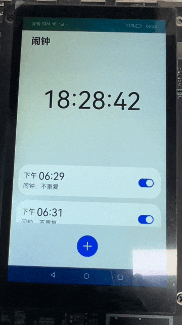
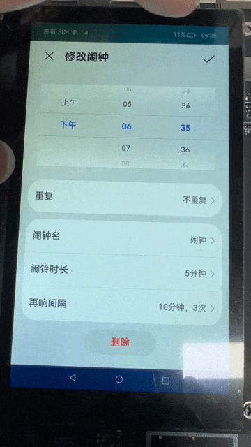

# 闹钟（ArkTS）

## 介绍
本篇Codelab将介绍如何使用后台代理提醒，实现一个简易闹钟。要求完成以下功能：
1.  展示指针表盘或数字时间。
2.  添加、修改和删除闹钟。
3.  展示闹钟列表，并可打开和关闭单个闹钟。
4.  闹钟到设定的时间后弹出提醒。
5.  将闹钟的定时数据保存到轻量级数据库。


### 相关概念

-   [Canvas](https://gitee.com/openharmony/docs/blob/master/zh-cn/application-dev/reference/arkui-ts/ts-components-canvas-canvas.md)：提供画布组件，用于自定义绘制图形。
-   [CanvasRenderingContext2D](https://gitee.com/openharmony/docs/blob/master/zh-cn/application-dev/reference/arkui-ts/ts-canvasrenderingcontext2d.md)：使用RenderingContext在Canvas组件上进行绘制，绘制对象可以是矩形、文本、图片等。
-   [后台代理提醒](https://gitee.com/openharmony/docs/blob/master/zh-cn/application-dev/task-management/reminder-agent-development.md)：开发应用时，开发者可以调用后台提醒发布的接口创建定时提醒，包括倒计时、日历、闹钟三种提醒类型。使用后台代理提醒能力后，应用可以被冻结或退出，计时和弹出提醒的功能将被后台系统服务代理。本应用中主要使用到后台代理提醒的两个接口：
    -   **publishReminder**
        发布一个后台代理提醒，使用callback方式实现异步调用，该方法需要申请通知弹窗Notification.requestEnableNotification后才能调用。
    -   **cancelReminder**
        取消指定id的提醒，使用callback方式实现异步调用。

### 相关权限

本篇Codelab需要在module.json5中配置如下权限：

```
"requestPermissions": [
  {
    "name": "ohos.permission.PUBLISH_AGENT_REMINDER"
  }
]
```

## 环境搭建


### 软件要求

-   [DevEco Studio](https://gitee.com/openharmony/docs/blob/master/zh-cn/application-dev/quick-start/start-overview.md#%E5%B7%A5%E5%85%B7%E5%87%86%E5%A4%87)版本：DevEco Studio 3.1 Release。
-   OpenHarmony SDK版本：API version 9。

### 硬件要求

-   开发板类型：[润和RK3568开发板](https://gitee.com/openharmony/docs/blob/master/zh-cn/device-dev/quick-start/quickstart-appendix-rk3568.md)。
-   OpenHarmony系统：3.2 Release。

### 环境搭建

完成本篇Codelab我们首先要完成开发环境的搭建，本示例以**RK3568**开发板为例，参照以下步骤进行：

1.  [获取OpenHarmony系统版本](https://gitee.com/openharmony/docs/blob/master/zh-cn/device-dev/get-code/sourcecode-acquire.md#%E8%8E%B7%E5%8F%96%E6%96%B9%E5%BC%8F3%E4%BB%8E%E9%95%9C%E5%83%8F%E7%AB%99%E7%82%B9%E8%8E%B7%E5%8F%96)：标准系统解决方案（二进制）。以3.2 Release版本为例：

    

2.  搭建烧录环境。
    1.  [完成DevEco Device Tool的安装](https://gitee.com/openharmony/docs/blob/master/zh-cn/device-dev/quick-start/quickstart-ide-env-win.md)
    2.  [完成RK3568开发板的烧录](https://gitee.com/openharmony/docs/blob/master/zh-cn/device-dev/quick-start/quickstart-ide-3568-burn.md)

3.  搭建开发环境。
    1.  开始前请参考[工具准备](https://gitee.com/openharmony/docs/blob/master/zh-cn/application-dev/quick-start/start-overview.md#%E5%B7%A5%E5%85%B7%E5%87%86%E5%A4%87)，完成DevEco Studio的安装和开发环境配置。
    2.  开发环境配置完成后，请参考[使用工程向导](https://gitee.com/openharmony/docs/blob/master/zh-cn/application-dev/quick-start/start-with-ets-stage.md#创建ets工程)创建工程（模板选择“Empty Ability”）。
    3.  工程创建完成后，选择使用[真机进行调测](https://gitee.com/openharmony/docs/blob/master/zh-cn/application-dev/quick-start/start-with-ets-stage.md#使用真机运行应用)。


## 代码结构解读

本篇Codelab只对核心代码进行讲解，对于完整代码，我们会在gitee中提供。

```
├──entry/src/main/ets                       // 代码区    
│  ├──common
│  │  ├──constants
│  │  │  ├──AlarmSettingType.ets            // 闹钟设置类型枚举
│  │  │  ├──CommonConstants.ets             // 公共常量类
│  │  │  ├──DetailConstant.ets              // 详情页常量类
│  │  │  └──MainConstant.ets                // 首页常量类
│  │  └──utils
│  │     ├──DataTypeUtils.ets               // 数据类型工具类
│  │     ├──DimensionUtil.ets               // 屏幕适配工具类
│  │     └──GlobalContext.ets               // 全局变量工具类
│  ├──entryability
│  │  └──EntryAbility.ets                   // 程序入口类
│  ├──model
│  │  ├──database
│  │  │  ├──PreferencesHandler.ets          // 轻量级数据库操作类
│  │  │  └──PreferencesListener.ets         // 轻量级数据库回调接口   
│  │  └──ReminderService.ets                // 系统后台提醒服务类   
│  │──pages
│  │  ├──DetailIndex.ets                    // 详情页入口文件
│  │  └──MainIndex.ets                      // 主页入口文件
│  │──view
│  │  ├──Detail     
│  │  │  ├──dialog
│  │  │  │  ├──CommonDialog.ets             // 公共Dialog组件
│  │  │  │  ├──DurationDialog.ets           // 闹铃时长选择Dialog组件
│  │  │  │  ├──IntervalDialog.ets           // 闹铃间隔选择Dialog组件
│  │  │  │  ├──RenameDialog.ets             // 闹铃名设置Dialog组件
│  │  │  │  └──RepeatDialog.ets             // 闹铃重复设置Dialog组件
│  │  │  ├──DatePickArea.ets                // 详情页时间选择组件
│  │  │  └──SettingItem.ets                 // 详情页设置组件
│  │  ├──Main    
│  │  │  ├──AlarmList.ets                   // 主页闹钟列表组件
│  │  │  ├──AlarmListItem.ets               // 主页闹钟列表子项组件
│  │  │  └──ClockArea.ets                   // 主页时钟组件
│  │  └──BackContainer.ets                  // 自定义头部组件
│  └──viewmodel
│     ├──AlarmItemBean.ets                  // 闹钟属性类
│     ├──AlarmSettingBean.ets               // 闹钟设置属性类
│     ├──DayDateBean.ets                    // 日期属性类
│     ├──DetailViewModel.ets                // 详情模块逻辑功能类   
│     ├──MainViewModel.ets                  // 主页逻辑功能类
│     └──ReminderItemBean.ets               // 后台提醒属性类
└──entry/src/main/resources                 // 资源文件目录
```

## 闹钟主界面

闹钟界面包括当前时间、闹钟列表、添加闹钟子组件，具体包括以下模块：

-   展示当前时间。
-   展示闹钟列表。
-   添加闹钟。
-   后台代理提醒。


### 展示当前时间

当前时间使用了Canvas组件绘制，默认展示指针表盘，点击表盘区域切换为数字时钟。



在主页的ClockArea组件中初始化Canvas画布，并绑定指针表盘和数字时钟切换事件。

```typescript
// ClockArea.ets
@Component
export default struct ClockArea {
  ...
  build() {
    Canvas(this.renderContext)
      .width(this.canvasSize)
      .aspectRatio(CommonConstants.DEFAULT_LAYOUT_WEIGHT)
      .onReady(() => {
        if (this.drawInterval === CommonConstants.DEFAULT_NUMBER_NEGATIVE) {
          this.startDrawTask();
        }
      })
      .onClick(() => {
        this.showClock = !this.showClock;
      })
  }
  // 启动绘画任务
  private startDrawTask() {
    let that = this;
    that.renderContext.translate(
      this.canvasSize / CommonConstants.DEFAULT_DOUBLE,
      this.canvasSize / CommonConstants.DEFAULT_DOUBLE);
    that.drawClockArea();
    this.drawInterval = setInterval(() => {
      that.drawClockArea();
    }, MainConstant.DEFAULT_ONE_SECOND_MS);
  }
  ...      
}
```


绘画任务是使用CanvasRenderingContext2D对象在Canvas画布组件上绘制指针表盘和数字时钟。

```typescript
// ClockArea.ets
// 开始绘制时钟区域
private drawClockArea(): void{
  this.renderContext.clearRect(
    -this.canvasSize,
    -this.canvasSize / CommonConstants.DEFAULT_DOUBLE,
    this.canvasSize * CommonConstants.DEFAULT_DOUBLE,
    this.canvasSize);
  let date = new Date();
  let hours = date.getHours();
  let minutes = date.getMinutes();
  let seconds = date.getSeconds();
  if (this.showClock) {
    // 绘制表盘时钟
  } else {
    // 绘制数字时钟
  }
}
```
### 展示闹钟列表

闹钟列表组件，展示已添加的闹钟信息，可对闹钟进行启停操作，点击闹钟可跳转到闹钟操作界面（修改和删除闹钟）。主页启动后获取轻量级数据库中的闹钟定时数据，并监控数据库数据变化。

```typescript
// MainViewModel.ets
public queryAlarmsTasker(callback: (alarms: Array<AlarmItem>) => void) {
  let that = this;
  that.queryDatabaseAlarms(callback);
  let preference = GlobalContext.getContext().getObject('preference') as PreferencesHandler;
  preference.addPreferencesListener({
    onDataChanged() {
      that.queryDatabaseAlarms(callback);
    }
  } as PreferencesListener)
}
```

在AlarmList.ets中添加闹钟列表子组件，并绑定启停、跳转事件。

```typescript
// AlarmList.ets
@Component
export default struct AlarmList {
  @Link alarmItems: Array<AlarmItem>;

  build() {
    List({ space: DimensionUtil.getVp($r('app.float.alarm_list_space')) }) {
      ForEach(this.alarmItems, (item: AlarmItem) => {
        ListItem() {
          AlarmListItem({ alarmItem: item })
        }.onClick(() => {
          router.pushUrl({ url: "pages/DetailIndex", params: { alarmItem: item } });
        })
      }, (item: AlarmItem) => JSON.stringify(item))
    }
    .padding({
      left: DimensionUtil.getVp($r('app.float.alarm_list_content_distance')),
      right: DimensionUtil.getVp($r('app.float.alarm_list_content_distance'))
    })
    .listDirection(Axis.Vertical)
    .layoutWeight(CommonConstants.DEFAULT_LAYOUT_WEIGHT)
    .margin({ top: DimensionUtil.getVp($r('app.float.alarm_list_content_distance')) })
  }
}
```
### 添加闹钟

添加闹钟，点击界面底部闹钟添加按钮，跳转到闹钟操作界面（新增闹钟）。


在MainIndex.ets中为添加按钮绑定跳转事件。

```typescript
// MainIndex.ets
@Entry
@Component
struct MainIndex {
  ...
  build() {
    Column() {
	  ...
      Button() {
        Image($r('app.media.ic_add')).objectFit(ImageFit.Fill)
      }
      ...
      .onClick(() => {
        router.pushUrl({ url: "pages/DetailIndex" });
      })
    }
    ...
  }
}
```
### 后台代理提醒

后台代理提醒，根据闹钟列表中的数据来设置（启停）闹钟实例。

```typescript
// MainViewModel.ets
// 开启/关闭闹钟
public openAlarm(id: number, isOpen: boolean) {
  for (let i = 0; i < this.alarms.length; i++) {
    if (this.alarms[i].id === id) {
      this.alarms[i].isOpen = isOpen;
      if (isOpen) {
        this.reminderService.addReminder(this.alarms[i]);
      } else {
        this.reminderService.deleteReminder(this.alarms[i].id);
      }
      let preference = GlobalContext.getContext().getObject('preference') as PreferencesHandler;
      preference.set(CommonConstants.ALARM_KEY, JSON.stringify(this.alarms));
      break;
    }
  }
}
```
## 闹钟详情界面

闹钟操作界面分为新增和修改界面，其中在修改界面可删除闹钟。具体包括以下模块：

-   退出或保存详情。
-   设置闹钟时间。
-   设置闹钟详情。
-   提供后台代理提醒能力


### 退出或保存详情

点击左上角“x”图标关闭操作界面，关闭闹钟操作界面子组件，点击右上角“√”图标，保存当前设置并关闭操作界面。



在DetailIndex.ets入口页面中引入头部组件BackContainer，自定义了返回按钮和返回逻辑操作，添加确定（“√”）子组件，并绑定点击事件。

```typescript
// DetailIndex.ets
build()
{
  Column() {
    ...
    Button() {
      Image($r('app.media.ic_confirm')).objectFit(ImageFit.Fill)
    }
    .backgroundColor($r('app.color.trans_parent'))
    .width(DimensionUtil.getVp($r('app.float.title_button_size')))
    .height(DimensionUtil.getVp($r('app.float.title_button_size')))
    .onClick(() => {
      this.viewModel.setAlarmRemind(this.alarmItem);
      router.back();
    })
    ...
  }
}

// BackContainer.ets
build() {
  Row() {
    ...
    Text(this.header)
      .fontSize(DimensionUtil.getFp($r('app.float.detail_title_font_size')))
      .lineHeight(DimensionUtil.getVp($r('app.float.title_line_height')))
      .margin({ left: DimensionUtil.getVp($r('app.float.title_margin')) })
      .fontColor($r('app.color.grey_divider'))
      .fontWeight(FontWeight.Bold)
    Blank()
    if (this.closer) {
      this.closer();
    }
  }
  .padding({
    left: DimensionUtil.getVp($r('app.float.title_horizon_margin')),
    right: DimensionUtil.getVp($r('app.float.title_horizon_margin'))
  })
  .height(DimensionUtil.getVp($r('app.float.page_title_height')))
  .width(CommonConstants.FULL_LENGTH)
}
```
### 设置闹钟时间

设置闹钟提醒时间，在闹钟操作界面可通过滑动选择器设置闹钟的提醒时间（包括：时段、小时、分钟）。详情页DetailIndex.ets中添加闹钟时间选择器子组件DatePickArea.ets。

```typescript
// DatePickArea.ets
@Component
export default struct DatePickArea {
  build() {
    Stack({ alignContent: Alignment.Center }) {
      Row() {
        ForEach(DetailConstant.DAY_DATA, (item: DayDataBean) => {
          TextPicker({ range: item.data, selected: item.delSelect })
            .layoutWeight(CommonConstants.DEFAULT_LAYOUT_WEIGHT)
            .backgroundColor($r('app.color.grey_light'))
            .onChange((value: string, index: number) => {
              item.delSelect = index;
            })
        }, (item: DayDataBean) => JSON.stringify(item))
      }
    }
    .height(DimensionUtil.getVp($r('app.float.date_picker_height')))
    .padding({
      left: DimensionUtil.getVp($r('app.float.date_picker_padding_horizon')),
      right: DimensionUtil.getVp($r('app.float.date_picker_padding_horizon'))
    })
  }
}
```

### 设置闹钟详情

点击详情页DetailIndex.ets设置条目组件SettingItem.ets，支持设置闹钟重复时间、闹钟名称、重复次数和闹铃时长。

```typescript
// SettingItem.ets
build() {
  Column() {
    ForEach(this.settingInfo, (item: AlarmSettingBean, index: number | undefined) => {
      Divider()
      ...
      Row() {
        Text(item.title)...
        Text(item.content)...
        Image($r('app.media.ic_right'))...
      }
      ...
      .onClick(() => {
        this.showSettingDialog(item.sType);
      })
    }, (item: AlarmSettingBean, index: number | undefined) => JSON.stringify(item) + index)
  }
  ...
}
```

### 提供后台代理提醒能力

导入系统提醒服务类ReminderService.ets，它由系统后台代理提醒能力封装，支持新增、修改、删除系统闹钟功能，在设置、删除闹钟后同步更新到轻量级数据库中并刷新主页页面。

```typescript
// DetailViewModel.ets
public async setAlarmRemind(alarmItem: AlarmItem) {
  alarmItem.hour = this.getAlarmTime(CommonConstants.DEFAULT_SINGLE);
  alarmItem.minute = this.getAlarmTime(CommonConstants.DEFAULT_DATA_PICKER_HOUR_SELECTION);
  let index = await this.findAlarmWithId(alarmItem.id);
  if (index !== CommonConstants.DEFAULT_NUMBER_NEGATIVE) { // 已存在，删除原有提醒
    this.reminderService.deleteReminder(alarmItem.id);
  } else { // 不存在，以数据长度为notificationId新增闹钟数据
    index = this.alarms.length;
    alarmItem.notificationId = index;
    this.alarms.push(alarmItem);
  }
  this.reminderService.addReminder(alarmItem, (newId: number) => {
    alarmItem.id = newId;
    alarmItem.isOpen = true;
    this.alarms[index] = alarmItem;
    let preference = GlobalContext.getContext().getObject('preference') as PreferencesHandler;
    preference.set(CommonConstants.ALARM_KEY, JSON.stringify(this.alarms));
  })
}

public async removeAlarmRemind(id: number) {
  this.reminderService.deleteReminder(id);
  let index = await this.findAlarmWithId(id);
  if (index !== CommonConstants.DEFAULT_NUMBER_NEGATIVE) {
    this.alarms.splice(index, CommonConstants.DEFAULT_SINGLE);
  }
  let preference = GlobalContext.getContext().getObject('preference') as PreferencesHandler;
  preference.set(CommonConstants.ALARM_KEY, JSON.stringify(this.alarms));
}
```

## 总结

您已经完成了本次Codelab的学习，并了解到以下知识点：

1.  Canvas画布组件的使用。
2.  后台代理提醒的使用。

