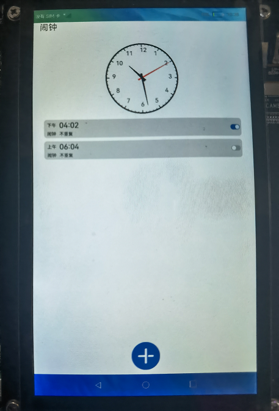
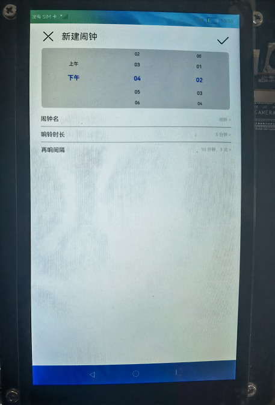
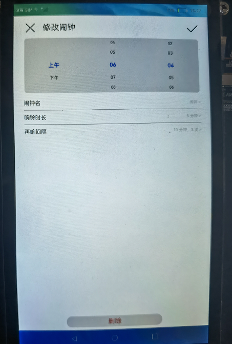
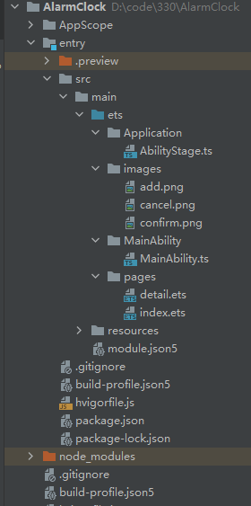

# 介绍

本篇Codelab是基于TS扩展的声明式开发范式及OpenHarmony的后台代理提醒能力实现的一个简单闹钟的示例。

本篇Codelab实现如下功能：

-   展示指针表盘和数字时间。
-   添加、修改和删除闹钟。
-   展示闹钟列表，并可打开和关闭单个闹钟。
-   闹钟到设定的时间后进行后台代理提醒。
-   闹钟定时数据保存到首选项数据库中。

最终效果图如下：

   

# 相关概念

-   [Canvas](https://gitee.com/openharmony/docs/blob/master/zh-cn/application-dev/reference/arkui-js/js-components-canvas-canvas.md)：提供画布组件，用于自定义绘制图形。
-   [后台代理提醒](https://gitee.com/openharmony/docs/blob/master/zh-cn/application-dev/reference/apis/js-apis-reminderAgent.md)：发布一个后台代理提醒。
-   [TextPicker](https://gitee.com/openharmony/docs/blob/master/zh-cn/application-dev/reference/arkui-ts/ts-basic-components-textpicker.md)：文本类滑动选择器组件。
-   [CustomDialog](https://developer.harmonyos.com/cn/docs/documentation/doc-guides/ts-component-based-customdialog-0000001192355895)：@CustomDialog装饰器用于装饰自定义弹窗。
-   [首选项](https://gitee.com/openharmony/docs/blob/master/zh-cn/application-dev/reference/apis/js-apis-data-preferences.md#flush)：为应用提供key-value键值型的数据处理能力，支持应用持久化轻量级数据，并对其修改和查询。

# 搭建OpenHarmony环境

完成本篇Codelab我们首先要完成开发环境的搭建，本示例以**RK3568**开发板为例，参照以下步骤进行：

1.  [获取OpenHarmony系统版本](https://gitee.com/openharmony/docs/blob/master/zh-cn/device-dev/get-code/sourcecode-acquire.md#%E8%8E%B7%E5%8F%96%E6%96%B9%E5%BC%8F3%E4%BB%8E%E9%95%9C%E5%83%8F%E7%AB%99%E7%82%B9%E8%8E%B7%E5%8F%96)：标准系统解决方案（二进制）。

    以3.1版本为例：

    

2.  搭建烧录环境。
    1.  [完成DevEco Device Tool的安装](https://gitee.com/openharmony/docs/blob/master/zh-cn/device-dev/quick-start/quickstart-standard-env-setup.md)
    2.  [完成RK3568开发板的烧录](https://gitee.com/openharmony/docs/blob/master/zh-cn/device-dev/quick-start/quickstart-ide-standard-running-rk3568-burning.md)

3.  搭建开发环境。
    1.  开始前请参考[工具准备](https://gitee.com/openharmony/docs/blob/master/zh-cn/application-dev/quick-start/start-overview.md#%E5%B7%A5%E5%85%B7%E5%87%86%E5%A4%87)，完成DevEco Studio的安装和开发环境配置。
    2.  开发环境配置完成后，请参考[使用工程向导](https://gitee.com/openharmony/docs/blob/master/zh-cn/application-dev/quick-start/start-with-ets-stage.md#%E5%88%9B%E5%BB%BAets%E5%B7%A5%E7%A8%8B)创建工程（模板选择“Empty Ability”），选择JS或者eTS语言开发。
    3.  工程创建完成后，选择使用[真机进行调测](https://gitee.com/openharmony/docs/blob/master/zh-cn/application-dev/quick-start/start-with-ets-stage.md#%E4%BD%BF%E7%94%A8%E7%9C%9F%E6%9C%BA%E8%BF%90%E8%A1%8C%E5%BA%94%E7%94%A8)。

# 代码结构解读



-   AppScope：App作用域目录。
-   entry/src/main/ets：程序目录。
    -   Application：stage模型目录。
        -   AbilityStage.ts：stage模型文件。

    -   images：本篇Codelab对应demo中用到的图标。
    -   MainAbility：程序入口目录。
        -   MainAbility.ts：程序入口类。

    -   pages：界面目录。
        -   detail.ets：详情界面。
        -   index.ets：主界面。


-   entry/src/main/resources：资源文件目录。
-   entry/src/main/module.json5：应用配置文件。
-   entry/src/build-profile.json5：应用构建配置文件。
-   build-profile.json5：版本信息配置文件。

# 相关权限

本篇Codelab需要在module.json5中配置如下权限：

```
"requestPermissions" :[
  {
    // 后台代理提醒权限
    "name": "ohos.permission.PUBLISH_AGENT_REMINDER"
  }
]
```

# 闹钟主界面

闹钟界面包括当前时间、闹钟列表、添加闹钟子组件，具体包括以下模块：

1.  Canvas组件，默认展示指针表盘，指针表盘与数字时钟可通过点击屏幕来回切换。如下图所示：

    

    在index.ets中获取屏幕宽高，根据屏幕宽高设置Canvas画布尺寸，并将原点移到画布中间，示例代码如下：

    ```
    aboutToAppear(){
      // 从首选项数据库获取数据
      this.getDate()
      // 获取屏幕宽高
      display.getDefaultDisplay((err, data) => {
        if(err.code === 0) {
          console.info('Failed to obtain the default display object. Code:  ' + JSON.stringify(err))
        }
        this.screenWidth = data.width
        this.screenHeight = data.height
        // 设置canvas尺寸，竖屏取值为宽高最小值的1/3，横屏取值为宽高最小值的1/4
        this.canvasOnScreenRatio = (this.screenWidth < this.screenHeight ? 3 : 4)
        this.size = (this.screenWidth < this.screenHeight ? this.screenWidth : this.screenHeight) / this.canvasOnScreenRatio
        // 重置原点到canvas画布中间
        this.context.translate(this.size, this.size / 2)
      });
    }
    ```

    在index.ets中初始化Canvas画布，并绑定指针表盘和数字时钟切换事件，示例代码如下：

    ```
    Canvas(this.context)
      .height(this.size)
      .aspectRatio(2.0)
      .onReady(() =>{
        // 获取半径
        this.radius = this.size / 2 - 2.5
        var that = this
        // 避免时钟闪现，先画一遍
        that.draw()
        // 定时器
        this.interval = setInterval(function() {
          that.draw()
        }, 1000)
      })
      .onClick(() => {
        // 切换指针表盘和数字时钟
        this.showClock = !this.showClock
      })
    ```

    在index.ets中利用Canvas画布组件绘制指针表盘和数字时钟，示例代码如下：

    ```
    // 开始绘制
    private draw(): void{
      // 清空绘制
      this.context.clearRect(-this.size, this.size / -2, this.size * 2, this.size)
      // 获取当前时间
      let date = new Date()
      if(this.showClock) {
        // 画表盘
        this.drawDials()
        // 画秒针
        this.drawSecond(date.getSeconds())
        // 画分针
        this.drawMinute(date.getMinutes(), date.getSeconds())
        // 画时针
        this.drawHour(date.getHours(), date.getMinutes())
      } else {
        this.drawTime(date.getHours().toString(), date.getMinutes().toString(), date.getSeconds().toString())
      }
    }
    
    // 画时间
    private drawTime(hour: string, minute: string, second: string): void{
      let time = this.fillZero(hour) + ':' + this.fillZero(minute) + ':' + this.fillZero(second)
      this.context.save()
      this.context.font = '100px'
      this.context.beginPath()
      this.context.textAlign = 'center'
      this.context.fillText(time, 0, 0)
      this.context.restore()
    }
    
    // 补零：HH:mm:ss
    private fillZero(val): string{
      var len = val.length;
      while(len < 2) {
        val = "0" + val;
        len++;
      }
      return val;
    }
    
    // 画表盘
    private drawDials(): void{
      // 画原点
      this.context.save()
      this.context.beginPath()
      this.context.arc(0, 0, 5, 0, Math.PI * 2)
      this.context.fill()
      this.context.stroke()
      this.context.restore()
      // 字体大小
      this.context.font = '20px'
      // 画圆
      this.context.save()
      this.context.lineWidth = 5
      this.context.beginPath()
      this.context.arc(0, 0, this.radius, 0, 2 * Math.PI)
      this.context.stroke()
      this.context.restore()
    
      // 画刻度
      for (let n = 1; n <= 60; n++) {
        // 从三点钟方向开始获取60个刻度的角度
        var theta = (n - 3) * (Math.PI * 2) / 60;
        this.context.save()
        // 刻度宽度为2
        this.context.lineWidth = 2
        this.context.beginPath()
        // 刻度起始位置
        var x_move = this.radius * Math.cos(theta);
        var y_move = this.radius * Math.sin(theta);
        // 非整点刻度结束位置
        var x_to = (this.radius - 5) * Math.cos(theta);
        var y_to = (this.radius - 5) * Math.sin(theta);
        // 整点刻度
        if((n-3) % 5 == 0) {
          //整点刻度宽度
          this.context.lineWidth = 3
          // 整点刻度结束位置
          x_to = (this.radius - 10) * Math.cos(theta);
          y_to = (this.radius - 10) * Math.sin(theta);
          // 整点时间位置
          var x_time = (this.radius - 25) * Math.cos(theta);
          var y_time = (this.radius - 25) * Math.sin(theta);
          // 绘制整点时间
          this.context.fillText(this.times[(n - 3) / 5] + '', x_time - 5, y_time + 3)
        }
        // 绘制刻度线
        this.context.moveTo(x_move, y_move)
        this.context.lineTo(x_to, y_to)
        this.context.stroke()
        this.context.restore()
      }
    }
    
    // 画秒针
    private drawSecond(second: number): void{
      this.context.save()
      this.context.fillStyle = 'red'
      var theta = (second - 15) * 2 * Math.PI / 60;
      this.context.rotate(theta)
      this.context.beginPath()
      this.context.moveTo(-15, -3);
      this.context.lineTo(-15, 3);
      this.context.lineTo(this.radius * 0.9, 1);
      this.context.lineTo(this.radius * 0.9, -1);
      this.context.fill();
      this.context.restore();
    }
    
    // 画分针
    private drawMinute(minute: number, second: number): void{
      this.context.save()
      var theta = ((minute + second / 60 - 15) * 2 * Math.PI / 60)
      this.context.rotate(theta)
      this.context.beginPath()
      this.context.moveTo(-15, -4);
      this.context.lineTo(-15, 4);
      this.context.lineTo(this.radius * 0.8, 1);
      this.context.lineTo(this.radius * 0.8, -1);
      this.context.fill();
      this.context.restore();
    }
    
    // 画时针
    private drawHour(hour:number, minute: number): void{
      this.context.save()
      var theta = ((hour + minute / 60 - 3) * 2 * Math.PI / 12)
      this.context.rotate(theta)
      this.context.beginPath()
      this.context.moveTo(-15, -5);
      this.context.lineTo(-15, 5);
      this.context.lineTo(this.radius * 0.5, 1);
      this.context.lineTo(this.radius * 0.5, -1);
      this.context.fill();
      this.context.restore();
    }
    ```

2.  闹钟列表，展示已添加的闹钟信息，可对闹钟进行启停操作，点击闹钟可跳转到闹钟操作界面（修改和删除闹钟）。如下图所示：

     

    在index.ets中添加闹钟列表子组件，并绑定启停、跳转事件，示例代码如下：

    ```
    List({ space: 10, initialIndex: 0 }) {
      ForEach(this.clockItems.map((item, index) => {
        return { i: index, data: item }
      }),
        (item, index) => {
          ListItem() {
            Stack({alignContent: Alignment.End}) {
              Column() {
                Row() {
                  Text(item.data.partition).fontSize(15)
                  Text(item.data.hour+ ':' + item.data.minute).fontSize(25).margin({left: 10})
                }
                Row() {
                  Text(item.data.name).fontSize(15)
                  Text('不重复').fontSize(15).margin({left: 10})
                }.margin({top: 5})
              }
              .width('100%')
              .margin({left: 10})
              .alignItems(HorizontalAlign.Start)
              Toggle({ type: ToggleType.Switch, isOn: item.data.open })
                .selectedColor(0x39a2db)
                .switchPointColor(0xe5ffffff)
                .onChange((isOn: boolean) => {
                  item.data.open = isOn
                  console.info('Component status:' + isOn)
                  // 关闭、打开闹钟
                  this.modifyMsg = [isOn ? 0 : 2, index, item.data.reminderId]
                  this.resetAlarm()
                })
                .width(30)
                .aspectRatio(1.0)
            }
            .width('90%')
            .height(60)
            .backgroundColor('#E2E2E2')
            .borderRadius(10)
          }.width('100%')
          .onClick(() => {
            // 下标
            this.nowIndex = index
            // 展示修改界面
            this.showIndex = false
          })
        },
        item => item.data.name.toString())
    }
    .listDirection(Axis.Vertical) // 排列方向
    .flexGrow(1)
    .margin({top: 10})
    ```

3.  添加闹钟，点击界面底部闹钟添加按钮，跳转到闹钟操作界面（新增闹钟）。如下图所示：

    

    在index.ets中为添加按钮绑定跳转事件，示例代码如下：

    ```
    Image('images/add.png')
      .width(100)
      .aspectRatio(1.0)
      .margin({bottom: 10})
      .onClick(() => {
        // 新增闹钟，值为-1
        this.nowIndex = -1
        // 展示新增闹钟界面
        this.showIndex = false
      }).visibility(this.showIndex ? Visibility.Visible : Visibility.Hidden)
    ```

4.  后台代理提醒，根据闹钟列表中的数据来设置（启停）闹钟实例。

    观测闹钟数据变化（新增、修改、删除、启停），示例代码如下：

    ```
    @State @Watch("resetAlarm") clockItems: Array<ClockItem> = [] // 闹钟-定时
    
      // 观测闹钟数据变化
      private resetAlarm(): void{
        let opeNum = this.modifyMsg[0]
        let index = this.modifyMsg[1]
        let reminderId = this.modifyMsg[2]
        if(opeNum == 0) {
          // 新增
          reminderAgent.publishReminder(this.addAlarm(this.clockItems[index], index), (err, reminderId) =>{
            if(err.code == 0) {
              // 设置reminderId
              this.clockItems[index].reminderId = reminderId
            }else {
              console.info("publishReminder" + index + "error: " + err.message)
            }
          });
        } else if(opeNum == 1) {
          // 修改，先停止原先的闹钟再开启修改后的
          reminderAgent.cancelReminder(reminderId)
          reminderAgent.publishReminder(this.addAlarm(this.clockItems[index], index), (err, reminderId) =>{
            if(err.code == 0) {
              // 设置reminderId
              this.clockItems[index].reminderId = reminderId
            }else {
              console.info("publishReminder" + index + "error: " + err.message)
            }
          });
        } else {
          // 删除
          reminderAgent.cancelReminder(reminderId)
        }
      }
    ```

    新增闹钟，示例代码如下：

    ```
    private addAlarm(item: ClockItem, index: number): reminderAgent.ReminderRequestAlarm{
      return {
        reminderType: reminderAgent.ReminderType.REMINDER_TYPE_ALARM,
        // 小时
        hour: item.partition == '上午' ? parseInt(item.hour) : ((parseInt(item.hour) + 12) == 24 ? 0 : parseInt(item.hour) + 12),
        // 分钟
        minute: parseInt(item.minute),
        // 星期几
        daysOfWeek: [1, 2, 3, 4, 5, 6, 7],
        actionButton: [
          {
            title: "close",
            type: reminderAgent.ActionButtonType.ACTION_BUTTON_TYPE_CLOSE
          },
          {
            title: "snooze",
            type: reminderAgent.ActionButtonType.ACTION_BUTTON_TYPE_SNOOZE
          },
        ],
        wantAgent: {
          pkgName: "com.example.helloworld0218",
          abilityName: "com.example.helloworld0218.MainAbility"
        },
        maxScreenWantAgent: {
          pkgName: "com.example.helloworld0218",
          abilityName: "com.example.helloworld0218.MainAbility"
        },
        // 响铃时长
        ringDuration: item.duration * 60,
        // 延迟提醒次数
        snoozeTimes: item.intervalTimes,
        // 延迟提醒间隔 最小五分钟
        timeInterval: item.intervalMinute,
        title: item.name,
        content: item.partition + item.hour + ':' + item.minute,
        expiredContent: "this reminder has expired",
        snoozeContent: "remind later",
        notificationId: index,
        slotType: notification.SlotType.SOCIAL_COMMUNICATION
      }
    }
    ```

5.  首选项数据库，保存闹钟定时数据。

    保存闹钟定时数据，示例代码如下：

    ```
    private saveData() {
      let promise = data_preferences.getPreferences(globalThis.context, 'mystore')
      promise.then((preferences) => {
        let promisePut = preferences.put('data', JSON.stringify(this.objs2array()))
        promisePut.then(() => {
          preferences.flush()
          console.info("Put the value of startup successfully.")
        }).catch((err) => {
          console.info("Put the value of startup failed, err: " + err)
        })
      }).catch((err) => {
        console.info("Get the preferences failed, err: " + err)
      })
    }
    ```

    获取闹钟定时数据，示例代码如下：

    ```
    private getDate() {
      let promise = data_preferences.getPreferences(globalThis.context, 'mystore')
      promise.then((preferences) => {
        let promiseGet = preferences.get('data', '')
        promiseGet.then(value => {
          this.clockItems = JSON.parse(value)
        })
      })
    }
    ```

# 闹钟操作界面

闹钟操作界面分为新增和修改界面，其中在修改界面可删除闹钟。具体分为以下模块：

1.  关闭闹钟操作界面子组件，点击左上角“x”图标关闭操作界面，点击右上角“√”图标，保存当前设置并关闭操作界面。如下图所示：

     

    在detail.ets中添加取消（“x”）、确定（“√”）子组件，并绑定点击事件，示例代码如下：

    ```
    Stack({alignContent: Alignment.End}) {
      Row() {
        // 取消
        Image('images/cancel.png')
          .width(50)
          .aspectRatio(1.0)
          .onClick(() => {
            this.cancel()
          })
        // 描述
        Text(this.nowIndex == -1 ? '新建闹钟' : '修改闹钟')
          .fontSize(30)
          .margin({left: 20})
      }
      .height('100%')
      .width('100%')
      // 确定
      Image('images/confirm.png')
        .width(50)
        .aspectRatio(1.0)
        .onClick(() => {
          this.confirm()
        })
    }
    .margin({top: 20, bottom: 15})
    .width('90%').height(50)
    
    // 确定 '√'
    private confirm(): void{
      // 新增
      if(this.nowIndex == -1) {
        // 判断当前闹钟时间是否存在
        let exist = false
        this.clockItems.forEach(item => {
          if(item.partition == this.timedArray[0] && item.hour == this.timedArray[1] && item.minute == this.timedArray[2]) {
            exist = true
            return
          }
        })
        if(exist) {
          AlertDialog.show({ message: '该时间闹钟已添加！' })
        } else {
          // 新增信息
          this.modifyMsg = [0, this.clockItems.length, this.clockItems.length]
          this.clockItems.push(new ClockItem(this.clockName, this.partitionIndex, this.timedArray[0], this.hourIndex, this.timedArray[1],
            this.minuteIndex, this.timedArray[2], this.duration, this.intervalMinute, this.intervalTimes, true))
          this.showIndex = true
        }
      } else {
        // 修改
        // 修改信息
        this.modifyMsg = [1, this.nowIndex,this.clockItems[this.nowIndex].reminderId]
        this.clockItems[this.nowIndex] = new ClockItem(this.clockName, this.partitionIndex, this.timedArray[0], this.hourIndex, this.timedArray[1],
          this.minuteIndex, this.timedArray[2], this.duration, this.intervalMinute, this.intervalTimes, true)
        this.showIndex = true
      }
    
    }
    
    // 取消 '×'
    private cancel(): void{
      this.showIndex = true
    }
    ```

2.  设置闹钟提醒时间，在闹钟操作界面可通过滑动选择器设置闹钟的提醒时间（包括：时段、小时、分钟）。如下图所示：

    

    在detail.ets中初始化时段、小时、分钟数据，示例代码如下：

    ```
    // 时段
    private partitions: string[] = ['上午', '下午']
    // 小时
    private hours: string[] = ['01', '02', '03', '04', '05', '06', '07', '08', '09', '10', '11', '12']
    // 分钟
    private minutes: string[] = ['01', '02', '03', '04', '05', '06', '07', '08', '09', '10', '11', '12',
                                 '13', '14', '15', '16', '17', '18', '19', '20', '21', '22', '23', '24',
                                 '25', '26', '27', '28', '29', '30', '31', '32', '33', '34', '35', '36',
                                 '37', '38', '39', '40', '41', '42', '43', '44', '45', '46', '47', '48',
                                 '49', '50', '51', '52', '53', '54', '55', '56', '57', '58', '59', '00',
                                ]
    ```

    在detail.ets中添加闹钟时间选择器子组件，示例代码如下：

    ```
    Row() {
      // 上午下午
      TextPicker({range: this.partitions, selected: this.partitionIndex})
        .width('33%')
        .onChange((value: string, index: number) => {
          this.timedArray[0] = value
          this.partitionIndex = index
          console.info('Picker item changed, value: ' + value + ', index: ' + index)
        })
      // 小时
      TextPicker({range: this.hours, selected: this.hourIndex})
        .width('33%')
        .onChange((value: string, index: number) => {
          this.timedArray[1] = value
          this.hourIndex = index
          console.info('Picker item changed, value: ' + value + ', index: ' + index)
        })
      // 分钟
      TextPicker({range: this.minutes, selected: this.minuteIndex})
        .width('33%')
        .onChange((value: string, index: number) => {
          this.timedArray[2] = value
          this.minuteIndex = index
          console.info('Picker item changed, value: ' + value + ', index: ' + index)
        })
    }
    .backgroundColor('#E2E2E2')
    .borderRadius(10)
    ```

3.  闹钟名子组件。如下图所示：

    

    在detail.ets中添加闹钟名子组件，点击闹钟名打设置开闹钟名弹框，示例代码如下：

    ```
    Stack({alignContent: Alignment.End}) {
      Row() {
        Text('闹钟名')
          .fontSize(20)
      }
      .height('100%')
      .width('100%')
      Text(this.clockName + ' >')
        .fontSize(15)
        .fontColor('#E2E2E2')
    }
    .width('100%')
    .height(30)
    .margin({top: 20, bottom: 10})
    .onClick(() => {
      this.dialogControllerName.open()
    })
    
    // 闹钟名弹框
    dialogControllerName : CustomDialogController = new CustomDialogController({
      builder: DialogName({action: this.onAccept}),
      autoCancel: true
    });
    
    // 闹钟名弹框
    @CustomDialog
    struct DialogName {
      @Consume clockName: string
      name: string
      controller: CustomDialogController;
      action: () => void;
    
      build() {
        Column(){
          Text('闹钟名').fontSize(20).width('90%').textAlign(TextAlign.Start).margin({top: 10})
          TextArea({text: this.clockName})
            .width('90%').margin({top: 20})
            .onChange((value: string) => {
              this.name = value
            })
          Divider().width('90%').margin({top: 10})
          Row() {
            Text('取消').fontSize(15).width('50%').textAlign(TextAlign.Center).fontColor('#17A98E')
            .onClick(() => {
              this.controller.close();
            })
            Text('确定').fontSize(15).width('50%').textAlign(TextAlign.Center).fontColor('#17A98E')
              .onClick(() => {
                this.clockName = this.name
                this.controller.close();
              })
          }.margin({top: 10, bottom: 20})
        }.width('100%')
      }
    }
    ```

4.  响铃时长子组件。如下图所示：

    

    在detail.ets中添加响铃时长文本框子组件，点击后打开响铃时长选择框，示例代码如下：

    ```
    Stack({alignContent: Alignment.End}) {
      Row() {
        Text('响铃时长')
          .fontSize(20)
      }
      .height('100%')
      .width('100%')
      Text(this.duration.toFixed(0) + ' 分钟 >')
        .fontSize(15)
        .fontColor('#E2E2E2')
    }
    .width('100%')
    .height(30)
    .margin({bottom: 10})
    .onClick(() => {
      this.dialogControllerDuration.open()
    })
    
    // 响铃时长弹框
    dialogControllerDuration : CustomDialogController = new CustomDialogController({
      builder: DialogDuration({action: this.onAccept}),
      autoCancel: true
    });
    
    // 响铃时长弹框
    @CustomDialog
    struct DialogDuration {
      @Consume duration: number
      //响铃时长，分钟
      private durations: Array<number> = [1, 5, 10, 15, 20, 30]
      controller: CustomDialogController;
      action: () => void;
    
      build() {
        Column(){
          Text('响铃时长').fontSize(20).width('90%').textAlign(TextAlign.Start).margin({top: 10, bottom: 10})
          ForEach(this.durations, item => {
            Stack({alignContent: Alignment.End}) {
              Row() {
                Text(item + ' 分钟')
              }.width('100%')
              Radio({ value: item, group: 'radioGroup' }).checked(item == this.duration ? true: false)
                .height(20)
                .width(20)
                .onChange((value: boolean) => {
                  this.controller.close();
                  this.duration = item
                })
            }.width('90%')
            Divider().width('90%')
          })
          Row() {
            Text('取消').fontSize(15).width('100%').textAlign(TextAlign.Center).fontColor('#17A98E')
              .onClick(() => {
                this.controller.close();
              })
          }.margin({top: 10, bottom: 20})
        }.width('100%')
      }
    }
    ```

5.  再响间隔子组件，包括响铃间隔时间（最少5分钟）和重复响铃次数。如下图所示：

    

    在detail.ets中添加再响间隔文本框子组件，点击后打开再响间隔弹框，示例代码如下：

    ```
    Stack({alignContent: Alignment.End}) {
      Row() {
        Text('再响间隔')
          .fontSize(20)
      }
      .height('100%')
      .width('100%')
      Text(this.intervalMinute.toFixed(0) + ' 分钟，' + this.intervalTimes.toFixed(0) + ' 次 >')
        .fontSize(15)
        .fontColor('#E2E2E2')
    }
    .width('100%')
    .height(30)
    .onClick(() => {
      this.dialogControllerInterval.open()
    })
    
    //再响间隔弹框
    dialogControllerInterval : CustomDialogController = new CustomDialogController({
      builder: DialogInterval({action: this.onAccept}),
      autoCancel: true
    });
    
    // 再响间隔弹框
    @CustomDialog
    struct DialogInterval {
      // 再响间隔分钟，默认10分钟
      @Consume intervalMinute: number
      // 再响间隔次数，默认3次
      @Consume intervalTimes: number
      // 再响间隔分钟，界面选择值
      @State intervalMinuteSelect: number = 0
      // 再响间隔次数，界面选择值
      @State intervalTimesSelect: number = 0
      controller: CustomDialogController;
      action: () => void;
    
      build() {
        Column(){
          Text('再响间隔').fontSize(20).width('90%').textAlign(TextAlign.Start).margin({top: 10})
          Text('响铃间隔时间（分钟）').fontSize(10).width('90%').textAlign(TextAlign.Start).margin({top: 10})
          Row() {
            Slider({
              value: this.intervalMinuteSelect,
              min: 5,
              max: 30,
              step: 5,
              style: SliderStyle.OutSet
            })
              .blockColor(Color.Blue)
              .trackColor(Color.Gray)
              .selectedColor(Color.Blue)
              .showSteps(true)
              .showTips(true)
              .onChange((value: number, mode: SliderChangeMode) => {
                this.intervalMinuteSelect = value
              })
            Text(this.intervalMinuteSelect.toFixed(0)).fontSize(16)
          }
          .padding({ top: 30 })
          .width('90%')
          Divider().width('90%').margin({top: 10})
          Text('重复响铃次数').fontSize(10).width('90%').textAlign(TextAlign.Start).margin({top: 10})
          Row() {
            Slider({
              value: this.intervalTimesSelect,
              min: 0,
              max: 10,
              step: 2,
              style: SliderStyle.OutSet
            })
              .blockColor(Color.Blue)
              .trackColor(Color.Gray)
              .selectedColor(Color.Blue)
              .showSteps(true)
              .showTips(true)
              .onChange((value: number, mode: SliderChangeMode) => {
                this.intervalTimesSelect = value
              })
            Text(this.intervalTimesSelect.toFixed(0)).fontSize(16)
          }
          .padding({ top: 50 })
          .width('90%')
          Row() {
            Text('取消').fontSize(15).width('50%').textAlign(TextAlign.Center).fontColor('#17A98E')
              .onClick(() => {
                this.controller.close();
              })
            Text('确定').fontSize(15).width('50%').textAlign(TextAlign.Center).fontColor('#17A98E')
              .onClick(() => {
                this.intervalMinute = this.intervalMinuteSelect
                this.intervalTimes = this.intervalTimesSelect
                this.controller.close();
              })
          }.margin({top: 10, bottom: 20})
        }.width('100%')
      }
      aboutToAppear(): void{
        // 再响间隔分钟，界面选择值
        this.intervalMinuteSelect = this.intervalMinute
        // 再响间隔次数，界面选择值
        this.intervalTimesSelect = this.intervalTimes
      }
    }
    ```

# 恭喜您

目前你已经成功完成了Codelab并且学到了：

-   如何使用Canvas画布组件绘制图形。
-   如何使用后台代理提醒。
-   如何使用TextPicker。
-   如何使用CustomDialog组件进行自定义弹框。
-   如何使用首选项数据库。