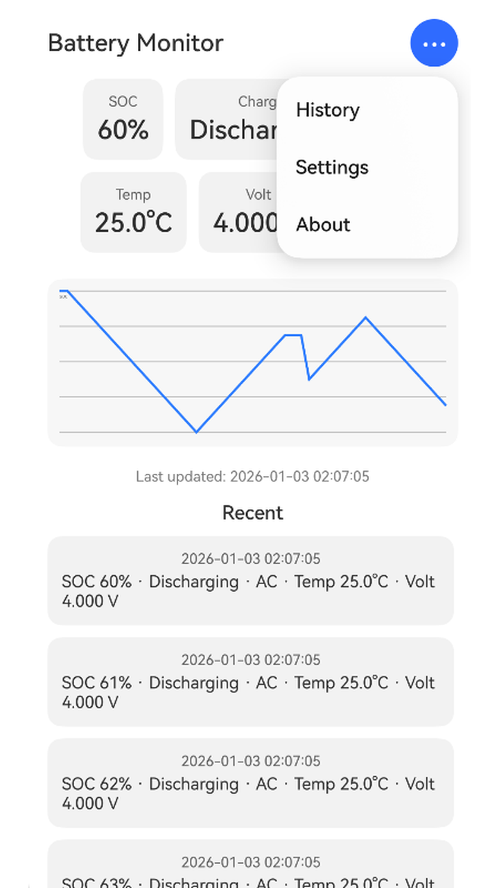
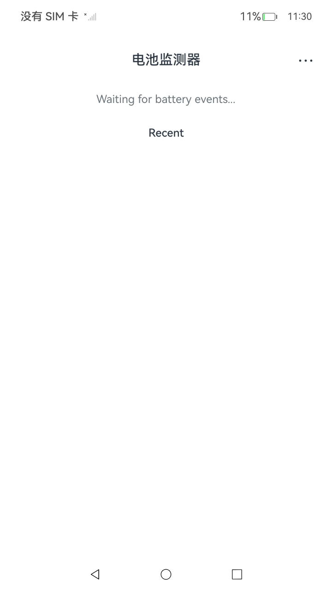
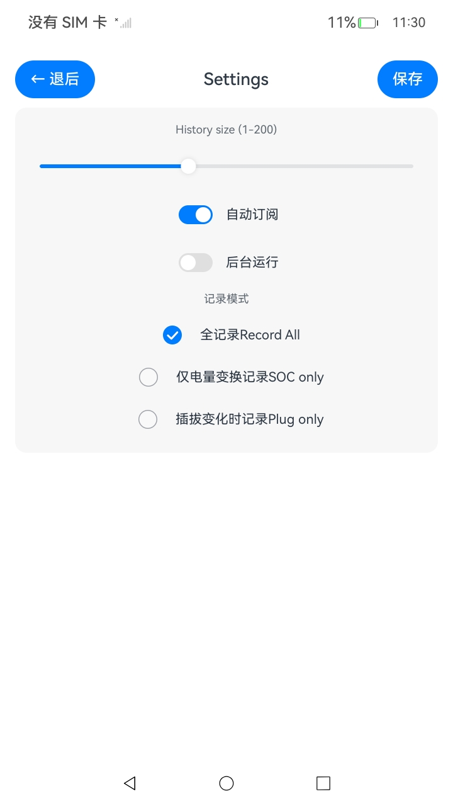

# 电池事件监控（ArkTS）
## 介绍

本篇Codelab将介绍如何使用 **commonEventManager** 订阅系统电池相关公共事件（`COMMON_EVENT_BATTERY_CHANGED`），实时展示电池状态，并将事件记录本地化保存，便于查看历史变化与趋势。

效果预览如下：

| 首页 | 首页（无电池） | 内存 | 设置 |
| ------- | ------- | ------- | ------- |
|  |  |  |  |

使用说明：

1. 主页显示电池公共事件并解析关键字段，使用统计卡片 + 趋势图展示（电量SOC、充电状态、插入类型、电压、温度、健康状态等）。
2. 右上角菜单支持查看历史记录、内存、设置与关于。
3. 内存页面展示当前进程内存信息（如PSS/VSS），并支持手动刷新。

> 若使用 DAYU200 开发板，会因为没有电池而无法获取数据，界面会一直显示 **“Waiting for battery events…”**。

### 相关概念

-   [ArkTS 语言](https://gitcode.com/openharmony/docs/blob/master/zh-cn/application-dev/quick-start/arkts-get-started.md)：OpenHarmony应用开发语言（TypeScript超集）。
-   [commonEventManager](https://gitcode.com/openharmony/docs/blob/master/zh-cn/application-dev/reference/apis-basic-services-kit/js-apis-commonEventManager.md)：公共事件的订阅与发布能力。
-   [Preferences](https://gitcode.com/openharmony/docs/blob/master/zh-cn/application-dev/reference/apis-arkdata/js-apis-data-preferences.md)：轻量级持久化存储，用于保存快照与历史缓存。
-   [RDB](https://gitcode.com/openharmony/docs/blob/master/zh-cn/application-dev/reference/apis-arkdata/js-apis-data-relationalStore.md)：关系型数据库存储，用于保存完整历史事件（本示例可选启用）。

## 环境搭建

### 软件要求

-   [DevEco Studio](https://gitcode.com/openharmony/docs/blob/master/zh-cn/application-dev/quick-start/start-overview.md#%E5%B7%A5%E5%85%B7%E5%87%86%E5%A4%87)版本：DevEco Studio 5.0 Release。
-   OpenHarmony SDK版本：API version 20。

### 硬件要求

-   开发板类型：[润和RK3568开发板](https://gitcode.com/openharmony/docs/blob/master/zh-cn/device-dev/quick-start/quickstart-appendix-rk3568.md)。
-   OpenHarmony系统：6.0 Release（Build 6.0.1.251） 。

### 环境搭建

完成本篇Codelab我们首先要完成开发环境的搭建，本示例以**RK3568**开发板为例，参照以下步骤进行：

1.  [获取OpenHarmony系统版本](https://gitcode.com/openharmony/docs/blob/master/zh-cn/device-dev/get-code/sourcecode-acquire.md#%E8%8E%B7%E5%8F%96%E6%96%B9%E5%BC%8F3%E4%BB%8E%E9%95%9C%E5%83%8F%E7%AB%99%E7%82%B9%E8%8E%B7%E5%8F%96)：标准系统解决方案（二进制）。以3.2 Release版本为例：

    

2.  搭建烧录环境。
    1. [完成DevEco Device Tool的安装](https://gitcode.com/openharmony/docs/blob/master/zh-cn/device-dev/quick-start/quickstart-ide-env-win.md)
    2.  [完成RK3568开发板的烧录](https://gitcode.com/openharmony/docs/blob/master/zh-cn/device-dev/quick-start/quickstart-ide-3568-burn.md)

3.  搭建开发环境。
    1.  开始前请参考[工具准备](https://gitcode.com/openharmony/docs/blob/master/zh-cn/application-dev/quick-start/start-overview.md#%E5%B7%A5%E5%85%B7%E5%87%86%E5%A4%87)，完成DevEco Studio的安装和开发环境配置。
    2.  开发环境配置完成后，请参考[使用工程向导](https://gitcode.com/openharmony/docs/blob/master/zh-cn/application-dev/quick-start/start-with-ets-stage.md#创建ets工程)创建工程（模板选择“Empty Ability”）。
    3.  工程创建完成后，选择使用[真机进行调测](https://gitcode.com/openharmony/docs/blob/master/zh-cn/application-dev/quick-start/start-with-ets-stage.md#使用真机运行应用)。


## 代码结构解读

本篇Codelab只对核心代码进行讲解，完整代码可直接查看工程目录。

```
entry/src/main/ets
├── pages/
│   ├── Index.ets                  // 首页：快照 + 统计卡片 + 趋势图 + 最近记录
│   ├── History.ets                // 历史列表
│   └── Detail.ets                 // 详情页（raw payload / 解析结果）
├── components/
│   ├── StatCard.ets               // 统计卡片（可点击）
│   └── TrendChart.ets             // Canvas趋势图组件
├── model/
│   ├── BatteryEnums.ets           // 枚举与文本映射（充电/健康/插入类型）
│   ├── BatteryEvent.ets           // BatterySnapshot / BatteryEvent 及 JSON 序列化
│   └── Settings.ets               // 记录策略与阈值配置（RecordMode/ThresholdRule）
├── service/
│   ├── BatteryEventService.ets    // 订阅电池公共事件并分发给仓库
│   ├── BatteryEventParser.ets     // raw -> BatterySnapshot（容错/单位换算）
│   └── BatteryEventFilter.ets     // 过滤/记录策略（决定是否写入历史）
├── repository/
│   └── BatteryEventRepository.ets // 仓库：解析、过滤、持久化、通知UI
└── data/
    ├── PreferencesStore.ets       // Preferences读写（设置/快照/历史缓存）
    └── RdbStore.ets               // RDB初始化与写入（可选）
```

从链路上看，代码分为三层：

- 事件层（`service/`）：订阅系统公共事件、接收原始参数并分发。
- 数据层（`repository/` + `data/` + `model/`）：把原始事件解析为结构化快照，执行过滤策略，并进行本地持久化。
- UI层（`pages/` + `components/`）：通过仓库监听器接收快照/历史更新并刷新页面。

## 订阅电池公共事件

订阅逻辑在 `service/BatteryEventService.ets`。核心思路是：

1. 通过 `createSubscriber` 创建订阅者，订阅 `COMMON_EVENT_BATTERY_CHANGED`。
2. 在 `subscribe` 回调里拿到 `data.parameters`（原始字段），统一转换为 `BatteryEventRawParams`，再分发给上层监听器（Repository）。

关键代码如下：

```ts
async subscribe(): Promise<void> {
  if (this.subscribed) {
    return;
  }

  const subscribeInfo: commonEventManager.CommonEventSubscribeInfo = {
    events: [COMMON_EVENT_BATTERY_CHANGED]
  };

  await new Promise<void>((resolve, reject) => {
    commonEventManager.createSubscriber(subscribeInfo, (err, subscriber) => {
      if (err) {
        Logger.e('createSubscriber failed', err);
        reject(err);
        return;
      }
      this.subscriber = subscriber;
      resolve();
    });
  });

  if (!this.subscriber) {
    return;
  }

  commonEventManager.subscribe(this.subscriber, (err, data) => {
    if (err) {
      Logger.w('subscribe callback error', err);
      return;
    }
    const params =
      (data && data.parameters) ? (data.parameters as BatteryEventRawParams)
        : ({} as BatteryEventRawParams);
    this.listeners.forEach(l => {
      try {
        l(params);
      } catch (e) {
        Logger.w('listener error', e);
      }
    });
  });

  this.subscribed = true;
  Logger.i('Subscribed battery common event');
}
```

取消订阅：

```ts
async unsubscribe(): Promise<void> {
  if (!this.subscribed || !this.subscriber) {
    return;
  }
  await commonEventManager.unsubscribe(this.subscriber);
  this.subscribed = false;
  Logger.i('Unsubscribed battery common event');
}
```

## 解析与过滤电池数据

原始参数来自系统事件，字段类型与单位可能不完全一致。示例里把“解析”和“是否记录”拆成两个模块，便于扩展与单测。

### 1. 将 raw 参数解析为快照

在 `service/BatteryEventParser.ets` 中，将 `BatteryEventRawParams` 解析成 `BatterySnapshot`，并做基础容错（范围裁剪、单位换算等）。例如：

- `temperature`：部分设备为“十分之一摄氏度”，示例中按阈值做兼容处理。
- `voltage`：部分设备可能是微伏/毫伏，示例中按阈值做兼容处理。

```ts
export class BatteryEventParser {
  parse(raw: BatteryEventRawParams): BatterySnapshot {
    const s = new BatterySnapshot();
    s.timeMs = Date.now();

    const soc = raw.soc;
    if (typeof soc === 'number') {
      s.soc = clampInt(soc, 0, 100);
    }

    const cs = raw.chargeState;
    if (typeof cs === 'number') {
      s.chargeState = clampEnum(cs, ChargeState.UNKNOWN, ChargeState.FULL) as ChargeState;
    }

    const hs = raw.healthState;
    if (typeof hs === 'number') {
      s.healthState = clampEnum(hs, HealthState.UNKNOWN, HealthState.COLD) as HealthState;
    }

    const pt = raw.pluggedType;
    if (typeof pt === 'number') {
      s.pluggedType = clampEnum(pt, PluggedType.NONE, PluggedType.WIRELESS) as PluggedType;
    }

    const temp = raw.temperature;
    if (typeof temp === 'number') {
      s.temperatureC = temp > 100 ? temp / 10.0 : temp;
    }

    const volt = raw.voltage;
    if (typeof volt === 'number') {
      s.voltageV = volt > 1000 ? volt / 1_000_000.0 : volt;
    }

    return s;
  }
}
```

快照与事件结构位于 `model/BatteryEvent.ets`，并提供 `toJson()/fromJson()` 方便落库与恢复缓存：

```ts
export class BatterySnapshot {
  public toJson(): BatterySnapshotJson {
    return {
      timeMs: this.timeMs,
      soc: this.soc,
      chargeState: this.chargeState,
      healthState: this.healthState,
      pluggedType: this.pluggedType,
      temperatureC: this.temperatureC,
      voltageV: this.voltageV,
      technology: this.technology,
      present: this.present
    };
  }

  public static fromJson(obj: BatterySnapshotJson | null): BatterySnapshot {
    const s = new BatterySnapshot();
    if (!obj) {
      return s;
    }
    // ...字段判空/类型检查
    return s;
  }
}
```


为了把枚举值显示成可读文本，`model/BatteryEnums.ets` 提供了枚举定义与文本映射函数（如 `chargeStateText/healthStateText/pluggedTypeText`），页面展示时可以直接复用：

```ts
export function chargeStateText(v: number): string {
  switch (v) {
    case ChargeState.DISCHARGING: return 'Discharging';
    case ChargeState.CHARGING: return 'Charging';
    case ChargeState.FULL: return 'Full';
    default: return 'Unknown';
  }
}
```

### 2. 记录策略与阈值过滤

示例把记录策略抽象为 `model/Settings.ets`，支持三种记录模式：

- `ALL`：记录所有事件
- `SOC_ONLY`：仅在电量变化时记录
- `PLUG_ONLY`：仅在插拔变化时记录

并提供可选阈值规则（如最小电量变化、温度上限、电压下限等）：

```ts
export enum RecordMode {
  ALL = 0,
  SOC_ONLY = 1,
  PLUG_ONLY = 2
}

export interface ThresholdRule {
  enabled: boolean;
  minSocDelta: number;
  maxTempC: number;
  minVoltV: number;
}
```

过滤逻辑位于 `service/BatteryEventFilter.ets`：根据 `Settings` 与“上一次快照”决定是否写入历史，并返回原因字符串，便于日志与调试。

```ts
export class BatteryEventFilter {
  shouldRecord(settings: Settings, current: BatterySnapshot, last: BatterySnapshot | null): FilterResult {
    if (settings.recordMode === RecordMode.SOC_ONLY) {
      if (!last) {
        return { accept: true, reason: 'first event' };
      }
      return (current.soc !== last.soc)
        ? { accept: true, reason: 'soc changed' }
        : { accept: false, reason: 'soc unchanged' };
    }

    // ...PLUG_ONLY / 阈值触发 / 记录全部
    return { accept: true, reason: 'record all' };
  }
}
```

## 记录与持久化历史

仓库层位于 `repository/BatteryEventRepository.ets`，它把“事件 -> 快照 -> 历史”串起来，并负责对外通知 UI。

初始化时会：

1. 初始化 Preferences。
2. 尝试初始化 RDB（失败则自动降级，仅使用 Preferences）。
3. 恢复 Settings、上一次快照与历史缓存。
4. 通知 UI 刷新（先发 history，再发 snapshot）。

```ts
private async initInternal(context: common.Context): Promise<void> {
  await PreferencesStore.inst.init(context);

  if (this.useRdb) {
    try {
      await RdbStore.inst.init(context);
    } catch (e) {
      Logger.w('RDB init failed; fallback to prefs only', e as Object);
      this.useRdb = false;
    }
  }

  this.settings = await PreferencesStore.inst.loadSettings();
  const last = await PreferencesStore.inst.loadSnapshot();
  if (last) {
    this.lastSnapshot = last;
  }

  const cache = await PreferencesStore.inst.loadHistoryCache();
  if (cache.length > 0) {
    this.history = cache;
  }

  this.notifyHistory();
  if (this.lastSnapshot) {
    this.notifySnapshot(this.lastSnapshot);
  }
}
```

每次收到电池事件时，流程是：解析快照、过滤决策、保存最新快照、必要时写入历史（Preferences缓存 + 可选RDB），最后通知页面刷新：

```ts
async onBatteryCommonEvent(raw: BatteryEventRawParams): Promise<void> {
  const snap = this.parser.parse(raw);
  const decision = this.filter.shouldRecord(this.settings, snap, this.lastSnapshot);

  this.lastSnapshot = snap.clone();
  this.notifySnapshot(this.lastSnapshot);
  await PreferencesStore.inst.saveSnapshot(this.lastSnapshot);

  if (!decision.accept) {
    Logger.d('Event dropped: %{public}s', decision.reason);
    return;
  }

  const id = `${snap.timeMs}_${Math.floor(Math.random() * 1000000)}`;
  const e = new BatteryEvent(id, snap.timeMs, snap.clone(), raw);

  this.history.unshift(e);
  if (this.history.length > this.settings.maxHistory) {
    this.history.pop();
  }

  await PreferencesStore.inst.saveHistoryCache(this.history);

  if (this.useRdb) {
    await RdbStore.inst.insertEvent(e);
  }

  this.notifyHistory();
}
```

### 使用 Preferences 保存设置、快照与历史缓存

`data/PreferencesStore.ets` 用于保存：

- `Settings`：记录策略、阈值与最大历史条数
- `BatterySnapshot`：最新快照（便于下次启动快速恢复）
- `BatteryEvent[]`：历史缓存（轻量化，便于快速展示）

快照读写示例：

```ts
async saveSnapshot(s: BatterySnapshot | null): Promise<void> {
  if (!this.pref) {
    return;
  }
  if (!s) {
    await this.pref.delete(KEY_SNAPSHOT);
    await this.pref.flush();
    return;
  }
  const txt = JsonUtil.safeStringify(s.toJson(), 0);
  await this.pref.put(KEY_SNAPSHOT, txt);
  await this.pref.flush();
}
```

### 使用 RDB 保存完整事件（可选）

`data/RdbStore.ets` 提供数据库初始化与事件写入。仓库在 `useRdb=true` 时会写入完整事件（包含 raw JSON），便于后续做更复杂的查询与统计。

```ts
async insertEvent(ev: BatteryEvent): Promise<void> {
  if (!this.store) {
    return;
  }
  const row: relationalStore.ValuesBucket = {} as ValuesRow as relationalStore.ValuesBucket;
  row['id'] = ev.id;
  row['timeMs'] = ev.timeMs;
  row['soc'] = ev.snapshot.soc;
  // ...其它字段
  row['raw'] = JSON.stringify(ev.raw);
  await this.store.insert(TABLE, row);
}
```

### 主页：StatCard + 趋势图

首页 `pages/Index.ets` 通过仓库监听器拿到“最新快照”和“历史列表”，并在生命周期中注册/注销监听，实现数据变更后自动刷新页面。

展示层面：

- `components/StatCard.ets` 用于展示单项指标（标题/主值/副值），支持点击交互（例如跳转详情或切换维度）。
- `components/TrendChart.ets` 使用 Canvas 绘制折线图，用于展示最近一段时间的 SOC/温度/电压等趋势。

`StatCard` 的使用示例（Index页面中会多次复用）：

```ts
StatCard({
  title: 'SOC',
  value: BatteryFormat.socText(this.snapshot.soc),
  sub: TimeUtil.timeText(this.snapshot.timeMs),
  onTap: () => this.gotoHistory()
})
```

### 历史页与详情页

历史页 `pages/History.ets` 点击某条事件后跳转详情页，并把 `eventId` 作为路由参数传递：

```ts
router.pushUrl({ url: 'pages/Detail', params: { eventId: e.id } });
```

详情页 `pages/Detail.ets` 读取路由参数并展示对应事件（包含 raw 参数与解析结果），便于排查字段差异与调试。

### 趋势图绘制（Canvas）

`components/TrendChart.ets` 会在组件尺寸就绪、数据更新时重绘：

- 先扫描数组得到 min/max
- 把数据归一化到画布坐标
- 绘制坐标轴与折线

```ts
// polyline
this.context.beginPath();
for (let i = 0; i < vs.length; i++) {
  const x = pad + (plotW * i) / (vs.length - 1);
  const y = pad + plotH - ((vs[i] - minV) / (maxV - minV)) * plotH;
  if (i === 0) {
    this.context.moveTo(x, y);
  } else {
    this.context.lineTo(x, y);
  }
}
this.context.stroke();
```
