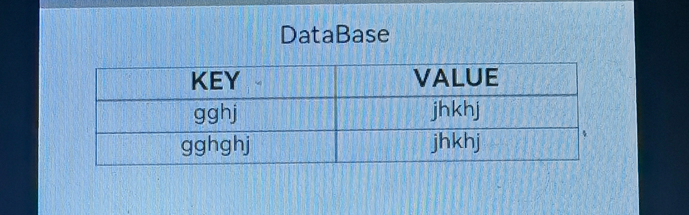
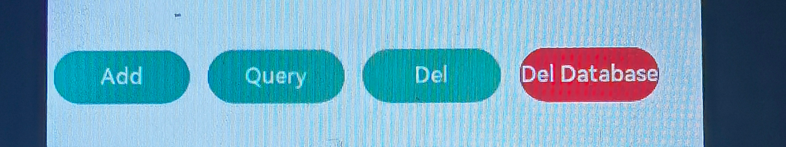

# 1.介绍

OpenHarmony在数据管理模块中提供了轻量级存储的能力。轻量级存储为应用提供key-value键值型的文件数据处理能力，支持应用对数据进行轻量级存储及查询。数据存储形式为键值对，键的类型为字符串型，值的存储数据类型包括数字型、字符型、布尔型。本篇Codelab将介绍基于JS扩展的类Web开发范式的轻量级数据库的创建、数据的增加/删除/修改/查询等操作方法，让您快速了解轻量级存储能力并能够实现数据存储。效果图如下：


# 2.相关概念

[轻量级存储](https://gitee.com/openharmony/docs/blob/master/zh-cn/application-dev/reference/apis/js-apis-data-storage.md)

# 3.搭建OpenHarmony环境

完成本篇Codelab我们首先要完成开发环境的搭建，本示例以**Hi3516DV300**开发板为例，参照以下步骤进行：

1. [获取OpenHarmony系统版本](https://gitee.com/openharmony/docs/blob/master/zh-cn/device-dev/get-code/sourcecode-acquire.md#%E8%8E%B7%E5%8F%96%E6%96%B9%E5%BC%8F3%E4%BB%8E%E9%95%9C%E5%83%8F%E7%AB%99%E7%82%B9%E8%8E%B7%E5%8F%96)：标准系统解决方案（二进制）

   以3.0版本为例：

   

2. 搭建烧录环境

   1.  [完成DevEco Device Tool的安装](https://device.harmonyos.com/cn/docs/documentation/guide/install_windows-0000001050164976)

   2.  [完成Hi3516开发板的烧录](https://device.harmonyos.com/cn/docs/documentation/guide/hi3516_upload-0000001052148681)

3. 搭建开发环境

   1.  开始前请参考[下载与安装软件](https://developer.harmonyos.com/cn/docs/documentation/doc-guides/software_install-0000001053582415)、[配置开发环境](https://gitee.com/openharmony/docs/blob/master/zh-cn/application-dev/quick-start/configuring-openharmony-sdk.md)，完成DevEco Studio的安装和开发环境配置。
   2.  开发环境配置完成后，请参考[使用工程向导](https://gitee.com/openharmony/docs/blob/master/zh-cn/application-dev/quick-start/use-wizard-to-create-project.md)创建工程，使用JS或者eTS语言开发、“Application”为例，模板选择“\[Standard\]Empty Ability”。
   3.  工程创建完成后，可参考下面章节进行代码编写，使用真机进行调测：

   -   [配置OpenHarmony应用签名信息](https://gitee.com/openharmony/docs/blob/master/zh-cn/application-dev/quick-start/configuring-openharmony-app-signature.md)
   -   [hap包安装指导](https://gitee.com/openharmony/docs/blob/master/zh-cn/application-dev/quick-start/installing-openharmony-app.md)
   -   工程示例：

   

   

# 4.任务一：完成页面布局

1. 设置标题。

   ```
   <div class="container">
       <div class="div_title">
           <text class="text_title" >DataBase</text>
       </div>
   </div>
   ```

2. 添加键值对列表表头。

   ```
   <div class="container">
       ...
       <list scrollbar="on" style="height: 200px;width: 80%;">
           <list-item>
               <div id="table" style="height: 100%">
                   <list id="table-row" style="flex-direction: column;">
                       <list-item style="width: 30%;">
                           <div class="row1">
                               <div class="col1">
                                   <div class="col1">
                                       <text style="width: 100%;text-align: center;">
                                           <span style="font-weight:800">KEY</span>
                                       </text>
                                   </div>
                                   <div class="col1">
                                       <text style="width: 100%;text-align: center;">
                                           <span style="font-weight:800">VALUE</span>
                                       </text>
                                   </div>
                               </div>
                           </div>
                       </list-item>
                   </list>
               </div>
           </list-item>
       </list>
   </div>
   
   ```

   整体效果如下：

   

3. 添加键值对列表。

   ```
   <list scrollbar="on" style="height: 200px;width: 80%;">
       <list-item>
           <div id="table" style="height: 100%">
               <list id="table-row" style="flex-direction: column;">
                   ...
                   <list-item for="obj in tableData" id="{{obj.KEY}}" style="width: 30%;">
                       <div class="row1">
                           <div class="col-content">
                               <div class="col1">
                                   <text style="width: 100%;text-align: center;">
                                       <span style="font-size: 26px;">{{ obj.KEY}}</span>
                                   </text>
                               </div>
                               <div class="col1">
                                   <text style="width: 100%;text-align: center;">
                                       <span style="font-size: 26px;">{{ obj.VALUE}}</span>
                                   </text>
                               </div>
                           </div>
                       </div>
                   </list-item>
               </list>
           </div>
       </list-item>
   </list>
   ```

   整体效果如下：

   

4. 添加key、value的输入框。

   ```
   <div class="container">
       ...
       <div class="row">
           <label class="label">KEY： </label>
           <div class="input-block">
               <input id="key" class="input" type="text" maxlength="80" placeholder="请输入Key，类型为string" headericon="{{require}}" onchange="change" ontranslate="translate"/>
           </div>
       </div>
       <div class="row">
           <label class="label">VALUE： </label>
           <div class="input-block">
               <input id="value" class="input" type="text" maxlength="80" placeholder="请输入Value，类型为string，Number，bool" headericon="{{require}}" onchange="change" ontranslate="translate"/>
           </div>
       </div>
   </div>
   ```

   效果如下：

   

5. 添加增加、查询、删除以及删除数据库的按钮。

   ```
   <div class="container">
       ...
       <div class="div_row">
           <input class="button" type="button" value="Add" onclick="buttonClickAdd" />
           <input class="button" type="button" value="Query" onclick="buttonClickQuery" />
           <input class="button" type="button" value="Del" onclick="buttonClickDel" />
           <input class="button-delete" type="button" value="Del Database" onclick="buttonClickDelDatabase" />
       </div>
   </div>
   ```

   效果如下：

   

# 5.任务二：为页面设计样式

此任务定义了整个页面中各个组件的样式，相关css更多的知识可以参考[css语法参考](https://gitee.com/openharmony/docs/blob/master/zh-cn/application-dev/reference/arkui-js/js-framework-syntax-css.md)。在index.css中添加如下代码：

```
.container {
    flex-direction: column;
    align-items: center;
}
.div_row {
    width: 100%;
    flex-direction: row;
}
.div_title {
    width: 100%;
    justify-content: center;
    margin-top: 20px;
    margin-bottom: 20px;
}
.text_title {
    font-size: 30px;
    color: #000000;
}
.row {
    width: 98%;
    margin-top: 5px;
    flex-direction: row;
}
.input-block {
    width: 100%;
}
.label {
    font-size: 20px;
    width: 120px;
    text-align: right;
}
.input {
    width: 90%;
    font-size: 15px;
}
.button {
    margin-top: 70px;
    margin-left: 10px;
    margin-right: 10px;
    width: 150px;
    background-color: #17A98E;
}
.button-delete {
    margin-top: 70px;
    margin-left: 10px;
    margin-right: 10px;
    width: 150px;
    background-color: #DE1A33;
}
.title {
    font-size: 40px;
    color: #000000;
    opacity: 0.9;
}
.tag-list {
    width: 100%;
}
.todo-list-item {
    width: 100%;
    justify-content: center;
    flex-direction: row;
}
.todo-item {
    height: 120px;
    width: 100%;
    border-radius: 5px;
    align-items: center;
    flex-direction: row;
}
.flex-row {
    flex-direction: row;
    align-item: center;
}
.todo-name {
    font-size: 32px;
    color: white;
    height: 100px;
    margin-right: 5px;
    max-lines: 1;
    text-overflow: ellipsis;
}
.div_list_title {
    width: 100%;
    flex-direction: row;
}
.div_list_title_ROW {
    width: 50%;
    align-items: center;
}
.text_list_title {
    width: 100%;
    text-align: center;
}
.list-item-block {
    width: 98%;
    margin-top: 2px;
    border-radius: 5px;
    background-color: white;
    flex-direction: row; /* 子元素横向排列 */
    display: flex;
}
.describe {
    flex-direction: column;
    align-items: flex-start; /* 元素位于容器开头 */
    margin-left: 5px;
    width: 210px;
}
.describe-text {
    margin-top: 5px;
    font-size: 20px;}
.text-default {
    color: white;
}
.text-gray {
    color: gray;
}
.todo-mark {
    width: 18px;
    height: 30%;
    margin-left: 16px;
    border-radius: 50px;
    background-color: lightslategrey;
}
.todo-text-wrapper {
    height: 100%;
    flex-grow: 1;
    margin: 0px 32px;
    flex-direction: column;
}
.todo-name-mark {
    width: 100%;
    height: 100%;
    align-items: center;
}
@media screen and (device-type: tablet) and (orientation: landscape) {
    .title {
        font-size: 100px;
    }
}
@media screen and (device-type: wearable) {
    .title {
        font-size: 28px;
        color: #FFFFFF;
    }
}
@media screen and (device-type: tv) {
    .container {
        background-image: url("../../common/images/Wallpaper.png");
        background-size: cover;
        background-repeat: no-repeat;
        background-position: center;
    }
    .title {
        font-size: 100px;
        color: #FFFFFF;
    }
}
@media screen and (device-type: phone) and (orientation: landscape) {
    .title {
        font-size: 60px;
    }
}
#table {
    width: 100%;
    height: 500px;
}
.row1 {
    display: flex ;
    flex-direction:row;
}
.col1 {
    width: 100%;
    height: 40px;
    border: 0.5px solid #000;
}
.col-content {
    width: 100%;
    height: 40px;
    border-left: 0.5px solid #000;
    border-right: 0.5px solid #000;
    border-bottom: 0.5px solid #000;
}
```

# 6.任务三：为组件设置相应的事件

1. 初始化数据设置。

   ```
    data: {
       // 索引键值
       key: '',
       // 数据
       value: '',
       // 数据库的数据，以数组形式保存
       tableData: [
       ],
       defaultResult: 'Not found',
       path: ''
     },
     // 初始化方法，本示例在这这个方法中设置了数据表的存放路径
     async onInit() {
       var context = featureAbility.getContext()
       this.path = await context.getFilesDir() + '/mystore'
       dataStorage.deleteStorageSync(this.path);
     }
   }
   ```

2. 为添加数据的按钮绑定添加数据事件。

   设置添加数据的事件：

   ```
   <input class="button" type="button" value="Add" onclick="buttonClickAdd" />
   ```

   编写添加数据的方法：

   ```
    buttonClickAdd() {
     if (this.key !== '' && this.value !== '') {
       const store = dataStorage.getStorageSync(this.path);
       const ret = store.getSync(this.key, this.defaultResult);
       const data = store.putSync(this.key, this.value);
       store.flushSync();
       if (ret === this.defaultResult) {
         this.showPrompt('Add Success!');
         this.tableData.push({KEY: this.key, VALUE: this.value});
       } else {
         this.tableData = this.tableData.filter(item => item.KEY !== this.key);
         this.tableData.push({KEY: this.key, VALUE: this.value});
         this.showPrompt('Update!');
       }
     } else {
       this.showPrompt('Key or value is Empty!');
     }
   }
   ```

3. 为查询数据按钮设置查询数据的事件。

   设置添查询数据的事件：

   ```
   <input class="button" type="button" value="Query" onclick="buttonClickQuery" />
   ```

   编写查询数据的方法：

   ```
   buttonClickQuery() {
     if (this.key !== '') {
       const store = dataStorage.getStorageSync(this.path);
       const ret = store.getSync(this.key, this.defaultResult);
       this.showPrompt(ret);
     } else {
       this.showPrompt('Key is Empty!');
     }
   }
   ```

4. 为删除单条数据按钮设置删除单条数据的事件。

   设置删除单条数据的事件：

   ```
   <input class="button" type="button" value="Del" onclick="buttonClickDel" />
   ```

   编写删除单条数据的方法：

   ```
    buttonClickDel() {
     if (this.key !== '') {
       const store = dataStorage.getStorageSync(this.path);
       const ret = store.hasSync(this.key);
       if (ret) {
         store.deleteSync(this.key);
         this.tableData = this.tableData.filter(item => item.KEY !== this.key);
         this.showPrompt('Del Sucess');
       } else {
         this.showPrompt('Error, The KEY is not exist');
       }
     } else {
       this.showPrompt('Error, The KEY is Empty!');
     }
   }
   ```

5. 为删除数据库按钮设置删除数据库的事件。

   1. 定义删除数据库的按钮，并绑定事件：

      ```
      <input class="button-delete" type="button" value="Del Database" onclick="buttonClickDelDatabase" />
      ```

   2. 编写删除数据库的方法：

      ```
      buttonClickDelDatabase() {
        dataStorage.deleteStorageSync(this.path);
        this.tableData = [];
        this.showPrompt('database is delete!');
      }
      ```

# 7.恭喜你

您已经成功地学习了如何通过dataStorage创建轻量级偏好数据库，并实现数据库表格数据的增加、删除、查询以及删除数据库的功能。

# 8.参考

[gitee地址](https://gitee.com/openharmony/codelabs/tree/master/Data/Database)