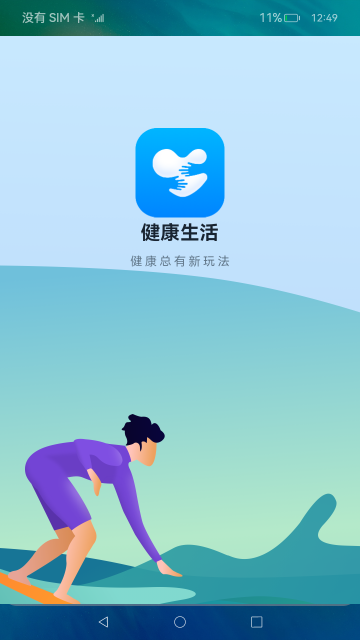
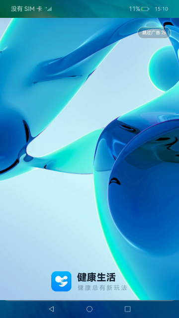
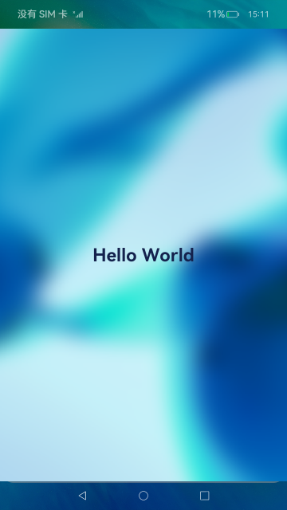

# 应用首次启动（ArkTS）

## 介绍
本篇Codelab基于自定义弹框、首选项和页面路由实现一个模拟应用首次启动的案例。需要完成以下功能：

1. 实现四个页面，启动页、隐私协议页、广告页、应用首页。
2. 页面之间的跳转。
3. 实现自定义隐私协议弹窗，点击协议可查看隐私协议具体内容。
4. 隐私协议状态持久化存储，再次启动时，如果没有保存状态会再次弹出，否则不弹出。

效果如图所示：


### 相关概念

-   [首选项](https://gitcode.com/openharmony/docs/blob/master/zh-cn/application-dev/reference/apis-arkui/apis/js-apis-data-preferences.md) ：首选项为应用提供Key-Value键值型的数据处理能力，支持应用持久化轻量级数据，并对其修改和查询。数据存储形式为键值对，键的类型为字符串型，值的存储数据类型包括数字型、字符型、布尔型以及这3种类型的数组类型。

-   [自定义弹窗](https://gitcode.com/openharmony/docs/blob/master/zh-cn/application-dev/reference/apis-arkui/arkui-ts/ts-methods-custom-dialog-box.md) ： 通过CustomDialogController类显示自定义弹窗。

-   [页面路由](https://gitcode.com/openharmony/docs/blob/master/zh-cn/application-dev/reference/apis-arkui/apis/js-apis-router.md) ：提供通过不同的url访问不同的页面，包括跳转到应用内的指定页面、用应用内的某个页面替换当前页面、返回上一页面或指定的页面等。


## 环境搭建

### 软件要求

-   [DevEco Studio](https://gitcode.com/openharmony/docs/blob/master/zh-cn/application-dev/quick-start/start-overview.md#%E5%B7%A5%E5%85%B7%E5%87%86%E5%A4%87) 版本：DevEco Studio 3.1 Release。
-   OpenHarmony SDK版本：API version 9。

### 硬件要求

-   开发板类型：[润和RK3568开发板](https://gitcode.com/openharmony/docs/blob/master/zh-cn/device-dev/quick-start/quickstart-appendix-rk3568.md) 。
-   OpenHarmony系统：3.2 Release。

### 环境搭建

完成本篇Codelab我们首先要完成开发环境的搭建，本示例以**RK3568**开发板为例，参照以下步骤进行：

1. [获取OpenHarmony系统版本](https://gitcode.com/openharmony/docs/blob/master/zh-cn/device-dev/get-code/sourcecode-acquire.md#%E8%8E%B7%E5%8F%96%E6%96%B9%E5%BC%8F3%E4%BB%8E%E9%95%9C%E5%83%8F%E7%AB%99%E7%82%B9%E8%8E%B7%E5%8F%96) ：标准系统解决方案（二进制）。以3.2 Release版本为例：

   

2. 搭建烧录环境。

   1.  [完成DevEco Device Tool的安装](https://gitcode.com/openharmony/docs/blob/master/zh-cn/device-dev/quick-start/quickstart-ide-env-win.md)
   2.  [完成RK3568开发板的烧录](https://gitcode.com/openharmony/docs/blob/master/zh-cn/device-dev/quick-start/quickstart-ide-3568-burn.md)

3. 搭建开发环境。

   1.  开始前请参考[工具准备](https://gitcode.com/openharmony/docs/blob/master/zh-cn/application-dev/quick-start/start-overview.md#%E5%B7%A5%E5%85%B7%E5%87%86%E5%A4%87) ，完成DevEco Studio的安装和开发环境配置。
   2.  开发环境配置完成后，请参考[使用工程向导](https://gitcode.com/openharmony/docs/blob/master/zh-cn/application-dev/quick-start/start-with-ets-stage.md#创建ets工程) 创建工程（模板选择“Empty Ability”）。
   3.  工程创建完成后，选择使用[真机进行调测](https://gitcode.com/openharmony/docs/blob/master/zh-cn/application-dev/quick-start/start-with-ets-stage.md#使用真机运行应用) 。

## 代码结构解读

本篇Codelab只对核心代码进行讲解，完整代码可以直接从gitee获取。

```
├──entry/src/main/ets               // 代码区 
│  ├──common
│  │  ├──constants
│  │  │  └──CommonConstants.ets     // 常量类
│  │  └──utils
│  │     ├──GlobalContext.ets       // 项目工具类
│  │     └──Logger.ets              // 日志打印工具类
│  ├──entryability
│  │  └──EntryAbility.ets           // 程序入口类
│  ├──pages
│  │  ├──AdvertisingPage.ets        // 广告页
│  │  ├──AppHomePage.ets            // 应用首页
│  │  ├──LauncherPage.ets           // 应用启动页
│  │  └──PrivacyPage.ets            // 隐私协议页
│  └──view
│     └──CustomDialogComponent.ets  // 自定义弹窗组件
└──entry/src/main/resources         // 资源文件目录
```

## 应用启动页实现

打开应用时进入EntryAbility页面，通过windowStage.loadContent方法加载启动页LauncherPage，然后在LauncherPage的build里面构建启动页组件，效果如图所示：



```typescript
// LauncherPage.ets
// 启动页组件
build() {
  Stack() {
    // 背景图
    Image($r('app.media.ic_launcher_background'))
      .width(CommonConstants.FULL_WIDTH)
      .height(CommonConstants.FULL_HEIGHT)
    Column() {
      // 启动页logo
      Image($r('app.media.ic_logo'))
        .width($r('app.float.launcher_logo_size'))
        .height($r('app.float.launcher_logo_size'))
        .margin({ top: CommonConstants.LAUNCHER_IMAGE_MARGIN_TOP })
      // 健康生活文字
      Text($r('app.string.healthy_life_text'))
        .width($r('app.float.launcher_life_text_width'))
        .height($r('app.float.launcher_life_text_height'))
        .healthyLifeTextStyle(FontWeight.Bold,
          CommonConstants.LAUNCHER_LIFE_TEXT_SPACING,
          $r('app.float.launcher_text_title_size'),
          $r('app.color.launcher_text_title_color'))
        .margin({ top: CommonConstants.LAUNCHER_TEXT_TITLE_MARGIN_TOP })
      // 健康生活说明
      Text($r('app.string.healthy_life_introduce'))
        .height(CommonConstants.LAUNCHER_TEXT_INTRODUCE_HEIGHT)
        .healthyLifeTextStyle(FontWeight.Normal,
          CommonConstants.LAUNCHER_TEXT_INTRODUCE_SPACING,
          $r('app.float.launcher_text_introduce_size'),
          $r('app.color.launcher_text_introduce_color'))
        .opacity($r('app.float.launcher_text_opacity'))
        .margin({ top: CommonConstants.LAUNCHER_TEXT_INTRODUCE_MARGIN_TOP })
    }
.height(CommonConstants.FULL_HEIGHT)
   .width(CommonConstants.FULL_WIDTH)
}
}
// 健康生活字体公共样式
@Extend(Text) function healthyLifeTextStyle (fontWeight: number, textAttribute: number, fontSize: Resource, fontColor: Resource) {
   .fontWeight(fontWeight)
      .letterSpacing(textAttribute)
      .fontSize(fontSize)
      .fontColor(fontColor)
}
```

## 隐私弹窗实现

启动页的隐私协议内容需要用到自定义弹窗，效果如图所示：


```typescript
// CustomDialogComponent.ets
// 自定义弹窗
@CustomDialog
export default struct CustomDialogComponent {
  controller: CustomDialogController = new CustomDialogController({'builder': ''});
  // 不同意按钮回调
  cancel: Function = () => {}
  // 同意按钮回调
  confirm: Function = () => {}
  build() {
    Column() {
      // 弹窗标题
      Text($r('app.string.dialog_text_title'))
        .width(CommonConstants.DIALOG_COMPONENT_WIDTH_PERCENT)
        .fontColor($r('app.color.dialog_text_color'))
        .fontSize($r('app.float.dialog_text_privacy_size'))
        .textAlign(TextAlign.Center)
        .margin({
          top: $r('app.float.dialog_text_privacy_top'),
          bottom: $r('app.float.dialog_text_privacy_bottom')
        })
      // 弹窗内容
      Text($r('app.string.dialog_text_privacy_content'))
        .fontSize($r('app.float.dialog_common_text_size'))
        .width(CommonConstants.DIALOG_COMPONENT_WIDTH_PERCENT)
      // 协议链接
      Text($r('app.string.dialog_text_privacy_statement'))
        .width(CommonConstants.DIALOG_COMPONENT_WIDTH_PERCENT)
        .fontColor($r('app.color.dialog_text_statement_color'))
        .fontSize($r('app.float.dialog_common_text_size'))
        .onClick(() => {
          router.pushUrl({
            url: CommonConstants.PRIVACY_PAGE_URL
          }).catch((error: Error) => {
            Logger.error(CommonConstants.CUSTOM_DIALOG_TAG, 'CustomDialog pushUrl error ' + JSON.stringify(error));
          });
        })
      // 协议声明
      Text($r('app.string.dialog_text_declaration_prompt'))
        .width(CommonConstants.DIALOG_COMPONENT_WIDTH_PERCENT)
        .fontColor($r('app.color.dialog_text_color'))
        .fontSize($r('app.float.dialog_common_text_size'))
        .opacity($r('app.float.dialog_text_opacity'))
        .margin({ bottom: $r('app.float.dialog_text_declaration_bottom') })
      // 按钮组件
      Row() {
        // 取消按钮 
        Text($r('app.string.dialog_button_disagree'))
          .fancy()
          .onClick(() => {
            this.controller.close();
            this.cancel();
          })
        Blank()
          .backgroundColor($r('app.color.dialog_blank_background_color'))
          .width($r('app.float.dialog_blank_width'))
          .height($r('app.float.dialog_blank_height'))
        // 同意按钮
        Text($r('app.string.dialog_button_agree'))
          .fancy()
          .onClick(() => {
            this.controller.close();
            this.confirm();
          })
      }
      .margin({ bottom: CommonConstants.DIALOG_ROW_MARGIN_BOTTOM })
    }
    .width(CommonConstants.DIALOG_WIDTH_PERCENT)
    .borderRadius(CommonConstants.DIALOG_BORDER_RADIUS)
    .backgroundColor(Color.White)
  }
}

// 按钮公共样式抽取
@Extend(Text) function fancy () {
  .fontColor($r('app.color.dialog_fancy_text_color'))
  .fontSize($r('app.float.dialog_fancy_text_size'))
  .textAlign(TextAlign.Center)
  .fontWeight(FontWeight.Medium)
  .layoutWeight(CommonConstants.COMMON_LAYOUT_WEIGHT)
}
```

## 获取隐私协议状态

构建启动页之前，在LauncherPage的生命周期onPageShow方法处，添加一个命名为“myStore”的首选项表，并在“myStore”首选项表读取一个名为“isPrivacy”的字段，获取隐私协议状态。

```typescript
// LauncherPage.ets
onPageShow() {
  ...
  // 获取保存数据操作类
  this.getDataPreferences(this).then((preferences: preferences.Preferences) => {
    preferences.get(CommonConstants.PREFERENCES_KEY_PRIVACY, true).then((value: preferences.ValueType) => {
      Logger.info(CommonConstants.LAUNCHER_PAGE_TAG, 'onPageShow value: ' + value);
      if (value) {
        // let isJumpPrivacy: boolean = globalThis.isJumpPrivacy ?? false;
        let isJumpPrivacy: boolean = (GlobalContext.getContext().getObject('isJumpPrivacy') as boolean) ?? false;
        if (!isJumpPrivacy) {
          // 自定义协议弹窗
          this.dialogController.open();          
        }
      } else {
        // 跳至广告页
        this.jumpToAdvertisingPage();
      }
    });
  });
}

// 获取数据首选项操作
getDataPreferences(common: Object) : Promise<preferences.Preferences>{
  return preferences.getPreferences(getContext(common), CommonConstants.PREFERENCES_FILE_NAME);
}
```

## 保存隐私协议状态

当用户点击隐私协议弹窗同意按钮时，回调onConfirm方法，调用saveIsPrivacy保存隐私协议状态。

```typescript
// LauncherPage.ets
onConfirm(): void {
  // 保存隐私协议状态
  this.saveIsPrivacy();
  ...
}

saveIsPrivacy(): void {
  let preferences: Promise<preferences.Preferences> = this.getDataPreferences(this);
  preferences.then((result: preferences.Preferences) => {
    let privacyPut = result.put(CommonConstants.PREFERENCES_KEY_PRIVACY, false);
    result.flush();
    ...
  });
}
```

## 页面跳转

用户在启动页LauncherPage，点击隐私协议弹窗同意按钮onConfirm，在onConfirm方法内开启3秒倒计时，倒计时结束后跳到广告页，当启动页不可见时，清除定时器和启动页，效果如图所示：



```typescript
// LauncherPage.ets
private isJumpToAdvertising: boolean = false;
onConfirm() :void{
  ...
  // 跳转到广告页
  this.jumpToAdvertisingPage();
}

jumpToAdvertisingPage() :void{ 
  this.timerId = setTimeout(() => {
    // 设置跳转标识
    this.isJumpToAdvertising = true;
    router.pushUrl({
      url: CommonConstants.ADVERTISING_PAGE_URL
    }).catch((error: Error) => {
      Logger.error(CommonConstants.LAUNCHER_PAGE_TAG, 'LauncherPage pushUrl error ' + JSON.stringify(error));
    });
  }, CommonConstants.LAUNCHER_DELAY_TIME);
}

onPageHide(): void {
  if (this.isJumpToAdvertising) {
    // 清除页面
    router.clear();
  }
  GlobalContext.getContext().setObject('isJumpPrivacy', true);
  // 清除定时器
  clearTimeout(this.timerId);
}
```

打开广告页AdvertisingPage后，进行2秒倒计时（用户可手动点击跳过），倒计时结束跳转到首页AppHomePage，当广告页不可见时，清除定时器和广告页，效果如图所示：



```typescript
// AdvertisingPage.ets
@State countDownSeconds: number = CommonConstants.ADVERTISING_COUNT_DOWN_SECONDS;
private timeId: number = 0;
onPageShow() {
   // 开启2秒倒计时
   this.timeId = setInterval(() => {
      if (this.countDownSeconds == 0) {
         // 跳转到首页
         this.jumpToAppHomePage();
      } else {
         this.countDownSeconds--;
      }
   }, CommonConstants.ADVERTISING_INTERVAL_TIME);
}

onPageHide() {
   // 清除页面
   router.clear();
   // 清除定时器
   clearInterval(this.timeId);
}

build() {
  Stack({ alignContent: Alignment.Top }) {
    Image($r('app.media.ic_advertising_background'))
      .width(CommonConstants.FULL_WIDTH)
      .height(CommonConstants.FULL_HEIGHT)
    Text($r('app.string.advertising_text_title', this.countDownSeconds))
    ...
    .onClick(() => {
      this.jumpToAppHomePage();
    })
    ...
  }
.width(CommonConstants.FULL_WIDTH)
   .height(CommonConstants.FULL_HEIGHT)
}

jumpToAppHomePage(): void {
   router.pushUrl({
      url: CommonConstants.APP_HOME_PAGE_URL
   }).catch((error) => {
      Logger.error(CommonConstants.ADVERTISING_PAGE_TAG, 'AdvertisingPage pushUrl error ' + JSON.stringify(error));
   });
}
```

## 总结

您已经完成了本次Codelab的学习，并了解到以下知识点：

1.  使用首选项功能实现数据持久化。
2.  使用CustomDialogController操作自定义弹窗。
3.  使用router实现通过url跳转指定页面。


