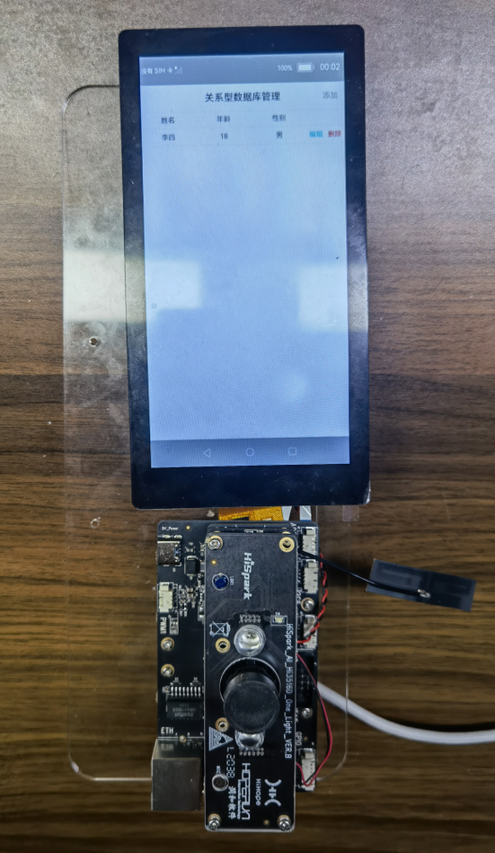

# 介绍

本篇Codelab介绍数据库的创建、数据的增加/删除/修改/查询等操作方法，让您快速了解关系型数据管理能力并能够开发数据库相关应用服务。效果图如下：

# 搭建OpenHarmony环境
完成本篇Codelab我们首先要完成开发环境的搭建，本示例以**Hi3516DV300**开发板为例，参照以下步骤进行：

1. [获取OpenHarmony系统版本](https://gitee.com/openharmony/docs/blob/master/zh-cn/device-dev/get-code/sourcecode-acquire.md#%E8%8E%B7%E5%8F%96%E6%96%B9%E5%BC%8F3%E4%BB%8E%E9%95%9C%E5%83%8F%E7%AB%99%E7%82%B9%E8%8E%B7%E5%8F%96)：标准系统解决方案（二进制）

    以3.0版本为例：

    

2. 搭建烧录环境

    1.  [完成DevEco Device Tool的安装](https://gitee.com/openharmony/docs/blob/master/zh-cn/device-dev/quick-start/quickstart-standard-env-setup.md)

    2.  [完成Hi3516开发板的烧录](https://gitee.com/openharmony/docs/blob/master/zh-cn/device-dev/quick-start/quickstart-lite-steps-hi3516-burn.md)

3. 搭建开发环境

    1. 开始前请参考[工具准备](https://gitee.com/openharmony/docs/blob/master/zh-cn/application-dev/quick-start/start-overview.md#%E5%B7%A5%E5%85%B7%E5%87%86%E5%A4%87) ，完成DevEco Studio的安装和开发环境配置。
    2. 开发环境配置完成后，请参考[使用工程向导](https://gitee.com/openharmony/docs/blob/master/zh-cn/application-dev/quick-start/start-with-js.md#%E5%88%9B%E5%BB%BAjs%E5%B7%A5%E7%A8%8B) 创建工程（模板选择“Empty Ability”），选择JS或者eTS语言开发。
    3. 工程创建完成后，选择使用[真机进行调测](https://gitee.com/openharmony/docs/blob/master/zh-cn/application-dev/quick-start/start-with-ets.md#%E4%BD%BF%E7%94%A8%E7%9C%9F%E6%9C%BA%E8%BF%90%E8%A1%8C%E5%BA%94%E7%94%A8) 。
	
# 导入模块

在JS文件中导入关系型数据库所需的模块。

```
import ohos_data_rdb from '@ohos.data.rdb'
```

# 创建关系型数据库

参考关系型数据库[接口](https://gitee.com/openharmony/docs/blob/master/zh-cn/application-dev/reference/apis/js-apis-data-rdb.md)，在kvStoreModel类中定义RdbStore变量，并通过getRdbStore创建数据库RdbTest.db及表employee，示例代码如下：

```
import ohos_data_rdb from '@ohos.data.rdb'
const STORE_CONFIG = { name: "RdbTest.db" }
const SQL_CREATE_TABLE = "CREATE TABLE IF NOT EXISTS EMPLOYEE (ID INTEGER PRIMARY KEY AUTOINCREMENT, NAME TEXT NOT NULL, AGE INTEGER, GENDER TEXT NOT NULL)"
export default class KvStoreModel {
    rdbStore;
    createKvStore(callback) {
       if (typeof (this.rdbStore) === 'undefined') {
           let self = this;
           let promise = ohos_data_rdb.getRdbStore(STORE_CONFIG, 1)
           promise.then(async (rdbStore) => {…
               self.rdbStore = rdbStore;
               await rdbStore.executeSql(SQL_CREATE_TABLE, null);
               console.info("rdbStore" + 'create table done.')
               callback();
           }).catch((err) => {
               console.info("kvStore" + err)
               callback();
           })
       }else {
           callback();
       }
    }
}
```

# 数据库操作方法
创建关系型数据库后，获得一个RdbStore，通过RdbStore调用相关接口执行相关的数据操作，结果以Promise形式返回。

-   查询数据库：使用query\(\)方法，该方法接收返回函数callback。其中，查询的条件predicates 由RdbPredicates的实例对象指定。columns 表示要查询的列，如果查询的列为空，则查询所有的列。根据查询条件和传入的列名查询数据库的示例代码如下：

    ```
    query(callback) {
    	this.createKvStore(() => {
    		var contactList = []
                    //查询的条件
    		let predicates = new ohos_data_rdb.RdbPredicates("EMPLOYEE")
                    let columns = ["ID", "NAME", "AGE", "GENDER"]
    		let promise = this.rdbStore.query(predicates,columns)
    		console.log("rdbStore query start")
    		promise.then((resultSet) => {
    			if (resultSet.rowCount > 0) {
    				while (resultSet.goToNextRow()) {
                                            //返回    
    					let id = resultSet.getLong(resultSet.getColumnIndex("ID"));
                                                       
    					let userName = resultSet.getString(resultSet.getColumnIndex("NAME"));
    					let userAge = resultSet.getLong(resultSet.getColumnIndex("AGE"));
    					let userGender = resultSet.getLong(resultSet.getColumnIndex("GENDER"));
    					const obj = {
    						id:id,name:userName,age:userAge,gender:userGender
    					};
    					contactList.push(obj);
    				}
    			}
    			resultSet.close();
    			resultSet = null;
    			callback(contactList);
    			console.log("resultSet column names:" + resultSet.columnNames)
    			console.log("resultSet column count:" + resultSet.columnCount)}
    		)
    	})
    }
    ```

-   新增数据：使用insert\(\)方法，该方法接受两个参数，分别是要插入的表名和要插入到表中的数据行。其中，插入的数据由valueBucket封装，服务端可以从该参数中解析出对应的属性，然后插入到数据库中。该方法结果以Promise形式返回。如果操作成功，返回行ID，否则返回-1。

    ```
    insert(name,valueBucket) {
    	console.info('rdbStore.insert ' +valueBucket[0].name+"---"+valueBucket[0].gender);
    	let promise = this.rdbStore.insert(name, valueBucket)
    	promise.then(async (rows) => {
    		await console.log("rdbStore.insert first done: " + rows)
    	}).catch((err) => {})
    }
    ```

-   更新数据：使用update\(\)方法，该方法接受两个参数，分别是插入到表中要更新的数据行和插入到表中的数据行。其中，插入到表中要更新的数据行由[ValuesBucket](https://gitee.com/openharmony/docs/tree/master/zh-cn/application-dev/reference)封装，插入到表中的数据行由rdbPredicates的实例对象指定。该方法结果以Promise形式返回。如果操作成功，返回行ID，否则返回-1。

    ```
    update(valueBucket,index){
    	console.info('rdbStore.update ' +index+"=="+valueBucket);
    	let predicates = new ohos_data_rdb.RdbPredicates("EMPLOYEE");
    	predicates.equalTo("ID", index);
    	let promise = this.rdbStore.update(valueBucket, predicates)
    	promise.then(async (ret) => {
    		await console.log("rdbStore.update updated row count: " + rows)
    	}).catch((err) => {})
    }
    ```

-   删除数据：使用delete\(\)方法，该方法需要传入需要删除的数据行。其中，删除的数据行由rdbPredicates的实例对象指定。该方法结果以Promise形式返回。如果操作成功，返回行ID，否则返回-1。

    ```
    delete(index) {
    	console.info('rdbStore.delete ' +index);
    	let predicates = new ohos_data_rdb.RdbPredicates("EMPLOYEE");
    	predicates.equalTo("ID", index);
    	this.rdbStore.delete(predicates, function (err, rows) {
    		console.log("rdbStore.delete rows: " + rows)})
    }
    ```
	
# 恭喜您

您已经成功地学习了如何通过getRdbStore创建关系型数据库，并提供数据库表格数据的增、删、改、查API接口。


