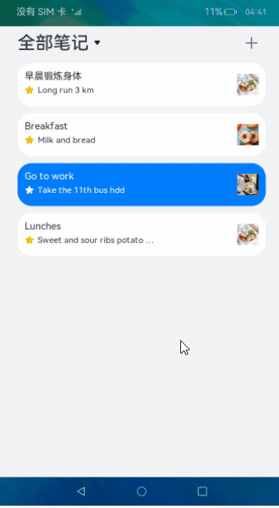
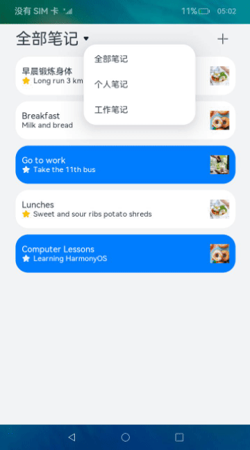
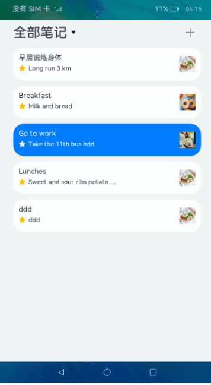

# 备忘录（ArkTS）

## 介绍

本篇Codelab基于用户首选项，实现了备忘录新增、更新、删除以及查找等功能。效果如图所示：



### 相关概念

-   [用户首选项](https://gitcode.com/openharmony/docs/blob/master/zh-cn/application-dev/reference/apis-arkui/apis/js-apis-data-preferences.md)：提供Key-Value键值型的数据处理能力，应用持久化轻量级数据，并对其修改和查询。
-   [Navigator](https://gitcode.com/openharmony/docs/blob/master/zh-cn/application-dev/reference/apis-arkui/arkui-ts/ts-container-navigator.md)：路由容器组件，支持路由跳转以及子组件嵌入。

## 环境搭建

### 软件要求

-   [DevEco Studio](https://gitcode.com/openharmony/docs/blob/master/zh-cn/application-dev/quick-start/start-overview.md#%E5%B7%A5%E5%85%B7%E5%87%86%E5%A4%87)版本：DevEco Studio 3.1 Release。
-   OpenHarmony SDK版本：API version 9。

### 硬件要求

-   开发板类型：[润和RK3568开发板](https://gitcode.com/openharmony/docs/blob/master/zh-cn/device-dev/quick-start/quickstart-appendix-rk3568.md)。
-   OpenHarmony系统：3.2 Release。

### 环境搭建

完成本篇Codelab我们首先要完成开发环境的搭建，本示例以**RK3568**开发板为例，参照以下步骤进行：

1. [获取OpenHarmony系统版本](https://gitcode.com/openharmony/docs/blob/master/zh-cn/device-dev/get-code/sourcecode-acquire.md#%E8%8E%B7%E5%8F%96%E6%96%B9%E5%BC%8F3%E4%BB%8E%E9%95%9C%E5%83%8F%E7%AB%99%E7%82%B9%E8%8E%B7%E5%8F%96)：标准系统解决方案（二进制）。以3.2 Release版本为例：

   

2. 搭建烧录环境。

   1.  [完成DevEco Device Tool的安装](https://gitcode.com/openharmony/docs/blob/master/zh-cn/device-dev/quick-start/quickstart-ide-env-win.md)
   2.  [完成RK3568开发板的烧录](https://gitcode.com/openharmony/docs/blob/master/zh-cn/device-dev/quick-start/quickstart-ide-3568-burn.md)

3. 搭建开发环境。

   1.  开始前请参考[工具准备](https://gitcode.com/openharmony/docs/blob/master/zh-cn/application-dev/quick-start/start-overview.md#%E5%B7%A5%E5%85%B7%E5%87%86%E5%A4%87)，完成DevEco Studio的安装和开发环境配置。
   2.  开发环境配置完成后，请参考[使用工程向导](https://gitcode.com/openharmony/docs/blob/master/zh-cn/application-dev/quick-start/start-with-ets-stage.md#创建ets工程)创建工程（模板选择“Empty Ability”）。
   3.  工程创建完成后，选择使用[真机进行调测](https://gitcode.com/openharmony/docs/blob/master/zh-cn/application-dev/quick-start/start-with-ets-stage.md#使用真机运行应用)。

## 代码结构解读

本篇Codelab只对核心代码进行讲解，对于完整代码，我们会在gitcode中提供。

```
├──entry/src/main/ets           // 代码区
│  ├──common
│  │  ├──constants
│  │  │  ├──CommonConstants.ets // 常量类 
│  │  │  └──StyleConstants.ets  // 样式常量类 
│  │  └──utils
│  │     ├──Format.ets          // 日期格式化函数
│  │     └──Logger.ets          // 日志打印类
│  ├──entryability
│  │  └──EntryAbility.ts        // 程序入口类
│  ├──model
│  │  └──NotesDataModel.ets     // 备忘录方法类
│  ├──pages
│  │  ├──NoteHomePage.ets       // 备忘录主页面（列表页）
│  │  └──NotesDetail.ets        // 备忘录详情页	
│  ├──view
│  │  ├──BottomBar.ets          // 备忘录编辑页底部栏
│  │  ├──ConfirmDialog.ets      // 自定义弹窗
│  │  └──MemoItem.ets           // 自定义备忘录列表组件
│  └──viewmodel
│     └──NotesInfoViewModel.ets // 备忘录默认数据实体	
└──entry/src/main/resources     // 资源文件目录
```

## 备忘录初始化

在这个章节中，需要实现备忘录数据的初始化，并且通过List组件将其渲染出来。效果如图所示：



在saveDefaultData方法中先通过getPreferences方法获取preferences实例，然后调用has方法查找数据库中是否存在“noteIdArr”这个key值，如果不存在调用实例的put方法将noteIdArr以及备忘录数据写入，最后通过flush方法进行数据持久化。

```typescript
// NotesDataModel.ets
import dataStorage from '@ohos.data.preferences';
...
class NotesDataModel {
  private context: common.UIAbilityContext = getContext(this) as common.UIAbilityContext;

  /**
   * 写入备忘录数据.
   */
  async saveDefaultData() {
    try {
      let preferences = await dataStorage.getPreferences(this.context, CommonConstants.PREFERENCE_INSTANCE_NAME);
      let isExist = await preferences.has(CommonConstants.PREFERENCE_NOTE_KEY);
      if (!isExist) {
        preferences.put(CommonConstants.PREFERENCE_NOTE_KEY, JSON.stringify(noteIdArray));
        preferences.flush();
        notesItemArr.forEach((item: NotesInfoBean) => {
          let notes: NotesInfoBean = item;
          let res = preferences.put(item.noteId, JSON.stringify(notes));
          preferences.flush();
          res.then(() => {
            Logger.info('Put the value successfully.' + item.noteId);
          }).catch((err: Error) => {
            Logger.error(`Put the value failed with err: ${err}`);
          })
        })
      }
    } catch (err) {
      Logger.error(`Failed to get preferences. Error = ${err}`);
    }
  }

  /**
   * 基于笔记类型获取对应备忘录数据.
   *
   * @param flag the folder type.
   * @param allNotes all of notes.
   * @returns subNotes.
   */
  getSelectNotes(flag: FolderType, allNotes: Array<NotesInfoBean>): Array<NotesInfoBean> {
    return allNotes.filter((item: NotesInfoBean) => item.folder === flag);
  }
}
```

在NoteHomePage.ets文件中调用saveDefaultData函数先将本地数据写入数据库，再调用实例的get方法进行查询操作。

```typescript
// NoteHomePage.ets
import dataStorage from '@ohos.data.preferences';
...
@Entry
@Component
struct NoteHomePage {
  @State folderType: Resource = $r('app.string.notes_all');
  @State allNotes: Array<NotesInfoBean> = [];
  @State selectNotes: Array<NotesInfoBean> = this.allNotes.sort();
  private context: common.UIAbilityContext = getContext(this) as common.UIAbilityContext;
  ...
  build() {
    Column() {
      ...
      List({ space: StyleConstants.MEMO_LIST_SPACE }) {
        ForEach(this.selectNotes, (item: NotesInfoBean) => {
          ListItem() {
            MemoItem({ noteItem: item })
          }
        }, (item: NotesInfoBean) => JSON.stringify(item))
      }
      .margin({ top: $r('app.float.list_container_margin') })
      .height(StyleConstants.NOTE_CONTENT_HEIGHT)
      .width(StyleConstants.FULL_WIDTH)
    }
    .backgroundColor($r('app.color.page_background'))
    .height(StyleConstants.FULL_HEIGHT)
  }

  onPageShow() {
    this.getAllNotes();
  }

  async getAllNotes() {
    await NotesDataModel.saveDefaultData();
    try {
      let preferences = await dataStorage.getPreferences(this.context, CommonConstants.PREFERENCE_INSTANCE_NAME);
      let noteIds = await preferences.get(CommonConstants.PREFERENCE_NOTE_KEY, '');
      while (this.allNotes.length >= 1) {
        this.allNotes.pop();
      }
      JSON.parse(noteIds.toString()).forEach(async (item: NotesInfoBean) => {
        let note = await preferences.get(item.noteId, '');
        this.allNotes.push(JSON.parse(note.toString()));
      })
    } catch (err) {
      Logger.error('Get the value of noteIdArr failed with err:', err);
    }
  }
}
```

## 新增备忘录

此章节介绍新增备忘录功能，点击列表页右上角加号进入编辑页，支持输入标题、备忘录内容以及添加图片。效果如图所示：


首先在列表页NoteHomePage.ets中添加跳转逻辑，设置路由参数params，其中operationType字段代表此次操作是新增还是修改。

```typescript
// NoteHomePage.ets
Navigator({ target: 'pages/NotesDetail', type: NavigationType.Replace }) {
  Row() {
    Image($rawfile('ic_title_add.svg'))
      ...
  }
  .margin({ right: $r('app.float.note_add_margin') })
}
.params({
  notesInfo: {
    'noteId': new Date().getTime().toString(),
    'title': '',
    'folder': FolderType.Personal,
    'content': '',
    'imageArr': [],
    'time': new Date().toTimeString().split(' ')[0],
    'isFavorite': false
  },
  operationType: CommonConstants.ADD_NOTE
})
```

进入编辑页NotesDetail.ets后可以输入标题、内容以及选择对应的笔记类型等，确认保存后备忘录数据实时更新。

```typescript
// NotesDetail.ets
build() {
  ...
  TextInput({
    text: this.notesInfo.title != '' ? this.notesInfo.title : '',
    placeholder: this.notesInfo.title != '' ? '' : $r('app.string.note_title_placeholder')
  })
    ...
    .onChange((value: string) => {
      if (value !== this.notesInfo.title) {
        this.notesInfo.title = value;
        this.isDataChanged = true;
      }
    })
  ...
  TextArea({
    text: this.notesInfo.content !== '' ? this.notesInfo.content : '',
    placeholder: this.notesInfo.content !== '' ? '' : $r('app.string.note_content_placeholder')
  })
    .onChange((value: string) => {
      if (value !== this.notesInfo.content) {
        this.notesInfo.content = value;
        this.isDataChanged = true;
      }
    })
  ...
}

onBackPress() {
  if (this.isDataChanged || this.notesFolder !== this.notesInfo.folder || this.isCollectChange) {
    this.saveDialogController.open();
  } else {
    router.replaceUrl({
      url: 'pages/NoteHomePage'
    });
  }
  return true;
}

// ConfirmDialog.ets
if (this.type === CommonConstants.SAVE_DIALOG) {
  this.confirm = async () => {
    let preferences = await dataStorage.getPreferences(this.context, CommonConstants.PREFERENCE_INSTANCE_NAME);
    // 保存备忘录数据实时更新
    if (this.operationType === CommonConstants.ADD_NOTE) {
      this.noteIdArray.push(new NoteIdBean(this.notesInfo.noteId));
      preferences.put(CommonConstants.PREFERENCE_NOTE_KEY, JSON.stringify(this.noteIdArray));
      preferences.flush();
    }
    let newNotes = this.notesInfo;
    await preferences.put(this.notesInfo.noteId, JSON.stringify(newNotes));
    await preferences.flush();
    router.replaceUrl({
      url: 'pages/NoteHomePage'
    });
  }
}
```

## 更新备忘录

此章节介绍更新数据库操作，与新增备忘录逻辑类似。效果如图所示：


首先在NotesDetail.ets中设置isDataChange和isCollectChange属性，来表示对应noteId的备忘录数据是否已更改。如果isDataChange或者isCollectChange为true表示已更改，在返回列表页时会拉起确认弹窗，确认保存后执行put方法去更改备忘录数据。

```typescript
// NotesDetail.ets
build() {
  Column() {
    ...
    Stack({ alignContent: Alignment.Bottom }) {
      Scroll(this.scroller) {
        Column() {
          TextInput({
            text: this.notesInfo.title != '' ? this.notesInfo.title : '',
            placeholder: this.notesInfo.title != '' ? '' : $r('app.string.note_title_placeholder')
          })
            ...
            .onChange((value: string) => {
              if (value !== this.notesInfo.title) {
                this.notesInfo.title = value;
                this.isDataChanged = true;
              }
            })
          ...
          TextArea({
            text: this.notesInfo.content !== '' ? this.notesInfo.content : '',
            placeholder: this.notesInfo.content !== '' ? '' : $r('app.string.note_content_placeholder')
          })
            .onChange((value: string) => {
              if (value !== this.notesInfo.content) {
                this.notesInfo.content = value;
                this.isDataChanged = true;
              }
            })
          ...
        }
      }
      ...
      BottomBar({
        imageArr: $imageArr,
        notesInfo: $notesInfo,
        operationType: $operationType,
        noteIdArray: $noteIdArray,
        isDataChanged: $isDataChanged
      })
    }
    ...
  }
  .height(StyleConstants.FULL_HEIGHT)
  .backgroundColor($r('app.color.white_color'))
}
...
onBackPress() {
  if (this.isDataChanged || this.notesFolder !== this.notesInfo.folder || this.isCollectChange) {
    this.saveDialogController.open();
  } else {
    router.replaceUrl({
      url: 'pages/NoteHomePage'
    });
  }
  return true;
}

// BottomBar.ets
// 点击收藏
this.clickCollect = () => {
  this.notesInfo.isFavorite = !this.notesInfo.isFavorite;
  this.isFavorite = !this.isFavorite;
  this.collectImgSrc = this.notesInfo.isFavorite ?
    'ic_bottom_star_selected.svg' : 'ic_bottom_star_normal.svg';
}
...
// 点击插入图片
this.clickAddPicture = () => {
  this.imageSrc = this.chooseImage();
  if (this.imageSrc === '') {
    prompt.showToast({
      message: 'Not anymore pictures'
    });
  } else {
    this.imageArr = this.notesInfo.imageArr;
    this.imageArr.push(this.imageSrc);
    this.isDataChanged = true;
  }
}

// ConfirmDialog.ets
if (this.type === CommonConstants.SAVE_DIALOG) {
  this.confirm = async () => {
    let preferences = await dataStorage.getPreferences(this.context, CommonConstants.PREFERENCE_INSTANCE_NAME);
    if (this.operationType === CommonConstants.ADD_NOTE) {
      this.noteIdArray.push(new NoteIdBean(this.notesInfo.noteId));
      preferences.put(CommonConstants.PREFERENCE_NOTE_KEY, JSON.stringify(this.noteIdArray));
      preferences.flush();
    }
    // 保存备忘录数据实时更新
    let newNotes = this.notesInfo;
    await preferences.put(this.notesInfo.noteId, JSON.stringify(newNotes));
    await preferences.flush();
    router.replaceUrl({
      url: 'pages/NoteHomePage'
    });
  }
}
```

## 删除备忘录

上述章节介绍了数据库的新增与更新，此章节来介绍删除操作。效果如图所示：



在BottomBar.ets中点击删除按钮，弹出自定义弹窗选择“是否删除”。在ConfirmDialog.ets中添加删除逻辑，删除操作会调用preferences实例的delete方法，将对应noteId的备忘录数据从数据库中删除，最后执行实例的flush方法实现持久化。

```typescript
// BottomBar.ets
export default struct BottomBar {
  ...
  deleteDialogController: CustomDialogController = new CustomDialogController({
    builder: ConfirmDialog({
      notesInfo: $notesInfo,
      operationType: $operationType,
      noteIdArray: $noteIdArray,
      type: CommonConstants.DELETE_DIALOG
    }),
    autoCancel: true,
    alignment: DialogAlignment.Bottom,
    offset: { dx: $r('app.float.dialog_offset_x'), dy: $r('app.float.dialog_margin_bottom') }
  });
  ...
  build() {
    ...
    Column() {
      Image($r('app.media.ic_bottom_delete'))
        .width($r('app.float.ic_bottom_picture_size'))
        .aspectRatio(1)
      Text($r('app.string.delete_note'))
        .fontSize($r('app.float.font_size_smallest'))
        .margin({ top: $r('app.float.bottom_txt_margin') })
    }
    .onClick(() => {
      this.clickDelete = () => {
        if (this.operationType === CommonConstants.MODIFY_NOTE) {
          this.deleteDialogController.open();
        } else {
          prompt.showToast({
            message: 'The addition operation cannot be deleted'
          });
        }
      }
      this.clickDelete();
    })
    ...
  }
  ...
}

// ConfirmDialog.ets
if (this.type === CommonConstants.SAVE_DIALOG) {
  ...
} else {
  // 删除备忘录数据
  this.confirm = async () => {
    let preferences = await dataStorage.getPreferences(this.context, CommonConstants.PREFERENCE_INSTANCE_NAME);
    await preferences.delete(this.notesInfo.noteId);
    await preferences.flush();
    router.replaceUrl({
      url: 'pages/NoteHomePage'
    });
  }
}
this.confirm();
})
```

## 总结

您已经完成了本次Codelab的学习，并了解到以下知识点：

1.  使用preferences用户首选项实现一个简易备忘录。
2.  使用Navigator实现路由跳转。


