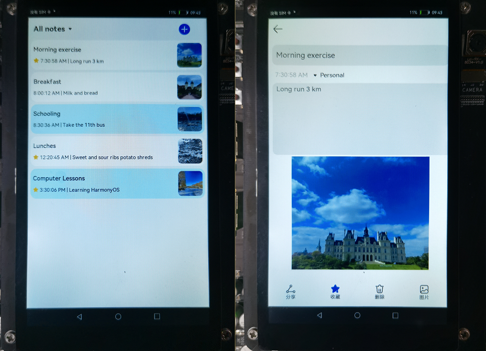
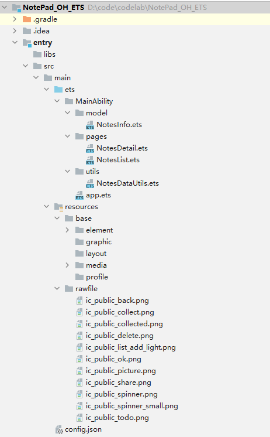
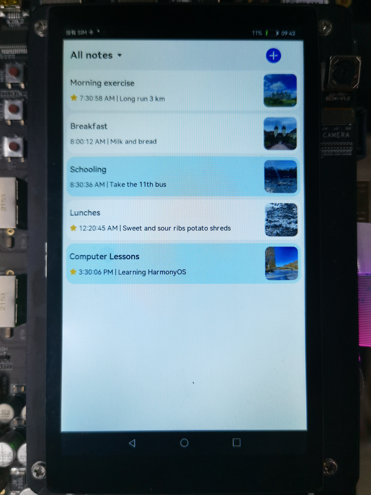
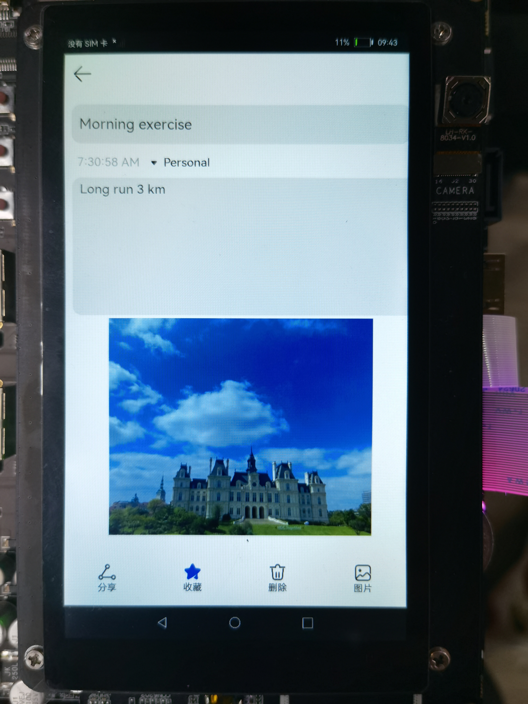

# 1.介绍<a name="ZH-CN_TOPIC_0000001258887807"></a>

本篇Codelab采用轻量级数据库来实现一个备忘录的办公场景，要求完成如下功能：

-   支持新建工作和个人笔记，并进行分类筛选
-   笔记支持文字和图片的插入
-   新建的笔记能支持持久化存储，再次启动时，仍可以加载已落盘存储的笔记
-   支持笔记的修改和删除
-   支持收藏笔记

页面运行效果如下所示：



# 2.搭建OpenHarmony环境<a name="ZH-CN_TOPIC_0000001261964107"></a>

完成本篇Codelab我们首先要完成开发环境的搭建，本示例以**RK3568**开发板为例，参照以下步骤进行：

1. [获取OpenHarmony系统版本](https://gitee.com/openharmony/docs/blob/master/zh-cn/device-dev/get-code/sourcecode-acquire.md#%E8%8E%B7%E5%8F%96%E6%96%B9%E5%BC%8F3%E4%BB%8E%E9%95%9C%E5%83%8F%E7%AB%99%E7%82%B9%E8%8E%B7%E5%8F%96)：标准系统解决方案（二进制）。

   以3.1版本为例：

   

2. 搭建烧录环境。

   1.  [完成DevEco Device Tool的安装](https://gitee.com/openharmony/docs/blob/master/zh-cn/device-dev/quick-start/quickstart-standard-env-setup.md)
   2.  完成RK3568开发板的烧录

   -   [DevEco Device Tool编译源码烧录](https://device.harmonyos.com/cn/docs/documentation/guide/ide-rk3568-upload-0000001239220669)
   -   [每日构建版本烧录](https://gitee.com/openharmony/docs/blob/master/zh-cn/device-dev/quick-start/quickstart-standard-running-rk3568-burn.md)

3. 搭建开发环境。

   1.  开始前请参考[下载与安装软件](https://developer.harmonyos.com/cn/docs/documentation/doc-guides/software_install-0000001053582415)、[配置开发环境](https://gitee.com/openharmony/docs/blob/master/zh-cn/application-dev/quick-start/configuring-openharmony-sdk.md)，完成DevEco Studio的安装和开发环境配置。
   2.  开发环境配置完成后，请参考[使用工程向导](https://gitee.com/openharmony/docs/blob/master/zh-cn/application-dev/quick-start/use-wizard-to-create-project.md)创建工程，选择JS或者eTS语言开发、“Application”为例，模板选择“\[Standard\]Empty Ability”。
   3.  工程创建完成后，可参考下面章节进行代码编写，使用真机进行调测：

   -   [配置OpenHarmony应用签名信息](https://gitee.com/openharmony/docs/blob/master/zh-cn/application-dev/quick-start/configuring-openharmony-app-signature.md)
   -   [hap包安装指导](https://gitee.com/openharmony/docs/blob/master/zh-cn/application-dev/quick-start/installing-openharmony-app.md)
   -   工程示例：

   

# 3.代码结构解读<a name="ZH-CN_TOPIC_0000001214008712"></a>

本篇Codelab只对核心代码进行讲解，对于完整代码，我们会在最后的参考中提供下载方式，接下来我们来讲解整个工程的代码结构：



-   src/main/ets/MainAbility/model/NotesInfo.ets：用于存放初始化的默认数据。
-   src/main/ets/MainAbility/pages/NotesDetail.ets：备忘录的编辑页面。
-   src/main/ets/MainAbility/pages/NotesList.ets：备忘录的列表页面。
-   src/main/ets/MainAbility/utils/NotesDataUtils.ets：备忘录的数据库操作工具类。
-   src/main/resources/rawfile：系统图片。

# 4.数据定义<a name="ZH-CN_TOPIC_0000001259048549"></a>

备忘录笔记对象定义为NoteInfo，包含笔记ID、笔记标题等具体字段，定义如下表所示：

**表 1** **NoteInfo数据定义**

<a name="table18722154719409"></a>

<table><thead align="left"><tr id="row1723194718404"><th class="cellrowborder" valign="top" width="33.33333333333333%" id="mcps1.2.4.1.1"><p id="p7723114754010"><a name="p7723114754010"></a><a name="p7723114754010"></a>字段</p>
</th>
<th class="cellrowborder" valign="top" width="33.33333333333333%" id="mcps1.2.4.1.2"><p id="p1972314794011"><a name="p1972314794011"></a><a name="p1972314794011"></a>类型</p>
</th>
<th class="cellrowborder" valign="top" width="33.33333333333333%" id="mcps1.2.4.1.3"><p id="p172374718402"><a name="p172374718402"></a><a name="p172374718402"></a>描述</p>
</th>
</tr>
</thead>
<tbody><tr id="row1372374744013"><td class="cellrowborder" valign="top" width="33.33333333333333%" headers="mcps1.2.4.1.1 "><p id="p0589204614418"><a name="p0589204614418"></a><a name="p0589204614418"></a>noteId</p>
</td>
<td class="cellrowborder" valign="top" width="33.33333333333333%" headers="mcps1.2.4.1.2 "><p id="p1658914684116"><a name="p1658914684116"></a><a name="p1658914684116"></a>string</p>
</td>
<td class="cellrowborder" valign="top" width="33.33333333333333%" headers="mcps1.2.4.1.3 "><p id="p0589046134113"><a name="p0589046134113"></a><a name="p0589046134113"></a>笔记ID</p>
</td>
</tr>
<tr id="row7724124754016"><td class="cellrowborder" valign="top" width="33.33333333333333%" headers="mcps1.2.4.1.1 "><p id="p05891446124114"><a name="p05891446124114"></a><a name="p05891446124114"></a>title</p>
</td>
<td class="cellrowborder" valign="top" width="33.33333333333333%" headers="mcps1.2.4.1.2 "><p id="p7589154674119"><a name="p7589154674119"></a><a name="p7589154674119"></a>string</p>
</td>
<td class="cellrowborder" valign="top" width="33.33333333333333%" headers="mcps1.2.4.1.3 "><p id="p10589194612416"><a name="p10589194612416"></a><a name="p10589194612416"></a>笔记标题</p>
</td>
</tr>
<tr id="row2724104711407"><td class="cellrowborder" valign="top" width="33.33333333333333%" headers="mcps1.2.4.1.1 "><p id="p1589134618417"><a name="p1589134618417"></a><a name="p1589134618417"></a>folder</p>
</td>
<td class="cellrowborder" valign="top" width="33.33333333333333%" headers="mcps1.2.4.1.2 "><p id="p17589114610411"><a name="p17589114610411"></a><a name="p17589114610411"></a>string</p>
</td>
<td class="cellrowborder" valign="top" width="33.33333333333333%" headers="mcps1.2.4.1.3 "><p id="p558917469417"><a name="p558917469417"></a><a name="p558917469417"></a>笔记类型（工作或个人）</p>
</td>
</tr>
<tr id="row1672434784011"><td class="cellrowborder" valign="top" width="33.33333333333333%" headers="mcps1.2.4.1.1 "><p id="p145891460418"><a name="p145891460418"></a><a name="p145891460418"></a>content</p>
</td>
<td class="cellrowborder" valign="top" width="33.33333333333333%" headers="mcps1.2.4.1.2 "><p id="p1958954611412"><a name="p1958954611412"></a><a name="p1958954611412"></a>string</p>
</td>
<td class="cellrowborder" valign="top" width="33.33333333333333%" headers="mcps1.2.4.1.3 "><p id="p158916461415"><a name="p158916461415"></a><a name="p158916461415"></a>笔记正文具体内容</p>
</td>
</tr>
<tr id="row1725947164018"><td class="cellrowborder" valign="top" width="33.33333333333333%" headers="mcps1.2.4.1.1 "><p id="p195891046134110"><a name="p195891046134110"></a><a name="p195891046134110"></a>imageArr</p>
</td>
<td class="cellrowborder" valign="top" width="33.33333333333333%" headers="mcps1.2.4.1.2 "><p id="p1058916467415"><a name="p1058916467415"></a><a name="p1058916467415"></a>string[]</p>
</td>
<td class="cellrowborder" valign="top" width="33.33333333333333%" headers="mcps1.2.4.1.3 "><p id="p17589546174112"><a name="p17589546174112"></a><a name="p17589546174112"></a>笔记中的图片</p>
</td>
</tr>
<tr id="row158515414415"><td class="cellrowborder" valign="top" width="33.33333333333333%" headers="mcps1.2.4.1.1 "><p id="p1958984610413"><a name="p1958984610413"></a><a name="p1958984610413"></a>time</p>
</td>
<td class="cellrowborder" valign="top" width="33.33333333333333%" headers="mcps1.2.4.1.2 "><p id="p1458915465412"><a name="p1458915465412"></a><a name="p1458915465412"></a>string</p>
</td>
<td class="cellrowborder" valign="top" width="33.33333333333333%" headers="mcps1.2.4.1.3 "><p id="p058916463414"><a name="p058916463414"></a><a name="p058916463414"></a>笔记时间，取新建时间即可</p>
</td>
</tr>
<tr id="row105113450417"><td class="cellrowborder" valign="top" width="33.33333333333333%" headers="mcps1.2.4.1.1 "><p id="p16590124614417"><a name="p16590124614417"></a><a name="p16590124614417"></a>isFavorite</p>
</td>
<td class="cellrowborder" valign="top" width="33.33333333333333%" headers="mcps1.2.4.1.2 "><p id="p15901946104111"><a name="p15901946104111"></a><a name="p15901946104111"></a>boolean</p>
</td>
<td class="cellrowborder" valign="top" width="33.33333333333333%" headers="mcps1.2.4.1.3 "><p id="p859012469419"><a name="p859012469419"></a><a name="p859012469419"></a>是否收藏</p>
</td>
</tr>
</tbody>
</table>


在entry/src/main/ets/default/model/NotesInfo.ets文件中，定义了这个对象，并添加了5条初始化的数据。

# 5.轻量级数据库的使用

-   [默认数据的添加](#section57881535458)
-   [数据的查询](#section41594384910)
-   [数据的新增](#section165096447498)
-   [数据的修改](#section1465174713497)
-   [数据的删除](#section082754215115)

## 默认数据的添加<a name="section57881535458"></a>

代码初始化时，为了保证备忘录中有部分数据可以展示，系统默认添加了5条数据。在系统启动时，onCreate方法处，添加一个命名为mystore的轻量级数据库表，并在表格中维护如下数据结构：

**表 1** **默认数据存储表格**

<a name="table546511016478"></a>

<table><thead align="left"><tr id="row184657101475"><th class="cellrowborder" valign="top" width="50%" id="mcps1.2.3.1.1"><p id="p17914112254717"><a name="p17914112254717"></a><a name="p17914112254717"></a>Key</p>
</th>
<th class="cellrowborder" valign="top" width="50%" id="mcps1.2.3.1.2"><p id="p13914022124712"><a name="p13914022124712"></a><a name="p13914022124712"></a>Value</p>
</th>
</tr>
</thead>
<tbody><tr id="row8465191015474"><td class="cellrowborder" valign="top" width="50%" headers="mcps1.2.3.1.1 "><p id="p0914142264711"><a name="p0914142264711"></a><a name="p0914142264711"></a>noteIdArr</p>
</td>
<td class="cellrowborder" valign="top" width="50%" headers="mcps1.2.3.1.2 "><p id="p191482244715"><a name="p191482244715"></a><a name="p191482244715"></a>noteId_1, noteId_2, noteId_3, noteId_4, noteId_5</p>
</td>
</tr>
<tr id="row13466171014719"><td class="cellrowborder" valign="top" width="50%" headers="mcps1.2.3.1.1 "><p id="p119141022124712"><a name="p119141022124712"></a><a name="p119141022124712"></a>noteId_1</p>
</td>
<td class="cellrowborder" valign="top" width="50%" headers="mcps1.2.3.1.2 "><p id="p49141722184715"><a name="p49141722184715"></a><a name="p49141722184715"></a>{具体数据}</p>
</td>
</tr>
<tr id="row0466161020473"><td class="cellrowborder" valign="top" width="50%" headers="mcps1.2.3.1.1 "><p id="p14914142213473"><a name="p14914142213473"></a><a name="p14914142213473"></a>noteId_2</p>
</td>
<td class="cellrowborder" valign="top" width="50%" headers="mcps1.2.3.1.2 "><p id="p9914192284716"><a name="p9914192284716"></a><a name="p9914192284716"></a>{具体数据}</p>
</td>
</tr>
<tr id="row1466141011476"><td class="cellrowborder" valign="top" width="50%" headers="mcps1.2.3.1.1 "><p id="p3914192244712"><a name="p3914192244712"></a><a name="p3914192244712"></a>noteId_3</p>
</td>
<td class="cellrowborder" valign="top" width="50%" headers="mcps1.2.3.1.2 "><p id="p6914132224720"><a name="p6914132224720"></a><a name="p6914132224720"></a>{具体数据}</p>
</td>
</tr>
<tr id="row1946611014478"><td class="cellrowborder" valign="top" width="50%" headers="mcps1.2.3.1.1 "><p id="p159141422194719"><a name="p159141422194719"></a><a name="p159141422194719"></a>noteId_4</p>
</td>
<td class="cellrowborder" valign="top" width="50%" headers="mcps1.2.3.1.2 "><p id="p59143229474"><a name="p59143229474"></a><a name="p59143229474"></a>{具体数据}</p>
</td>
</tr>
<tr id="row11466910134716"><td class="cellrowborder" valign="top" width="50%" headers="mcps1.2.3.1.1 "><p id="p39142223478"><a name="p39142223478"></a><a name="p39142223478"></a>noteId_5</p>
</td>
<td class="cellrowborder" valign="top" width="50%" headers="mcps1.2.3.1.2 "><p id="p6914112224711"><a name="p6914112224711"></a><a name="p6914112224711"></a>{具体数据}</p>
</td>
</tr>
</tbody>
</table>


代码如下所示，先添加数据的Id索引，再添加具体的数据：

```
export async function saveDefaultData() {
  var context = featureAbility.getContext()
  var path = await context.getFilesDir()
  let storage = dataStorage.getStorageSync(path + '/mystore')
  console.info(logTag + "saveDefaultData start ...")
  // 检查存储对象是否包含名为noteIdArr的存储
  storage.has('noteIdArr', function (err, isExist) {
    console.info(logTag + "storage has noteIdArr is " + isExist)
    if (!isExist) {
      console.info(logTag + "saveDefaultData donothas ...")
      // 保存笔记ID
      let promise = storage.put("noteIdArr", JSON.stringify(noteIdArray))
      storage.flush()
      promise.then(() => {
        console.info(logTag + "Put the value successfully. " + JSON.stringify(noteIdArray))
      }).catch((err) => {
        console.info(logTag + "Put the value failed with err: " + err)
      })

      notesInfoArr.forEach(item => {
        console.info(logTag + "----------- putData -----------" + item.noteId)
        // 保存每条笔记数据内容
        let promise = storage.put(item.noteId, JSON.stringify(new NotesInfo(item.noteId,
        item.title, item.folder, item.time, item.isFavorite, item.imageArr, item.content)))
        storage.flush()
        promise.then(() => {
          console.info(logTag + "Put the value successfully." + item.noteId)
        }).catch((err) => {
          console.info(logTag + "Put the value failed with err: " + err)
        })
      })
    }
  })
}
```

## 数据的查询<a name="section41594384910"></a>

上文已经向轻量级数据库中添加了5条默认数据，在列表页面加载显示的时候，也就是在生命周期onPageShow方法处，需要去读取数据库中所有的数据，读取的方法是先读取数据库中的索引，即key=noteIdArr的所有ID值，再用这些ID值去读取数据库中的数据。

代码如下所示：

```
  async getAllNotes() {
    console.info(this.logTag + "----------- getAllNotes -----------")
    var context = featureAbility.getContext()
    var path = await context.getFilesDir()
    let storage = dataStorage.getStorageSync(path + '/mystore')
    // 获取所有笔记ID
    storage.get("noteIdArr", " ")
      .then((value) => {
        var noteIdArr = value.toString();
        console.info(this.logTag + "The value of noteIdArr is " + noteIdArr)
        console.info(this.logTag + "--- allNotes length is " + this.allNotes.length)
        // 置空笔记数组
        while (this.allNotes.length >= 1) {
          this.allNotes.pop()
          console.info(this.logTag + "--- this.allNotes.pop() ---")
        }
        console.info(this.logTag + "--- allNotes length is " + this.allNotes.length)
        // 获取每条笔记ID对应的数据内容
        JSON.parse(noteIdArr).forEach(item => {
          storage.get(item.noteId, " ")
            .then((val) => {
              var notesInfo = val.toString();
              console.info(this.logTag + "The value of notesInfo is " + notesInfo)
              var notesInfoObj = JSON.parse(notesInfo)
              // 将每条数据放到数组中
              this.allNotes.push(new NotesInfo(notesInfoObj.noteId, notesInfoObj.title, notesInfoObj.folder,notesInfoObj.time, notesInfoObj.isFavorite, notesInfoObj.imageArr, notesInfoObj.content))
              console.info(this.logTag + "----------- this.allNotes.push -----------" + this.allNotes.toString())
            }).catch((err) => {
            console.info(this.logTag + "Get the value of noteId failed with err: " + err)
          })
        })
      }).catch((err) => {
      console.info(this.logTag + "Get the value of noteIdArr failed with err: " + err)
      // 递归查询数据
      this.getAllNotes()
    })
  }
```

## 数据的新增<a name="section165096447498"></a>

在列表页面，点击新增按钮新增数据时，在如下表格中，先新增一个时间戳为XXX的noteId\_XXX；再跳转到详情页面，输入具体数据，点击保存后，新增key为noteId\_XXX的数据，最终形成的数据库表格如下所示：

**表 2** **新增数据存储表格**

<a name="table313041495615"></a>

<table><thead align="left"><tr id="row1013021465615"><th class="cellrowborder" valign="top" width="50%" id="mcps1.2.3.1.1"><p id="p1231571815567"><a name="p1231571815567"></a><a name="p1231571815567"></a>Key</p>
</th>
<th class="cellrowborder" valign="top" width="50%" id="mcps1.2.3.1.2"><p id="p9315181819565"><a name="p9315181819565"></a><a name="p9315181819565"></a>Value</p>
</th>
</tr>
</thead>
<tbody><tr id="row1813111405613"><td class="cellrowborder" valign="top" width="50%" headers="mcps1.2.3.1.1 "><p id="p1531513185568"><a name="p1531513185568"></a><a name="p1531513185568"></a>noteIdArr</p>
</td>
<td class="cellrowborder" valign="top" width="50%" headers="mcps1.2.3.1.2 "><p id="p1316141818569"><a name="p1316141818569"></a><a name="p1316141818569"></a>noteId_1, noteId_2, noteId_3, noteId_4, noteId_5，noteId_XXX</p>
</td>
</tr>
<tr id="row31311142567"><td class="cellrowborder" valign="top" width="50%" headers="mcps1.2.3.1.1 "><p id="p1631691810562"><a name="p1631691810562"></a><a name="p1631691810562"></a>noteId_XXX</p>
</td>
<td class="cellrowborder" valign="top" width="50%" headers="mcps1.2.3.1.2 "><p id="p5316131819563"><a name="p5316131819563"></a><a name="p5316131819563"></a>{具体数据}</p>
</td>
</tr>
</tbody>
</table>


此时需要完成三个步骤：1、先把noteIdArr中原始的数据读取出来；2、在原始数据后添加一个noteId\_XXX；3、填加一条key=noteId\_XXX的具体数据。

## 数据的修改<a name="section1465174713497"></a>

在列表页面，点击具体的日志数据，既可以跳转到修改预览页面，此时跳转参数为noteId\_XXX，修改数据后，重复写入本条数据即可。最终形成的数据库表格如下所示：

**表 3** **新增数据存储表格**

<a name="table153764910010"></a>

<table><thead align="left"><tr id="row11537449106"><th class="cellrowborder" valign="top" width="50%" id="mcps1.2.3.1.1"><p id="p553816491909"><a name="p553816491909"></a><a name="p553816491909"></a>Key</p>
</th>
<th class="cellrowborder" valign="top" width="50%" id="mcps1.2.3.1.2"><p id="p1053844912018"><a name="p1053844912018"></a><a name="p1053844912018"></a>Value</p>
</th>
</tr>
</thead>
<tbody><tr id="row195388494019"><td class="cellrowborder" valign="top" width="50%" headers="mcps1.2.3.1.1 "><p id="p1253884918010"><a name="p1253884918010"></a><a name="p1253884918010"></a>noteIdArr</p>
</td>
<td class="cellrowborder" valign="top" width="50%" headers="mcps1.2.3.1.2 "><p id="p75386496011"><a name="p75386496011"></a><a name="p75386496011"></a>noteId_1, noteId_2, noteId_3, noteId_4, noteId_5，noteId_XXX</p>
</td>
</tr>
<tr id="row4538184917019"><td class="cellrowborder" valign="top" width="50%" headers="mcps1.2.3.1.1 "><p id="p65381149904"><a name="p65381149904"></a><a name="p65381149904"></a>noteId_XXX</p>
</td>
<td class="cellrowborder" valign="top" width="50%" headers="mcps1.2.3.1.2 "><p id="p853844912019"><a name="p853844912019"></a><a name="p853844912019"></a>{修改后的数据}</p>
</td>
</tr>
</tbody>
</table>


## 数据的删除<a name="section082754215115"></a>

在列表页面，点击具体的日志数据，既可以跳转到修改预览页面，此时屏幕的编辑区域有个删除按钮，点击删除按钮后，可以删除数据，最终形成的数据库表格如下所示：

**表 4** **数据的删除**

<a name="table67001633639"></a>

<table><thead align="left"><tr id="row11700333933"><th class="cellrowborder" valign="top" width="50%" id="mcps1.2.3.1.1"><p id="p8700103317311"><a name="p8700103317311"></a><a name="p8700103317311"></a>Key</p>
</th>
<th class="cellrowborder" valign="top" width="50%" id="mcps1.2.3.1.2"><p id="p87007337314"><a name="p87007337314"></a><a name="p87007337314"></a>Value</p>
</th>
</tr>
</thead>
<tbody><tr id="row1470013331932"><td class="cellrowborder" valign="top" width="50%" headers="mcps1.2.3.1.1 "><p id="p1783935810311"><a name="p1783935810311"></a><a name="p1783935810311"></a>noteIdArr</p>
</td>
<td class="cellrowborder" valign="top" width="50%" headers="mcps1.2.3.1.2 "><p id="p88391958932"><a name="p88391958932"></a><a name="p88391958932"></a>noteId_1, noteId_2, noteId_3, noteId_4, noteId_5，noteId_XXX（删除）</p>
</td>
</tr>
<tr id="row570015331739"><td class="cellrowborder" valign="top" width="50%" headers="mcps1.2.3.1.1 "><p id="p3811461544"><a name="p3811461544"></a><a name="p3811461544"></a>noteId_XXX（删除）</p>
</td>
<td class="cellrowborder" valign="top" width="50%" headers="mcps1.2.3.1.2 "><p id="p1881146442"><a name="p1881146442"></a><a name="p1881146442"></a>{删除数据}</p>
</td>
</tr>
</tbody>
</table>


此时需要完成三个步骤：

1、先把noteIdArr中原始的数据读取出来；

```
storage.get("noteIdArr"," ")
```

2、删除noteIdArr；

```
let promise = storage.delete("noteIdArr")
storage.flush()
```

3、去除noteId\_XXX,重新保存笔记ID。

```
JSON.parse(data).forEach(item => {
  if ((item.noteId) != this.notesInfo.noteId) {
    this.noteIdArray.push(item)
  }
})
...
let promise1 = storage.put("noteIdArr", JSON.stringify(this.noteIdArray))
storage.flush()
```

4、删除key=noteId\_XXX的数据

```
let promise2 = storage.delete(this.notesInfo.noteId)
storage.flush()
```


# 6.备忘录主页面<a name="ZH-CN_TOPIC_0000001214168706"></a>

-   [创建单条笔记](#section41594384910)
-   [创建主页面](#section899719512612)

## 创建单条笔记<a name="section41594384910"></a>

单条笔记包含标题、创建时间、内容、图片、收藏图标等元素。效果图如下：


1.  为最外层Flex组件设置固定高度、圆角半径、外边距及背景色，背景色根据笔记类型的不同会显示两种不同的颜色。
2.  将最外层Flex组件分为左右两部分，右侧摆放Image组件展示图片，左侧摆放Flex组件展示其他元素，若笔记未添加图片则隐藏右侧Image组件。
3.  将左侧Flex组件分为上下两部分，上方摆放Text组件展示标题，下方摆放Row组件展示剩余元素，当标题为空时使用内容作为标题。
4.  在下方Row组件中依次摆放Image组件和Text组件，用于展示收藏图标、创建时间、内容，笔记被收藏后会显示收藏图标，否则不显示。
5.  将最外层Flex组件添加到Navigator组件中，从而实现点击笔记跳转到详情界面。

代码如下所示：

```
build() {
  Navigator({ target: 'pages/NotesDetail' }) {
    Flex({ justifyContent: FlexAlign.Start, direction: FlexDirection.Row, alignItems: ItemAlign.Center }) {
      Flex({ justifyContent: FlexAlign.Center, direction: FlexDirection.Column, alignItems: ItemAlign.Start }) {
        Text(this.notesInfo.title != '' ? this.notesInfo.title : this.notesInfo.content)
          .fontSize(24)
          .fontWeight(500)
          .padding(10)
          .textOverflow({ overflow: TextOverflow.Clip })
          .maxLines(1)

        Row() {
          Image($rawfile('ic_favorite_tag.png'))
            .objectFit(ImageFit.Contain)
            .height(23)
            .width(23)
            .margin({ right: 5 })
            // 是否显示收藏图标
            .visibility(Visibility[this.notesInfo.isFavorite? 'Visible' : 'None'])

          Text(this.notesInfo.time + " | " + this.notesInfo.content)
            .textAlign(TextAlign.Start)
            .fontSize(20)
            .fontColor('#413f3f')
            .textOverflow({ overflow: TextOverflow.Ellipsis })
            .maxLines(1)
        }
        .padding(10)
      }
      .layoutWeight(1)

      Image($rawfile(this.notesInfo.imageArr[0]))
        .objectFit(ImageFit.Cover)
        .height(120)
        .width(120)
        .padding(10)
        .borderRadius(15)
        .visibility((this.notesInfo.imageArr.length != 0)? Visibility.Visible : Visibility.None)
    }
    .height(120)
    .borderRadius(25)
    .margin({ right: 10, left: 10, bottom: 10 })
    // 根据不同的笔记类型显示不同的背景颜色
    .backgroundColor(this.notesInfo.folder === FolderType.Personal ? '#ffffff' : '#dff5fa')
  }
  .params({ notesInfo: this.notesInfo, operationType: 'modify' })
}
```

## 创建主页面<a name="section899719512612"></a>

主页面包含分类菜单、新建按钮、笔记列表。效果图如下：



1.  将最外层Column组件分为上下两部分，上方摆放Flex组件展示分类菜单、新建按钮，下方摆放List组件展示笔记列表。
2.  将上方Flex组件分为左右两部分，左侧使用Text和Image组件展示分类菜单，左侧使用Text和Image组件展示分类菜单，右侧使用Image组件展示新建按钮。
3.  为分类菜单添加bindMenu属性，点击后会展开分类，通过选择分类来控制不同笔记数据的展示。
4.  将新建按钮添加到Navigator组件中，从而实现点击跳转到新建界面。
5.  为List组件添加要展示的数据。

代码如下所示：

```
build() {
  Column() {
    Flex({ justifyContent: FlexAlign.Start, direction: FlexDirection.Row, alignItems: ItemAlign.Center }) {
      // 笔记类型选择
      Row() {
        Text(this.folderType)
          .fontSize(30)
          .fontWeight(700)
          .padding({ left: 20 })
          .textAlign(TextAlign.Start)

        Image($rawfile('ic_public_spinner.png'))
          .objectFit(ImageFit.Contain)
          .height(30)
          .width(30)
          .margin({ left: 5 })
      }
      .width('75%')
      .bindMenu([
        {
          value: this.folderType != FolderType.All ? FolderType.All : '',
          action: () => {
            console.info(this.logTag + "----------- bindMenu FolderType.All -----------")
            this.folderType = FolderType.All
            this.selectNotes = this.allNotes
          }
        },
        {
          value: this.folderType != FolderType.Personal ? FolderType.Personal : '',
          action: () => {
            console.info(this.logTag + "----------- bindMenu FolderType.Personal -----------")
            this.folderType = FolderType.Personal
            this.selectNotes = getSelectNotes(FolderType.Personal, this.allNotes)
          }
        },
        {
          value: this.folderType != FolderType.Work ? FolderType.Work : '',
          action: () => {
            console.info(this.logTag + "----------- bindMenu FolderType.Work -----------")
            this.folderType = FolderType.Work
            this.selectNotes = getSelectNotes(FolderType.Work, this.allNotes)
          }
        },
      ])

      // 添加笔记
      Navigator({ target: 'pages/NotesDetail' }) {
        Row() {
          Image($rawfile('ic_public_list_add_light.png'))
            .objectFit(ImageFit.Contain)
            .height(50)
            .width('25%')
        }
      }
      .params({ notesInfo: {
        "noteId": new Date().getTime().toString(),
        "title": '',
        "folder": FolderType.Personal,
        "content": '',
        "imageArr": [],
        "time": new Date().toLocaleTimeString(),
        "isFavorite": false
      }, operationType: 'add' })
    }
    .height(90)

    // 笔记列表
    List() {
      ForEach(this.selectNotes, item => {
        ListItem() {
          NotesInfoItem({ notesInfo: item })
        }
      }, item => item.noteId.toString())

      ListItem().height(200) // 列表底边距
    }
  }
  .height('100%')
  .backgroundColor('#FFf1f3f5')
}
```

# 7.备忘录详情页<a name="ZH-CN_TOPIC_0000001258904151"></a>

1. 页面布局

   详情页面既可以展示笔记详情，也可以新建笔记。界面包含返回、保存、分享、收藏、删除、图片、笔记详情。效果图如下：

   

2. 代码实现

```
build() {
  Flex({ justifyContent: FlexAlign.Start, direction: FlexDirection.Column }) {
    Flex({ justifyContent: FlexAlign.Start, direction: FlexDirection.Row, alignItems: ItemAlign.Start }) {
      Image($rawfile(this.backImgSrc))
        .width(45)
        .margin({ left: 10 })
        .objectFit(ImageFit.Contain)
        .onClick(() => {
          if (this.isDataChange) {
            this.saveDialogController.open()
          } else {
            router.back()
          }
        })

      Image($rawfile(this.okImgSrc))
        .width(45)
        .position({ x: '40%', y: 0 })
        .objectFit(ImageFit.Contain)
        .visibility(this.isDataChange ? Visibility.Visible : Visibility.None)
        .onClick(() => {
          this.saveDialogController.open()
        })
    }
    .height('7%')
    .padding(5)

    TextInput({ placeholder: this.notesInfo.title != '' ? this.notesInfo.title : 'Title' })
      .width('97%')
      .height('7%')
      .fontSize(30)
      .placeholderFont({ size: 30 })
      .margin({ left: 10, top: 16 })
      .onChange((value: string) => {
        this.notesInfo.title = value
        this.isDataChange = true
      })

    Row() {
      Text(this.notesInfo.time)
        .fontSize(25)
        .fontColor(0xCCCCCC)
        .margin({ left: 26, top: 3 })

      Row() {
        Image($rawfile('ic_public_spinner_small.png'))
          .width(40)
          .height(40)
          .objectFit(ImageFit.Contain)

        Text(this.notesFolder)
          .fontSize(25)
          .fontColor(0x000000)
      }
      .margin({ left: 10, top: 3 })
      .bindMenu([
        {
          value: 'Personal',
          action: () => {
            this.notesFolder = FolderType.Personal
            this.notesInfo.folder = FolderType.Personal
            this.isDataChange = true
            console.info(this.logTag + 'handle Menu1 select')
          }
        },
        {
          value: 'Work',
          action: () => {
            this.notesFolder = FolderType.Work
            this.notesInfo.folder = FolderType.Work
            this.isDataChange = true
            console.info(this.logTag + 'handle Menu2 select')
          }
        },
      ])
    }
    .height('5%')
    .width('100%')

    TextArea({ placeholder: this.notesInfo.content != '' ? this.notesInfo.content : '' })
      .onChange((value: string) => {
        this.notesInfo.content = value
        this.isDataChange = true
      })
      .width('97%')
      .height('25%')
      .fontSize(27)
      .placeholderFont({ size: 27 })
      .margin({ left: 10, top: 3 })

    Scroll(this.scroller) {
      Column() {
        ForEach(this.imageArr, (item) => {
          Image($rawfile(item))
            .width('75%')
            .aspectRatio(1)
            .margin({ top: 5 })
        }, item => item)
      }
      .width('100%')
      .alignItems(HorizontalAlign.Center)
    }
    .height('40%')

    Row() {
      Column() {
        Image($rawfile('ic_public_share.png'))
          .width(40)
          .height(40)
        Text(this.shareName).fontSize(20)
      }
      .width('25%')
      .onClick(() => {
        // 分享笔记
        ...
      })

      Column() {
        Image($rawfile(this.collectImgSrc))
          .width(40)
          .height(40)

        Text(this.collectName)
          .fontSize(20)
      }
      .width('25%')
      .onClick(() => {
        // 收藏
        ...
      })

      Column() {
        Image($rawfile('ic_public_delete.png'))
          .width(40)
          .height(40)

        Text(this.deleteName)
          .fontSize(20)
      }
      .width('25%')
      .onClick(() => {
        // 删除笔记
        ...
      })

      Column() {
        Image($rawfile('ic_public_picture.png'))
          .width(40)
          .height(40)

        Text(this.pictureName)
          .fontSize(20)
      }
      .width('25%')
      .onClick(() => {
        // 插入图片
        ...
      })
    }
    .height('10%')
    .margin({ bottom: 20 })
    .position({ x: '0', y: '90%' })
  }
  .width('100%')
  .height('100%')
}
```

# 8.总结与回顾<a name="ZH-CN_TOPIC_0000001259144145"></a>

本篇Codelab详细讲解了本案例的数据定义，包括如何进行数据存储、数据查询、数据新增和删除等功能。同时，我们讲解了备忘录的列表页面和编辑页面是如何实现的。

# 9.恭喜你<a name="ZH-CN_TOPIC_0000001259304099"></a>

通过本Codelab的学习，您已经学会了：

-   轻量级数据库的使用，如增删改查等基础操作
-   应用生命周期的使用，如onCreat、onPageShow等
-   基础组件的使用，如List列表、TextInput组件等

# 10.参考

gitee地址