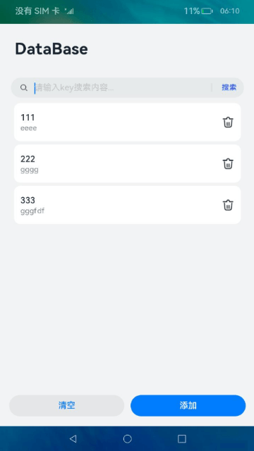
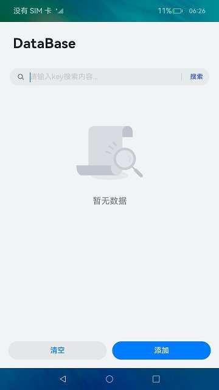
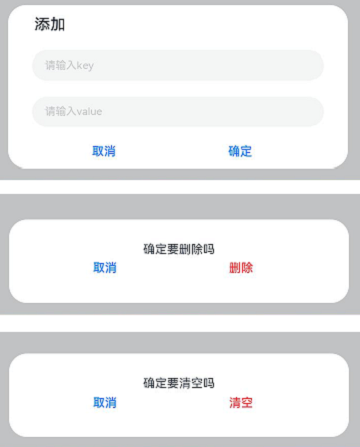

# 用户首选项（JS）

## 介绍

用户首选项为应用提供Key-Value键值型的数据处理能力，支持应用持久化轻量级数据，常用于保存应用配置信息、用户偏好设置等。本篇Codelab将基于用户首选项实现一个简单的数据管理应用，包含新增、查询和删除的功能。效果如图所示：



### 相关概念

-   [dialog](https://gitcode.com/openharmony/docs/blob/OpenHarmony-3.2-Release/zh-cn/application-dev/reference/arkui-js/js-components-container-dialog.md)：自定义弹窗容器。
-   [用户首选项](https://gitcode.com/openharmony/docs/blob/OpenHarmony-3.2-Release/zh-cn/application-dev/database/data-persistence-by-preferences.md)：用户首选项为应用提供Key-Value键值型的数据处理能力，支持应用持久化轻量级数据，并对其修改和查询。

## 环境搭建

### 软件要求

-   [DevEco Studio](https://gitcode.com/openharmony/docs/blob/master/zh-cn/application-dev/quick-start/start-overview.md#%E5%B7%A5%E5%85%B7%E5%87%86%E5%A4%87)版本：DevEco Studio 3.1 Release及以上版本。
-   OpenHarmony SDK版本：API version 9及以上版本。

### 硬件要求

-   开发板类型：[润和RK3568开发板](https://gitcode.com/openharmony/docs/blob/master/zh-cn/device-dev/quick-start/quickstart-appendix-rk3568.md)。
-   OpenHarmony系统：3.2 Release及以上版本。

### 环境搭建

完成本篇Codelab我们首先要完成开发环境的搭建，本示例以**RK3568**开发板为例，参照以下步骤进行：

1.  [获取OpenHarmony系统版本](https://gitcode.com/openharmony/docs/blob/master/zh-cn/device-dev/get-code/sourcecode-acquire.md#%E8%8E%B7%E5%8F%96%E6%96%B9%E5%BC%8F3%E4%BB%8E%E9%95%9C%E5%83%8F%E7%AB%99%E7%82%B9%E8%8E%B7%E5%8F%96)：标准系统解决方案（二进制）。以3.2 Release版本为例：

    

2.  搭建烧录环境。
    1.  [完成DevEco Device Tool的安装](https://gitcode.com/openharmony/docs/blob/master/zh-cn/device-dev/quick-start/quickstart-ide-env-win.md)
    2.  [完成RK3568开发板的烧录](https://gitcode.com/openharmony/docs/blob/master/zh-cn/device-dev/quick-start/quickstart-ide-3568-burn.md)

3.  搭建开发环境。
    1.  开始前请参考[工具准备](https://gitcode.com/openharmony/docs/blob/master/zh-cn/application-dev/quick-start/start-overview.md#%E5%B7%A5%E5%85%B7%E5%87%86%E5%A4%87)，完成DevEco Studio的安装和开发环境配置。
    2.  开发环境配置完成后，请参考[使用工程向导](https://gitcode.com/openharmony/docs/blob/master/zh-cn/application-dev/quick-start/start-with-ets-stage.md#创建ets工程)创建工程（模板选择“Empty Ability”）。
    3.  工程创建完成后，选择使用[真机进行调测](https://gitcode.com/openharmony/docs/blob/master/zh-cn/application-dev/quick-start/start-with-ets-stage.md#使用真机运行应用)。

## 代码结构解读

本篇Codelab只对核心代码进行讲解，对于完整代码，我们会在gitee中提供。

```
├──entry/src/main/js	              // 代码区
│  └──MainAbility
│     ├──common
│     │  ├──constants
│     │  │  └──commonConstants.js     // 公共常量
│     │  ├──database
│     │  │  └──preference.js          // 首选项数据处理
│     │  ├──images                    // 图片图标
│     │  │  ├──ic_delete.png
│     │  │  └──ic_no_data.png
│     │  └──utils	
│     │     └──logger.js              // 日志工具
│     ├──i18n		                  // 国际化
│     │  ├──en-US.json			
│     │  └──zh-CN.json			
│     └──pages
│        └──index
│           ├──index.css              // 首页样式文件	
│           ├──index.hml              // 首页布局文件
│           └──index.js               // 首页脚本文件
└──entry/src/main/resources           // 应用资源目录
```

## 构建界面

应用主界面由上至下分为四部分：顶部标题栏、搜索栏、数据展示区域、底部按钮区域。



每个区域都位于div容器组件中，通过对容器位置的控制，做好页面整体布局。

-   标题栏区域内仅包含text组件，用于设置标题显示内容。
-   搜索栏区域内仅包含search组件，用于设置搜索框的显示。
-   数据展示区域会根据不同场景呈现不同内容：无数据时，使用image组件展示“暂无数据”图片；存在数据时，则会使用list组件展示数据列表。
-   按钮区域使用button组件，设置“清空”和“添加”按钮。

```html
<!-- index.hml -->
<div class="container">
    <!-- 标题栏 -->
    <div class="title-container">
        <text class="title">DataBase</text>
    </div>
    <!-- 搜索栏 -->
    <div class="search-container">
        <search class="search-bar" hint="{{ $t('strings.search_key') }}" searchbutton="{{ $t('strings.search') }}"
                @submit="searchByKey"></search>
    </div>
    <!-- 数据区域（无数据） -->
    <div class="no-data-container" if="{{ isNoData }}">
        <image src='/common/images/ic_no_data.png'></image>
    </div>
    <!-- 数据区域（有数据） -->
    <list class="data-container" if="{{ ! isNoData }}" scrollbar="auto">
        <list-item for="{{ allDataArray }}" class="list-item">
            <div class="card-container">
                <div class="text-container">
                    <text class="key-text">{{ $item.key }}</text>
                    <text class="value-text">{{ $item.value }}</text>
                </div>
                <image class="delete-img" src="/common/images/ic_delete.png" @click="deleteData({{ $item.key }})">
                </image>
            </div>
        </list-item>
    </list>
    <!-- 按钮区域 -->
    <div class="button-container">
        <button class="remove" type="capsule" value="{{ $t('strings.delete_all') }}" @click="removeAll"></button>
        <button class="add" type="capsule" value="{{ $t('strings.add') }}" @click="addData"></button>
    </div>
</div>
```

当进行添加、删除、清空等操作，会弹出对应的对话框。对话框使用dialog自定义弹框容器组件，根据对话框需要展示的内容选择不同的元素。




```html
<!-- index.hml -->
<div class="container">
    <!-- 添加对话框 -->
    <dialog id="addDialog" class="add-dialog">
        <div class="add-dialog-container">
            <div class="add-input-container">
                <text class="add-dialog-title">{{ $t('strings.add') }}</text>
                <input id="dataKey" class="add-dialog-input" placeholder="{{ $t('strings.key_input') }}"
                       @change="keyChange"></input>
                <input id="dataValue" class="add-dialog-input" placeholder="{{ $t('strings.value_input') }}"
                       @change="dataChange"></input>
            </div>
            <div class="add-button-container">
                <button type="capsule" value="{{ $t('strings.cancel') }}" onclick="addCancel" class="normal-button">
                </button>
                <button type="capsule" value="{{ $t('strings.confirm') }}" onclick="addConfirm" class="normal-button">
                </button>
            </div>
        </div>
    </dialog>
    <!-- 删除对话框 -->	
    <dialog id="deleteDialog" class="delete-dialog">
        <div class="delete-dialog-container">
            <text>{{ $t('strings.delete_hint') }}</text>
            <div class="delete-button-container">
                <button type="capsule" value="{{ $t('strings.cancel') }}" onclick="deleteCancel" class="normal-button">
                </button>
                <button type="capsule" value="{{ $t('strings.delete') }}" onclick="deleteConfirm" class="delete-button">
                </button>
            </div>
        </div>
    </dialog>
    <!-- 清空对话框 -->	
    <dialog id="clearDialog" class="delete-dialog">
        <div class="delete-dialog-container">
            <text>{{ $t('strings.delete_all_hint') }}</text>
            <div class="delete-button-container">
                <button type="capsule" value="{{ $t('strings.cancel') }}" onclick="clearCancel" class="normal-button">
                </button>
                <button type="capsule" value="{{ $t('strings.delete_all') }}" onclick="clearConfirm"
                        class="delete-button"></button>
            </div>
        </div>
    </dialog>
</div>
```

## 使用用户首选项  

使用用户首选项，需要先导入对应模块，并获取Preferences实例。

```javascript
// preference.js
import dataPreferences from '@ohos.data.preferences';

let preference = null;

class Preference {
  ...
  async initPreferences() {
    try {
      let context = featureAbility.getContext();
      preference = await dataPreferences.getPreferences(context, CommonConstants.PREFERENCES_NAME);
    } catch (err) {
      logger.error(`Failed to get preferences. code: ${err.code},message: ${err.message}`);
    }
  }
  ...
}
```

使用put\(\)方法写入需要添加的数据。使用flush\(\)方法，将用户首选项实例缓存数据持久化到对应文件中。

```javascript
// preference.js
import dataPreferences from '@ohos.data.preferences';

let preference = null;

class Preference {
  ...
  async addData(key, value) {
    ...
    try {
      await preference.put(key, value);
      await preference.flush();
    } catch (err) {
      logger.error(`Fail to add data. code: ${err.code},message: ${err.message}`);
    }
  }
  ...
}
```

使用getAll\(\)方法查询所有key值，再根据所有key值查询对应value值。

```javascript
// preference.js
import dataPreferences from '@ohos.data.preferences';

let preference = null;

class Preference {
  ...
  async getAllData() {
    let allData = [];
    ...
    try {
      let value = await preference.getAll();
      let allKeys = Object.keys(value);
      let keyNum = allKeys.length;
      for (let i = 0; i < keyNum; i++) {
        let dataObj = await this.getDataByKey(allKeys[i]);
        allData.push(dataObj);
      }
    } catch (err) {
      logger.error(`Failed to query all data. code: ${err.code},message: ${err.message}`)
    }
    return allData;
  }
  ...
}
```

使用delete\(\)方法删除指定键值对，使用clear\(\)方法清除此Preferences实例中的所有数据。

```javascript
// preference.js
import dataPreferences from '@ohos.data.preferences';

let preference = null;

class Preference {
  ...
  async deleteData(key) {
    ...
    try {
      await preference.delete(key);
      await preference.flush();
    } catch (err) {
      logger.error(`Failed to delete. code: ${err.code},message: ${err.message}`);
    }
  }

  async clearData() {
    ...
    try {
      await preference.clear();
      await preference.flush();
    } catch (err) {
      logger.error(`Failed to clear. code: ${err.code},message: ${err.message}`);
    }
  }  
  ...
}
```


## 总结

您已经完成了本次Codelab的学习，并了解到以下知识点：

1.  自定义弹框容器组件dialog的基本用法。
2.  用户首选项的基本用法。


