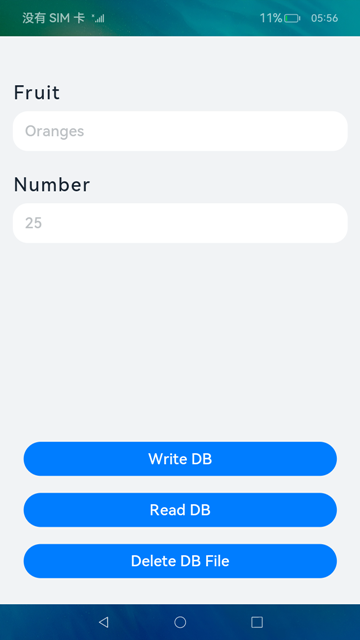
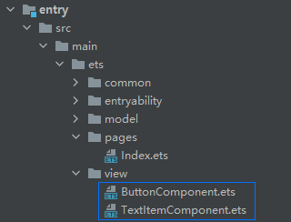

# 首选项（ArkTS）

## 介绍

本篇Codelab是基于HarmonyOS的首选项能力实现的一个简单示例。实现如下功能：

1.  创建首选项数据文件。
2.  将用户输入的水果名称和数量，写入到首选项数据库。
3.  读取首选项数据库中的数据。
4.  删除首选项数据文件。

最终效果图如下：


### 相关概念

-   [首选项](https://gitcode.com/openharmony/docs/blob/master/zh-cn/application-dev/reference/apis-arkui/apis/js-apis-data-preferences.md)：为应用提供Key-Value键值型的数据处理能力，支持应用持久化轻量级数据，并对其修改和查询。数据存储形式为键值对，键的类型为字符串型，值的存储数据类型包括数字型、字符型、布尔型以及这3种类型的数组类型。
-   [TextInput](https://gitcode.com/openharmony/docs/blob/master/zh-cn/application-dev/reference/apis-arkui/arkui-ts/ts-basic-components-textinput.md)：可以输入单行文本并支持响应输入事件的组件。
-   [Button](https://gitcode.com/openharmony/docs/blob/master/zh-cn/application-dev/reference/apis-arkui/arkui-ts/ts-basic-components-button.md)：按钮组件，可快速创建不同样式的按钮。

## 环境搭建

### 软件要求

-   [DevEco Studio](https://gitcode.com/openharmony/docs/blob/master/zh-cn/application-dev/quick-start/start-overview.md#%E5%B7%A5%E5%85%B7%E5%87%86%E5%A4%87)版本：DevEco Studio 3.1 Release。
-   OpenHarmony SDK版本：API version 9。

### 硬件要求

-   开发板类型：[润和RK3568开发板](https://gitcode.com/openharmony/docs/blob/master/zh-cn/device-dev/quick-start/quickstart-appendix-rk3568.md)。
-   OpenHarmony系统：3.2 Release。

### 环境搭建

完成本篇Codelab我们首先要完成开发环境的搭建，本示例以**RK3568**开发板为例，参照以下步骤进行：

1. [获取OpenHarmony系统版本](https://gitcode.com/openharmony/docs/blob/master/zh-cn/device-dev/get-code/sourcecode-acquire.md#%E8%8E%B7%E5%8F%96%E6%96%B9%E5%BC%8F3%E4%BB%8E%E9%95%9C%E5%83%8F%E7%AB%99%E7%82%B9%E8%8E%B7%E5%8F%96)：标准系统解决方案（二进制）。以3.2 Release版本为例：

   

2. 搭建烧录环境。

   1.  [完成DevEco Device Tool的安装](https://gitcode.com/openharmony/docs/blob/master/zh-cn/device-dev/quick-start/quickstart-ide-env-win.md)
   2.  [完成RK3568开发板的烧录](https://gitcode.com/openharmony/docs/blob/master/zh-cn/device-dev/quick-start/quickstart-ide-3568-burn.md)

3. 搭建开发环境。

   1.  开始前请参考[工具准备](https://gitcode.com/openharmony/docs/blob/master/zh-cn/application-dev/quick-start/start-overview.md#%E5%B7%A5%E5%85%B7%E5%87%86%E5%A4%87)，完成DevEco Studio的安装和开发环境配置。
   2.  开发环境配置完成后，请参考[使用工程向导](https://gitcode.com/openharmony/docs/blob/master/zh-cn/application-dev/quick-start/start-with-ets-stage.md#创建ets工程)创建工程（模板选择“Empty Ability”）。
   3.  工程创建完成后，选择使用[真机进行调测](https://gitcode.com/openharmony/docs/blob/master/zh-cn/application-dev/quick-start/start-with-ets-stage.md#使用真机运行应用)。

## 代码结构解读

本篇Codelab只对核心代码进行讲解，完整代码可以直接从gitee获取。

```
├──entry/src/main/ets              // 代码区
│  ├──common
│  │  ├──constants
│  │  │  ├──CommonConstants.ets    // 公共常量类
│  │  │  └──StyleConstants.ets     // 样式常量类 
│  │  └──utils
│  │     └──Logger.ets             // 日志打印类
│  ├──entryability
│  │  └──EntryAbility.ts           // 程序入口类
│  ├──model
│  │  └──PreferenceModel.ets       // 首选项相关方法类
│  ├──pages
│  │  └──Index.ets                 // 主界面	
│  ├──view
│  │  ├──ButtonComponent.ets       // 自定义Button组件类
│  │  └──TextItemComponent.ets     // 自定义Text组件类
│  └──viewmodel
│     ├──ButtonItemData.ets        // 按钮数据类
│     └──Fruit.ets                 // 水果数据类
└──entry/src/main/resources        // 资源文件目录
```

## 构建主界面

在这个任务中，我们将完成示例主界面的开发，效果图如下：



从上面效果图可以看出，主界面主要由2个相同样式的文本和文本输入框，以及3个相同样式的按钮组成。我们可以将文本和文本输入框抽取成一个TextItemComponent子组件。再将按钮抽取成一个ButtonComponent子组件。

1. 在ets目录下，点击鼠标右键 \> New \> Directory，新建名为view的自定义子组件目录。然后在view目录下，点击鼠标右键 \> New \> ArkTS File，新建两个ArkTS文件，分别为TextItemComponent子组件、ButtonComponent子组件。可以看到文件目录结构如下：

   

2. 文本和文本输入框抽取成的TextItemComponent子组件，效果图如下：

   

   具体代码如下：

   ```typescript
   // TextItemComponent.ets
   @Component
   export default struct TextItemComponent {
     private textResource: Resource = $r('app.string.empty'); // 按钮文本资源
     private placeholderResource: Resource = $r('app.string.empty'); // placeholder文本资源
     private marginBottom: string = '';
     private marginTop: string = '';
     private textInputType: InputType = InputType.Normal; // 输入框输入数据类型
     private textFlag: number = 0; // 文本框标记
     @Link fruit: Fruit; // 水果数据
     private textInputCallBack = (value: string) => {}; // TextInput的回调
   
     build() {
       Column() {
         Text(this.textResource)
           .fontSize(StyleConstants.TEXT_FONT_SIZE)
           .height(StyleConstants.TEXT_HEIGHT)
           .width(StyleConstants.FULL_PERCENT)
           .fontColor($r('app.color.text_font_color'))
           .letterSpacing(StyleConstants.LETTER_SPACING)
           .fontWeight(StyleConstants.FONT_WEIGHT)
           .margin({
             bottom: StyleConstants.TEXT_MARGIN_BOTTOM,
             left: StyleConstants.TEXT_MARGIN_LEFT,
             top: this.marginTop
           })
   
         TextInput({
           placeholder: this.placeholderResource,
           text: this.textFlag === 0 ? (this.fruit.fruitName) : (this.fruit.fruitNum)
         })
           .placeholderFont({ size: StyleConstants.FONT_SIZE, weight: StyleConstants.FONT_WEIGHT })
           .placeholderColor($r('app.color.placeholder_color'))
           .caretColor(Color.Blue)
           .type(this.textInputType)
           .height(StyleConstants.TEXT_INPUT_HEIGHT)
           .width(StyleConstants.TEXT_INPUT_WIDTH)
           .margin({ bottom: this.marginBottom })
           .fontSize(StyleConstants.FONT_SIZE)
           .fontColor($r('app.color.text_font_color'))
           .fontWeight(StyleConstants.FONT_WEIGHT)
           .backgroundColor($r('app.color.white'))
           .onChange((value: string) => {
             this.textInputCallBack(value);
           })
       }
     }
   }
   ```

3. 抽取的ButtonComponent子组件，效果图如下：

   

   具体代码如下：

   ```typescript
   // ButtonComponent.ets
   @Component
   export default struct ButtonComponent {
     private buttonItemValues: Array<ButtonItemData> = this.getButtonItemValues();
     @Link fruit: Fruit; // 水果数据 
   
     build() {
       Column() {
         ForEach(this.buttonItemValues, (item: ButtonItemData) => {
           Button(item.resource, { type: ButtonType.Capsule, stateEffect: true })
             .backgroundColor($r('app.color.button_background_color'))
             .width(StyleConstants.BUTTON_WIDTH)
             .height(StyleConstants.BUTTON_HEIGHT)
             .fontWeight(StyleConstants.FONT_WEIGHT)
             .fontSize(StyleConstants.FONT_SIZE)
             .margin({ bottom: StyleConstants.BUTTON_MARGIN_BOTTOM })
             .onClick(() => {
               item.clickMethod();
             })
         }, (item: ButtonItemData) => JSON.stringify(item))
       }
     }
   }
   ```

4. 在Index.ets主界面中引用TextItemComponent和ButtonComponent子组件，具体代码如下：

   ```typescript
   // Index.ets
   Column() {
     // 水果名称输入框
     TextItemComponent({
       textResource: $r('app.string.fruit_text'),
       placeholderResource: $r('app.string.fruit_placeholder'),
       textFlag: CommonConstants.FRUIT_FLAG,
       fruit: $fruit,
       textInputCallBack: (value: string) => {
         this.fruit.fruitName = value;
       }
     })
   
     // 水果数量输入框
     TextItemComponent({
       textResource: $r('app.string.number_text'),
       placeholderResource: $r('app.string.number_placeholder'),
       textFlag: CommonConstants.NUMBER_FLAG,
       fruit: $fruit,
       textInputCallBack: (value: string) => {
         this.fruit.fruitNum = value;
       }
     })
   
     // 按钮组件
     ButtonComponent({ fruit: $fruit })
   }
   .width(StyleConstants.FULL_PERCENT)
   .height(StyleConstants.FULL_PERCENT)
   .backgroundColor($r('app.color.main_background_color'))
   ```

## 创建数据文件

创建数据文件需要如下两个步骤：

-   导入dataPreferences模块。
-   通过dataPreferences模块的getPreferences\(context, name\)方法获取到对应文件名的Preferences实例。

Preferences的数据存储在文件中，因此需要指定存储的文件名PREFERENCES\_NAME。再通过Preferences提供的方法进行数据库的相关操作。具体代码如下：

```typescript
// PreferenceModel.ets
// 导入dataPreferences模块
import dataPreferences from '@ohos.data.preferences';

let context = getContext(this);
let preference: dataPreferences.Preferences;
let preferenceTemp: dataPreferences.Preferences;

// 调用getPreferences方法读取指定首选项持久化文件，将数据加载到Preferences实例，用于数据操作
async getPreferencesFromStorage() {
  try {
    preference = await dataPreferences.getPreferences(context, CommonConstants.PREFERENCES_NAME);
  } catch (err) {
    Logger.error(CommonConstants.TAG, `Failed to get preferences, Cause: ${err}`);
  }
}
```

## 写入数据

获取Preferences实例后，使用Preferences的put方法，将用户输入的水果名称和水果数量数据，保存到缓存的实例中。再通过Preferences的flush方法将Preferences实例异步存储到首选项持久化文件中。具体代码如下：

```typescript
// PreferenceModel.ets
async putPreference(fruit: Fruit) {
  ...
  try {
    // 将用户输入的水果名称和水果数量数据，保存到缓存的Preference实例中
    await preference.put(CommonConstants.KEY_NAME, JSON.stringify(fruit));
  } catch (err) {
    Logger.error(CommonConstants.TAG, `Failed to put value, Cause: ${err}`);
  }
  // 将Preference实例存储到首选项持久化文件中
  await preference.flush();
}
```

## 读取数据

使用Preferences的get方法读取数据。如果键不存在，则返回默认值。例如获取下面代码中fruit的值，如果fruit的键KEY\_NAME不存在，则会返回空字符串。通过默认值的设置，来避免程序出现异常。具体代码如下：

```typescript
// PreferenceModel.ets
async getPreference() {
  let fruit = '';
  ...
  try {
    fruit = (await preference.get(CommonConstants.KEY_NAME, '')).toString();
  } catch (err) {
    Logger.error(CommonConstants.TAG, `Failed to get value, Cause: ${err}`);
  }
  ...
}
```

## 删除数据文件

通过dataPreferences模块的deletePreferences\(context, name\)方法从内存中移除指定文件对应的Preferences单实例。移除Preferences单实例时，应用不允许再使用该实例进行数据操作，否则会出现数据一致性问题。具体代码如下：

```typescript
// PreferenceModel.ets
async deletePreferences() {
  try {
    await dataPreferences.deletePreferences(context, CommonConstants.PREFERENCES_NAME);
  } catch(err) {
    Logger.error(CommonConstants.TAG, `Failed to delete preferences, Cause: ${err}`);
  };
  ...
}
```

## 总结

您已经完成了本次Codelab的学习，并了解到以下知识点：

1.  如何使用TextInput输入框。
2.  如何使用首选项数据库。


