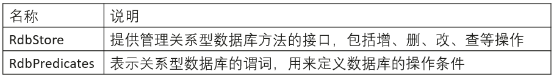
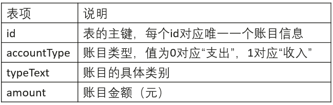
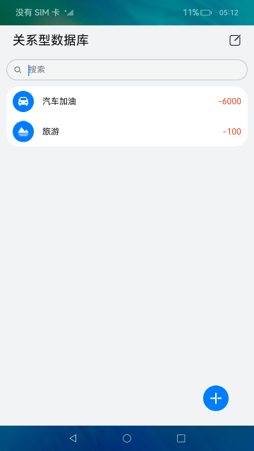
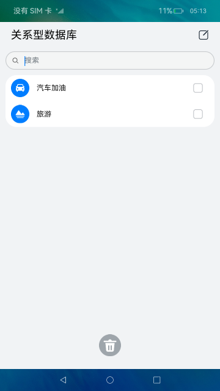

# 关系型数据库（ArkTS）

## 介绍

本Codelab以记账为例，使用关系型数据库的相关接口实现了对账单的增、删、改、查操作。实现效果如图所示：


### 相关概念

- [关系型数据库](https://gitee.com/openharmony/docs/blob/master/zh-cn/application-dev/reference/apis/js-apis-data-rdb.md)：基于关系模型来管理数据的数据库，提供了增、删、改、查等接口，也可运行输入的SQL语句满足复杂场景需要。

## 环境搭建

### 软件要求

-   [DevEco Studio](https://gitee.com/openharmony/docs/blob/master/zh-cn/application-dev/quick-start/start-overview.md#%E5%B7%A5%E5%85%B7%E5%87%86%E5%A4%87)版本：DevEco Studio 3.1 Release。
-   OpenHarmony SDK版本：API version 9。

### 硬件要求

-   开发板类型：[润和RK3568开发板](https://gitee.com/openharmony/docs/blob/master/zh-cn/device-dev/quick-start/quickstart-appendix-rk3568.md)。
-   OpenHarmony系统：3.2 Release。

### 环境搭建

完成本篇Codelab我们首先要完成开发环境的搭建，本示例以**RK3568**开发板为例，参照以下步骤进行：

1.  [获取OpenHarmony系统版本](https://gitee.com/openharmony/docs/blob/master/zh-cn/device-dev/get-code/sourcecode-acquire.md#%E8%8E%B7%E5%8F%96%E6%96%B9%E5%BC%8F3%E4%BB%8E%E9%95%9C%E5%83%8F%E7%AB%99%E7%82%B9%E8%8E%B7%E5%8F%96)：标准系统解决方案（二进制）。以3.2 Release版本为例：

    

2.  搭建烧录环境。
    1.  [完成DevEco Device Tool的安装](https://gitee.com/openharmony/docs/blob/master/zh-cn/device-dev/quick-start/quickstart-ide-env-win.md)
    2.  [完成RK3568开发板的烧录](https://gitee.com/openharmony/docs/blob/master/zh-cn/device-dev/quick-start/quickstart-ide-3568-burn.md)

3.  搭建开发环境。
    1.  开始前请参考[工具准备](https://gitee.com/openharmony/docs/blob/master/zh-cn/application-dev/quick-start/start-overview.md#%E5%B7%A5%E5%85%B7%E5%87%86%E5%A4%87)，完成DevEco Studio的安装和开发环境配置。
    2.  开发环境配置完成后，请参考[使用工程向导](https://gitee.com/openharmony/docs/blob/master/zh-cn/application-dev/quick-start/start-with-ets-stage.md#创建ets工程)创建工程（模板选择“Empty Ability”），选择JS或者eTS语言开发。
    3.  工程创建完成后，选择使用[真机进行调测](https://gitee.com/openharmony/docs/blob/master/zh-cn/application-dev/quick-start/start-with-ets-stage.md#使用真机运行应用)。

## 代码结构解读

本篇Codelab只对核心代码进行讲解，完整代码可以直接从gitee获取。

```
├──entry/src/main/ets               // 代码区
│  ├──common
│  │  ├──constants
│  │  │  └──CommonConstants.ets     // 公共常量
│  │  ├──database
│  │  │  ├──tables
│  │  │  │  └──AccountTable.ets     // 账目数据表
│  │  │  └──Rdb.ets                 // RDB数据库
│  │  └──utils                      // 日志类
│  │     ├──ConsoleLogger.ets
│  │     ├──HiLogger.ets
│  │     ├──ILogger.ets
│  │     └──Logger.ets
│  ├──entryability
│  │  └──EntryAbility.ts            // 程序入口类
│  ├──pages
│  │  └──MainPage.ets               // 应用首页
│  ├──view
│  │  └──DialogComponent.ets        // 自定义弹窗
│  └──viewmodel
│     ├──AccountData.ets            // 账目类接口
│     ├──AccountItem.ets            // 账目资源类接口
│     ├──AccountList.ets            // 账目类型model
│     └──ConstantsInterface.ets     // 常量接口
└──entry/src/main/resources         // 资源文件夹
```

## 创建数据库

要使用关系型数据库存储用户数据，首先要进行数据库的创建，并提供基本的增、删、改、查接口。

导入关系型数据库模块：

```typescript
import relationalStore from '@ohos.data.relationalStore';
```

关系型数据库提供以下两个基本功能：



首先要获取一个RdbStore实例来操作关系型数据库，代码如下：

```typescript
// Rdb.ets
getRdbStore(callback: Function = () => {
}) {
  // 如果已经获取到RdbStore则不做操作
  if (!callback || typeof callback == 'undefined' || callback == undefined) {
    Logger.verbose(`${CommonConstants.RDB_TAG}`, 'getRdbStore() has no callback!');
    return;
  }
  

  // 应用上下文，本Codelab使用API9 Stage模型的Context
  let context: Context = getContext(this) as Context;
  relationalStore.getRdbStore(context, CommonConstants.STORE_CONFIG, (err, rdb) => {
    if (err) {
      Logger.error(`${RDB_TAG}`, 'gerRdbStore() failed, err: ' + err);
      return;
    }
    this.rdbStore = rdb;

    // 获取到RdbStore后，需使用executeSql接口初始化数据库表结构和相关数据
    this.rdbStore.executeSql(this.sqlCreateTable);          
    Logger.verbose(`${RDB_TAG}`, 'getRdbStore() finished.');
    callback();
  });
}
```

关系型数据库接口提供的增、删、改、查操作均有callback和Promise两种异步回调方式，本Codelab使用了callback异步回调，其中插入数据使用了insert\(\)接口，实现代码如下：

```typescript
// Rdb.ets
insertData(data: relationalStore.ValuesBucket, callback: Function = () => {
}) {
  if (!callback || typeof callback == 'undefined' || callback == undefined) {
    Logger.verbose(`${CommonConstants.RDB_TAG}`, 'insertData() has no callback!');
    return;
  }
  let resFlag: boolean = false;
  const valueBucket: relationalStore.ValuesBucket = data;
  if (this.rdbStore) {
    this.rdbStore.insert(this.tableName, valueBucket, (err, ret) => {
      if (err) {
        Logger.error(`${CommonConstants.RDB_TAG}`, 'insertData() failed, err: ' + err);
        callback(resFlag);
        return;
      }
      Logger.verbose(`${CommonConstants.RDB_TAG}`, 'insertData() finished: ' + ret);
      callback(ret);
    });
  }
}
```

删除数据使用了delete\(\)接口，实现代码如下：

```typescript
// Rdb.ets
deleteData(predicates: relationalStore.RdbPredicates, callback: Function = () => {
}) {
  if (!callback || typeof callback == 'undefined' || callback == undefined) {
    Logger.verbose(`${CommonConstants.RDB_TAG}`, 'deleteData() has no callback!');
    return;
  }
  let resFlag: boolean = false;
  if (this.rdbStore) {
    this.rdbStore.delete(predicates, (err, ret) => {
      if (err) {
        Logger.error(`${CommonConstants.RDB_TAG}`, 'deleteData() failed, err: ' + err);
        callback(resFlag);
        return;
      }
      Logger.verbose(`${CommonConstants.RDB_TAG}`, 'deleteData() finished: ' + ret);
      callback(!resFlag);
    });
  }
}
```

更新数据使用了update\(\)接口，实现代码如下：

```typescript
// Rdb.ets
updateData(predicates: relationalStore.RdbPredicates, data: relationalStore.ValuesBucket, callback: Function = () => {
}) {
  if (!callback || typeof callback == 'undefined' || callback == undefined) {
    Logger.verbose(`${CommonConstants.RDB_TAG}`, 'updateDate() has no callback!');
    return;
  }
  let resFlag: boolean = false;
  const valueBucket: relationalStore.ValuesBucket = data;
  if (this.rdbStore) {
    this.rdbStore.update(valueBucket, predicates, (err, ret) => {
      if (err) {
        Logger.error(`${CommonConstants.RDB_TAG}`, 'updateData() failed, err: ' + err);
        callback(resFlag);
        return;
      }
      Logger.verbose(`${CommonConstants.RDB_TAG}`, 'updateData() finished: ' + ret);
      callback(!resFlag);
    });
  }
}
```

查找数据使用了query\(\)接口，实现代码如下：

```typescript
// Rdb.ets
query(predicates: relationalStore.RdbPredicates, callback: Function = () => {
}) {
  if (!callback || typeof callback == 'undefined' || callback == undefined) {
    Logger.verbose(`${CommonConstants.RDB_TAG}`, 'query() has no callback!');
    return;
  }
  if (this.rdbStore) {
    this.rdbStore.query(predicates, this.columns, (err, resultSet) => {
      if (err) {
        Logger.error(`${CommonConstants.RDB_TAG}`, 'query() failed, err: ' + err);
        return;
      }
      Logger.verbose(`${CommonConstants.RDB_TAG}`, 'query() finished.');
      callback(resultSet);
      resultSet.close();
    });
  }
}
```

本Codelab需要记录账目的类型（收入/支出）、具体类别和金额，因此需要创建一张存储账目信息的表，表头如下：



创建该表的SQL语句为：

```sql
CREATE TABLE IF NOT EXISTS accountTable(
    id INTEGER PRIMARY KEY AUTOINCREMENT, 
    accountType INTEGER, 
    typeText TEXT, 
    amount INTEGER
)
```

该表需要封装增、删、改、查接口，代码如下：

```typescript
// AccountTable.ets
// 插入数据
insertData(account: AccountData, callback: Function) {
  // 根据输入数据创建待插入的数据行
  const valueBucket: relationalStore.ValuesBucket = generateBucket(account);
  this.accountTable.insertData(valueBucket, callback);
}

// 删除数据
deleteData(account: AccountData, callback: Function) {
  let predicates = new relationalStore.RdbPredicates(CommonConstants.ACCOUNT_TABLE.tableName);
  
  // 根据id匹配待删除的数据行
  predicates.equalTo('id', account.id);
  this.accountTable.deleteData(predicates, callback);
}

// 修改数据
updateData(account: AccountData, callback: Function) {
  const valueBucket: relationalStore.ValuesBucket = generateBucket(account);
  let predicates = new relationalStore.RdbPredicates(CommonConstants.ACCOUNT_TABLE.tableName);

  // 根据id匹配待删除的数据行
  predicates.equalTo('id', account.id);
  this.accountTable.updateData(predicates, valueBucket, callback);
}

// 查找数据
query(amount: number, callback: Function, isAll: boolean = true) {
  let predicates = new relationalStore.RdbPredicates(CommonConstants.ACCOUNT_TABLE.tableName);
  if (!isAll) {
    predicates.equalTo('amount', amount);
  }
  this.accountTable.query(predicates, (resultSet: relationalStore.ResultSet) => {
    let count: number = resultSet.rowCount;
    if (count === 0 || typeof count === 'string') {
      console.log(`${CommonConstants.TABLE_TAG}` + 'Query no results!');
      callback([]);
    } else {
      resultSet.goToFirstRow();
      const result: AccountData[] = [];
      for (let i = 0; i < count; i++) {
        let tmp: AccountData = { id: 0, accountType: 0, typeText: '', amount: 0 };
        tmp.id = resultSet.getDouble(resultSet.getColumnIndex('id'));
        tmp.accountType = resultSet.getDouble(resultSet.getColumnIndex('accountType'));
        tmp.typeText = resultSet.getString(resultSet.getColumnIndex('typeText'));
        tmp.amount = resultSet.getDouble(resultSet.getColumnIndex('amount'));
        result[i] = tmp;
        resultSet.goToNextRow();
      }
      callback(result);
    }
  });
}
```

## 功能实现

首先创建应用主页面，主要包括使用Search组件创建的搜索栏和使用List组件创建的账目清单，如下图所示：



在打开应用时，需要查询数据库中存储的账目并显示在主页面，因此生命周期函数aboutToAppear\(\)应写为：

```typescript
// Mainpage.ets
aboutToAppear() {
  this.AccountTable.getRdbStore(() => {  // 获取数据库
    this.AccountTable.query(0, (result: AccountData[]) => {  // 查询数据库中的全部账目
      this.accounts = result;
    }, true);
  });
}
```

点击右上角的“编辑”图标，主页面变为如下效果：



可以选中需要删除的账目，点击下方“删除”图标后删除对应账目，对应代码如下：

```typescript
// Mainpage.ets
deleteListItem() {
  for (let i = 0; i < this.deleteList.length; i++) {  // 删除每一项选中的账目并更新页面上的账目清单
    let index = this.accounts.indexOf(this.deleteList[i]);
    this.accounts.splice(index, 1);
    this.AccountTable.deleteData(this.deleteList[i], () => {});
  }
  this.deleteList = [];
  this.isEdit = false;
}
```

搜索栏在键入文本并回车时，实现搜索功能：

```typescript
// Mainpage.ets
.onSubmit((searchValue: string) => {
  if (searchValue === '') {  // 如果搜索栏为空，查找全部账目
    this.AccountTable.query(0, (result: AccountData[]) => {
      this.accounts = result;
    }, true);
  } else {
    this.AccountTable.query(Number(searchValue), (result: AccountData[]) => {  // 查找金额为val的账目
      this.accounts = result;
    }, false);
  }
})
```

右下角的“添加”按钮可以打开一个自定义弹窗，并在弹窗里新建账目信息：

```typescript
// Mainpage.ets
.onClick(() => {
  this.isInsert = true;  // 插入模式
  this.newAccount = { id: 0, accountType: 0, typeText: '', amount: 0 };
  this.dialogController.open();
})
```

点击账目清单中的某个账目，也可以打开自定义弹窗，并修改账目信息：

```typescript
// Mainpage.ets
selectListItem(item: AccountData) {
  this.isInsert = false;  // 编辑模式
  this.index = this.accounts.indexOf(item);
  this.newAccount = {
    id: item.id,
    accountType: item.accountType,
    typeText: item.typeText,
    amount: item.amount
  };
}
```

自定义弹窗由使用Tabs组件创建的账目类别、使用TextInput组件创建的输入栏和确定按钮组成，如下图所示：


点击“确定”按钮会调用accept\(\)函数，根据isInsert的值来进行账目的添加或修改，代码如下：

```typescript
// Mainpage.ets
accept(isInsert: boolean, newAccount: AccountData): void {
  if (isInsert) {  // 插入模式，往数据库插入一个新账目
    Logger.verbose(`${CommonConstants.INDEX_TAG}`, 'The account inserted is: ' + JSON.stringify(newAccount));
    this.AccountTable.insertData(newAccount, (id: number) => {
      newAccount.id = id;
      this.accounts.push(newAccount);
    });
  } else {  // 编辑模式，更新当前选中的账目并写入数据库，刷新页面的账目清单
    this.AccountTable.updateData(newAccount, () => {});
    let list = this.accounts;
    this.accounts = [];
    list[this.index] = newAccount;
    this.accounts = list;
    this.index = -1;
  }
}
```

通过本Codelab的学习，您已经学会了关系型数据库的基本用法。

## 总结

您已经完成了本次Codelab的学习，并学会了使用关系型数据库的相关接口实现对数据的增、删、改、查操作。


