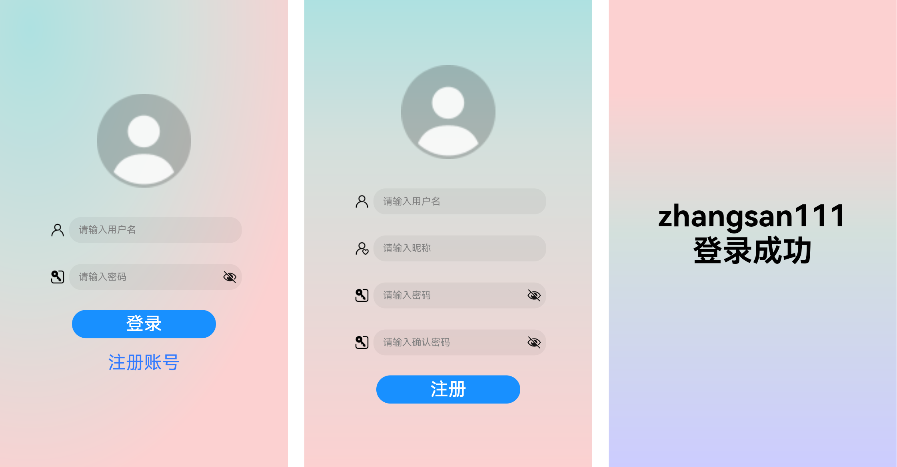
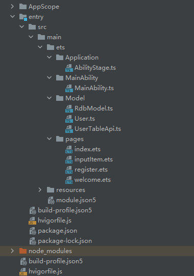
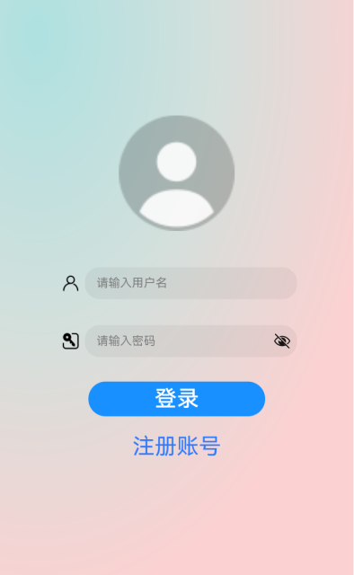
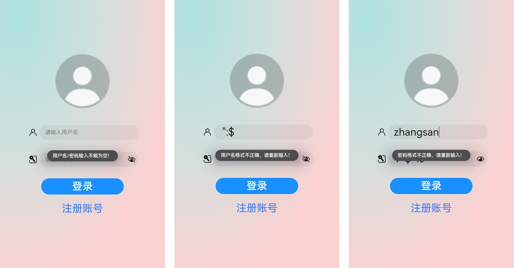
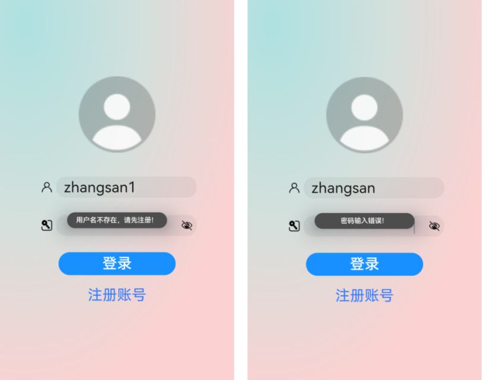
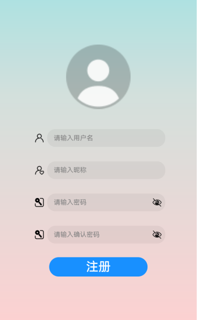
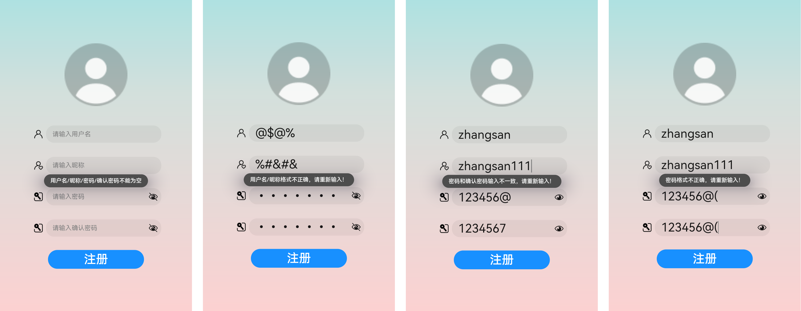
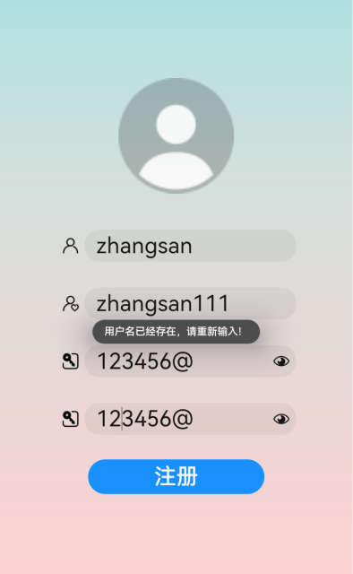
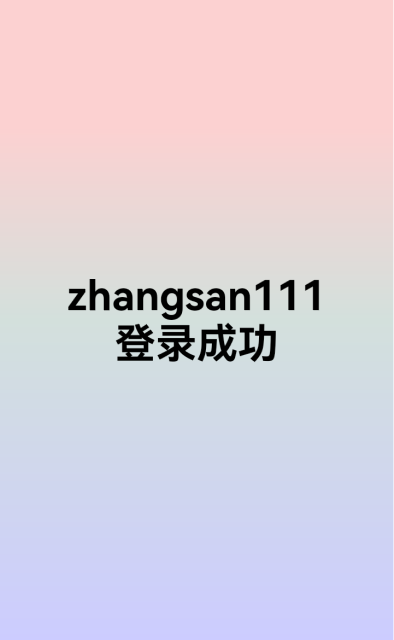

# 介绍<a name="ZH-CN_TOPIC_0000001289400894"></a>

本Codelab针对用户隐私安全，使用加密算法API对密码进行加密存储，模拟开发一个用户注册登录应用。实现如下功能：

-   展示登录、注册、登录成功页面。
-   注册的用户数据保存到关系型数据库中。
-   登录时通过查询数据库校验用户是否存在、密码是否正确。
-   密码通过加密算法保存和使用。
-   渐变颜色的使用。

最终效果图如下：



# 相关概念<a name="ZH-CN_TOPIC_0000001289744524"></a>

-   [TextInput](https://gitee.com/openharmony/docs/blob/master/zh-cn/application-dev/reference/arkui-ts/ts-basic-components-textinput.md)：提供单行文本输入组件。
-   [颜色渐变](https://gitee.com/openharmony/docs/blob/master/zh-cn/application-dev/reference/arkui-ts/ts-universal-attributes-gradient-color.md)：提供组件的渐变颜色。
-   [加密算法](https://gitee.com/openharmony/docs/blob/master/zh-cn/application-dev/reference/apis/js-apis-system-cipher.md)：提供文本的加解密算法。
-   [关系型数据库](https://gitee.com/openharmony/docs/blob/master/zh-cn/application-dev/database/database-relational-guidelines.md)：提供给用户无需编写原生SQL语句就能进行数据增删改查的方法，同时也支持原生SQL语句操作。

# 搭建OpenHarmony环境<a name="ZH-CN_TOPIC_0000001342144617"></a>

完成本篇Codelab我们首先要完成开发环境的搭建，本示例以**RK3568**开发板为例，参照以下步骤进行：

1. [获取OpenHarmony系统版本](https://gitee.com/openharmony/docs/blob/master/zh-cn/device-dev/get-code/sourcecode-acquire.md#%E8%8E%B7%E5%8F%96%E6%96%B9%E5%BC%8F3%E4%BB%8E%E9%95%9C%E5%83%8F%E7%AB%99%E7%82%B9%E8%8E%B7%E5%8F%96)：标准系统解决方案（二进制）。

   以3.1版本为例：

   

2. 搭建烧录环境。

   1.  [完成DevEco Device Tool的安装](https://gitee.com/openharmony/docs/blob/master/zh-cn/device-dev/quick-start/quickstart-ide-env-win.md)
   2.  [完成RK3568开发板的烧录](https://gitee.com/openharmony/docs/blob/master/zh-cn/device-dev/quick-start/quickstart-ide-3568-burn.md)

3. 搭建开发环境。

   1.  开始前请参考[工具准备](https://gitee.com/openharmony/docs/blob/master/zh-cn/application-dev/quick-start/start-overview.md#%E5%B7%A5%E5%85%B7%E5%87%86%E5%A4%87)，完成DevEco Studio的安装和开发环境配置。
   2.  开发环境配置完成后，请参考[使用工程向导](https://gitee.com/openharmony/docs/blob/master/zh-cn/application-dev/quick-start/start-with-ets-stage.md#%E5%88%9B%E5%BB%BAets%E5%B7%A5%E7%A8%8B)创建工程（模板选择“Empty Ability”），选择JS或者eTS语言开发。
   3.  工程创建完成后，选择使用[真机进行调测](https://gitee.com/openharmony/docs/blob/master/zh-cn/application-dev/quick-start/start-with-ets-stage.md#%E4%BD%BF%E7%94%A8%E7%9C%9F%E6%9C%BA%E8%BF%90%E8%A1%8C%E5%BA%94%E7%94%A8)。

# 代码结构解读<a name="ZH-CN_TOPIC_0000001289584924"></a>



-   AppScope：App作用域目录。
-   entry/src/main/ets：程序目录。
    -   Application：stage模型目录。
        -   AbilityStage.ts：stage模型文件。

    -   MainAbility：程序入口目录。
        -   MainAbility.ts：程序入口类。

    -   Model：数据库文件目录。
        -   RdbModel.ts：关系型数据库增删查改方法。
        -   User.ts：用户信息实体类。
        -   UserTableApi.ts：调用数据库增删查改方法API。

    -   pages：界面目录。
        -   index.ets：主界面（登录界面）。
        -   inputItem.ets：自定义的TextInput输入框子组件。
        -   register.ets：注册页面。
        -   welcome.ets：登录成功后的欢迎页面。


-   entry/src/main/resources：资源文件目录。
-   entry/src/main/module.json5：应用配置文件。
-   entry/src/build-profile.json5：应用构建配置文件。
-   build-profile.json5：版本信息配置文件。

# 登录页面<a name="ZH-CN_TOPIC_0000001289469570"></a>

登录页面包括用户默认头像、用户名和密码输入框、登录按钮、跳转到注册页面的文本链接。效果图如下：



1. 页面布局具体代码如下：

   ```
   Flex({ direction: FlexDirection.Column, justifyContent: FlexAlign.Center, alignItems: ItemAlign.Center }) {
     // 用户默认头像
     Image($r('app.media.user'))
       .objectFit(ImageFit.Contain)
       .height('20%')
       .margin({ bottom: '4%' })
     // 用户名输入框	
     InputItem({
       placeholderName: '请输入用户名',
       imageRes: $r('app.media.username'),
       inputValue: $inputValue,
       inputType: 0,
       typeFlag: false
     })
     // 密码输入框
     InputItem({
       placeholderName: '请输入密码',
       imageRes: $r('app.media.password'),
       inputValue: $inputValue,
       inputType: 1,
       typeFlag: true
     })
     // 登录按钮
     Button('登录', { type: ButtonType.Capsule, stateEffect: true })
       .width('50%')
       .height('6%')
       .margin({ top: '2%' })
       .fontSize(30)
       .backgroundColor('#1890FF')
       .onClick(() => {
         // 用户名和密码数据校验
         if (!this.checkUserData()) {
           return;
         }
         // 处理用户输入的信息
         this.dealUserData();
       });
     // 跳转到注册页面的文本框
     Text("注册账号")
       .fontColor('#317AFF')
       .fontSize(30)
       .margin({ top: '3%' })
       .textAlign(TextAlign.Center)
       .onClick(() => {
         router.push({
           uri: 'pages/register'
         });
       });
   }
   .width('100%')
   .height('100%')
   ```
   
2. 其中InputItem是自定义的TextInput输入框子组件，具体代码如下：

   ```
   @Component
   export struct InputItem {
     @Link inputValue: string
     private placeholderName
     private typeFlag
     private imageRes
     private inputType
   
     build() {
       Stack({ alignContent: Alignment.Center }) {
         TextInput({ placeholder: this.placeholderName })
           .type(this.typeFlag ? InputType.Password : InputType.Normal)
           .placeholderColor(Color.Gray)
           .fontSize(30)
           .caretColor(Color.Gray)
           .width('60%')
           .height('55%')
           .maxLength(14)
           .margin({ left: '8%' })
           .onChange((value) => {
             this.inputValue = this.getReturnType(this.inputType) + ':' + value.trim();
           });
   
         // 输入框左边的小图标
         Image(this.imageRes)
           .objectFit(ImageFit.Contain)
           .height('33%')
           .offset({ x: '-30%', y: '0%' })
       }
       .height('10%')
       .width('100%')
     }
   
     // 获取输入框的返回类型，用来区分输入框中输入的值是用户名还是密码
     getReturnType(inputType) {
       return inputType;
     }
   }
   ```
   
3. 登录页面中背景的渐变颜色，是通过radialGradient径向渐变设置的，具体代码如下：

   ```
   Flex({ direction: FlexDirection.Column, justifyContent: FlexAlign.Center, alignItems: ItemAlign.Center }) {
     // 登录页面的布局代码，如上文所示
   }
   .width('100%')
   .height('100%')
   .radialGradient({
     center: [50, 50], // 径向渐变的中心点
     radius: '100%', // 径向渐变的半径
     colors: [['#AEE1E1', 0.0], ['#D3E0DC', 0.5], ['#FCD1D1', 1.0]] // 径向渐变的颜色描述
   })
   ```

4. 点击页面上的“登录”按钮，会进行用户名和密码的数据校验，如果数据校验不符合要求，则会弹出错误提示信息。如果数据校验符合要求，则进一步处理用户输入的信息。

   数据校验的要求：

   -   用户名/密码输入不能为空。
   -   用户名为1-14位中文、字母、数字、下划线或者这几项的组合。
   -   密码为4-14个数字、字母或者!@$\#%^&\*或者他们的组合。

   

   数据校验具体代码如下：

   ```
   // 用户名和密码数据校验
   checkUserData() {
     // 判断账号或密码是否为空
     if (this.username == '' || this.password == '') {
       prompt.showToast({
         message: '用户名/密码输入不能为空！',
         duration: 3000,
         bottom: '40%'
       });
       return false;
     }
     // 用户名为1-14位中文、字母、数字、下划线或者这几项的组合
     let namePattern = /^[\u4E00-\u9FA5A-Za-z0-9_]{1,14}$/;
     if (!namePattern.exec(this.username)) {
       prompt.showToast({
         message: '用户名格式不正确，请重新输入！',
         duration: 3000,
         bottom: '40%'
       });
       return false;
     }
     // 密码为4-14个数字、字母或者!@$#%^&*或者他们的组合
     let passwordPattern = /^[A-Za-z0-9!@$#%^&*]{4,14}$/;
     if (!passwordPattern.exec(this.password)) {
       prompt.showToast({
         message: '密码格式不正确，请重新输入！',
         duration: 3000,
         bottom: '40%'
       });
       return false;
     }
     return true;
   }
   ```

   数据校验符合要求后，则会进一步处理用户输入的信息，即查询数据库里对应的用户信息：

   -   如果不存在用户名，则会提示用户不存在，请先注册。
   -   如果存在用户名，则会去调用aes解密API，去解密数据库中保存的密码，比较解密之后的密码是否和用户输入一致，如果输入不一致，则会提示密码输入错误。如果输入一致，则跳转到登录成功页面。

   

   处理用户输入的信息，具体代码如下：

   ```
   // 处理用户输入的信息
   async dealUserData() {
     // 查询数据库里对应的用户信息
     await this.userTableApi.queryUserByUsername(this.username).then((ret) => {
       this.userList = ret;
     });
     if (this.userList.length === 0) {
       prompt.showToast({
         message: '用户名不存在，请先注册！',
         duration: 3000,
         bottom: '40%'
       });
       return;
     }
     // 将密码用字符串解密API解密
     this.aesDecrypt();
   }
   
   // aes解密
   aesDecrypt() {
     let that = this;
     cipher.aes({
       //解密：
       action: 'decrypt',
       //待解密的内容，是base64编码后的一段二进制值
       text: this.userList[0].password,
       key: 'NDM5Qjk2UjAzMEE0NzVCRjlFMkQwQkVGOFc1NkM1QkQ=',
       transformation: 'AES/CBC/PKCS5Padding',
       ivOffset: 0,
       ivLen: 16,
       success: function(data) {
         that.decryptPassword = data.text;
         that.login();
       },
       fail: function (data, code) {
         console.info("aes解密方法执行失败")
       },
     });
   }
   
   // 判断解密之后的密码和用户输入的密码是否一致，一致就登录成功
   login() {
     let user = this.userList[0];
     if (this.decryptPassword == this.password) {
       // 跳转到登录成功页面
       router.push({
         uri: 'pages/welcome',
         params: { 'nickname': user.nickname }
       });
     } else {
       prompt.showToast({
         message: '密码输入错误！',
         duration: 3000,
         bottom: '40%'
       });
     }
   }
   ```

5. 关系型数据库：查询数据库里对应的用户信息，具体代码如下：

   ```
   // 根据用户名查询用户信息
   async queryUserByUsername(username) {
       let resultList;
       await this.userTable.getRdbStore().then(async () => {
           let predicates = new dataRdb.RdbPredicates(TABLE_NAME);
           predicates.equalTo('username', username);
           let ret = await this.userTable.query(predicates);
           resultList = getListFromResultSet(ret);
       });
       return resultList;
   }
   
   // 查询数据
   async query(predicates) {
       let resultList;
       let promiseQuery = this.rdbStore.query(predicates, this.columns);
       await promiseQuery.then((resultSet) => {
           resultList = resultSet;
       }).catch((err) => {
           console.log("query err" + JSON.stringify(err));
       });
       return resultList;
   }
   
   // 将查询到的结果封装成User对应的用户信息
   function getListFromResultSet(resultSet) {
       let userList = [];
       for (let i = 0; i < resultSet.rowCount; i++) {
           resultSet.goToNextRow();
           let user = new User(resultSet.getDouble(resultSet.getColumnIndex('id')),
               resultSet.getString(resultSet.getColumnIndex('username')),
               resultSet.getString(resultSet.getColumnIndex('nickname')),
               resultSet.getString(resultSet.getColumnIndex('password')));
           userList.push(user);
       }
       return userList;
   }
   ```

# 注册页面<a name="ZH-CN_TOPIC_0000001342189881"></a>

注册页面包括用户默认头像、用户名、昵称、密码和确认密码输入框、注册按钮。效果图如下：



1. 页面布局具体代码如下：

   ```
   Flex({ direction: FlexDirection.Column, justifyContent: FlexAlign.Center, alignItems: ItemAlign.Center }) {
     // 用户默认头像
     Image($r('app.media.user'))
       .objectFit(ImageFit.Contain)
       .height('20%')
       .margin({ bottom: '4%' })
     // 用户名输入框
     InputItem({
       placeholderName: '请输入用户名',
       imageRes: $r('app.media.username'),
       inputValue: $inputValue,
       inputType: 0,
       typeFlag: false
     })
     // 昵称输入框
     InputItem({
       placeholderName: '请输入昵称',
       imageRes: $r('app.media.nickname'),
       inputValue: $inputValue,
       inputType: 1,
       typeFlag: false
     })
     // 密码输入框
     InputItem({
       placeholderName: '请输入密码',
       imageRes: $r('app.media.password'),
       inputValue: $inputValue,
       inputType: 2,
       typeFlag: true
     })
     // 确认密码输入框
     InputItem({
       placeholderName: '请输入确认密码',
       imageRes: $r('app.media.password'),
       inputValue: $inputValue,
       inputType: 3,
       typeFlag: true
     })
     // 注册按钮
     Button('注册', { type: ButtonType.Capsule, stateEffect: true })
       .width('50%')
       .height('6%')
       .margin({ top: '2%' })
       .fontSize(30)
       .backgroundColor('#1890FF')
       .onClick(() => {
         // 用户名/昵称/密码/确认密码 数据校验
         if (!this.checkUserData()) {
           return;
         }
         // 注册用户信息
         this.registerUser();
       });
   }
   .width('100%')
   .height('100%')
   ```
   
2. 注册页面中背景的渐变颜色，是通过linearGradient线性渐变设置的，具体代码如下：

   ```
   Flex({ direction: FlexDirection.Column, justifyContent: FlexAlign.Center, alignItems: ItemAlign.Center }) {
     // 注册页面的布局代码，如上文所示
   }
   .width('100%')
   .height('100%')
   .linearGradient({
     angle: 180, // 线性渐变的角度
     direction: GradientDirection.Bottom, // 线性渐变的方向
     colors: [['#AEE1E1', 0.0], ['#D3E0DC', 0.3], ['#FCD1D1', 1.0]] // 线性渐变的颜色描述
   }
   ```

3. 点击页面上的“注册”按钮，会进行用户名、昵称、密码和确认密码的数据校验，如果数据校验不符合要求，则会弹出错误提示信息。如果数据校验符合要求，则注册用户信息。

   数据校验的要求：

   -   用户名/昵称/密码/确认密码输入不能为空。
   -   用户名/昵称为1-14位中文、字母、数字、下划线或者这几项的组合。
   -   密码和确认密码输入一致。
   -   密码为4-14个数字、字母或者!@$\#%^&\*或者他们的组合。

   

   数据校验具体代码和上文登录页面的数据校验类似，这里不再作重复介绍。

   数据校验符合要求后，则会注册用户信息，即将用户信息保存到关系型数据库。将用户信息保存到数据库之前，要先验证用户名是否已经被注册：

   -   如果用户名已经被注册，则会提示用户名已经存在，请重新输入。
   -   如果用户名没有被注册，则会去调用aes加密API，去加密用户密码，然后将加密后的密码、用户名、昵称保存到数据库。
   -   注册成功后，跳转到登录页面。

   

   注册用户信息具体代码如下：

   ```
   // 注册用户信息
   async registerUser() {
     // 注册之前先查询该用户名是否已经注册
     await this.userTableApi.queryUserByUsername(this.username).then((ret) => {
       this.userList = ret;
     });
     if (this.userList.length != 0) {
       prompt.showToast({
         message: '用户名已经存在，请重新输入！',
         duration: 3000,
         bottom: '40%'
       });
       return;
     }
     // 将密码用字符串加密API，加密之后，存储加密的密码
     this.aesEncrypt();
   }
   
   // aes加密
   aesEncrypt() {
     let that = this;
     cipher.aes({
       //加密
       action: 'encrypt',
       //待加密的文本内容
       text: this.password,
       //base64编码后的密钥
       key: 'NDM5Qjk2UjAzMEE0NzVCRjlFMkQwQkVGOFc1NkM1QkQ=',
       transformation: 'AES/CBC/PKCS5Padding',
       ivOffset: 0,
       ivLen: 16,
       success: function(data) {
         that.encryptPassword = data.text;
         that.insertUser();
       },
       fail: function (data, code) {
         console.info("==========aes加密方法执行失败")
       }
     });
   }
   
   // 将加密之后的密码存入数据库
   insertUser() {
     // 将注册的用户信息存入数据库中
     let user = new User(null, this.username, this.nickname, this.encryptPassword);
     this.userTableApi.insertUserData(user);
     prompt.showToast({
       message: '注册成功，请登录！',
       duration: 3000,
       bottom: '40%'
     });
     // 注册成功之后，跳转到登录页面
     router.push({
       uri: 'pages/index'
     });
   }
   ```

4. 关系型数据库：将加密后的用户信息保存到数据库，具体代码如下：

   ```
   // 将注册的用户信息存入数据库中
   async insertUserData(user) {
       await this.userTable.getRdbStore().then(async () => {
           this.userTable.insertData(user);
       });
   }
   
   // 插入数据
   async insertData(user) {
       const valueBucket = JSON.parse(JSON.stringify(user));
       await this.rdbStore.insert(this.tableName, valueBucket, function (err, ret) {
           console.log('insert done: ' + ret);
       });
   }
   ```

# 登录成功页面<a name="ZH-CN_TOPIC_0000001342069997"></a>

登录成功页面包括用户昵称、登录成功两个文本。效果图如下：



具体代码如下：

```
Row() {
  Column() {
    // 用户昵称文本框
    Text(this.nickname)
      .fontSize(50)
      .fontWeight(FontWeight.Bold)
    // 登录成功文本框
    Text(this.message)
      .fontSize(50)
      .fontWeight(FontWeight.Bold)
  }
  .width('100%')
}
.height('100%')
.linearGradient({
  angle: 180,  // 线性渐变的角度
  direction: GradientDirection.Bottom, // 线性渐变的方向
  colors: [['#FCD1D1', 0.2], ['#D3E0DC', 0.5], ['#CCCCFF', 1.0]] // 线性渐变的颜色描述
})
```

# 恭喜您<a name="ZH-CN_TOPIC_0000001341949449"></a>

目前你已经成功完成了Codelab并且学到了：

-   如何使用TextInput输入框。
-   如何使用颜色渐变API为组件添加背景渐变颜色。
-   如何使用加密算法API。
-   如何使用关系型数据库。
