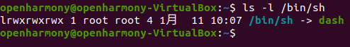
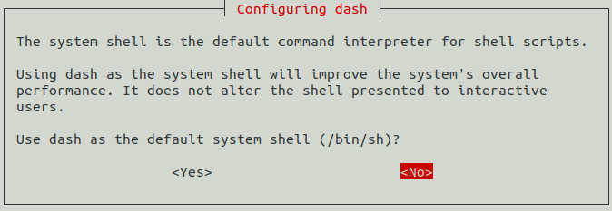
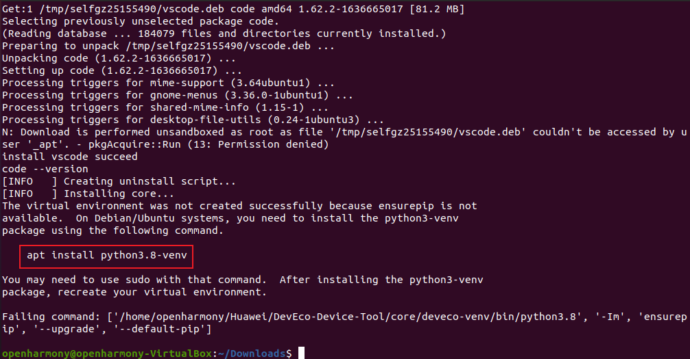
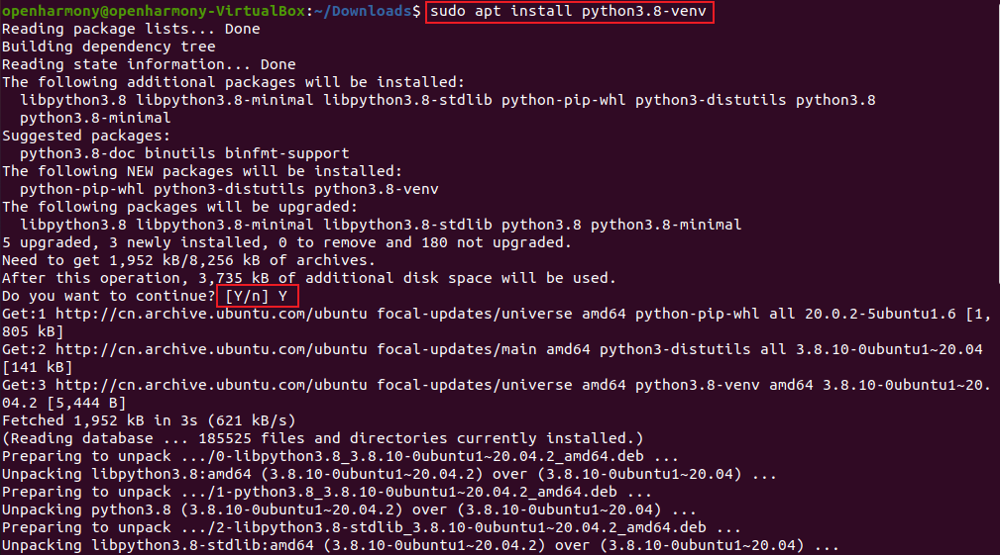
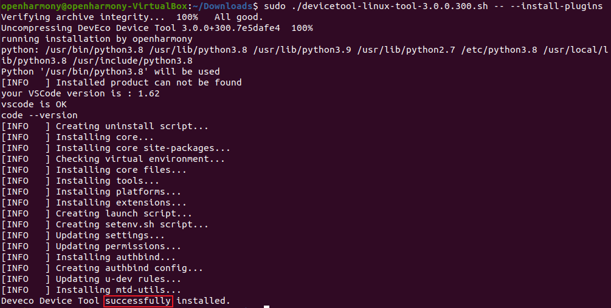
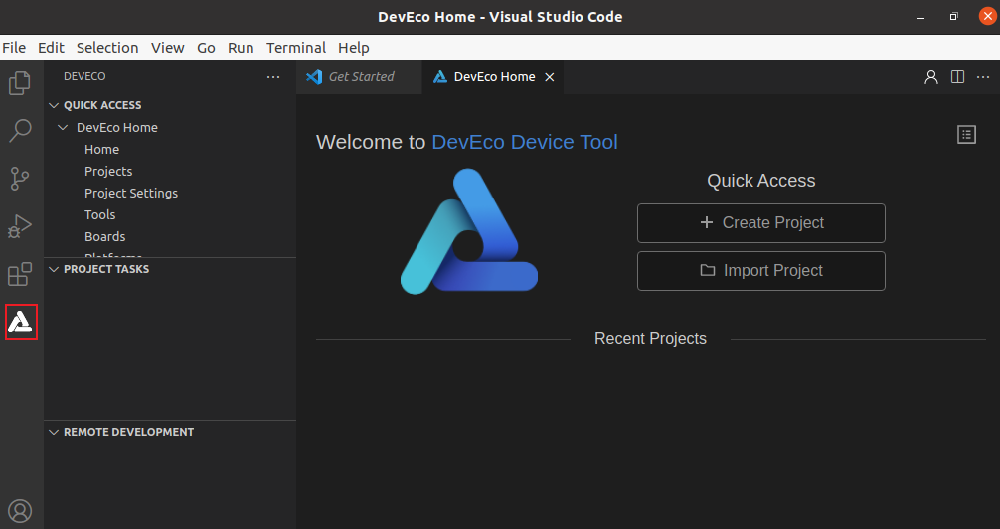

# Linux 下安装 DevEco Device Tool

-   [介绍](介绍.md)
-   [环境准备](环境准备.md)
-   [安装 DevEco Device Tool](安装-DevEco-Device-Tool.md)


# 介绍<a name="ZH-CN_TOPIC_0000001248988041"></a>

HUAWEI DevEco Device Tool（以下简称DevEco Device Tool）是面向智能设备开发者提供的一站式集成开发环境，支持代码编辑、编译、烧录和调试等功能，支持C/C++语言，以插件的形式部署在Visual Studio Code上。

# 环境准备<a name="ZH-CN_TOPIC_0000001204428052"></a>

1.准备[ubuntu-20.04.3-desktop-amd64.iso](https://ubuntu.com/download/desktop)镜像。

2.准备Virtualbox 6.1.16 ，打开下载[地址](https://download.virtualbox.org/virtualbox/6.1.16/)选择  VirtualBox-6.1.16-140961-Win.exe进行下载。

3.Virtualbox 6.1.16 安装 ubuntu-20.04.3-desktop-amd64.iso 镜像可参考以下网址：

[https://blog.csdn.net/xiangbing911/article/details/108614181](https://blog.csdn.net/xiangbing911/article/details/108614181)

> **说明：** 
>-   ubuntu 20.04.3 版本
>-   系统的用户名不能含有中文字符。
>-   只能使用普通用户角色搭建开发环境。

# 安装 DevEco Device Tool<a name="ZH-CN_TOPIC_0000001204108090"></a>

DevEco Device Tool基于Visual Studio Code进行扩展，在Visual Studio Code上以插件方式运行，Visual Studio Code版本为1.60及以上。同时，DevEco Device Tool还依赖Python工具，并要求Python为3.8\~3.9版本。

在安装过程中，DevEco Device Tool会自动检查Visual Studio Code和Python，如果检测到Visual Studio Code、Python未安装或版本不符合要求，安装程序会自动安装Visual Studio Code和Python。

1.  将Ubuntu Shell环境修改为bash。
    1.  执行如下命令，确认输出结果为bash。如果输出结果不是bash，请根据步骤2，将Ubuntu shell修改为bash

        ```
        ls -l /bin/sh
        ```

        

    2.  打开终端工具，执行如下命令，输入密码，然后选择No，将Ubuntu shell由dash修改为bash。

        ```
        sudo dpkg-reconfigure dash
        ```

        

2.  下载[DevEco Device Tool 3.0 Beta2](https://device.harmonyos.com/cn/ide#download_beta)Linux版本，下载时，请先使用华为开发者帐号进行登录后下载。如未注册华为开发者账号，请先[注册](https://developer.huawei.com/consumer/cn/doc/start/registration-and-verification-0000001053628148)。
3.  解压DevEco Device Tool软件包并对解压后的文件夹进行赋权。
    1.  进入DevEco Device Tool软件包目录，执行如下命令解压软件包，其中devicetool-linux-tool-3.0.0.200.zip为软件包名称，请根据实际进行修改。

        ```
        unzip devicetool-linux-tool-3.0.0.300.zip
        ```

    2.  进入解压后的文件夹，执行如下命令，赋予安装文件可执行权限，其中devicetool-linux-tool-3.0.0.300.sh请根据实际进行修改。

        ```
        chmod u+x devicetool-linux-tool-3.0.0.300.sh
        ```

4.  执行如下命令，安装DevEco Device Tool，其中devicetool-linux-tool-3.0.0.300.sh请根据实际进行修改。

    > **说明：** 
    >安装过程中，会自动检查Visual Studio Code和Python是否安装，且版本符合要求，其中Visual Studio Code为1.60及以上版本，Python为3.8\~3.9版本。如果不满足，则安装过程中会自动安装，提示“Do you want to continue?”，请输入“Y”后继续安装。

    ```
    sudo ./devicetool-linux-tool-3.0.0.300.sh -- --install-plugins
    ```

    

    按照提示输入命令：

    ```
    sudo apt install python3.8-venv
    ```

    按照提示请输入“Y”后继续安装：

    安装python3.8-venv完成后重新执行命令

    ```
    sudo ./devicetool-linux-tool-3.0.0.300.sh -- --install-plugins
    ```

    安装完成后，当界面输出“Deveco Device Tool successfully installed.”时，表示DevEco Device Tool安装成功。

    

5.  安装完成后，在Ubuntu左下角的中，启动Visual Studio Code，出现以下界面，至此DevEco Device Tool Ubuntu开发环境安装完成。

    


