# Windows搭建DevEco Device Tool及标准系统烧录

-   [介绍](介绍.md)
-   [系统要求](系统要求.md)
-   [安装DevEco Device Tool](安装DevEco-Device-Tool.md)
-   [获取烧录文件](获取烧录文件.md)
-   [创建工程](创建工程.md)
-   [配置烧录选项](配置烧录选项.md)
-   [配置串口及网口协议](配置串口及网口协议.md)
-   [设置网口烧录的IP地址信息](设置网口烧录的IP地址信息.md)
-   [开始烧录](开始烧录.md)
-   [镜像运行（可选）](镜像运行（可选）.md)

# 介绍<a name="ZH-CN_TOPIC_0000001190944062"></a>

本片文章是基于3.0.0.300版本的DevEco Device Tool来进行烧录的,开发者通过本片文章可快速掌握OpenHarmony标准系统的环境搭建及网口烧录知识。

# 系统要求<a name="ZH-CN_TOPIC_0000001190944954"></a>

-   Windows 10 64位系统。
-   系统的用户名不能含有中文字符。

# 安装DevEco Device Tool<a name="ZH-CN_TOPIC_0000001192257516"></a>

安装最新版本的DevEco Device Tool工具可参考[搭建Windows开发环境](https://device.harmonyos.com/cn/docs/documentation/guide/ide-install-windows-0000001050164976)

# 获取烧录文件<a name="ZH-CN_TOPIC_0000001236704967"></a>

方式一：文件获取地址：[http://ci.openharmony.cn/dailybuilds](http://ci.openharmony.cn/dailybuilds)

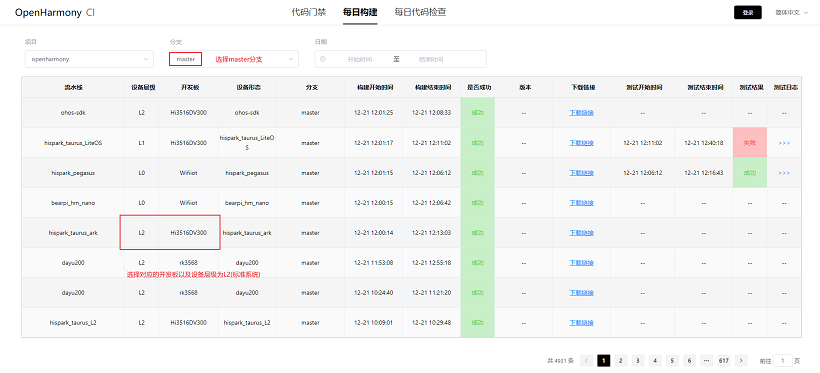

方式二：获取[标准系统解决方案（二进制）文件](https://repo.huaweicloud.com/harmonyos/os/3.0/standard.tar.gz)

# 创建工程<a name="ZH-CN_TOPIC_0000001189625020"></a>

1.打开DevEco Device Tool，进入Home页，点击Create Project创建工程，如图所示：

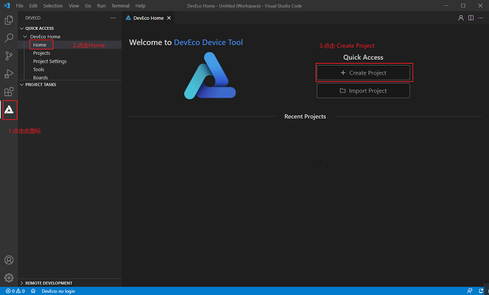

2.填写工程名称，设置开发板类型，如图所示


3.按照图示配置相关选项并完成项目的创建，如图所示：

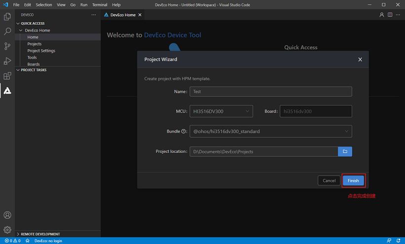

# 配置烧录选项<a name="ZH-CN_TOPIC_0000001237024933"></a>

1.创建工程后点击Settings设置烧录选项，如图所示：

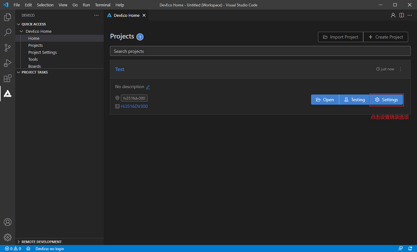

2.点击 hi3516dv300\_fastboot标签页配置待烧录的文件，在New Option选项中选择需要修改的项，例如partition\_bin（烧录文件路径）如图所示：

> **说明：** 
>upload\_partitions：选择待烧录的文件，默认情况下会同时烧录fastboot、kernel、rootfs和userfs。

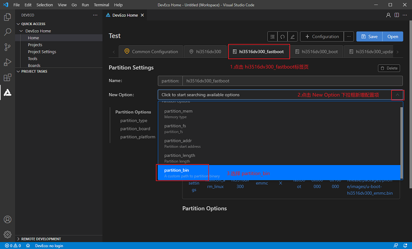

3.配置待烧录的文件可以参考对应的模板配置，如图所示：

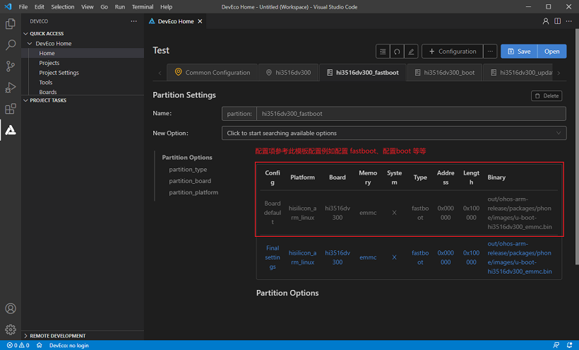

4.配置partition\_bin属性值，如图所示：

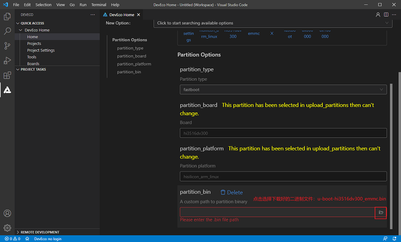

5.选择对应的烧录文件，如图所示：

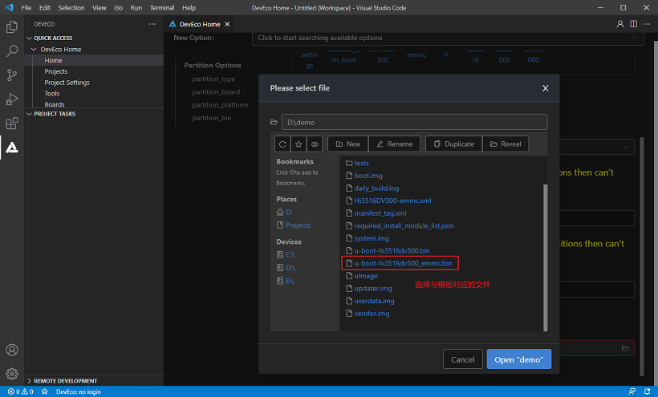

6.选择烧录文件成功后，确认是否与模板文件一致。

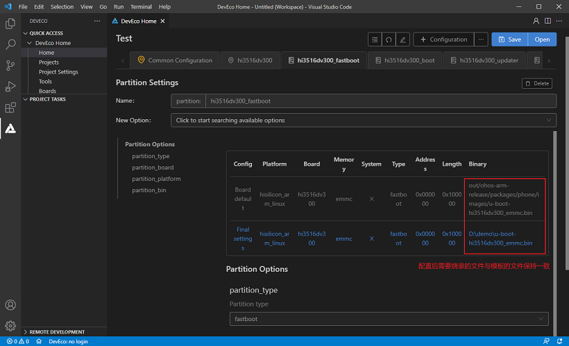

7.设置完后保存配置，点击Save保存配置项，如图所示：

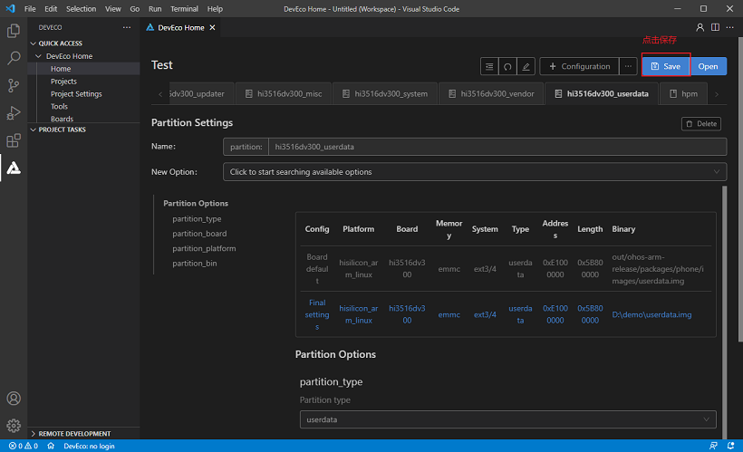

8.配置boot、updater、userdata 等待烧录的文件参考fastboot 配置即可。

> **说明：** 
>DevEco Device Tool已预置默认的烧录文件信息fastboot、boot、updater、misc、system、vendor和userdata，可根据实际情况进行调整。

# 配置串口及网口协议<a name="ZH-CN_TOPIC_0000001236733101"></a>

1.打开“hi3516dv300”标签页，配置串口信息及网口协议，upload\_port：选择已查询的串口号。upload\_protocol：选择烧录协议，固定选择“hiburn-net”。如图所示：

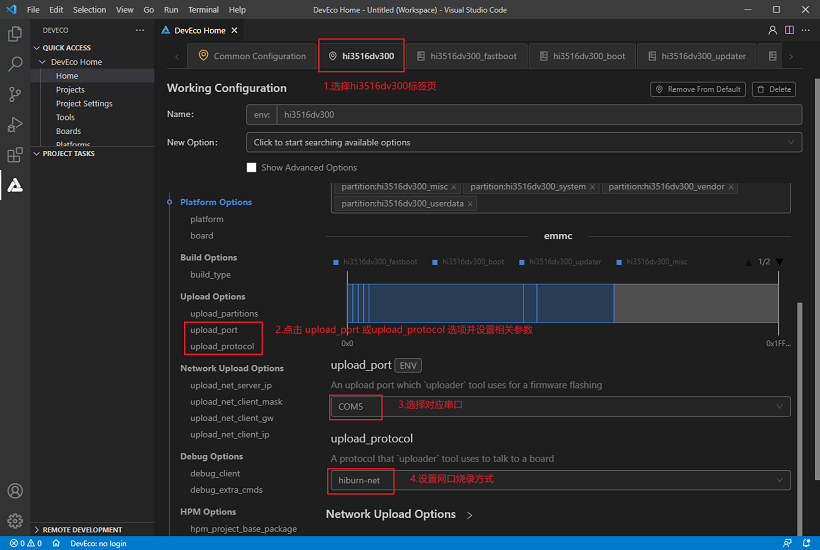

2.设置完后保存配置。

# 设置网口烧录的IP地址信息<a name="ZH-CN_TOPIC_0000001237173071"></a>

1.打开控制面板 \> 网络和Internet \> 网络连接，找到连接开发板后出现的网卡。

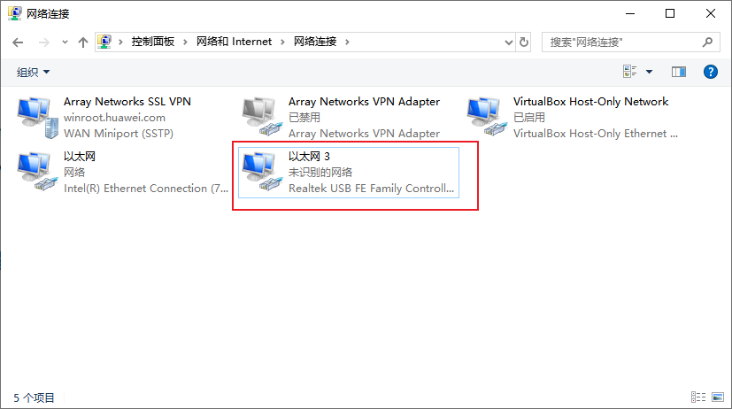

2.点击右键 \> 属性 \> 网络 \> Internet协议版本4（TCP/IPv4），打开IP地址设置页面。

3.勾选“使用下面的IP地址“，然后手动输入IP地址、子网验码和默认网关，如图所示：

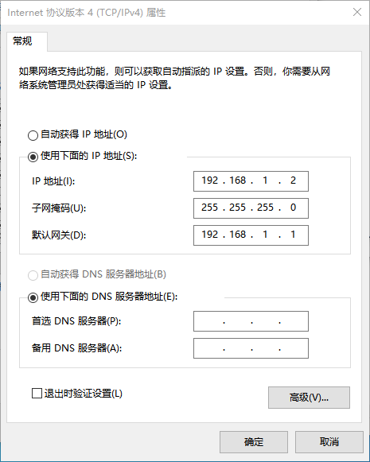

4.在“hi3516dv300”标签页中设置网口烧录的IP地址信息，设置如下选项：

upload\_net\_server\_ip：选择设置的IP地址信息。例如192.168.1.2

upload\_net\_client\_mask：设置开发板的子网掩码，工具会自动根据选择的upload\_net\_server\_ip进行设置。例如255.255.255.0

upload\_net\_client\_gw：设置开发板的网关，工具会自动根据选择的upload\_net\_server\_ip进行设置。例如192.168.1.1

upload\_net\_client\_ip：设置开发板的IP地址，工具会自动根据选择的upload\_net\_server\_ip进行设置。例如192.168.1.3

如图所示：

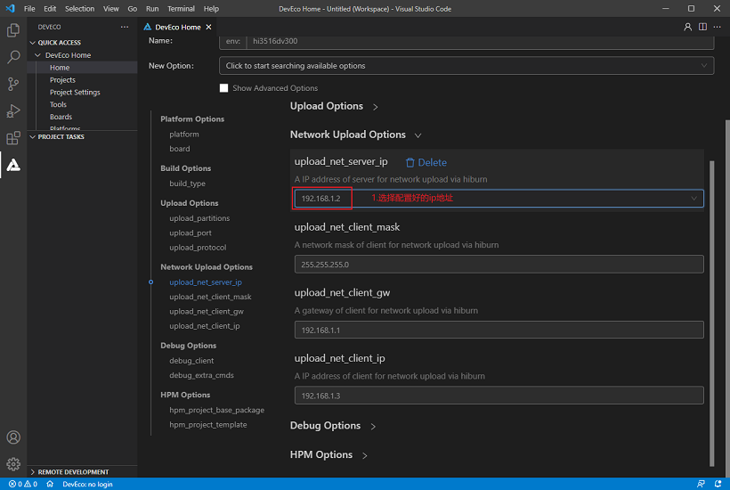

5.设置完后保存配置。

# 开始烧录<a name="ZH-CN_TOPIC_0000001189864982"></a>

1.点击图标，然后在“PROJECT TASKS”中，点击hi3516dv300\_fastboot下的Upload按钮，开始烧录，如图所示：

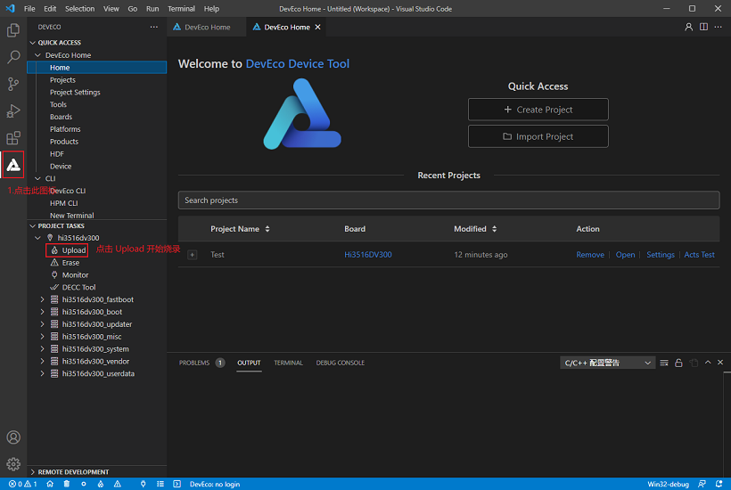2.启动烧录后，显示如下提示信息时，请重启开发板（下电再上电）。

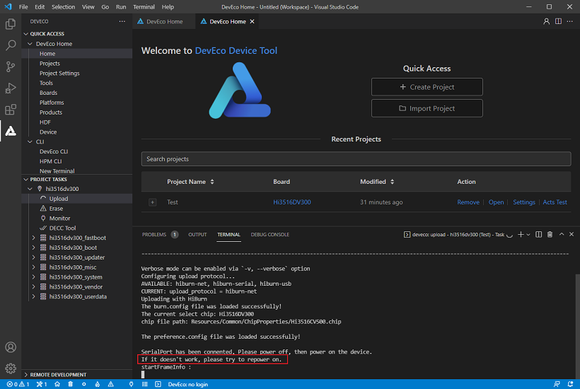

3.重新上电后，界面提示如下信息时，表示烧录成功。

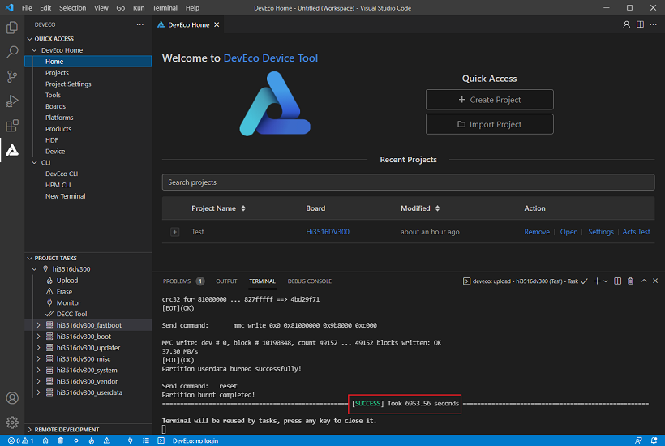

# 镜像运行（可选）<a name="ZH-CN_TOPIC_0000001236908949"></a>

1.烧录完成后若屏幕没有点亮，在DevEco Device Tool中，点击Monitor，打开串口工具。

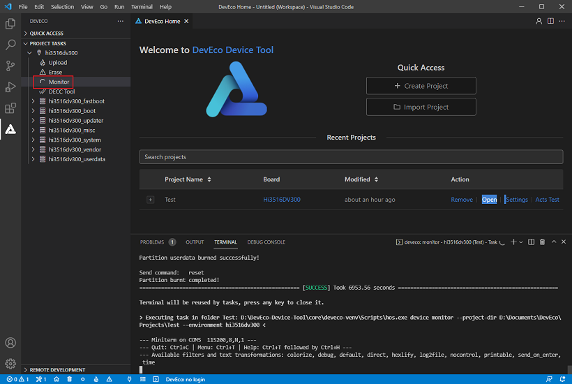

2.重启开发板，在倒计时结束前，按回车键进入系统。

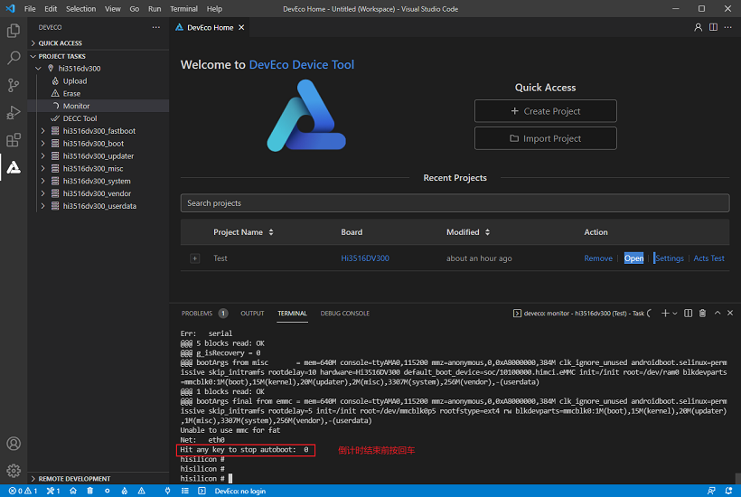

3.通过以下两条命令设置启动参数。

（1）按照方式一获取烧录文件（Master 版本）执行以下命令：

```
setenv bootargs 'mem=640M console=ttyAMA0,115200 mmz=anonymous,0,0xA8000000,384M clk_ignore_unused androidboot.selinux=permissive rootdelay=10 hardware=Hi3516DV300 init=/init root=/dev/ram0 rw blkdevparts=mmcblk0:1M(boot),15M(kernel),20M(updater),2M(misc),3307M(system),256M(vendor),-(userdata)';
```

```
setenv bootcmd 'mmc read 0x0 0x82000000 0x800 0x4800; bootm 0x82000000';
```

（2）按照方式二获取烧录文件（LTS 版本）执行以下命令：

```
setenv bootargs 'mem=640M console=ttyAMA0,115200 mmz=anonymous,0,0xA8000000,384M clk_ignore_unused androidboot.selinux=permissive skip_initramfs rootdelay=5 init=/init root=/dev/mmcblk0p5 rootfstype=ext4 rw blkdevparts=mmcblk0:1M(boot),15M(kernel),20M(updater),1M(misc),3307M(system),256M(vendor),-(userdata)';
```

```
setenv bootcmd "mmc read 0x0 0x80000000 0x800 0x4800; bootm 0x80000000";
```

4.保存参数设置。

```
save
```

5.重启开发板，完成系统启动。

```
reset
```

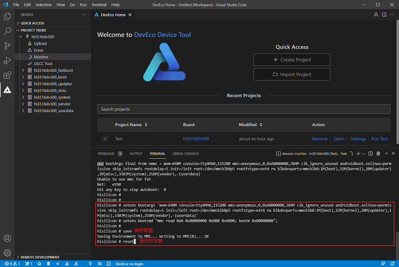

