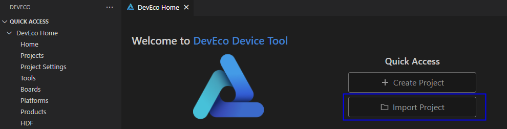
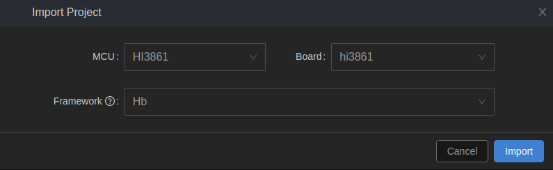
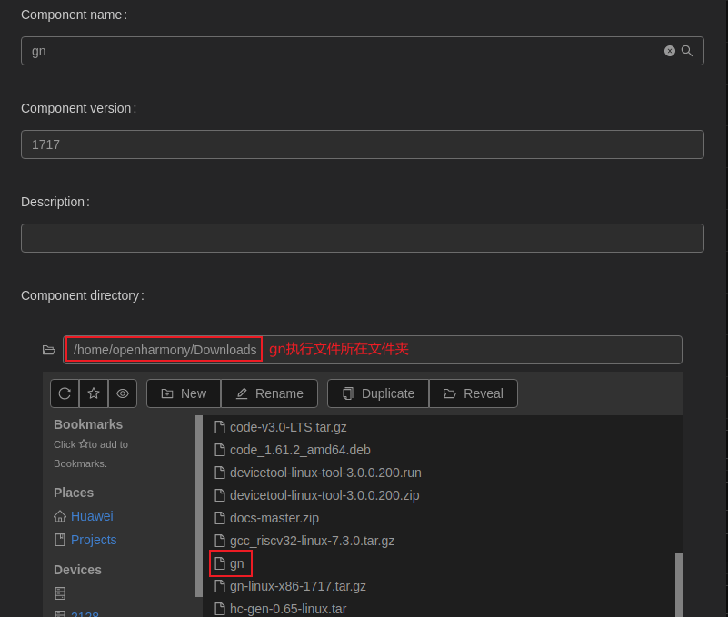
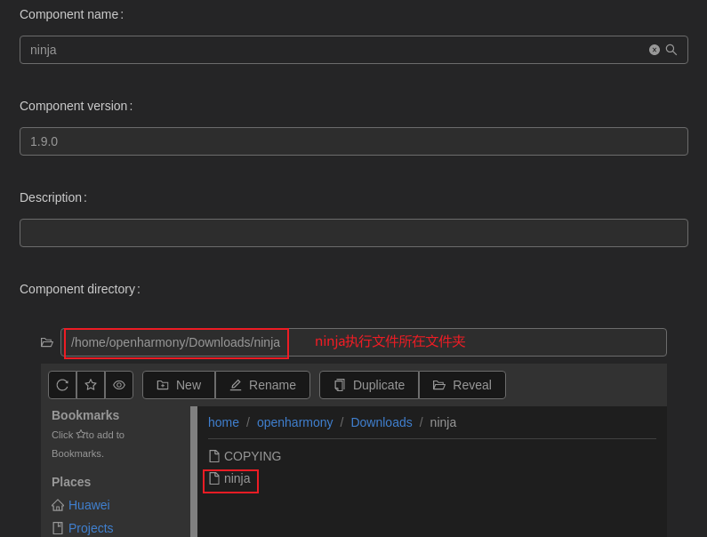
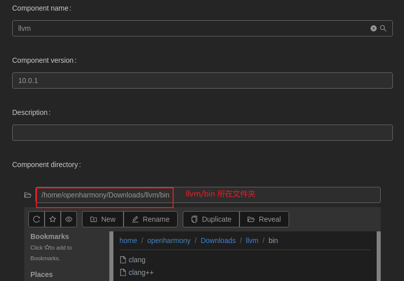
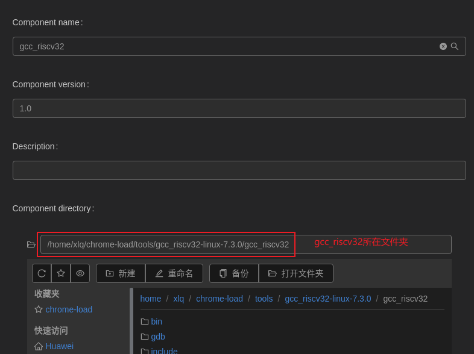
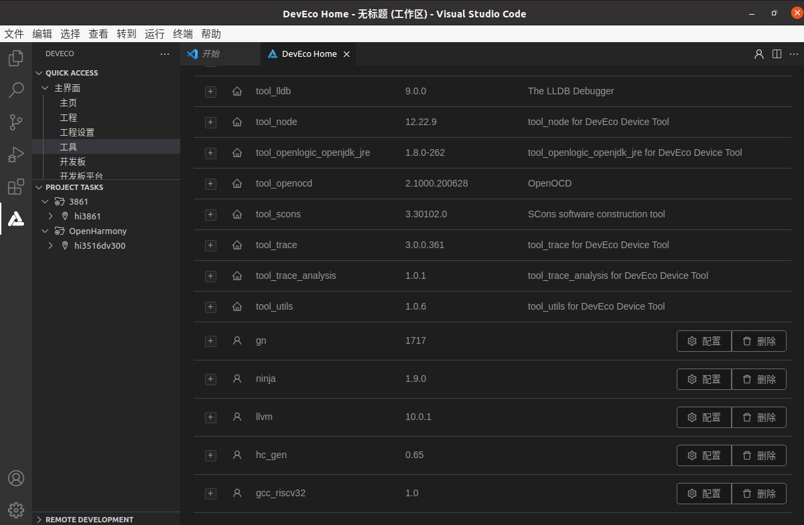
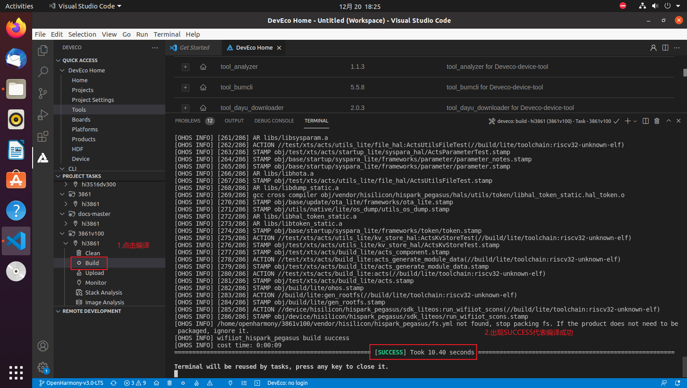
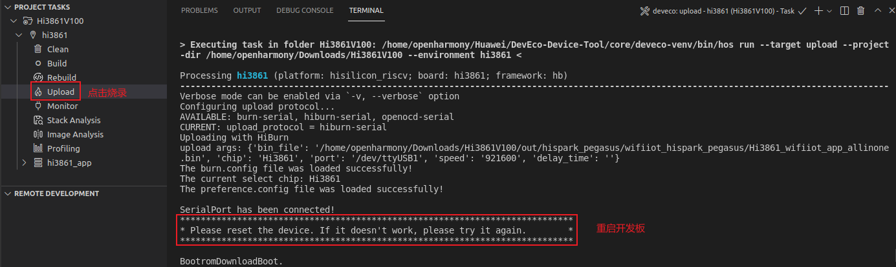
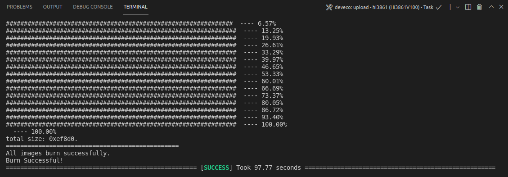

# 轻量和小型系统开发指导


# 介绍<a name="ZH-CN_TOPIC_0000001188078484"></a>

DevEco Device Tool支持Hi3861V100开发板的源码一键编译功能，支持Windows和Ubuntu系统。

本片文章是基于3.0.0.300版本的DevEco Device Tool来进行编写的，主要介绍的是在Ubuntu系统环境下对小型系统的源码进行编译及烧写。
下文将以Hi3861V100开发板为例进行介绍，开发板的具体外观和规格可参见附录，开发者可根据需要自行购买。

# 开发环境准备<a name="ZH-CN_TOPIC_0000001247183319"></a>

以下均为本文开发环境的版本，开发者可以参考本文环境进行配置。

**Linux**

-   Ubuntu-20.04.3

**Windows**

-   Windows 10

**下载并安装DevEco Device Tool（Linux）**

参考[搭建Ubuntu开发环境](https://gitee.com/openharmony/codelabs/blob/master/Device/DeviceEnvironmentSetupGuide/Linux%20%E4%B8%8B%E5%AE%89%E8%A3%85%20DevEco%20Device%20Tool/Linux%20%E4%B8%8B%E5%AE%89%E8%A3%85%20DevEco%20Device%20Tool.md)

**下载并安装DevEco Device Tool（Windows）**

参考[搭建Windows开发环境](https://device.harmonyos.com/cn/docs/documentation/guide/ide-install-windows-0000001050164976)

# 获取源码<a name="ZH-CN_TOPIC_0000001234850965"></a>

1.  注册码云Gitee账号。
2.  注册码云SSH公钥，请参考[码云帮助中心](https://gitee.com/help/articles/4191)。
3.  安装Git并配置用户信息：

```
git config --global user.name "yourname"
git config --global user.email "your-email-address"
git config --global credential.helper store
```

4. 下载repo工具：

```
curl -s https://gitee.com/oschina/repo/raw/fork_flow/repo-py3 > /usr/local/bin/repo  #如果没有权限，可下载至其他目录，并将其配置到环境变量中
chmod a+x /usr/local/bin/repo
pip3 install -i https://repo.huaweicloud.com/repository/pypi/simple requests
```

5.添加python 软连接：

```
sudo ln -s /usr/bin/python3.8 /usr/bin/python
```

6.验证输入python 后能正常显示python 版本。

7.安装git-lfs：

```
sudo apt-get install git-lfs
```

8.获取源码：

```
repo init -u git@gitee.com:openharmony/manifest.git -b OpenHarmony-3.0-LTS --no-repo-verify
repo sync -c
repo forall -c 'git lfs pull'
```

# 导入工程<a name="ZH-CN_TOPIC_0000001235650931"></a>

1.  打开DevEco Device Tool，进入Home页，点击Import Project打开工程，选择待打开的工程目录，点击Import打开。



2.按照图示选择对应的选项。



# 配置工具链<a name="ZH-CN_TOPIC_0000001235890939"></a>

-   [配置gn](#section11258193182315)
-   [配置 ninja](#section15585175417298)
-   [配置 llvm](#section739632815309)
-   [配置 hc-gen](#section4384439203219)
-   [配置gcc\_riscv32](#section86961835173411)

## 配置gn<a name="section11258193182315"></a>

1.点击下载[gn工具包](https://repo.huaweicloud.com/harmonyos/compiler/gn/1717/linux/gn-linux-x86-1717.tar.gz)。

2.解压文件，在Tools中设置的路径设置为gn执行文件所在文件夹。



## 配置 ninja<a name="section15585175417298"></a>

1.点击下载[ninja工具包](https://repo.huaweicloud.com/harmonyos/compiler/ninja/1.9.0/linux/ninja.1.9.0.tar)。

2.解压文件，在Tools中设置的路径设置为ninja执行文件所在文件夹。



## 配置 llvm<a name="section739632815309"></a>

1.点击下载[llvm工具包](https://repo.huaweicloud.com/harmonyos/compiler/clang/10.0.1-62608/linux/llvm.tar.gz)。

2.解压文件，在Tools中设置的路径设置为llvm\\bin文件夹。



## 配置 hc-gen<a name="section4384439203219"></a>

1.点击下载[hc-gen工具包](https://repo.huaweicloud.com/harmonyos/compiler/hc-gen/0.65/linux/hc-gen-0.65-linux.tar)。

2.在Tools中设置的路径设置为hc-gen执行文件所在文件夹。


## 配置gcc\_riscv32<a name="section86961835173411"></a>

1.下载  [gcc\_riscv32](https://repo.huaweicloud.com/harmonyos/compiler/gcc_riscv32/7.3.0/linux/gcc_riscv32-linux-7.3.0.tar.gz)  工具包

2.在Tools中设置的路径设置为gcc\_riscv32所在文件夹。



保存配置



# 安装环境依赖<a name="ZH-CN_TOPIC_0000001248847729"></a>

执行命令：

```
sudo apt-get install mtd-utils
```

# 编译运行<a name="ZH-CN_TOPIC_0000001189491022"></a>

打开DevEco Device Tool界面，在“PROJECT TASKS”中，点击对应开发板下的Build按钮，执行编译。

等待编译完成，在TERMINAL窗口输出“SUCCESS”，编译完成。



# 代码烧录<a name="ZH-CN_TOPIC_0000001242826989"></a>

烧录时连接好USB，点击Upload 开始烧录，显示如下提示信息时，请按开发板上的RST按钮重启开发板。

重启开发板后，界面提示如下信息时，表示烧录成功。



# 附录<a name="ZH-CN_TOPIC_0000001197747136"></a>

**Hi3861开发板简介**

Hi3861开发板是一片大约2cm\*5cm大小的开发板，是一款高度集成的2.4GHz WLAN SoC芯片，集成IEEE 802.11b/g/n基带和RF（Radio Frequency）电路。支持OpenHarmony，并配套提供开放、易用的开发和调试运行环境。


另外，Hi3861开发板还可以通过与Hi3861底板连接，扩充自身的外设能力，底板如下图所示。


-   RF电路包括功率放大器PA（Power Amplifier）、低噪声放大器LNA（Low Noise Amplifier）、RF Balun、天线开关以及电源管理等模块；支持20MHz标准带宽和5MHz/10MHz窄带宽，提供最大72.2Mbit/s物理层速率。
-   Hi3861 WLAN基带支持正交频分复用（OFDM）技术，并向下兼容直接序列扩频（DSSS）和补码键控（CCK）技术，支持IEEE 802.11 b/g/n协议的各种数据速率。
-   Hi3861芯片集成高性能32bit微处理器、硬件安全引擎以及丰富的外设接口，外设接口包括SPI（Synchronous Peripheral Interface）、UART（Universal Asynchronous Receiver & Transmitter）、I2C（The Inter Integrated Circuit）、PWM（Pulse Width Modulation）、GPIO（General Purpose Input/Output）和多路ADC（Analog to Digital Converter），同时支持高速SDIO2.0（Secure Digital Input/Output）接口，最高时钟可达50MHz；芯片内置SRAM（Static Random Access Memory）和Flash，可独立运行，并支持在Flash上运行程序。
-   Hi3861芯片适用于智能家电等物联网智能终端领域。**Hi3861功能框图**

    


**资源和约束**

Hi3861开发板，整板共2MB FLASH，352KB RAM。在编写业务代码时，需注意资源使用效率。

**开发板规格**

<a name="table48382084016"></a>
<table><thead align="left"><tr id="row11838204404"><th class="cellrowborder" valign="top" width="35.79%" id="mcps1.1.3.1.1"><p id="p18327191274020"><a name="p18327191274020"></a><a name="p18327191274020"></a>规格类型</p>
</th>
<th class="cellrowborder" valign="top" width="64.21%" id="mcps1.1.3.1.2"><p id="p7327512154013"><a name="p7327512154013"></a><a name="p7327512154013"></a>规格清单</p>
</th>
</tr>
</thead>
<tbody><tr id="row1783813084010"><td class="cellrowborder" valign="top" width="35.79%" headers="mcps1.1.3.1.1 "><p id="p138391707402"><a name="p138391707402"></a><a name="p138391707402"></a>通用规格</p>
</td>
<td class="cellrowborder" valign="top" width="64.21%" headers="mcps1.1.3.1.2 "><a name="ul191212152589"></a><a name="ul191212152589"></a><ul id="ul191212152589"><li>1×1 2.4GHz频段（ch1～ch14）</li><li>PHY支持IEEE 802.11b/g/n</li><li>MAC支持IEEE802.11 d/e/h/i/k/v/w</li></ul>
<a name="ul6126157581"></a><a name="ul6126157581"></a><ul id="ul6126157581"><li>内置PA和LNA，集成TX/RX Switch、Balun等</li><li>支持STA和AP形态，作为AP时最大支持6 个STA接入</li><li>支持WFA WPA/WPA2 personal、WPS2.0</li><li>支持与BT/BLE芯片共存的2/3/4 线PTA方案</li><li>电源电压输入范围：2.3V～3.6V</li></ul>
<a name="ul91371535811"></a><a name="ul91371535811"></a><ul id="ul91371535811"><li>IO电源电压支持1.8V和3.3V</li></ul>
<a name="ul81341511584"></a><a name="ul81341511584"></a><ul id="ul81341511584"><li>支持RF自校准方案</li><li>低功耗：<a name="ul1013151555816"></a><a name="ul1013151555816"></a><ul id="ul1013151555816"><li>Ultra Deep Sleep模式：5μA@3.3V</li><li>DTIM1：1.5mA@3.3V</li><li>DTIM3：0.8mA@3.3V</li></ul>
</li></ul>
</td>
</tr>
<tr id="row1019774754017"><td class="cellrowborder" valign="top" width="35.79%" headers="mcps1.1.3.1.1 "><p id="p183082113598"><a name="p183082113598"></a><a name="p183082113598"></a>PHY特性</p>
</td>
<td class="cellrowborder" valign="top" width="64.21%" headers="mcps1.1.3.1.2 "><a name="ul123706392596"></a><a name="ul123706392596"></a><ul id="ul123706392596"><li>支持IEEE802.11b/g/n单天线所有的数据速率</li><li>支持最大速率：72.2Mbps@HT20 MCS7</li><li>支持标准20MHz带宽和5M/10M窄带宽</li><li>支持STBC</li><li>支持Short-GI</li></ul>
</td>
</tr>
<tr id="row83891018010"><td class="cellrowborder" valign="top" width="35.79%" headers="mcps1.1.3.1.1 "><p id="p3389911700"><a name="p3389911700"></a><a name="p3389911700"></a>MAC特性</p>
</td>
<td class="cellrowborder" valign="top" width="64.21%" headers="mcps1.1.3.1.2 "><a name="ul177921251606"></a><a name="ul177921251606"></a><ul id="ul177921251606"><li>支持A-MPDU，A-MSDU</li><li>支持Blk-ACK</li><li>支持QoS，满足不同业务服务质量需求</li></ul>
</td>
</tr>
<tr id="row115081927301"><td class="cellrowborder" valign="top" width="35.79%" headers="mcps1.1.3.1.1 "><p id="p135085271207"><a name="p135085271207"></a><a name="p135085271207"></a>CPU子系统</p>
</td>
<td class="cellrowborder" valign="top" width="64.21%" headers="mcps1.1.3.1.2 "><a name="ul1318617110"></a><a name="ul1318617110"></a><ul id="ul1318617110"><li>高性能 32bit微处理器，最大工作频率160MHz</li><li>内嵌SRAM 352KB、ROM 288KB</li><li>内嵌 2MB Flash</li></ul>
</td>
</tr>
<tr id="row0781123113013"><td class="cellrowborder" valign="top" width="35.79%" headers="mcps1.1.3.1.1 "><p id="p278119311807"><a name="p278119311807"></a><a name="p278119311807"></a>外围接口</p>
</td>
<td class="cellrowborder" valign="top" width="64.21%" headers="mcps1.1.3.1.2 "><a name="ul11972172014112"></a><a name="ul11972172014112"></a><ul id="ul11972172014112"><li>1个SDIO接口、2个SPI接口、2个I2C接口、3个UART接口、15个GPIO接口、7路ADC输入、6路PWM、1个I2S接口（注：上述接口通过复用实现）</li><li>外部主晶体频率40M或24M</li></ul>
</td>
</tr>
<tr id="row15976183512015"><td class="cellrowborder" valign="top" width="35.79%" headers="mcps1.1.3.1.1 "><p id="p2976135209"><a name="p2976135209"></a><a name="p2976135209"></a>其他信息</p>
</td>
<td class="cellrowborder" valign="top" width="64.21%" headers="mcps1.1.3.1.2 "><a name="ul464043919115"></a><a name="ul464043919115"></a><ul id="ul464043919115"><li>封装：QFN-32，5mm×5mm</li><li>工作温度：-40℃ ～ +85℃</li></ul>
</td>
</tr>
</tbody>
</table>

