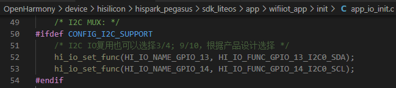
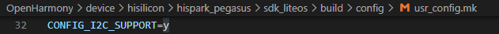

# 任务介绍<a name="ZH-CN_TOPIC_0000001205366964"></a>

ADC是模拟-数字转换器（Analog to Digital Converter）的缩写。可以将连续变化的模拟信号转换为离散的数字信号，进而使用数字电路进行处理，称之为数字信号处理。I2C\(Inter Integrated Circuit\)总线是一种简单、双向二线制同步串行总线。

本篇Codelab将介绍如何使用ADC和I2C API，实现按下Hi3861开发板按键1和按键2，在OLED显示屏上分别显示英文和中文的功能。

效果如下：


# 环境准备<a name="ZH-CN_TOPIC_0000001250206953"></a>

完成本篇Codelab，我们首先需要完成开发环境搭建、源码编译，可参照如下步骤进行。

1.  [搭建开发环境](https://gitee.com/openharmony/docs/blob/master/zh-cn/device-dev/quick-start/quickstart-ide-env-win.md)。
2.  编译源码：建议开发者选择LTS 3.0版本源码进行编译，本篇Codelab是基于此版本开发的。

    [编译Hi3861V100开发板源码](https://gitee.com/openharmony/docs/blob/master/zh-cn/device-dev/quick-start/quickstart-ide-3861-build.md)

**您需要使用如下设备完成本Codelab：**

Hi3861V100开发板主板、底板以及OLED显示屏。

# API介绍<a name="ZH-CN_TOPIC_0000001250046961"></a>

**I2C  API**

<a name="table15553881214"></a>
<table><thead align="left"><tr id="row55738111213"><th class="cellrowborder" valign="top" width="59.46%" id="mcps1.1.3.1.1"><p id="p1661038121219"><a name="p1661038121219"></a><a name="p1661038121219"></a>方法</p>
</th>
<th class="cellrowborder" valign="top" width="40.54%" id="mcps1.1.3.1.2"><p id="p3498151051317"><a name="p3498151051317"></a><a name="p3498151051317"></a>说明</p>
</th>
</tr>
</thead>
<tbody><tr id="row36738171213"><td class="cellrowborder" valign="top" width="59.46%" headers="mcps1.1.3.1.1 "><p id="p5160171113476"><a name="p5160171113476"></a><a name="p5160171113476"></a>IoTI2cInit (unsigned int id, unsigned int baudrate)</p>
</td>
<td class="cellrowborder" valign="top" width="40.54%" headers="mcps1.1.3.1.2 "><p id="p6643851214"><a name="p6643851214"></a><a name="p6643851214"></a>使用指定波特率初始化I2C设备。</p>
</td>
</tr>
<tr id="row96938101213"><td class="cellrowborder" valign="top" width="59.46%" headers="mcps1.1.3.1.1 "><p id="p9835627134716"><a name="p9835627134716"></a><a name="p9835627134716"></a>IoTI2cDeinit (unsigned int id)</p>
</td>
<td class="cellrowborder" valign="top" width="40.54%" headers="mcps1.1.3.1.2 "><p id="p106133810129"><a name="p106133810129"></a><a name="p106133810129"></a>去初始化I2C设备。</p>
</td>
</tr>
<tr id="row16163818122"><td class="cellrowborder" valign="top" width="59.46%" headers="mcps1.1.3.1.1 "><p id="p169663411476"><a name="p169663411476"></a><a name="p169663411476"></a>IoTI2cWrite (unsigned int id, unsigned short deviceAddr, const unsigned char *data, unsigned int dataLen)</p>
</td>
<td class="cellrowborder" valign="top" width="40.54%" headers="mcps1.1.3.1.2 "><p id="p66163891213"><a name="p66163891213"></a><a name="p66163891213"></a>向I2C设备写入数据。</p>
</td>
</tr>
<tr id="row13613382123"><td class="cellrowborder" valign="top" width="59.46%" headers="mcps1.1.3.1.1 "><p id="p18400161254917"><a name="p18400161254917"></a><a name="p18400161254917"></a>IoTI2cRead(unsigned int id, unsigned short deviceAddr, unsigned char *data, unsigned int dataLen)</p>
</td>
<td class="cellrowborder" valign="top" width="40.54%" headers="mcps1.1.3.1.2 "><p id="p1171638131218"><a name="p1171638131218"></a><a name="p1171638131218"></a>从I2C设备读取数据。</p>
</td>
</tr>
<tr id="row2411717174910"><td class="cellrowborder" valign="top" width="59.46%" headers="mcps1.1.3.1.1 "><p id="p3421417114915"><a name="p3421417114915"></a><a name="p3421417114915"></a>IoTI2cSetBaudrate(unsigned int id, unsigned int baudrate)</p>
</td>
<td class="cellrowborder" valign="top" width="40.54%" headers="mcps1.1.3.1.2 "><p id="p164219179496"><a name="p164219179496"></a><a name="p164219179496"></a>设置I2C设备的波特率。</p>
</td>
</tr>
</tbody>
</table>

**ADC  API**

<a name="table570716464392"></a>
<table><thead align="left"><tr id="row16707134683920"><th class="cellrowborder" valign="top" width="59.46%" id="mcps1.1.3.1.1"><p id="p870712466393"><a name="p870712466393"></a><a name="p870712466393"></a>方法</p>
</th>
<th class="cellrowborder" valign="top" width="40.54%" id="mcps1.1.3.1.2"><p id="p1570774683915"><a name="p1570774683915"></a><a name="p1570774683915"></a>说明</p>
</th>
</tr>
</thead>
<tbody><tr id="row27071246133919"><td class="cellrowborder" valign="top" width="59.46%" headers="mcps1.1.3.1.1 "><p id="p14658243144212"><a name="p14658243144212"></a><a name="p14658243144212"></a>AdcRead(WifiIotAdcChannelIndex channel, unsigned short *data, WifiIotAdcEquModelSel equModel, WifiIotAdcCurBais curBais, unsigned short rstCnt)</p>
</td>
<td class="cellrowborder" valign="top" width="40.54%" headers="mcps1.1.3.1.2 "><p id="p711231784416"><a name="p711231784416"></a><a name="p711231784416"></a>根据输入参数从指定的ADC通道读取一段采样数据</p>
</td>
</tr>
</tbody>
</table>

**Hi3861V100开发板说明**

实现IOT外设控制，首先需要通过查阅原理图明确接线关系。OLED显示屏与主控芯片（Pegasus）引脚的对应关系如下：

<a name="table166589311574"></a>
<table><thead align="left"><tr id="row6659153112578"><th class="cellrowborder" valign="top" width="50%" id="mcps1.1.3.1.1"><p id="p106591631135717"><a name="p106591631135717"></a><a name="p106591631135717"></a>按键</p>
</th>
<th class="cellrowborder" valign="top" width="50%" id="mcps1.1.3.1.2"><p id="p96591731145715"><a name="p96591731145715"></a><a name="p96591731145715"></a>控制管脚</p>
</th>
</tr>
</thead>
<tbody><tr id="row1659231135713"><td class="cellrowborder" valign="top" width="50%" headers="mcps1.1.3.1.1 "><p id="p17659153115574"><a name="p17659153115574"></a><a name="p17659153115574"></a>S1</p>
</td>
<td class="cellrowborder" valign="top" width="50%" headers="mcps1.1.3.1.2 "><p id="p36601231175712"><a name="p36601231175712"></a><a name="p36601231175712"></a>GPIO13</p>
</td>
</tr>
<tr id="row106605316574"><td class="cellrowborder" valign="top" width="50%" headers="mcps1.1.3.1.1 "><p id="p1660153125714"><a name="p1660153125714"></a><a name="p1660153125714"></a>S2</p>
</td>
<td class="cellrowborder" valign="top" width="50%" headers="mcps1.1.3.1.2 "><p id="p5660193119575"><a name="p5660193119575"></a><a name="p5660193119575"></a>GPIO14</p>
</td>
</tr>
</tbody>
</table>

> **说明：**
>开发板原理图，请开发者联系Hi3861购买渠道客服获取。

# 编译烧写&运行<a name="ZH-CN_TOPIC_0000001205047018"></a>

1.  **确定目录结构**。

    开发者编写业务时，务必先在OpenHarmony/applications/sample/wifi-iot/app路径下新建一个目录，用于存放业务源码文件。例如：在app目录下新增目录screen，其中oled\_demo.c为业务代码，BUILD.gn为编译脚本，具体规划目录结构如下：

    ```
    .
    └── applications
        └── sample
            └── wifi-iot
                └── app
                    │── screen
                    │  │── oled_demo.c
                    │  │── oled_ssd1306_conf.h
                    │  │── oled_ssd1306_fonts.c
                    │  │── oled_ssd1306_fonts.h
                    │  │── oled_ssd1306.c
                    │  │── oled_ssd1306.h
                    │  └── BUILD.gn
                    └── BUILD.gn
    ```

2.  **设置I2C引脚复用**。

    确定I2C引脚，查看原理图，可以看到OLED屏幕使用到的是I2C0，引脚是GPIO13、GPIO14。我们需要修改源码，在OpenHarmony/device/hisilicon/hispark\_pegasus/sdk\_liteos/app/wifiiot\_app/init/app\_io\_init.c文件中，初始化I2C引脚的代码修改成如下：

    

3.  **开启I2C功能**。

    在OpenHarmony/device/hisilicon/hispark\_pegasus/sdk\_liteos/build/config/usr\_config.mk 文件中，增加 CONFIG\_I2C\_SUPPORT=y。

    

4.  **编写业务代码**。

    在OpenHarmony/applications/sample/wifi-iot/app/screen目录下新建oled\_demo.c文件，在oled\_demo.c中新建业务入口函数OledDemo，并实现业务逻辑。在代码最下方，使用OpenHarmony启动恢复模块接口SYS\_RUN\(\)启动业务。（SYS\_RUN定义在ohos\_init.h文件中）

    ```
    #include <stdio.h>
    #include <unistd.h>
    #include "ohos_init.h"
    #include "cmsis_os2.h"
    #include "hi_io.h"
    #include "hi_adc.h"
    #include "oled_ssd1306.h"
    
    #define OLED_I2C_BAUDRATE 400*1000
    
    hi_void convert_to_voltage(hi_u32 data_len)
    {
        ...
        // 按键1被按下
        if((vlt_val > 0.4) && (vlt_val < 0.6))
        {
            if(key_flg == 0)
            {
                key_flg = 1;
                key_status = KEY_EVENT_S1;
            }
        }
        // 按键2被按下
        if((vlt_val > 0.8) && (vlt_val < 1.1))
        {
            if(key_flg == 0)
            {
                key_flg = 1;
                key_status = KEY_EVENT_S2;
            }
        }
        // 没有按键被按下
        if(vlt_val > 3.0)
        {
            key_flg = 0;
            key_status = KEY_EVENT_NONE;
        }
    }
    // 检测电压
    void read_adc(void)
    {
        ...
        for (i = 0; i < ADC_TEST_LENGTH; i++) {
            ret = hi_adc_read((hi_adc_channel_index)HI_ADC_CHANNEL_2, &data, HI_ADC_EQU_MODEL_1, HI_ADC_CUR_BAIS_DEFAULT, 0);
            if (ret != HI_ERR_SUCCESS) {
                printf("ADC Read Fail\n");
                return;
            }
            g_adc_buf[i] = data;
        }
         convert_to_voltage(ADC_TEST_LENGTH);
    }
    
    static void OledTask(void *arg)
    {
        (void)arg;
        // 初始化
        IoTI2cInit(0, OLED_I2C_BAUDRATE); // Rate: 100kbps
        ...
        while(1)
        {
            // 读取ADC值
            read_adc();
           
            switch(get_key_event())
            {
                // 没有按键按下,清屏
                case KEY_EVENT_NONE:
                {
                    // Clear screen
                    ssd1306_Fill(Black);
                    ssd1306_UpdateScreen();
                }
                break;
                // 按键1被按下,显示英文字母
                case KEY_EVENT_S1:
                {
                    // Clear screen
                    ssd1306_Fill(Black);
                    ssd1306_SetCursor(0,0);
                    ssd1306_DrawString("**OpenHarmony!**", Font_7x10, White);
                    ssd1306_UpdateScreen();
                    // 显示10s
                    usleep(10 * 1000 * 1000);
                }
                break;
                // 按键2被按下,显示中文
                case KEY_EVENT_S2:
                {
                    OledDrawChinese();
                    // 显示10s
                    usleep(10 * 1000 * 1000);
                }
                break;
            }
            // 轮询时间控制
            usleep(100);
        }
    }
    
    static void OledDemo(void)
    {
        osThreadAttr_t attr;
        // 初始化13、14号管脚
        IoTGpioInit(HI_IO_NAME_GPIO_13);
        IoTGpioInit(HI_IO_NAME_GPIO_14);
        // 将引脚功能设置为I2C引脚
        hi_io_set_func(HI_IO_NAME_GPIO_13, HI_IO_FUNC_GPIO_13_I2C0_SDA);
        hi_io_set_func(HI_IO_NAME_GPIO_14, HI_IO_FUNC_GPIO_14_I2C0_SCL);
        attr.attr_bits = 0U;
        attr.cb_mem = NULL;
        attr.cb_size = 0U;
        attr.stack_mem = NULL;
        attr.stack_size = 4096;
        attr.priority = osPriorityNormal;
    
        if (osThreadNew(OledTask, NULL, &attr) == NULL) {
            printf("[OledDemo] Falied to create OledTask!\n");
        }
    }
    SYS_RUN(OledDemo);
    ```

5.  **编写用于将业务构建成静态库的BUILD.gn文件**。

    在./applications/sample/wifi-iot/app/screen目录下新建BUILD.gn文件，并完成如下配置。

    ```
    static_library("oled_example") {
        sources = [
        "oled_demo.c",
        "oled_ssd1306.c",
        "oled_ssd1306_fonts.c"
        ]
        include_dirs = [
        "//utils/native/lite/include",
        "//kernel/liteos_m/components/cmsis",
        "//base/iot_hardware/peripheral/interfaces/kits",
        "//device/hisilicon/hispark_pegasus/sdk_liteos/include"
        ]
    }
    ```

    -   static\_library中指定业务模块的编译结果，开发者根据实际情况完成填写。
    -   sources中指定静态库.a所依赖的.c文件及其路径，若路径中包含"//"则表示绝对路径（此处为代码根路径），若不包含"//"则表示相对路径。
    -   include\_dirs中指定source所需要依赖的.h文件路径。

6.  **编写模块BUILD.gn文件，指定需参与构建的特性模块**。

    配置./applications/sample/wifi-iot/app/BUILD.gn文件，在features字段中增加索引，使目标模块参与编译。features字段指定业务模块的路径和目标，features字段配置如下。

    ```
    import("//build/lite/config/component/lite_component.gni")
    
    lite_component("app") {
        features = [
            "screen:oled_example",
        ]
    }
    ```

7.  **代码编译和烧录**。

代码编译和烧录可以参考：

[源码编译](https://gitee.com/openharmony/docs/blob/master/zh-cn/device-dev/quick-start/quickstart-lite-steps-hi3861-building.md)

[烧录](https://gitee.com/openharmony/docs/blob/master/zh-cn/device-dev/quick-start/quickstart-lite-steps-hi3861-burn.md)

完成烧录后，按下按键1，OLED显示屏上显示英文“\*\*OpenHarmony!\*\*”，按下按键

2，OLED显示屏上显示中文“你好世界”。

# 恭喜您<a name="ZH-CN_TOPIC_0000001250326991"></a>

目前您已经成功完成了本篇Codelab，并且学到了：

-   如何使用ADC检测电压值，判断Hi3861开发板上哪个按键被按下。
-   如何使用I2C控制OLED显示屏显示中英文。

