# 简介<a name="ZH-CN_TOPIC_0000001197688086"></a>

碰一碰特性是HarmonyOS具备的多终端业务协同技术。通过碰一碰的交互方式，可以将手机和全场景设备连接起来。再通过手机端的原子化服务能力，快速完成配网、远程控制。解决了应用与设备之间接续慢、配网复杂、传输难的问题，为用户带来无缝切换的流畅体验。

本篇Codelab将指导大家如何开发一个模拟的“远程台灯”案例。在本案例中，通过手机碰一碰NFC标签，可以从HAG获取到关联意图信息。通过获取到的关联意图信息，可以拉起对应的原子化服务。该原子化服务通过调用hilink接口，并结合设备侧代码实现，可以完成开发板与手机间的配网并建立通信通道。完成此步骤后，即可通过手机控制Hi3861开发版中LED灯的开关了。

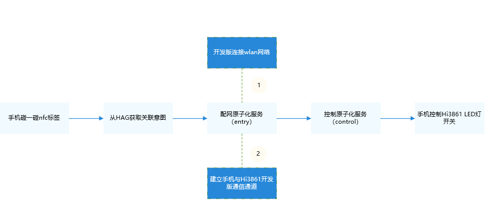

通过该案例，大家将会学会：

1. 通过碰一碰能力，拉起手机端原子化服务。

2. 快速完成手机与设备的配网。

3. 通过手机对设备进行控制。

   > **说明：** 
   >本指导仅用于个人开发者体验HarmonyOS碰一碰特性，不能作为商用方案进行碰一碰特性的开发和上架。


# 实物简介<a name="ZH-CN_TOPIC_0000001197727662"></a>

-   [手机](#section1089827124516)
-   [Hi3861开发板](#section284523516592)

## 手机<a name="section1089827124516"></a>

华为手机，系统版本为HarmonyOS 2.0.0.168及以上，手机具体型号为Mate 40 Pro。将手机上智慧生活基础服务升级至12.0.0.306及以上版本。具体操作步骤如下：

-   查看“智慧生活基础服务”版本，打开手机“**设置\>应用服务\>应用管理**”，搜索“智慧生活基础服务”。
-   升级“智慧生活基础服务”，打开手机“智慧生活”App，点击“**我的 \> 设置 \> 检查应用更新**”，更新“智慧生活基础服务”。

## Hi3861开发板<a name="section284523516592"></a>

本样例基于Hi3861开发板开发，请准备Hi3861开发板（HiSpark Wi-Fi IoT智能家居套件）。包含开发板主板、底板和OLED板。

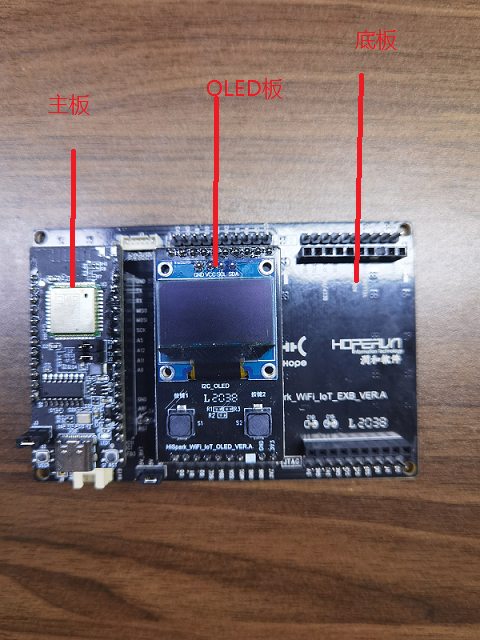


# HarmonyOS原子化服务开发<a name="ZH-CN_TOPIC_0000001242728645"></a>

-   [创建工程](#section12221379216)
-   [设备配网原子化服务（entry）](#section68895599506)
-   [设备控制原子化服务（control）](#section563615917554)

本案例将要实现“**碰一碰-拉起原子化服务-设备配网-设备控制**”的完整流程，整个流程都要基于手机端的原子化服务实现。开发原子化服务使用的工具为[DevEco Studio 3.0 Beta2](https://developer.harmonyos.com/cn/develop/deveco-studio#download_beta)，关于工具配置请查看官方指导文档[搭建开发环境流程](https://developer.harmonyos.com/cn/docs/documentation/doc-guides/installation_process-0000001071425528)。

## 创建工程<a name="section12221379216"></a>

打开创建工程向导界面，选择“Empty Ability”模板创建原子化服务，用于设备配网。

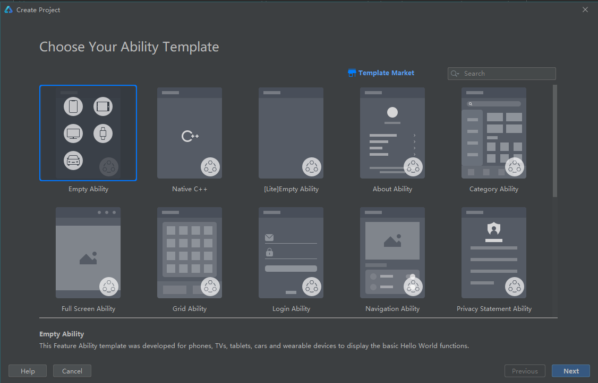

在工程配置中，Project type选择“Atomic Service”，并打开“Show in Service Center”选项，点击Finish按钮即可完成创建设备配网原子化服务。

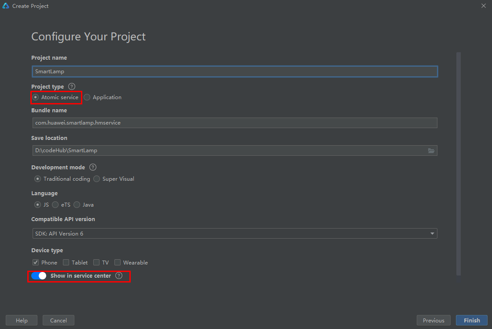

在已创建好的“entry”目录上右击，选择“Empty Ability”模板新建一个Module，用于设备控制。

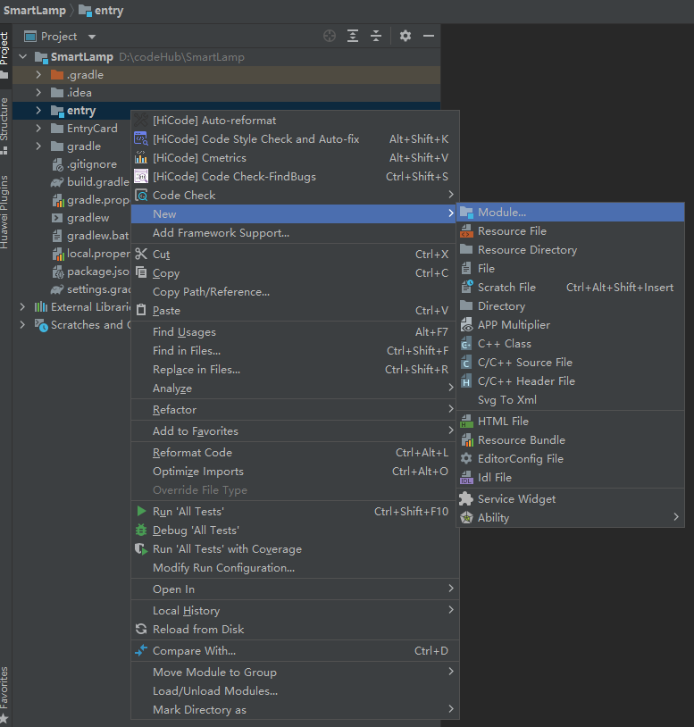

在模块配置界面，“Module type”中选择的“Feature”，点击“Next”。

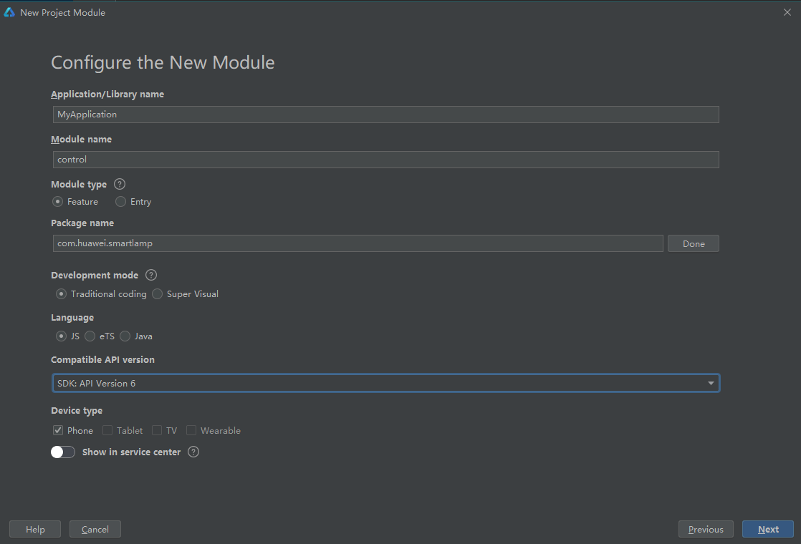

配置Module的“Page ability name”，点击“Finish”完成创建。

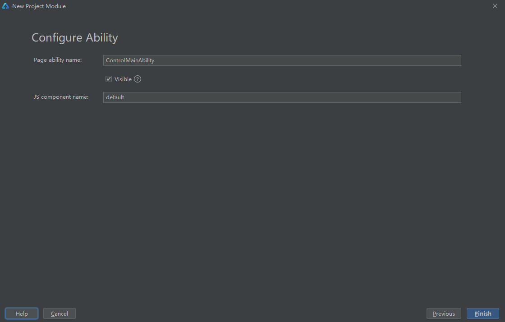

## 设备配网原子化服务（entry）<a name="section68895599506"></a>

配网过程需要依赖hilink的接口，因此首先需要在entry\\build.gradle中加入对hilink的依赖。

```
dependencies {
    ...
    ohosTestImplementation 'com.huawei.ohos.testkit:runner:2.0.0.200'
}
```

手机碰一碰nfc标签，将会拉起用于配网的原子化服务（entry模块）。在服务的入口MainAbility中，完成了对nfc中的产品信息的读取，以及将“abilityContext”和从意图中获取的“nanSessionId”注册到用于配网的NetConfigAbility中。

```
// 读取产品信息
Object productInfo = Objects.requireNonNull(intent.getParams()).getParam("productInfo");
if (productInfo != null) {
    productId = (String) productInfo;
}

// 从intent中读取的nanSessionId用于配网，同时需要将abilityContext和sessionId注册到NetConfigAbility中
String sessionId = intent.getStringParam("nanSessionId");
if ("null".equals(sessionId) || "".equals(sessionId)) {
    NetConfigAbility.register(this, null);
} else {
    NetConfigAbility.register(this, sessionId);
}
```

entry模块的主界面在初始化时，会将产品信息和“nanSessionId”在应用中保存传递。

```
onInit() {
    this.deviceName = this.$t('strings.device-name');
    this.deviceImg = '/common/images/LED.png';
    getApp(this).Product.productName = this.productName;
    getApp(this).Product.productId = this.productId;
    getApp(this).ConfigParams.sessionId = this.sessionId;
}
```

点击主界面的“配网”按钮，会默认进行配网操作。主要分为5个步骤，均依赖hilink接口实现，具体代码可查看netconfig.js。

1. 通过NAN广播服务搜索设备。

   ```
   getApp(this).NetConfig.discoveryByNAN(scanInfo, (result) => {
       if (result.code == 0) {
          // 成功发现设备
       } else {
          ...
       }
   });
   ```

2. 连接设备。

   ```
   getApp(this).NetConfig.connectDevice(connectInfo, (result) => {
       if (result.code === 0) {
           // 设备连接成功
       } else {
           ...
       }
   });
   ```

3. 获取wifi信息。

   ```
   getApp(this).NetConfig.getWifiList((result) => {
       if (result.code == 0 && result.data && result.data.length > 0) {
           // 获取wifi信息成功
       } else {
           ...
       }
   });
   ```

4. 对设备进行网络配置。

   ```
   getApp(this).NetConfig.configDeviceNet('deviceInfo', 'accountInfo', netConfigInfo, (result) => {
       if (result.code == 0) {
           // 设备网络配置成功
       } else {
           ...
       }
   });
   ```

5. 配网成功，跳转至设备控制模块。

   ```
   goToControl() {
       let target = {
           bundleName: 'com.huawei.smartlamp.hmservice',
           abilityName: 'com.huawei.smartlamp.ControlMainAbility',
           deviceType: 1,// 从本地设备中拉起原子化服务
           data: {
               session_id: getApp(this).ConfigParams.deviceInfo.sessionId,
               product_id: getApp(this).Product.productId,
               product_name: getApp(this).Product.productName
           }
       }
       FeatureAbility.startAbility(target);
       app.terminate()
   }
   ```


## 设备控制原子化服务（control）<a name="section563615917554"></a>

通过control模块控制开发版led灯的开关，依赖hilink的接口发送指令，因此需要在control\\build.gradle添加对应依赖。

```
dependencies {    ...    implementation(group: 'com.huawei.hilink', name: 'ailifeability', version: '1.0.0.1', ext: 'har')}
```

当成功完成设备配网后，手机会自动拉起设备控制原子化服务（control）。在控制服务界面点击开关按钮时，会利用[FeatureAbility模块\(JS端SDK接口\)](https://developer.harmonyos.com/cn/docs/documentation/doc-references/js-apis-fa-calls-pa-featureability-0000000000617992)的能力，调用PA向开发板发送指令，NetConfigApi由引入的hilink模块提供。

```
private void sendMessage(String message, HashMap<String, Object> tmpMap) {    CommonInfo commonInfo = new CommonInfo();    commonInfo.setSessionId(sessionId);    HiLog.error(LABEL_LOG, "sessionId " + sessionId);    NetConfigApi.getInstance().sendMessage(commonInfo, message, (code, controlMessage, str) -> {        ...    });}
```


# Hi3861开发环境准备<a name="ZH-CN_TOPIC_0000001198048764"></a>

Hi3861支持多种开发环境的搭建：

[搭建Windows开发环境](https://device.harmonyos.com/cn/docs/documentation/guide/ide-install-windows-0000001050164976)

[搭建Windows+Ubuntu混合开发环境](https://device.harmonyos.com/cn/docs/documentation/guide/ide-install-windows-ubuntu-0000001194073744)

[搭建Ubuntu开发环境](https://device.harmonyos.com/cn/docs/documentation/guide/ide-install-ubuntu-0000001072959308)

开发者可以根据自身的情况搭建合适的开发环境。


# 源码下载与编译前准备<a name="ZH-CN_TOPIC_0000001198208748"></a>

-   [代码下载](#section14279538198)
-   [编译前准备](#section10757135291716)

本案例将使用Ubuntu开发环境，基于OpenHarmony-3.0-LTS源码进行开发。

## 代码下载<a name="section14279538198"></a>

通过repo工具下载OpenHarmony-3.0-LTS的源码：

```
repo init -u https://gitee.com/openharmony/manifest.git -b OpenHarmony-3.0-LTS --no-repo-verify
repo sync -c
repo forall -c 'git lfs pull'
```

## 编译前准备<a name="section10757135291716"></a>

编译前，需要调整OpenHarmony源码，并添加设备侧代码，以实现设备配网与设备控制的功能。

修改device/hisilicon/hispark\_pegasus/sdk\_liteos/build/config/usr\_config.mk文件，开启对I2C的支持。

```
CONFIG_I2C_SUPPORT=y
```

修改device/hisilicon/hispark\_pegasus/hi3861\_adapter/hals/communication/wifi\_lite/wifiservice/source/wifi\_hotspot.c文件，在EnableHotspot函数中注释如下代码。

```
//if (SetHotspotIpConfig() != WIFI_SUCCESS) {
//    return ERROR_WIFI_UNKNOWN;
//}
```

修改device/hisilicon/hispark\_pegasus/hi3861\_adapter/hals/communication/wifi\_lite/wifiservice/source/wifi\_device.c文件，在DispatchConnectEvent函数中注释StaSetWifiNetConfig相关代码。

```
//StaSetWifiNetConfig(HI_WIFI_EVT_CONNECTED);
//StaSetWifiNetConfig(HI_WIFI_EVT_DISCONNECTED);
```

修改device/hisilicon/hispark\_pegasus/sdk\_liteos/BUILD.gn文件，在deps中添加如下代码。

```
deps = [
    ...
    "//build/lite:product",
  ]
```

修改base/security/huks/interfaces/innerkits/huks\_lite/BUILD.gn文件，注释如下代码。

```
#sources += [ "hks_tmp_client.c" ]
```

在OpenHarmony源码的third\_party目录下，添加IoTDA平台SDK。

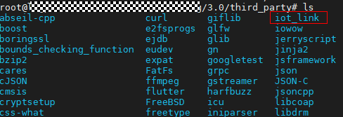

在vendor目录下，添加设备侧代码team\_x。目录结构如下图所示。

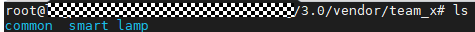

“common”中主要包含本样例依赖的头文件和类库文件。“smart\_lamp”中则包含了本样例中设备侧的核心代码。“smart\_lamp”目录结构如下图所示。

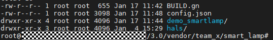

样例入口文件iot\_main.c位于demo\_smartlamp/src目录下，当启动开发板时，会启动入口线程任务。在该任务中，开发板会完成I2C初始化、OLED初始化，进入配网状态并注册网络监听事件。

```
static void *LampTask(const char *arg)
{
    (void)arg;
    WINDBG("LampTask Enter! \n");
    LampInit();
    (void)memset_s(&g_lamp, sizeof(g_lamp), 0x00, sizeof(g_lamp));

    NetCfgRegister(LampNetEventHandler);  // 进入配网状态并注册网络监听事件
    LampShowInfo();       // 显示LED初始状态
}
```

配网成功，并成功注册网络监听事件后，手机端每次发送指令，都会触发监听事件，从而对开发板设备上LED灯进行开关控制。

```
static int LampNetEventHandler(NET_EVENT_TYPE event, void *data)
{
    switch (event) {
        case NET_EVENT_RECV_DATA: // 接收到网络信息(FA发送的消息)
            LampProcessAppMessage((const char *)data, strlen(data)); // 处理对应的信息
            break;
        default:
            break;
    }
    return 0;
}
```


# 编译和烧录<a name="ZH-CN_TOPIC_0000001242608677"></a>

-   [编译](#section11934651171)
-   [烧录](#section17760192112618)

## 编译<a name="section11934651171"></a>

进入源码根目录，首次编译，输入编译命令“hb set”。随后在Input code path命令行中键入“.”，指定OpenHarmony工程编译根目录后回车。

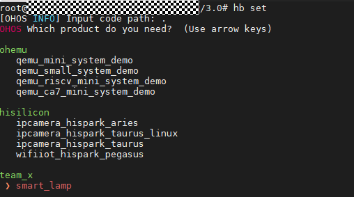

选择智能台灯“smart\_lamp”并回车，输入“hb build”命令进行编译，屏幕出现：BUILD SUCCESS字样，说明编译成功。

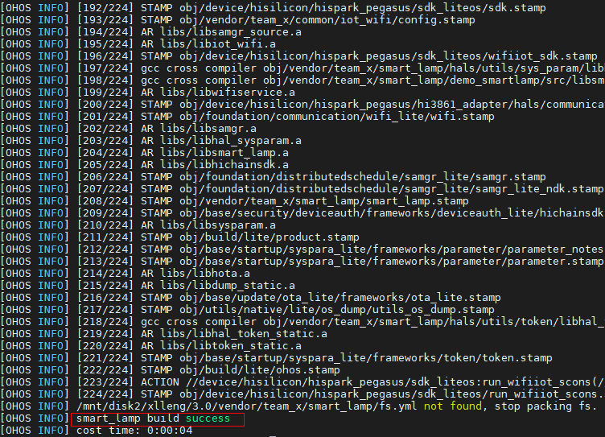

## 烧录<a name="section17760192112618"></a>

1. 将编译生成文件下载至本地Windows环境。

   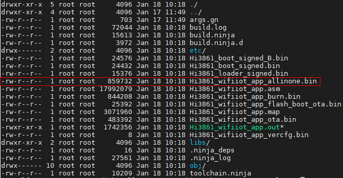

2. 将Hi3861通过TypeC数据线与电脑连接。

3. 使用Hiburn工具进行烧录：

点击“Refresh”按钮，更新com端口信息。在“COM”处选择Hi3861开发板对应的COM口。选择编译生成的二进制文件，勾选“Auto burn”，随后点击“connect”按钮。此时点击Hi3861开发板上的“RST”键，进行烧录。

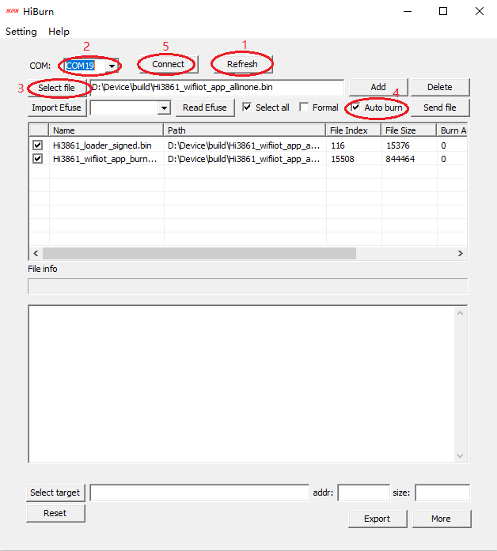

查看烧录进度，等待进度跑完，则烧录完成。可点击“Disconnect”断开连接。

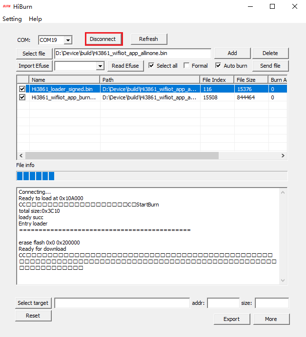


# 源码下载与编译前准备<a name="ZH-CN_TOPIC_0000001198208748"></a>

-   [代码下载](#section14279538198)
-   [编译前准备](#section10757135291716)

本案例将使用Ubuntu开发环境，基于OpenHarmony-3.0-LTS源码进行开发。

## 代码下载<a name="section14279538198"></a>

通过repo工具下载OpenHarmony-3.0-LTS的源码：

```
repo init -u https://gitee.com/openharmony/manifest.git -b OpenHarmony-3.0-LTS --no-repo-verify
repo sync -c
repo forall -c 'git lfs pull'
```

## 编译前准备<a name="section10757135291716"></a>

编译前，需要调整OpenHarmony源码，并添加设备侧代码，以实现设备配网与设备控制的功能。

修改device/hisilicon/hispark\_pegasus/sdk\_liteos/build/config/usr\_config.mk文件，开启对I2C的支持。

```
CONFIG_I2C_SUPPORT=y
```

修改device/hisilicon/hispark\_pegasus/hi3861\_adapter/hals/communication/wifi\_lite/wifiservice/source/wifi\_hotspot.c文件，在EnableHotspot函数中注释如下代码。

```
//if (SetHotspotIpConfig() != WIFI_SUCCESS) {
//    return ERROR_WIFI_UNKNOWN;
//}
```

修改device/hisilicon/hispark\_pegasus/hi3861\_adapter/hals/communication/wifi\_lite/wifiservice/source/wifi\_device.c文件，在DispatchConnectEvent函数中注释StaSetWifiNetConfig相关代码。

```
//StaSetWifiNetConfig(HI_WIFI_EVT_CONNECTED);
//StaSetWifiNetConfig(HI_WIFI_EVT_DISCONNECTED);
```

修改device/hisilicon/hispark\_pegasus/sdk\_liteos/BUILD.gn文件，在deps中添加如下代码。

```
deps = [
    ...
    "//build/lite:product",
  ]
```

修改base/security/huks/interfaces/innerkits/huks\_lite/BUILD.gn文件，注释如下代码。

```
#sources += [ "hks_tmp_client.c" ]
```

在OpenHarmony源码的third\_party目录下，添加IoTDA平台SDK。


在vendor目录下，添加设备侧代码team\_x。目录结构如下图所示。


“common”中主要包含本样例依赖的头文件和类库文件。“smart\_lamp”中则包含了本样例中设备侧的核心代码。“smart\_lamp”目录结构如下图所示。


样例入口文件iot\_main.c位于demo\_smartlamp/src目录下，当启动开发板时，会启动入口线程任务。在该任务中，开发板会完成I2C初始化、OLED初始化，进入配网状态并注册网络监听事件。

```
static void *LampTask(const char *arg)
{
    (void)arg;
    WINDBG("LampTask Enter! \n");
    LampInit();
    (void)memset_s(&g_lamp, sizeof(g_lamp), 0x00, sizeof(g_lamp));

    NetCfgRegister(LampNetEventHandler);  // 进入配网状态并注册网络监听事件
    LampShowInfo();       // 显示LED初始状态
}
```

配网成功，并成功注册网络监听事件后，手机端每次发送指令，都会触发监听事件，从而对开发板设备上LED灯进行开关控制。

```
static int LampNetEventHandler(NET_EVENT_TYPE event, void *data)
{
    switch (event) {
        case NET_EVENT_RECV_DATA: // 接收到网络信息(FA发送的消息)
            LampProcessAppMessage((const char *)data, strlen(data)); // 处理对应的信息
            break;
        default:
            break;
    }
    return 0;
}
```


# 编译和烧录<a name="ZH-CN_TOPIC_0000001242608677"></a>

-   [编译](#section11934651171)
-   [烧录](#section17760192112618)

## 编译<a name="section11934651171"></a>

进入源码根目录，首次编译，输入编译命令“hb set”。随后在Input code path命令行中键入“.”，指定OpenHarmony工程编译根目录后回车。


选择智能台灯“smart\_lamp”并回车，输入“hb build”命令进行编译，屏幕出现：BUILD SUCCESS字样，说明编译成功。


## 烧录<a name="section17760192112618"></a>

1. 将编译生成文件下载至本地Windows环境。

   

2. 将Hi3861通过TypeC数据线与电脑连接。

3. 使用Hiburn工具进行烧录：

点击“Refresh”按钮，更新com端口信息。在“COM”处选择Hi3861开发板对应的COM口。选择编译生成的二进制文件，勾选“Auto burn”，随后点击“connect”按钮。此时点击Hi3861开发板上的“RST”键，进行烧录。


查看烧录进度，等待进度跑完，则烧录完成。可点击“Disconnect”断开连接。


# 设备配网<a name="ZH-CN_TOPIC_0000001197728814"></a>

1. 使用应用调测助手App，在NFC标签中写入对应的标签信息，具体请参考[写入NFC标签信息](https://device.harmonyos.com/cn/docs/documentation/guide/onehop-write-nfc-info-0000001205589971)。

2. 通过在HAG上配置原子化关联意图，在手机碰一碰NFC标签后，即可获取需要拉取的原子化服务信息，具体请参考[配置服务关联意图](https://device.harmonyos.com/cn/docs/documentation/guide/onehop-configuration-device-tag-0000001159951466)。

3. 在手机上安装开发好的原子化服务。注意该项目包含两个模块，签名需要使用项目级签名。

   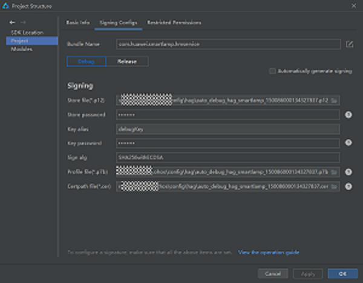

   打开Run \> Edit Configurations， 勾选entry模块下的“Deploy Multi Hap Packages”选项，表示在运行entry模块（设备配网原子化服务）时，同时会在手机中安装control模块（设备控制原子化服务）。

   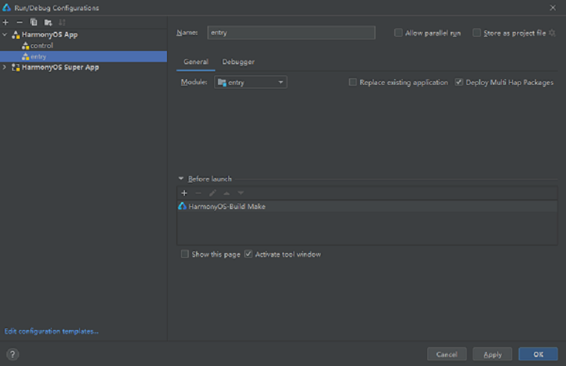

4. 打开手机NFC功能，确认手机已经接入WLAN无线网络。使用手机背部接触NFC标签，手机会弹出以下页面。

   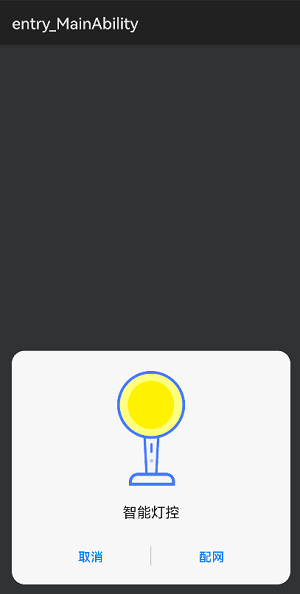

5. 点击Hi3861开发板的RST复位按键，点击手机上的配网按钮，即开始手机与开发板的配网过程。配网成功后，手机应用将自动跳转至控制界面，如下图。

   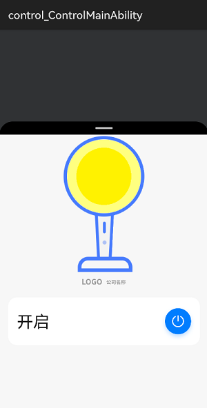


# 操作体验<a name="ZH-CN_TOPIC_0000001197888776"></a>

配网成功后，即可通过手机对Hi3861开发板LED灯进行开关操作。

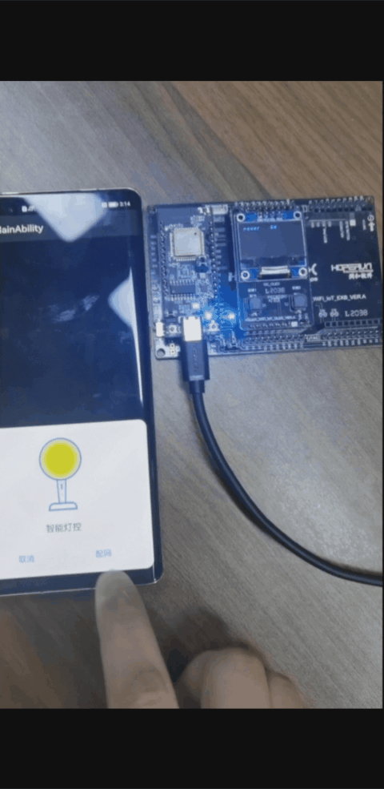

