# 【南向】智能猫眼

-   [介绍](#ZH-CN_TOPIC_0000001216170668)
-   [相关概念](#ZH-CN_TOPIC_0000001260490593)
-   [搭建OpenHarmony环境](#ZH-CN_TOPIC_0000001216010702)
-   [代码结构解读](#ZH-CN_TOPIC_0000001215850716)
-   [代码合入与运行](#ZH-CN_TOPIC_0000001260490595)
-   [任务一：获取视频数据](#ZH-CN_TOPIC_0000001260610549)
-   [任务二：封装rtsp消息格式](#ZH-CN_TOPIC_0000001216170666)
-   [任务三：rtp分包](#ZH-CN_TOPIC_0000001260770529)
-   [恭喜你](#ZH-CN_TOPIC_0000001215850718)
-   [参考](#ZH-CN_TOPIC_0000001215690734)

# 介绍<a name="ZH-CN_TOPIC_0000001216170668"></a>

智能猫眼是基于Hi3516DV300的开发板，开发的一款使用OpenHarmony相机组件能力的模拟监控类应用。本应用使用开发板上的摄像头获取视频预览图像，然后通过Rtsp和Rtp流媒体协议将视频内容推送至电脑，通过电脑上支持rtsp的播放器进行视频播放，最终达到模拟监控的功能。

其中相机组件的介绍参考：[OpenHarmony相机组件](https://gitee.com/openharmony/multimedia_camera_standard#%E7%AE%80%E4%BB%8B)

应用与电脑交互流程图：

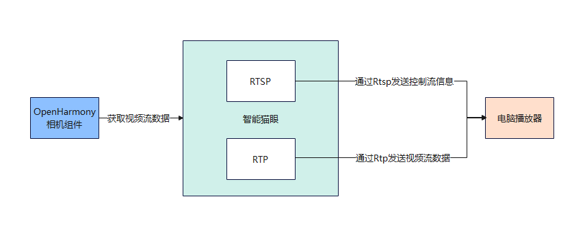

应用效果展示截图：

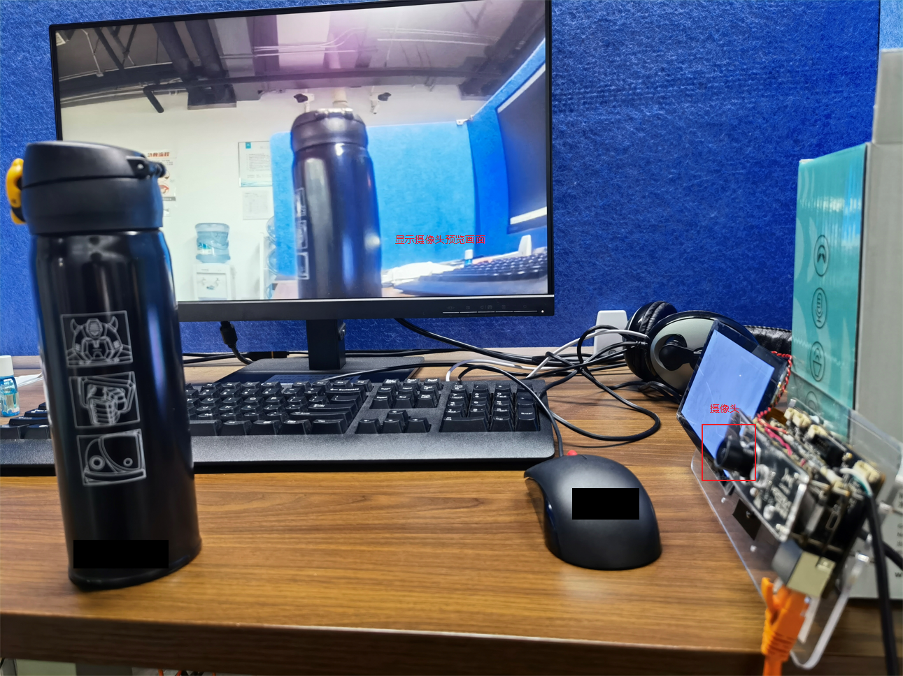


# 相关概念<a name="ZH-CN_TOPIC_0000001260490593"></a>

H264：一种通用的视频编码的格式。

rtsp：RTSP（Real Time Streaming Protocol），RFC2326，实时流传输协议，是TCP/IP协议体系中的一个应用层协议实时流传输协议。负责流媒体中的控制操作，如播放、暂停等。

rtp：实时传输协议（Real-time Transport Protocol或简写RTP）是一个网络传输协议。负责流媒体中数据包的实时传输。


# 搭建OpenHarmony环境<a name="ZH-CN_TOPIC_0000001216010702"></a>

要运行此应用前必须先搭建好OpenHarmony的开发环境，需要准备如下设备或环境：

-   Window 10 环境
-   Ubuntu 18.04+ 环境
-   Hi3516DV300开发板套件（含有开发板、USB线、串口线和电源线）

其中Window环境用来执行镜像烧录，Ubuntu环境用来执行代码下载与编译。

注：如果没有Ubuntu环境可以在window上安装虚拟机。由于后续编译过程对虚拟机性能有要求，这里虚拟机的硬盘容量建议分配60G以上，内存建议8G以上，CPU核心数根据电脑配置尽量调高，虚拟机安装过程这里不再详细说明。

1.  下载源码

    源码下载与编译都是在ubuntu上操作。

    1. 注册码云gitee账号。
    2. 注册码云SSH公钥，请参考[码云帮助中心](https://gitee.com/help/articles/4191)。
    3. 安装[git客户端](https://gitee.com/link?target=https%3A%2F%2Fgit-scm.com%2Fbook%2Fzh%2Fv2%2F%25E8%25B5%25B7%25E6%25AD%25A5-%25E5%25AE%2589%25E8%25A3%2585-Git)和[git-lfs](https://gitee.com/vcs-all-in-one/git-lfs?_from=gitee_search#downloading)并配置用户信息。

		```
		git config --global user.name "yourname"
		git config --global user.email "your-email-address"
		git config --global credential.helper store
		```

    4. 安装repo工具

		```
		curl -s https://gitee.com/oschina/repo/raw/fork_flow/repo-py3 > /usr/local/bin/repo  #如果没有权限，可下载至其他目录，并将其配置到环境变量中
		chmod a+x /usr/local/bin/repo
		pip3 install -i https://repo.huaweicloud.com/repository/pypi/simple requests
		```

    5. OpenHarmony-3.0.2-LTS 源码获取

    	通过repo + https下载，其他下载方式参考[OpenHarmony 3.0.2 LTS 下载参考](https://gitee.com/openharmony/docs/blob/master/zh-cn/release-notes/OpenHarmony-v3.0.2-LTS.md#https://gitee.com/link?target=https%3A%2F%2Frepo.huaweicloud.com%2Fharmonyos%2Fos%2F3.0.2%2Fcode-v3.0.2-LTS.tar.gz)。
	
		```
		repo init -u https://gitee.com/openharmony/manifest.git -b refs/tags/OpenHarmony-v3.0.2-LTS --no-repo-verify
		repo sync -c
		repo forall -c 'git lfs pull'
		```

2.  安装依赖工具

    ```
    sudo apt-get update && sudo apt-get install binutils git git-lfs gnupg flex bison gperf build-essential zip curl zlib1g-dev gcc-multilib g++-multilib libc6-dev-i386 lib32ncurses5-dev x11proto-core-dev libx11-dev lib32z1-dev ccache libgl1-mesa-dev libxml2-utils xsltproc unzip m4 bc gnutls-bin python3.8 python3-pip ruby
    ```

3.  执行prebuilts

    在源码根目录下执行脚本，安装编译器及二进制工具。

    ```
    bash build/prebuilts_download.sh
    ```

# 代码结构解读<a name="ZH-CN_TOPIC_0000001215850716"></a>

```
demo/
├── smart_cat_eye
│   ├── include                   # 头文件
│   │   ├── h264_rtsp_server.h
│   │   ├── rtp.h
│   │   └── test_common.h
│   ├── h264_rtsp_server.cpp      # rtsp协议实现
│   ├── main.cpp                  # 程序入口
│   ├── rtp.cpp                   # rtp协议实现
│   ├── BUILD.gn                  # 构建GN文件
│   ├── bundle.json               # 构建Json文件
│   ├── ohos.build                # 构建build文件
```

# 代码合入与运行<a name="ZH-CN_TOPIC_0000001260490595"></a>

1.  拷贝代码

    下载本次demo代码。

    解压放入OpenHarmony源码根目录，例如路径 OpenHarmony\\demo\\smart\_cat\_eye。OpenHarmony为源码根目录，下同。

    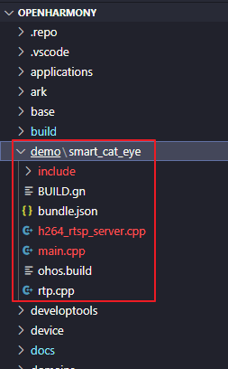

2.  添加build参数

    OpenHarmony\\build\\subsystem\_config.json 文件中添加smart\_cat\_eye路径和名字，此操作是为了将demo的路径加入到编译构建子系统中。

    **此处注意Json的格式，格式不对会导致编译错误。**

    ```
    "smart_cat_eye": {
       "project":"demo/smart_cat_eye",
       "path":"demo/smart_cat_eye",
       "name":"smart_cat_eye",
       "dir":"demo/smart_cat_eye"
      }
    ```

    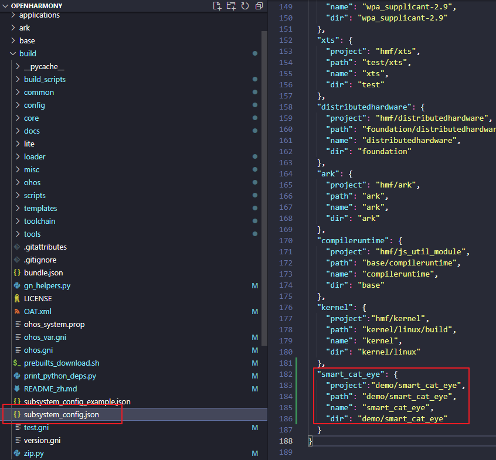

3.  添加production参数

    OpenHarmony\\productdefine\\common\\products\\Hi3516DV300.json 中添加如下参数，此操作是为了将demo加入到Hi3516DV300的产品中。

    **此处注意Json的格式，格式不对会导致编译错误。**

    ```
    "demo:smart_cat_eye":{}
    ```

    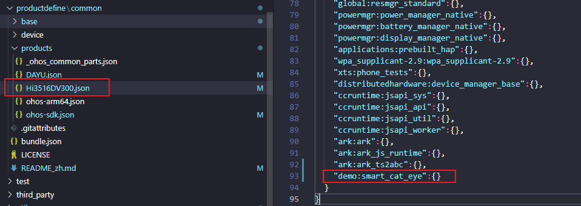

4.  编译

    输入编译命令，编译代码。

    首次编译时间较长请耐心等待，预计时间1h-4h（编译耗时跟电脑CPU配置有关，如果是虚拟机Ubuntu用户，建议把CPU的核心数调高，提高多线程能力），编译过程中会有编译log持续打印，编译成功会有成功log打印。

    ```
    ./build.sh --product-name Hi3516DV300
    ```

    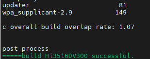

    输入查找命令，若能找到smart\_cat\_eye\_service 文件，说明代码合入成功。

    ```
    find ./ -name "smart_cat_eye_service"
    ```

    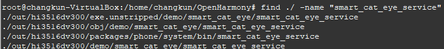

5.  烧录

    此步骤开始，以下步骤都是在window下进行。

    烧写前请先断开开发板电源，将USB线与电脑连接，type-c端口先不要连接开发板。

    打开HiTool工具选择烧写eMMC,  传输方式选择USB口，选择分区表文件（文件路径：OpenHarmony\\out\\ohos-arm-release\\packages\\phone\\images\\Hi3516DV300-emmc.xml），点击烧写按钮开始烧写，然后按下开发板的update按钮不放，将USB线的type-c口插到开发板背后的type-c端口，松开update按钮，此时会自动开始烧写，烧写过程会有日志打印，成功会有提醒。update按钮在开发板上的标注符号是sw3。

    HiTool工具开发者可以在网上自行下载使用。

    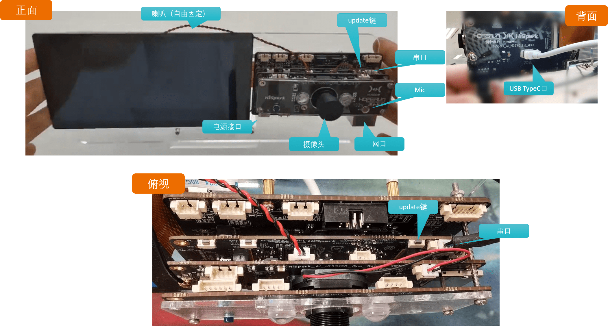

    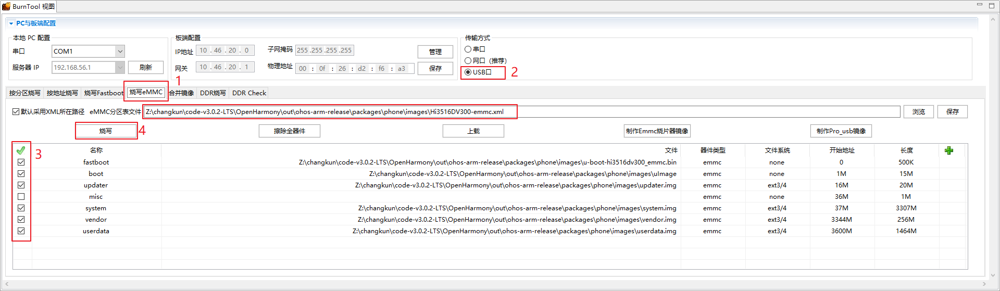

    

    

6.  连接串口调试工具

    取出开发板套装中的串口线，将串口的一端连接至开发板的串口，USB一端连接至PC。串口的位置可以参考上面开发板的接口图。

    串口端口查看方法：

    右键此电脑-管理-设备管理器-端口

    

    如上图，本地电脑连接是COM4端口，打开串口工具，选择COM4，波特率选择115200，即可正常打开串口。串口工具可以使用网上常见的终端工具，比如MobaXterm等。

7.  运行

    烧录成功后，重启开发板，开发板使用网线与电脑接入同一网络，然后将开发板的IP与电脑设置为同一网段。

    例如电脑 IP 192.168.1.2，设置开发板设置为192.168.1.88。

    打开开发板串口窗口，依次输入如下命令：

    ```
    ifconfig eth0 192.168.1.88 netmask 255.255.255.0
    ```

    运行 smart\_cat\_eye\_service 程序命令：

    ```
    smart_cat_eye_service
    ```

    执行开始后，等待出现rtsp协议的URL。

    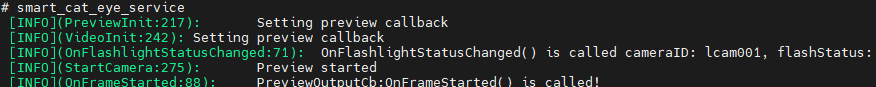

    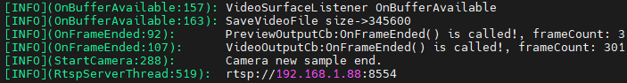

8.  视频播放

    电脑运行支持rtsp播放器，输入URL地址进行播放。开发者可以使用网络上支持rtsp协议的播放器进行播放操作，比如VLC media player等。

    URL地址：rtsp://192.168.1.88:8554

    注：URL的地址需要根据开发板的IP来定。例如本教程开发板IP为192.168.1.88，所以URL为rtsp://192.168.1.88:8554,

    其中8554为端口号不要更改。

    输入URL，点击播放，就能正常出现开发板相机预览的画面了。

# 任务一：获取视频数据<a name="ZH-CN_TOPIC_0000001260610549"></a>

1. 获取相机管理器实例并获取相机对象列表。

	```
	sptr<CameraManager> camManagerObj = CameraManager::GetInstance();
	std::vector<sptr<CameraInfo>> cameraObjList = camManagerObj->GetCameras();
	```

2. 使用相机对象创建相机输入来打开相机。

	```
	sptr<CaptureInput> cameraInput = camManagerObj->CreateCameraInput(cameraObjList[0]);
	```

3. 创建采集会话。

	```
	sptr<CaptureSession> captureSession = camManagerObj->CreateCaptureSession();
	```

4. 开始配置采集会话。

	```
	sptr<CaptureSession> captureSession = camManagerObj->CreateCaptureSession();
	```

5. 将相机输入添加到采集会话。

	```
	sptr<CaptureSession> captureSession = camManagerObj->CreateCaptureSession();
	```

6. 创建 Surface，注册监听器以监听缓冲区更新。通过重写OnBufferAvailable\(\)函数，获取缓冲区buff。

	```
	class VideoSurfaceListener : public IBufferConsumerListener {
	public:
		sptr<Surface> surface_;
		// 获取视频数据的回调
		void OnBufferAvailable() override
		{
			if (sVideoFd == -1) {
				// Create video file
				SaveVideoFile(nullptr, 0, SaveVideoMode::CREATE);
			}
			int32_t flushFence = 0;
			int64_t timestamp = 0;
			OHOS::Rect damage;
			SAMPLE_INFO("VideoSurfaceListener OnBufferAvailable");
			OHOS::sptr<OHOS::SurfaceBuffer> buffer = nullptr;
			surface_->AcquireBuffer(buffer, flushFence, timestamp, damage);
			if (buffer != nullptr) {
				//获取视频帧buffer
				char *addr = static_cast<char *>(buffer->GetVirAddr());
				int32_t size = buffer->GetSize();
				SAMPLE_INFO("SaveVideoFile size->%d", size);
				SaveVideoFile(addr, size, SaveVideoMode::APPEND);
				surface_->ReleaseBuffer(buffer, -1);
			} else {
				SAMPLE_INFO("AcquireBuffer failed!");
			}
		}
	};
	```

7. 将视频输出添加到采集会话。

    ```
    result = captureSession->AddOutput(videoOutput);
    ```

8. 将配置提交到采集会话。

    ```
    result = captureSession->CommitConfig();
    ```

9. 开始视频录制。

    ```
    result = ((sptr<VideoOutput> &)videoOutput)->Start();
    ```

10. 需要时停止录制。

    ```
    result = ((sptr<VideoOutput> &)videoOutput)->Stop();
    ```

11. 释放采集会话的资源。

	```
	captureSession->Release();
	```

12. 释放相机输入关闭相机。

	```
	cameraInput->Release();
	```

# 任务二：封装rtsp消息格式<a name="ZH-CN_TOPIC_0000001216170666"></a>

rtsp负责建立和控制会话，rtp负责多媒体的传输。

消息类型有Options、Describe、Setup、Play等。

当客户端给服务器发送Play消息后，服务端会通过rtp协议给客户端发送视频流数据。

```
static int MethodSwitch(char* method, char* sendBuffer, int cseq, char* url, int clientRtpPort)
{
    // 处理 Options 消息
    if (!strcmp(method, "OPTIONS")) {
        if (HandleCmdOptions(sendBuffer, cseq)) {
            SAMPLE_INFO("failed to handle options\n");
            return -1;
        }
    // 处理 Describe 消息
    } else if (!strcmp(method, "DESCRIBE")) {
        if (HandleCmdDescribe(sendBuffer, cseq, url)) {
            SAMPLE_INFO("failed to handle describe\n");
            return -1;
        }
     // 处理 Setup 消息
    } else if (!strcmp(method, "SETUP")) {
        if (HandleCmdSetup(sendBuffer, cseq, clientRtpPort)) {
            SAMPLE_INFO("failed to handle setup\n");
            return -1;
        }
     // 处理 Play 消息
    } else if (!strcmp(method, "PLAY")) {
        if (HandleCmdPlay(sendBuffer, cseq)) {
            SAMPLE_INFO("failed to handle play\n");
            return -1;
        }
    } 
    ...
}
```

# 任务三：rtp分包<a name="ZH-CN_TOPIC_0000001260770529"></a>

通过相机组件获取的视频流格式是H264，H264格式的数据是由多个NALU组成，相邻的NALU间使用 00 00 00 01 分割标识，获取单独的NALU数据需要去除这些分割标识。

RTP数据单元 = RTP header + RTP payload

具体的RTP header与RTP payload的定义，开发者可以去网上查找相关资料，这里不再详细说明。

在使用rtp发送数据之前，需要填好 RTP header 数据，然后将NALU数据放到RTP payload中发送出去。

由于部分NALU数据很大，一个RTP payload 放不下，这时需要将NALU数据进行分片处理。

NALU数据发送：

```
int RtpSendH264Frame(int socket, const char*ip, int16_t port,struct RtpPacket* rtpPacket,   uint8_t* frame, uint32_t frameSize)
{
    int sendBytes = 0;
    ...
    if (frameSize <= RTP_MAX_PKT_SIZE) { // 单一NALU单元模式
...
} else { // NALU 分片模式
    PacketFragmentation(...);
}
    return sendBytes;
}
```

分片模式：

```
// 完整的包个数
int pktNum = frameSize / RTP_PKT_MAX_SIZE;
// 剩余不完整包的大小       
int remainSize = frameSize % RTP_PKT_MAX_SIZE; 
// 处理完整包
for (i = 0; i < pktNum; i++) {
    ...
}
// 处理不完整的包
if (remainSize > 0 ) {
    ...
}
```

# 恭喜你<a name="ZH-CN_TOPIC_0000001215850718"></a>

目前您已经成功完成了本Codelab，并且学到了：

1.  通过相机组件获取视频数据。
2.  使用rtsp协议发送控制信息。
3.  使用rtp协议发送视频数据。

