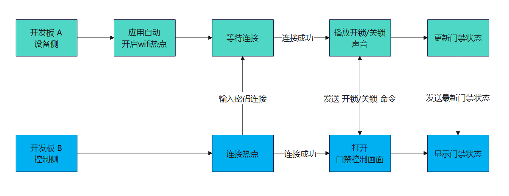
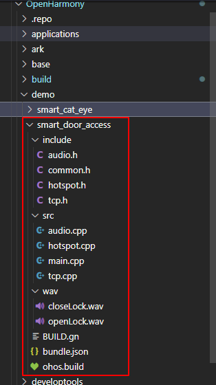
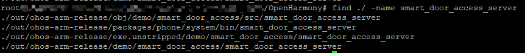
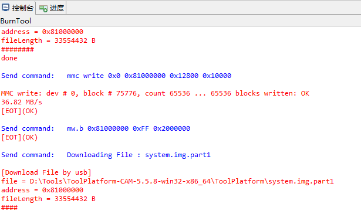
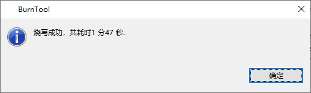
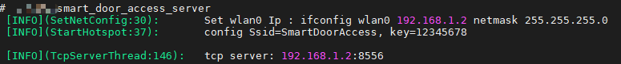
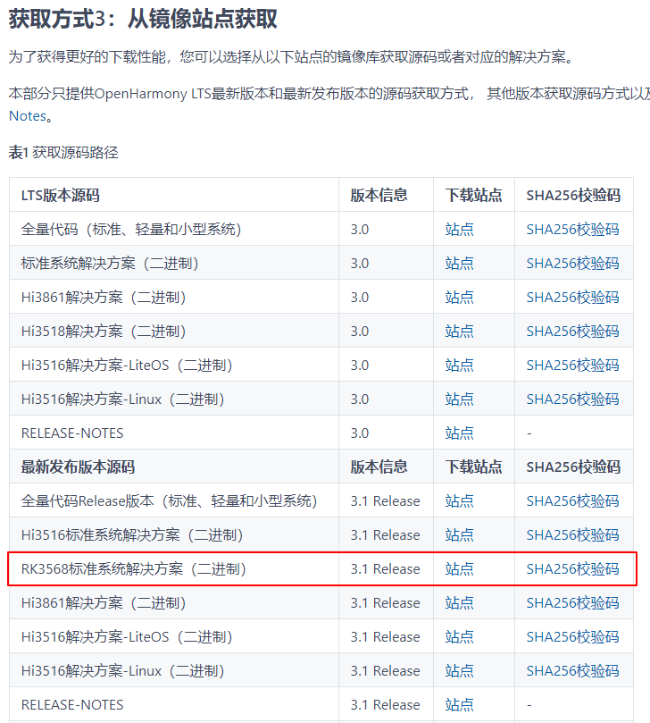
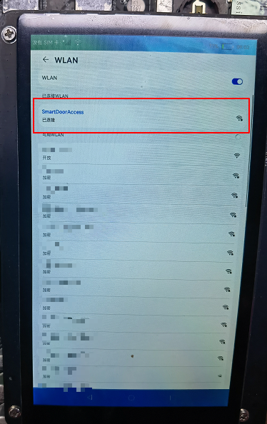
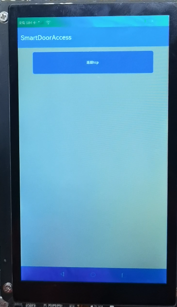
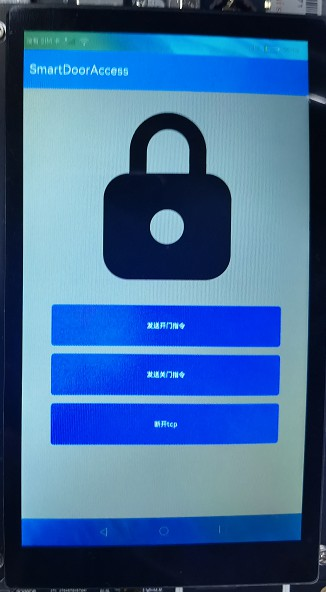

# 智能门禁

# 介绍

本教程主要介绍基于OpenHarmony开发的一款智能门禁的Codelab。

本Codelab结合了南向设备侧开发和北向应用侧开发，利用两块开发板模拟日常生活中刷门禁的场景，使用开发板A作为设备侧模拟门禁端，使用开发板B作为控制侧发送命令。

设备侧通过播放开关门声音来模拟开锁与关锁的动作，控制侧不仅可通过屏幕上的按钮发送开锁与关锁的命令，同时也能同步显示门锁的状态。

可以参考下面的流程图快速的了解基本的流程。



应用效果展示：


# 相关能力

主要能力介绍：

-   [OpenHarmony的WIFI 能力（Native）](https://gitee.com/openharmony/communication_wifi)
-   [OpenHarmony的音频能力（Native）](https://gitee.com/openharmony/multimedia_audio_standard)
-   [OpenHarmony Socket 通信能力（ets）](https://gitee.com/openharmony/docs/blob/master/zh-cn/application-dev/reference/apis/js-apis-socket.md)
-   [OpenHarmony Stage模型（API9）](https://gitee.com/openharmony/docs/blob/master/zh-cn/application-dev/quick-start/start-with-ets-stage.md)

# 搭建OpenHarmony环境

要运行此应用前必须先搭建好OpenHarmony的开发环境，需要准备如下设备和环境：

-   Window 10 环境
-   Ubuntu 18.04+ 环境
-   Hi3516DV300开发板套件（含有开发板、USB线、串口线和电源线）
-   RK3568（又称：DAYU200）开发板套件（含有开发板、USB线、电源线）

本demo分为南向（设备侧）开发和北向（应用侧）开发，南向与北向的环境搭建不一样，下面会分开介绍。

## 南向环境搭建

南向Window环境用来执行镜像烧录，Ubuntu环境用来执行代码下载与编译。

注：如果没有Ubuntu环境可以在window上安装虚拟机。由于后续编译过程对虚拟机性能有要求，这里虚拟机的硬盘容量建议分配60G以上，内存建议8G以上，CPU核心数根据电脑配置尽量调高，虚拟机安装过程这里不再详细说明。

1.  下载源码

    源码下载与编译都是在ubuntu上操作，[OpenHarmony 3.0.2 LTS 下载参考](https://gitee.com/openharmony/docs/blob/master/zh-cn/release-notes/OpenHarmony-v3.0.2-LTS.md#https://gitee.com/link?target=https%3A%2F%2Frepo.huaweicloud.com%2Fharmonyos%2Fos%2F3.0.2%2Fcode-v3.0.2-LTS.tar.gz)。

2.  安装依赖工具

    ```
    sudo apt-get update && sudo apt-get install binutils git git-lfs gnupg flex bison gperf build-essential zip curl zlib1g-dev gcc-multilib g++-multilib libc6-dev-i386 lib32ncurses5-dev x11proto-core-dev libx11-dev lib32z1-dev ccache libgl1-mesa-dev libxml2-utils xsltproc unzip m4 bc gnutls-bin python3.8 python3-pip ruby
    ```

3.  执行prebuilts

    在源码根目录下执行脚本，安装编译器及二进制工具。

    ```
    bash build/prebuilts_download.sh
    ```

## 北向环境搭建

北向环境可以参考[工具准备](https://gitee.com/openharmony/docs/blob/master/zh-cn/application-dev/quick-start/start-overview.md#%E5%B7%A5%E5%85%B7%E5%87%86%E5%A4%87)的教程进行安装与配置。

# 代码结构解读

南向使用Hi3516DV300开发板，北向使用RK3568开发板。

代码目录分为server与client两个部分，其中server是南向代码，client是北向代码。

-   南向代码结构：

    ```
    ├── BUILD.gn			# GN文件
    ├── bundle.json			# 编译构建
    ├── include			# 头文件
    │   ├── audio.h	
    │   ├── common.h
    │   ├── hotspot.h
    │   └── tcp.h
    ├── ohos.build			# 编译构建
    └── wav                         # 音频资源目录 
    └── src
        ├── audio.cpp		# 音频程序
        ├── hotspot.cpp	        # WIFI热点程序
        ├── main.cpp		# 主程序
        └── tcp.cpp			# Tcp程序
    
    ```

-   北向代码结构：

    ```
    ├─AppScope		        # app全局目录
    │  └─resources
    │      └─base
    │          ├─element
    │          └─media
    └─entry				# entry目录
        └─src
            └─main
                ├─ets		# ets代码
                │  ├─Application
                │  ├─MainAbility
                │  ├─model
                │  ├─pages
                │  └─view
                └─resources		# 资源目录
                    └─base
                        ├─element
                        ├─media
                        └─profile
    ```

# 代码合入与运行

## 南向代码

1.  拷贝代码

    首先通过git下载本仓库代码，然后在源代码OpenHarmony目录下创建一个文件夹demo，将本仓库代码server\\smart\_door\_access拷贝到OpenHarmony\\demo中，拷贝后路径为 OpenHarmony\\demo\\smart\_door\_access。

    **路径中的OpenHarmony为源码根目录。**

    

2.  添加build参数

    OpenHarmony\\build\\subsystem\_config.json 文件中添加smart\_door\_access路径和名字，此操作是为了将demo的路径加入到编译构建子系统中。

    **此处注意Json的格式，格式不对会编译错误。**

    ```
    "smart_door_access": {
      "project":"demo/smart_door_access",
      "path":"demo/smart_door_access",
      "name":"smart_door_access",
      "dir":"demo/smart_door_access"
    }
    ```

    

3.  添加production参数

    OpenHarmony\\productdefine\\common\\products\\Hi3516DV300.json 中添加如下参数，此操作是为了将demo加入到Hi3516DV300的产品中。

    **此处注意Json的格式，格式不对会导致编译错误**

    ```
    "demo:smart_door_access":{}
    ```

    

4.  编译

    输入编译命令，编译代码。

    首次编译时间较长请耐心等待，预计时间1h-4h（编译耗时跟电脑CPU配置有关，如果是虚拟机Ubuntu用户，建议把CPU的核心数调高，提高多线程能力），编译过程中会有编译log持续打印，编译成功会有成功log打印。

    ```
    ./build.sh --product-name Hi3516DV300
    ```

    

    输入查找命令，若能找到smart\_door\_access\_server文件，说明代码合入成功。

    ```
    find ./ -name "smart_door_access_server"
    ```

    

5.  烧录

    从Ubuntu环境将路径OpenHarmony\\out\\ohos-arm-release\\packages\\phone\\images下的镜像文件夹拷贝到window环境上。

    烧写前请先断开开发板电源，将USB线与电脑连接，type-c端口先不要连接开发板。

    window环境下打开HiTool工具选择烧写eMMC,  传输方式选择USB口，选择分区表文件（文件路径：OpenHarmony\\out\\ohos-arm-release\\packages\\phone\\images\\Hi3516DV300-emmc.xml），点击烧写按钮开始烧写，然后按下开发板的update按钮不放，将USB线的type-c口插到开发板背后的type-c端口，松开update按钮，此时会自动开始烧写，烧写过程会有日志打印，成功会有提醒。update按钮在开发板上的标注符号是sw3。

    HiTool工具开发者可以在网上自行下载使用。

    

    

    

    

6.  连接串口调试工具

    取出开发板套装中的串口线，将串口的一端连接至开发板的串口，USB一端连接至PC。串口的位置可以参考上面开发板的接口图。

    串口端口查看方法：

    右键此电脑-管理-设备管理器-端口

    

    如上图，本地电脑连接是COM4端口，打开串口工具，选择COM4，波特率选择115200，即可正常打开串口。串口工具可以使用网上常见的终端工具，比如MobaXterm等。

7.  启动设备侧demo

    运行 smart\_door\_access\_server 程序命令：

    ```
    smart_door_access_server
    ```

    开发板A运行demo后，会自动分享wifi热点，等待控制侧连接WIFI。启动成功，会有如下log。

    

## 北向代码

1.  点击打开Openharmony系统下载界面，找到 获取方式三：从镜像站点获取 ，下载RK3568标准系统，3.1Release版本。

    

2.  烧录镜像

    参考[DAYU200烧录指导](https://gitee.com/hihope_iot/docs/tree/master/HiHope_DAYU200/%E7%83%A7%E5%86%99%E5%B7%A5%E5%85%B7%E5%8F%8A%E6%8C%87%E5%8D%97)，点击按照教程进行烧录。

3.  DevEco Studio导入代码

    使用DevEco Studio打开client\\SmartDoorAccess的项目。项目是使用API 9构建的，使用前要确保API 9 的SDK已经下载好。

4.  开发板安装hap应用

    按照官网[使用真机进行调试](https://developer.harmonyos.com/cn/docs/documentation/doc-guides/ohos-debugging-and-running-0000001263040487)教程进行操作。

5.  开发板B连接WIFI

    系统主页打开设置，进入WLAN界面，选择WIFI名：SmartDoorAccess ，输入密码：12345678，连接完成后，如下图所示。

    

6.  启动控制侧demo
    1.  打开SmartDoorAccess

        

    2.  点击**连接tcp**按钮，连接成功后，会出现一个锁的图片和三个新的命令控制按钮。
    3.  点击**发送开门指令**按钮，设备侧会发出开锁的声音，同时锁的图标变成打开状态。

        

    4.  点击**发送关门指令**按钮，设备侧会发出关锁的声音，同时锁的图标变成关闭状态。

        

    5.  点击**断开tcp**按钮，断开连接。

# 任务一：开启WIFI热点

南向设备侧通过WIFI组件能力打开WIFI热点，具体步骤如下：

1.  获取 WifiHotspot 对象

    ```
    std::unique_ptr<WifiHotspot> wifiHotspotPtr = WifiHotspot::GetInstance(WIFI_HOTSPOT_ABILITY_ID);
    ```

2.  配置HotspotConfig

    ```
    // Wifi热点配置
        const std::string ssid = "SmartDoorAccess";
        const std::string key = "12345678";
        HotspotConfig config;
        config.SetSsid(ssid);
        config.SetPreSharedKey(key);
        config.SetMaxConn(1);
        config.SetBand(BandType::BAND_2GHZ);
        config.SetSecurityType(KeyMgmt::WPA_PSK);
        SAMPLE_INFO("config Ssid=%s, key=%s \r\n", config.GetSsid().c_str(), config.GetPreSharedKey().c_str());
        ret = wifiHotspotPtr->SetHotspotConfig(config);
    ```

3.  开启热点

    ```
    wifiHotspotPtr->EnableHotspot();
    ```

# 任务二：TCP通信

北向控制侧通过Socket API 可以执行tcp通信，具体步骤如下：

1.  导入socket组件

    ```
    import net_socket from '@ohos.net.socket';
    ```

2.  获取TCP对象

    ```
    this.tcp = net_socket.constructTCPSocketInstance()
    ```

3.  绑定本机IP与端口

    ```
    this.tcp.bind({ address: '0.0.0.0', port: 8554, family: 1 }, err => {
        if (err) {
             logger.log('bind fail');
    	 return;
        }
        logger.log('bind success');
    })
    ```

4.  连接服务器

    ```
    this.promise = this.tcp.connect({ address: { address: '192.168.1.2', port: 8556, family: 1 }, timeout: 6000 });
        this.promise.then(() => {
            logger.log('connect success')
            this.isConnect = true;
            this.AutoFlush();
        }).catch(err => {
            logger.log(`connect fail : ${err}`)
            this.isConnect = false
        });
    ```

5.  发送数据

    ```
    private Send(order: string) {
        this.tcp.send({
            data: order
        }, err => {
            if (err) {
                logger.log('send fail');
                return;
            }
            logger.log('send success');
        })
     }
    ```

6.  接收数据

    网络数据是uint8的字节数据，可以转化为对应的字符串使用更方便。

    ```
    private SockOnMessage(data) {
        let buffer = data.message
        let dataView = new DataView(buffer)
        let str = ""
        for (let i = 0;i < dataView.byteLength; ++i) {
            str += String.fromCharCode(dataView.getUint8(i))
        }
        logger.log(str)
        if (str.includes('open')) {
            this.isLock = false;
        } else if (str.includes('close')) {
            this.isLock = true;
        }
    }
    private Accept() {
          this.tcp.on('message', buffer => {
              this.SockOnMessage(buffer);
        });
    }
    ```

# 任务三：音频播放

南向播放音频文件：

1.  获取 AudioRenderer 对象

    ```
    AudioStreamType streamType = STREAM_MUSIC; // 流类型示例
    std::unique_ptr<AudioRenderer> audioRenderer = AudioRenderer::Create(streamType);
    ```

2.  初始化 AudioRenderer 参数

    ```
    static int32_t InitializeRenderer(std::unique_ptr<AudioRenderer> &audioRenderer)
    {
        AudioRendererParams rendererParams;
        rendererParams.sampleFormat = SAMPLE_S16LE;
        rendererParams.sampleRate = SAMPLE_RATE_44100;
        rendererParams.channelCount = STEREO;
        rendererParams.encodingType = ENCODING_PCM;
        return audioRenderer->SetParams(rendererParams);
    }
    ```

3.  设置音量大小

    ```
    audioRenderer->SetVolume(1.0); // 1.0 最大音量
    ```

4.  启动AudioRenderer

    ```
    audioRenderer->Start();
    ```

5.  播放音频文件

    ```
    static void OpenAudioFile(std::unique_ptr<AudioRenderer> &audioRenderer, std::string path)
    {
        const int32_t WRITE_BUFFERS_COUNT = 500;
        int32_t ret = -1;
        size_t bufferLen;
        // 获取音频组件支持的buffer长度
        ret = audioRenderer->GetBufferSize(bufferLen);
        if (ret != 0) {
            SAMPLE_INFO("GetBufferSize error");
        }
        // 打开音频文件
        FILE *wavFile = fopen(path.c_str(), "rb");
        uint8_t *buffer = (uint8_t *)malloc(bufferLen);
        size_t bytesToWrite = 0;
        int32_t bytesWritten = 0;
        size_t minBytes = 4;
        int32_t numBuffersToRender = WRITE_BUFFERS_COUNT;
        while (numBuffersToRender) {
            bytesToWrite = fread(buffer, 1, bufferLen, wavFile);
            bytesWritten = 0;
            while ((static_cast<size_t>(bytesWritten) < bytesToWrite) &&
                ((static_cast<size_t>(bytesToWrite) - bytesWritten) > minBytes)) {
                // 写入音频流
                bytesWritten += audioRenderer->Write(buffer + static_cast<size_t>(bytesWritten),
                    bytesToWrite - static_cast<size_t>(bytesWritten));
                if (bytesWritten < 0) {
                    break;
                }
            }
            numBuffersToRender--;
        }
        free(buffer);
        fclose(wavFile);
    }
    ```

6.  关闭AudioRenderer

    ```
    audioRenderer->Drain();
    audioRenderer->Stop();
    audioRenderer->Release();
    ```

# 恭喜您

目前您已经成功完成了本Codelab，并且学到了：

1.  通过WIFI Native组件开启WIFI热点。
2.  使用音频 Native组件播放音频文件。
3.  使用Socket（ets）接口开发tcp通信程序。