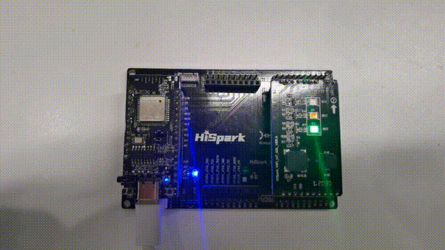
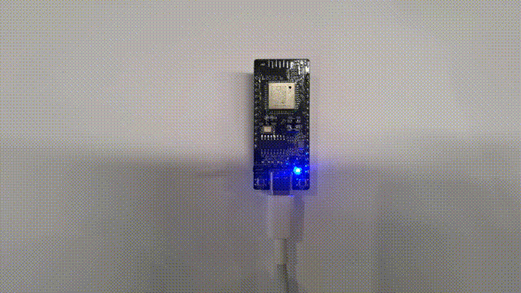
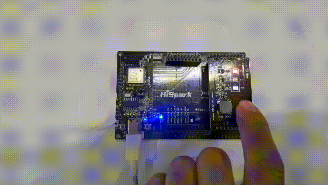

# 任务介绍<a name="ZH-CN_TOPIC_0000001233923405"></a>

在Hi3861案例1：日志、线程、定时器中，我们安排了四个小任务，分别介绍了如何搭建Hi3861实验环境、如何打印日志、如何启动线程、如何启动定时器，本文将进一步深入学习Hi3861及其外部设备，通过本文的学习，你需要完成如下三个任务：

任务一 控制小灯泡的闪烁


任务二 控制红绿灯的闪烁



任务三 通过按键控制红绿灯


# Hi3861开发环境准备<a name="ZH-CN_TOPIC_0000001233806297"></a>

完成本篇Codelab，我们首先需要完成开发环境搭建、源码编译，可参照如下步骤进行。

1.  [搭建开发环境](https://gitee.com/openharmony/docs/blob/master/zh-cn/device-dev/quick-start/quickstart-lite-steps-hi3861-setting.md)。
2.  [源码获取](https://gitee.com/openharmony/docs/blob/master/zh-cn/device-dev/get-code/sourcecode-acquire.md)：建议开发者选择LTS 3.0版本源码进行编译，本篇Codelab是基于此版本开发的。

**您需要使用如下设备完成本Codelab：**

Hi3861V100开发板主板、底板以及智能红绿灯板。

# 相关概念<a name="ZH-CN_TOPIC_0000001234224643"></a>

GPIO（英语：General-purpose input/output），通用型之输入输出的简称。H3861芯片内部包括了GPIO模块，用于实现芯片引脚上的数字输入、输出功能。输入、输出的数字表示对应的状态，状态只能是0或1两种，通常使用低电平表示0，高电平表示1。

# 任务一 控制小灯泡的闪烁<a name="ZH-CN_TOPIC_0000001188526602"></a>

下文将通过修改源码的方式展示如何将Hi3861V100开发板主板上的小灯泡点亮，并控制其闪烁。

**1. 确定目录结构**。

开发者编写业务时，务必先在./applications/sample/wifi-iot/app路径下新建一个目录（或一套目录结构），用于存放业务源码文件。

例如：在app目录下新增业务light，其中main.c为业务代码，BUILD.gn为编译脚本，具体规划目录结构如下：

```
.
└── applications
    └── sample
        └── wifi-iot
            └── app
                │── light
                │  │── main.c
                │  └── BUILD.gn
                └── BUILD.gn
```

**2. 编写业务代码**。

在./applications/sample/wifi-iot/app/light目录下新建main.c文件，在main.c中新建业务入口函数Main，并实现业务逻辑。并在代码最下方，使用OpenHarmony启动恢复模块接口SYS\_RUN\(\)启动业务。（SYS\_RUN定义在ohos\_init.h文件中）

```
#include <stdio.h>
#include <string.h>
#include <unistd.h>

#include "ohos_init.h"
#include "cmsis_os2.h"
#include "iot_gpio.h"

#define LED_INTERVAL_TIME_US(1 * 1000000)
#define LED_TASK_STACK_SIZE 512
#define LED_TEST_GPIO_9 9

// 小灯泡每隔1秒闪烁一次
static void SparkTask(void)
{
    IoTGpioInit(LED_TEST_GPIO_9);
    hi_io_set_func(LED_TEST_GPIO_9, 0);
    IoTGpioSetDir(LED_TEST_GPIO_9, IOT_GPIO_DIR_OUT);

    while (1) {
        IoTGpioSetOutputVal(LED_TEST_GPIO_9, 1);
        usleep(LED_INTERVAL_TIME_US);
        IoTGpioSetOutputVal(LED_TEST_GPIO_9, 0);
        usleep(LED_INTERVAL_TIME_US);
    }
}

static void Main(void)
{
    // 指定线程的属性
    osThreadAttr_t attr;
    attr.name = "SparkTask";
    attr.attr_bits = 0U;
    attr.cb_mem = NULL;
    attr.cb_size = 0U;
    attr.stack_mem = NULL;
    attr.stack_size = LED_TASK_STACK_SIZE;
    attr.priority = osPriorityNormal;

    if (osThreadNew((osThreadFunc_t)SparkTask, NULL, &attr) == NULL) {
        printf("Failed to create SparkTask!\r\n");
    }

}

SYS_RUN(Main);
```

> **说明：** 
>Hi3861V100开发板主板上的小灯泡是与GPIO 9号引脚进行的连接，故控制GPIO 9的高低电平就可以控制小灯泡的闪烁。

**3.编写用于将业务构建成静态库的BUILD.gn文件**。

在./applications/sample/wifi-iot/app/light目录下新建BUILD.gn文件，并完成如下配置。

```
static_library("main") {
    sources = [
        "main.c"
    ]
    include_dirs = [
        "//utils/native/lite/include"
    ]
}
```

**4. 编写模块BUILD.gn文件，指定需参与构建的特性模块**。

配置./applications/sample/wifi-iot/app/BUILD.gn文件，在features字段中增加索引，使目标模块参与编译。features字段指定业务模块的路径和目标，features字段配置如下。

```
import("//build/lite/config/component/lite_component.gni")

lite_component("app") {
    features = [
        "light:main",
    ]
}
```

**5. 代码编译**。

依次点击图标1和2中的两个按钮，等待代码编译，提示\[SUCCESS\]则表示项目编译成功。


**6.  [烧录](https://gitee.com/openharmony/docs/blob/master/zh-cn/device-dev/quick-start/quickstart-lite-steps-hi3861-burn.md)**。

**7. 运行结果**。

示例代码编译、烧录、运行、调测后，重启开发板后，Hi3861V100开发板主板上的小灯泡点亮将被点亮，并呈现每个1秒闪烁一次的效果，效果如下所示：



# 任务二 控制红绿灯的闪烁<a name="ZH-CN_TOPIC_0000001188686512"></a>

下文将通过修改源码的方式展示如何将红绿灯开发板点亮，并控制每隔1秒钟切换一个信号灯。

**1. 确定目录结构**。

开发者编写业务时，务必先在./applications/sample/wifi-iot/app路径下新建一个目录（或一套目录结构），用于存放业务源码文件。

例如：在app目录下新增业务traffic\_light，其中main.c为业务代码，BUILD.gn为编译脚本，具体规划目录结构如下：

```
.
└── applications
    └── sample
        └── wifi-iot
            └── app
                │── traffic_light
                │  │── main.c
                │  └── BUILD.gn
                └── BUILD.gn
```

**2. 编写业务代码**。

在./applications/sample/wifi-iot/app/traffic\_light目录下新建main.c文件，在main.c中新建业务入口函数Main，并实现业务逻辑。并在代码最下方，使用OpenHarmony启动恢复模块接口SYS\_RUN\(\)启动业务。（SYS\_RUN定义在ohos\_init.h文件中）。

```
#include <stdio.h>
#include <string.h>
#include <unistd.h>

#include "ohos_init.h"
#include "cmsis_os2.h"
#include "iot_gpio.h"

#define TASK_STACK_SIZE (1024 * 4)
#define TASK_SLEEP_TIME (1 * 1000 * 1000)

#define LED_TEST_GPIO_10 10
#define LED_TEST_GPIO_11 11
#define LED_TEST_GPIO_12 12

// 初始化红绿灯
static void InitTrafficLight(void)
{
    IoTGpioInit(LED_TEST_GPIO_10);
    hi_io_set_func(LED_TEST_GPIO_10, 0);
    IoTGpioSetDir(LED_TEST_GPIO_10, IOT_GPIO_DIR_OUT);

    IoTGpioInit(LED_TEST_GPIO_11);
    hi_io_set_func(LED_TEST_GPIO_11, 0);
    IoTGpioSetDir(LED_TEST_GPIO_11, IOT_GPIO_DIR_OUT);

    IoTGpioInit(LED_TEST_GPIO_12);
    hi_io_set_func(LED_TEST_GPIO_12, 0);
    IoTGpioSetDir(LED_TEST_GPIO_12, IOT_GPIO_DIR_OUT);
}

static void TrafficLightTask(void)
{
    InitTrafficLight();

    while (1) {
        IoTGpioSetOutputVal(LED_TEST_GPIO_10, 1);
        IoTGpioSetOutputVal(LED_TEST_GPIO_11, 0);
        IoTGpioSetOutputVal(LED_TEST_GPIO_12, 0);
        usleep(TASK_SLEEP_TIME);

        IoTGpioSetOutputVal(LED_TEST_GPIO_10, 0);
        IoTGpioSetOutputVal(LED_TEST_GPIO_11, 1);
        IoTGpioSetOutputVal(LED_TEST_GPIO_12, 0);
        usleep(TASK_SLEEP_TIME);

        IoTGpioSetOutputVal(LED_TEST_GPIO_10, 0);
        IoTGpioSetOutputVal(LED_TEST_GPIO_11, 0);
        IoTGpioSetOutputVal(LED_TEST_GPIO_12, 1);
        usleep(TASK_SLEEP_TIME);
    }
}

static void Main(void)
{
    // 指定线程的属性
    osThreadAttr_t attr;
    attr.name = "TrafficLightTask";
    attr.attr_bits = 0U;
    attr.cb_mem = NULL;
    attr.cb_size = 0U;
    attr.stack_mem = NULL;
    attr.stack_size = TASK_STACK_SIZE;
    attr.priority = osPriorityNormal;

    if (osThreadNew((osThreadFunc_t)TrafficLightTask, NULL, &attr) == NULL) {
        printf("Failed to create TrafficLightTask!\r\n");
    }
}

SYS_RUN(Main);
```

> **说明：** 
>红绿灯开发板上红、黄、绿三个小灯泡分别与GPIO引脚10、11、12相连接。

**3.编写用于将业务构建成静态库的BUILD.gn文件**。

在./applications/sample/wifi-iot/app/light目录下新建BUILD.gn文件，并完成如下配置。

```
static_library("main") {
    sources = [
        "main.c"
    ]
    include_dirs = [
        "//utils/native/lite/include"
    ]
}
```

**4. 编写模块BUILD.gn文件，指定需参与构建的特性模块**。

配置./applications/sample/wifi-iot/app/BUILD.gn文件，在features字段中增加索引，使目标模块参与编译。features字段指定业务模块的路径和目标，features字段配置如下。

```
import("//build/lite/config/component/lite_component.gni")

lite_component("app") {
    features = [
        "traffic_light:main",
    ]
}
```

**5. 代码编译**。

依次点击图标1和2中的两个按钮，等待代码编译，提示\[SUCCESS\]则表示项目编译成功。


**6.  [烧录](https://gitee.com/openharmony/docs/blob/master/zh-cn/device-dev/quick-start/quickstart-lite-steps-hi3861-burn.md)**。

**7. 运行结果**。

示例代码编译、烧录、运行、调测后，重启开发板后，Hi3861V100开发板主板上的红绿灯开发板将会被点亮，并每隔1秒钟切换一个信号灯，效果如下所示：


# 任务三 通过按键控制红绿灯<a name="ZH-CN_TOPIC_0000001188368044"></a>

下文将通过修改源码的方式展示如何通过按钮的点击事件，实现控制红绿灯开发板上小灯的交替变化。

**1. 确定目录结构**。

开发者编写业务时，务必先在./applications/sample/wifi-iot/app路径下新建一个目录（或一套目录结构），用于存放业务源码文件。

例如：在app目录下新增业务light，其中main.c为业务代码，BUILD.gn为编译脚本，具体规划目录结构如下：

```
.
└── applications
    └── sample
        └── wifi-iot
            └── app
                │── traffic_light_button
                │  │── main.c
                │  └── BUILD.gn
                └── BUILD.gn
```

**2. 编写业务代码**。

在./applications/sample/wifi-iot/app/traffic\_light\_button目录下新建main.c文件，在main.c中新建业务入口函数Main，并实现业务逻辑。并在代码最下方，使用OpenHarmony启动恢复模块接口SYS\_RUN\(\)启动业务，（SYS\_RUN定义在ohos\_init.h文件中）。

```
#include <stdio.h>
#include <string.h>
#include <unistd.h>

#include "ohos_init.h"
#include "cmsis_os2.h"
#include "iot_gpio.h"

#define TASK_STACK_SIZE (1024 * 4)

#define LED_TEST_GPIO_8 8
#define LED_TEST_GPIO_10 10
#define LED_TEST_GPIO_11 11
#define LED_TEST_GPIO_12 12
#define NUM_3 3
#define RED_LED_BRIGHT 1
#define GREEN_LED_BRIGHT 2
#define YELLOW_LED_BRIGHT 3

static int g_currentBright = 0;

// 初始化红绿灯
static void InitTrafficLight(void)
{
    IoTGpioInit(LED_TEST_GPIO_10);
    hi_io_set_func(LED_TEST_GPIO_10, 0);
    IoTGpioSetDir(LED_TEST_GPIO_10, IOT_GPIO_DIR_OUT);

    IoTGpioInit(LED_TEST_GPIO_11);
    hi_io_set_func(LED_TEST_GPIO_11, 0);
    IoTGpioSetDir(LED_TEST_GPIO_11, IOT_GPIO_DIR_OUT);

    IoTGpioInit(LED_TEST_GPIO_12);
    hi_io_set_func(LED_TEST_GPIO_12, 0);
    IoTGpioSetDir(LED_TEST_GPIO_12, IOT_GPIO_DIR_OUT);
}

// 按键每按下一次，currentBright加1
static void OnButtonPressed(char * arg)
{
    (void)arg;
    g_currentBright++;
}

// 初始化按钮
static void InitButton(void)
{
    IoTGpioInit(LED_TEST_GPIO_8);
    hi_io_set_func(LED_TEST_GPIO_8, 0);
    IoTGpioSetDir(LED_TEST_GPIO_8, IOT_GPIO_DIR_IN);
    hi_io_set_pull(LED_TEST_GPIO_8, 1);
    IoTGpioRegisterIsrFunc(LED_TEST_GPIO_8, IOT_INT_TYPE_EDGE, IOT_GPIO_EDGE_FALL_LEVEL_LOW,
        OnButtonPressed, NULL);
}

static void TrafficLightTask(void)
{
    InitTrafficLight();

    InitButton();

    while (1) {
        switch (g_currentBright % NUM_3) {
            case RED_LED_BRIGHT:
                IoTGpioSetOutputVal(LED_TEST_GPIO_10, 1);
                IoTGpioSetOutputVal(LED_TEST_GPIO_11, 0);
                IoTGpioSetOutputVal(LED_TEST_GPIO_12, 0);
                break;
            case GREEN_LED_BRIGHT:
                IoTGpioSetOutputVal(LED_TEST_GPIO_10, 0);
                IoTGpioSetOutputVal(LED_TEST_GPIO_11, 1);
                IoTGpioSetOutputVal(LED_TEST_GPIO_12, 0);
                break;
            case YELLOW_LED_BRIGHT:
                IoTGpioSetOutputVal(LED_TEST_GPIO_10, 0);
                IoTGpioSetOutputVal(LED_TEST_GPIO_11, 0);
                IoTGpioSetOutputVal(LED_TEST_GPIO_12, 1);
                break;
            default:
                IoTGpioSetOutputVal(LED_TEST_GPIO_10, 0);
                IoTGpioSetOutputVal(LED_TEST_GPIO_11, 0);
                IoTGpioSetOutputVal(LED_TEST_GPIO_12, 1);
                break;
        }
    }
}

static void Main(void)
{
    // 指定线程的属性
    osThreadAttr_t attr;
    attr.name = "TrafficLightTask";
    attr.attr_bits = 0U;
    attr.cb_mem = NULL;
    attr.cb_size = 0U;
    attr.stack_mem = NULL;
    attr.stack_size = TASK_STACK_SIZE;
    attr.priority = osPriorityNormal;

    if (osThreadNew((osThreadFunc_t)TrafficLightTask, NULL, &attr) == NULL) {
        printf("Failed to create TrafficLightTask!\r\n");
    }

}

SYS_RUN(Main);
```

> **说明：** 
>红绿灯开发板上红、黄、绿三个小灯泡分别接到了GPIO引脚10、11、12，按键接到的GPIO引脚为8。

**3.编写用于将业务构建成静态库的BUILD.gn文件**。

在./applications/sample/wifi-iot/app/traffic\_light\_button目录下新建BUILD.gn文件，并完成如下配置。

```
static_library("main") {
    sources = [
        "main.c"
    ]
    include_dirs = [
        "//utils/native/lite/include"
    ]
}
```

**4. 编写模块BUILD.gn文件，指定需参与构建的特性模块。**

配置./applications/sample/wifi-iot/app/BUILD.gn文件，在features字段中增加索引，使目标模块参与编译。features字段指定业务模块的路径和目标，features字段配置如下。

```
import("//build/lite/config/component/lite_component.gni")

lite_component("app") {
    features = [
        "traffic_light_button:main",
    ]
}
```

**5. 代码编译**。

依次点击图标1和2中的两个按钮，等待代码编译，提示\[SUCCESS\]则表示项目编译成功。


**6.  [烧录](https://gitee.com/openharmony/docs/blob/master/zh-cn/device-dev/quick-start/quickstart-lite-steps-hi3861-burn.md)**。

**7. 运行结果**。

示例代码编译、烧录、运行、调测后，重启开发板后，通过按钮的点击事件，即可实现控制红绿灯开发板上小灯的交替变化，效果如下所示：



# 恭喜你<a name="ZH-CN_TOPIC_0000001188208070"></a>

目前您已经成功完成了本Codelab，并且学到了：

-   GPIO高低电平的设置
-   通过GPIO高低电平，控制小灯泡、控制红绿灯的闪烁
-   按钮事件的检测

