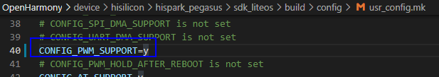

# 任务介绍<a name="ZH-CN_TOPIC_0000001186584438"></a>

PWM是脉冲宽度调制（Pulse Width Modulation）的缩写，是一种对模拟信号电平进行数字编码并将其转换为脉冲的技术。常用于马达控制、背光亮度调节等。

本篇Codelab将通过以下两个简单的样例，让开发者熟悉OpenHarmony PWM相关API的使用：

使用PWM调节呼吸灯亮暗，效果如下：


# Hi3861开发环境准备<a name="ZH-CN_TOPIC_0000001186791550"></a>

完成本篇Codelab，我们首先需要完成开发环境搭建、源码编译，可参照如下步骤进行。

1.  [搭建开发环境](https://gitee.com/openharmony/docs/blob/master/zh-cn/device-dev/quick-start/quickstart-lite-steps-hi3861-setting.md)。
2.  [源码获取](https://gitee.com/openharmony/docs/blob/master/zh-cn/device-dev/get-code/sourcecode-acquire.md)：建议开发者选择LTS 3.0版本源码进行编译，本篇Codelab是基于此版本开发的。

**您需要使用如下设备完成本Codelab：**

Hi3861V100开发板主板、底板以及智能红绿灯板。

# 相关概念<a name="ZH-CN_TOPIC_0000001231951179"></a>

**PWM  API**

<a name="table15553881214"></a>
<table><thead align="left"><tr id="row55738111213"><th class="cellrowborder" valign="top" width="50%" id="mcps1.1.3.1.1"><p id="p1661038121219"><a name="p1661038121219"></a><a name="p1661038121219"></a>方法</p>
</th>
<th class="cellrowborder" valign="top" width="50%" id="mcps1.1.3.1.2"><p id="p3498151051317"><a name="p3498151051317"></a><a name="p3498151051317"></a>说明</p>
</th>
</tr>
</thead>
<tbody><tr id="row36738171213"><td class="cellrowborder" valign="top" width="50%" headers="mcps1.1.3.1.1 "><p id="p96338151220"><a name="p96338151220"></a><a name="p96338151220"></a>IoTPwmInit (unsigned int port)</p>
</td>
<td class="cellrowborder" valign="top" width="50%" headers="mcps1.1.3.1.2 "><p id="p6643851214"><a name="p6643851214"></a><a name="p6643851214"></a>初始化PWM设备。</p>
</td>
</tr>
<tr id="row96938101213"><td class="cellrowborder" valign="top" width="50%" headers="mcps1.1.3.1.1 "><p id="p13623881219"><a name="p13623881219"></a><a name="p13623881219"></a>IoTPwmDeinit (unsigned int port)</p>
</td>
<td class="cellrowborder" valign="top" width="50%" headers="mcps1.1.3.1.2 "><p id="p106133810129"><a name="p106133810129"></a><a name="p106133810129"></a>去初始化PWM设备。</p>
</td>
</tr>
<tr id="row16163818122"><td class="cellrowborder" valign="top" width="50%" headers="mcps1.1.3.1.1 "><p id="p15611386129"><a name="p15611386129"></a><a name="p15611386129"></a>IoTPwmStart (unsigned int port, unsigned short duty, unsigned int freq)</p>
</td>
<td class="cellrowborder" valign="top" width="50%" headers="mcps1.1.3.1.2 "><p id="p66163891213"><a name="p66163891213"></a><a name="p66163891213"></a>根据给定的输出频率和占空比，从指定端口启动PWM信号输出。</p>
</td>
</tr>
<tr id="row13613382123"><td class="cellrowborder" valign="top" width="50%" headers="mcps1.1.3.1.1 "><p id="p107038101219"><a name="p107038101219"></a><a name="p107038101219"></a>IoTPwmStop (unsigned int port)</p>
</td>
<td class="cellrowborder" valign="top" width="50%" headers="mcps1.1.3.1.2 "><p id="p1171638131218"><a name="p1171638131218"></a><a name="p1171638131218"></a>停止指定端口的PWM信号输出。</p>
</td>
</tr>
</tbody>
</table>

**Hi3861V100开发板说明**

实现IOT外设控制，首先需要通过查阅原理图明确接线关系。经过查阅，智能红绿灯板与主控芯片（Pegasus）引脚的对应关系如下：

<a name="table166589311574"></a>
<table><thead align="left"><tr id="row6659153112578"><th class="cellrowborder" valign="top" width="33.33333333333333%" id="mcps1.1.4.1.1"><p id="p106591631135717"><a name="p106591631135717"></a><a name="p106591631135717"></a>模块</p>
</th>
<th class="cellrowborder" valign="top" width="33.33333333333333%" id="mcps1.1.4.1.2"><p id="p96591731145715"><a name="p96591731145715"></a><a name="p96591731145715"></a>控制管脚</p>
</th>
<th class="cellrowborder" valign="top" width="33.33333333333333%" id="mcps1.1.4.1.3"><p id="p965910312571"><a name="p965910312571"></a><a name="p965910312571"></a>PWM</p>
</th>
</tr>
</thead>
<tbody><tr id="row1659231135713"><td class="cellrowborder" valign="top" width="33.33333333333333%" headers="mcps1.1.4.1.1 "><p id="p17659153115574"><a name="p17659153115574"></a><a name="p17659153115574"></a>蜂鸣器</p>
</td>
<td class="cellrowborder" valign="top" width="33.33333333333333%" headers="mcps1.1.4.1.2 "><p id="p36601231175712"><a name="p36601231175712"></a><a name="p36601231175712"></a>GPIO9</p>
</td>
<td class="cellrowborder" valign="top" width="33.33333333333333%" headers="mcps1.1.4.1.3 "><p id="p76602312571"><a name="p76602312571"></a><a name="p76602312571"></a>PWM0</p>
</td>
</tr>
<tr id="row106605316574"><td class="cellrowborder" valign="top" width="33.33333333333333%" headers="mcps1.1.4.1.1 "><p id="p1660153125714"><a name="p1660153125714"></a><a name="p1660153125714"></a>红灯</p>
</td>
<td class="cellrowborder" valign="top" width="33.33333333333333%" headers="mcps1.1.4.1.2 "><p id="p5660193119575"><a name="p5660193119575"></a><a name="p5660193119575"></a>GPIO10</p>
</td>
<td class="cellrowborder" valign="top" width="33.33333333333333%" headers="mcps1.1.4.1.3 "><p id="p666033119577"><a name="p666033119577"></a><a name="p666033119577"></a>PWM1</p>
</td>
</tr>
</tbody>
</table>

> **说明：** 
>开发板原理图，请开发者联系Hi3861购买渠道客服获取。

# 任务一 使用PWM调节呼吸灯灯亮暗<a name="ZH-CN_TOPIC_0000001232272717"></a>

本节介绍如何使用PWM API，实现对GPIO的控制，达到呼吸灯亮度逐渐变化的效果（逐渐变暗和逐渐变亮）。

1.  **确定目录结构**。

    开发者编写业务时，务必先在./applications/sample/wifi-iot/app路径下新建一个目录（或一套目录结构），用于存放业务源码文件。

    在app下新增业务pwmled，其中pwm\_led.c为业务代码，BUILD.gn为编译脚本，具体规划目录结构如下：

    ```
    .
    └── applications
        └── sample
            └── wifi-iot
                └── app
                    │── pwmled
                    │  │── pwm_led.c
                    │  └── BUILD.gn
                    └── BUILD.gn
    ```

2.  **使PWM功能生效**。

    打开./device/hisilicon/hispark\_pegasus/sdk\_liteos/build/config/usr\_config.mk文件，找到CONFIG\_PWM\_SUPPORT is not set，取消注释，并将其修改为CONFIG\_PWM\_SUPPORT=y。

    

3.  **编写业务代码。**

    新建./applications/sample/wifi-iot/app/pwmled下的pwm\_led.c文件，在pwm\_led.c中新建业务入口函数PWMLedExample，并实现业务逻辑。并在代码最下方，使用OpenHarmony启动恢复模块接口APP\_FEATURE\_INIT\(\)启动业务。

    ```
    #include <stdio.h>
    #include <string.h>
    #include <unistd.h>
    
    #include "ohos_init.h"
    #include "cmsis_os2.h"
    #include "iot_gpio.h"
    #include "iot_pwm.h"
    #include "hi_io.h"
    #include "hi_pwm.h"
    
    #define TASK_STACK_SIZE 512
    // PWM输出占空比
    #define PVM_OUT_DUTY 50
    // PWM输出频率
    #define PVM_OUT_FREQ 10000
    #define TASK_SLEEP_TIME (0.03 * 1000 * 1000)
    
    static void PWMLedTask(void *arg)
    {
        (void)arg;
    
        while (1) {
            // 逐步增加PVM_OUT_DUTY 值使LED灯逐渐变亮
            for (int i = 0; i < PVM_OUT_DUTY; i++) {
                // 启动PWM信号输出
                IoTPwmStart(HI_PWM_PORT_PWM1, i, PVM_OUT_FREQ);
                usleep(TASK_SLEEP_TIME);
                // 停止PWM信号输出
                IoTPwmStop(HI_PWM_PORT_PWM1);
            }
            // 逐步减小PVM_OUT_DUTY 值使LED灯逐渐变暗
            for (int i = PVM_OUT_DUTY; i > 0; i--) {
                // 启动PWM信号输出
                IoTPwmStart(HI_PWM_PORT_PWM1, i, PVM_OUT_FREQ);
                usleep(TASK_SLEEP_TIME);
                // 停止PWM信号输出
                IoTPwmStop(HI_PWM_PORT_PWM1);
            }
        }
    }
    
    static void PWMLedExample(void)
    {
        osThreadAttr_t attr;
    
        // 初始化10号管脚（红色led灯）
        IoTGpioInit(HI_IO_NAME_GPIO_10);
    
        // 将10号管脚设置为PWM功能
        hi_io_set_func(HI_IO_NAME_GPIO_10, HI_IO_FUNC_GPIO_10_PWM1_OUT);
    
        // 初始化PWM设备
        IoTPwmInit(HI_PWM_PORT_PWM1);
    
        attr.name = "PWMLedTask";
        attr.attr_bits = 0U;
        attr.cb_mem = NULL;
        attr.cb_size = 0U;
        attr.stack_mem = NULL;
        attr.stack_size = TASK_STACK_SIZE;
        attr.priority = osPriorityNormal;
    
        if (osThreadNew(PWMLedTask, NULL, &attr) == NULL) {
            printf("[PWMLedExample] Failed to create PWMLedTask!\n");
        }
    }
    
    APP_FEATURE_INIT(PWMLedExample);
    ```

4.  **编写用于将业务构建成静态库的BUILD.gn文件。**

    新建./applications/sample/wifi-iot/app/pwmled下的BUILD.gn文件，并完成如下配置。

    ```
    static_library("pwm_led") {
        sources = [
            "pwm_led.c"
        ]
    
        include_dirs = [
            "//utils/native/lite/include",
            "//kernel/liteos_m/kal/cmsis",
            "//base/iot_hardware/peripheral/interfaces/kits",
        ]
    }
    ```

    -   static\_library中指定业务模块的编译结果，开发者根据实际情况完成填写。
    -   sources中指定静态库.a所依赖的.c文件及其路径，若路径中包含"//"则表示绝对路径（此处为代码根路径），若不包含"//"则表示相对路径。
    -   include\_dirs中指定source所需要依赖的.h文件路径。

5.  **编写模块BUILD.gn文件，指定需参与构建的特性模块。**

    配置./applications/sample/wifi-iot/app/BUILD.gn文件，在features字段中增加索引，使目标模块参与编译。features字段指定业务模块的路径和目标，features字段配置如下。

    ```
    import("//build/lite/config/component/lite_component.gni")
    
    lite_component("app") {
        features = [
          "pwmled:pwm_led",
        ]
    }
    ```

6.  **代码编译和烧录**。

    代码编译和烧录可以参考：

    -   [源码编译](https://gitee.com/openharmony/docs/blob/master/zh-cn/device-dev/quick-start/quickstart-lite-steps-hi3861-building.md)
    -   [烧录](https://gitee.com/openharmony/docs/blob/master/zh-cn/device-dev/quick-start/quickstart-lite-steps-hi3861-burn.md)

    完成烧录后，按下RST键复位模组，可发现呼吸灯亮度在周期性的逐渐变亮和变暗。


# 任务二 使用PWM控制蜂鸣器<a name="ZH-CN_TOPIC_0000001186313094"></a>

本节介绍如何使用PWM API，实现对GPIO的控制，使蜂鸣器持续鸣叫。

1.  **确定目录结构**。

    开发者编写业务时，务必先在./applications/sample/wifi-iot/app路径下新建一个目录（或一套目录结构），用于存放业务源码文件。

    在app下新增业务pwmbeer，其中pwm\_beer.c为业务代码，BUILD.gn为编译脚本，具体规划目录结构如下：

    ```
    .
    └── applications
        └── sample
            └── wifi-iot
                └── app
                    │── pwmbeer
                    │  │── pwm_beer.c
                    │  └── BUILD.gn
                    └── BUILD.gn
    ```

2.  **编写业务代码**。

    新建./applications/sample/wifi-iot/app/pwmbeer下的pwm\_beer.c文件，在pwm\_beer.c中新建业务入口函数PWMBeerExample，并实现业务逻辑。并在代码最下方，使用OpenHarmony启动恢复模块接口APP\_FEATURE\_INIT\(\)启动业务。

    ```
    #include <stdio.h>
    #include "ohos_init.h"
    #include "cmsis_os2.h"
    #include "hi_gpio.h"
    #include "hi_io.h"
    #include "hi_pwm.h"
    
    #define TASK_STACK_SIZE 512
    // PWM输出占空比
    #define PVM_OUT_DUTY 50
    // PWM输出频率
    #define PVM_OUT_FREQ 10000
    #define TASK_SLEEP_TIME (0.03 * 1000 * 1000)
    
    static void PWMBeerTask(void * arg)
    {
        (void)arg;
    
        while (1) {
            // 启动PWM信号输出
            IoTPwmStart(HI_PWM_PORT_PWM0, PVM_OUT_DUTY, PVM_OUT_FREQ);
            usleep(TASK_SLEEP_TIME);
            // 停止PWM信号输出
            IoTPwmStop(HI_PWM_PORT_PWM0);
        }
    }
    
    static void PWMBeerExample(void)
    {
        osThreadAttr_t attr;
    
        // 初始化9号管脚（蜂鸣器）
        IoTGpioInit(HI_IO_NAME_GPIO_9);
    
        // 将9号管脚设置为PWM功能，用于控制蜂鸣器管脚
        hi_io_set_func(HI_IO_NAME_GPIO_9, HI_IO_FUNC_GPIO_9_PWM0_OUT);
    
        // 初始化PWM设备
        IoTPwmInit(HI_PWM_PORT_PWM0);
    
        attr.name = "PWMBeerTask";
        attr.attr_bits = 0U;
        attr.cb_mem = NULL;
        attr.cb_size = 0U;
        attr.stack_mem = NULL;
        attr.stack_size = TASK_STACK_SIZE;
        attr.priority = osPriorityNormal;
    
        if (osThreadNew(PWMBeerTask, NULL, &attr) == NULL) {
            printf("[PWMBeerTask] Failed to create PWMBeerTask!\n");
        }
    }
    
    APP_FEATURE_INIT(PWMBeerExample);
    ```

3.  **编写用于将业务构建成静态库的BUILD.gn文件**。

    新建./applications/sample/wifi-iot/app/pwmbeer下的BUILD.gn文件，并完成如下配置。

    ```
    static_library("pwm_beer") {
        sources = [
            "pwm_beer.c"
        ]
    
        include_dirs = [
            "//utils/native/lite/include",
            "//kernel/liteos_m/kal/cmsis",
            "//base/iot_hardware/peripheral/interfaces/kits",
        ]
    }
    ```

    -   static\_library中指定业务模块的编译结果，开发者根据实际情况完成填写。
    -   sources中指定静态库.a所依赖的.c文件及其路径，若路径中包含"//"则表示绝对路径（此处为代码根路径），若不包含"//"则表示相对路径。
    -   include\_dirs中指定source所需要依赖的.h文件路径。

4.  **编写模块BUILD.gn文件，指定需参与构建的特性模块。**

    配置./applications/sample/wifi-iot/app/BUILD.gn文件，在features字段中增加索引，使目标模块参与编译。features字段指定业务模块的路径和目标，features字段配置如下。

    ```
    import("//build/lite/config/component/lite_component.gni")
    
    lite_component("app") {
        features = [
          "pwmbeer:pwm_beer",
        ]
    }
    ```

5.  **代码编译和烧录**。

    代码编译和烧录可以参考：

    -   [源码编译](https://gitee.com/openharmony/docs/blob/master/zh-cn/device-dev/quick-start/quickstart-lite-steps-hi3861-building.md)
    -   [烧录](https://gitee.com/openharmony/docs/blob/master/zh-cn/device-dev/quick-start/quickstart-lite-steps-hi3861-burn.md)

    完成烧录后，按下RST键复位模组，可发现蜂鸣器持续鸣叫。


# 恭喜你<a name="ZH-CN_TOPIC_0000001186631634"></a>

目前您已经成功完成了本Codelab，并且学到了：

-   如何使用PWM控制LED灯。
-   如何使用PWM控制蜂鸣器。

