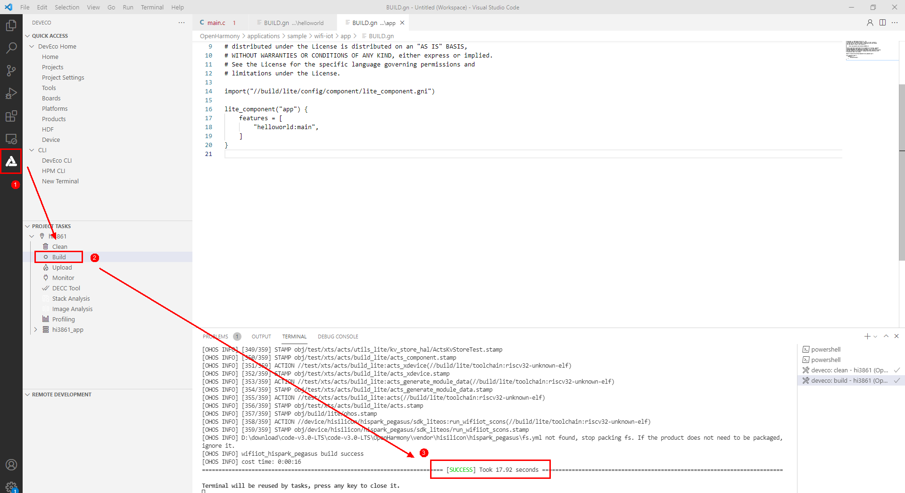

# 任务介绍<a name="ZH-CN_TOPIC_0000001233764155"></a>

OpenHarmony轻量和小型系统适用于内存较小的IOT设备。通过本文，开发者可以快速熟悉OpenHarmony轻量和小型系统的环境搭建、编译、烧录、调测以及打印“Hello World”日志、启动一个线程、启动一个定时器等。本文选取的开发板为Hi3861 WLAN模组，Hi3861开发板是一片大约2cm\*5cm大小的开发板，是一款高度集成的2.4GHz WLAN SoC芯片，集成IEEE 802.11b/g/n基带和RF（Radio Frequency）电路。支持OpenHarmony，并配套提供开放、易用的开发和调试运行环境。通过本文的学习，您需要完成如下四个任务：

-   任务一  Hi3861环境搭建
-   任务二  如何打印日志
-   任务三  如何启动线程
-   任务四  如何启动定时器

# Hi3861开发环境准备<a name="ZH-CN_TOPIC_0000001233685645"></a>

完成本篇Codelab，我们首先需要完成开发环境搭建、源码编译，可参照如下步骤进行。

1.  [搭建开发环境](https://gitee.com/openharmony/docs/blob/master/zh-cn/device-dev/quick-start/quickstart-lite-steps-hi3861-setting.md)。
2.  [源码获取](https://gitee.com/openharmony/docs/blob/master/zh-cn/device-dev/get-code/sourcecode-acquire.md)：建议开发者选择LTS 3.0版本源码进行编译，本篇Codelab是基于此版本开发的。

**您需要使用如下设备完成本Codelab：**

Hi3861V100开发板主板

> **说明：** 
>请严格按照上文步骤1-3中的指导文档进行环境搭建，如遇问题可以前往[开发者论坛](https://developer.huawei.com/consumer/cn/forum/block/device)进行求助（搜索关键字Hi3861）。

# 任务一 如何打印日志<a name="ZH-CN_TOPIC_0000001233887209"></a>

下文将通过修改源码的方式展示如何编写简单程序，输出“Hello world”。

**1. 确定目录结构**。

开发者编写业务时，务必先在./applications/sample/wifi-iot/app路径下新建一个目录（或一套目录结构），用于存放业务源码文件。

例如：在app目录下新增业务helloworld，其中main.c为业务代码，BUILD.gn为编译脚本，具体规划目录结构如下：

```
.
└── applications
    └── sample
        └── wifi-iot
            └── app
                │── helloworld
                │  │── main.c
                │  └── BUILD.gn
                └── BUILD.gn
```

**2. 编写业务代码**。

在./applications/sample/wifi-iot/app/helloworld目录下新建main.c文件，在main.c中新建业务入口函数HelloWorld，并实现业务逻辑。并在代码最下方，使用OpenHarmony启动恢复模块接口SYS\_RUN\(\)启动业务。（SYS\_RUN定义在ohos\_init.h文件中）

```
#include <stdio.h>
#include "ohos_init.h"
#include "ohos_types.h"

void HelloWorld(void)
{
    printf("[DEMO] Hello world.\n");
}
SYS_RUN(HelloWorld);
```

**3.编写用于将业务构建成静态库的BUILD.gn文件**。

在./applications/sample/wifi-iot/app/helloworld目录下新建BUILD.gn文件，并完成如下配置。

```
static_library("main") {
    sources = [
        "main.c"
    ]
    include_dirs = [
        "//utils/native/lite/include"
    ]
}
```

-   static\_library中指定业务模块的编译结果，为静态库文件libmyapp.a，开发者根据实际情况完成填写。
-   sources中指定静态库.a所依赖的.c文件及其路径，若路径中包含"//"则表示绝对路径（此处为代码根路径），若不包含"//"则表示相对路径。
-   include\_dirs中指定source所需要依赖的.h文件路径。

**4. 编写模块BUILD.gn文件，指定需参与构建的特性模块**。

配置./applications/sample/wifi-iot/app/BUILD.gn文件，在features字段中增加索引，使目标模块参与编译。features字段指定业务模块的路径和目标，以helloworld举例，features字段配置如下。

```
import("//build/lite/config/component/lite_component.gni")

lite_component("app") {
    features = [
        "helloworld:main",
    ]
}
```

-   helloworld是相对路径，指向./applications/sample/wifi-iot/app/helloworld/BUILD.gn。
-   main是目标，指向./applications/sample/wifi-iot/app/helloworld/BUILD.gn中的static\_library\("main"\)。

**5. 代码编译**。

依次点击图标1和2中的两个按钮，等待代码编译，提示\[SUCCESS\]则表示项目编译成功。


**6.  [烧录](https://gitee.com/openharmony/docs/blob/master/zh-cn/device-dev/quick-start/quickstart-lite-steps-hi3861-burn.md)**。

**7. 运行结果**。

示例代码编译、烧录、运行、调测成功后，重启开发板后将自动在界面输出如下结果：

```
[DEMO] Hello world.
```

# 任务二 如何启动线程<a name="ZH-CN_TOPIC_0000001233567165"></a>

下文将通过修改源码的方式展示如何编写简单程序，教会开发者如何开启一个线程，这里要实现开启两个线程，线程1是每隔1秒打印一次数据，线程2是每隔2秒打印一次数据。

**1. 确定目录结构**。

开发者编写业务时，务必先在./applications/sample/wifi-iot/app路径下新建一个目录（或一套目录结构），用于存放业务源码文件。

例如：在app目录下新增业务thread，其中main.c为业务代码，BUILD.gn为编译脚本，具体规划目录结构如下：

```
.
└── applications
    └── sample
        └── wifi-iot
            └── app
                │── thread
                │  │── main.c
                │  └── BUILD.gn
                └── BUILD.gn
```

**2. 编写业务代码**。

在./applications/sample/wifi-iot/app/thread目录下新建main.c文件，在main.c中新建业务入口函数ThreadTest，并实现业务逻辑。并在代码最下方，使用OpenHarmony启动恢复模块接口SYS\_RUN\(\)启动业务。（SYS\_RUN定义在ohos\_init.h文件中）

```
#include <stdio.h>
#include <string.h>
#include <unistd.h>

#include "ohos_init.h"
#include "cmsis_os2.h"

#define TASK_STACK_SIZE (1024 * 4)
#define TASK_SLEEP_TIME1 (1 * 1000 * 1000)
#define TASK_SLEEP_TIME2 (2 * 1000 * 1000)

// 线程1是每隔1秒打印一次数据
static void Task1(void)
{
    int count = 0;
    while (1) {
        printf("Task1----%d\r\n", count++);
        usleep(TASK_SLEEP_TIME1);
    }
}

// 线程2是每隔2秒打印一次数据
static void Task2(void)
{
    int count = 0;
    while (1) {
        printf("Task2----%d\r\n", count++);
        usleep(TASK_SLEEP_TIME2);
    }
}

static void ThreadTest(void)
{
    // 指定线程的属性
    osThreadAttr_t attr;
    attr.name = "Thread_1";
    attr.attr_bits = 0U;
    attr.cb_mem = NULL;
    attr.cb_size = 0U;
    attr.stack_mem = NULL;
    attr.stack_size = TASK_STACK_SIZE;
    attr.priority = osPriorityNormal;

    if (osThreadNew((osThreadFunc_t)Task1, NULL, &attr) == NULL) {
        printf("Failed to create Task1!\r\n");
    }

    attr.name = "Thread_2";

    if (osThreadNew((osThreadFunc_t)Task2, NULL, &attr) == NULL) {
        printf("Failed to create Task2!\n\n");
    }

}

SYS_RUN(ThreadTest);
```

**3.编写用于将业务构建成静态库的BUILD.gn文件**。

在./applications/sample/wifi-iot/app/thread目录下新建BUILD.gn文件，并完成如下配置。

```
static_library("main") {
    sources = [
        "main.c"
    ]
    include_dirs = [
        "//utils/native/lite/include"
    ]
}
```

**4. 编写模块BUILD.gn文件，指定需参与构建的特性模块**。

配置./applications/sample/wifi-iot/app/BUILD.gn文件，在features字段中增加索引，使目标模块参与编译。features字段指定业务模块的路径和目标，features字段配置如下。

```
import("//build/lite/config/component/lite_component.gni")

lite_component("app") {
    features = [
        "thread:main",
    ]
}
```

**5. 代码编译**。

依次点击图标1和2中的两个按钮，等待代码编译，提示\[SUCCESS\]则表示项目编译成功。


**6.  [烧录](https://gitee.com/openharmony/docs/blob/master/zh-cn/device-dev/quick-start/quickstart-lite-steps-hi3861-burn.md)**。

**7. 运行结果**。

示例代码编译、烧录、运行、调测后，重启开发板后将自动在界面输出如下结果，其中线程1是每隔1秒打印一次数据，线程2是每隔2秒打印一次数据：

```
Task1----0
Task2----0
Task1----1
Task2----1
Task1----2
Task1----3
Task2----2
Task1----4
...
Task1----19
Task2----10
Task1----20
Task1----21
Task2----11
Task1----22
```

# 任务三 如何启动定时器<a name="ZH-CN_TOPIC_0000001188486132"></a>

下文将通过修改源码的方式展示如何编写简单程序，教会开发者如何开启一个定时器，其中定时器1是每隔1秒打印一次数据，定时器2是第10秒的时候打印一次数据并结束。

**1. 确定目录结构**。

开发者编写业务时，务必先在./applications/sample/wifi-iot/app路径下新建一个目录（或一套目录结构），用于存放业务源码文件。

例如：在app目录下新增业务timer，其中main.c为业务代码，BUILD.gn为编译脚本，具体规划目录结构如下：

```
.
└── applications
    └── sample
        └── wifi-iot
            └── app
                │── timer
                │  │── main.c
                │  └── BUILD.gn
                └── BUILD.gn
```

**2. 编写业务代码**。

在./applications/sample/wifi-iot/app/timer目录下新建main.c文件，在main.c中新建业务入口函数TimerTest，并实现业务逻辑。并在代码最下方，使用OpenHarmony启动恢复模块接口SYS\_RUN\(\)启动业务。（SYS\_RUN定义在ohos\_init.h文件中）

```
#include <stdio.h>
#include <string.h>
#include <unistd.h>

#include "ohos_init.h"
#include "cmsis_os2.h"

// 重复执行的定时器
static void TimerRepeatCallback(void *arg)
{
    (void)arg;
    printf("[TimerRepeatCallback] timer repeat callback!\r\n");
}

// 只执行一次的定时器
static void TimerOnceCallback(void *arg)
{
    (void)arg;
    printf("[TimerOnceCallback] timer once callback!\r\n");
}

static void TimerTest(void)
{
    osTimerId_t id1, id2;
    uint32_t timerDelay;
    osStatus_t status;

    // 启动第一个定时器：每隔一秒打印一次
    id1 = osTimerNew(TimerRepeatCallback, osTimerPeriodic, NULL, NULL);
    if (id1 != NULL) {
        // Hi3861 1U=10ms,100U=1S
        timerDelay = 100U;

        status = osTimerStart(id1, timerDelay);
        if (status != osOK) {
            // Timer could not be started
            printf("timer repeat start failed\r\n");
        }
    }

    // 启动第二个定时器：第10秒的时候打印
    id2 = osTimerNew(TimerOnceCallback, osTimerOnce, NULL, NULL);
    if (id2 != NULL) {
        // Hi3861 1U=10ms,1000U=10S
        timerDelay = 1000U;

        status = osTimerStart(id2, timerDelay);
        if (status != osOK) {
            // Timer could not be started
            printf("timer once start failed\r\n");
        }
    }
}

SYS_RUN(TimerTest);
```

**3.编写用于将业务构建成静态库的BUILD.gn文件**。

在./applications/sample/wifi-iot/app/timer目录下新建BUILD.gn文件，并完成如下配置。

```
static_library("main") {
    sources = [
        "main.c"
    ]
    include_dirs = [
        "//utils/native/lite/include"
    ]
}
```

**4. 编写模块BUILD.gn文件，指定需参与构建的特性模块。**

配置./applications/sample/wifi-iot/app/BUILD.gn文件，在features字段中增加索引，使目标模块参与编译。features字段指定业务模块的路径和目标，features字段配置如下。

```
import("//build/lite/config/component/lite_component.gni")

lite_component("app") {
    features = [
        "timer:main",
    ]
}
```

**5. 代码编译**。

依次点击图标1和2中的两个按钮，等待代码编译，提示\[SUCCESS\]则表示项目编译成功。



**6.  [烧录](https://gitee.com/openharmony/docs/blob/master/zh-cn/device-dev/quick-start/quickstart-lite-steps-hi3861-burn.md)**。

**7. 运行结果**。

示例代码编译、烧录、运行、调测后，重启开发板后将自动在界面输出如下结果，其中定时器1是每隔1秒打印一次数据，定时器2是第10秒的时候打印一次数据并结束：

```
[TimerRepeatCallback] timer repeat callback!
[TimerRepeatCallback] timer repeat callback!
[TimerRepeatCallback] timer repeat callback!
[TimerRepeatCallback] timer repeat callback!
[TimerRepeatCallback] timer repeat callback!
[TimerRepeatCallback] timer repeat callback!
[TimerRepeatCallback] timer repeat callback!
[TimerRepeatCallback] timer repeat callback!
[TimerRepeatCallback] timer repeat callback!
[TimerRepeatCallback] timer repeat callback!
[TimerOnceCallback] timer once callback!
[TimerRepeatCallback] timer repeat callback!
[TimerRepeatCallback] timer repeat callback!
[TimerRepeatCallback] timer repeat callback!
[TimerRepeatCallback] timer repeat callback!
[TimerRepeatCallback] timer repeat callback!
[TimerRepeatCallback] timer repeat callback!
...
```

# 恭喜你<a name="ZH-CN_TOPIC_0000001234187945"></a>

目前您已经成功完成了本Codelab，并且学到了：

-   Hi3861环境搭建
-   如何打印日志
-   如何启动线程
-   如何启动定时器


