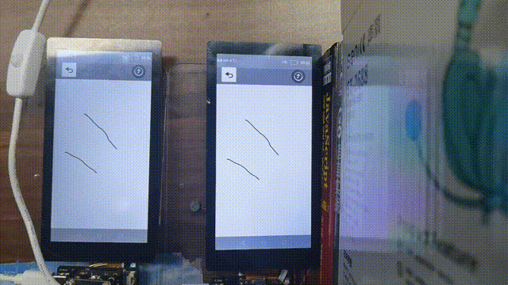
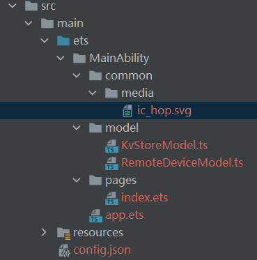

# 1.介绍

本篇Codelab是用基于TS扩展的声明式开发范式开发一个分布式手写板应用。涉及的OS特性有分布式拉起和分布式数据管理，使用这两个特性实现不同设备间拉起与笔迹同步，即每台设备在书写的时候，连接的其他设备都能实时同步笔迹，效果图如下：




> **说明：** 
>本示例涉及使用系统接口，需要手动替换Full SDK才能编译通过，具体操作可参考[替换指南](https://gitee.com/openharmony/docs/blob/master/zh-cn/application-dev/quick-start/full-sdk-switch-guide.md)。


# 2.相关概念

[Canvas组件](https://gitee.com/openharmony/docs/blob/master/zh-cn/application-dev/reference/arkui-ts/ts-components-canvas-canvas.md)

[CanvasRenderingContext2D对象](https://gitee.com/openharmony/docs/blob/master/zh-cn/application-dev/reference/arkui-ts/ts-canvasrenderingcontext2d.md)

[分布式数据库](https://gitee.com/openharmony/docs/blob/master/zh-cn/application-dev/reference/apis/js-apis-distributed-data.md)

[FeatureAbility](https://gitee.com/openharmony/docs/blob/master/zh-cn/application-dev/reference/apis/js-apis-ability-featureAbility.md)

# 3.搭建OpenHarmony环境

完成本篇Codelab我们首先要完成开发环境的搭建，本示例以**Hi3516DV300**开发板为例，参照以下步骤进行：

1.  [获取OpenHarmony系统版本](https://gitee.com/openharmony/docs/blob/master/zh-cn/device-dev/get-code/sourcecode-acquire.md#%E8%8E%B7%E5%8F%96%E6%96%B9%E5%BC%8F3%E4%BB%8E%E9%95%9C%E5%83%8F%E7%AB%99%E7%82%B9%E8%8E%B7%E5%8F%96)：标准系统解决方案（二进制）。

    以3.0版本为例：

    

2.  搭建烧录环境。
   1.  [完成DevEco Device Tool的安装](https://gitee.com/openharmony/docs/blob/master/zh-cn/device-dev/quick-start/quickstart-ide-env-win.md)
   2.  [完成Hi3516开发板的烧录](https://gitee.com/openharmony/docs/blob/master/zh-cn/device-dev/quick-start/quickstart-ide-3516-burn.md)

3.  搭建烧录环境。
   1.  开始前请参考[工具准备](https://gitee.com/openharmony/docs/blob/master/zh-cn/application-dev/quick-start/start-overview.md#%E5%B7%A5%E5%85%B7%E5%87%86%E5%A4%87)，完成DevEco Studio的安装和开发环境配置。
   2.  开发环境配置完成后，请参考[使用工程向导](https://gitee.com/openharmony/docs/blob/master/zh-cn/application-dev/quick-start/start-with-ets-fa.md#%E5%88%9B%E5%BB%BAets%E5%B7%A5%E7%A8%8B)创建工程（模板选择“Empty Ability”），选择JS或者eTS语言开发。
   3.  工程创建完成后，选择使用[真机进行调测](https://gitee.com/openharmony/docs/blob/master/zh-cn/application-dev/quick-start/start-with-ets-fa.md#%E4%BD%BF%E7%94%A8%E7%9C%9F%E6%9C%BA%E8%BF%90%E8%A1%8C%E5%BA%94%E7%94%A8)。

# 4.分布式组网

本章节以系统自带的音乐播放器为例（具体以实际的应用为准），介绍如何完成两台设备的分布式组网。

1. 硬件准备：准备两台烧录相同的版本系统的**Hi3516DV300**开发板A、B。

2.  开发板A、B连接同一个WiFi网络。

    打开设置--\>WLAN--\>点击右侧WiFi开关--\>点击目标WiFi并输入密码。

    

3.  将设备A，B设置为互相信任的设备。

   -   找到系统应用“音乐”。
    

   -   设备A打开音乐，点击左下角流转按钮，弹出列表框，在列表中会展示远端设备的id。

       

   -   选择远端设备B的id，另一台开发板（设备B）会弹出验证的选项框。

       

   -   设备B点击允许，设备B将会弹出随机PIN码，将设备B的PIN码输入到设备A的PIN码填入框中。
    
    

    配网完毕。

# 5.代码结构解读

本篇Codelab只对核心代码进行讲解，对于完整代码，我们会在[参考](https://gitee.com/openharmony/codelabs/tree/master/Distributed/DistributeDatabaseDrawEts)中提供下载方式，整个工程的代码结构如下：



-   common：存放公共资源

    media：存放图片

- model：存放数据模型类

- KvStoreModel.ts：分布式数据存储类

- RemoteDeviceModel.ts：远程设备类

-   pages：存放页面

    index.ets：主页面

- config.json：配置文件

# 6.编写数据类对象

1.  编写分布式数据类对象

    我们需要创建RemoteDeviceModel类来完成远程设备管理的初始化，RemoteDeviceModel .ts代码如下：

    ```
    import deviceManager from '@ohos.distributedHardware.deviceManager';
    var SUBSCRIBE_ID = 100;
    export default class RemoteDeviceModel {
      // 设备列表
      deviceList: any[] = []
      // 回调
      callback: any
      // 设备管理Manager
      #deviceManager: any
      // 构造方法
      constructor() {
      }
      //注册设备回调方法
      registerDeviceListCallback(callback) {
        if (typeof (this.#deviceManager) === 'undefined') {
            let self = this;
            deviceManager.createDeviceManager('com.ohos.distributedRemoteStartFA', (error, value) => {
                if (error) {
                    console.error('createDeviceManager failed.');
                    return;
                }
                self.#deviceManager = value;
                self.registerDeviceListCallback_(callback);
            });
        } else {
            this.registerDeviceListCallback_(callback);
        }
      }
      //注册设备回调方法
      registerDeviceListCallback_(callback) {
        this.callback = callback;
        if (this.#deviceManager == undefined) {
            this.callback();
            return;
        }  
    
        console.info('CookBook[RemoteDeviceModel] getTrustedDeviceListSync begin');
        var list = this.#deviceManager.getTrustedDeviceListSync();
        if (typeof (list) != 'undefined' && typeof (list.length) != 'undefined') {
            this.deviceList = list;
        }
        this.callback(); 
        let self = this;
        this.#deviceManager.on('deviceStateChange', (data) => {
            switch (data.action) {
                case 0:
                self.deviceList[self.deviceList.length] = data.device;
                self.callback();
                if (self.authCallback != null) {
                    self.authCallback();
                    self.authCallback = null;
                }
                break;
                case 2:
                if (self.deviceList.length > 0) {
                    for (var i = 0; i < self.deviceList.length; i++) {
                        if (self.deviceList[i].deviceId === data.device.deviceId) {
                            self.deviceList[i] = data.device;
                            break;
                        }
                    }
                }
                self.callback();
                break;
                case 1:
                  if (self.deviceList.length > 0) {
                      var list = [];
                      for (var i = 0; i < self.deviceList.length; i++) {
                          if (self.deviceList[i].deviceId != data.device.deviceId) {
                              list[i] = data.device;
                          }
                      }
                      self.deviceList = list;
                  }
                  self.callback();
                  break;
                  default:
                      break;
              }
          });
          this.#deviceManager.on('deviceFound', (data) => {
            console.info('CookBook[RemoteDeviceModel] deviceFound data=' + JSON.stringify(data));
            console.info('CookBook[RemoteDeviceModel] deviceFound self.deviceList=' + self.deviceList);
            console.info('CookBook[RemoteDeviceModel] deviceFound self.deviceList.length=' + self.deviceList.length);
            for (var i = 0; i < self.discoverList.length; i++) {
                if (self.discoverList[i].deviceId === data.device.deviceId) {
                    console.info('CookBook[RemoteDeviceModel] device founded, ignored');
                    return;
                }
            }
            self.discoverList[self.discoverList.length] = data.device;
            self.callback();
          });
          this.#deviceManager.on('discoverFail', (data) => {
            console.info('CookBook[RemoteDeviceModel] discoverFail data=' + JSON.stringify(data));
          });
          this.#deviceManager.on('serviceDie', () => {
            console.error('CookBook[RemoteDeviceModel] serviceDie');
          });  
    
          SUBSCRIBE_ID = Math.floor(65536 * Math.random());
          var info = {
            subscribeId: SUBSCRIBE_ID,
            mode: 0xAA,
            medium: 2,
            freq: 2,
            isSameAccount: false,
            isWakeRemote: true,
            capability: 0
          };
          console.info('CookBook[RemoteDeviceModel] startDeviceDiscovery ' + SUBSCRIBE_ID);
          this.#deviceManager.startDeviceDiscovery(info);
      }
      //身份验证
      authDevice(deviceId, callback) {
        console.info('CookBook[RemoteDeviceModel] authDevice ' + deviceId);
        for (var i = 0; i < this.discoverList.length; i++) {
            if (this.discoverList[i].deviceId === deviceId) {
                console.info('CookBook[RemoteDeviceModel] device founded, ignored');
                let extraInfo = {
                    "targetPkgName": 'com.ohos.distributedRemoteStartFA',
                    "appName": 'demo',
                    "appDescription": 'demo application',
                    "business": '0'
                };
                let authParam = {
                    "authType": 1,
                    "appIcon": '',
                    "appThumbnail": '',
                    "extraInfo": extraInfo
                };
                console.info('CookBook[RemoteDeviceModel] authenticateDevice ' + JSON.stringify(this.discoverList[i]));
                let self = this;
                this.#deviceManager.authenticateDevice(this.discoverList[i], authParam, (err, data) => {
                    if (err) {
                        console.info('CookBook[RemoteDeviceModel] authenticateDevice failed, err=' + JSON.stringify(err));
                        self.authCallback = null;
                    } else {
                        console.info('CookBook[RemoteDeviceModel] authenticateDevice succeed, data=' + JSON.stringify(data));
                        self.authCallback = callback;
                    }
                });
            }
        }
      }
      //取消注册设备回调方法
      unregisterDeviceListCallback() {
        console.info('CookBook[RemoteDeviceModel] stopDeviceDiscovery ' + SUBSCRIBE_ID);
        this.#deviceManager.stopDeviceDiscovery(SUBSCRIBE_ID);
        this.#deviceManager.off('deviceStateChange');
        this.#deviceManager.off('deviceFound');
        this.#deviceManager.off('discoverFail');
        this.#deviceManager.off('serviceDie');
        this.deviceList = [];
      }
    }
    ```

2.  编写远程设备类对象

    我们需要创建KvStoreModel类来完成[分布式数据管理](https://gitee.com/openharmony/docs/blob/master/zh-cn/application-dev/reference/apis/js-apis-distributed-data.md)的初始化工作。首先调用distributedData.createKVManager接口创建一个KVManager对象实例，用于管理数据库对象。然后调用KVManager.getKVStore接口创建并获取KVStore数据库。最后对外提供put、setDataChangeListener方法用于数据写入和订阅数据更新通知。KvStoreModel.ts代码如下：

    ```
    import distributedData from '@ohos.data.distributedData';
    
    const STORE_ID = 'DrawBoard_kvstore';
    
    export default class KvStoreModel {
      kvManager: any;
      kvStore: any;
      constructor() {
      }
      createKvStore(callback: any) {
        if (typeof (this.kvStore) === 'undefined') {
          var config = {
            bundleName: 'com.huawei.cookbook',
            userInfo: {
              userId: '0',
              userType: 0
            }
          };
          let self = this;
          console.info('DrawBoard[KvStoreModel] createKVManager begin');
          distributedData.createKVManager(config).then((manager) => {
            console.info('DrawBoard[KvStoreModel] createKVManager success, kvManager=' + JSON.stringify(manager));
            self.kvManager = manager;
            let options = {
              createIfMissing: true,
              encrypt: false,
              backup: false,
              autoSync: true,
              kvStoreType: 0,
              schema: '',
              securityLevel: 1,
            };
            console.info('DrawBoard[KvStoreModel] kvManager.getKVStore begin');
            self.kvManager.getKVStore(STORE_ID, options).then((store) => {
              console.info('DrawBoard[KvStoreModel] getKVStore success, kvStore=' + store);
              self.kvStore = store;
              try {
                self.kvStore.enableSync(true).then((err) => {
                  console.log('enableSync success');
                }).catch((err) => {
                  console.log('enableSync fail ' + JSON.stringify(err));
                });
              }catch(e) {
                console.log('EnableSync e ' + e);
              }
              callback();
            });
            console.info('DrawBoard[KvStoreModel] kvManager.getKVStore end');
          });
          console.info('DrawBoard[KvStoreModel] createKVManager end');
        } else {
          console.info('DrawBoard[KvStoreModel] KVManager is exist');
          callback();
        }
      }
    
      broadcastMessage(msg: any) {
        console.info('DrawBoard[KvStoreModel] broadcastMessage ' + msg);
        var num = Math.random();
        let self = this;
        this.createKvStore(() => {
          self.put(msg, num);
        });
      }
    
      put(key: any, value: any) {
        if (typeof (this.kvStore) === 'undefined') {
          return;
        }
        console.info('DrawBoard[KvStoreModel] kvStore.put ' + key + '=' + value);
        this.kvStore.put(key, value).then((data: any) => {
          this.kvStore.get(key).then((data:any) => {
            console.info('DrawBoard[KvStoreModel] kvStore.get ' + key + '=' + JSON.stringify(data));
          });
          console.info('DrawBoard[KvStoreModel] kvStore.put ' + key + ' finished, data=' + JSON.stringify(data));
        }).catch((err: JSON) => {
          console.error('DrawBoard[KvStoreModel] kvStore.put ' + key + ' failed, ' + JSON.stringify(err));
        });
      }
    
      get(key: any,callback: any) {
        this.createKvStore(() => {
          this.kvStore.get(key, function (err: any ,data: any) {
            console.log("get success data: " + data);
            callback(data);
          });
        })
      }
    
      setOnMessageReceivedListener(callback: any) {
        console.info('DrawBoard[KvStoreModel] setOnMessageReceivedListener ');
        let self = this;
        this.createKvStore(() => {
          console.info('DrawBoard[KvStoreModel] kvStore.on(dataChange) begin');
          self.kvStore.on('dataChange', 2, (data: any) => {
            console.info('DrawBoard[KvStoreModel] dataChange, ' + JSON.stringify(data));
            console.info('DrawBoard[KvStoreModel] dataChange, insert ' + data.insertEntries.length + ' udpate '
            + data.updateEntries.length);
            if (data.insertEntries.length < 1 && data.updateEntries.length < 1) {
              return;
            }
    
            callback(data);
          });
          console.info('DrawBoard[KvStoreModel] kvStore.on(dataChange) end');
        });
      }
      setDataChangeListener(callback) {
        console.info('DrawBoard[KvStoreModel] setDataChangeListener come in');
        let self = this;
        this.createKvStore(() => {
          console.info('DrawBoard[KvStoreModel] setDataChangeListener createKvStore');
          self.kvStore.on('dataChange',2, (data: any) => {
            console.info('DrawBoard[KvStoreModel] setDataChangeListener kvStore.on');
            if (data.updateEntries.length > 0) {
              console.info('DrawBoard[KvStoreModel] setDataChangeListener callback');
              callback(data);
            }
          });
        });
      }
    }
    ```

# 7.页面设计

分布式手写板页面主要由全屏Path绘制区、顶部操作栏组成。为了实现弹框选择设备的效果，在最外层添加了自定义弹框组件。Path组件设置为全屏显示，根据手指触摸的屏幕坐标直接通过Path绘制轨迹；顶部操作栏加入撤回图标、设备选择图标；自定义弹框加入标题、设备列表。页面样式请在具体代码中查看，页面布局在index.ets中实现。

在index.ets中按照如下步骤编写：

1.  页面整体布局

    ```
    @Entry
    @Component
    struct Index {
      build() {
        Column({ space: 1 }) {
          // 用于标题栏布局
          Row() {
          }.backgroundColor(Color.Grey).width('100%').height('10%')
          // 用于Path绘制区布局
          Row() {
          }.width('100%').height('90%')
        }.height('100%').width('100%')
      }
    ```

2.  标题栏布局

    ```
    @Entry
    @Component
    struct Index {
      build() {
        Column({ space: 1 }) {
          Row() {
            Image($r('app.media.goback')).width(100).height(100).margin({left:10})
            Blank()
            Image($r('app.media.ic_hop')).width(100).height(100).margin({right:10})
          }.backgroundColor(Color.Grey).width('100%').height('10%')
          ...
        }.height('100%').width('100%')
      }
    }
    ```

3.  Canvas绘制区布局

    ```
    @Entry
    @Component
    struct Index {
      build() {
        Column({ space: 1 }) {
          Row() {
            ...
          }.backgroundColor(Color.Grey).width('100%').height('10%')
          Row() {
             Canvas(this.context)
    	   .width('100%')
    	   .height('100%')
    	   .backgroundColor('#FFFFFF')
          }.width('100%').height('90%')
        }.height('100%').width('100%')
      }
    ```

4.  自定义弹框设计并引入到主页面中
   1.  自定义弹框设计

       ```
       @CustomDialog
       struct CustomDialogExample {
         controller: CustomDialogController
         cancel: () => void
         confirm: (deviceId, deviceName) => void
         startAbility: (deviceId, deviceName, positionList) => void
         deviceList:() => void
         positionList:() => void
         private selectedIndex: number = 0
         build() {
           Column() {
             Text('选择设备')
               .fontSize(20)
               .width('100%')
               .textAlign(TextAlign.Center)
               .fontColor(Color.Black)
               .fontWeight(FontWeight.Bold)
             List() {
               ForEach(this.deviceList, (item, index) => {
                 ListItem() {
                   Row() {
                     Text(item.name)
                       .fontSize(20)
                       .width('90%')
                       .fontColor(Color.Black)
                     if (this.deviceList.indexOf(item) == this.selectedIndex) {
                       Image($r('app.media.checked'))
                         .width('8%')
                         .objectFit(ImageFit.Contain)
                     } else {
                       Image($r('app.media.uncheck'))
                         .width('8%')
                         .objectFit(ImageFit.Contain)
                     }
                   }
                   .height(55)
                   .onClick(() =>{
                     this.selectedIndex = index
                     this.controller.close();
                     this.startAbility(item.id, item.name, this.positionList)
                   })
                 }
               }, item => item.id)
             }
       
             Button() {
               Text('取消')
                 .fontColor('#0D9FFB')
                 .width('90%')
                 .textAlign(TextAlign.Center)
                 .fontSize(20)
             }
             .type(ButtonType.Capsule)
             .backgroundColor(Color.White)
             .onClick(() => {
               this.controller.close()
             })
           }
           .backgroundColor(Color.White)
           .border({ color: Color.White, radius: 20 })
           .padding(10)
         }
       }
       ```

   2.  引入到主页面

       ```
       @Entry
       @Component
       struct Index {
         ...
         dialogController: CustomDialogController = new CustomDialogController({
           builder: CustomDialogExample({ cancel: this.onCancel, confirm: this.onAccept, deviceList: this.deviceList,positionList: this.positionList,startAbility: this.startAbilityContinuation }),
           cancel: this.existApp,
           autoCancel: true,
           deviceList: this.deviceList,
           positionList: this.positionList
         })
         onCancel() {
           console.info('Callback when the first button is clicked')
         }
         onAccept() {
           console.info('Click when confirm')
         }
         existApp() {
           console.info('Click the callback in the blank area')
         }
         build() {
          ...
         }
       }
       ```

5.  为页面设置原始数据
   1.  在index.ets文件的顶部设置常量数据

       ```
       // 默认设备
       var DEVICE_LIST_LOCALHOST = { name: '本机', id: 'localhost' };
       // 用于存放点位信息的key值常量
       const CHANGE_POSITION = 'change_position';
       ```

   2.  在Index组件（Component）中设置基本参数

       ```
       @Entry
       @Component
       struct Index {
         // 触控起始位置X轴坐标
         @State startX: number = 0
         // 触控起始位置Y轴坐标
         @State startY: number = 0
         // 触控移动后的位置X轴坐标
         @State moveX: number = 0
         // 触控移动后的位置Y轴坐标
         @State moveY: number = 0
         // 触控结束后的位置X轴坐标
         @State endX: number = 0
         // 触控结束后的位置Y轴坐标
         @State endY: number = 0
         // 设备列表
         @State deviceList: any[] = []
         // BUNDLE_NAME
         private BUNDLE_NAME: string = "com.huawei.cookbook";
         // 分布式数据库类对象
         private kvStoreModel: KvStoreModel = new KvStoreModel()
         // 远程设备类对象
         private remoteDeviceModel: RemoteDeviceModel = new RemoteDeviceModel()
         // 点位集合
         @State positionList: any[] = []
         // 初始化数据
         @State initialData: any[] = [] 
         // 画布组件
         private settings: RenderingContextSettings = new RenderingContextSettings(true)
         // CanvasRenderingContext2D对象
         private context: CanvasRenderingContext2D = new CanvasRenderingContext2D(this.settings)
         ...
         build() {
         ...
         }
       }
       ```

# 8.设备拉起

点击操作栏“分享图标”，弹出设备选择列表，选中设备后拉起该设备的手写板页面。这里使用[分布式拉起](https://gitee.com/openharmony/docs/blob/master/zh-cn/application-dev/reference/apis/js-apis-featureAbility.md)实现设备拉起功能，首先调用FeatureAbility.getDeviceList接口获取设备信息列表，然后调用FeatureAbility.startAbility接口拉起目标设备的FA。此功能在index.js中实现。


1.  config.json中添加分布式权限

    ```
    {
    	...
      "module": {
        ...
        "reqPermissions": [{
          "name": "ohos.permission.DISTRIBUTED_DATASYNC"
        }]
      }
    }
    ```

2.  初始化方法中添加动态权限申请代码

    ```
    async aboutToAppear() {
        this.grantPermission()
        ...
    }
    grantPermission() {
      console.log('MusicPlayer[IndexPage] grantPermission')
      let context = featureAbility.getContext()
      context.requestPermissionsFromUser(['ohos.permission.DISTRIBUTED_DATASYNC'], 666, function (result) {
        console.log(`MusicPlayer[IndexPage] grantPermission,requestPermissionsFromUser,result.requestCode=${result.requestCode}`)
      })
    }
    
    ```

3.  分享图标添加点击事件

    ```
    Image($r('app.media.ic_hop')).width(100).height(100).margin({right:10})
      .onClick(() =>{
    	this.onContinueAbilityClick()
      })
    ```

4.  分布式拉起方法实现

    ```
    onContinueAbilityClick() {
        console.info('DrawBoard[IndexPage] onContinueAbilityClick');
        let self = this;
        this.remoteDeviceModel.registerDeviceListCallback(() => {
            console.info('DrawBoard[IndexPage] registerDeviceListCallback, callback entered');
            var list = [];
            list[0] = DEVICE_LIST_LOCALHOST
            var deviceList = self.remoteDeviceModel.deviceList;
            console.info('DrawBoard[IndexPage] on remote device updated, count=' + deviceList.length);
            for (var i = 0; i < deviceList.length; i++) {
                console.info('DrawBoard[IndexPage] device ' + i + '/' + deviceList.length + ' deviceId='
                + deviceList[i].deviceId + ' deviceName=' + deviceList[i].deviceName + ' deviceType='
                + deviceList[i].deviceType);
                list[i + 1] = {
                    name: deviceList[i].deviceName,
                    id: deviceList[i].deviceId,
                };
            }
            self.deviceList = list;
            self.dialogController.open()
        });
    }
    ```

# 9.笔记绘制

Path组件所在的Flex容器组件添加点击事件，并实现记录触控点位信息，绘制轨迹的功能。

1.  添加点击事件

    ```
    Row() {
    	Canvas(this.context)
    	  .width('100%')
    	  .height('100%')
    	  .backgroundColor('#FFFFFF')
    	}.onTouch((event: TouchEvent) => {
    	this.onTouchEvent(event)
    }).width('100%').height('90%')
    ```

2.  现记录触控点位信息的方法

    ```
    onTouchEvent(event: TouchEvent) {
        let position = {};
        switch(event.type){
          case TouchType.Down:
            this.startX = event.touches[0].x
            this.startY = event.touches[0].y
            position.isFirstPosition = true;
            position.positionX = this.startX;
            position.positionY = this.startY;
            position.isEndPosition = false
            this.context.beginPath()
            this.context.lineWidth = 4
            this.context.lineJoin = 'miter'
            this.context.moveTo(this.startX, this.startY)
            this.pushData(position);
            break;
          case TouchType.Move:
            this.moveX = event.touches[0].x
            this.moveY = event.touches[0].y
            position.isFirstPosition = false;
            position.positionX = this.moveX;
            position.positionY = this.moveY;
            position.isEndPosition = false
            this.context.lineTo(this.moveX, this.moveY)
            this.pushData(position);
            break;
          case TouchType.Up:
            this.endX = event.touches[0].x
            this.endY = event.touches[0].y
            position.isFirstPosition = false;
            position.positionX = this.endX;
            position.positionY = this.endY;
            position.isEndPosition = true
            this.context.stroke()
            this.pushData(position);
            break;
          default:
            break;
        }
     }
    ```

# 10.笔记撤回

笔迹绘制时已经记录了所有笔迹上的坐标点，点击“撤回”按钮后，对记录的坐标点进行倒序删除，当删除最后一笔绘制的起始点坐标后停止删除，然后清空画布对剩余的坐标点进行重新绘制，至此撤回操作完成。此功能在index.ets中实现，代码如下：

1.  添加撤回事件

    ```
    Image($r('app.media.goback')).width(100).height(100).margin({left:10})
      .onClick(() =>{
    	this.goBack()
    })
    ```

2.  编写撤回事件

    ```
    // 撤回上一笔绘制
    goBack() {
      if (this.positionList.length > 0) {
        for (let i = this.positionList.length - 1; i > -1; i--) {
          if (this.positionList[i].isFirstPosition) {
            this.positionList.pop();
            this.redraw();
            break;
          } else {
            this.positionList.pop();
          }
        }
        // 保存点位信息
        this.kvStoreModel.put(CHANGE_POSITION, JSON.stringify(this.positionList));
      }
    }
    ```

# 11.轨迹同步

在设备拉起、笔迹绘制、笔迹撤回时我们需要将对应数据同步到其他设备。


1.  设备拉起时，通过positionList将笔迹数据发送给目标设备，目标设备在aboutToAppear时将接收到的笔迹数据用Canvas绘制出来，从而实现笔迹的同步。此功能在index.ets中实现，关键代码如下：

    发送端

    ```
    startAbilityContinuation(deviceId: string, deviceName: string,positionList: any[] ) {
        // 参数
        var params = {
          // 点位集合
          positionList: JSON.stringify(positionList)
        }
        // 拉起的设备、ability信息等
        var wantValue = {
            bundleName: 'com.huawei.cookbook',
            abilityName: 'com.huawei.distributedatabasedrawetsopenh.MainAbility',
            deviceId: deviceId,
            parameters: params
        };
        // 分布式拉起
        featureAbility.startAbility({
            want: wantValue
        }).then((data) => {
            console.info('DrawBoard[IndexPage] featureAbility.startAbility finished, ' + JSON.stringify(data));
        });
    }
    ```

    接收端

    ```
    //函数在创建自定义组件的新实例后，在执行其build函数之前执行
    async aboutToAppear() {
        // 申请分布式权限
        this.grantPermission()
        console.log('DrawBoard[IndexPage] aboutToAppear begin');
        this.initialData = []
        let self = this
        //获取初被拉起时候传来的点位信息
        await featureAbility.getWant()
          .then((Want) => {
            self.positionList = JSON.parse(Want.parameters.positionList)
            console.log('Operation successful. self.positionList: ' + JSON.stringify(self.positionList.length));
          }).catch((error) => {
            console.error('Operation failed. Cause: ' + JSON.stringify(error));
          })
        console.log('DrawBoard[IndexPage] aboutToAppear positionList length=' + self.positionList.length);
        if (self.positionList.length > 0) {
          self.positionList.forEach((num) => {
            self.initialData.push(num);
          });
          console.log('DrawBoard[IndexPage] aboutToAppear initialData='+JSON.stringify(self.initialData))
          // 根军传来的点位信息初始化画布中的手写笔画路径
          self.initDraw();
        }
        console.log('DrawBoard[IndexPage] setDataChangeListener out setDataChangeListener')
        // 监听分布式数据库中数据变化，并根据数据变化重新绘制路径
        self.kvStoreModel.setDataChangeListener((data) => {
          console.log('DrawBoard[IndexPage] setDataChangeListener come in')
          self.positionList = [];
          data.updateEntries.forEach((num) => {
            const list = JSON.parse(num.value.value);
            console.log('DrawBoard[IndexPage] setDataChangeListener list=' + JSON.stringify(list))
            if(list.length === 0) {
              console.log('DrawBoard[IndexPage] setDataChangeListener list.length === 0')
            } else{
              list.forEach((num) => {
                self.positionList.push(num);
              })
              console.log('DrawBoard[IndexPage] setDataChangeListener positionList=' + JSON.stringify(self.positionList))
            }
            self.redraw();
          });
        });
    }
    ...
    // 初始化画板轨迹
    initDraw() {
        this.initialData.forEach((point)=>{
          if(point.isFirstPosition) {
            this.context.beginPath()
            this.context.lineWidth = 4
            this.context.lineJoin = 'miter'
            this.context.moveTo(point.positionX, point.positionY)
          } else{
            this.context.lineTo(point.positionX, point.positionY)
            if(point.isEndPosition) {
              this.context.stroke()
              console.log('DrawBoard[IndexPage] initDraw context.stroke')
            }
          }
        })
    }
    ```

2.  笔迹绘制时，为了避免分布式数据库写入过于频繁，我们设置为每画完一笔，将点位数据提交到数据库。其他设备通过订阅分布式数据更新通知来获取最新的笔迹数据，然后重新绘制笔迹，从而实现笔迹同步。此功能在index.js中实现，关键代码如下：

    发送端

    ```
    // 将绘制笔迹写入分布式数据库
    pushData(position: any) {
        this.positionList.push(position);
        console.log('DrawBoard[IndexPage] pushData positionList 1 =' + JSON.stringify(this.positionList.length));
        // 如果为最后手指离开屏幕的点，则写入数据库
        if(position.isEndPosition){
          this.kvStoreModel.put(CHANGE_POSITION, JSON.stringify(this.positionList));
          console.log('DrawBoard[IndexPage] pushData positionList 2 =' + JSON.stringify(this.positionList.length));
        }
    }
    ```

    接收端：

    ```
    onInit() {
      ...
      // 订阅分布式数据更新通知
      this.kvStoreModel.setDataChangeListener((data) => {
         console.log('DrawBoard[IndexPage] setDataChangeListener come in')
          self.positionList = [];
          data.updateEntries.forEach((num) => {
            const list = JSON.parse(num.value.value);
            console.log('DrawBoard[IndexPage] setDataChangeListener list=' + JSON.stringify(list))
            if(list.length === 0) {
              console.log('DrawBoard[IndexPage] setDataChangeListener list.length === 0')
            } else{
              list.forEach((num) => {
                self.positionList.push(num);
              })
              console.log('DrawBoard[IndexPage] setDataChangeListener positionList=' + JSON.stringify(self.positionList))
            }
            self.redraw();
          });
      });
    },
    // 重新绘制笔迹
    redraw() {
        console.log('DrawBoard[IndexPage] redraw positionList= ' + JSON.stringify(this.positionList))
        this.context.clearRect(0,0, this.context.width,this.context.height)
        if (this.positionList.length > 0 ) {
          this.positionList.forEach((num) => {
            console.log('DrawBoard[IndexPage] redraw num=')
            console.log('DrawBoard[IndexPage] redraw out isFirstPosition=' + num.isFirstPosition)
            if (num.isFirstPosition) {
              console.log('DrawBoard[IndexPage] redraw isFirstPosition=' + num.isFirstPosition)
              this.context.beginPath()
              this.context.lineWidth = 4
              this.context.lineJoin = 'miter'
              this.context.moveTo(num.positionX, num.positionY)
              console.log('DrawBoard[IndexPage] redraw context.moveTo' + num.positionX+','+ num.positionY)
            } else {
              this.context.lineTo(num.positionX, num.positionY)
              console.log('DrawBoard[IndexPage] redraw context.lineTo' + num.positionX+','+ num.positionY)
              if(num.isEndPosition) {
                this.context.stroke()
                console.log('DrawBoard[IndexPage] redraw context.stroke')
              }
            }
          });
        }
      }
    ```

3. 笔迹撤回时，直接将撤回后的笔迹数据写入分布式数据库，其他设备也是通过订阅分布式数据更新通知来获取最新的笔迹数据，最终实现笔迹同步，这里不再做讲解。

# 12.恭喜您

通过本教程的学习，您已经学会使用基于TS扩展的声明式开发范式中的分布式数据管理和分布式拉起以及利用Canvas组件绘制图形。
