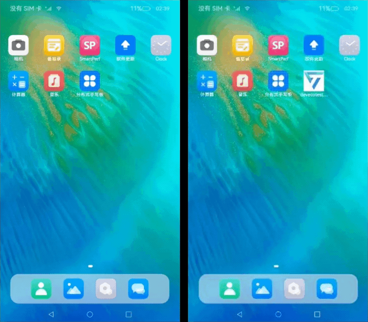
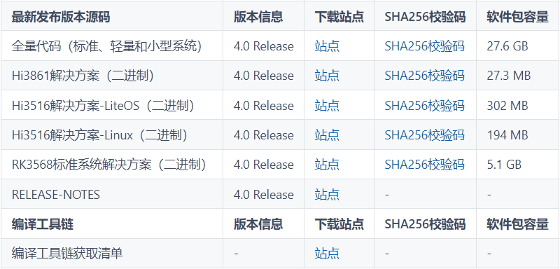

# 分布式手写板（ArkTS）

## 介绍

本篇Codelab使用设备管理及分布式键值数据库能力，实现多设备之间手写板应用拉起及同步书写内容的功能。操作流程：

1. 设备连接同一无线网络，安装分布式手写板应用。进入应用，点击允许使用多设备协同，点击主页上查询设备按钮，显示附近设备。
2. 选择设备确认，若已建立连接，启动对方设备上的手写板应用，否则提示建立连接。输入PIN码建立连接后再次点击查询设备按钮，选择设备提交，启动对方设备应用。
3. 建立连接前绘制的内容在启动对方设备后同步，此时设备上绘制的内容会在另一端同步绘制。
4. 点击撤销按钮，两侧设备绘制内容同步撤销。



### 相关概念

- [设备管理](https://gitcode.com/openharmony/docs/blob/master/zh-cn/application-dev/reference/apis/js-apis-device-manager.md)：模块提供分布式设备管理能力。
- [分布式键值数据库](https://gitcode.com/openharmony/docs/blob/master/zh-cn/application-dev/reference/apis/js-apis-distributedKVStore.md)：分布式键值数据库为应用程序提供不同设备间数据库的分布式协同能力。

### 相关权限

本篇Codelab使用了设备管理及分布式键值数据库能力，需要手动替换full-SDK，并在配置文件module.json5文件requestPermissions属性中添加如下权限：

- [分布式设备认证组网权限](https://gitcode.com/openharmony/docs/blob/master/zh-cn/application-dev/security/permission-list.md#ohospermissionaccess_service_dm)：ohos.permission.ACCESS\_SERVICE\_DM。
- [设备间的数据交换权限](https://gitcode.com/openharmony/docs/blob/master/zh-cn/application-dev/security/permission-list.md#ohospermissiondistributed_datasync)：ohos.permission.DISTRIBUTED\_DATASYNC。

### 约束与限制

1. 本篇Codelab部分能力依赖于系统API，需下载full-SDK并替换DevEco Studio自动下载的public-SDK。具体操作可参考指南[《如何替换full-SDK》](https://gitcode.com/openharmony/docs/blob/master/zh-cn/application-dev/faqs/full-sdk-switch-guide.md)。
2. 本篇Codelab使用的部分API仅系统应用可用，需要提升应用等级。具体可参考指南[《访问控制授权申请指导》](https://gitcode.com/openharmony/docs/blob/master/zh-cn/application-dev/security/accesstoken-overview.md#%E5%BA%94%E7%94%A8apl%E7%AD%89%E7%BA%A7%E8%AF%B4%E6%98%8E)。

## 环境搭建

### 软件要求

- [DevEco Studio](https://gitcode.com/openharmony/docs/blob/master/zh-cn/application-dev/quick-start/start-overview.md#%E5%B7%A5%E5%85%B7%E5%87%86%E5%A4%87)版本：DevEco Studio 4.0 Beta2。
- OpenHarmony SDK版本：API version 10。

### 硬件要求

- 开发板类型：[润和RK3568开发板](https://gitcode.com/openharmony/docs/blob/master/zh-cn/device-dev/quick-start/quickstart-appendix-rk3568.md)。
- OpenHarmony系统：4.0 Release。

### 环境搭建

完成本篇Codelab我们首先要完成开发环境的搭建，本示例以**RK3568**开发板为例，参照以下步骤进行：

1. [获取OpenHarmony系统版本](https://gitcode.com/openharmony/docs/blob/master/zh-cn/device-dev/get-code/sourcecode-acquire.md#%E8%8E%B7%E5%8F%96%E6%96%B9%E5%BC%8F3%E4%BB%8E%E9%95%9C%E5%83%8F%E7%AB%99%E7%82%B9%E8%8E%B7%E5%8F%96)：标准系统解决方案（二进制）。以4.0 Release版本为例：

    

2. 搭建烧录环境。
    1. [完成DevEco Device Tool的安装](https://gitcode.com/openharmony/docs/blob/master/zh-cn/device-dev/quick-start/quickstart-ide-env-win.md)
    2. [完成RK3568开发板的烧录](https://gitcode.com/openharmony/docs/blob/master/zh-cn/device-dev/quick-start/quickstart-ide-3568-burn.md)

3. 搭建开发环境。
    1. 开始前请参考[工具准备](https://gitcode.com/openharmony/docs/blob/master/zh-cn/application-dev/quick-start/start-overview.md#%E5%B7%A5%E5%85%B7%E5%87%86%E5%A4%87)，完成DevEco Studio的安装和开发环境配置。
    2. 开发环境配置完成后，请参考[使用工程向导](https://gitcode.com/openharmony/docs/blob/master/zh-cn/application-dev/quick-start/start-with-ets-stage.md#创建arkts工程)创建工程（模板选择“Empty Ability”）。
    3. 工程创建完成后，选择使用[真机进行调测](https://gitcode.com/openharmony/docs/blob/master/zh-cn/application-dev/quick-start/start-with-ets-stage.md#使用真机运行应用)。

## 代码结构解读

本篇Codelab只对核心代码进行讲解，对于完整代码，我们会在gitee中提供。

```
├──entry/src/main/ets                 // 代码区
│  ├──common
│  │  ├──constants
│  │  │  └──CommonConstants.ets       // 公共常量类
│  │  └──utils
│  │     ├──Logger.ets                // 日志打印类
│  │     └──RemoteDeviceUtil.ets      // 设备管理类
│  ├──entryability
│  │  └──EntryAbility.ets             // 程序入口类
│  ├──pages
│  │  └──Index.ets                    // 主界面
│  ├──view
│  │  └──CustomDialogComponent.ets    // 自定义弹窗组件类
│  └──viewmodel
│     ├──KvStoreModel.ets             // 分布式键值数据库管理类
│     └──Position.ets                 // 绘制位置信息类
└──entry/src/main/resources           // 资源文件目录
```

## 界面设计

主界面由导航栏及绘制区域组成，导航栏包含撤回按钮及查询设备按钮。绘制区域使用Canvas画布组件展示绘制效果。Index.ets文件完成界面实现，使用Column及Row容器组件进行布局。


``` typescript
// Index.ets
let storage = LocalStorage.getShared();
@Entry(storage)
@Component
struct Index {
  ...
  build() {
    Column() {
      Row() {
        // 撤回按钮
        Image($r('app.media.ic_back'))
          .width($r('app.float.ic_back_width'))
          .height($r('app.float.ic_back_height'))
          ...
        Blank()
        // 查找设备按钮
        Image($r('app.media.ic_hop'))
          .width($r('app.float.ic_hop_width'))
          .height($r('app.float.ic_hop_height'))
          ...
      }
      .width(CommonConstants.FULL_PERCENT)
      .height(CommonConstants.TITLE_HEIGHT)

      Row() {
        // 绘制区域
        Canvas(this.canvasContext)
          .width(CommonConstants.FULL_PERCENT)
          .height(CommonConstants.FULL_PERCENT)
          ...
      }
      ...
      .width(CommonConstants.FULL_PERCENT)
      .layoutWeight(CommonConstants.NUMBER_ONE)
    }
    .height(CommonConstants.FULL_PERCENT)
    .width(CommonConstants.FULL_PERCENT)
  }
  ...
}
```

## 分布式组网

### 准备分布式环境

创建设备管理器。设备管理器创建完成后注册设备上线离线监听，信任设备上线离线时触发。执行获取本地设备信息，获取信任设备列表，初始化展示设备列表等方法。其中deviceManager类需使用full-SDK。

``` typescript
// RemoteDeviceUtil.ets
import deviceManager from '@ohos.distributedHardware.deviceManager';

class RemoteDeviceUtil {
  ...
  async createDeviceManager() {
    ...
    await new Promise((resolve: (value: Object | PromiseLike<Object>) => void, reject: ((reason?: RejectError) => void)) => {
      try {
        // 创建设备管理器
        deviceManager.createDeviceManager(CommonConstants.BUNDLE_NAME,
          (error, value: deviceManager.DeviceManager) => {
            ...
            this.myDeviceManager = value;
            // 注册信任设备上线离线监听
            this.registerDeviceStateListener();
            // 获取本地设备信息
            this.getLocalDeviceInfo();
            // 获取信任设备列表
            this.getTrustedDeviceList();
            // 初始化展示设备列表
            this.initDeviceList();
            resolve(value);
        });
      } catch (error) {
        Logger.error('RemoteDeviceModel',
          `createDeviceManager failed, error=${JSON.stringify(error)}`);
      }
    });
  }
  ...
}
```

注册设备状态监听。已验证设备上线或有新设备验证通过时状态类型为ONLINE，将设备添加至信任设备列表。设备离线时状态类型为OFFLINE，将设备从信任列表中移除。

``` typescript
// RemoteDeviceUtil.ets
class RemoteDeviceUtil {
  ...
  // 注册设备状态改变监听
  registerDeviceStateListener(): void {
    ...
    try {
      // 注册监听
      this.myDeviceManager.on('deviceStateChange', (data) => {
        ...
        switch (data.action) {
          // 设备上线
          case deviceManager.DeviceStateChangeAction.ONLINE: {
            this.deviceStateChangeActionOnline(data.device);
            break;
          }
          // 设备离线
          case deviceManager.DeviceStateChangeAction.OFFLINE: {
            this.deviceStateChangeActionOffline(data.device);
            break;
          }
          ...
        }
      });
    } catch (error) {
      Logger.error('RemoteDeviceModel',
        `registerDeviceStateListener on('deviceStateChange') failed, error=${JSON.stringify(error)}`);
    }
  }

  // 设备上线，加入信任列表及展示列表
  deviceStateChangeActionOnline(device: deviceManager.DeviceInfo): void {
    this.trustedDeviceList[this.trustedDeviceList.length] = device;
    this.addToDeviceList(device);
  }

  // 设备下线，将设备移出信任列表和展示列表
  deviceStateChangeActionOffline(device: deviceManager.DeviceInfo): void {
    let list: deviceManager.DeviceInfo[] = [];
    for (let i: number = 0; i < this.trustedDeviceList.length; i++) {
      if (this.trustedDeviceList[i].networkId !== device.networkId) {
        list.push(this.trustedDeviceList[i]);
        continue;
      }
    }
    this.deleteFromDeviceList(device);
    this.trustedDeviceList = list;
  }
  ...
}
```

### 建立分布式连接

点击主界面的查询设备按钮，执行发现设备方法，注册设备发现监听任务，同时拉起弹窗展示设备列表。当弹窗关闭时，执行停止发现设备方法，注销监听任务。


``` typescript
// RemoteDeviceUtil.ets
class RemoteDeviceUtil {
  ...
  // 处理新发现的设备
  deviceFound(data: DeviceInfoInterface): void {
    for (let i: number = 0; i < this.discoverList.length; i++) {
      if (this.discoverList[i].deviceId === data.device.deviceId) {
        Logger.info('RemoteDeviceModel', `deviceFound device exist=${JSON.stringify(data)}`);
        return;
      }
    }
    this.discoverList[this.discoverList.length] = data.device;
    this.addToDeviceList(data.device);
  }

  startDeviceDiscovery(): void {
    ...
    try {
      // 注册发现设备监听
      this.myDeviceManager.on('deviceFound', (data) => {
        ...
        // 处理发现的设备
        this.deviceFound(data);
      });
      ...
      let info: deviceManager.SubscribeInfo = {
        subscribeId: this.subscribeId,
        mode: CommonConstants.SUBSCRIBE_MODE,
        medium: CommonConstants.SUBSCRIBE_MEDIUM,
        freq: CommonConstants.SUBSCRIBE_FREQ,
        isSameAccount: false,
        isWakeRemote: true,
        capability: CommonConstants.SUBSCRIBE_CAPABILITY
      };
      // 发现周边设备
      this.myDeviceManager.startDeviceDiscovery(info);
    } catch (error) {
      Logger.error('RemoteDeviceModel',
        `startDeviceDiscovery failed error=${JSON.stringify(error)}`);
    }
  }

  // 停止发现设备
  stopDeviceDiscovery(): void {
    ...
    try {
      // 停止发现设备
      this.myDeviceManager.stopDeviceDiscovery(this.subscribeId);
      // 注销监听任务
      this.myDeviceManager.off('deviceFound');
      this.myDeviceManager.off('discoverFail');
    } catch (error) {
      Logger.error('RemoteDeviceModel',
        `stopDeviceDiscovery failed error=${JSON.stringify(error)}`);
    }
  }
  ...
}

```

选择弹窗内的设备项提交后，执行设备验证。

1. 若设备在信任设备列表，执行startAbility\(\)方法启动连接设备上的应用，将当前的绘制信息作为参数发送至连接设备。
2. 若设备不是信任设备，执行authenticateDevice()方法启动验证。此时连接设备提示是否接受，接收连接后连接设备展示PIN码，本地设备输入PIN码确认后连接成功。再次点击查询设备按钮，选择已连接设备，点击确认启动连接设备上的应用。

``` typescript
// RemoteDeviceUtil.ets
class RemoteDeviceUtil {
  ...
  // 设备验证
  authenticateDevice(
    context: common.UIAbilityContext,
    device: deviceManager.DeviceInfo,
    positionList: Position[]
  ): void {
    // 设备为信任设备，启动连接设备上的应用
    let tmpList = this.trustedDeviceList.filter((item: deviceManager.DeviceInfo) => device.deviceId === item.deviceId);
    if (tmpList.length > 0) {
      this.startAbility(context, device, positionList);
      return;
    }
    ...
    try {
      // 执行设备认证，启动验证相关弹窗，接受信任，显示PIN码，输入PIN码等
      this.myDeviceManager.authenticateDevice(device, authParam, (err) => {
        ...
      })
    } catch (error) {
      Logger.error('RemoteDeviceModel',
        `authenticateDevice failed error=${JSON.stringify(error)}`);
    }
  }

  // 启动连接设备上的应用
  startAbility(context: common.UIAbilityContext, device: deviceManager.DeviceInfo, positionList: Position[]): void {
    ...
    // 启动连接设备上的应用
    context.startAbility(wantValue).then(() => {
      Logger.info('RemoteDeviceModel', `startAbility finished wantValue=${JSON.stringify(wantValue)}`);
    }).catch((error: Error) => {
      Logger.error('RemoteDeviceModel', `startAbility failed, error=${JSON.stringify(error)}`);
    })
  }
  ...
}
```

### 资源释放

程序关闭时，注销设备状态监听任务，并释放DeviceManager实例。

``` typescript
// RemoteDeviceUtil.ets
class RemoteDeviceUtil {
  ...
  // 注销监听任务
  unregisterDeviceListCallback(): void {
    ...
    try {
      // 注销设备状态监听
      this.myDeviceManager.off('deviceStateChange');
      // 释放DeviceManager实例
      this.myDeviceManager.release();
    } catch (err) {
      Logger.error('RemoteDeviceModel',
        `unregisterDeviceListCallback stopDeviceDiscovery failed, error=${JSON.stringify(err)}`);
    }
  }
  ...
}
```

## 绘制功能

Canvas组件区域监听触摸事件，按照按下、移动、抬起等触摸事件，记录绘制的起点、中间点以及终点。触摸事件触发时，使用CanvasRenderingContext2D对象的绘制方法根据位置信息进行绘制。绘制结束后，将当前位置信息列表存入分布式键值数据库。

``` typescript
// Index.ets
let storage = LocalStorage.getShared();
@Entry(storage)
@Component
struct Index {
  ...  
  build() {
    Column() {
      ...
      Row() {
        Canvas(this.canvasContext)
          ...
      }
      .onTouch((event: TouchEvent) => {
        this.onTouchEvent(event);
      })
      ...
    }
    ...
  }

  // 绘制事件
  onTouchEvent(event: TouchEvent): void {
    let positionX: number = event.touches[0].x;
    let positionY: number = event.touches[0].y;
    switch (event.type) {
      // 手指按下
      case TouchType.Down: {
        this.canvasContext.beginPath();
        this.canvasContext.lineWidth = CommonConstants.CANVAS_LINE_WIDTH;
        this.canvasContext.lineJoin = CommonConstants.CANVAS_LINE_JOIN;
        this.canvasContext.moveTo(positionX, positionY);
        this.pushData(true, false, positionX, positionY);
        break;
      }
      // 手指移动
      case TouchType.Move: {
        this.canvasContext.lineTo(positionX, positionY);
        this.pushData(false, false, positionX, positionY);
        break;
      }
      // 手指抬起
      case TouchType.Up: {
        this.canvasContext.lineTo(positionX, positionY);
        this.canvasContext.stroke();
        this.pushData(false, true, positionX, positionY);
        break;
      }
      default: {
        break;
      }
    }
  }

  pushData(isFirstPosition: boolean, isEndPosition: boolean, positionX: number, positionY: number): void {
    let position = new Position(isFirstPosition, isEndPosition, positionX, positionY);
    // 存入位置信息列表
    this.positionList.push(position);
    if (position.isEndPosition) {
      // 当前位置为终点时，将位置信息列表存入分布式键值数据库
      this.kvStoreModel.put(CommonConstants.CHANGE_POSITION, JSON.stringify(this.positionList));
    }
  }
  ...
}
```

点击撤销按钮时，从位置列表中后序遍历移除位置信息，直到找到轨迹的初始位置，完成移除上一次绘制的轨迹。移除完成后将位置信息列表存入分布式键值数据库中。执行redraw\(\)方法，清空画板上的内容，遍历位置信息列表，重新绘制。


``` typescript
// Index.ets
let storage = LocalStorage.getShared();
@Entry(storage)
@Component
struct Index {
  ...
  @LocalStorageProp('positionList') positionList: Position[] = [];
  ...
  build() {
    Column() {
      Row() {
        // 撤销按钮
        Image($r('app.media.ic_back'))
          .width($r('app.float.ic_back_width'))
          .height($r('app.float.ic_back_height'))
          .margin({ left: CommonConstants.ICON_MARGIN_LEFT })
          .onClick(() => {
            this.goBack();
          })
        ...
      }
      .width(CommonConstants.FULL_PERCENT)
      .height(CommonConstants.TITLE_HEIGHT)
      ...
  }

  ...
  redraw(): void {
    // 删除画布内的绘制内容
    this.canvasContext.clearRect(0, 0, this.canvasContext.width, this.canvasContext.height);
    // 使用当前记录的位置信息，重新绘制
    this.positionList.forEach((position) => {
      ...
      if (position.isFirstPosition) {
        this.canvasContext.beginPath();
        this.canvasContext.lineWidth = CommonConstants.CANVAS_LINE_WIDTH;
        this.canvasContext.lineJoin = CommonConstants.CANVAS_LINE_JOIN;
        this.canvasContext.moveTo(position.positionX, position.positionY);
      } else {
        this.canvasContext.lineTo(position.positionX, position.positionY);
        if (position.isEndPosition) {
          this.canvasContext.stroke();
        }
      }
    });
  }


  // 撤回上一笔绘制
  goBack(): void {
    if (this.positionList.length === 0) {
      return;
    }
    // 移除位置信息直到位置起始位置
    for (let i: number = this.positionList.length - 1; i >= 0; i--) {
      let position: Position | undefined = this.positionList.pop();
      if (position !== undefined && position.isFirstPosition) {
        break;
      }
    }
    this.redraw();
    this.kvStoreModel.put(CommonConstants.CHANGE_POSITION, JSON.stringify(this.positionList));
  }
  ...
}
```

## 分布式键值数据库

使用分布式键值数据库需申请数据交换权限：ohos.permission.DISTRIBUTED\_DATASYNC，指导参考[向用户申请授权](https://gitcode.com/openharmony/docs/blob/master/zh-cn/application-dev/security/accesstoken-guidelines.md#%E5%90%91%E7%94%A8%E6%88%B7%E7%94%B3%E8%AF%B7%E6%8E%88%E6%9D%83)。

应用启动时创建分布式键值数据库，设置数据库数据改变监听。数据改变时执行回调，获取插入或更新数据列表，遍历列表，匹配位置信息列表的设置key，更新位置列表后重新绘制。

``` typescript
// Index.ets
...
import KvStoreModel from '../viewmodel/KvStoreModel';
...
let storage = LocalStorage.getShared();
@Entry(storage)
@Component
struct Index {
  ...
  private kvStoreModel: KvStoreModel = new KvStoreModel();
  ...
  aboutToAppear() {
    ...
    this.createKVStore();
  }

  ...
  createKVStore(): void {
    // 创建分布式键值数据库
    this.kvStoreModel.createKvStore(this.context, (data: distributedKVStore.ChangeNotification) => {
      // 使用分布式键值数据库内的内容重置位置信息列表
      this.positionList = [];
      let entries: distributedKVStore.Entry[] = data.insertEntries.length > 0 ? data.insertEntries : data.updateEntries;
      entries.forEach((entry: distributedKVStore.Entry) => {
        if (CommonConstants.CHANGE_POSITION === entry.key) {
          this.positionList = JSON.parse((entry.value.value) as string);
          // 位置信息列表更新后，重新绘制
          this.redraw();
        }
      });
    });
  }
  ...
}
```

创建分布式键值数据库。设置数据库类型为KVStoreType.SINGLE\_VERSION单版本数据库，其他配置参考[创建数据库配置信息](https://gitcode.com/openharmony/docs/blob/master/zh-cn/application-dev/reference/apis/js-apis-distributed-data.md#options)。创建数据库成功后，调用enableSync\(\)方法开启同步，调用setDataChangeListener\(\)方法订阅数据变更通知。

``` typescript
// KvStoreModel.ets
export default class KvStoreModel {
  ...
  kvStore?: distributedKVStore.SingleKVStore;
  ...
  createKvStore(
    context: common.UIAbilityContext,
    callback: (data: distributedKVStore.ChangeNotification) => void
  ): void {
    ...
    try {
      // 创建一个KVManager对象实例，用于管理数据库对象
      this.kvManager = distributedKVStore.createKVManager(config);
    } catch (error) {
      Logger.error('KvStoreModel',
        `createKvStore createKVManager failed, err=${JSON.stringify(error)}`);
      return;
    }

    // 创建数据库的配置信息
    let options: distributedKVStore.Options = {
      ...
      kvStoreType: distributedKVStore.KVStoreType.SINGLE_VERSION
      ...
    };

    // 获取分布式键值数据库
    this.kvManager.getKVStore(CommonConstants.KVSTORE_ID, options).then((store: distributedKVStore.SingleKVStore) => {
      ...
      this.kvStore = store;
      // 开启同步
      this.kvStore.enableSync(true).then(() => {
        Logger.info('KvStoreModel', 'createKvStore enableSync success');
      }).catch((error: Error) => {
        Logger.error('KvStoreModel',
          `createKvStore enableSync fail, error=${JSON.stringify(error)}`);
      });
      this.setDataChangeListener(callback);
    }).catch((error: Error) => {
      Logger.error('getKVStore',
        `createKvStore getKVStore failed, error=${JSON.stringify(error)}`);
    })
  }
  ...
}
```

订阅数据变更通知。创建分布式键值数据库，设置数据变更订阅，订阅类型为全部，当更新数据集或插入数据集大于0时，执行传入的callback\(\)方法。

``` typescript
// KvStoreModel.ets
export default class KvStoreModel {
  ...
  kvStore?: distributedKVStore.SingleKVStore;
  ...
  setDataChangeListener(callback: (data: distributedKVStore.ChangeNotification) => void): void {
    ...
    try {
      // 订阅数据变更通知
      this.kvStore.on('dataChange', distributedKVStore.SubscribeType.SUBSCRIBE_TYPE_ALL,
        (data: distributedKVStore.ChangeNotification) => {
          if ((data.updateEntries.length > 0) || (data.insertEntries.length > 0)) {
            callback(data);
          }
        });
    } catch (error) {
      Logger.error('KvStoreModel',
        `setDataChangeListener on('dataChange') failed, err=${JSON.stringify(error)}`);
    }
  }
  ...
}
```

应用退出时，分布式键值数据库取消数据改变监听。

``` typescript
// Index.ets
...
import KvStoreModel from '../viewmodel/KvStoreModel';
...
let storage = LocalStorage.getShared();
@Entry(storage)
@Component
struct Index {
  ...
  private kvStoreModel: KvStoreModel = new KvStoreModel();
  ...
  aboutToDisappear() {
    this.kvStoreModel.removeDataChangeListener();
  }
  ...
}

// KvStoreModel.ets
export default class KvStoreModel {
  ...
  kvStore?: distributedKVStore.SingleKVStore;
  ...
  removeDataChangeListener(): void {
    ...
    try {
      // 取消数据改变监听
      this.kvStore.off('dataChange');
    } catch (error) {
      Logger.error('KvStoreModel',
        `removeDataChangeListener off('dataChange') failed, err=${JSON.stringify(error)}`);
    }
  }
  ...
}
```

## 总结

您已经完成了本次Codelab的学习，并了解到以下知识点：

1. 申请分布式相关权限的流程。
2. 建立分布式连接的方法。
3. Canvas组件的使用。
4. 分布式键值数据库的使用。


