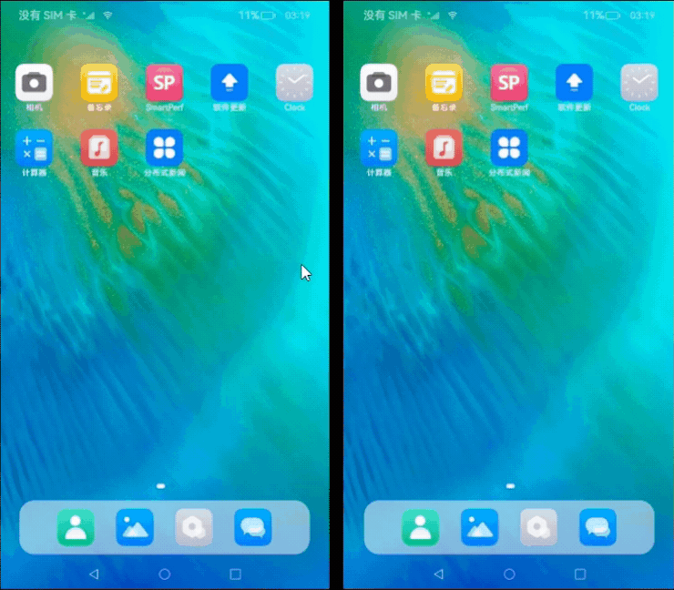
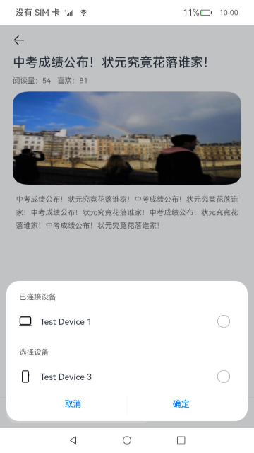

# 分布式新闻客户端（ArkTS）

## 介绍

本篇Codelab基于栅格布局、设备管理和多端协同，实现一次开发，多端部署的分布式新闻客户端页面。主要包含以下功能：

1. 展示新闻列表以及左右滑动切换新闻Tab。
2. 点击新闻展示新闻详情页。
3. 点击新闻详情页底部的分享按钮，发现周边处在同一无线网络下的设备并进行可信认证连接。
4. 可信认证后，再次点击分享按钮，选择已连接的设备进行跨设备启动UIAbility。

最终效果图如下：



### 相关概念

- [栅格布局](https://gitcode.com/openharmony/docs/blob/master/zh-cn/application-dev/ui/arkts-layout-development-grid-layout.md)：一种通用的辅助定位工具，解决多尺寸多设备的动态布局问题。
- [设备管理](https://gitcode.com/openharmony/docs/blob/master/zh-cn/application-dev/reference/apis/js-apis-device-manager.md)：模块提供分布式设备管理能力。
- [跨设备启动UIAbility](https://gitcode.com/openharmony/docs/blob/master/zh-cn/application-dev/application-models/hop-multi-device-collaboration.md)：多端上的不同UIAbility/ServiceExtensionAbility同时运行、或者交替运行实现完整的业务。
- [Tabs组件](https://gitcode.com/openharmony/docs/blob/master/zh-cn/application-dev/reference/arkui-ts/ts-container-tabs.md)：通过页签进行内容视图切换的容器组件，每个页签对应一个内容视图。

### 相关权限

本篇Codelab使用了设备管理及跨设备实现多端协同能力，需要手动替换full-SDK，并在配置文件module.json5文件requestPermissions属性中添加如下权限：

- [分布式设备认证组网权限](https://gitcode.com/openharmony/docs/blob/master/zh-cn/application-dev/security/permission-list.md#ohospermissionaccess_service_dm)：ohos.permission.ACCESS_SERVICE_DM。
- [设备间的数据交换权限](https://gitcode.com/openharmony/docs/blob/master/zh-cn/application-dev/security/permission-list.md#ohospermissiondistributed_datasync)：ohos.permission.DISTRIBUTED_DATASYNC。

### 约束与限制

1. 本篇Codelab部分能力依赖于系统API，需下载full-SDK并替换DevEco Studio自动下载的public-SDK。具体操作可参考指南[《如何替换full-SDK》](https://gitcode.com/openharmony/docs/blob/master/zh-cn/application-dev/faqs/full-sdk-switch-guide.md)。
2. 本篇Codelab使用的部分API仅系统应用可用，需要提升应用等级。具体可参考指南[《访问控制授权申请指导》](https://gitcode.com/openharmony/docs/blob/master/zh-cn/application-dev/security/accesstoken-overview.md#%E5%BA%94%E7%94%A8apl%E7%AD%89%E7%BA%A7%E8%AF%B4%E6%98%8E)。

## 环境搭建

### 软件要求

- [DevEco Studio](https://gitcode.com/openharmony/docs/blob/master/zh-cn/application-dev/quick-start/start-overview.md#%E5%B7%A5%E5%85%B7%E5%87%86%E5%A4%87)版本：DevEco Studio 4.0 Beta2。
- OpenHarmony SDK版本：API version 10。

### 硬件要求

- 开发板类型：[润和RK3568开发板](https://gitcode.com/openharmony/docs/blob/master/zh-cn/device-dev/quick-start/quickstart-appendix-rk3568.md)。
- OpenHarmony系统：4.0 Beta1。

### 环境搭建

完成本篇Codelab我们首先要完成开发环境的搭建，本示例以**RK3568**开发板为例，参照以下步骤进行：

1. [获取OpenHarmony系统版本](https://gitcode.com/openharmony/docs/blob/master/zh-cn/device-dev/get-code/sourcecode-acquire.md#%E8%8E%B7%E5%8F%96%E6%96%B9%E5%BC%8F3%E4%BB%8E%E9%95%9C%E5%83%8F%E7%AB%99%E7%82%B9%E8%8E%B7%E5%8F%96)：标准系统解决方案（二进制）。以4.0 Beta1版本为例：


2. 搭建烧录环境。
    1. [完成DevEco Device Tool的安装](https://gitcode.com/openharmony/docs/blob/master/zh-cn/device-dev/quick-start/quickstart-ide-env-win.md)
    2. [完成RK3568开发板的烧录](https://gitcode.com/openharmony/docs/blob/master/zh-cn/device-dev/quick-start/quickstart-ide-3568-burn.md)

3. 搭建开发环境。
    1. 开始前请参考[工具准备](https://gitcode.com/openharmony/docs/blob/master/zh-cn/application-dev/quick-start/start-overview.md#%E5%B7%A5%E5%85%B7%E5%87%86%E5%A4%87)，完成DevEco Studio的安装和开发环境配置。
    2. 开发环境配置完成后，请参考[使用工程向导](https://gitcode.com/openharmony/docs/blob/master/zh-cn/application-dev/quick-start/start-with-ets-stage.md#创建arkts工程)创建工程（模板选择“Empty Ability”）。
    3. 工程创建完成后，选择使用[真机进行调测](https://gitcode.com/openharmony/docs/blob/master/zh-cn/application-dev/quick-start/start-with-ets-stage.md#使用真机运行应用)。

## 代码结构解读

本篇Codelab只对核心代码进行讲解，对于完整代码，我们会在gitee中提供。

```txt
├──entry/src/main/ets                   // 代码区
│  ├──common
│  │  ├──constants
│  │  │  └──CommonConstants.ets         // 常量类
│  │  └──utils
│  │     └──Logger.ets                  // 日志工具类
│  ├──entryability
│  │  └──EntryAbility.ets               // 程序入口类
│  ├──model
│  │  └──RemoteDeviceModel.ets          // 设备管理类
│  ├──pages
│  │  ├──Index.ets                      // 新闻列表页
│  │  └──NewsDetail.ets                 // 新闻详情页
│  ├──view
│  │  ├──DetailFooter.ets               // 详情页页脚
│  │  ├──DetailHeadContent.ets          // 新闻详情
│  │  ├──DeviceListDialog.ets           // 设备列表弹窗
│  │  ├──NewsList.ets                   // 新闻列表
│  │  └──NewsTab.ets                    // 新闻页签
│  └──viewmodel
│     └──NewsDataModel.ets              // 新闻数据处理
└──entry/src/main/resources             // 资源文件目录
```

## 构建新闻列表页

新闻列表页由页签区域和新闻列表区域组成，页签区域为自定义布局TabBuilder，新闻列表区域为Tabs组件嵌套List组件，并适配不同尺寸设备对应的栅格。新闻列表页能够左右滑动或点击页签切换新闻Tab，并设置点击新闻跳转至新闻详情页。


```typescript
// NewsTab.ets
@Component
export default struct NewsTab {
  @State currentIndex: number = 0;
  @State currentBreakpoint: string = CommonConstants.BREAKPOINT_SM;
  private newsItems: NewsData[] = [];

  // 自定义页签栏
  @Builder TabBuilder(title: Resource, index: number) {
    Row() {
      Text(title)
        .fontSize(this.currentIndex === index ? $r('app.float.lager_font_size') : $r('app.float.middle_font_size'))
        .fontWeight(this.currentIndex === index ? CommonConstants.FONT_WEIGHT_500 : FontWeight.Normal)
        .fontColor(this.currentIndex === index ? $r('app.color.tab_font_select') : $r('app.color.font_color_gray'))
    }
    .layoutWeight(1)
    .margin({
      right: $r('app.float.news_tab_margin_right'),
      left: (this.currentBreakpoint === CommonConstants.BREAKPOINT_SM && index === 0) ?
        $r('app.float.news_tab_margin_left') : 0
    })
    .height(this.currentIndex === index ? $r('app.float.news_tab_current_height') : $r('app.float.news_tab_height'))
  }

  build() {
    ...
    Tabs() {
      ForEach(CommonConstants.ALL_TITLE, (title: string, index: number) => {
        TabContent() {
          // 新闻内容列表
          NewsList({ newsItems: NewsDataModel.getNewsByType(this.newsItems, title) })
        }
        .tabBar(this.TabBuilder(NewsDataModel.getTypeByStr(title), index))
      }, (title: string, index: number) => index + JSON.stringify(title))
    }
    .barHeight($r('app.float.news_tab_bar_height'))
    .barWidth(CommonConstants.FULL_COMPONENT)
    .barMode(this.currentBreakpoint === CommonConstants.BREAKPOINT_SM ? BarMode.Scrollable : BarMode.Fixed)
    .onChange((index: number) => {
      this.currentIndex = index;
    })
    ...
  }
}

// NewsList.ets
@Component
export default struct NewsList {
  private newsItems: NewsData[] = [];

  build() {
    List() {
      ForEach(this.newsItems, (item: NewsData, index: number) => {
        ListItem() {
          // 栅格布局
          GridRow({
            columns: {
              sm: CommonConstants.FOUR_COLUMN,
              md: CommonConstants.EIGHT_COLUMN,
              lg: CommonConstants.TWELVE_COLUMN
            },
            breakpoints: {
              value: [
                CommonConstants.SMALL_DEVICE_TYPE,
                CommonConstants.MIDDLE_DEVICE_TYPE,
                CommonConstants.LARGE_DEVICE_TYPE
              ]
            },
            gutter: { x: $r('app.float.grid_row_gutter') }
          }) {
            GridCol({
              span: {
                sm: CommonConstants.FOUR_COLUMN,
                md: CommonConstants.EIGHT_COLUMN,
                lg: CommonConstants.EIGHT_COLUMN
              },
              offset: {
                sm: CommonConstants.ZERO_COLUMN,
                md: CommonConstants.ZERO_COLUMN,
                lg: CommonConstants.TWO_COLUMN
              }
            }) {
              NewsItem({ newsItem: item, isLast: index === this.newsItems.length - 1 })
            }
          }
        }
      }, (item: NewsData, index: number) => index + JSON.stringify(item))
    }
    .height(CommonConstants.FULL_COMPONENT)
  }
}
```

## 构建新闻详情页

### 新闻详情页

新闻详情页由新闻内容区域和页脚区域组成，其中新闻内容区域为Scroll组件嵌套栅格组件展示新闻详情，页脚区域为栅格布局，包含TextInput组件和三个按钮图标。


```typescript
// DetailHeadContent.ets
build() {
  Column() {
    ...
    // 可滚动的容器组件
    Scroll() {
      // 栅格布局
      GridRow({
        columns: {
          sm: CommonConstants.FOUR_COLUMN,
          md: CommonConstants.EIGHT_COLUMN,
          lg: CommonConstants.TWELVE_COLUMN
        },
        breakpoints: {
          value: [
          CommonConstants.SMALL_DEVICE_TYPE,
          CommonConstants.MIDDLE_DEVICE_TYPE,
          CommonConstants.LARGE_DEVICE_TYPE
          ]
        },
        gutter: { x: $r('app.float.grid_row_gutter') }
      }) {
        GridCol({
          span: {
            sm: CommonConstants.FOUR_COLUMN,
            md: CommonConstants.EIGHT_COLUMN,
            lg: CommonConstants.EIGHT_COLUMN
          },
          offset: {
            sm: CommonConstants.ZERO_COLUMN,
            md: CommonConstants.ZERO_COLUMN,
            lg: CommonConstants.TWO_COLUMN
          }
        }) {
          ...
        }
        ...
      }
    }
    .padding({
      bottom: $r('app.float.news_detail_padding_bottom')
    })
    .scrollBar(BarState.Off)
  }
  .margin({
    left: $r('app.float.news_detail_margin'),
    right: $r('app.float.news_detail_margin')
  })
  .height(CommonConstants.FULL_COMPONENT)
  .alignItems(HorizontalAlign.Start)
}

// DetailFooter.ets
build() {
  Column() {
    // 分割线
    Divider()
      .color($r('app.color.detail_divider_color'))
      .width(CommonConstants.FULL_COMPONENT)

    // 栅格布局
    GridRow({
      columns: {
        sm: CommonConstants.FOUR_COLUMN,
        md: CommonConstants.EIGHT_COLUMN,
        lg: CommonConstants.TWELVE_COLUMN
      },
      breakpoints: {
        value: [
        CommonConstants.SMALL_DEVICE_TYPE,
        CommonConstants.MIDDLE_DEVICE_TYPE,
        CommonConstants.LARGE_DEVICE_TYPE
        ]
      },
      gutter: { x: $r('app.float.grid_row_gutter') }
    }) {
      GridCol({
        span: {
          sm: CommonConstants.FOUR_COLUMN,
          md: CommonConstants.EIGHT_COLUMN,
          lg: CommonConstants.EIGHT_COLUMN
        },
        offset: {
          sm: CommonConstants.ZERO_COLUMN,
          md: CommonConstants.ZERO_COLUMN,
          lg: CommonConstants.TWO_COLUMN
        }
      }) {
        ...
      }
      .margin({
        left: this.currentBreakpoint === CommonConstants.BREAKPOINT_SM ? $r('app.float.footer_margin_sm') :
          $r('app.float.footer_margin_other'),
        right: this.currentBreakpoint === CommonConstants.BREAKPOINT_SM ? $r('app.float.footer_margin_sm') :
          $r('app.float.footer_margin_other')
      })
    }
    .backgroundColor($r('app.color.bg_color_gray'))
    .height($r('app.float.footer_height'))
    .width(CommonConstants.FULL_COMPONENT)
    .onBreakpointChange((breakpoints) => {
      ...
    })
  }
}
```

### 分享按钮弹窗

页脚点击分享按钮，弹出自定义弹窗DeviceListDialog，用于多端协同拉起应用。DeviceListDialog由两个标题栏和两个List组件构成，其中List组件使用ForEach循环渲染设备数据。



```typescript
// DeviceListDialog.ets
build() {
  Column() {
    Row() {
      ...
    }
    .height($r('app.float.choose_device_row_height'))
    .width(CommonConstants.FULL_COMPONENT)
    .padding({
      left: $r('app.float.dialog_padding'),
      right: $r('app.float.dialog_padding')
    })

    // 信任设备列表
    List() {
      ForEach(this.trustedDeviceList, (item: deviceManager.DeviceInfo, index: number) => {
        ListItem() {
          ...
        }
      }, (item: deviceManager.DeviceInfo) => JSON.stringify(item.deviceId))
    }

    Row() {
      ...
    }
    .height($r('app.float.choose_device_row_height'))
    .width(CommonConstants.FULL_COMPONENT)
    .padding({
      left: $r('app.float.dialog_padding'),
      right: $r('app.float.dialog_padding')
    })

    // 发现设备列表
    List() {
      ForEach(this.discoverDeviceList, (item: deviceManager.DeviceInfo, index: number) => {
        ListItem() {
          ...
        }
      }, (item: deviceManager.DeviceInfo) => JSON.stringify(item.deviceId))
    }

    Row() {
      ...
    }
    .height($r('app.float.dialog_button_row_height'))
    .padding({
      top: $r('app.float.dialog_button_padding_top'),
      bottom: $r('app.float.dialog_button_padding_bottom'),
      left: $r('app.float.dialog_padding'),
      right: $r('app.float.dialog_padding')
    })
    .width(CommonConstants.FULL_COMPONENT)
  }
  .borderRadius($r('app.float.dialog_border_radius'))
  .backgroundColor($r('app.color.device_dialog_background'))
  .width(CommonConstants.FULL_COMPONENT)
}
```

## 多端协同拉起应用

### 创建设备管理器

应用创建时创建一个设备管理器实例，注册设备状态监听和获取信任的设备列表。其中deviceManager类需使用full-SDK。

```typescript
// EntryAbility.ets
onCreate(want: Want) {
  ...
  // 创建设备管理器
  RemoteDeviceModel.createDeviceManager(this.context);
}

// RemoteDeviceModel.ets
async createDeviceManager(context: common.UIAbilityContext): Promise<void> {
  if (this.deviceManager !== undefined) {
    return;
  }
  await new Promise((resolve: (value: Object | PromiseLike<Object>) => void, reject:
    ((reason?: RejectError) => void)) => {
    deviceManager.createDeviceManager(context.abilityInfo.bundleName, (err, value) => {
      if (err) {
        reject(err);
        logger.error('createDeviceManager failed.');
        return;
      }
      this.deviceManager = value;
      // 注册设备状态监听
      this.registerDeviceStateListener();
      // 获取信任设备列表
      this.getTrustedDeviceList();
      resolve(value);
    })
  })
}
```

### 发现设备

用户点击新闻详情页底部的分享按钮，调用startDeviceDiscovery()方法，发现周边处在同一无线网络下的设备并添加设备至已发现的设备列表。

```typescript
// RemoteDeviceModel.ets
startDeviceDiscovery(): void {
  if (this.deviceManager === undefined) {
    logger.error('deviceManager has not initialized');
    this.showToast($r('app.string.no_device_manager'));
    return;
  }
  this.deviceManager.on('deviceFound', (data) => {
    if (data === null) {
      return;
    }
    // 监听设备发现
    this.deviceFound(data);
  })
  this.deviceManager.on('discoverFail', (data) => {
    logger.error(`discoverFail data = ${JSON.stringify(data)}`);
  })
  this.deviceManager.on('serviceDie', () => {
    logger.error('serviceDie');
  })

  let info: deviceManager.SubscribeInfo = {
    subscribeId: SUBSCRIBE_ID,
    mode: CommonConstants.INFO_MODE,
    medium: 0,
    freq: CommonConstants.INFO_FREQ,
    isSameAccount: false,
    isWakeRemote: true,
    capability: 0
  };
  // 添加设备至发现列表
  this.discoverList = [];
  AppStorage.setOrCreate(CommonConstants.DISCOVER_DEVICE_LIST, this.discoverList);

  try {
    this.deviceManager.startDeviceDiscovery(info);
  } catch (err) {
    logger.error(`startDeviceDiscovery failed error = ${JSON.stringify(err)}`);
  }
}
```

### 进行可信认证连接

在已发现的设备列表中选择设备，调用authenticateDevice()方法进行可信认证，输入PIN码，连接设备，将设备改为信任状态，添加至已信任设备列表。

```typescript
// RemoteDeviceModel.ets
authenticateDevice(device: deviceManager.DeviceInfo, context: common.UIAbilityContext): void {
  if (this.deviceManager === undefined) {
    logger.error('deviceManager has not initialized');
    this.showToast($r('app.string.no_device_manager'));
    return;
  }

  for (let i: number = 0; i < this.discoverList.length; i++) {
    if (this.discoverList[i].deviceId !== device.deviceId) {
      continue;
    }
    let extraInfo: AuthExtraInfoInterface = {
      targetPkgName: context.abilityInfo.bundleName,
      appName: context.applicationInfo.name,
      appDescription: context.applicationInfo.description,
      business: CommonConstants.ZERO
    };
    let authParam: deviceManager.AuthParam = {
      'authType': CommonConstants.ONE,
      'extraInfo': extraInfo
    };
    try {
      // 可信认证
      this.deviceManager.authenticateDevice(device, authParam, (err) => {
        if (err) {
          logger.error(`authenticateDevice error. Code is ${err.code}, message is ${err.message}`);
          return;
        }
      })
    } catch (err) {
      logger.error(`authenticateDevice failed error = ${JSON.stringify(err)}`);
    }
  }
}
```

### 跨设备启动UIAbility

可信认证后，用户再次点击分享按钮，选择已信任设备列表中的设备，调用startAbilityContinuation()方法进行拉起应用，在另一设备中触发aboutToAppear()方法渲染当前的新闻详情页，实现跨设备启动UIAbility。

```typescript
// DeviceListDialog.ets
function startAbilityContinuation(deviceId: string, newsId: string, context: common.UIAbilityContext): void {
  let want: Want = {
    deviceId: deviceId,
    bundleName: context.abilityInfo.bundleName,
    abilityName: CommonConstants.ABILITY_NAME,
    parameters: {
      newsId: newsId
    }
  };
  // 拉起应用
  context.startAbility(want).catch((err: Error) => {
    Logger.error(`startAbilityContinuation failed error = ${JSON.stringify(err)}`);
    prompt.showToast({
      message: $r('app.string.start_ability_continuation_error')
    });
  })
}

// NewsDetail.ets
aboutToAppear() {
  let newsId: string | undefined = AppStorage.get<string>('wantNewsId');
  if (newsId === undefined) {
    this.newsData = (router.getParams() as Record<string, NewsData>)['newsItem'];
    return;
  }
  // 读取跨设备传递的参数信息
  this.newsData = this.newsItems.filter((item: NewsData) => (item.newsId === newsId))[0];
}
```

## 总结

您已经完成了本次Codelab的学习，并了解到以下知识点：

1. 构建分布式新闻客户端页面。
2. 实现应用的一次开发，多端部署。
3. 使用跨设备启动UIAbility拉起应用。

