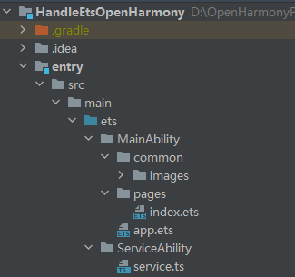
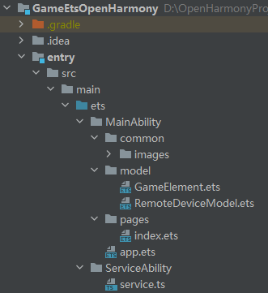

# GameApplication

# 介绍<a name="ZH-CN_TOPIC_0000001260558213"></a>

本篇Codelab是基于TS扩展的声明式开发范式编程语言，以及OpenHarmony的分布式能力实现的一个手柄游戏。

完成本篇Codelab需要两台开发板，一台开发板作为游戏端，一台开发板作为手柄端，实现如下功能：

-   游戏端呈现飞机移动、发射子弹等效果。
-   游戏端分布式拉起手柄端FA。
-   手柄端与游戏端建立连接，发送指令给游戏端，比如移动飞机，发射子弹和释放技能等。

最终效果图如下：


# 搭建OpenHarmony环境<a name="ZH-CN_TOPIC_0000001216126322"></a>

完成本篇Codelab我们首先要完成开发环境的搭建，本示例以**RK3568**开发板为例，参照以下步骤进行：

1. [获取OpenHarmony系统版本](https://gitee.com/openharmony/docs/blob/master/zh-cn/device-dev/get-code/sourcecode-acquire.md#%E8%8E%B7%E5%8F%96%E6%96%B9%E5%BC%8F3%E4%BB%8E%E9%95%9C%E5%83%8F%E7%AB%99%E7%82%B9%E8%8E%B7%E5%8F%96)：标准系统解决方案（二进制）。

   以3.1版本为例：

   

2. 搭建烧录环境。

    1.  [完成DevEco Device Tool的安装](https://gitee.com/openharmony/docs/blob/master/zh-cn/device-dev/quick-start/quickstart-standard-env-setup.md)
	2.  [完成RK3568开发板的烧录](https://gitee.com/openharmony/docs/blob/master/zh-cn/device-dev/quick-start/quickstart-ide-standard-running-rk3568-burning.md)

3. 搭建开发环境。

    1.  开始前请参考[工具准备](https://gitee.com/openharmony/docs/blob/master/zh-cn/application-dev/quick-start/start-overview.md#%E5%B7%A5%E5%85%B7%E5%87%86%E5%A4%87)，完成DevEco Studio的安装和开发环境配置。
	2.  开发环境配置完成后，请参考[使用工程向导](https://gitee.com/openharmony/docs/blob/master/zh-cn/application-dev/quick-start/start-with-ets-fa.md#%E5%88%9B%E5%BB%BAets%E5%B7%A5%E7%A8%8B)创建工程（模板选择“Empty Ability”），选择JS或者eTS语言开发。
	3.  工程创建完成后，选择使用[真机进行调测](https://gitee.com/openharmony/docs/blob/master/zh-cn/application-dev/quick-start/start-with-ets-fa.md#%E4%BD%BF%E7%94%A8%E7%9C%9F%E6%9C%BA%E8%BF%90%E8%A1%8C%E5%BA%94%E7%94%A8)。
	
# 分布式组网<a name="ZH-CN_TOPIC_0000001215966358"></a>

本章节以系统自带的音乐播放器为例（具体以实际的应用为准），介绍如何完成两台设备的分布式组网。

1. 硬件准备：准备两台烧录相同的版本系统的**RK3568**开发板A、B。

2. 开发板A、B连接同一个WiFi网络。

   打开设置--\>WLAN--\>点击右侧WiFi开关--\>点击目标WiFi并输入密码。

   

3. 将设备A，B设置为互相信任的设备。

   -   找到系统应用“音乐”。

   

   - 设备A打开音乐，点击左下角流转按钮，弹出列表框，在列表中会展示远端设备的id。

     

   - 选择远端设备B的id，另一台开发板（设备B）会弹出验证的选项框。

     

   - 设备B点击允许，设备B将会弹出随机PIN码，将设备B的PIN码输入到设备A的PIN码填入框中。

   

   配网完毕。

# 代码结构解读<a name="ZH-CN_TOPIC_0000001260718197"></a>

-   [HandleEtsOpenHarmony](#section185897456242)
-   [GameEtsOpenHarmony](#section060103471911)

本篇Codelab只对核心代码进行讲解，对于完整代码，我们会在参考章节中提供下载方式，首先介绍一下整个工程的代码结构：

```
└── HandleGameApplication
	│── GameEtsOpenHarmony
	│  
	└── HandleEtsOpenHarmony
```

其中HandleEtsOpenHarmony为手柄端工程代码，GameEtsOpenHarmony为游戏端工程代码。

## HandleEtsOpenHarmony<a name="section185897456242"></a>



-   MainAbility：存放应用主页面。
    -   pages/index.ets：应用主页面。
    -   common/images：存放图片资源的目录。

-   ServiceAbility：存放ServiceAbility相关文件。
    -   service.ts：service服务，用于跨设备连接后通讯。


## GameEtsOpenHarmony<a name="section060103471911"></a>



-   MainAbility：存放应用主页面。
    -   pages/index.ets：应用主页面。
    -   common/images：存放图片资源。

-   model：存放获取组网内的设备列表相关文件。
    -   RemoteDeviceModel.ets：获取组网内的设备列表。
    -   GameElement.ets：游戏端界面元素的实体类，用于封装子弹、飞机等元素的属性。

-   ServiceAbility：存放ServiceAbility相关文件。
    -   service.ts：service服务，用于跨设备连接后通讯。

# 实现手柄端功能<a name="ZH-CN_TOPIC_0000001216118326"></a>

1. 实现布局和样式。

   手柄端有两个功能：向游戏端发送指令和实时获取游戏端得分数据。界面上有三个功能组件：蓝色图形组件用于控制游戏端飞机移动方向，黄色图形组件用于发射子弹，绿色图形组件用于释放技能，效果图如下：

   

   主要代码如下：

   ```
   @Entry
   @Component
   struct Index {
   ...
     build() {
       Stack() {
   	...
   		Text('score:' + this.score)
   		...
         Flex({ direction: FlexDirection.Column, alignItems: ItemAlign.Start, justifyContent: FlexAlign.SpaceBetween }) {
           Stack() {
             Image('/common/images/bigcircle.png')
               .width(300)
               .height(300)
             Image('/common/images/smallcircle.png')
               .width(140)
               .height(140)
               .position({ x: this.smallPosX, y: this.smallPosY }) // 30+75-35
           }
          ...
           Row() {
             Image('/common/images/a.png')
               .width(160)
               .height(160)
               .margin({ right: 20, bottom: 80 })
             Image('/common/images/b.png')
               .width(200)
               .height(200)
           }.alignItems(VerticalAlign.Bottom)
   		...
       }
     }
   }
   ```

2. 实现摇杆功能。

   给摇杆（蓝色小圆图形）添加TouchEvent，动态改变摇杆position属性使摇杆跟随手指移动，主要代码如下：

   ```
   onTouchEvent(event: TouchEvent) {
     switch (event.type) {
       case TouchType.Down:
         this.startX = event.touches[0].screenX;
         this.startY = event.touches[0].screenY;
         break;
       case TouchType.Move:
         this.curX = event.touches[0].screenX;
         this.curY = event.touches[0].screenY;
         this.getSmallCurrentPos(this.curX - this.smallR - 60, this.curY - this.smallR - 60)
         angle = Math.round(this.calculateAngle());
         break;
       default:
         break;
     }
   }
   ```

3. 计算摇杆偏移角度。

   主要代码如下：

   ```
   calculateAngle() {
     var angle = 0
     var degree = Math.atan(this.getDisAbsY() / this.getDisAbsX()) * 180 / Math.PI
     var quadrant = this.quadrant();
     switch (quadrant) {
       case this.QUADRANT_1:
       // 向右上移动
         angle = degree;
         break;
       case this.QUADRANT_2:
       // 向左上移动
         angle = 180 - degree;
         break;
       case this.QUADRANT_3:
       // 向左下移动
         angle = -180 + degree;
         break;
       case this.QUADRANT_4:
       // 向右下移动
         angle = -degree;
         break;
       default:
         angle = 0;
         break;
     }
     return angle;
   }
   ```

4. 连接游戏端Service。

   当手柄端被游戏端拉起时，获取游戏端传递的数据：游戏端deviceId和分数score。然后通过deviceId连接游戏端Service，主要代码如下：

   ```
   aboutToAppear() {
     // 当被拉起时，通过want传递的参数同步对端界面UI
     await featureAbility.getWant((error, want) => {
       // 远端被拉起后，连接游戏端的service
       if (want.parameters.deviceId) {
         let remoteDeviceId = want.parameters.deviceId
         connectRemoteService(remoteDeviceId)
       }
     });
   }
   
   async function connectRemoteService(deviceId) {
   ...
     await featureAbility.connectAbility(
       {
         'deviceId': deviceId,
         'bundleName': "com.huawei.cookbook",
         'abilityName': "com.huawei.cookbook.ServiceAbility",
       },
       {
         onConnect: onConnectCallback,
         onDisconnect: onDisconnectCallback,
         onFailed: onFailedCallback,
       },
     );
   }
   ```

5. 通过RPC发送数据到游戏端。

   连接游戏端Service之后，摇杆角度angle和操作类型actionType（1为发射子弹，2为释放技能）发送给游戏端，主要代码如下：

   ```
   async function sendMessageToRemoteService() {
   ...
     let option = new rpc.MessageOption();
     let data = new rpc.MessageParcel();
     let reply = new rpc.MessageParcel();
     data.writeInt(actionType);
     data.writeInt(angle);
     await mRemote.sendRequest(1, data, reply, option);
   }
   ```

# 实现游戏端功能<a name="ZH-CN_TOPIC_0000001260718195"></a>

1. 实现布局和样式。

   游戏界面主要由玩家飞机、敌机、子弹和道具（降落伞）等组成，由于敌机和子弹都是多个的，所以使用ForEach来实现，主要代码如下：

   ```
   @Entry
   @Component
   struct Index {
   
     build() {
       Stack() {
       ... 
   
         ForEach(this.bullets, item => {
           Image(item.imgSrc)
             .width(item.imgWidth)
             .height(item.imgHeight)
             .position({ x: item.positionX, y: item.positionY })
         }, item => item.timestamp.toString())
   
         ForEach(this.enemyPlanes, item => {
           Image(item.imgSrc)
             .width(item.imgWidth)
             .height(item.imgHeight)
             .position({ x: item.positionX, y: item.positionY })
         }, item => item.timestamp.toString())
   
         Image('/common/images/planeOne.png')
           .width(this.planeSize)
           .height(this.planeSize)
           .position({ x: this.planePosX, y: this.planePosY })
           .onTouch((event: TouchEvent) => {
             this.onTouchEvent(event)
           })
   
         Image('/common/images/props.png')
           .width(this.propsSize)
           .height(this.propsSize)
           .position({ x: this.propsPosX, y: this.propsPosY })
       ...
       }
       .height('100%')
       .width('100%')
     }
   }
   ```

2. 实现游戏端元素动画效果。

   飞机、子弹和道具等元素的移动是通过动态改变Image的position属性来实现的。使用定时器setInterval每隔16ms重新设置界面元素position属性的值，主要实现代码如下：

   ```
    startGame() {
       var that = this
       setInterval(function () {   
         // 每60*16ms创建一个敌机
         if (that.num % 60 == 0) {
           that.createEnemyPlane()
         }
         // 移动子弹
         var bulletsTemp: GameElement[] = []
         for (var i = 0; i < that.bullets.length; i++) {
           var bullet = that.bullets[i]
           bullet.positionY -= 8
           // 当子弹移除屏幕外的时候，释放掉
           if (bullet.positionY > 0) {
             bulletsTemp.push(bullet)
           }
         }
         that.bullets = bulletsTemp
         // 移动飞机
         var enemyPlanesTemp: GameElement[] = []
         for (var j = 0; j < that.enemyPlanes.length; j++) {
           var enemyPlane = that.enemyPlanes[j]
           enemyPlane.positionY += 6
   
           // 当飞机移除屏幕外的时候，释放掉
           if (enemyPlane.positionY < that.screenHeight) {
             enemyPlanesTemp.push(enemyPlane)
           }
         }
         that.enemyPlanes = enemyPlanesTemp
         // 每隔 500*16ms显示降落伞
         if (that.num % 500 == 0) {
           that.getPropsFlag = true
           that.propsPosY = -that.propsSize
           that.propsPosX = Math.round((Math.random() * (that.screenWidth - that.propsSize)))
         }
         // 刷新道具位置
         if (that.propsPosY < that.screenHeight) {
           that.propsPosY += 6
         }
         that.checkCollision()
       }, 16);
     }
   ```

3. 判断元素是否发生碰撞。

   在setInterval中改变元素位置的时候同时检测元素之间是否发生碰撞，子弹和敌机发生碰撞则分数值改变（摧毁小飞机加50分，摧毁大飞机加100分），玩家飞机和道具发生碰撞则道具加1，主要实现代码如下：

   ```
    checkCollision() {
    ...
       for (var i = 0; i < this.enemyPlanes.length; i++) {
         var enemy = this.enemyPlanes[i];
         for (var j = 0; j < this.bullets.length; j++) {
           var bullet = this.bullets[j];
           var inside = this.isInside(bullet, enemy);
           // 发生碰撞
           if (inside) {
             enemy.imgSrc = '/common/images/boom.png'
             if (enemy.flag == 1) {
               this.score += 50
               sendMessageToRemoteService(that.score)
             } else if (enemy.flag == 2) {
               this.score += 100
               sendMessageToRemoteService(that.score)
             }
             // 清除子弹
             this.enemyPlanes.splice(i, 1);
             i--;
             enemy.flag = 3
             // 清除被子弹打中敌机
             that.bullets.splice(j, 1);
             j--;
           }
         }
       }
       // 飞机和降落伞是否发生碰撞
       var isGetProps = this.isInside(myPlane, props);
       if (isGetProps && this.getPropsFlag) {
         this.getPropsFlag = false
         this.bombNum++
         this.propsPosY = 2000
       }
     }
   ```

4. 获取设备列表。

   点击界面右上角的“电脑”图标，调用registerDeviceListCallback\(\)发现设备列表，并弹出设备列表选择框DeviceListDialog ，选择设备后拉起远端FA。DeviceListDialog 主要代码如下：

   ```
   @CustomDialog
   export struct DeviceListDialog {
     controller: CustomDialogController
   
     build() {
       Column() {
         Text("选择设备")
           .fontWeight(FontWeight.Bold)
           .fontSize(20)
           .margin({ top: 20, bottom: 10 })
   
         List() {
           ForEach(deviceList, item => {
             ListItem() {
               Stack() {
                 Text(item)
                   .fontSize(12)
                   .margin({ top: 10 })
               }
               .onClick(() => {
                 startRemoteAbility(item)
                 this.controller.close();
               })
               .padding({ left: 30, right: 30 })
             }
           }, item => item.toString())
         }
         .height("30%")
         .align(Alignment.TopStart)
   ...
       }
     }
   }
   ```

5. 拉起手柄端FA。

   点击设备列表获取远程设备id后，拉起手柄端FA，代码如下：

   ```
   function startRemoteAbility(deviceId) {
     var params = {
       deviceId: localDeviceId
     }
     var wantValue = {
       bundleName: 'com.huawei.cookbook',
       abilityName: 'com.huawei.cookbook.MainAbility',
       deviceId: deviceId,
       parameters: params
     };
     featureAbility.startAbility({
       want: wantValue
     }).then((data) => {
       console.info('[game] featureAbility.startAbility finished, localDeviceId=' + localDeviceId + '----deviceId:' + deviceId);
       // 拉起远端后，连接远端service
       connectRemoteService(deviceId)
     });
   }
   ```

6. 连接手柄端Service。

   拉起手柄端FA后，连接手柄端Service，代码如下：

   ```
   async function connectRemoteService(deviceId) {
     // 连接成功的回调
     async function onConnectCallback(element, remote) {
       mRemote = remote;
     }
   ...
     if (remoteDeviceModel.deviceList.length === 0) {
       return;
     }
     await featureAbility.connectAbility(
       {
         'deviceId': deviceId,
         'bundleName': "com.huawei.cookbook",
         'abilityName': "com.huawei.cookbook.ServiceAbility",
       },
       {
         onConnect: onConnectCallback,
         onDisconnect: onDisconnectCallback,
         onFailed: onFailedCallback,
       },
     );
   }
   
   ```

7. 通过RPC发送数据到手柄端。

   通过RPC将游戏分数发送给手柄端，主要代码如下：

   ```
   async function sendMessageToRemoteService(score) {
     console.log('[game]connectRemoteService sendMessageToRemoteService:')
     if (mRemote == null) {
       return;
     }
     let option = new rpc.MessageOption();
     let data = new rpc.MessageParcel();
     let reply = new rpc.MessageParcel();
     data.writeInt(score);
     await mRemote.sendRequest(1, data, reply, option);
   }
   ```

8. Service发布公共事件。

   通过Service接收手柄端数据，然后使用CommonEvent模块将数据发送给FA，主要代码如下：

   ```
   class GameServiceAbilityStub extends rpc.RemoteObject {
   ...
       onRemoteRequest(code, data, reply, option) {
           console.log('[game]Service onRemoteRequest');
           var publishCallBack;
           if (code === 1) {
               // 读取手柄端发送的数据
               let actionType = data.readInt();
               let angle = data.readInt();
               reply.writeInt(100);
               var params = {
                   actionType: actionType,
                   angle: angle,
               }
               var options = {
                   code: 1,
                   data: 'init data',
                   isOrdered: true,
                   bundleName: 'com.huawei.cookbook',
                   parameters: params
               }
               publishCallBack = function () {}
               // 发布公共事件
               commonEvent.publish("publish_action", options, publishCallBack);
           } 
           return true;
       }
   }
   ```

9. FA订阅公共事件。

   订阅公共事件，接收从Service发送的公共事件数据，actionType 为操作类型（1表示发送子弹指令，2表示释放技能指令），angle 为飞机移动的角度。接收到数据后执行手柄端发送的指令：移动玩家飞机、发射子弹和释放技能摧毁所有敌机，主要代码如下：

   ```
   subscribeEvent() {
   ...
     // 订阅公共事件回调
     function SubscribeCallBack(err, data) {
       let msgData = data.data;
       let code = data.code;
   ...
       // 处理接收到的数据data
       that.actionType = data.parameters.actionType;
       that.angle = data.parameters.angle;
   
       if (that.actionType == 1) {
         that.createBullet()
       }
       if (that.actionType == 2) {
         if (that.bombNum > 0) {
           that.bombNum--
           that.destroyAllEnemy()
         }
       }
       if (that.angle != 0) {
         that.movePlaneByHandle()
       }
     }
     //创建订阅者回调
     function CreateSubscriberCallBack(err, data) {
       subscriber = data;
       //订阅公共事件
       commonEvent.subscribe(subscriber, SubscribeCallBack);
     }
     //创建订阅者
     commonEvent.createSubscriber(subscribeInfo, CreateSubscriberCallBack);
   }
   ```

# 恭喜您<a name="ZH-CN_TOPIC_0000001216118328"></a>

通过本篇Codelab，您可以学到：

如何跨设备拉起远程FA。

如何连接远程Service。

使用RPC实现本地FA和远程Servcice通信。

通过CommonEvent发布与订阅实现Service和FA之间通信。


