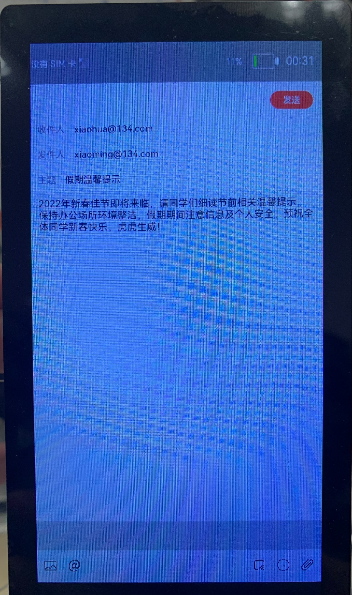
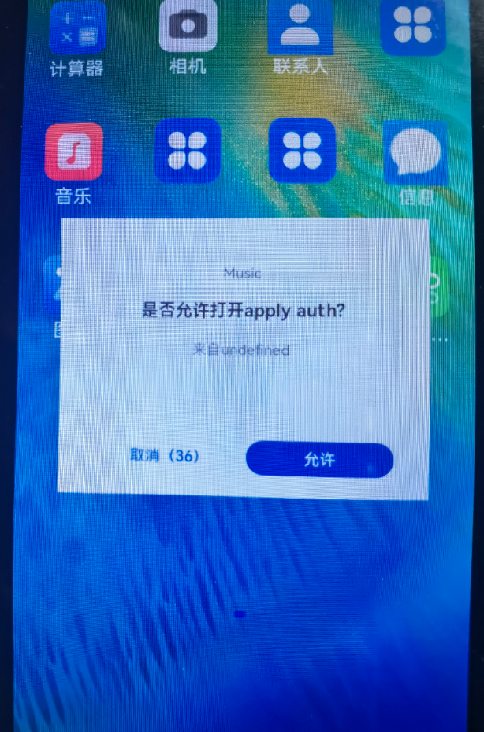
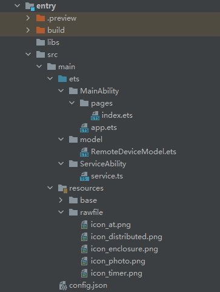

# 概述<a name="ZH-CN_TOPIC_0000001213976556"></a>

本篇Codelab是基于TS扩展的声明式开发范式编程语言编写的一个分布式邮件系统，可以由一台设备拉起另一台设备，每次改动邮件内容，都会同步更新两台设备的信息。效果图如下：



# 搭建OpenHarmony开发环境<a name="ZH-CN_TOPIC_0000001214139914"></a>

完成本篇Codelab我们首先要完成开发环境的搭建，本示例以**Hi3516DV300**开发板为例，参照以下步骤进行：

1.  [获取OpenHarmony系统版本](https://gitee.com/openharmony/docs/blob/master/zh-cn/device-dev/get-code/sourcecode-acquire.md#%E8%8E%B7%E5%8F%96%E6%96%B9%E5%BC%8F3%E4%BB%8E%E9%95%9C%E5%83%8F%E7%AB%99%E7%82%B9%E8%8E%B7%E5%8F%96)：标准系统解决方案（二进制）。

    以3.0版本为例：

    

2.  搭建烧录环境。

    1.  [完成DevEco Device Tool的安装](https://gitee.com/openharmony/docs/blob/master/zh-cn/device-dev/quick-start/quickstart-standard-env-setup.md)

    2.  [完成Hi3516开发板的烧录](https://gitee.com/openharmony/docs/blob/master/zh-cn/device-dev/quick-start/quickstart-lite-steps-hi3516-burn.md)

3.  搭建开发环境。
    1.  开始前请参考[工具准备](https://gitee.com/openharmony/docs/blob/master/zh-cn/application-dev/quick-start/start-overview.md#%E5%B7%A5%E5%85%B7%E5%87%86%E5%A4%87)，完成DevEco Studio的安装和开发环境配置。
    2.  开发环境配置完成后，请参考[使用工程向导](https://gitee.com/openharmony/docs/blob/master/zh-cn/application-dev/quick-start/start-with-ets.md#%E5%88%9B%E5%BB%BAets%E5%B7%A5%E7%A8%8B)创建工程（模板选择“Empty Ability”），选择JS或者eTS语言开发。
    3.  工程创建完成后，选择使用[真机进行调测](https://gitee.com/openharmony/docs/blob/master/zh-cn/application-dev/quick-start/start-with-ets.md#%E4%BD%BF%E7%94%A8%E7%9C%9F%E6%9C%BA%E8%BF%90%E8%A1%8C%E5%BA%94%E7%94%A8)。

# 分布式组网<a name="ZH-CN_TOPIC_0000001214299870"></a>

本章节以系统自带的音乐播放器为例，介绍如何完成两台设备的分布式组网。

1.  硬件准备：准备两台烧录相同的版本系统的**Hi3516DV300**开发板A、B、一根网线及TYPE-C转USB线。
2.  保证开发板A、B上电开机状态，网线两端分别连接开发板A、B的网口，将TYPE-C转USB线先连接A，使用hdc\_std.exe，在命令行输入hdc\_std shell ifconfig eth0 192.168.3.125，设置成功后，将TYPE-C转USB线连接B，在命令行输入hdc\_std shell ifconfig eth0 192.168.3.126即可。
3.  将设备A，B设置为互相信任的设备。

    -   找到系统应用“音乐”。

    

    -   设备A打开音乐，点击左下角流转按钮，弹出列表框，在列表中会展示远端设备的id。

        

    -   选择远端设备B的id，另一台开发板（设备B）会弹出验证的选项框。

        

    -   设备B点击允许，设备B将会弹出随机PIN码，将设备B的PIN码输入到设备A的PIN码填入框中。

    

    配网完毕。

# 代码结构解读<a name="ZH-CN_TOPIC_0000001259259791"></a>

本篇Codelab只对核心代码进行讲解，首先来介绍下整个工程的代码结构：



-   MainAbility：存放应用主页面。
    -   pages/index.ets：应用主页面。

-   model：存放获取组网内的设备列表相关文件。
    -   RemoteDeviceModel.ets：获取组网内的设备列表。

-   ServiceAbility：存放ServiceAbility相关文件。
    -   service.ts：service服务，用于跨设备连接后通讯。

-   resources ：存放工程使用到的资源文件。
    -   resources/rawfile：存放工程中使用的图片资源文件。

-   config.json：配置文件。

# 实现页面布局和样式<a name="ZH-CN_TOPIC_0000001258859829"></a>

在本章节中，您将学会如何制作一个简单的邮件界面。

1.  实现主页面布局和样式。
    -   在MainAbility/pages/index.ets 主界面文件中布局整个邮件页面，包括收件人、发件人、主题、内容等等，代码如下：

        ```
        @Entry
        @Component
        struct Index {
          private imageList: any[]= []
          @Provide dataList: string[]= ['xiaohua@128.com','xiaoming@128.com','假期温馨提示','2022年新春佳节即将来临，请同学们细读节前相关温馨提示，保持办公场所环境整洁，假期期间注意信息及个人安全，预祝全体同学新春快乐，虎虎生威！']
        
          dialogController: CustomDialogController = new CustomDialogController({
            builder: CustomDialogExample({ cancel: this.onCancel, confirm: this.onAccept }),
            cancel: this.existApp,
            autoCancel: true
          })
        
          build() {
            Flex({ direction: FlexDirection.Column, justifyContent: FlexAlign.SpaceBetween }) {
              Column() {
                Row() {
                  Flex({ direction: FlexDirection.Row, justifyContent: FlexAlign.SpaceBetween, alignItems: ItemAlign.Center }) {
                    Text('✕').fontSize(20).fontColor('#000000')
                    Button('发送').width(70).fontSize(14).fontColor('#ffffff').backgroundColor('#fc4646')
                      .onClick(() => {
                        RegisterDeviceListCallback();
                        this.dialogController.open();
                      })
                  }
                  .height(50)
                  .padding({ top: 10, right: 15, bottom: 10, left: 15 })
                }
        
                Column() {
                  Flex({ direction: FlexDirection.Row, alignItems: ItemAlign.Center }) {
                    Text('收件人').width(70).height(30).fontSize(15).fontColor('#969393')
                    Text(this.dataList[0]).width('100%').height(30).fontSize(15).fontColor('#000000')
                  }
                  .padding({ top: 5, right: 15, bottom: 5, left: 15 })
        
                  Text().width('100%').height(1).backgroundColor('#f8f6f6')
        
                  Flex({ direction: FlexDirection.Row, alignItems: ItemAlign.Center }) {
                    Text('发件人').width(70).height(30).fontSize(15).fontColor('#969393')
                    Text(this.dataList[1]).width('100%').height(30).fontSize(15).fontColor('#000000')
                  }
                  .padding({ top: 5, right: 15, bottom: 5, left: 15 })
        
                  Text().width('100%').height(1).backgroundColor('#f8f6f6')
        
                  Flex({ direction: FlexDirection.Row, alignItems: ItemAlign.Center }) {
                    Text('主题').width(50).height(30).fontSize(15).fontColor('#969393')
                    Text(this.dataList[2]).width('100%').height(30).fontSize(15).fontColor('#000000')
                  }
                  .padding({ top: 5, right: 15, bottom: 5, left: 15 })
        
                  Text().width('100%').height(1).backgroundColor('#f8f6f6')
                  TextArea({ placeholder: 'input your word', text: this.dataList[3]}).height('100%').width('100%')
                    .onChange((value: string) => {
                      this.dataList[3] = value
                      if(mRemote){
                        sendMessageToRemoteService(JSON.stringify(this.dataList));
                      }
                        onDisconnectService();
                  })
                }
              }
        
              Column() {
                Flex({ direction: FlexDirection.Row }) {
                  List() {
                    ForEach(this.imageList, (item) => {
                      ListItem() {
                        Image(item).width(50).height(50).objectFit(ImageFit.Contain)
                      }.editable(true)
                    }, item => item)
                  }
                  .listDirection(Axis.Horizontal) // 排列方向
                  .divider({ strokeWidth: 2, color: 0xFFFFFF, startMargin: 20, endMargin: 20 }) // 每行之间的分界线
                }.width('100%').height(50).backgroundColor('#ccc')
        
                Text().width('100%').height(1).backgroundColor('#f8f6f6')
                Flex({ direction: FlexDirection.Row, justifyContent: FlexAlign.SpaceBetween }) {
                  Flex({ direction: FlexDirection.Row, alignItems: ItemAlign.Center }) {
                    Button({ stateEffect: false }) {
                      Image($rawfile('icon_photo.png')).width(20).height(20)
                    }.backgroundColor('#ffffff').margin({ right: 20 })
                    .onClick(() => {
                      RegisterDeviceListCallback();
                      this.dialogController.open();
                    })
        
                    Button({ stateEffect: false }) {
                      Image($rawfile('icon_at.png')).width(20).height(20)
                    }.backgroundColor('#ffffff')
                  }
        
                  Flex({ direction: FlexDirection.Row, justifyContent: FlexAlign.End }) {
                    Button({ stateEffect: false }) {
                      Image($rawfile('icon_distributed.png')).width(20).height(20)
                    }.backgroundColor('#ffffff')
                    .onClick(() => {
                       this.getDeviceList()
                    })
        
                    Button({ stateEffect: false }) {
                      Image($rawfile('icon_timer.png')).width(20).height(20)
                    }.backgroundColor('#ffffff').margin({ left: 10, right: 10 })
        
                    Button({ stateEffect: false }) {
                      Image($rawfile('icon_enclosure.png')).width(20).height(20)
                    }.backgroundColor('#ffffff')
                  }
                }.height(50).padding(15)
              }
            }.width('100%').padding({ top: 5, bottom: 15 })
          }
        }
        ```

        在入口组件的生命周期函数aboutToAppear\(\)中调用订阅事件。如果Ability是被其他设备拉起的，在aboutToAppear\(\)中调用featureAbility.getWant\(\)，可通过want中的参数重新初始化dataList数组，入口组件的生命周期函数aboutToAppear\(\)代码如下：

        ```
        async aboutToAppear() {
            this.subscribeEvent();
            let self = this;
            // 当被拉起时，通过want传递的参数同步对端界面UI
            await featureAbility.getWant((error, want) => {
              var status = want.parameters;
              if (want.parameters.dataList) {
                self.dataList = JSON.parse(status.dataList)
                // 远端被拉起后，连接对端的service
                if (want.parameters.remoteDeviceId) {
                  let remoteDeviceId = want.parameters.remoteDeviceId
                  onConnectRemoteService(remoteDeviceId)
                }
              }
            });
          }


2.  给"发送"按钮添加点击事件。

    点击"发送"按钮，调用拉起弹窗函数，弹窗中显示可拉起的同局域网下的设备，代码如下：

    ```
    Button('发送').width(70).fontSize(14).fontColor('#ffffff').backgroundColor('#fc4646')
          .onClick(() => {
            RegisterDeviceListCallback();
            this.dialogController.open();
          })
    ```

3.  给内容区域Textarea添加onChange事件。

    内容区域文字变化会调用onChange\(\)方法，每一次的变化都会调用sendMessageToRemoteService\(\)方法去同步另一个设备的数据。其中onChange\(\)和sendMessageToRemoteService\(\)方法代码如下：

    ```
    TextArea({ placeholder: 'input your word', text: this.dataList[3]}).height('100%').width('100%')
        .onChange((value: string) => {
          this.dataList[3] = value
          if(mRemote){
            sendMessageToRemoteService(JSON.stringify(this.dataList));
          }
          onDisconnectService();
      })
    ```

    ```
      async function sendMessageToRemoteService(dataList) {
      if (mRemote == null) {
        prompt.showToast({
          message: "mRemote is null"
        });
        return;
      }
      let option = new rpc.MessageOption();
      let data = new rpc.MessageParcel();
      let reply = new rpc.MessageParcel();
      data.writeStringArray(JSON.parse(dataList));
      prompt.showToast({
        message: "sendMessageToRemoteService" + dataList,
        duration: 3000
      });
    
      await mRemote.sendRequest(1, data, reply, option);
      let msg = reply.readInt();
    
    }
    ```

# 拉起远端FA及连接远端Service服务<a name="ZH-CN_TOPIC_0000001259099833"></a>

在本章节中，您将学会如何拉起在同一组网内的设备上的FA，并且连接远端Service服务。

1.  调用featureAbility.startAbility\(\)方法，拉起远端FA，并同步界面UI。

    点击"分布式拉起"按钮，调用RegisterDeviceListCallback\(\)发现设备列表，并弹出设备列表选择框CustomDialogExample，选择设备后拉起远端FA。CustomDialogExample\(\)代码如下：

    ```
    // 设备列表弹出框
    @CustomDialog
    struct CustomDialogExample {
      @State editFlag: boolean = false
      @Consume imageIndexForPosition : number[]
      @Consume pictureList: string[]
      controller: CustomDialogController
      cancel: () => void
      confirm: () => void
      build() {
        Column() {
          List({ space: 10, initialIndex: 0 }) {
            ForEach(DeviceIdList, (item) => {
              ListItem() {
                Row() {
                  Text(item)
                    .width('87%').height(50).fontSize(10)
                    .textAlign(TextAlign.Center).borderRadius(10).backgroundColor(0xFFFFFF)
                    .onClick(() => {
                      onStartRemoteAbility(item,this.imageIndexForPosition,this.pictureList);
                      this.controller.close();
                    })
                  Radio({value:item})
                    .onChange((isChecked) => {
                      onStartRemoteAbility(item,this.imageIndexForPosition,this.pictureList);
                      this.controller.close();
                    }).checked(false)
                }
              }.editable(this.editFlag)
            }, item => item)
          }
        }.width('100%').height(200).backgroundColor(0xDCDCDC).padding({ top: 5 })
      }
    }
    ```

    点击Text组件或者Radio组件都会调用onStartRemoteAbility\(\)方法拉起远端FA，onStartRemoteAbility\(\)代码如下：

    ```
    function onStartRemoteAbility(deviceId,imageIndexForPosition,pictureList: string[]) {
      AuthDevice(deviceId);
      let numDevices = remoteDeviceModel.deviceList.length;
      if (numDevices === 0) {
        prompt.showToast({
          message: "onStartRemoteAbility no device found"
        });
        return;
      }
    
      var params = {
        imageIndexForPosition: JSON.stringify(imageIndexForPosition),
        pictureList : JSON.stringify(pictureList),
        remoteDeviceId : localDeviceId
      }
      var wantValue = {
        bundleName: 'com.huawei.cookbook',
        abilityName: 'com.example.openharmonypicturegame.MainAbility',
        deviceId: deviceId,
        parameters: params
      };
      featureAbility.startAbility({
        want: wantValue
      }).then((data) => {
        // 拉起远端后，连接远端service
        onConnectRemoteService(deviceId)
      });
    }
    ```

2.  调用featureAbility.connectAbility方法，连接远端Service服务，连接成功后返回remote对象。

    在featureAbility.startAbility\(\)成功的回调中调用onConnectRemoteService\(\)方法，onConnectRemoteService\(\)方法代码如下：

    ```
    // 连接远端Service
    async function onConnectRemoteService(deviceId) {
      // 连接成功的回调
      async function onConnectCallback(element, remote) {
         mRemote = remote;
      }
      // Service异常死亡的回调
      function onDisconnectCallback(element) {
      }
      // 连接失败的回调
      function onFailedCallback(code) {
        prompt.showToast({
          message: "onConnectRemoteService onFailed: " + code
        });
      }
      let numDevices = remoteDeviceModel.deviceList.length;
      if (numDevices === 0) {
        prompt.showToast({
          message: "onConnectRemoteService no device found"
        });
        return;
      }
      connectedAbility = await featureAbility.connectAbility(
        {
          deviceId: deviceId,
          bundleName: "com.huawei.cookbook",
          abilityName: "com.example.openharmonypicturegame.ServiceAbility",
        },
        {
          onConnect: onConnectCallback,
          onDisconnect: onDisconnectCallback,
          onFailed: onFailedCallback,
        },
      );
    }
    ```

    在配置文件config.json需要设置ServiceAbility的属性visible为true，代码如下：

    ```
    "abilities": [
          ...
          {
            "visible": true,
            "srcPath": "ServiceAbility",
            "name": ".ServiceAbility",
            "icon": "$media:icon",
            "srcLanguage": "ets",
            "description": "$string:description_serviceability",
            "type": "service"
          }
    ],
    ```

    同时，Service侧也需要在onConnect\(\)时返回IRemoteObject，从而定义与Service进行通信的接口。onConnect\(\)需要返回一个IRemoteObject对象，OpenHarmony提供了IRemoteObject的默认实现，通过继承rpc.RemoteObject来创建自定义的实现类。

    Service侧把自身的实例返回给调用侧的代码如下：

    ```
    import rpc from "@ohos.rpc";
    import commonEvent from '@ohos.commonEvent';
    class FirstServiceAbilityStub extends rpc.RemoteObject{
        constructor(des) {
            if (typeof des === 'string') {
                super(des);
            } else {
                return null;
            }
        }
        onRemoteRequest(code, data, reply, option) {
            if (code === 1) {
                let arr = data.readIntArray();
                reply.writeInt(100);
                // 发布公共事件相关流程
    	    ...
    
    
            } else {
            }
            return true;
        }
    }
    
    export default {
        // 创建Service的时候调用，用于Service的初始化
        onStart() {
        },
        // 在Service销毁时调用。Service应通过实现此方法来清理任何资源，如关闭线程、注册的侦听器等。
        onStop() {
        },
        // 在Ability和Service连接时调用，该方法返回IRemoteObject对象，开发者可以在该回调函数中生成对应Service的IPC通信通道
        onConnect(want) {
            try {
                let value = JSON.stringify(want);
            } catch(error) {
            }
            return new FirstServiceAbilityStub("[pictureGame] first ts service stub");
        },
        // 在Ability与绑定的Service断开连接时调用
        onDisconnect(want) {
            let value = JSON.stringify(want);
        },
        // 在Service创建完成之后调用，该方法在客户端每次启动该Service时都会调用
        onCommand(want, startId) {
            let value = JSON.stringify(want);
        }
    };
    ```

# RPC跨设备通讯<a name="ZH-CN_TOPIC_0000001213979944"></a>

在本章节中，您将学会在成功连接远端Service服务的前提下，如何利用RPC进行跨设备通讯。

1.  成功连接远端Service服务的前提下，在正文部分增删文字，都会完成一次跨设备通讯，假如在设备A端输入文字，消息的传递是由设备A端的FA传递到设备B的Service服务，发送消息的方法sendMessageToRemoteService\(\)代码如下：

    ```
    // 连接成功后发送消息
    async function sendMessageToRemoteService(imageIndexForPosition) {
      if (mRemote == null) {
        prompt.showToast({
          message: "mRemote is null"
        });
        return;
      }
      let option = new rpc.MessageOption();
      let data = new rpc.MessageParcel();
      let reply = new rpc.MessageParcel();
      data.writeIntArray(JSON.parse(imageIndexForPosition));
      await mRemote.sendRequest(1, data, reply, option);
      let msg = reply.readInt();
    }
    ```

2.  在B端的Service接收消息，当A端成功连接B端Service服务后，在A端会返回一个remote对象，当A端remote对象调用sendRequest\(\)方法后，在B端的Service中的onRemoteRequest\(\)方法中会接收到发送的消息，其中继承rpc.RemoteObject的类和onRemoteRequest\(\)方法代码如下：

    ```
    class FirstServiceAbilityStub extends rpc.RemoteObject{
        constructor(des) {
            if (typeof des === 'string') {
                super(des);
            } else {
                return null;
            }
        }
    
        onRemoteRequest(code, data, reply, option) {
            if (code === 1) {
                // 从data中接收数据
                let arr = data.readIntArray();
                // 回复接收成功标识
                reply.writeInt(100);
                // 发布公共事件相关流程
               ...
    
            } else {
            }
            return true;
        }
    }
    ```

# FA订阅公共事件<a name="ZH-CN_TOPIC_0000001259019769"></a>

在本章节中，您将学会如何通过CommonEvent订阅公共事件，详细信息请参考[CommonEvent开发指南](https://gitee.com/openharmony/docs/blob/master/zh-cn/application-dev/reference/apis/js-apis-commonEvent.md)。在九宫格组件PictureGrid的生命周期函数aboutToAppear\(\)中，调用订阅公共事件方法subscribeEvent\(\)，用来订阅"publish\_moveImage"公共事件，subscribeEvent\(\)代码如下：

```
 subscribeEvent(){
    let self = this;
    // 用于保存创建成功的订阅者对象，后续使用其完成订阅及退订的动作
    var subscriber; 
    // 订阅者信息
    var subscribeInfo = {
      events: ["publish_moveImage"],
      priority: 100

    };

    // 设置有序公共事件的结果代码回调
    function SetCodeCallBack(err) {
    }
    // 设置有序公共事件的结果数据回调
    function SetDataCallBack(err) {
    }
    // 完成本次有序公共事件处理回调
    function FinishCommonEventCallBack(err) {
    }
    // 订阅公共事件回调
    function SubscribeCallBack(err, data) {
      let msgData = data.data;
      let code = data.code;
      // 设置有序公共事件的结果代码
      subscriber.setCode(code, SetCodeCallBack);
      // 设置有序公共事件的结果数据
      subscriber.setData(msgData, SetDataCallBack);
      // 完成本次有序公共事件处理
      subscriber.finishCommonEvent(FinishCommonEventCallBack)
      // 处理接收到的数据data
      self.imageIndexForPosition = data.parameters.imageIndexForPosition;
      self.pictureList = [];
      self.imageIndexForPosition.forEach(value => {
        if (value == 9) {
          self.pictureList.push("--")
        } else {
          self.pictureList.push(`picture_0` + value + `.png`)
        }
      });

      self.onFinish();
    }

    // 创建订阅者回调
    function CreateSubscriberCallBack(err, data) {
      subscriber = data;
      // 订阅公共事件
      commonEvent.subscribe(subscriber, SubscribeCallBack);
    }

    // 创建订阅者
    commonEvent.createSubscriber(subscribeInfo, CreateSubscriberCallBack);
 }
```

在FA中订阅到Service服务发布的"publish\_moveImage"事件后，在SubscribeCallBack\(\)回调中重新赋值imageIndexForPosition数组与pictureList数组，从而同步更新界面UI。


# service发布公共事件<a name="ZH-CN_TOPIC_0000001213819950"></a>

在本章节中，您将学会如何通过CommonEvent发布公共事件，详细信息请参考[CommonEvent开发指南](https://gitee.com/openharmony/docs/blob/master/zh-cn/application-dev/reference/apis/js-apis-commonEvent.md)。

当Service服务接收到消息后，在onRemoteRequest\(\)发布公共事件，代码如下：

```
onRemoteRequest(code, data, reply, option) {
    if (code === 1) {
	// 从data中接收数据
	let arr = data.readIntArray();
	// 回复接收成功标识
	reply.writeInt(100);
	// 公共事件相关信息
	var params ={
	    imageIndexForPosition: arr
	}
	var options = {
            // 公共事件的初始代码
	    code: 1,
            // 公共事件的初始数据			
	    data: 'init data',、
            // 有序公共事件 	        
	    isOrdered: true, 	
	    bundleName: 'com.huawei.cookbook',
	    parameters: params

        }
	// 发布公共事件回调
	function PublishCallBack() {
	}
	// 发布公共事件
	commonEvent.publish("publish_moveImage", options, PublishCallBack);

	} else {
	}
	return true;
 }
```

在接收到消息后，把接收到的图片位置数组放入params中，然后发布名称为"publish\_moveImage"的有序公共事件。

# 总结<a name="ZH-CN_TOPIC_0000001214299872"></a>

-   应用间跨设别通讯是通过featureAbility.connectAbility连接远端Service服务成功后，再通过RPC相关API来进行消息传递。
-   应用内Service与FA之间可通过CommonEvent发布与订阅公共事件来完成通讯。
-   本篇Codelab在设备A与设备B通讯流程如下：
    1.  设备A与设备B在组网成功的前提下，设备A通过featureAbility.startAbility\(\)拉起设备B的Ability，并把设备A的deviceId作为参数传递给设备B的Ability，在设备B接收到参数的同时，通过featureAbility.connectAbility\(\)连接设备A的Service服务，在设备B中返回一个remote对象，该remote对象可将设备B的消息发送到设备A的Service服务。
    2.  在设备A侧，拉起设备B的Ability的成功回调中，设备A通过featureAbility.connectAbility\(\)连接设备B的Service服务，在设备A中返回一个remote对象，该remote对象可将设备A的消息发送到设备B的Service服务。
    3.  设备A侧通过remote.sendRequest\(\)将消息发送到设备B侧Service服务，设备B侧的Service服务中的onRemoteRequest\(\)接收消息。
    4.  设备B侧的Service中的onRemoteRequest\(\)接收到消息后，通过CommonEvent发布公共事件，将该消息发布出去。
    5.  设备B侧的Ability订阅该事件，用来接收发布的消息并做最后的处理。


