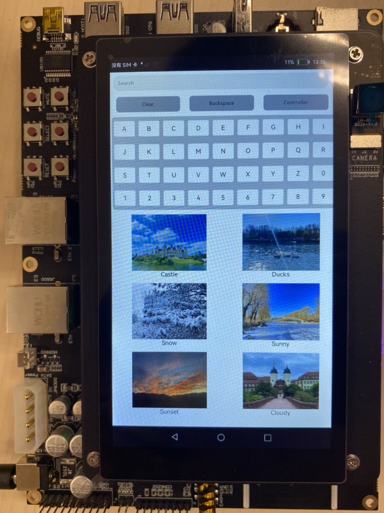
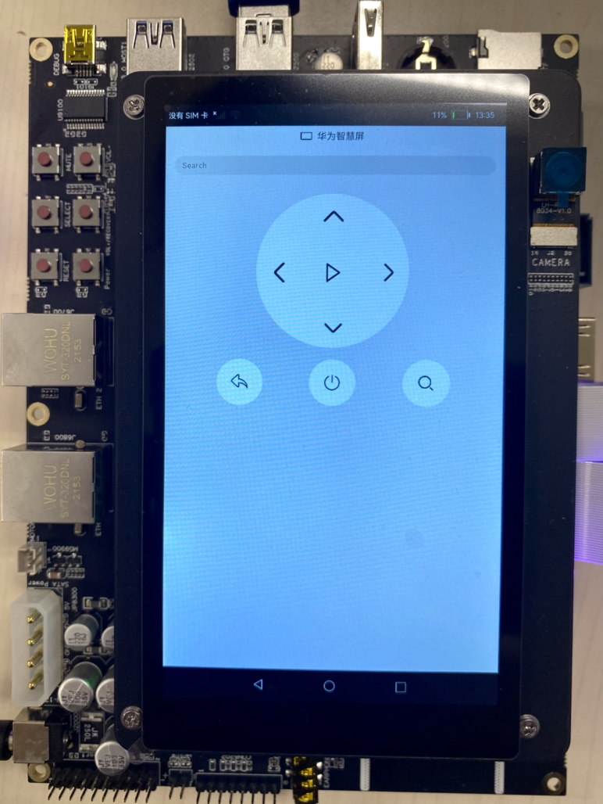
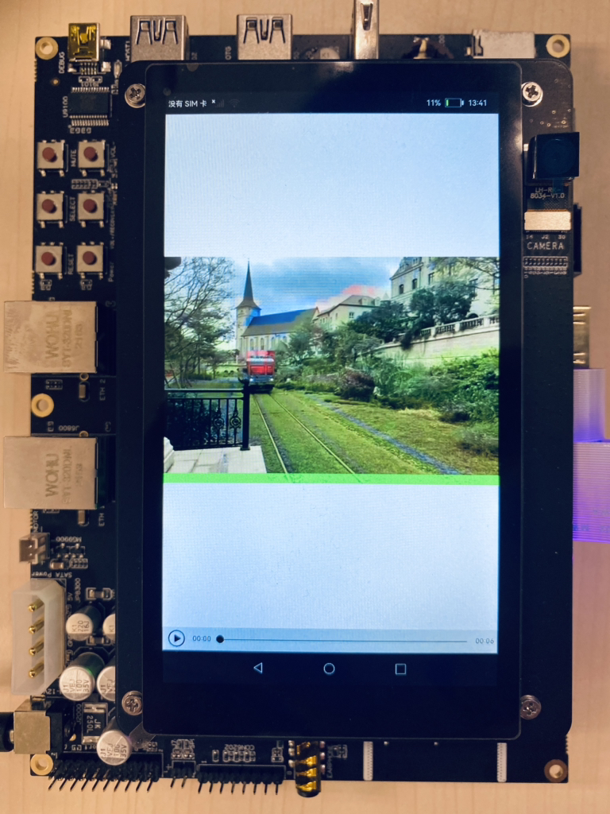
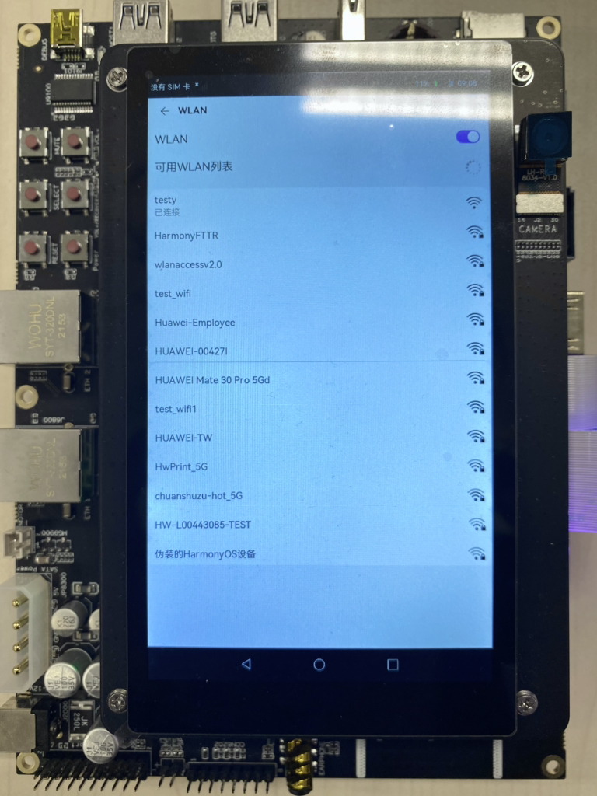
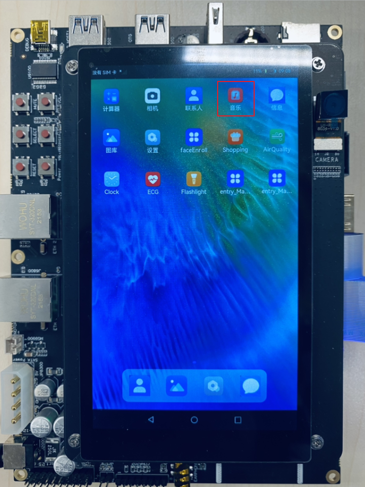
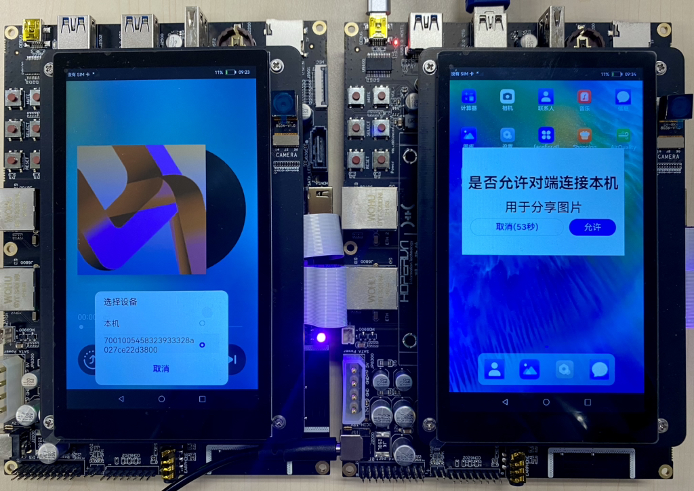
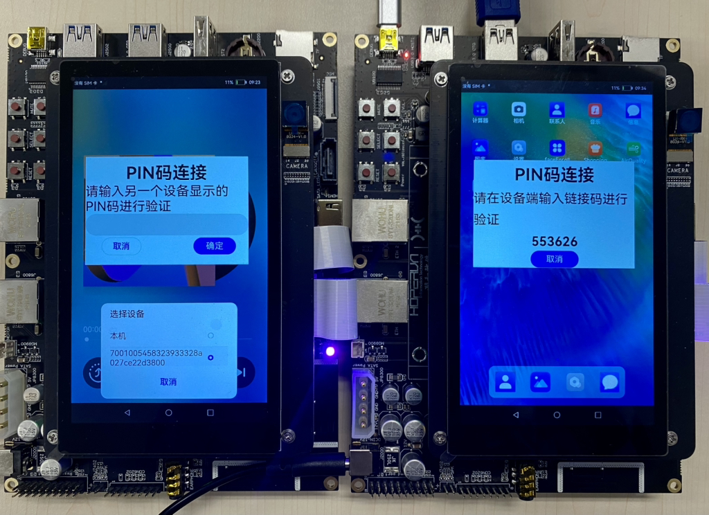
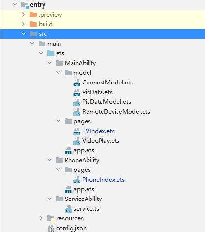

# 1.概述

目前家庭电视机主要通过其自带的遥控器进行操控，实现的功能较为单一。例如，当我们要在TV端搜索节目时，电视机在遥控器的操控下往往只能完成一些字母或数字的输入，而无法输入其他复杂的内容。分布式遥控器将手机的输入能力和电视遥控器的遥控能力结合为一体，从而快速便捷操控电视。

分布式遥控器的实现基于OpenHarmony的分布式能力和RPC通信能力，UI使用eTS进行开发。如下图所示，分别用两块开发板模拟TV端和手机端。

1.  分布式组网后可以通过TV端界面的Controller按钮手动拉起手机端的遥控界面，在手机端输入时会将输入的内容同步显示在TV端搜索框，点击搜索按钮会根据输入的内容搜索相关节目。
2.  还可以通过点击方向键（上下左右）将焦点移动到我们想要的节目上，再点击播放按钮进行播放，按返回按钮返回TV端主界面。
3.  同时还可以通过手机遥控端关机按钮同时关闭TV端和手机端界面。

UI效果图如下：

**图1 TV端主页默认页面**



-   **图2 手机端遥控页面**

    

    -   **图3 TV端视频播放页面**

    

> **说明：** 
>本示例涉及使用系统接口，需要手动替换Full SDK才能编译通过，具体操作可参考[替换指南](https://gitee.com/openharmony/docs/blob/master/zh-cn/application-dev/quick-start/full-sdk-switch-guide.md)。

# 2.搭建OpenHarmony环境

完成本篇Codelab我们首先要完成开发环境的搭建，本示例以**RK3568**开发板为例，参照以下步骤进行：

1. [获取OpenHarmony系统版本](https://gitee.com/openharmony/docs/blob/master/zh-cn/device-dev/get-code/sourcecode-acquire.md#%E8%8E%B7%E5%8F%96%E6%96%B9%E5%BC%8F3%E4%BB%8E%E9%95%9C%E5%83%8F%E7%AB%99%E7%82%B9%E8%8E%B7%E5%8F%96)：标准系统解决方案（二进制）。

   以3.1版本为例：

   

2. 搭建烧录环境。

    1. [完成DevEco Device Tool的安装](https://gitee.com/openharmony/docs/blob/master/zh-cn/device-dev/quick-start/quickstart-ide-env-win.md)
    2.  [完成RK3568开发板的烧录](https://gitee.com/openharmony/docs/blob/master/zh-cn/device-dev/quick-start/quickstart-ide-3568-burn.md)

3. 搭建开发环境。

   1.  开始前请参考[工具准备](https://gitee.com/openharmony/docs/blob/master/zh-cn/application-dev/quick-start/start-overview.md#%E5%B7%A5%E5%85%B7%E5%87%86%E5%A4%87)，完成DevEco Studio的安装和开发环境配置。
   2.  开发环境配置完成后，请参考[使用工程向导](https://gitee.com/openharmony/docs/blob/master/zh-cn/application-dev/quick-start/start-with-ets-fa.md#%E5%88%9B%E5%BB%BAets%E5%B7%A5%E7%A8%8B)创建工程（模板选择“Empty Ability”），选择JS或者eTS语言开发。
   3.  工程创建完成后，选择使用[真机进行调测](https://gitee.com/openharmony/docs/blob/master/zh-cn/application-dev/quick-start/start-with-ets-fa.md#%E4%BD%BF%E7%94%A8%E7%9C%9F%E6%9C%BA%E8%BF%90%E8%A1%8C%E5%BA%94%E7%94%A8)。

# 3.分布式组网

本章节以系统自带的音乐播放器为例（具体以实际的应用为准），介绍如何完成两台设备的分布式组网。

1. 硬件准备：准备两台烧录相同的版本系统的**RK3568**开发板A、B。

2. 开发板A、B连接同一个WiFi网络。

   打开设置--\>WLAN--\>点击右侧WiFi开关--\>点击目标WiFi并输入密码。

   

3. 将设备A，B设置为互相信任的设备。

   - 找到系统应用“音乐”。

     

   - 设备A打开音乐，点击左下角流转按钮，弹出列表框，在列表中会展示远端设备的id。选择远端设备B的id，另一台开发板（设备B）会弹出验证的选项框。

     

   - 设备B点击允许，设备B将会弹出随机PIN码，将设备B的PIN码输入到设备A的PIN码填入框中。

     

   配网完毕。

# 4.代码结构解读

本篇Codelab只对核心代码进行讲解，首先来介绍下整个工程的代码结构：



-   MainAbility：
    -   model：数据模型。
        -   RemoteDeviceModel.ets：获取组网内的设备列表模型。
        -   PicData.ets：图片信息数据。
        -   PicDataModel.ets：图片信息模型。
        -   ConnectModel.ets：连接远端Service和发送消息模型。

    -   pages：存放TV端各个页面。
        -   TVindex.ets：TV端主页面。
        -   VideoPlay.ets：TV端视频播放页面。


-   PhoneAbility：存放应用手机控制端主页面。
    -   pages/PhoneIndex.ets：手机控制端主页面。

-   ServiceAbility：存放ServiceAbility相关文件。
    -   service.ts：service服务，用于跨设备连接后通讯。

-   resources ：存放工程使用到的资源文件。
    -   resources/rawfile：存放工程中使用的图片资源文件。

-   config.json：配置文件。

# 5.实现TV端界面

在本章节中，您将学会开发TV端默认界面和TV端视频播放界面，示意图参考第一章图1和图3所示。

建立数据模型，将图片ID、图片源、图片名称和视频源绑定成一个数据模型。详情代码可以查看MainAbility/model/PicData.ets和MainAbility/model/PicDataModel.ets两个文件。

1. 实现TV端默认页面布局和样式。

   - 在MainAbility/pages/TVIndex.ets 主界面文件中添加入口组件。页面布局代码如下：

     ```
     // 入口组件
     @Entry
     @Component
     struct Index {
       private letters: string[] = ['A', 'B', 'C', 'D', 'E', 'F', 'G', 'H', 'I', 'J', 'K', 'L', 'M', 'N', 'O', 'P', 'Q', 'R', 'S', 'T', 'U', 'V', 'W', 'X', 'Y', 'Z', '0', '1', '2', '3', '4', '5', '6', '7', '8', '9']
       private source: string
       @State text: string = ''
       @State choose: number = -1
     
       build() {
         Flex({ direction: FlexDirection.Column }) {
           TextInput({text: this.text, placeholder: 'Search' })
             .onChange((value: string) => {
               this.text = value
             })
     
           Row({space: 30}) {
             Text('Clear')
               .fontSize(16)
               .backgroundColor('#ABB0BA')
               .textAlign(TextAlign.Center)
               .onClick(() => {
                 this.text = ''
               })
               .clip(true)
               .borderRadius(10)
     
             Text('Backspace')
               .fontSize(16)
               .backgroundColor('#ABB0BA')
               .textAlign(TextAlign.Center)
               .onClick(() => {
                 this.text = this.text.substring(0, this.text.length - 1)
               })
               .clip(true)
               .borderRadius(10)
     
             Text('Controller')
               .fontSize(16)
               .backgroundColor('#ABB0BA')
               .textAlign(TextAlign.Center)
               .onClick(() => {
                 ......
               })
               .clip(true)
               .borderRadius(10)
     
           }
     
           Grid() {
             ForEach(this.letters, (item) => {
               GridItem() {
                 Text(item)
                   .fontSize(20)
                   .backgroundColor('#FFFFFF')
                   .textAlign(TextAlign.Center)
                   .onClick(() => {
                     this.text += item
                     })
                   .clip(true)
                   .borderRadius(5)
               }
             }, item => item)
     
           }
           .rowsTemplate('1fr 1fr 1fr 1fr')
           .columnsTemplate('1fr 1fr 1fr 1fr 1fr 1fr 1fr 1fr 1fr')
           .columnsGap(8)
           .rowsGap(8)
           .width('75%')
           .height('25%')
           .margin(5)
           .backgroundColor('#D2D3D8')
           .clip(true)
           .borderRadius(10)
     
           Grid() {
             ForEach(this.picItems, (item: PicData) => {
               GridItem() {
                 PicGridItem({ picItem: item })
               }
             }, (item: PicData) => item.id.toString())
           }
           .rowsTemplate('1fr 1fr 1fr')
           .columnsTemplate('1fr 1fr')
           .columnsGap(5)
           .rowsGap(8)
           .width('90%')
           .height('58%')
           .backgroundColor('#FFFFFF')
           .margin(5)
         }
         .width('98%')
         .backgroundColor('#FFFFFF')
       }
     }
     ```

   - 其中PicGridItem将PicItem的图片源和图片名称绑定，实现代码如下：

     ```
     // 九宮格拼图组件
     @Component
     struct PicGridItem {
       private picItem: PicData
       build() {
         Column() {
           Image(this.picItem.image)
             .objectFit(ImageFit.Contain)
             .height('85%')
             .width('100%')
             .onClick(() => {
               ......
               })
             })
           Text(this.picItem.name)
             .fontSize(20)
             .fontColor('#000000')
         }
         .height('100%')
         .width('90%')
       }
     }
     ```

2. 实现TV端视频播放界面。

   - 在MainAbility/pages/VideoPlay.ets 文件中添加组件。页面布局代码如下：

     ```
     import router from '@system.router'
     @Entry
     @Component
     struct Play {
     // 取到Index页面跳转来时携带的source对应的数据。
       private source: string = router.getParams().source
     
       build() {
         Column() {
           Video({
             src: this.source,
           })
             .width('100%')
             .height('100%')
             .autoPlay(true)
             .controls(true)
         }
       }
     }
     ```

   - 在MainAbility/pages/TVIndex.ets中，给PicGridItem的图片添加点击事件，点击图片即可播放PicItem的视频源。实现代码如下:

     ```
           Image(this.picItem.image)
             ......
             .onClick(() => {
               router.push({
                 uri: 'pages/VideoPlay',
                 params: { source: this.picItem.video }
               })
             })
     ```

# 6.实现手机遥控端界面

在本章节中，您将学会开发手机遥控端默认界面，示意图参考第一章图2所示。

- PhoneAbility/pages/PhoneIndex.ets 主界面文件中添加入口组件。页面布局代码如下：

  ```
  @Entry
  @Component
  struct Index {
    build() {
      Flex({ direction: FlexDirection.Column, alignItems: ItemAlign.Center }) {
        Row() {
          Image($rawfile('TV.png'))
            .width(25)
            .height(25)
          Text('华为智慧屏').fontSize(20).margin(10)
        }
        // 文字搜索框
        TextInput({ placeholder: 'Search' })
          .margin(20)
          .onChange((value: string) => {
            if (connectModel.mRemote){
              ......
            }
          })
  
        Grid() {
          GridItem() {
        // 向上箭头
            Button({ type: ButtonType.Circle, stateEffect: true }) {
              Image($rawfile('up.png')).width(80).height(80)
            }
            .onClick(() => {
              ......
            })
            .width(80)
            .height(80)
            .backgroundColor('#FFFFFF')
          }
          .columnStart(1)
          .columnEnd(5)
  
          GridItem() {
        // 向左箭头
            Button({ type: ButtonType.Circle, stateEffect: true }) {
              Image($rawfile('left.png')).width(80).height(80)
            }
            .onClick(() => {
              ......
            })
            .width(80)
            .height(80)
            .backgroundColor('#FFFFFF')
          }
  
          GridItem() {
        // 播放键
            Button({ type: ButtonType.Circle, stateEffect: true }) {
              Image($rawfile('play.png')).width(60).height(60)
            }
            .onClick(() => {
              ......
            })
            .width(80)
            .height(80)
            .backgroundColor('#FFFFFF')
          }
  
          GridItem() {
        // 向右箭头
            Button({ type: ButtonType.Circle, stateEffect: true }) {
              Image($rawfile('right.png')).width(70).height(70)
            }
            .onClick(() => {
              ......
            })
            .width(80)
            .height(80)
            .backgroundColor('#FFFFFF')
          }
  
          GridItem() {
        // 向下箭头
            Button({ type: ButtonType.Circle, stateEffect: true }) {
              Image($rawfile('down.png')).width(70).height(70)
            }
            .onClick(() => {
              ......
            })
            .width(80)
            .height(80)
            .backgroundColor('#FFFFFF')
          }
          .columnStart(1)
          .columnEnd(5)
        }
        .rowsTemplate('1fr 1fr 1fr')
        .columnsTemplate('1fr 1fr 1fr')
        .backgroundColor('#FFFFFF')
        .margin(10)
        .clip(new Circle({ width: 325, height: 325 }))
        .width(350)
        .height(350)
  
        Row({ space:100 }) {
          // 返回键
          Button({ type: ButtonType.Circle, stateEffect: true }) {
            Image($rawfile('return.png')).width(40).height(40)
          }
          .onClick(() => {
            ......
          })
          .width(100)
          .height(100)
          .backgroundColor('#FFFFFF')
  
          // 关机键
          Button({ type: ButtonType.Circle, stateEffect: true }) {
            Image($rawfile('off.png')).width(40).height(40)
          }
          .onClick(() => {
            ......
          })
          .width(100)
          .height(100)
          .backgroundColor('#FFFFFF')
  
          // 搜索键
          Button({ type: ButtonType.Circle, stateEffect: true }) {
            Image($rawfile('search.png')).width(40).height(40)
          }
          .onClick(() => {
            ......
          })
          .width(100)
          .height(100)
          .backgroundColor('#FFFFFF')
        }
        .padding({ left:100 })
      }
      .backgroundColor('#E3E3E3')
    }
  }
  ```

# 7.实现分布式拉起和RPC通信

在本章节中，您将学会如何拉起在同一组网内的设备上的FA，并且连接远端Service服务。

1. 首先通过TV端拉起手机端界面，并将本端的deviceId发送到手机端。

   - 点击TV端主页上的"Controller"按钮，增加.onClick\(\)事件。调用RegisterDeviceListCallback\(\)发现设备列表，并弹出设备列表选择框CustomDialogExample，选择设备后拉起远端FA。CustomDialogExample\(\)代码如下：

     ```
     // 设备列表弹出框
     @CustomDialog
     struct CustomDialogExample {
       @State editFlag: boolean = false
       controller: CustomDialogController
       cancel: () => void
       confirm: () => void
     
       build() {
         Column() {
           List({ space: 10, initialIndex: 0 }) {
             ForEach(DeviceIdList, (item) => {
               ListItem() {
                 Row() {
                   Text(item)
                     .width('87%')
                     .height(50)
                     .fontSize(10)
                     .textAlign(TextAlign.Center)
                     .borderRadius(10)
                     .backgroundColor(0xFFFFFF)
                     .onClick(() => {
                       onStartRemoteAbility(item);
                       this.controller.close();
                     })
                 }
               }.editable(this.editFlag)
             }, item => item)
           }
         }.width('100%').height(200).backgroundColor(0xDCDCDC).padding({ top: 5 })
       }
     }
     ```

   - 点击设备弹出框内的Text组件会调用onStartRemoteAbility\(\)方法拉起远端FA（手机端），将TV端的deviceId传给手机端，并连接手机端的Service。因此在featureAbility.startAbility\(\)成功的回调中也要调用onConnectRemoteService\(\)方法。这里将连接远端Service和发送消息抽象为ConnectModel，详细代码可查看MainAbility/model/ConnectModel.ets文件中onConnectRemoteService\(\)方法。onStartRemoteAbility\(\)方法的代码如下：

     ```
     function onStartRemoteAbility(deviceId) {
       AuthDevice(deviceId);
       let numDevices = remoteDeviceModel.deviceList.length;
       if (numDevices === 0) {
         prompt.showToast({
           message: "onStartRemoteAbility no device found"
         });
         return;
       }
     
       var params = {
         remoteDeviceId: localDeviceId
       }
     
       var wantValue = {
         bundleName: 'com.example.helloworld0218',
         abilityName: 'com.example.helloworld0218.PhoneAbility',
         deviceId: deviceId,
         parameters: params
       };
     
       featureAbility.startAbility({
         want: wantValue
       }).then((data) => {
         // 拉起远端后，连接远端service
         connectModel.onConnectRemoteService(deviceId)
       });
     }
     ```

   - 需要注意的是，配置文件config.json中ServiceAbility的属性visible要设置为true，代码如下：

     ```
     "abilities": [
           ...
           {
             "visible": true,
             "srcPath": "ServiceAbility",
             "name": ".ServiceAbility",
             "icon": "$media:icon",
             "srcLanguage": "ets",
             "description": "$string:description_serviceability",
             "type": "service"
           }
     ],
     ```

2. 成功拉起手机端界面后，通过接收TV端传过来的deviceId连接TV端的Service。在手机端的生命周期内增加aboutToAppear\(\)事件，在界面被拉起的时候读取对方的deviceId并调用onConnectRemoteService\(\)方法，连接对方的Service，实现代码如下：

   ```
     async aboutToAppear() {
       await featureAbility.getWant((error, want) => {
         // 远端被拉起后，连接对端的service
         if (want.parameters.remoteDeviceId) {
           let remoteDeviceId = want.parameters.remoteDeviceId
           connectModel.onConnectRemoteService(remoteDeviceId)
         }
       });
     }
   ```

3. 建立一个ServiceAbility处理收到的消息并发布公共事件，详细代码请看ServiceAbility/service.ts文件。TV端订阅本端Service的公共事件，并接受和处理消息。

   -   创建SubscribeEvent\(\)，实现代码如下：

   ```
     subscribeEvent() {
       let self = this;
       // 用于保存创建成功的订阅者对象，后续使用其完成订阅及退订的动作
       var subscriber;
       // 订阅者信息
       var subscribeInfo = {
         events: ["publish_change"],
         priority: 100
       };
   
       // 设置有序公共事件的结果代码回调
       function SetCodeCallBack() {
       }
       // 设置有序公共事件的结果数据回调
       function SetDataCallBack() {
       }
       // 完成本次有序公共事件处理回调
       function FinishCommonEventCallBack() {
       }
       // 订阅公共事件回调
       function SubscribeCallBack(err, data) {
         let msgData = data.data;
         let code = data.code;
         // 设置有序公共事件的结果代码
         subscriber.setCode(code, SetCodeCallBack);
         // 设置有序公共事件的结果数据
         subscriber.setData(msgData, SetDataCallBack);
         // 完成本次有序公共事件处理
         subscriber.finishCommonEvent(FinishCommonEventCallBack)
         // 处理接收到的数据data
         ......
   
       // 创建订阅者回调
       function CreateSubscriberCallBack(err, data) {
         subscriber = data;
         // 订阅公共事件
         commonEvent.subscribe(subscriber, SubscribeCallBack);
       }
   
       // 创建订阅者
       commonEvent.createSubscriber(subscribeInfo, CreateSubscriberCallBack);
     }
   }
   ```

   -   在TV端的生命周期内增加aboutToAppear\(\)事件，订阅公共事件，实现代码如下：

   ```
     async aboutToAppear() {
       this.subscribeEvent();
     }
   ```

4. 成功连接远端Service服务后，在手机遥控器端进行按钮或者输入操作都会完成一次跨设备通讯，消息的传递是由手机遥控器端的FA传递到TV端的Service服务。这里将连接远端Service和发送消息抽象为ConnectModel，详细代码可查看MainAbility/model/ConnectModel.ets文件中sendMessageToRemoteService\(\)方法。

# 8.设置遥控器远端事件

手机端应用对TV端能做出的控制有：向上移动、向下移动、向左移动、向右移动、确定、返回、关闭。在手机端按键上增加点击事件，通过sendMessageToRemoteService\(\)的方法发送到TV端Service。TV端根据发送code以及数据，进行数据处理，这里只展示TV端数据处理部分的核心代码：

```
// code = 1时，将手机遥控端search框内数据同步到TV端
if (code == 1) {
  self.text = data.parameters.dataList;
}
// code = 2时，增加选中图片效果
if (code == 2) {
  // 如果在图片序号范围内就选中图片，否则不更改
  var tmp: number = +data.parameters.dataList;
  if ((self.choose + tmp <= 5) && (self.choose + tmp >= 0)) {
    self.choose += tmp;
  }
}
// code = 3时，播放选中图片对应的视频
if (code == 3) {
  self.picItems.forEach(function (item) {
    if (item.id == self.choose) {
      router.push({
        uri: 'pages/VideoPlay',
        params: { source: item.video }
      })
    }
  })
}
// code = 4时，回到TV端默认页面
if (code == 4) {
  router.push({
    uri: 'pages/TVIndex',
  })
}
// code = 5时，关闭程序
if (code == 5) {
  featureAbility.terminateSelf()
}
// code = 6时，搜索图片名称并增加选中特效
if (code == 6) {
  self.picItems.forEach(function (item) {
    if (item.name == self.text) {
      self.choose = Number(item.id)
    }
  })
}
```

# 10.相关概念与参考

[创建PageAbility](https://gitee.com/openharmony/docs/blob/master/zh-cn/application-dev/application-models/create-pageability.md)
[创建ServiceAbility](https://gitee.com/openharmony/docs/blob/master/zh-cn/application-dev/application-models/create-serviceability.md)
[CommonEvent开发指南](https://gitee.com/openharmony/docs/blob/master/zh-cn/application-dev/reference/apis/js-apis-commonEvent.md)