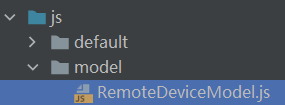

# 1.介绍

OpenHarmony提供了分布式能力，能够实现在同一网络下对远程设备Ability的拉起。本篇Codelab，我们将一起开启OpenHarmony分布式调度启动远程FA之路。本教程将给大家分享分布式能力中最基本的分布式拉起是如何实现的。

实现效果如下：


# 2.相关概念

[dialog组件](https://gitee.com/openharmony/docs/blob/master/zh-cn/application-dev/reference/arkui-js/js-components-container-dialog.md) ：自定义弹窗容器组件。

[button组件](https://gitee.com/openharmony/docs/blob/master/zh-cn/application-dev/reference/arkui-js/js-components-basic-button.md) ：按钮组件。

[通用事件](https://gitee.com/openharmony/docs/blob/master/zh-cn/application-dev/reference/arkui-js/js-components-common-events.md) ：事件绑定在组件上，当组件达到事件触发条件时，会执行JS中对应的事件回调函数，实现页面UI视图和页面JS逻辑层的交互。


# 3.搭建OpenHarmony环境

完成本篇Codelab我们首先要完成开发环境的搭建，本示例以**Hi3516DV300**开发板为例，参照以下步骤进行：

1. [获取OpenHarmony系统版本](https://gitee.com/openharmony/docs/blob/master/zh-cn/device-dev/get-code/sourcecode-acquire.md#%E8%8E%B7%E5%8F%96%E6%96%B9%E5%BC%8F3%E4%BB%8E%E9%95%9C%E5%83%8F%E7%AB%99%E7%82%B9%E8%8E%B7%E5%8F%96)：标准系统解决方案（二进制）

   以3.0版本为例：

   

2. 搭建烧录环境

   1.  [完成DevEco Device Tool的安装](https://gitee.com/openharmony/docs/blob/master/zh-cn/device-dev/quick-start/quickstart-standard-env-setup.md)

   2.  [完成Hi3516开发板的烧录](https://gitee.com/openharmony/docs/blob/master/zh-cn/device-dev/quick-start/quickstart-lite-steps-hi3516-burn.md)

3. 搭建开发环境

   1.  开始前请参考[工具准备](https://gitee.com/openharmony/docs/blob/master/zh-cn/application-dev/quick-start/start-overview.md#%E5%B7%A5%E5%85%B7%E5%87%86%E5%A4%87) ，完成DevEco Studio的安装和开发环境配置。
   2.  开发环境配置完成后，请参考[使用工程向导](https://gitee.com/openharmony/docs/blob/master/zh-cn/application-dev/quick-start/start-with-js.md#%E5%88%9B%E5%BB%BAjs%E5%B7%A5%E7%A8%8B) 创建工程（模板选择“Empty Ability”），选择JS或者eTS语言开发。
   3.  工程创建完成后，选择使用[真机进行调测](https://gitee.com/openharmony/docs/blob/master/zh-cn/application-dev/quick-start/start-with-ets.md#%E4%BD%BF%E7%94%A8%E7%9C%9F%E6%9C%BA%E8%BF%90%E8%A1%8C%E5%BA%94%E7%94%A8) 。

# 4.分布式组网

本章节以系统自带的音乐播放器为例，介绍如何完成两台设备的分布式组网。

1. 硬件准备：准备两台烧录相同的版本系统的**Hi3516DV300**开发板A，B。

2. 两个开发板A，B配置在同一个WiFi网络之下。

   打开设置--\>WLAN--\>点击右侧WiFi开关--\>点击目标WiFi并输入密码。

   

3. 将设备A，B设置为互相信任的设备。

   -   找到系统应用“音乐”。

   

   - 设备A打开音乐，点击左下角流转按钮，弹出列表框，在列表中会展示远端设备的id。

     

   - 选择远端设备B的id，另一台开发板（设备B）会弹出验证的选项框。

     

   - 设备B点击允许，设备B将会弹出随机PIN码，将设备B的PIN码输入到设备A的PIN码填入框中。

   

   配网完毕。

# 5.将组件添加到布局中

1. 在src/main/js/default/pages/index/index.hml中添加一个button按钮，来为实现点击button按钮弹出对话框做准备。

   ```
   <div class="container" onswipe="touchMove">
       <input class="btn" type="button" value="{{ $t('strings.next') }}" onclick="onContinueAbilityClick"></input>
   </div>
   ```

2. 在src/main/js/default/pages/index/index.hml中添加对话框组件，用于弹出设备列表。

   ```
   <div class="container" onswipe="touchMove">
       ...
       <dialog id="continueAbilityDialog" class="dialog-main" oncancel="cancelDialog">
           <div class="dialog-div">
               <text class="dialog_title_text">选择设备</text>
               <list class="dialog_device_list" divider="true">
                   <list-item for="{{ deviceList }}" class="device_list_item">
                       <div>
                           <label class="device_item_title" target="{{ $item.id }}">{{ $item.name }}</label>
                           <input class="device_item_radio" type="radio" checked="{{ $item.id === 'localhost' }}"
                                  id="{{ $item.id }}"
                                  name="radioSample" value="{{ $item.id }}"
                                  onchange="onRadioChange({{ $item.id }})"></input>
                       </div>
                   </list-item>
               </list>
               <div class="inner-btn">
                   <button class="dialog_cancel_button" type="text" value="取消" onclick="onDismissDialogClicked"></button>
               </div>
           </div>
       </dialog>
   </div>
   ```

# 6.为页面设计样式

这部分定义了整个页面中各个组件的样式，有关CSS更多的知识可以参考[CSS语法参考](https://gitee.com/openharmony/docs/blob/OpenHarmony-3.0-LTS/zh-cn/application-dev/js-reference/js-framework-syntax-css.md)，在index.css中先添加如下代码：

```
.container {
    display: flex;
    flex-direction: column;
    justify-content: center;
    align-items: center;
    align-content: center;
    left: 0px;
    top: 0px;
    width: 100%;
    height: 100%;
}

.btn {
    margin-top: 40%;
    width: 70%;
    height: 100px;
    font-size: 40px;
    background-color: #2788D9;
}
.container {
    width: 100%;
    height: 100%;
    flex-direction: column;
    justify-content: space-between;
    align-items: center;
    background-image: url(common/media/bg_blurry.png);
    background-size: cover;
    background-position: center center;
}

.title_section {
    margin-top: 150px;
    margin-bottom: 10px;
    flex-direction: row;
    justify-content: center;
}
.title {
    height: 64px;
    font-size: 48px;
    color: #FFF;
    margin-bottom: 10px;
    text-align: center;
}
.album_section {
    width: 100%;
    aspect-ratio: 1;
    flex-direction: row;
    align-items: center;
    margin-top: 25px;
    margin-bottom: 25px;
}
.album_image {
    align-items: center;
    object-fit: contain;
}
.progress_section {
    margin-bottom: 100px;
    flex-direction: column;
}
.timer {
    width: 100%;
    flex-direction: row;
    justify-content: space-between;
    margin-bottom: 12px;
}
.progress_time {
    height: 32px;
    color: #FFF;
    text-align: center;
    font-size: 24px;
}
.total_time {
    height: 32px;
    color: #FFF;
    text-align: center;
    font-size: 24px;
}
.music_slider {
    width: 100%;
    color: #64CCE7FF;
    padding-left: 0;
    padding-right: 0;
}

.control_section {
    width: 100%;
    justify-content: space-between;
    flex-direction: row;
}
.control_button {
    height: 96px;
    width: 96px;
}

.txt {
    color: #000;
    font-weight: bold;
    font-size: 39px;
}
.dialog-main {
    width: 500px;
}
.dialog-div {
    flex-direction: column;
    align-items: center;
}
.dialog_title_text {
    width: 434px;
    height: 80px;
    font-size: 32px;
    font-weight: 600;
}
.inner-btn {
    width: 400px;
    height: 120px;
    justify-content: space-around;
    align-items: center;
}

.dialog_cancel_button {
    width: 100%;
    font-size: 32px;
}
.dialog_device_list {
    width: 434px;
    max-height: 150px;
}
.device_list_item {
    width: 434px;
    height: 80px;
    flex-direction: row;
    align-items: center;
}
.device_item_radio {
}
.device_item_title {
    width: 80%;
    height: 80px;
    text-align: start;
}
@media screen and (device-type: tablet) and (orientation: landscape) {
}
@media screen and (device-type: wearable) {
}
@media screen and (device-type: tv) {
}
@media screen and (device-type: phone) and (orientation: landscape) {
}
```

# 7.创建远程设备对象类，并编写基本方法

-   在js目录下创建model文件夹，并在model文件夹中创建RemoteDeviceModel.js文件。



-   创建设备对象类。

```
import deviceManager from '@ohos.distributedHardware.deviceManager';
var SUBSCRIBE_ID = 100;
export default class RemoteDeviceModel {
    // 选中的设备列表
    deviceList = [];
    // 发现的设备列表
    discoverList = [];
    // 回调方法
    callback;
    // 身份验证回调
    authCallback = null;
    // 设备管理类对象
    #deviceManager;
    // 构造方法
    constructor() {
    }
}
```

-   定义并实现一些基本方法。

```
export default class RemoteDeviceModel {
  ...
  //注册设备回调方法
  registerDeviceListCallback(callback) {
    if (typeof (this.#deviceManager) === 'undefined') {
        console.log('CookBook[RemoteDeviceModel] deviceManager.createDeviceManager begin');
        let self = this;
        deviceManager.createDeviceManager('com.ohos.distributedRemoteStartFA', (error, value) => {
            if (error) {
                console.error('createDeviceManager failed.');
                return;
            }
            self.#deviceManager = value;
            self.registerDeviceListCallback_(callback);
            console.log('CookBook[RemoteDeviceModel] createDeviceManager callback returned, error=' + error + ' value=' + value);
        });
        console.log('CookBook[RemoteDeviceModel] deviceManager.createDeviceManager end');
    } else {
        this.registerDeviceListCallback_(callback);
    }
  }
  //注册设备回调子方法
  registerDeviceListCallback_(callback) {
  console.info('CookBook[RemoteDeviceModel] registerDeviceListCallback');
    this.callback = callback;
    if (this.#deviceManager == undefined) {
        console.error('CookBook[RemoteDeviceModel] deviceManager has not initialized');
        this.callback();
        return;
    }  

    console.info('CookBook[RemoteDeviceModel] getTrustedDeviceListSync begin');
    var list = this.#deviceManager.getTrustedDeviceListSync();
    console.info('CookBook[RemoteDeviceModel] getTrustedDeviceListSync end, deviceList=' + JSON.stringify(list));
    if (typeof (list) != 'undefined' && typeof (list.length) != 'undefined') {
        this.deviceList = list;
    }
    this.callback();
    console.info('CookBook[RemoteDeviceModel] callback finished');  

    let self = this;
    this.#deviceManager.on('deviceStateChange', (data) => {
        console.info('CookBook[RemoteDeviceModel] deviceStateChange data=' + JSON.stringify(data));
        switch (data.action) {
            case 0:
            self.deviceList[self.deviceList.length] = data.device;
            console.info('CookBook[RemoteDeviceModel] online, updated device list=' + JSON.stringify(self.deviceList));
            self.callback();
            if (self.authCallback != null) {
                self.authCallback();
                self.authCallback = null;
            }
            break;
            case 2:
            if (self.deviceList.length > 0) {
                for (var i = 0; i < self.deviceList.length; i++) {
                    if (self.deviceList[i].deviceId === data.device.deviceId) {
                        self.deviceList[i] = data.device;
                        break;
                    }
                }
            }
            console.info('CookBook[RemoteDeviceModel] change, updated device list=' + JSON.stringify(self.deviceList));
            self.callback();
            break;
            case 1:
              if (self.deviceList.length > 0) {
                  var list = [];
                  for (var i = 0; i < self.deviceList.length; i++) {
                      if (self.deviceList[i].deviceId != data.device.deviceId) {
                          list[i] = data.device;
                      }
                  }
                  self.deviceList = list;
              }
              console.info('CookBook[RemoteDeviceModel] offline, updated device list=' + JSON.stringify(data.device));
              self.callback();
              break;
              default:
                  break;
          }
      });
      this.#deviceManager.on('deviceFound', (data) => {
        console.info('CookBook[RemoteDeviceModel] deviceFound data=' + JSON.stringify(data));
        console.info('CookBook[RemoteDeviceModel] deviceFound self.deviceList=' + self.deviceList);
        console.info('CookBook[RemoteDeviceModel] deviceFound self.deviceList.length=' + self.deviceList.length);
        for (var i = 0; i < self.discoverList.length; i++) {
            if (self.discoverList[i].deviceId === data.device.deviceId) {
                console.info('CookBook[RemoteDeviceModel] device founded, ignored');
                return;
            }
        }
        self.discoverList[self.discoverList.length] = data.device;
        self.callback();
      });
      this.#deviceManager.on('discoverFail', (data) => {
        console.info('CookBook[RemoteDeviceModel] discoverFail data=' + JSON.stringify(data));
      });
      this.#deviceManager.on('serviceDie', () => {
        console.error('CookBook[RemoteDeviceModel] serviceDie');
      });  

      SUBSCRIBE_ID = Math.floor(65536 * Math.random());
      var info = {
        subscribeId: SUBSCRIBE_ID,
        mode: 0xAA,
        medium: 2,
        freq: 2,
        isSameAccount: false,
        isWakeRemote: true,
        capability: 0
      };
      console.info('CookBook[RemoteDeviceModel] startDeviceDiscovery ' + SUBSCRIBE_ID);
      this.#deviceManager.startDeviceDiscovery(info);
  }
  //身份验证
  authDevice(deviceId, callback) {
    console.info('CookBook[RemoteDeviceModel] authDevice ' + deviceId);
    for (var i = 0; i < this.discoverList.length; i++) {
        if (this.discoverList[i].deviceId === deviceId) {
            console.info('CookBook[RemoteDeviceModel] device founded, ignored');
            let extraInfo = {
                "targetPkgName": 'com.ohos.distributedRemoteStartFA',
                "appName": 'demo',
                "appDescription": 'demo application',
                "business": '0'
            };
            let authParam = {
                "authType": 1,
                "appIcon": '',
                "appThumbnail": '',
                "extraInfo": extraInfo
            };
            console.info('CookBook[RemoteDeviceModel] authenticateDevice ' + JSON.stringify(this.discoverList[i]));
            let self = this;
            this.#deviceManager.authenticateDevice(this.discoverList[i], authParam, (err, data) => {
                if (err) {
                    console.info('CookBook[RemoteDeviceModel] authenticateDevice failed, err=' + JSON.stringify(err));
                    self.authCallback = null;
                } else {
                    console.info('CookBook[RemoteDeviceModel] authenticateDevice succeed, data=' + JSON.stringify(data));
                    self.authCallback = callback;
                }
            });
        }
    }
  }
  //取消注册设备回调方法
  unregisterDeviceListCallback() {
    console.info('CookBook[RemoteDeviceModel] stopDeviceDiscovery ' + SUBSCRIBE_ID);
    this.#deviceManager.stopDeviceDiscovery(SUBSCRIBE_ID);
    this.#deviceManager.off('deviceStateChange');
    this.#deviceManager.off('deviceFound');
    this.#deviceManager.off('discoverFail');
    this.#deviceManager.off('serviceDie');
    this.deviceList = [];
  }
}
```

# 8.为组件添加相应的事件

我们已经定义好了布局和样式，接下来，我们一起来完成点击不同的button呈现不同dialog效果的功能。

首先我们了解一下dialog主要有哪些API，如下所示：

dialog支持如下事件：

<a name="table2177181910559"></a>

<table><thead align="left"><tr id="row817771918558"><th class="cellrowborder" valign="top" width="30%" id="mcps1.1.4.1.1"><p id="p81771119155518"><a name="p81771119155518"></a><a name="p81771119155518"></a>名称</p>
</th>
<th class="cellrowborder" valign="top" width="10%" id="mcps1.1.4.1.2"><p id="p14177719125516"><a name="p14177719125516"></a><a name="p14177719125516"></a>参数</p>
</th>
<th class="cellrowborder" valign="top" width="60%" id="mcps1.1.4.1.3"><p id="p0177151920551"><a name="p0177151920551"></a><a name="p0177151920551"></a>描述</p>
</th>
</tr>
</thead>
<tbody><tr id="row317881905516"><td class="cellrowborder" valign="top" width="30%" headers="mcps1.1.4.1.1 "><p id="p1317815191554"><a name="p1317815191554"></a><a name="p1317815191554"></a>cancel</p>
</td>
<td class="cellrowborder" valign="top" width="10%" headers="mcps1.1.4.1.2 "><p id="p1517816197558"><a name="p1517816197558"></a><a name="p1517816197558"></a>-</p>
</td>
<td class="cellrowborder" valign="top" width="60%" headers="mcps1.1.4.1.3 "><p id="p1775318015564"><a name="p1775318015564"></a><a name="p1775318015564"></a>用户点击非dialog区域触发取消弹窗时触发的事件。</p>
</td>
</tr>
</tbody>
</table>


dialog支持如下方法：

<a name="table2034519228154"></a>

<table><thead align="left"><tr id="row6345202231515"><th class="cellrowborder" valign="top" width="30%" id="mcps1.1.4.1.1"><p id="p1345622131510"><a name="p1345622131510"></a><a name="p1345622131510"></a>名称</p>
</th>
<th class="cellrowborder" valign="top" width="10%" id="mcps1.1.4.1.2"><p id="p10345322141519"><a name="p10345322141519"></a><a name="p10345322141519"></a>参数</p>
</th>
<th class="cellrowborder" valign="top" width="60%" id="mcps1.1.4.1.3"><p id="p163451222201517"><a name="p163451222201517"></a><a name="p163451222201517"></a>描述</p>
</th>
</tr>
</thead>
<tbody><tr id="row17345722191511"><td class="cellrowborder" valign="top" width="30%" headers="mcps1.1.4.1.1 "><p id="p123451022191519"><a name="p123451022191519"></a><a name="p123451022191519"></a>show</p>
</td>
<td class="cellrowborder" valign="top" width="10%" headers="mcps1.1.4.1.2 "><p id="p934572213156"><a name="p934572213156"></a><a name="p934572213156"></a>-</p>
</td>
<td class="cellrowborder" valign="top" width="60%" headers="mcps1.1.4.1.3 "><p id="p19345622121510"><a name="p19345622121510"></a><a name="p19345622121510"></a>弹出对话框</p>
</td>
</tr>
<tr id="row1756810445505"><td class="cellrowborder" valign="top" width="30%" headers="mcps1.1.4.1.1 "><p id="p73530552504"><a name="p73530552504"></a><a name="p73530552504"></a>close</p>
</td>
<td class="cellrowborder" valign="top" width="10%" headers="mcps1.1.4.1.2 "><p id="p5569164415011"><a name="p5569164415011"></a><a name="p5569164415011"></a>-</p>
</td>
<td class="cellrowborder" valign="top" width="60%" headers="mcps1.1.4.1.3 "><p id="p55691544105012"><a name="p55691544105012"></a><a name="p55691544105012"></a>关闭对话框</p>
</td>
</tr>
</tbody>
</table>


我们已经在之前的步骤中给button分别绑定了click事件，下面我们将实现这些事件调用的方法，在index.js中添加如下代码：

```
import app from '@system.app';

import featureAbility from '@ohos.ability.featureAbility';
import RemoteDeviceModel from '../../../model/RemoteDeviceModel.js';

let DEVICE_LIST_LOCALHOST;

export default {
  data: {
    // 设备集合
    deviceList: [],
    // 设备类对象
    remoteDeviceModel: new RemoteDeviceModel()
  },
  // 初始化方法
  onInit() {
    console.info('onInit begin');
    DEVICE_LIST_LOCALHOST = {
      name: this.$t('strings.localhost'),
      id: 'localhost'
    };
    this.deviceList = [DEVICE_LIST_LOCALHOST];
    console.info('onInit end');
  },
  // 注册设备，查询设备列表
  onContinueAbilityClick() {
    console.info('onContinueAbilityClick begin');
    const self = this;
    this.remoteDeviceModel.registerDeviceListCallback(() => {
      console.info('registerDeviceListCallback, callback entered');
      const list = [];
      list[0] = DEVICE_LIST_LOCALHOST;
      let deviceList;
      if (self.remoteDeviceModel.discoverList.length > 0) {
        deviceList = self.remoteDeviceModel.discoverList;
      } else {
        deviceList = self.remoteDeviceModel.deviceList;
      }
      console.info('on remote device updated, count=' + deviceList.length);
      for (let i = 0; i < deviceList.length; i++) {
        console.info('device ' + i + '/' + deviceList.length + ' deviceId='
                + deviceList[i].deviceId + ' deviceName=' + deviceList[i].deviceName + ' deviceType='
                + deviceList[i].deviceType);
        list[i + 1] = {
          name: deviceList[i].deviceName,
          id: deviceList[i].deviceId
        };
      }
      self.deviceList = list;
    });
    this.$element('continueAbilityDialog').show();
    console.info('onContinueAbilityClick end');
  },
  // 流转方法
  startAbilityContinuation(deviceId, deviceName) {
    this.$element('continueAbilityDialog').close();
    console.info('featureAbility.startAbility deviceId=' + deviceId
        + ' deviceName=' + deviceName);
    const wantValue = {
      bundleName: 'com.huawei.cookbook',
      abilityName: 'com.huawei.cookbook.MainAbility',
      deviceId: deviceId
    };

    featureAbility.startAbility({
      want: wantValue
    }).then((data) => {
      console.info('featureAbility.startAbility finished, ' + JSON.stringify(data));
    });
    console.info('featureAbility.startAbility want=' + JSON.stringify(wantValue));
    console.info('featureAbility.startAbility end');
  },
  // 选择设备改变的方法
  onRadioChange(inputValue, e) {
    console.info('onRadioChange ' + inputValue + ', ' + e.value);
    if (inputValue === e.value) {
      if (e.value === 'localhost') {
        this.$element('continueAbilityDialog').close();
        return;
      }
      if (this.remoteDeviceModel.discoverList.length > 0) {
        console.info('continue to unauthed device');
        let name = null;
        for (let i = 0; i < this.remoteDeviceModel.discoverList.length; i++) {
          if (this.remoteDeviceModel.discoverList[i].deviceId === e.value) {
            name = this.remoteDeviceModel.discoverList[i].deviceName;
            break;
          }
        }
        if (name === null) {
          console.error('onRadioChange failed, can not get name from discoverList');
          return;
        }
        console.info('onRadioChange name=' + name);

        const self = this;
        this.remoteDeviceModel.authDevice(e.value, () => {
          console.info('auth and online finished');
          for (let i = 0; i < self.remoteDeviceModel.deviceList.length; i++) {
            if (self.remoteDeviceModel.deviceList[i].deviceName === name) {
              this.startAbilityContinuation(self.remoteDeviceModel.deviceList[i].deviceId, self.remoteDeviceModel.deviceList[i].deviceName);
            }
          }
        });
      } else {
        console.info('continue to authed device');
        for (let i = 0; i < this.remoteDeviceModel.deviceList.length; i++) {
          if (this.remoteDeviceModel.deviceList[i].deviceId === e.value) {
            this.startAbilityContinuation(this.remoteDeviceModel.deviceList[i].deviceId, this.remoteDeviceModel.deviceList[i].deviceName);
          }
        }
      }
    }
  },
  // 销毁设备列表
  onDestroy() {
    console.info('onDestroy begin');
    this.remoteDeviceModel.unregisterDeviceListCallback();
    console.info('onDestroy end');
  },
  // 隐藏设备列表对话框
  cancelDialog() {
    this.remoteDeviceModel.unregisterDeviceListCallback();
  },
  // 取消设备列表
  onDismissDialogClicked() {
    this.dismissDialog();
  },
  // 设备列表对话框隐藏，取消设备注册
  dismissDialog() {
    this.$element('continueAbilityDialog').close();
    this.remoteDeviceModel.unregisterDeviceListCallback();
  },
  // 触控移动
  touchMove(e) {
    if (e.direction === 'right') {
      this.appExit();
    }
  },
  // 退出应用
  appExit() {
    app.terminate();
  }
};
```

# 9.恭喜你

在本篇Codelab中，我们主要学习了OpenHarmony分布式调度启动远程FA的实现。希望通过本教程，各位开发者可以对OpenHarmony的分布式能力有一个深刻的理解。