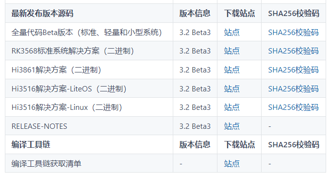

# 动效示例（ArkTS）

## 介绍

利用ArkUI组件不仅可以实现局部属性变化产生的属性动画，也可以实现父组件属性变化引起子组件产生过渡效果式的全局动画即显式动画。效果如图所示：


### 相关概念

- [显式动画](https://gitcode.com/openharmony/docs/blob/master/zh-cn/application-dev/reference/apis-arkui/arkui-ts/ts-explicit-animation.md)：提供全局animateTo显式动画接口来指定有闭包代码导致的状态变化插入过渡动画效果。

- [属性动画](https://gitcode.com/openharmony/docs/blob/master/zh-cn/application-dev/reference/apis-arkui/arkui-ts/ts-animatorproperty.md)：组件的通用属性发生变化时，可以创建属性动画进行渐变，提升用户体验。

- [Slider](https://gitcode.com/openharmony/docs/blob/master/zh-cn/application-dev/reference/apis-arkui/arkui-ts/ts-basic-components-slider.md)：滑动条组件，用来快速调节设置值，如音量、亮度等。

## 环境搭建

### 软件要求

-   [DevEco Studio](https://gitcode.com/openharmony/docs/blob/master/zh-cn/application-dev/quick-start/start-overview.md#%E5%B7%A5%E5%85%B7%E5%87%86%E5%A4%87)版本：DevEco Studio 3.1。
-   OpenHarmony SDK版本：API version 9。

### 硬件要求

-   开发板类型：[润和RK3568开发板](https://gitcode.com/openharmony/docs/blob/master/zh-cn/device-dev/quick-start/quickstart-appendix-rk3568.md)。
-   OpenHarmony系统：3.2 Release。

### 环境搭建

完成本篇Codelab我们首先要完成开发环境的搭建，本示例以**RK3568**开发板为例，参照以下步骤进行：

1.  [获取OpenHarmony系统版本](https://gitcode.com/openharmony/docs/blob/master/zh-cn/device-dev/get-code/sourcecode-acquire.md#%E8%8E%B7%E5%8F%96%E6%96%B9%E5%BC%8F3%E4%BB%8E%E9%95%9C%E5%83%8F%E7%AB%99%E7%82%B9%E8%8E%B7%E5%8F%96)：标准系统解决方案（二进制）。以3.2 Release版本为例：

    

2.  搭建烧录环境。
    1.  [完成DevEco Device Tool的安装](https://gitcode.com/openharmony/docs/blob/master/zh-cn/device-dev/quick-start/quickstart-ide-env-win.md)
    2.  [完成RK3568开发板的烧录](https://gitcode.com/openharmony/docs/blob/master/zh-cn/device-dev/quick-start/quickstart-ide-3568-burn.md)

3.  搭建开发环境。
    1.  开始前请参考[工具准备](https://gitcode.com/openharmony/docs/blob/master/zh-cn/application-dev/quick-start/start-overview.md#%E5%B7%A5%E5%85%B7%E5%87%86%E5%A4%87)，完成DevEco Studio的安装和开发环境配置。
    2.  开发环境配置完成后，请参考[使用工程向导](https://gitcode.com/openharmony/docs/blob/master/zh-cn/application-dev/quick-start/start-with-ets-stage.md#创建ets工程)创建工程（模板选择“Empty Ability”），选择JS或者eTS语言开发。
    3.  工程创建完成后，选择使用[真机进行调测](https://gitcode.com/openharmony/docs/blob/master/zh-cn/application-dev/quick-start/start-with-ets-stage.md#使用真机运行应用)。


## 代码结构解读

本篇Codelab只对核心代码进行讲解，完整代码可以直接从gitcode获取。

```
├──entry/src/main/ets                // 代码区
│  ├──common
│  │  └──constants
│  │     └──Const.ets                // 常量类
│  ├──entryability
│  │  └──EntryAbility.ts             // 程序入口类
│  ├──pages
│  │  └──Index.ets                   // 动效页面入口
│  ├──view
│  │  ├──AnimationWidgets.ets        // 动画组件
│  │  ├──CountController.ets         // 图标数量控制组件
│  │  └──IconAnimation.ets           // 图标属性动画组件
│  └──viewmodel
│     ├──IconItem.ets                // 图标类
│     ├──IconsModel.ets              // 图标数据模型
│     └──Point.ets                   // 图标坐标类
└──entry/src/main/resources          // 资源文件
```

## 页面入口

页面入口由AnimationWidgets（动效组件）、CountController（动效图标数量控制组件）组成。

其中CountController通过Slider滑动控制quantity（动效图标数量）；AnimationWidgets根据quantity展示相应数量的图标，点击组件按钮后通过在animateTo的event闭包函数中改变mainFlag状态，跟mainFlag相关的样式属性的变化都会产生动画效果，代码如下所示：

```typescript
// Index.ets
@Entry
@Component
struct Index {
  @State quantity: number = Common.IMAGES_MIN;
  @Provide iconModel: IconsModel = new IconsModel(this.quantity, Common.OFFSET_RADIUS);

  build() {
    Column() {
      // 动画组件
      AnimationWidgets({
        quantity: $quantity
      })
      // 图标数量控制组件
      CountController({
        quantity: $quantity
      })
    }
...
  }
}
```

CountController组件通过Slilder滑动控制动效图标的数量，最少3个图标，最多6个图标，示例代码如下所示：

```typescript
// CountController.ets
@Component
export struct CountController {
  @Link quantity: number;

  build() {
    Column() {
      Row() {
        Text($r('app.string.count'))
          .textStyle()

        Text(this.quantity)
          .textStyle()
      }
      ...

      Slider({
        value: this.quantity,
        min: Common.IMAGES_MIN,
        max: Common.IMAGES_TOTAL,
        step: 1,
        style: SliderStyle.InSet
      })
        .blockColor(Color.White)
        .selectedColor('#007DFF')
        .showSteps(true)
        .trackThickness($r('app.float.size_20'))
        .onChange((value: number) => {
          this.quantity = value;
        })
        ...
    }
  }
}
```

## 显式动画


点击AnimationWidgets组件的中心图标，调用animateTo方法，在event回调方法中改变状态，从而对组件本身产生缩放动画，和图标位置变化的动画效果，效果如下所示：


在animationTo的回调中修改mainFlag状态，所有跟mainFlag状态相关的属性变化都会产生过渡动画效果。代码如下所示：

```typescript
// AnimationWidgets.ets
import { IconsModel } from '../viewmodel/IconsModel';
import { IconAnimation } from './IconAnimation';
import Common from '../common/constants/Const';
import IconItem from '../viewmodel/IconItem';

@Component
export struct AnimationWidgets {
  @State mainFlag: boolean = false;
  @Link @Watch('onQuantityChange') quantity: number;
  @Consume iconModel: IconsModel;

  onQuantityChange() {
    this.iconModel.addImage(this.quantity);
  }

  aboutToAppear() {
    this.onQuantityChange();
  }
    
  animate() {
    animateTo(
      {
        delay: Common.DELAY_10,
        tempo: Common.TEMPO,
        iterations: 1,
        duration: Common.DURATION_500,
        curve: Curve.Smooth,
        playMode: PlayMode.Normal
      }, () => {
        this.mainFlag = !this.mainFlag;
      })
    }
    
  build() {
    Stack() {
      Stack() {
        ForEach(this.iconModel.imagerArr, (item: IconItem) => {
          IconAnimation({
            item: item,
            mainFlag: $mainFlag
          })
        }, (item: IconItem) => JSON.stringify(item.index))
      }
      .width(Common.DEFAULT_FULL_WIDTH)
      .height(Common.DEFAULT_FULL_HEIGHT)
      .rotate({
        x: 0,
        y: 0,
        z: 1,
        angle: this.mainFlag ? Common.ROTATE_ANGLE_360 : 0
      })
    
    Image(
      this.mainFlag
        ? $r("app.media.imgActive")
        : $r("app.media.imgInit")
    )
    .width($r('app.float.size_64'))
    .height($r('app.float.size_64'))
    .objectFit(ImageFit.Contain)
    .scale({
      x: this.mainFlag ? Common.INIT_SCALE : 1,
      y: this.mainFlag ? Common.INIT_SCALE : 1
    })
    .onClick(() => {
      this.iconModel.reset();
      this.animate();
    })
    
    Text($r('app.string.please_click_button'))
      .fontSize($r('app.float.size_16'))
      .opacity(Common.OPACITY_06)
      .fontColor($r('app.color.fontGrayColor'))
      .fontWeight(Common.FONT_WEIGHT_500)
      .margin({
        top: $r('app.float.size_100')
      })
    }
    .width(Common.DEFAULT_FULL_WIDTH)
    .layoutWeight(1)
    
  }
}
```

## 属性动画

组件的通用属性发生变化时，可以创建属性动画进行渐变，提升用户体验。示例效果如下所示：


当组件由animation动画属性修饰时，如果自身属性发生变化会产生过渡动画效果。本示例中当点击小图标时会触发自身clicked状态的变化，所有跟clicked相关的属性变化（如translate、rotate、scale、opacity）都会被增加动画效果。代码如下所示：

```typescript
// IconAnimation.ets
export struct IconAnimation {
  @Link mainFlag: boolean;
  @ObjectLink item: IconItem;

  build() {
    Image(this.item.image)
      .width(Common.ICON_WIDTH)
      .height(Common.ICON_HEIGHT)
      .objectFit(ImageFit.Contain)
      .translate(
          this.mainFlag
            ? { x: this.item.point.x, y: this.item.point.y }
            : { x: 0, y: 0 }
      )
      .rotate({
        x: 0,
        y: 1,
        z: 0,
        angle: this.item.clicked ? Common.ROTATE_ANGLE_360 : 0
      })
      .scale(
          this.item.clicked
          ? { x: Common.SCALE_RATIO, y: Common.SCALE_RATIO }
          : { x: 1, y: 1 }
      )
      .opacity(this.item.clicked ? Common.OPACITY_06 : 1)
      .onClick(() => {
        this.item.clicked = !this.item.clicked;
      })
      .animation(
        {
          delay: Common.DELAY_10,
          duration: Common.DURATION_1000,
          iterations: 1,
          curve: Curve.Smooth,
          playMode: PlayMode.Normal
        }
      )
  }
}
```

根据图标数量计算图标位置代码如下所示：

```typescript
// IconsModel.ets
import Common from '../common/constants/Const';
import IconItem from './IconItem';
import Point from './Point';

const TWO_PI: number = 2 * Math.PI;

@Observed
export class IconsModel {
  public imagerArr: Array<IconItem> = [];
  private num: number = Common.IMAGES_MIN;
  private radius: number;

  constructor(num: number, radius: number) {
    this.radius = radius;
    this.addImage(num);
  }

  public addImage(num: number) {
    this.num = num;
    if (this.imagerArr.length == num) {
      return;
    }
    if (this.imagerArr.length > num) {
      this.imagerArr.splice(num, this.imagerArr.length - num);
    } else {
      for (let i = this.imagerArr.length; i < num; i++) {
        const point = this.genPointByIndex(i);
        this.imagerArr.push(new IconItem(i, Common.IMAGE_RESOURCE[i], false, point));
      }
    }

    this.refreshPoint(num);
  }

  public refreshPoint(num: number) {
    for (let i = 0; i < num; i++) {
      this.imagerArr[i].point = this.genPointByIndex(i);
    }
  }

  public genPointByIndex(index: number): Point {
    const x = this.radius * Math.cos(TWO_PI * index / this.num);
    const y = this.radius * Math.sin(TWO_PI * index / this.num);
    return new Point(x, y);
  }

  public reset() {
    for (let i = 0; i < this.num; i++) {
      if (this.imagerArr[i].clicked) {
        this.imagerArr[i].clicked = false;
      }
    }
  }
}
```

## 总结

您已经完成了本次Codelab的学习，并了解到以下知识点：

1.  如何使用animateTo实现显式动画。
2.  如何使用animation为组件添加属性动画。


