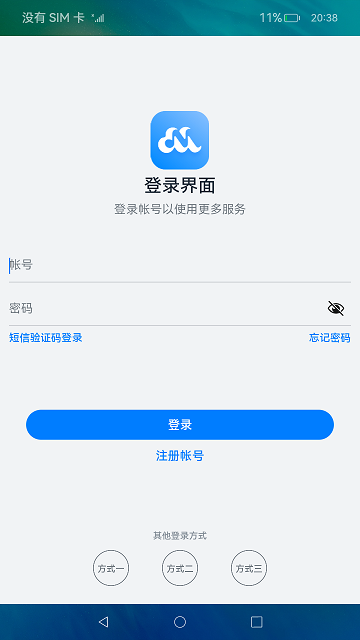
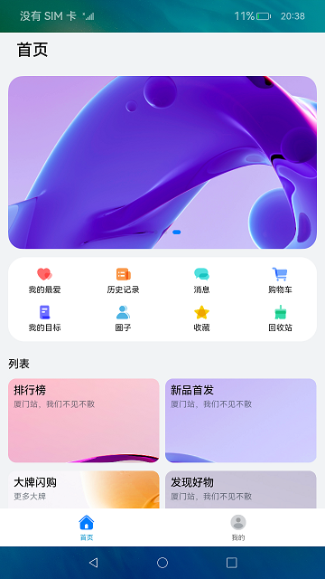

# 常用组件与布局（ArkTS）

## 介绍

HarmonyOS ArkUI提供了丰富多样的UI组件，您可以使用这些组件轻松地编写出更加丰富、漂亮的界面。在本篇Codelab中，您将通过一个简单的购物社交应用示例，学习如何使用常用的基础组件和容器组件。

本示例主要包含：“登录”、“首页”、“我的”三个页面，效果图如下：


### 相关概念

-   [Text](https://gitee.com/openharmony/docs/blob/master/zh-cn/application-dev/reference/arkui-ts/ts-basic-components-text.md)：显示一段文本的组件。
-   [Image](https://gitee.com/openharmony/docs/blob/master/zh-cn/application-dev/reference/arkui-ts/ts-basic-components-image.md)：图片组件，支持本地图片和网络图片的渲染展示。
-   [TextInput](https://gitee.com/openharmony/docs/blob/master/zh-cn/application-dev/reference/arkui-ts/ts-basic-components-textinput.md)：可以输入单行文本并支持响应输入事件的组件。
-   [Button](https://gitee.com/openharmony/docs/blob/master/zh-cn/application-dev/reference/arkui-ts/ts-basic-components-button.md)：按钮组件，可快速创建不同样式的按钮。
-   [LoadingProgress](https://gitee.com/openharmony/docs/blob/master/zh-cn/application-dev/reference/arkui-ts/ts-basic-components-loadingprogress.md)：用于显示加载动效的组件。
-   [Flex](https://gitee.com/openharmony/docs/blob/master/zh-cn/application-dev/reference/arkui-ts/ts-container-flex.md)：应用弹性方式布局子组件的容器组件。
-   [Column](https://gitee.com/openharmony/docs/blob/master/zh-cn/application-dev/reference/arkui-ts/ts-container-column.md)：沿垂直方向布局的容器。
-   [Row](https://gitee.com/openharmony/docs/blob/master/zh-cn/application-dev/reference/arkui-ts/ts-container-row.md)：沿水平方向布局容器。
-   [List](https://gitee.com/openharmony/docs/blob/master/zh-cn/application-dev/reference/arkui-ts/ts-container-list.md)：列表包含一系列相同宽度的列表项。适合连续、多行呈现同类数据，例如图片和文本。
-   [Swiper](https://gitee.com/openharmony/docs/blob/master/zh-cn/application-dev/reference/arkui-ts/ts-container-swiper.md)：滑动容器，提供切换子组件显示的能力。
-   [Grid](https://gitee.com/openharmony/docs/blob/master/zh-cn/application-dev/reference/arkui-ts/ts-container-grid.md)：网格容器，由“行”和“列”分割的单元格所组成，通过指定“项目”所在的单元格做出各种各样的布局。

## 环境搭建

### 软件要求

-   [DevEco Studio](https://gitee.com/openharmony/docs/blob/master/zh-cn/application-dev/quick-start/start-overview.md#%E5%B7%A5%E5%85%B7%E5%87%86%E5%A4%87)版本：DevEco Studio 3.1 Beta2及以上版本。
-   OpenHarmony SDK版本：API version 9及以上版本。

### 硬件要求

-   开发板类型：[润和RK3568开发板](https://gitee.com/openharmony/docs/blob/master/zh-cn/device-dev/quick-start/quickstart-appendix-rk3568.md)。
-   OpenHarmony系统：3.2 Release及以上版本。

### 环境搭建

完成本篇Codelab我们首先要完成开发环境的搭建，本示例以**RK3568**开发板为例，参照以下步骤进行：

1. [获取OpenHarmony系统版本](https://gitee.com/openharmony/docs/blob/master/zh-cn/device-dev/get-code/sourcecode-acquire.md#%E8%8E%B7%E5%8F%96%E6%96%B9%E5%BC%8F3%E4%BB%8E%E9%95%9C%E5%83%8F%E7%AB%99%E7%82%B9%E8%8E%B7%E5%8F%96)：标准系统解决方案（二进制）。以3.2 Release版本为例：

   

2. 搭建烧录环境。

   1.  [完成DevEco Device Tool的安装](https://gitee.com/openharmony/docs/blob/master/zh-cn/device-dev/quick-start/quickstart-ide-env-win.md)
   2.  [完成RK3568开发板的烧录](https://gitee.com/openharmony/docs/blob/master/zh-cn/device-dev/quick-start/quickstart-ide-3568-burn.md)

3. 搭建开发环境。

   1.  开始前请参考[工具准备](https://gitee.com/openharmony/docs/blob/master/zh-cn/application-dev/quick-start/start-overview.md#%E5%B7%A5%E5%85%B7%E5%87%86%E5%A4%87)，完成DevEco Studio的安装和开发环境配置。
   2.  开发环境配置完成后，请参考[使用工程向导](https://gitee.com/openharmony/docs/blob/master/zh-cn/application-dev/quick-start/start-with-ets-stage.md#创建ets工程)创建工程（模板选择“Empty Ability”）。
   3.  工程创建完成后，选择使用[真机进行调测](https://gitee.com/openharmony/docs/blob/master/zh-cn/application-dev/quick-start/start-with-ets-stage.md#使用真机运行应用)。

## 代码结构解读

本篇Codelab只对核心代码进行讲解，对于完整代码，我们会在附件下载和gitee源码中提供下载方式。

```
├──entry/src/main/ets              // 代码区
│  ├──common
│  │  ├──bean
│  │  │  └──ItemData.ets           // 列表数据实体类
│  │  └──constants
│  │     └──CommonConstants.ets    // 公共常量类
│  ├──entryability
│  │  └──EntryAbility.ts           // 程序入口类
│  ├──pages
│  │  ├──LoginPage.ets             // 登录界面
│  │  └──MainPage.ets	           // 主界面	
│  ├──view
│  │  ├──Home.ets                  // 首页
│  │  └──Setting.ets               // 设置页
│  └──viewmodel
│     └──MainViewModel.ets         // 主界面视图Model
└──entry/src/main/resources        // 应用资源目录
```
## 实现“登录”页面

本节主要介绍“登录”页面的实现，效果图如下：



界面使用Column容器组件布局，由Image、Text、TextInput、Button、LoadingProgress等基础组件构成，主要代码如下：

```typescript
@Entry
@Component
struct LoginPage {
  ...
  build() {
    Column() {
      Image($r('app.media.logo'))
       ...
      Text($r('app.string.login_page'))
        ...
      Text($r('app.string.login_more'))
        ...

      TextInput({ placeholder: $r('app.string.account') })
        ...

      TextInput({ placeholder: $r('app.string.password') })
        ...

      Row() {
        Text($r('app.string.message_login')).blueTextStyle()
        Text($r('app.string.forgot_password')).blueTextStyle()
      }
      ....

      Button($r('app.string.login'), { type: ButtonType.Capsule })
        ....
      Text($r('app.string.register_account'))
        ....

      if (this.isShowProgress) {
        LoadingProgress()
          ....
      }

      Blank()
      Text($r('app.string.other_login_method'))
        ....
      Row({ space: CommonConstants.LOGIN_METHODS_SPACE }) {
        this.imageButton($r('app.media.login_method1'))
        this.imageButton($r('app.media.login_method2'))
        this.imageButton($r('app.media.login_method3'))
      }
    }
    ....
  }
}
```

### 获取用户输入

当用户登录前，需要获取用户输入的帐号和密码才能执行登录逻辑。给TextInput设置onChange事件，在onChange事件里面实时获取用户输入的文本信息。

```typescript
TextInput({ placeholder: $r('app.string.account') })
  .maxLength(CommonConstants.INPUT_ACCOUNT_LENGTH)
  .type(InputType.Number)
  .inputStyle()
  .onChange((value: string) => {
    this.account = value;
  })
```

### 控制LoadingProgress显示和隐藏

给登录按钮绑定onClick事件，调用login方法模拟登录。定义变量isShowProgress结合条件渲染if用来控制LoadingProgress的显示和隐藏。当用户点击按钮时设置isShowProgress为true，即显示LoadingProgress；使用定时器setTimeout设置isShowProgress 2秒后为false，即隐藏LoadingProgress，然后执行跳转到首页的逻辑。

```typescript
@Entry
@Component
struct LoginPage {
  @State account: string = '';
  @State password: string = '';
  @State isShowProgress: boolean = false;
  private timeOutId = null;

  ...

  login() {
    if (this.account === '' || this.password === '') {
      prompt.showToast({
        message: $r('app.string.input_empty_tips')
      })
    } else {
      this.isShowProgress = true;
      if (this.timeOutId === null) {
        this.timeOutId = setTimeout(() => {
          this.isShowProgress = false;
          this.timeOutId = null;
          router.replaceUrl({ url: 'pages/MainPage' });
        }, CommonConstants.LOGIN_DELAY_TIME);
      }
    }
  }

  ...

  build() {
    Column() {
      ...

      Button($r('app.string.login'), { type: ButtonType.Capsule })
        ....
        .onClick(() => {
          this.login();
        })
      ...

      if (this.isShowProgress) {
        LoadingProgress()
          .color($r('app.color.loading_color'))
          .width($r('app.float.login_progress_size'))
          .height($r('app.float.login_progress_size'))
          .margin({ top: $r('app.float.login_progress_margin_top') })
      }

      ...
    }
    ...
  }
}
```

### 实现页面跳转

页面间的跳转可以使用router模块相关API来实现，使用前需要先导入该模块，然后使用router.replace\(\)方法实现页面跳转。

```typescript
import router from '@ohos.router';

login() {
  if (this.account === '' || this.password === '') {
    ...
  } else {
    this.isShowProgress = true;
    if (this.timeOutId === null) {
      this.timeOutId = setTimeout(() => {
        this.isShowProgress = false;
        this.timeOutId = null;
        router.replaceUrl({ url: 'pages/MainPage' });
      }, CommonConstants.LOGIN_DELAY_TIME);
    }
  }
}
```

## 实现“首页”和“我的”页面

### 定义资源数据

由于“首页”和“我的”页面中有多处图片和文字的组合，因此提取出ItemData类。在MainViewModel.ets文件中对页面使用的资源进行定义，在MainViewModel.ets文件中定义数据。

```typescript
// ItemData.ets
    export default class PageResourcce {
  title: Resource;
  img?: Resource;
  others?: Resource;
  constructor(title: Resource, img?: Resource, others?: Resource) {
    this.title = title;
    this.img = img;
    this.others = others;
  }
}

// MainViewModel.ets
import ItemData from '../common/bean/ItemData';
export class MainViewModel {
  ...
  getFirstGridData(): Array<ItemData> {
    let firstGridData: ItemData[] = [
      new ItemData($r('app.string.my_love'), $r('app.media.love')),
      new ItemData($r('app.string.history_record'), $r('app.media.record')),
      ...
    ];
    return firstGridData;
  }
  ...
}
export default new MainViewModel();
```

### 实现页面框架

从前面介绍章节的示意图可以看出，本示例由两个tab页组成，使用Tabs组件来实现，提取tabBar的公共样式，同时设置TabContent和Tabs的backgroundColor来实现底部tabBar栏背景色突出的效果。

```typescript
Tabs({
  barPosition: BarPosition.End,
  controller: this.tabsController
}) {
  TabContent() {
    ...
  }
  ...
  .backgroundColor($r('app.color.mainPage_backgroundColor')) // “首页”的页面背景色
  .tabBar(this.TabBuilder(CommonConstants.HOME_TITLE, CommonConstants.HOME_TAB_INDEX,
  $r('app.media.home_selected'), $r('app.media.home_normal')))
  ...
}
.backgroundColor(Color.White)  // 底部tabBar栏背景色
.onChange((index: number) => {
  this.currentIndex = index;
})
...
```

### 实现“首页”内容

“首页”效果如下所示：



从上面效果如可以看出“首页”由三部分内容组成分别是轮播图、2\*4栅格图、4\*4栅格图。首先使用Swiper组件实现轮播图，无需设置图片大小。

```typescript
Swiper(this.swiperController) {
  ForEach(mainViewModel.getSwiperImages(), (img: Resource) => {
    Image(img).borderRadius($r('app.float.home_swiper_borderRadius'))
  }, img => img.id)
}
...
.autoPlay(true)
```

然后使用Grid组件实现2\*4栅格图，代码如下

```typescript
Grid() {
  ForEach(mainViewModel.getFirstGridData(), (item: ItemData) => {
    GridItem() {
      Column() {
        Image(item.img)
          .width($r('app.float.home_homeCell_size'))
          .height($r('app.float.home_homeCell_size'))
        Text(item.title)
          .fontSize($r('app.float.little_text_size'))
          .margin({ top: $r('app.float.home_homeCell_margin') })
      }
    }
  }, item => JSON.stringify(item))
}
.columnsTemplate('1fr 1fr 1fr 1fr')
.rowsTemplate('1fr 1fr')
...
```

使用Grid组件实现4\*4栅格列表栏，其中单个栅格中有一张背景图片和两行字体不同的文本，因此在Column组件中放置两个Text组件，并设置背景图，注意Grid组件必须设置高度，否则可能出现页面空白。

```typescript
Grid() {
  ForEach(mainViewModel.getSecondGridData(), (secondItem: ItemData) => {
    GridItem() {
      Column() {
        Text(secondItem.title)
          ...
        Text(secondItem.others)
          ...
      }
      .alignItems(HorizontalAlign.Start)
    }
    ...
    .backgroundImage(secondItem.img)
    .backgroundImageSize(ImageSize.Cover) 
    ...
  }, secondItem => JSON.stringify(secondItem))
}
...
.height($r('app.float.home_secondGrid_height')) 
.columnsTemplate('1fr 1fr')
.rowsTemplate('1fr 1fr')
...
```

### 实现“我的”页内容

“我的”页面效果图如下：


使用List组件结合ForEach语句来实现页面列表内容，其中引用了settingCell子组件，列表间的灰色分割线可以使用Divider属性实现，代码实现如下：

```typescript
List() {
  ForEach(mainViewModel.getSettingListData(), (item: ItemData) => {
    ListItem() {
      this.settingCell(item)
    }
    .height($r('app.float.setting_list_height'))
  }, item => JSON.stringify(item))
}
...
.divider({  // 设置分隔线
  ...
})
...

@Builder settingCell(item: ItemData) {
  Row() {
    Row({ space: CommonConstants.COMMON_SPACE }) {
      Image(item.img)
        ...
      Text(item.title)
        ...
    }
    if (item.others === null) {
      Image($r("app.media.right_grey"))
        ...
    } else {
      Toggle({ type: ToggleType.Switch, isOn: false })
    }
  }
  .justifyContent(FlexAlign.SpaceBetween)  // 相邻元素之间距离相同
  ...
}
```

## 总结

目前你已经成功完成了Codelab并且学到了：

1.  Button、Image、TextInput、Text等基础组件的使用。
2.  Column、Row、List、Tabs等容器组件的使用。


