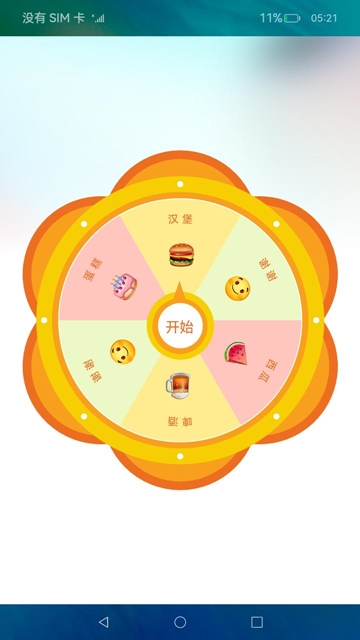

# 自定义抽奖转盘（ArkTS）

## 介绍

本篇Codelab是基于画布组件、显式动画，实现的一个自定义抽奖圆形转盘。包含如下功能：

1.  通过画布组件Canvas，画出抽奖圆形转盘。
2.  通过显式动画启动抽奖功能。
3.  通过自定义弹窗弹出抽中的奖品。


### 相关概念

-   [Stack组件](https://gitee.com/openharmony/docs/blob/master/zh-cn/application-dev/reference/arkui-ts/ts-container-stack.md)：堆叠容器，子组件按照顺序依次入栈，后一个子组件覆盖前一个子组件。
-   [Canvas](https://gitee.com/openharmony/docs/blob/master/zh-cn/application-dev/reference/arkui-ts/ts-components-canvas-canvas.md)：画布组件，用于自定义绘制图形。
-   [CanvasRenderingContext2D对象](https://gitee.com/openharmony/docs/blob/master/zh-cn/application-dev/reference/arkui-ts/ts-canvasrenderingcontext2d.md)：使用RenderingContext在Canvas组件上进行绘制，绘制对象可以是矩形、文本、图片等。
-   [显式动画](https://gitee.com/openharmony/docs/blob/master/zh-cn/application-dev/reference/arkui-ts/ts-explicit-animation.md)：提供全局animateTo显式动画接口来指定由于闭包代码导致的状态变化插入过渡动效。
-   [自定义弹窗](https://gitee.com/openharmony/docs/blob/master/zh-cn/application-dev/reference/arkui-ts/ts-methods-custom-dialog-box.md)： 通过CustomDialogController类显示自定义弹窗。

## 环境搭建

### 软件要求

-   [DevEco Studio](https://gitee.com/openharmony/docs/blob/master/zh-cn/application-dev/quick-start/start-overview.md#%E5%B7%A5%E5%85%B7%E5%87%86%E5%A4%87)版本：DevEco Studio 3.1 Release及以上版本。
-   OpenHarmony SDK版本：API version 9及以上版本。

### 硬件要求

-   开发板类型：[润和RK3568开发板](https://gitee.com/openharmony/docs/blob/master/zh-cn/device-dev/quick-start/quickstart-appendix-rk3568.md)。
-   OpenHarmony系统：3.2 Release及以上版本。

### 环境搭建

完成本篇Codelab我们首先要完成开发环境的搭建，本示例以**RK3568**开发板为例，参照以下步骤进行：

1. [获取OpenHarmony系统版本](https://gitee.com/openharmony/docs/blob/master/zh-cn/device-dev/get-code/sourcecode-acquire.md#%E8%8E%B7%E5%8F%96%E6%96%B9%E5%BC%8F3%E4%BB%8E%E9%95%9C%E5%83%8F%E7%AB%99%E7%82%B9%E8%8E%B7%E5%8F%96)：标准系统解决方案（二进制）。以3.2 Release版本为例：

   

2. 搭建烧录环境。

   1.  [完成DevEco Device Tool的安装](https://gitee.com/openharmony/docs/blob/master/zh-cn/device-dev/quick-start/quickstart-ide-env-win.md)
   2.  [完成RK3568开发板的烧录](https://gitee.com/openharmony/docs/blob/master/zh-cn/device-dev/quick-start/quickstart-ide-3568-burn.md)

3. 搭建开发环境。

   1.  开始前请参考[工具准备](https://gitee.com/openharmony/docs/blob/master/zh-cn/application-dev/quick-start/start-overview.md#%E5%B7%A5%E5%85%B7%E5%87%86%E5%A4%87)，完成DevEco Studio的安装和开发环境配置。
   2.  开发环境配置完成后，请参考[使用工程向导](https://gitee.com/openharmony/docs/blob/master/zh-cn/application-dev/quick-start/start-with-ets-stage.md#创建ets工程)创建工程（模板选择“Empty Ability”）。
   3.  工程创建完成后，选择使用[真机进行调测](https://gitee.com/openharmony/docs/blob/master/zh-cn/application-dev/quick-start/start-with-ets-stage.md#使用真机运行应用)。

## 代码结构解读

本篇Codelab只对核心代码进行讲解，对于完整代码，我们会在gitee中提供。

```
├──entry/src/main/ets	            // 代码区
│  ├──common
│  │  ├──bean
│  │  │  ├──FillArcData.ets         // 绘制圆弧数据实体类
│  │  │  └──PrizeData.ets           // 中奖信息实体类
│  │  ├──constants
│  │  │  ├──ColorConstants.ets      // 颜色常量类
│  │  │  ├──CommonConstants.ets     // 公共常量类 
│  │  │  └──StyleConstants.ets      // 样式常量类 
│  │  └──utils
│  │     ├──CheckEmptyUtils.ets     // 数据判空工具类
│  │     └──Logger.ets              // 日志打印类
│  ├──entryability
│  │  └──EntryAbility.ts            // 程序入口类
│  ├──pages
│  │  └──CanvasPage.ets             // 主界面	
│  ├──view
│  │  └──PrizeDialog.ets            // 中奖信息弹窗类
│  └──viewmodel
│     └──DrawModel.ets              // 画布相关方法类
└──entry/src/main/resources         // 资源文件目录
```

## 构建主界面

在这个章节中，我们将完成示例主界面的开发，效果如图所示：



在绘制抽奖圆形转盘前，首先需要在CanvasPage.ets的aboutToAppear()方法中获取屏幕的宽高。

```typescript
// CanvasPage.ets
// 获取context
let context = getContext(this);

aboutToAppear() {
  // 获取屏幕的宽高
  window.getLastWindow(context)
    .then((windowClass) => {
      let windowProperties = windowClass.getWindowProperties();
      this.screenWidth = px2vp(windowProperties.windowRect.width);
      this.screenHeight = px2vp(windowProperties.windowRect.height);
    })
    .catch((error) => {
      Logger.error('Failed to obtain the window size. Cause: ' + JSON.stringify(error));
    })
}
```

在CanvasPage.ets布局界面中添加Canvas组件，在onReady()方法中进行绘制。

```typescript
// CanvasPage.ets
private settings: RenderingContextSettings = new RenderingContextSettings(true);
private canvasContext: CanvasRenderingContext2D = new CanvasRenderingContext2D(this.settings);

Stack({ alignContent: Alignment.Center }) {
  Canvas(this.canvasContext)
    ...
    .onReady(() => {
      // 通过draw方法进行绘制
      this.drawModel.draw(this.canvasContext, this.screenWidth, this.screenHeight);
    })

  // 开始抽奖图片
  Image($r('app.media.ic_center'))
    ...
}
...
```

在DrawModel.ets中，通过draw()方法逐步进行自定义圆形抽奖转盘的绘制。

```typescript
// DrawModel.ets
// 画抽奖圆形转盘
draw(canvasContext: CanvasRenderingContext2D, screenWidth: number, screenHeight: number) {
  if (CheckEmptyUtils.isEmptyObj(canvasContext)) {
    Logger.error('[DrawModel][draw] canvasContext is empty.');
    return;
  }
  this.canvasContext= canvasContext;
  this.screenWidth = screenWidth;
  this.canvasContext.clearRect(0, 0, this.screenWidth, screenHeight);
  // 将画布沿X、Y轴平移指定距离
  this.canvasContext.translate(this.screenWidth / CommonConstants.TWO,
    screenHeight / CommonConstants.TWO);
  // 画外部圆盘的花瓣
  this.drawFlower();
  // 画外部圆盘、小圈圈
  this.drawOutCircle();
  // 画内部圆盘
  this.drawInnerCircle();
  // 画内部扇形抽奖区域
  this.drawInnerArc();
  // 画内部扇形区域文字
  this.drawArcText();
  // 画内部扇形区域奖品对应的图片
  this.drawImage();
  this.canvasContext.translate(-this.screenWidth / CommonConstants.TWO,
    -screenHeight / CommonConstants.TWO);
}
```

## 画外部圆盘

画外部圆盘的花瓣：通过调用rotate\(\)方法，将画布旋转指定角度。再通过调用save\(\)和restore\(\)方法，使画布保存最新的绘制状态。根据想要绘制的花瓣个数，改变旋转角度，循环画出花瓣效果。

```typescript
// DrawModel.ets
// 画外部圆盘的花瓣
drawFlower() {
  let beginAngle = this.startAngle + this.avgAngle;
  const pointY = this.screenWidth * CommonConstants.FLOWER_POINT_Y_RATIOS;
  const radius = this.screenWidth * CommonConstants.FLOWER_RADIUS_RATIOS;
  const innerRadius = this.screenWidth * CommonConstants.FLOWER_INNER_RATIOS;
  for (let i = 0; i < CommonConstants.COUNT; i++) {
    this.canvasContext.save();
    this.canvasContext.rotate(beginAngle * Math.PI / CommonConstants.HALF_CIRCLE);
    this.fillArc(new FillArcData(0, -pointY, radius, 0, Math.PI * CommonConstants.TWO),
      ColorConstants.FLOWER_OUT_COLOR);

    this.fillArc(new FillArcData(0, -pointY, innerRadius, 0, Math.PI * CommonConstants.TWO),
      ColorConstants.FLOWER_INNER_COLOR);
    beginAngle += this.avgAngle;
    this.canvasContext.restore();
  }
}

// 画弧线方法
fillArc(fillArcData: FillArcData, fillColor: string) {
  if (CheckEmptyUtils.isEmptyObj(fillArcData) || CheckEmptyUtils.isEmptyStr(fillColor)) {
    Logger.error('[DrawModel][fillArc] fillArcData or fillColor is empty.');
    return;
  }
  this.canvasContext.beginPath();
  this.canvasContext.fillStyle = fillColor;
  this.canvasContext.arc(fillArcData.x, fillArcData.y, fillArcData.radius,
    fillArcData.startAngle, fillArcData.endAngle);
  this.canvasContext.fill();
}
```

画外部圆盘、圆盘边上的小圈圈：在指定的X、Y（0, 0）坐标处，画一个半径为this.screenWidth \* CommonConstants.OUT\_CIRCLE\_RATIOS的圆形。接下来通过一个for循环，且角度每次递增CommonConstants.CIRCLE / CommonConstants.SMALL\_CIRCLE\_COUNT，来绘制圆环上的小圈圈。

```typescript
// DrawModel.ets
drawOutCircle() {
  // 画外部圆盘
  this.fillArc(new FillArcData(0, 0, this.screenWidth * CommonConstants.OUT_CIRCLE_RATIOS, 0,
    Math.PI * CommonConstants.TWO), ColorConstants.OUT_CIRCLE_COLOR);

  let beginAngle = this.startAngle;
  // 画小圆圈
  for (let i = 0; i < CommonConstants.SMALL_CIRCLE_COUNT; i++) {
    this.canvasContext.save();
    this.canvasContext.rotate(beginAngle * Math.PI / CommonConstants.HALF_CIRCLE);
    this.fillArc(new FillArcData(this.screenWidth * CommonConstants.SMALL_CIRCLE_RATIOS, 0,
      CommonConstants.SMALL_CIRCLE_RADIUS, 0, Math.PI * CommonConstants.TWO),
      ColorConstants.WHITE_COLOR);
    beginAngle = beginAngle + CommonConstants.CIRCLE / CommonConstants.SMALL_CIRCLE_COUNT;
    this.canvasContext.restore();
  }
}
```

## 画内部扇形抽奖区域

画内部圆盘、内部扇形抽奖区域：使用fillArc()方法绘制内部圆盘。通过一个for循环，角度每次递增this.avgAngle。然后不断更改弧线的起始弧度this.startAngle \* Math.PI / CommonConstants.HALF\_CIRCLE和弧线的终止弧度\(this.startAngle + this.avgAngle\) \* Math.PI / CommonConstants.HALF\_CIRCLE。最后用fill\(\)方法对路径进行填充。

```typescript
// DrawModel.ets
// 画内部圆盘
drawInnerCircle() {
  this.fillArc(new FillArcData(0, 0, this.screenWidth * CommonConstants.INNER_CIRCLE_RATIOS, 0,
    Math.PI * CommonConstants.TWO), ColorConstants.INNER_CIRCLE_COLOR);
  this.fillArc(new FillArcData(0, 0, this.screenWidth * CommonConstants.INNER_WHITE_CIRCLE_RATIOS, 0,
    Math.PI * CommonConstants.TWO), ColorConstants.WHITE_COLOR);
}

// 画内部扇形抽奖区域
drawInnerArc() {
  // 颜色集合
  let colors = [
    ColorConstants.ARC_PINK_COLOR, ColorConstants.ARC_YELLOW_COLOR,
    ColorConstants.ARC_GREEN_COLOR, ColorConstants.ARC_PINK_COLOR,
    ColorConstants.ARC_YELLOW_COLOR, ColorConstants.ARC_GREEN_COLOR
  ];
  let radius = this.screenWidth * CommonConstants.INNER_ARC_RATIOS;
  for (let i = 0; i < CommonConstants.COUNT; i++) {
    this.fillArc(new FillArcData(0, 0, radius, this.startAngle * Math.PI / CommonConstants.HALF_CIRCLE,
      (this.startAngle + this.avgAngle) * Math.PI / CommonConstants.HALF_CIRCLE), colors[i]);
    this.canvasContext.lineTo(0, 0);
    this.canvasContext.fill();
    this.startAngle += this.avgAngle;
  }
}
```

画内部抽奖区域文字：用for循环，通过drawCircularText\(\)方法绘制每组文字。drawCircularText\(\)方法接收三个参数，分别是字符串，起始弧度和终止弧度。绘制文本前需要设置每个字母占的弧度angleDecrement，然后设置水平和垂直的偏移量。垂直偏移量circleText.y - Math.sin\(angle\) \* radius就是朝着圆心移动的距离；水平偏移circleText.x + Math.cos\(angle\) \* radius，是为了让文字在当前弧范围文字居中。最后使用fillText()方法绘制文本。

```typescript
// DrawModel.ets
// 画内部扇形区域文字
drawArcText() {
  this.canvasContext.textAlign = CommonConstants.TEXT_ALIGN;
  this.canvasContext.textBaseline = CommonConstants.TEXT_BASE_LINE;
  this.canvasContext.fillStyle = ColorConstants.TEXT_COLOR;
  this.canvasContext.font = StyleConstants.ARC_TEXT_SIZE + CommonConstants.CANVAS_FONT;
  // 需要绘制的文本数组集合
  let textArrays = [
    $r('app.string.text_smile'),
    $r('app.string.text_hamburger'),
    $r('app.string.text_cake'),
    $r('app.string.text_smile'),
    $r('app.string.text_beer'),
    $r('app.string.text_watermelon')
  ];
  let arcTextStartAngle = CommonConstants.ARC_START_ANGLE;
  let arcTextEndAngle = CommonConstants.ARC_END_ANGLE;
  for (let i = 0; i < CommonConstants.COUNT; i++) {
    this.drawCircularText(this.getResourceString(textArrays[i]),
      (this.startAngle + arcTextStartAngle) * Math.PI / CommonConstants.HALF_CIRCLE,
      (this.startAngle + arcTextEndAngle) * Math.PI / CommonConstants.HALF_CIRCLE);
    this.startAngle += this.avgAngle;
  }
}

// 绘制圆弧文本
drawCircularText(textString: string, startAngle: number, endAngle: number) {
  if (CheckEmptyUtils.isEmptyStr(textString)) {
    Logger.error('[DrawModel][drawCircularText] textString is empty.');
    return;
  }
  let circleText = {
    x: 0,
    y: 0,
    radius: this.screenWidth * CommonConstants.INNER_ARC_RATIOS
  };
  // 圆的半径
  let radius = circleText.radius - circleText.radius / CommonConstants.COUNT;
  // 每个字母占的弧度
  let angleDecrement = (startAngle - endAngle) / (textString.length - 1);
  let angle = startAngle;
  let index = 0;
  let character;

  while (index < textString.length) {
    character = textString.charAt(index);
    this.canvasContext.save();
    this.canvasContext.beginPath();
    this.canvasContext.translate(circleText.x + Math.cos(angle) * radius,
      circleText.y - Math.sin(angle) * radius);
    this.canvasContext.rotate(Math.PI / CommonConstants.TWO - angle);
    this.canvasContext.fillText(character, 0, 0);
    angle -= angleDecrement;
    index++;
    this.canvasContext.restore();
  }
}
```

画内部抽奖区域文字对应图片：使用drawImage()方法绘制抽奖区域文字对应图片，该方法接收五个参数，分别是图片资源、绘制区域左上角的X和Y轴坐标、绘制区域的宽度和高度。

```typescript
// DrawModel.ets
// 画内部扇形区域文字对应的图片
drawImage() {
  let beginAngle = this.startAngle;
  let imageSrc = [
    CommonConstants.WATERMELON_IMAGE_URL, CommonConstants.BEER_IMAGE_URL,
    CommonConstants.SMILE_IMAGE_URL, CommonConstants.CAKE_IMAGE_URL,
    CommonConstants.HAMBURG_IMAGE_URL, CommonConstants.SMILE_IMAGE_URL
  ];
  for (let i = 0; i < CommonConstants.COUNT; i++) {
    let image = new ImageBitmap(imageSrc[i]);
    this.canvasContext.save();
    this.canvasContext.rotate(beginAngle * Math.PI / CommonConstants.HALF_CIRCLE);
    this.canvasContext.drawImage(image, this.screenWidth * CommonConstants.IMAGE_DX_RATIOS,
      this.screenWidth * CommonConstants.IMAGE_DY_RATIOS, CommonConstants.IMAGE_SIZE,
      CommonConstants.IMAGE_SIZE);
    beginAngle += this.avgAngle;
    this.canvasContext.restore();
  }
}
```

## 实现抽奖功能

在CanvasPage.ets的Canvas组件中添加rotate属性，在Image组件中添加点击事件onClick。点击“开始抽奖”图片，圆形转盘开始转动抽奖。

```typescript
// CanvasPage.ets
Stack({ alignContent: Alignment.Center }) {
  Canvas(this.canvasContext)
    ...
    .onReady(() => {
      this.drawModel.draw(this.canvasContext, this.screenWidth, this.screenHeight);
    })
    .rotate({
      x: 0,
      y: 0,
      z: 1,
      angle: this.rotateDegree,
      centerX: this.screenWidth / CommonConstants.TWO,
      centerY: this.screenHeight / CommonConstants.TWO
    })

  // 开始抽奖图片
  Image($r('app.media.ic_center'))
   ...
    .enabled(this.enableFlag)
    .onClick(() => {
      this.enableFlag = !this.enableFlag;
      // 开始抽奖
      startAnimator.call(this);
    })
}
...
```

圆形转盘开始转动抽奖：给转盘指定一个随机的转动角度randomAngle，保证每次转动的角度是随机的，即每次抽到的奖品也是随机的。动画结束后，转盘停止转动，抽奖结束，弹出抽中的奖品信息。

```typescript
// CanvasPage.ets
dialogController: CustomDialogController = new CustomDialogController({
  builder: PrizeDialog({
    prizeData: $prizeData,
    enableFlag: $enableFlag
  }),
  autoCancel: false
});

// DrawModel.ets
// 开始抽奖
startAnimator() {
  let randomAngle = Math.round(Math.random() * CommonConstants.CIRCLE);
  // 获取中奖信息
  this.prizeData = this.drawModel.showPrizeData(randomAngle);

  animateTo({
    duration: CommonConstants.DURATION,
    curve: Curve.Ease,
    delay: 0,
    iterations: 1,
    playMode: PlayMode.Normal,
    onFinish: () => {
      this.rotateDegree = CommonConstants.ANGLE - randomAngle;
      // 打开自定义弹窗，弹出抽奖信息
      this.dialogController.open();
    }
  }, () => {
    this.rotateDegree = CommonConstants.CIRCLE * CommonConstants.FIVE +
      CommonConstants.ANGLE - randomAngle;
  })
}
```

弹出抽中的奖品信息：抽奖结束后，弹出抽中的文本和图片信息，通过自定义弹窗实现。

```typescript
// PrizeDialog.ets
@CustomDialog
export default struct PrizeDialog {
  @Link prizeData: PrizeData;
  @Link enableFlag: boolean;
  private controller: CustomDialogController;

  build() {
    Column() {
      Image(this.prizeData.imageSrc)
        ...

      Text(this.prizeData.message)
        ...

      Text($r('app.string.text_confirm'))
        ...
        .onClick(() => {
          // 关闭自定义弹窗		
          this.controller.close();
          this.enableFlag = !this.enableFlag;
        })
    }
    ...
  }
}
```

## 总结

您已经完成了本次Codelab的学习，并了解到以下知识点：

1.  使用画布组件Canvas，画出抽奖圆形转盘。
2.  使用显式动画启动抽奖功能。
3.  使用自定义弹窗弹出抽中的奖品。

