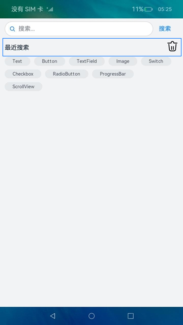
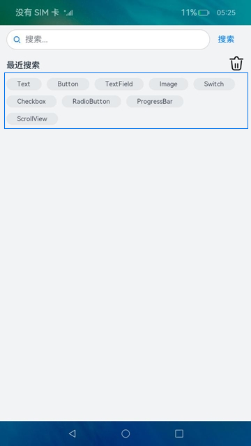

# 弹性布局（ArkTS）

## 介绍

本篇Codelab是基于Flex容器组件，实现弹性布局效果。弹性布局的特点是页面元素的宽度按照屏幕分辨率进行适配调整，但整体布局不变。


### 相关概念

-   [Flex组件](https://gitcode.com/openharmony/docs/blob/master/zh-cn/application-dev/reference/apis-arkui/arkui-ts/ts-container-flex.md)：以弹性方式布局子组件的容器组件。
-   [Search组件](https://gitcode.com/openharmony/docs/blob/master/zh-cn/application-dev/reference/apis-arkui/arkui-ts/ts-basic-components-search.md)：搜索框组件，适用于浏览器的搜索内容输入框等应用场景。
-   [Text组件](https://gitcode.com/openharmony/docs/blob/master/zh-cn/application-dev/reference/apis-arkui/arkui-ts/ts-basic-components-text.md)：显示一段文本的组件。
-   [Image组件](https://gitcode.com/openharmony/docs/blob/master/zh-cn/application-dev/reference/apis-arkui/arkui-ts/ts-basic-components-image.md)：图片组件，支持本地图片和网络图片的渲染展示。
-   [Scroll组件](https://gitcode.com/openharmony/docs/blob/master/zh-cn/application-dev/reference/apis-arkui/arkui-ts/ts-container-scroll.md)：可滑动的容器组件，当子组件的布局尺寸超过父组件的视口时，内容可以滑动。
-   [条件渲染](https://gitcode.com/openharmony/docs/blob/master/zh-cn/application-dev/quick-start/arkts-rendering-control-ifelse.md)：条件渲染可根据应用的不同状态，使用if、else和else if渲染对应状态下的UI内容。
-   [循环渲染](https://gitcode.com/openharmony/docs/blob/master/zh-cn/application-dev/quick-start/arkts-rendering-control-foreach.md)：基于数组类型数据执行循环渲染。

## 环境搭建

### 软件要求

-   [DevEco Studio](https://gitcode.com/openharmony/docs/blob/master/zh-cn/application-dev/quick-start/start-overview.md#%E5%B7%A5%E5%85%B7%E5%87%86%E5%A4%87)版本：DevEco Studio 3.1 Release。
-   OpenHarmony SDK版本：API version 9。

### 硬件要求

-   开发板类型：[润和RK3568开发板](https://gitcode.com/openharmony/docs/blob/master/zh-cn/device-dev/quick-start/quickstart-appendix-rk3568.md)。
-   OpenHarmony系统：3.2 Release。

### 环境搭建

完成本篇Codelab我们首先要完成开发环境的搭建，本示例以**RK3568**开发板为例，参照以下步骤进行：

1. [获取OpenHarmony系统版本](https://gitcode.com/openharmony/docs/blob/master/zh-cn/device-dev/get-code/sourcecode-acquire.md#%E8%8E%B7%E5%8F%96%E6%96%B9%E5%BC%8F3%E4%BB%8E%E9%95%9C%E5%83%8F%E7%AB%99%E7%82%B9%E8%8E%B7%E5%8F%96)：标准系统解决方案（二进制）。以3.2 Release版本为例：

   

2. 搭建烧录环境。

   1.  [完成DevEco Device Tool的安装](https://gitcode.com/openharmony/docs/blob/master/zh-cn/device-dev/quick-start/quickstart-ide-env-win.md)
   2.  [完成RK3568开发板的烧录](https://gitcode.com/openharmony/docs/blob/master/zh-cn/device-dev/quick-start/quickstart-ide-3568-burn.md)

3. 搭建开发环境。

   1.  开始前请参考[工具准备](https://gitcode.com/openharmony/docs/blob/master/zh-cn/application-dev/quick-start/start-overview.md#%E5%B7%A5%E5%85%B7%E5%87%86%E5%A4%87)，完成DevEco Studio的安装和开发环境配置。
   2.  开发环境配置完成后，请参考[使用工程向导](https://gitcode.com/openharmony/docs/blob/master/zh-cn/application-dev/quick-start/start-with-ets-stage.md#创建ets工程)创建工程（模板选择“Empty Ability”）。
   3.  工程创建完成后，选择使用[真机进行调测](https://gitcode.com/openharmony/docs/blob/master/zh-cn/application-dev/quick-start/start-with-ets-stage.md#使用真机运行应用)。

## 代码结构解读

本篇Codelab只对核心代码进行讲解，对于完整代码，我们会在gitee中提供。

```
├──entry/src/main/ets	           // 代码区
│  ├──common
│  │  └──constants
│  │     └──StyleConstants.ets     // 样式常量类 
│  ├──entryability
│  │  └──EntryAbility.ts           // 程序入口类
│  ├──pages
│  │  └──HomePage.ets              // 主界面	
│  ├──view
│  │  ├──ClearSearch.ets           // 清除历史记录自定义组件
│  │  ├──FlexLayout.ets            // 弹性布局自定义组件
│  │  └──SearchInput.ets           // 搜索输入框自定义组件
│  └──viewmodel
│     └──SearchViewModel.ets       // 历史搜索数据类
└──entry/src/main/resources        // 资源文件目录
```

## 编写搜索框布局

在这个章节中，我们需要完成搜索框布局的编写，并实现文本输入和点击事件。效果如图所示：


在ets目录下，点击鼠标右键 \> New \> Directory，新建名为view的自定义子组件目录。然后在view目录下，点击鼠标右键 \> New \> ArkTS File，新建名为SearchInput的ArkTS文件。最后在SearchInput.ets文件中，逐步完成如下操作：

1.  使用@Component新增一个自定义组件，组件名为SearchInput。
2.  在build\(\)中使用Flex作为容器组件，实现子组件水平排列。
3.  使用Search组件作为搜索框布局，Text组件作为搜索文本按钮布局。

```typescript
// SearchInput.ets
@Component
export default struct SearchInput {
  build() {
    Flex({ alignItems: ItemAlign.Center }) {
      // 搜索框布局
      Search()
        ...
	
      // 搜索文本按钮布局
      Text($r('app.string.search'))
        ...
    }
    ...
  }
}
```

接下来我们实现Search组件的样式及输入功能，并将输入的数据添加到数组searchArr中：

1.  使用@State定义变量searchInput，存储搜索框输入的文本内容。
2.  在Search组件参数中，将变量searchInput赋值给参数value，参数placeholder填写提示内容，参数icon表示搜索图标路径。
3.  设置高度height、宽度width、背景颜色backgroundColor、提示内容颜色placeholderColor等属性。
4.  设置onChange事件，将用户输入的内容绑定到变量searchInput中。
5.  使用@Link定义一个数组变量searchArr，点击搜索文本按钮时，将用户输入的内容即searchInput的值，通过数组的unshift\(\)方法，在数组searchArr的头部添加数据。

```typescript
// SearchInput.ets
@Component
export default struct SearchInput {
  @State searchInput: string = '';
  @Link searchArr: Array<string>;

  build() {
    Flex({ alignItems: ItemAlign.Center }) {
      // 搜索框布局
      Search({
        value: this.searchInput,
        placeholder: StyleConstants.SEARCH_PLACEHOLDER,
        icon: StyleConstants.SEARCH_ICON
      })
        .placeholderColor($r('app.color.placeholder_color'))
        .placeholderFont({ size: $r('app.float.font_size') })
        .textFont({ size: $r('app.float.font_size') })
        .height(StyleConstants.SEARCH_HEIGHT)
        .width(StyleConstants.SEARCH_WIDTH)
        .backgroundColor(Color.White)
        ...
        .onChange((value: string) => {
          this.searchInput = value;
        })

      // 搜索文本按钮布局
      Text($r('app.string.search'))
        ...
        .onClick(() => {
          if (this.searchInput !== '' && this.searchInput.trim().length > 0) {
            // 使用unshift在数组头部添加数据
            this.searchArr.unshift(this.searchInput.trim());
          }
          this.searchInput = '';
        })
    }
    ...
  }
}
```

然后我们在HomePage.ets首页中，引入SearchInput搜索输入框自定义组件。

1.  使用@State定义数组变量searchArr，存放最近搜索文本内容。
2.  在构造参数中，使用$符号引用@State修饰的变量searchArr，将父组件的变量searchArr与子组件searchArr变量关联起来。

```typescript
// HomePage.ets
import SearchInput from '../view/SearchInput';

@Entry
@Component
struct HomePage {
  @State searchArr: Array<string> = SearchViewModel.getSearchArrData();

  build() {
    Column() {
      // 搜索输入框自定义组件
      SearchInput({ searchArr: $searchArr })
    }
    ...
  }
}
```

## 编写清除记录布局

在这个章节中，我们需要完成清除记录布局的编写，并实现条件渲染。效果如图所示：



在view目录下，点击鼠标右键 \> New \> ArkTS File，新建名为ClearSearch的ArkTS文件。然后在ClearSearch.ets文件中，逐步完成如下操作：

1.  使用@Component新增一个自定义组件，组件名为ClearSearch。
2.  在build\(\)中使用Flex作为容器组件，实现子组件水平排列。
3.  使用if/else实现条件渲染：当有搜索内容时，显示最近搜索的文本和清除搜索内容图标；否则就显示没有搜索内容和相关图片。
4.  使用@Link定义数组变量searchArr，当点击清除搜索内容图标时，所有最近搜索内容清空。

```typescript
// ClearSearch.ets
@Component
export default struct ClearSearch {
  // 搜索内容数组
  @Link searchArr: Array<string>;

  build() {
    Flex({ alignItems: ItemAlign.Center }) {
      if (this.searchArr.length > 0) {
        Text($r('app.string.recent_searches'))
          ...

        Image($r('app.media.ic_delete'))
          ...
          .onClick(() => {
            this.searchArr.splice(0, this.searchArr.length);
            this.searchArr.length = 0;
          })
      } else {
        Column() {
          Image($r('app.media.ic_no_search'))
            ...

          Text($r('app.string.no_search_content'))
            ...
        }
        ...
      }
    }
  }
}
```

然后我们在HomePage.ets首页中，引入ClearSearch搜索输入框自定义组件。

```typescript
// HomePage.ets
import SearchInput from '../view/SearchInput';
import ClearSearch from '../view/ClearSearch';

@Entry
@Component
struct HomePage {
  @State searchArr: Array<string> = SearchViewModel.getSearchArrData();

  build() {
    Column() {
      // 搜索输入框自定义组件
      SearchInput({ searchArr: $searchArr })
      // 清除搜索记录自定义组件
      ClearSearch({ searchArr: $searchArr })
    }
    ...
  }
}
```

## 编写弹性布局

在这个章节中，我们需要完成弹性布局的功能样式，并实现循环渲染。效果如图所示：



在view目录下，点击鼠标右键 \> New \> ArkTS File，新建名为FlexLayout的ArkTS文件。然后在FlexLayout.ets文件中，逐步完成如下操作：

1.  使用@Component新增一个自定义组件，组件名为FlexLayout。
2.  在build\(\)中使用Flex作为容器，设置参数wrap为FlexWrap.Wrap时为弹性布局，实现自动换行。
3.  使用if实现条件渲染，当有搜索内容时，显示最近搜索的所有内容。
4.  使用@Link定义数组变量searchArr，表示子组件要显示的所有最近搜索文本内容。
5.  使用ForEach遍历变量searchArr，实现循环渲染。

```typescript
// FlexLayout.ets
@Component
export default struct FlexLayout {
  @Link searchArr: Array<string>;

  build() {
    Scroll() {
      // Flex布局， wrap设置成FlexWrap.Wrap时为弹性布局
      Flex({ justifyContent: FlexAlign.Start, wrap: FlexWrap.Wrap }) {
        if (this.searchArr.length > 0) {
          // 循环渲染		
          ForEach(this.searchArr, (item: string) => {
            Text(`${item}`)
              ...
          }, (item: string) => JSON.stringify(item))
        }
      }
      ...
    }
  }
}
```

然后我们在HomePage.ets首页中，引入FlexLayout搜索输入框自定义组件。

```typescript
// HomePage.ets
import SearchInput from '../view/SearchInput';
import ClearSearch from '../view/ClearSearch';
import FlexLayout from '../view/FlexLayout';

@Entry
@Component
struct HomePage {
  @State searchArr: Array<string> = SearchViewModel.getSearchArrData();

  build() {
    Column() {
      // 搜索输入框自定义组件
      SearchInput({ searchArr: $searchArr })
      // 清除搜索记录自定义组件
      ClearSearch({ searchArr: $searchArr })
      // 弹性布局自定义组件
      FlexLayout({ searchArr: $searchArr })
    }
    ...
  }
}
```

## 总结

您已经完成了本次Codelab的学习，并了解到以下知识点：

1.  使用Flex容器组件，实现弹性布局效果。
2.  使用if/else实现条件渲染。
3.  使用ForEach实现循环渲染。

