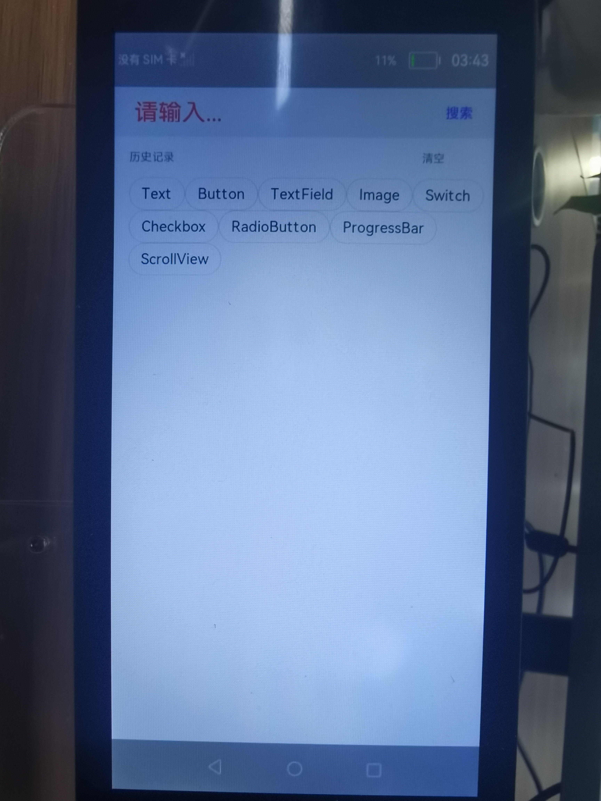

# 1.介绍

本文档将介绍如何使用eTS实现流式布局。流式布局的特点是页面元素的宽度按照屏幕分辨率进行适配调整，但整体布局不变。效果图如下：



## 应用场景

历史搜索记录、热点话题等布局效果的展示。

# 2.相关概念

TextInput：提供单行文本输入组件。

# 3.搭建OpenHarmony环境

完成本篇Codelab我们首先要完成开发环境的搭建，本示例以**Hi3516DV300**开发板为例，参照以下步骤进行：

1. [获取OpenHarmony系统版本](https://gitee.com/openharmony/docs/blob/master/zh-cn/device-dev/get-code/sourcecode-acquire.md#%E8%8E%B7%E5%8F%96%E6%96%B9%E5%BC%8F3%E4%BB%8E%E9%95%9C%E5%83%8F%E7%AB%99%E7%82%B9%E8%8E%B7%E5%8F%96)：标准系统解决方案（二进制）

   以3.0版本为例：

   

2. 搭建烧录环境

   1.  [完成DevEco Device Tool的安装](https://gitee.com/openharmony/docs/blob/master/zh-cn/device-dev/quick-start/quickstart-ide-env--win.md)
2.  [完成Hi3516开发板的烧录](https://gitee.com/openharmony/docs/blob/master/zh-cn/device-dev/quick-start/quickstart-ide-3516-burn.md)
   
3. 搭建开发环境

   1.  开始前请参考[工具准备](https://gitee.com/openharmony/docs/blob/master/zh-cn/application-dev/quick-start/start-overview.md#%E5%B7%A5%E5%85%B7%E5%87%86%E5%A4%87)，完成DevEco Studio的安装和开发环境配置。
   2.  开发环境配置完成后，请参考[使用工程向导](https://gitee.com/openharmony/docs/blob/master/zh-cn/application-dev/quick-start/start-with-ets-fa.md#%E5%88%9B%E5%BB%BAets%E5%B7%A5%E7%A8%8B)创建工程（模板选择“Empty Ability”），选择JS或者eTS语言开发。
   3.  工程创建完成后，选择使用[真机进行调测](https://gitee.com/openharmony/docs/blob/master/zh-cn/application-dev/quick-start/start-with-ets-fa.md#%E4%BD%BF%E7%94%A8%E7%9C%9F%E6%9C%BA%E8%BF%90%E8%A1%8C%E5%BA%94%E7%94%A8)。


# 4.编写输入框布局

1. 在index.ets文件中：

   -   使用@Component新增一个自定义组件，组件名为Search\_Input；
   -   在build\(\)中使用Flex作为容器，实现子组件水平排列；
   -   使用TextInput组件作为输入框，Button组件作为搜索按钮，内置Text组件，用来显示文本。

   代码如下：

   ```
   @Component
   struct Search_Input {
     build() {
       Flex(){
         TextInput()
         Button(){
           Text()
         }
       }
     }
   }
   ```

2. 实现TextInput组件的样式及输入功能：

   -   使用@State定义变量historyInput，存储输入框的内容；
   -   TextInput组件参数中，将变量historyInput赋值给参数text，参数placeholder填写提示内容；
   -   设置高度height、圆角borderRadius、背景颜色backgroundColor、提示内容颜色placeholderColor等方法；
   -   设置TextInput组件在Flex容器的比重layoutWeight\(8\)；
   -   设置onChange事件，绑定用户输入的内容到变量historyInput中。

   代码如下：

   ```
   @Component
   struct Search_Input {
     @State historyInput: string = ''
   
     build() {
       Flex(){
         TextInput({ placeholder: '请输入...', text: this.historyInput })
           .type(InputType.Normal)
           .placeholderColor(Color.Red)
           .placeholderFont({ size: 30, weight: 2})
           .enterKeyType(EnterKeyType.Search)
           .caretColor(Color.Green)
           .layoutWeight(8)
           .height(40)
           .borderRadius('20px')
           .backgroundColor(Color.White)
           .onChange((value: string) => {
           this.historyInput = value
         })
       }
     }
   }
   ```

3. 实现Button组件的样式：

   -   设置Text组件的内容及文字大小fontSize、颜色fontColor；
   -   设置Button组件在Flex容器的比重layoutWeight\(2\)。

   代码如下：

   ```
   @Component
   struct Search_Input {
     build() {
       Flex({ alignItems: ItemAlign.Center }) {
         Button({type: ButtonType.Capsule, stateEffect: false}) {
           Text('搜索').fontSize(17).fontColor(Color.Blue)
         }
         .layoutWeight(2)
         .backgroundColor('#00000000')
       }
     }
   }
   ```

4. 实现容器Flex的布局样式：

   -   设置Flex布局为水平方向ItemAlign.Center；
   -   设置Flex布局的高度height、内边距padding、背景颜色backgroundColor。

   代码如下：

   ```
   build() {
     Flex({ alignItems: ItemAlign.Center }) {
     }
     .height(60)
     .width('100%')
     .padding({left: 10})
     .backgroundColor('#FFedf2f5')
   }
   ```

5. 在@Entry修饰的主入口Search\_FlowLayout组件中，引用Search\_Input组件。代码如下：

   ```
   @Entry
   @Component
   struct Search_FlowLayout {
     build() {
       Column() {
         Search_Input()
       }
       .height('100%')
       .width('100%')
       .alignItems(HorizontalAlign.Center)
     }
   }
   ```

# 5.编写流式布局

1. 在index.ets文件中：

   -   使用@Component新增一个自定义组件，组件名为Flowlayout\_Container；
   -   在build\(\)中使用Flex作为容器，设置参数wrap为FlexWrap.Wrap；
   -   设置Flex容器的外边距margin和内边距padding；
   -   使用@Link定义数组变量historyArr，表示子组件要显示的文本内容。

   代码如下：

   ```
   @Component
   struct Flowlayout_Container {
     @Link historyArr: string[]
   
     build() {
       Scroll() {
         Flex({justifyContent: FlexAlign.Start, wrap: FlexWrap.Wrap}) { 
           
         }
         .margin({ left: 20, bottom: 100, right: 10 })
         .padding({bottom: 10})
       }
     }
   }
   ```

2. 实现流式布局效果：

   -   在Flex容器中，使用ForEach遍历变量historyArr；
   -   使用Text组件作为Flex的子组件；
   -   设置组件Text的文本内容为$\{item\}；
   -   设置组件Text的边框宽度borderWidth、边框颜色borderColor、边框圆角borderRadius；
   -   设置组件Text的外边距margin和内边距padding。

   代码如下：

   ```
   Flex({justifyContent: FlexAlign.Start, wrap: FlexWrap.Wrap}) {
     if (this.historyArr.length > 0) {
       ForEach(this.historyArr,
         (item: string) => {
           Text(`${item}`)
             .fontSize(18)
             .borderStyle(BorderStyle.Solid)
             .borderWidth('1px')
             .borderColor('#dddddd')
             .borderRadius('90px')
             .padding({top: 4, bottom: 4, right: 10, left: 10})
             .margin({top: 10, right: 10})
             .textOverflow({overflow: TextOverflow.Ellipsis})
             .maxLines(2)
         },
         (item: string) => item.toString()
       )
     }
   }
   ```

3. 在@Entry修饰的主入口Search\_FlowLayout组件中，引用Flowlayout\_Container组件。

   -   @State定义数组变量historyArr，用来存放文本内容。
   -   添加子组件Flowlayout\_Container。
   -   在构造参数中，使用$符号引用@State修饰的变量historyArr，将父组件的变量historyArr与子组件historyArr变量关联起来。

   代码如下：

   ```
   @Entry
   @Component
   struct Search_FlowLayout {
     @State historyArr: string[] = ["Text", "Button", "TextField", "Image", "Switch", "Checkbox", "RadioButton", "ProgressBar", "ScrollView"]
   
     build() {
       Column() {
         Search_Input()
         Flowlayout_Container({historyArr: $historyArr})
       }
       .height('100%')
       .width('100%')
       .alignItems(HorizontalAlign.Center)
     }
   }
   ```

# 6.添加数据

在本篇Codelab中，我们需要在输入框输入内容，并点击搜索按钮，将输入数据填充到流式布局中。

1. 在Search\_Input组件中：

   -   使用@Link定义一个数组变量historyArr；
   -   定义Button组件的点击事件onClick；
   -   在点击事件中，将变量historyInput的值，通过数组的unshift\(\)方法，存放在数组historyArr中。

   代码如下：

   ```
   @Component
   struct Search_Input {
     @Link historyArr: string[]
   
     build() {
       Flex({ alignItems: ItemAlign.Center }) {
         Button({type: ButtonType.Capsule, stateEffect: false}) {
         }
         .onClick((event: ClickEvent) => {
           if (this.historyInput != null && this.historyInput.length > 0) {
             this.historyArr.unshift(this.historyInput)
             this.historyInput = ''
           }
         })
       }
     }
   }
   ```

2. 在主入口Search\_FlowLayout组件中，使用$符号将父组件的变量historyArr与子组件Search\_Input的historyArr变量关联起来。代码如下：

   ```
   @Entry
   @Component
   struct Search_FlowLayout {
     build() {
       Column() {
         Search_Input({historyArr: $historyArr})
         Flowlayout_Container({historyArr: $historyArr})
       }
     }
   }
   ```

# 7.回顾和总结

-   实现ETS流式布局的核心点是设置Flex组件的参数wrap为FlexWrap.Wrap，它会实现自动换行功能。
-   获取TextInput组件的值，需要使用一个变量存储，然后使用onChange事件获取到文本的变化。

-   使用数组的push\(\)、unshift\(\)方法来添加数据，不同的是push\(\)方法是在尾部添加数据，而unshift\(\)方法是在头部添加数据。

# 8.恭喜你

目前你已经成功完成了Codelab并且学到了：

-   如何将一个ETS项目部署到OpenHarmony设备上
-   TextInput组件的使用
-   button组件的使用
-   text组件的使用