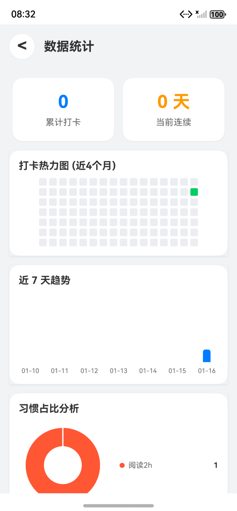

# Habit Tracker

这是一个基于 HarmonyOS (ArkTS) 开发的习惯养成应用，采用极简卡片式设计，帮助用户建立良好的生活习惯。

## 核心功能

1. Rdb 数据库
   - 关系型数据库：使用 HarmonyOS 关系型数据库（Rdb）存储所有数据
   - 数据持久化：习惯、分类、打卡记录等数据持久化存储，应用重启后数据不丢失
   - 高效查询：支持高效的增删改查操作，确保数据操作流畅
   - 数据管理：支持一键重置所有数据，方便重新开始

2. 提醒功能
   - 每日提醒：支持为每个习惯设置每日提醒时间
   - 智能时间判断：自动判断提醒时间，如果设置的时间已过则自动推迟到第二天
   - 权限管理：自动申请通知权限，确保提醒功能正常工作
   - 提醒管理：支持添加和取消提醒，灵活控制提醒状态

3. 统计功能
   - 打卡热力图：以热力图形式展示打卡记录，直观显示打卡频率和规律
   - 累计打卡统计：显示累计打卡总次数，记录用户的坚持历程
   - 连续天数统计：智能计算当前连续打卡天数，激励用户保持连续性
   - 近7天柱状图：展示近7天的打卡数量趋势，帮助用户了解近期表现
   - 习惯占比饼图：展示各个习惯的打卡次数占比，了解习惯分布情况
   - 模拟数据生成：支持一键生成模拟数据，用于演示和测试统计功能

## 安装步骤

### 前置要求
- 安装 DevEco Studio
- 配置好 HarmonyOS 开发环境

### 修改 Bundle Name
1. 打开 `entry/src/main/module.json5` 文件
2. 找到 `module` 配置项
3. 修改 `name` 字段为想要的 Bundle Name
4. 保存文件

### 运行项目
1. 在 DevEco Studio 中打开项目
2. 连接鸿蒙设备或启动模拟器（20）
3. 点击运行按钮或按 `Shift + F10` 运行应用

## 项目截图





## 项目结构

```
Habit/
├── AppScope/                 # 应用全局配置
├── entry/                    # 主模块
│   ├── src/main/
│   │   ├── ets/
│   │   │   ├── common/      # 公共代码
│   │   │   │   ├── bean/    # 数据模型
│   │   │   │   ├── constants/ # 常量定义
│   │   │   │   └── utils/   # 工具类
│   │   │   ├── entryability/ # 应用入口
│   │   │   ├── model/       # 数据层
│   │   │   │   ├── database/ # 数据库
│   │   │   │   └── repository/ # 数据仓库
│   │   │   ├── pages/       # 页面
│   │   │   ├── view/        # 视图组件
│   │   │   └── viewmodel/   # 视图模型
│   │   └── resources/       # 资源文件
│   └── build-profile.json5  # 构建配置
└── oh-package.json5         # 依赖配置
```

## 技术栈

- **开发语言**：ArkTS
- **UI 框架**：ArkUI
- **数据存储**：关系型数据库 (Rdb)
- **提醒服务**：ReminderAgent
- **通知服务**：NotificationManager

## 默认分类

应用内置以下默认分类：
- 全部（ID: 1）
