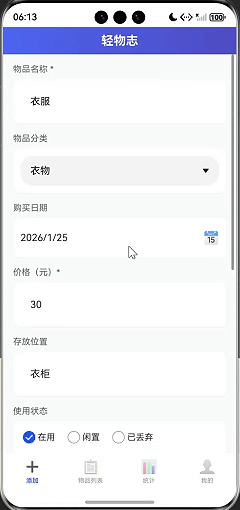
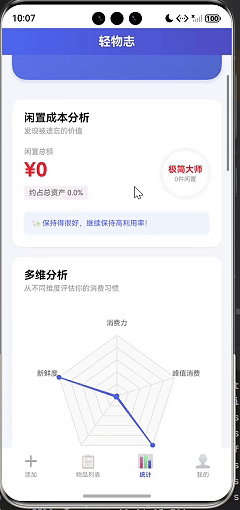

# 轻物志 📦

轻物志是一款基于 ArkTS 开发的轻量化、易操作的个人物品资产管理应用。聚焦物品全生命周期管理核心场景，提供**多维度物品档案管理**、**使用状态可视化**、**数据统计分析**及**个性化个人中心**等功能，帮助用户清晰掌控物品资产情况，告别物品闲置遗忘、去向不明的痛点。
使用效果如下图所示：
- 图1：添加物品。
- 图2：物品统计信息。
- 图3：“我的”页面个性化设置。





## ✨ 主要功能

### 1. 📋 物品档案全管理 (CRUD)
- **多维度建档**：支持录入物品名称、分类、使用状态（在用/闲置/已丢弃）、备注等核心信息，满足基础资产管理需求。
- **图片关联**：集成系统相册选择器（PhotoViewPicker），支持上传物品实拍图，列表中通过「🖼️」图标快速识别有图物品。
- **灵活编辑**：支持对物品档案进行**新增、修改、删除**操作，修改后列表数据实时同步更新。
- **精准查询**：支持按物品名称、分类、使用状态进行模糊筛选，快速定位目标物品。

### 2. 🎨 状态与分类可视化
- **状态差异化展示**：在用/闲置/已丢弃状态分别匹配专属文字色与背景色，视觉区分更直观。
- **分类个性化标识**：自动提取物品分类首字母生成圆形图标，不同分类匹配不同主题色，辨识度更高。
- **空状态友好引导**：物品列表为空时，展示「📦 + 引导文案」可视化页面，提示用户添加物品。

### 3. 📊 数据统计与分析
- **核心指标看板**：实时展示物品总数、各分类占比、不同使用状态物品数量，一键掌握资产全貌。
- **多维度筛选**：支持按分类、使用状态、添加时间筛选统计数据，精准分析物品使用分布。
- **简易可视化**：基于 ArkUI 实现柱状图/饼图展示，直观呈现月度新增物品、分类占比等趋势。

### 4. 👤 个性化个人中心
- **信息自定义**：独立「我的」页面，支持昵称修改、头像上传/更换，打造专属个人标识。
- **偏好持久化**：利用用户首选项（Preferences）存储个人信息，应用重启后仍保留个性化设置。
- **数据管理**：支持一键清空所有物品数据（二次确认防误删），保障数据操作安全。

### 5. 📱 高效交互体验
- **列表高性能渲染**：基于 List 组件实现物品列表按需加载，支持文字溢出截断、弹性布局，滑动流畅无卡顿。
- **日历联动（扩展）**：可选按日期筛选物品添加记录，快速追溯物品购入/闲置时间节点。
- **全局搜索**：支持搜索物品名称、分类、备注内容，一键找回历史物品档案。

## 🛠️ 技术栈

- **操作系统**: OpenHarmony
- **开发语言**: ArkTS (基于 TypeScript)
- **UI 框架**: ArkUI (声明式 UI 开发框架)
- **数据存储**: RelationalStore (RDB / SQLite) + Preferences (用户首选项)
- **SDK 版本**: OpenHarmony API 20
- **开发工具**: DevEco Studio 5.0+

## 📂 项目结构

```
轻物志/
├── AppScope/               # 全局应用配置（应用名称、图标、权限等）
├── entry/
│   └── src/
│       └── main/
│           ├── ets/
│           │   ├── date/             # 数据库操作层
│           │   │   ├── ItemRdb.ets   # 物品数据CRUD操作
│           │   │   ├── UserRdb.ets   # 用户信息数据操作
│           │   ├── model/            # 数据模型定义
│           │   │   ├── Item.ets      # 物品实体模型
│           │   │   ├── types.ets     # 通用类型定义（如状态枚举、分类类型等）
│           │   ├── pages/            # 核心页面
│           │   │   ├── Index.ets     # 首页（物品列表、筛选）
│           │   │   ├── StatisticsPage.ets # 数据统计页
│           │   │   └── MinePage.ets  # 个人中心页
│           │   ├── store/            # 状态管理（全局数据共享）
│           │   │   ├── index.ets     # 状态管理入口（统一导出）
│           │   │   ├── ItemStore.ets # 物品数据全局状态管理
│           │   └── entryability/     # 应用入口能力（EntryAbility.ets）
│           └── resources/            # 静态资源（图片、字符串、样式）
└── oh-package.json5        # 项目依赖配置
```

## 🚀 快速开始

### 环境准备
1. 安装 DevEco Studio 5.0+ 版本（[下载地址](https://developer.harmonyos.com/cn/develop/deveco-studio)）。
2. 配置 OpenHarmony API 20 开发环境，确保 SDK 完整下载。

### 运行项目
1. **克隆项目**：
   ```bash
   git clone https://gitcode.com/heartlessfor/codelabs.git
   ```
2. **打开项目**：
   - 进入目录codelabs/ETSUI/ItemManagerAPP。
   - 启动 DevEco Studio，选择「Open Project」，导入克隆后的项目目录。
   - 等待项目 Sync 完成（首次打开需下载依赖，耐心等待）。
3. **设备连接**：
   - 连接 OpenHarmony 真机或启动 API 20 模拟器。
4. **运行应用**：
   - 点击顶部工具栏「Run 'entry'」按钮，或使用快捷键 `Shift+F10`。

## 📖 使用指南

### 1. 添加物品
- 打开应用默认进入物品列表页，点击「+ 添加物品」按钮。
- 填写物品名称、选择分类、设置使用状态，可选添加备注或上传物品图片。
- 点击「保存」，物品自动同步至列表页。

### 2. 筛选/查询物品
- 列表页顶部选择「分类」或「使用状态」筛选条件，列表实时展示符合条件的物品。
- 点击搜索框，输入物品名称/备注关键词，快速定位目标物品。

### 3. 查看统计数据
- 点击底部「统计」标签页，默认展示当月物品总数、分类占比、状态分布。
- 切换月份筛选不同时间段数据，点击图表可查看分类详情。

### 4. 个性化设置
- 点击底部「我的」标签页，点击头像区域更换头像，编辑昵称输入框修改昵称。
- 所有个性化设置自动保存，重启应用后无需重新设置。

### 5. 编辑/删除物品
- 列表页左滑物品条目，唤起操作菜单，选择「编辑」修改信息，或「删除」移除物品。

