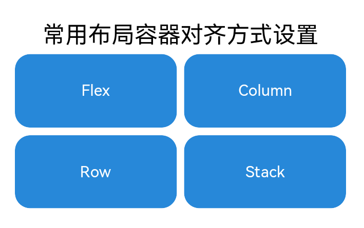
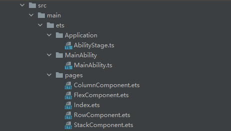
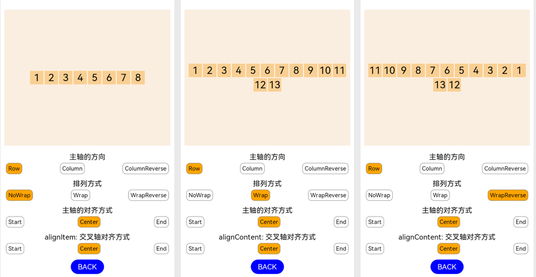

# 概述<a name="ZH-CN_TOPIC_0000001275932696"></a>

OpenHarmony 基于TS扩展的声明式开发范式框架提供了丰富的布局容器组件，其中常用的布局容器包括Flex、Column、Row和Stack。本篇Codelab主要介绍这四种布局容器对齐方式的设置方法。通过本Codelab您将学会在不同的容器内如何灵活的使用alignItems、justifyContent、alignContent、alignSelf和align这5种设置对齐方式的属性，实现自己想要的UI布局。

主界面效果图如下：



# 相关概念<a name="ZH-CN_TOPIC_0000001326932393"></a>

**主轴**：在布局容器中，默认存在两根轴，分别是主轴和交叉轴，不同的容器中主轴的方向是不一样的。在Column容器中主轴的方向是垂直方向，在Row容器中主轴的方向是水平方向，在Flex容器中可以通过direction参数设置主轴的方向。Stack容器中没有明确主轴与交叉轴，通过设置alignContent参数来改变容器内组件的对齐方式。

**交叉轴**：与主轴垂直相交的轴线，如果主轴是垂直方向，则交叉轴就是水平方向；如果主轴是水平方向，则交叉轴是垂直方向。

# 搭建OpenHarmony环境<a name="ZH-CN_TOPIC_0000001321435893"></a>

完成本篇Codelab我们首先要完成开发环境的搭建，本示例以**RK3568**开发板为例，参照以下步骤进行：

1.  [获取OpenHarmony系统版本](https://gitee.com/openharmony/docs/blob/master/zh-cn/device-dev/get-code/sourcecode-acquire.md#%E8%8E%B7%E5%8F%96%E6%96%B9%E5%BC%8F3%E4%BB%8E%E9%95%9C%E5%83%8F%E7%AB%99%E7%82%B9%E8%8E%B7%E5%8F%96)：标准系统解决方案（二进制）。

    以3.1版本为例：

    

2.  搭建烧录环境。
    1.  [完成DevEco Device Tool的安装](https://gitee.com/openharmony/docs/blob/master/zh-cn/device-dev/quick-start/quickstart-ide-env--win.md)
    2.  [完成RK3568开发板的烧录](https://gitee.com/openharmony/docs/blob/master/zh-cn/device-dev/quick-start/quickstart-ide-3568-burn.md)

3.  搭建开发环境。
    1.  开始前请参考[工具准备](https://gitee.com/openharmony/docs/blob/master/zh-cn/application-dev/quick-start/start-overview.md#%E5%B7%A5%E5%85%B7%E5%87%86%E5%A4%87)，完成DevEco Studio的安装和开发环境配置。
    2.  开发环境配置完成后，请参考[使用工程向导](https://gitee.com/openharmony/docs/blob/master/zh-cn/application-dev/quick-start/start-with-ets-stage.md#%E5%88%9B%E5%BB%BAets%E5%B7%A5%E7%A8%8B)创建工程（模板选择“Empty Ability”），选择JS或者eTS语言开发。
    3.  工程创建完成后，选择使用[真机进行调测](https://gitee.com/openharmony/docs/blob/master/zh-cn/application-dev/quick-start/start-with-ets-stage.md#%E4%BD%BF%E7%94%A8%E7%9C%9F%E6%9C%BA%E8%BF%90%E8%A1%8C%E5%BA%94%E7%94%A8)。

# 代码结构解读<a name="ZH-CN_TOPIC_0000001276893594"></a>



文件说明如下：

```
└── ets                             // ets代码区
    └── Application
    │   └── AbilityStage.ts         // Hap包运行时类
    ├── MainAbility
    │   └── MainAbility.ts          // Ability，提供对Ability生命周期、上下文环境等调用管理
    └── pages
        ├── ColumnComponent.ets            // Column容器内对齐方式设置界面
        ├── FlexComponent.ets              // Flex容器内对齐方式设置界面
        ├── index.ets                      // 主页面
        └── RowComponent.ets               // Row容器内对齐方式设置界面
        └── RowComponent.ets               // Stack容器内对齐方式设置界面
```

# Flex容器中对齐方式设置<a name="ZH-CN_TOPIC_0000001327132365"></a>

在主界面中有四个模块名称，分别对应四个布局容器，点击模块，则跳转到相对应的布局容器对齐方式设置界面。

[Flex布局容器](https://gitee.com/openharmony/docs/blob/master/zh-cn/application-dev/reference/arkui-ts/ts-container-flex.md)的参数如下：

**direction**：子组件在Flex容器上排列的方向，即主轴的方向。

**wrap**：Flex容器是单行/列，还是多行/列排列。

**justifyContent**：子组件在Flex容器主轴上的对齐格式。

**alignItems**：子组件在Flex容器交叉轴上的对齐格式。

**alignContent**：交叉轴中有额外的空间时，多行内容的对齐方式。仅在wrap参数设置为Wrap或WrapReverse下生效。

在本章节中，更改Flex布局容器中的5个参数配置,从而更改页面UI的对齐方式，可以更直观体现在不同的参数配置下，页面UI的对齐方式。

FlexComponent.ets详细代码如下：

```
// FlexComponent.ets
@Entry
@Component
struct FlexComponent {
  @Provide list: number[]= [1, 2, 3, 4, 5, 6, 7]
  // 主轴的方向
  @Provide currentFlexDirection: FlexDirection = FlexDirection.Row
  // 元素排列方式
  @Provide currentFlexWrap: FlexWrap = FlexWrap.NoWrap
  // 主轴对齐方式
  @Provide currentJustifyContent: FlexAlign = FlexAlign.Start
  // 单行/列交叉轴对齐方式
  @Provide currentAlignItems: ItemAlign = ItemAlign.Start
  // 多行/列交叉轴对齐方式
  @Provide currentAlignContent: FlexAlign = FlexAlign.Start

  build() {
    Column({ space: 10 }) {
      // 设置主轴方向组件
      FlexDirectionAttribute()
      // 设置元素排列方式组件
      FlexWrapAttribute()
      // 设置主轴对齐方向组件
      JustifyContentAttribute()
      // 设置交叉轴对齐方向组件
      AlignItemsAttribute()
      // 返回按钮
      Text("BACK")
        .width('20%')
        .height(40)
        .fontSize(20)
        .border({ radius: 20 })
        .textAlign(TextAlign.Center)
        .align(Alignment.Center)
        .fontColor(Color.White)
        .backgroundColor(Color.Blue)
        .onClick(() => {
          router.back();
        })
    }
    .width('100%')
    .height('100%')
    .padding(10)
  }
}
```

其中FlexDirectionAttribute组件内包含了元素对齐方式的设置，详细代码如下：

```
// 设置主轴方向组件
@Component
struct FlexDirectionAttribute {
  @Consume list: number[]
  @Consume currentFlexDirection: FlexDirection
  @Consume currentJustifyContent: FlexAlign
  @Consume currentAlignItems: ItemAlign
  @Consume currentFlexWrap: FlexWrap
  @Consume currentAlignContent: FlexAlign

  build() {
    Column() {
      // Flex中元素对齐方式布局
      Flex({
        alignItems: this.currentAlignItems,
        direction: this.currentFlexDirection,
        justifyContent: this.currentJustifyContent,
        wrap: this.currentFlexWrap,
        alignContent: this.currentAlignContent
      }) {
        // Flex布局容器中的元素
        ForEach(this.list, (item) => {
          Text(item.toString())
            .fontSize(28)
            .width('40')
            .height('40')
            .textAlign(TextAlign.Center)
            .backgroundColor(0xF9CF93)
            .borderColor(Color.White)
            .borderWidth(1)
        }, item => item)
      }
      .padding(5)
      .width('100%')
      .height('50%')
      .backgroundColor(0xFAEEE0)
      .margin({ top: 20 })

      Text("主轴的方向")
        .fontSize(20)
        .margin({ top: 20 })
      Flex({ justifyContent: FlexAlign.SpaceBetween }) {
        // 点击后设置主轴方向未Row,并改变背景颜色
        Text("Row")
          .onClick(() => {
            this.currentFlexDirection = FlexDirection.Row
          })
          .fontSize(16)
          .borderColor(Color.Grey)
          .borderStyle(BorderStyle.Solid)
          .borderWidth(1)
          .borderRadius(10)
          .textAlign(TextAlign.Center)
          .padding(5)
          .backgroundColor(this.currentFlexDirection == FlexDirection.Row ? Color.Orange : '')
        // 点击后设置主轴方向未Column,并改变背景颜色
        Text("Column")
          .onClick(() => {
            this.currentFlexDirection = FlexDirection.Column
          })
          .fontSize(16)
          .borderColor(Color.Grey)
          .borderStyle(BorderStyle.Solid)
          .borderWidth(1)
          .borderRadius(10)
          .textAlign(TextAlign.Center)
          .padding(5)
          .backgroundColor(this.currentFlexDirection == FlexDirection.Column ? Color.Orange : '')
        // 点击后设置主轴方向未ColumnReverse,并改变背景颜色
        Text("ColumnReverse")
          .onClick(() => {
            this.currentFlexDirection = FlexDirection.ColumnReverse
          })
          .fontSize(16)
          .borderColor(Color.Grey)
          .borderStyle(BorderStyle.Solid)
          .borderWidth(1)
          .borderRadius(10)
          .textAlign(TextAlign.Center)
          .padding(5)
          .backgroundColor(this.currentFlexDirection == FlexDirection.ColumnReverse ? Color.Orange : '')
      }
      .padding(5)
    }
    .borderWidth(1)
    .width('100%')
  }
}
```

1.  元素排列方式wrap参数设置为单行/列（NoWrap）
    1.  当direction设置为Row时，主轴为水平方向，交叉轴为垂直方向。justifyContent参数控制水平方向对齐方式，alignItems参数控制垂直方向对齐方式，设置不同的主轴和交叉轴对齐方式参数。
    2.  当direction设置为Column时，主轴为垂直方向，交叉轴为水平方向。justifyContent参数控制垂直方向对齐方式，alignItems参数控制水平方向对齐方式，设置不同的主轴和交叉轴对齐方式参数。

2.  元素排列方式wrap属性设置为多行/列（Wrap/WrapReverse）
    1.  当direction设置为Row时，主轴为水平方向，交叉轴为垂直方向。justifyContent参数控制水平方向对齐方式，alignContent参数控制垂直方向对齐方式，设置不同的主轴和交叉轴对齐方式参数。
    2.  当direction设置为Column时，主轴为垂直方向，交叉轴为水平方向。justifyContent参数控制垂直方向对齐方式，alignContent参数控制水平方向对齐方式，设置不同的主轴和交叉轴对齐方式参数。


主轴方向设置为Row时，效果图如下：



主轴方向设置为Column时，效果图如下：

.png)

# Column容器中对齐方式设置<a name="ZH-CN_TOPIC_0000001276092588"></a>

[Column布局容器](https://gitee.com/openharmony/docs/blob/master/zh-cn/application-dev/reference/arkui-ts/ts-container-column.md)的对齐方式与Flex布局容器中direction设置为Column时类似。区别在于交叉轴对齐方式设置alignItems的参数类型不一样，在Flex中alignItems的参数类型为[ItemAlign](https://gitee.com/openharmony/docs/blob/master/zh-cn/application-dev/reference/arkui-ts/ts-appendix-enums.md#itemalign%E6%9E%9A%E4%B8%BE%E8%AF%B4%E6%98%8E)，Column中alignItems的参数类型为HorizontalAlign。设置Column布局容器对齐方式的文件ColumnComponent.ets代码如下：

```
// ColumnComponent.ets
@Entry
@Component
struct ColumnComponent {
  @Provide currentJustifyContent: FlexAlign = FlexAlign.Start
  @Provide currentAlignItems: HorizontalAlign = HorizontalAlign.Start

  build() {
    Column({ space: 10 }) {
      // 设置主轴对齐方式组件
      ColJustifyContentAttribute()
      // 设置交叉轴轴对齐方式组件
      ColAlignItemsAttribute()
      // 返回按钮
      Text("BACK")
        .width('20%')
        .height(40)
        .fontSize(20)
        .border({ radius: 20 })
        .textAlign(TextAlign.Center)
        .align(Alignment.Center)
        .fontColor(Color.White)
        .backgroundColor(Color.Blue)
        .onClick(() => {
          router.back();
        })
    }
    .width('100%')
    .height('100%')
    .padding(10)
  }
}
```

其中ColJustifyContentAttribute组件中包含元素对齐方式布局，详细代码如下：

```
// 设置主轴对齐方式组件
@Component
struct ColJustifyContentAttribute {
  @State list: number[]= [1, 2, 3, 4, 5, 6, 7, 8]
  @Consume currentJustifyContent: FlexAlign
  @Consume currentAlignItems: HorizontalAlign

  build() {
    Column() {
      // Column中元素对齐方式布局
      Column() {
        ForEach(this.list, (item) => {
          Text(item.toString())
            .fontSize(28)
            .width(40)
            .height(40)
            .textAlign(TextAlign.Center)
            .backgroundColor(0xF9CF93)
            .borderColor(Color.White)
            .borderWidth(1)
        }, item => item)
      }
      // 设置交叉轴对齐方式属性
      .alignItems(this.currentAlignItems)
      // 设置主轴轴对齐方式属性
      .justifyContent(this.currentJustifyContent)
      .padding(5)
      .width('100%')
      .height('60%')
      .backgroundColor(0xFAEEE0)
      .margin({ top: 20 })

      Text("主轴的对齐方式")
        .fontSize(20)
        .margin({ top: 20 })
      Flex({ justifyContent: FlexAlign.SpaceBetween }) {
        // 点击后改变主轴对齐方式为Start,并改变背景色
        Text("Start")
          .onClick(() => {
            this.currentJustifyContent = FlexAlign.Start
          })
          .fontSize(16)
          .borderColor(Color.Grey)
          .borderStyle(BorderStyle.Solid)
          .borderWidth(1)
          .borderRadius(10)
          .textAlign(TextAlign.Center)
          .align(Alignment.Center)
          .padding(5)
          .backgroundColor(this.currentJustifyContent == FlexAlign.Start ? Color.Orange : '')
        // 点击后改变主轴对齐方式为Center,并改变背景色
        Text("Center")
          .onClick(() => {
            this.currentJustifyContent = FlexAlign.Center
          })
          .fontSize(16)
          .borderColor(Color.Grey)
          .borderStyle(BorderStyle.Solid)
          .borderWidth(1)
          .borderRadius(10)
          .textAlign(TextAlign.Center)
          .align(Alignment.Center)
          .padding(5)
          .backgroundColor(this.currentJustifyContent == FlexAlign.Center ? Color.Orange : '')
        // 点击后改变主轴对齐方式为End,并改变背景色
        Text("End")
          .onClick(() => {
            this.currentJustifyContent = FlexAlign.End
          })
          .fontSize(16)
          .borderColor(Color.Grey)
          .borderStyle(BorderStyle.Solid)
          .borderWidth(1)
          .borderRadius(10)
          .textAlign(TextAlign.Center)
          .align(Alignment.Center)
          .padding(5)
          .backgroundColor(this.currentJustifyContent == FlexAlign.End ? Color.Orange : '')
      }
      .padding(5)

    }
    .borderWidth(1)
    .width('100%')

  }
}
```

设置不同的主轴对齐方式和交叉轴对齐方式的整体效果图如下：

.png)

# Row容器中对齐方式设置<a name="ZH-CN_TOPIC_0000001326732553"></a>

[Row布局容器](https://gitee.com/openharmony/docs/blob/master/zh-cn/application-dev/reference/arkui-ts/ts-container-row.md)的对齐方式与Flex布局容器中direction设置为Row时类似。区别在于交叉轴对齐方式设置alignItems的参数类型不一样，在Flex中alignItems的参数类型为[ItemAlign](https://gitee.com/openharmony/docs/blob/master/zh-cn/application-dev/reference/arkui-ts/ts-appendix-enums.md#itemalign%E6%9E%9A%E4%B8%BE%E8%AF%B4%E6%98%8E)，Row中alignItems的参数类型为VerticalAlign。设置Row布局容器对齐方式的文件RowComponent.ets代码如下：

```
// RowComponent.ets
@Entry
@Component
struct RowComponent {
  @Provide currentJustifyContent: FlexAlign = FlexAlign.Start
  @Provide currentAlignItems: VerticalAlign = VerticalAlign.Top
  @Provide currentAlignContent: FlexAlign = FlexAlign.Start

  build() {
    Column({ space: 10 }) {
      // 设置主轴对齐方式组件
      RowJustifyContentAttribute()
      // 设置交叉轴对齐方式组件
      RowAlignItemsAttribute()
      Text("BACK")
        .width('20%')
        .height(40)
        .fontSize(20)
        .border({ radius: 20 })
        .textAlign(TextAlign.Center)
        .align(Alignment.Center)
        .fontColor(Color.White)
        .backgroundColor(Color.Blue)
        .onClick(() => {
          router.back();
        })
    }
    .width('100%')
    .height('100%')
    .padding(10)
  }
}
```

其中RowJustifyContentAttribute组件中包含元素对齐方式布局，详细代码如下：

```
// 设置主轴方向对齐组件
@Component
struct RowJustifyContentAttribute {
  @State list: number[]= [1, 2, 3, 4, 5, 6, 7]
  @Consume currentJustifyContent: FlexAlign
  @Consume currentAlignItems: VerticalAlign

  build() {
    Column() {
      // Row中元素对齐方式布局
      Row() {
        ForEach(this.list, (item) => {
          Text(item.toString())
            .fontSize(28)
            .width(40)
            .height(40)
            .textAlign(TextAlign.Center)
            .backgroundColor(0xF9CF93)
            .borderColor(Color.White)
            .borderWidth(1)
        }, item => item)
      }
      .alignItems(this.currentAlignItems)
      .justifyContent(this.currentJustifyContent)
      .padding(5)
      .width('100%')
      .height('60%')
      .backgroundColor(0xFAEEE0)
      .margin({ top: 20 })

      Text("主轴的对齐方式")
        .fontSize(20)
        .margin({ top: 20 })
      Flex({ justifyContent: FlexAlign.SpaceBetween }) {
        Text("Start")
          .onClick(() => {
            this.currentJustifyContent = FlexAlign.Start
          })
          .fontSize(16)
          .borderColor(Color.Grey)
          .borderStyle(BorderStyle.Solid)
          .borderWidth(1)
          .borderRadius(10)
          .textAlign(TextAlign.Center)
          .align(Alignment.Center)
          .padding(5)
          .backgroundColor(this.currentJustifyContent == FlexAlign.Start ? Color.Orange : '')

        Text("Center")
          .onClick(() => {
            this.currentJustifyContent = FlexAlign.Center
          })
          .fontSize(16)
          .borderColor(Color.Grey)
          .borderStyle(BorderStyle.Solid)
          .borderWidth(1)
          .borderRadius(10)
          .textAlign(TextAlign.Center)
          .align(Alignment.Center)
          .padding(5)
          .backgroundColor(this.currentJustifyContent == FlexAlign.Center ? Color.Orange : '')

        Text("End")
          .onClick(() => {
            this.currentJustifyContent = FlexAlign.End
          })
          .fontSize(16)
          .borderColor(Color.Grey)
          .borderStyle(BorderStyle.Solid)
          .borderWidth(1)
          .borderRadius(10)
          .textAlign(TextAlign.Center)
          .align(Alignment.Center)
          .padding(5)
          .backgroundColor(this.currentJustifyContent == FlexAlign.End ? Color.Orange : '')


      }
      .padding(5)

    }
    .borderWidth(1)
    .width('100%')

  }
}
```

设置不同的主轴对齐方式和交叉轴对齐方式的整体效果图如下：

.png)

# Stack容器中对齐方式设置<a name="ZH-CN_TOPIC_0000001326892413"></a>

[Stack布局容器](https://gitee.com/openharmony/docs/blob/master/zh-cn/application-dev/reference/arkui-ts/ts-container-stack.md)是堆叠容器，子组件按照顺序依次入栈，后一个子组件覆盖前一个子组件。通过alignContent参数来设置对齐方式，其参数类型为[Alignment](https://gitee.com/openharmony/docs/blob/master/zh-cn/application-dev/reference/arkui-ts/ts-appendix-enums.md#alignment%E6%9E%9A%E4%B8%BE%E8%AF%B4%E6%98%8E)。设置Text子组件内容的对齐方式，可通过textAlign搭配align属性一起使用。设置Stack容器内的对齐方式的文件StackComponent.ets代码如下：

```
// StackComponent.ets
@Entry
@Component
struct StackComponent {
  @Provide currentAlignContent: Alignment = Alignment.Center
  @Provide message: string = 'center'
  @Provide textAl: TextAlign = TextAlign.Center

  build() {
    Column({ space: 10 }) {
      // Stack中元素对齐方式布局
      Stack({ alignContent: this.currentAlignContent }) {
        Text(this.message)
          .width('100%')
          .height('80%')
          // 设置内容在子组件范围内的对齐方式
          .textAlign(this.textAl)
          // 当textAlign属性设置达不到我们想要的效果时，可搭配通用属性align一起使用。
          .align(Alignment.End)
          .fontSize(16)
          .backgroundColor(0xFFE4C4)
        Text(this.message)
          .fontSize(16)
          .width('80%')
          .height('60%')
          .textAlign(this.textAl)
          .align(this.currentAlignContent)
          .backgroundColor(0xFFBBE3)
      }
      .borderWidth(1)
      .width('100%')
      .height('70%')

      staAlignContentAttribute()
      Text("BACK")
        .width('20%')
        .height(40)
        .fontSize(20)
        .border({ radius: 20 })
        .textAlign(TextAlign.Center)
        .align(Alignment.Center)
        .fontColor(Color.White)
        .backgroundColor(Color.Blue)
        .onClick(() => {
          router.back();
        })
    }
    .padding(5)
  }
}
```

效果图如下：

.png)

# 总结<a name="ZH-CN_TOPIC_0000001276412488"></a>

1.  **justifyContent**：作用在布局容器上，设置主轴的对齐方式。
2.  **alignItems**：作用在布局容器上，设置交叉轴对齐方式。Flex布局容器内子组件单行/列时生效，多行/列时不生效。
3.  **alignContent**：作用在布局容器上，在Flex布局容器中设置交叉轴对齐方式，在Stack布局容器中设置容器内子组件整体的对齐方式。Flex布局容器内子组件多行/列时生效，单行/列时不生效。
4.  **alignSelf**：作用在子组件上，当想要布局容器内的某个子组件不按布局容器交叉轴方向设置的对齐方式排列时，可以用该属性覆盖alignItems的配置。
5.  **align**：作用在子组件上，设置组件内容在组件范围内的对齐方式，只有当组件设置的width和height大小超过组件本身内容大小时生效。

    如果组件有相应的属性设置对齐方式，比如text组件的textAlign属性，可使用align搭配textAlign一起使用来实现自己的UI布局。
