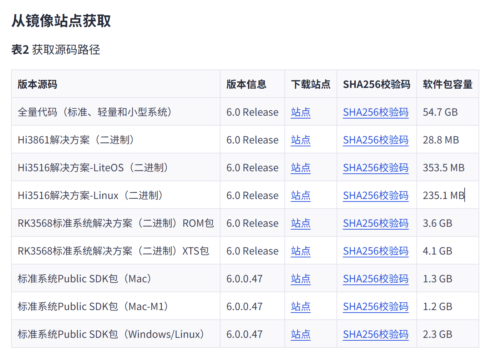

# 书影鉴（ArkTS）

## 介绍

本篇 Codelab 介绍了如何实现一个基于ArkTS 的简易 图书/电影 内容评价 Demo 应用。其主要功能包括：

- 图书/电影双分区浏览
- 搜索与分类筛选（按关键词匹配、按分类标签筛选）
- 榜单（按评分排序，支持分类 Top）
- 图书/电影详情页：收藏、评分、评论
- 广场：发帖、点赞、评论
- 收藏：聚合展示已收藏的图书/电影

本应用的运行效果如下图所示：


# 搭建 OpenHarmony 环境

## 软件要求

- [DevEco Studio](https://gitcode.com/openharmony/docs/blob/master/zh-cn/application-dev/quick-start/start-overview.md#%E5%B7%A5%E5%85%B7%E5%87%86%E5%A4%87)：DevEco Studio 6.0.0 Release。
- OpenHarmony SDK 版本：API version 20。

## 硬件要求

- 开发板类型：[润和 DAYU200 开发板](https://gitcode.com/hihope/DAYU200/blob/main/README.md)
- OpenHarmony系统：6.0 Release

## 环境搭建

完成本篇 Codelab 先要完成开发环境的搭建，本示例以 DAYU200 开发板为例，参照以下步骤进行：

1. [获取OpenHarmony系统版本](https://gitcode.com/openharmony/docs/blob/master/zh-cn/device-dev/get-code/sourcecode-acquire.md#%E8%8E%B7%E5%8F%96%E6%96%B9%E5%BC%8F3%E4%BB%8E%E9%95%9C%E5%83%8F%E7%AB%99%E7%82%B9%E8%8E%B7%E5%8F%96)：标准系统解决方案（二进制）。以 6.0 版本为例：
   
   

2. 搭建烧录环境
   
   1. [完成DevEco Device Tool的安装](https://gitcode.com/openharmony/docs/blob/master/zh-cn/device-dev/quick-start/quickstart-ide-env-win.md)
   2. [完成DAYU200开发板的烧录](https://gitcode.com/hihope/DAYU200/blob/main/%E7%83%A7%E5%86%99%E5%B7%A5%E5%85%B7%E5%8F%8A%E6%8C%87%E5%8D%97/windows/%E7%83%A7%E5%BD%95%E6%8C%87%E5%AF%BC%E6%96%87%E6%A1%A3.md)

3. 搭建开发环境
   
   1. 开始前请参考[工具准备](https://gitcode.com/openharmony/docs/blob/master/zh-cn/application-dev/quick-start/start-overview.md#%E5%B7%A5%E5%85%B7%E5%87%86%E5%A4%87)，完成DevEco Studio的安装和开发环境配置。
   2. 开发环境配置完成后，请参考[使用工程向导](https://gitcode.com/openharmony/docs/blob/master/zh-cn/application-dev/quick-start/start-with-ets-fa.md#%E5%88%9B%E5%BB%BAets%E5%B7%A5%E7%A8%8B)创建工程（模板选择“Empty Ability”），选择 JS 或者 eTS 语言开发。
   3. 工程创建完成后，选择使用[真机进行调测](https://gitcode.com/openharmony/docs/blob/master/zh-cn/application-dev/quick-start/start-with-ets-fa.md#%E4%BD%BF%E7%94%A8%E7%9C%9F%E6%9C%BA%E8%BF%90%E8%A1%8C%E5%BA%94%E7%94%A8)。

# 代码结构解读

本篇 Codelab 只对核心代码进行讲解，完整代码可以直接从 gitcode 获取。

```typescript
├──entry/src/main/ets
│  ├──entryability
│  │  └──EntryAbility.ets                // 程序入口类
│  ├──entrybackupability
│  │  └──EntryBackupAbility.ets          // 数据备份与恢复类
│  ├──model
│  │  ├──BookData.ets                    // 图书数据
│  │  └──MovieData.ets                   // 电影数据
│  ├──pages
│  │  ├──CommunityComp.ets               // 广场组件
│  │  ├──Index.ets                       // 首页
│  │  ├──Login.ets                       // 简易登录页
│  │  ├──MediaDetail.ets                 // 详情页
│  │  ├──MediaSearch.ets                 // 搜索页：关键词/分类筛选
│  │  ├──MyFavorites.ets                 // 收藏：展示收藏列表
│  │  ├──MyPage.ets                      // 用户主页
│  │  ├──PostDetail.ets                  // 帖子详情
│  │  ├──RankPage.ets                    // 榜单页
│  │  ├──RatingDialog.ets                // 评分弹窗
│  └──utils
│     └──RdbUtil.ets                     // RDB 封装：用户/收藏/帖子/评分/评论
├──entry/src/main/resources               // 应用静态资源目录
└──entry/src/main/module.json5            // 模块配置
```

## 首页（Index）

首页既是“书/影发现页”，也是应用的主容器：上层用 `section` 切换图书/电影内容区，中部提供“搜索/榜单”两个入口，下层用 Tabs 承载“首页/广场/个人中心”。

核心代码如下：

```typescript
// 1) 书/影分区与推荐游标
@State private section: 'book' | 'movie' = 'book'
@State private recommendIndex: number = 0
@State private recommendMovieIndex: number = 0
private readonly featuredBooks: Book[] = initialBooks
private readonly featuredMovies: Movie[] = initialMovies

// 2) 分区切换（点击 “图书/电影” tab）
ForEach((['book', 'movie'] as const), (it) => {
  Text(it === 'book' ? '图书' : '电影')
    .onClick(() => { this.section = it })
})

// 3) 两个主要入口：搜索/榜单（电影模式通过 params.type 传参）
if (this.section === 'book') {
  router.pushUrl({ url: 'pages/MediaSearch' })
  router.pushUrl({ url: 'pages/RankPage' })
} else {
  router.pushUrl({ url: 'pages/MediaSearch', params: { type: 'movie' } })
  router.pushUrl({ url: 'pages/RankPage', params: { type: 'movie' } })
}

// 4) 推荐列表：每次展示 4 个，支持“ 换一批” 循环
ForEach(this.featuredBooks.slice(this.recommendIndex, this.recommendIndex + 4), (b: Book) => {
  router.pushUrl({ url: 'pages/MediaDetail', params: { book: b } })
})
this.recommendIndex = (this.recommendIndex + 4) % this.featuredBooks.length

ForEach(this.featuredMovies.slice(this.recommendMovieIndex, this.recommendMovieIndex + 4), (m: Movie) => {
  router.pushUrl({ url: 'pages/MediaDetail', params: { book: m, type: 'movie' } })
})
this.recommendMovieIndex = (this.recommendMovieIndex + 4) % this.featuredMovies.length

// 5) 底部 Tabs：承载首页/广场/个人中心；广场未登录时统一跳转登录页
Tabs({ barPosition: BarPosition.End, index: this.currentTab }) {
  TabContent() { this.homeContent() }
  TabContent() {
    CommunityComp({
      updateTrigger: this.userUpdateTrigger,
      onNeedLogin: (tip?: string) => {
        router.pushUrl({
          url: 'pages/MyPage',
          params: { tip: tip ?? '请登录后发布动态', backOnSuccess: true, isPageMode: true }
        })
      }
    })
  }
  TabContent() { MyPageComp({ tip: this.loginTip, updateTrigger: this.userUpdateTrigger }) }
}
```

- 分区：`section` 控制图书/电影两套入口与推荐列表。

- 推荐：通过 `slice(index, index + 4)` 做分页窗口，“换一批”把游标加 4 并对长度取模。

- 路由：进入搜索/榜单/详情页统一用 `router.pushUrl()`；电影场景通过 `params.type = 'movie'` 透传到目标页。

- Tabs：广场组件把“未登录提示”回调给首页统一处理，跳转到 `pages/MyPage` 完成登录后再返回。
  
  ## 搜索页（MediaSearch）
  
  搜索页做两件事：
1. 根据路由参数切换“图书/电影”数据源与分类。
2. 根据输入关键词 + 分类过滤列表；有关键词时按评分排序（评分相同按评分人数），无关键词时保持原始列表顺序。

核心代码如下：

### 1) 类型切换（路由参数驱动）

```typescript
aboutToAppear() {
  const params = router.getParams() as Record<string, Object> | undefined
  if (params && params['type'] === 'movie') {
    this.searchType = 'movie'
    this.categories = ['全部', '科幻', '动作', '喜剧']
    this.items = initialMovies
  } else {
    this.searchType = 'book'
    this.categories = ['全部', '计算机', '科学技术', '数学']
    this.items = initialBooks
  }
}
```

- `type === 'movie'` 时进入电影模式，否则默认图书模式。

### 2) 筛选与排序（关键词 AND + 分类）

```typescript
private filteredItems(): (Book | Movie)[] {
  const q = this.query.trim().toLowerCase()
  const keywords = q.split(/\s+/).filter(k => k.length > 0)
  const cat = this.selectedCategory

  const base = this.items.filter((b: Book | Movie) => {
    let hitQuery = true
    if (keywords.length > 0) {
      let fullText = ''
      if (this.searchType === 'book') {
        const book = b as Book
        fullText = (book.title + ' ' + book.author + ' ' + book.publisher + ' ' + book.year).toLowerCase()
      } else {
        const movie = b as Movie
        const castNames = movie.cast.map(c => c.name).join(' ')
        fullText = (movie.title + ' ' + movie.director + ' ' + castNames + ' ' + movie.year).toLowerCase()
      }

      for (const k of keywords) {
        if (!fullText.includes(k)) {
          hitQuery = false
          break
        }
      }
    }

    const hitCat = cat === '全部' || b.tags.includes(cat)
    return hitQuery && hitCat
  })

  const sorted = base.slice()
  if (keywords.length > 0) {
    sorted.sort((a: Book | Movie, b: Book | Movie) => {
      if (b.rating !== a.rating) {
        return b.rating - a.rating
      }
      return b.ratingCount - a.ratingCount
    })
  }
  return sorted
}
```

- 关键词用空格分词，并用 `every()` 实现“所有关键词都命中”（AND）。

- 分类通过 `item.tags.includes(cat)` 过滤；有关键词时按 `rating` 降序输出（评分相同按 `ratingCount`），无关键词时保持原顺序。
  
  ## 榜单页（RankPage）
  
  榜单页的核心就是：选数据源（图书/电影）→ 统一排序（评分优先，评分人数兜底）→ 按榜单类型截取 Top。

核心逻辑在 `getRankData()`：

```typescript
private getRankData(): (Book | Movie)[] {
  let list: (Book | Movie)[] = this.rankType === 'movie' ? [...initialMovies] : [...initialBooks]

  const sortFn = (a: Book | Movie, b: Book | Movie) => {
    if (b.rating !== a.rating) return b.rating - a.rating
    return b.ratingCount - a.ratingCount
  }

  if (this.currentRank === '口碑榜Top10') {
    list.sort(sortFn)
    return list.slice(0, 10)
  }

  if (this.currentRank.endsWith('Top5')) {
    const tag = this.currentRank.replace('Top5', '')
    list = list.filter(item => item.tags.includes(tag))
    list.sort(sortFn)
    return list.slice(0, 5)
  }

  return list.slice(0, 10)
}
```

- 口碑榜：全量排序后取前 10。
- 分类 Top5：先按 `tags` 过滤，再排序后取前 5。
- 数量不足时：`slice(0, 10)` / `slice(0, 5)` 会返回实际可用数量（可能少于 10/5），不会越界或报错。

## 详情页（MediaDetail）

详情页负责把一个条目的“互动能力”串联起来：初始化参数 → 加载登录态 → 收藏/评分/评论 → 刷新评分统计。

### 1) 参数初始化与页面加载

详情页通过路由参数拿到 `book`（图书或电影对象）和可选的 `type`（默认图书）。初始化后，会加载当前用户、检查收藏状态，并拉取评论与评分统计。

```typescript
async aboutToAppear(): Promise<void> {
  const params = router.getParams() as Record<string, Object> | undefined
  if (!params || !params['book']) {
    this.hasBook = false
    return
  }

  this.book = params['book'] as MediaItem
  this.type = (params['type'] as 'book' | 'movie') || 'book'
  this.hasBook = true
  this.status = this.type === 'movie' ? '想看' : '想读'

  this.bookRating = this.book.rating
  this.bookRatingCount = this.book.ratingCount

  await this.loadUser()
  if (this.userName.length > 0) {
    await this.checkFavorite()
  }
  await this.loadReviews()
}
```

### 2) 收藏（依赖登录态）

收藏按钮会根据 `isFavorited` 调用 RDB 的增删接口；未登录时统一引导到 `pages/MyPage` 登录。

```typescript
private async toggleFavorite(): Promise<void> {
  if (this.userName.length <= 0) {
    this.goLogin('请登录后收藏')
    return
  }

  const ctx = getContext(this) as Context
  if (this.isFavorited) {
    const ok = await RdbUtil.removeFavorite(ctx, this.userName, this.book.id)
    if (ok) this.isFavorited = false
  } else {
    const ok = await RdbUtil.addFavorite(ctx, this.userName, this.book.id, this.type)
    if (ok) this.isFavorited = true
  }
}
```

### 3) 评分/评价（弹窗 + 写入 RDB）

评分入口会打开 `RatingDialog`。提交后把评分/文本评价以 `DbReview` 写入本地数据库，并重新加载列表与统计。

```typescript
private openRatingDialog() {
  if (this.userName.length <= 0) {
    this.goLogin('请登录后评分')
    return
  }

  this.dialogController = new CustomDialogController({
    builder: RatingDialog({
      rating: this.userRating,
      content: this.userReviewContent,
      isExist: this.userRating > 0,
      action: (rating: number, content: string): void => { this.saveReview(rating, content) },
      deleteAction: () => { this.deleteRating() }
    }),
    alignment: DialogAlignment.Center,
    autoCancel: true,
    customStyle: true
  })
  this.dialogController.open()
}

private async saveReview(rating: number, content: string) {
  const ctx = getContext(this) as Context
  const now = new Date()
  const dateStr = `${now.getFullYear()}-${String(now.getMonth() + 1).padStart(2, '0')}-${String(now.getDate()).padStart(2, '0')}`

  const review = new DbReview(
    `review_${this.book.id}_${this.userName}`,
    this.userName,
    this.userAvatarKey,
    rating,
    content,
    dateStr,
    0
  )

  await RdbUtil.upsertReview(ctx, this.book.id, review)
  await this.loadReviews()
}
```

### 4) 评论列表与评分统计

- 评论列表只展示“有文本内容”的评价（纯评分不进入列表），并在数据库无数据时使用内置 mock 评价作为 fallback。
- 评分统计（均分/人数/星级分布）在 `loadReviews()` 末尾通过 `refreshStats()` 从本地 RDB 汇总后刷新 UI（包括顶部评分、人数与分布条形图）。

## 广场（CommunityComp / PostDetail）

广场是一个轻量动态流：列表展示帖子 → 登录后可发帖/点赞 → 点击进入详情评论。

### 1) 列表加载（用户态 + 帖子列表）

`CommunityComp` 在生命周期里加载当前用户与帖子列表；当 Tab 切换触发 `updateTrigger` 时也会刷新。

```typescript
private async loadUser() {
  const ctx = getContext(this) as Context
  const u = await RdbUtil.getCurrentUser(ctx)
  if (u) {
    this.userName = u.name
    this.userAvatarKey = u.avatarKey
  } else {
    this.userName = ''
    this.userAvatarKey = 'user'
  }
}

private async loadPosts() {
  const ctx = getContext(this) as Context
  this.posts = await RdbUtil.getPosts(ctx, this.userName)
}
```

### 2) 发帖（写入 posts 表）

发帖要求登录且内容非空，成功后关闭弹层并重新拉取列表。

```typescript
private async submitPost() {
  if (this.userName === '') {
    promptAction.showToast({ message: '请先登录' })
    return
  }
  if (this.newPostContent.trim() === '') {
    promptAction.showToast({ message: '请输入内容' })
    return
  }

  const ctx = getContext(this) as Context
  const now = new Date()
  const p = new DbPost(
    `post_${now.getTime()}`,
    this.userName,
    this.userAvatarKey,
    this.newPostContent,
    this.newPostTags,
    now.toISOString().split('T')[0],
    0,
    0
  )

  const ok = await RdbUtil.createPost(ctx, p)
  if (ok) {
    this.newPostContent = ''
    this.newPostTags = ''
    this.showPostModal = false
    await this.loadPosts()
    promptAction.showToast({ message: '发布成功' })
  }
}
```

### 3) 点赞与进入帖子详情

点赞同样要求登录；未登录时通过 `onNeedLogin` 统一跳转到 `pages/MyPage`。
点击帖子卡片会进入 `PostDetail`，在详情页里评论/删除自己的评论。

```typescript
router.pushUrl({
  url: 'pages/PostDetail',
  params: { post: post }
})

await RdbUtil.togglePostLike(ctx, this.userName, post.id)
await this.loadPosts()
```

`PostDetail` 中发表评论（写入 `comments` 表）与删除自己的评论：

```typescript
const comment = new DbComment(
  `c_${now.getTime()}`,
  this.post.id,
  this.userName,
  this.userAvatarKey,
  this.inputContent,
  now.toISOString().split('T')[0]
)

await RdbUtil.addComment(ctx, comment)
await RdbUtil.deleteComment(ctx, comment)
```

# 本地数据存储（RdbUtil）

项目通过 `@ohos.data.relationalStore` 做本地持久化，统一封装在 [RdbUtil.ets](file:///d:/Code/codelabs_7053/ETSUI/MediaReview/entry/src/main/ets/utils/RdbUtil.ets)。核心点只有两类：

1) 数据库只打开一次并在启动时建表；2) 页面只调用方法，不直接写 SQL。

```typescript
private static async openStore(context: Context): Promise<relationalStore.RdbStore | null> {
  const config: relationalStore.StoreConfig = {
    name: 'media_review.db',
    securityLevel: relationalStore.SecurityLevel.S1
  }
  const store: relationalStore.RdbStore = await relationalStore.getRdbStore(context, config)
  await store.executeSql('CREATE TABLE IF NOT EXISTS reviews (...)')
  await store.executeSql('CREATE TABLE IF NOT EXISTS user_profile (...)')
  await store.executeSql('CREATE TABLE IF NOT EXISTS users (...)')
  await store.executeSql('CREATE TABLE IF NOT EXISTS user_favorites (...)')
  await store.executeSql('CREATE TABLE IF NOT EXISTS posts (...)')
  await store.executeSql('CREATE TABLE IF NOT EXISTS comments (...)')
  return store
}

private static async getStore(context: Context): Promise<relationalStore.RdbStore | null> {
  if (RdbUtil.store) return RdbUtil.store
  if (RdbUtil.opening) return await RdbUtil.opening
  RdbUtil.opening = RdbUtil.openStore(context)
  const s = await RdbUtil.opening
  RdbUtil.opening = null
  RdbUtil.store = s
  return s
}

static async upsertReview(context: Context, bookId: string, review: DbReview): Promise<boolean> {
  const store = await RdbUtil.getStore(context)
  if (!store) return false
  await store.executeSql(
    'INSERT OR REPLACE INTO reviews (id, bookId, userName, avatarKey, rating, content, createdAt, likeCount) VALUES (?, ?, ?, ?, ?, ?, ?, ?)',
    [review.id, bookId, review.userName, review.avatarKey, review.rating, review.content, review.createdAt, review.likeCount]
  )
  return true
}

static async addFavorite(context: Context, userName: string, mediaId: string, type: string): Promise<boolean> {
  const store = await RdbUtil.getStore(context)
  if (!store) return true
  await store.executeSql(
    'INSERT OR REPLACE INTO user_favorites (id, userName, mediaId, type, createdAt) VALUES (?, ?, ?, ?, ?)',
    [`${userName}_${mediaId}`, userName, mediaId, type, new Date().toISOString()]
  )
  return true
}
```

- `getStore()` 用静态缓存 + `opening` Promise 避免重复打开数据库。
- 评分/收藏/帖子/评论/登录态等数据，都通过 `executeSql()` / `querySql()` 封装为独立方法供页面调用。

# 页面路由

应用页面入口在 main_pages.json（entry/src/main/resources/base/profile/main_pages.json）中配置：

- `pages/Index`
- `pages/MediaSearch`
- `pages/MediaDetail`
- `pages/Login`
- `pages/MyPage`
- `pages/RankPage`
- `pages/MyFavorites`
- `pages/PostDetail`
