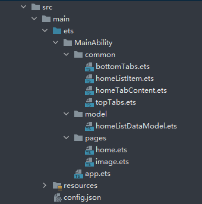

# 一次开发多端部署

# 介绍<a name="ZH-CN_TOPIC_0000001192039058"></a>

-   [应用场景](#section225718574575)

## 应用场景<a name="section225718574575"></a>

随着用户设备类型的不断增加，手机、平板、大屏、车载、穿戴等设备对应用UI界面开发提出了更加多样化的诉求，这就需要应用开发者在开发应用界面的时候考虑多种设备场景，从而导致工程代码量增加，甚至需要维护多个工程来适配不同设备。eTS是极简声明式UI范式开发语言，是OpenHarmony提供的一套开发能力集合，旨在帮助应用开发者快速开发UI界面，自动地适配多种不同的屏幕形态，以达到一次开发，多端部署的目的。

本篇Codelab使用声明式UI范式开发实现一次开发多端部署，效果预览如下:


# 相关概念<a name="ZH-CN_TOPIC_0000001236839003"></a>

# 搭建OpenHarmony环境<a name="ZH-CN_TOPIC_0000001192360070"></a>

完成本篇Codelab我们首先要完成开发环境的搭建，本示例以**Hi3516DV300**开发板为例，参照以下步骤进行：

1. [获取OpenHarmony系统版本](https://gitee.com/openharmony/docs/blob/master/zh-cn/device-dev/get-code/sourcecode-acquire.md#%E8%8E%B7%E5%8F%96%E6%96%B9%E5%BC%8F3%E4%BB%8E%E9%95%9C%E5%83%8F%E7%AB%99%E7%82%B9%E8%8E%B7%E5%8F%96)：标准系统解决方案（二进制）

   以3.0版本为例：

   

2. 搭建烧录环境

   1.  [完成DevEco Device Tool的安装](https://gitee.com/openharmony/docs/blob/master/zh-cn/device-dev/quick-start/quickstart-standard-env-setup.md)

   2.  [完成Hi3516开发板的烧录](https://gitee.com/openharmony/docs/blob/master/zh-cn/device-dev/quick-start/quickstart-lite-steps-hi3516-burn.md)

3. 搭建开发环境

   1.  开始前请参考[工具准备](https://gitee.com/openharmony/docs/blob/master/zh-cn/application-dev/quick-start/start-overview.md#%E5%B7%A5%E5%85%B7%E5%87%86%E5%A4%87)，完成DevEco Studio的安装和开发环境配置。
   2.  开发环境配置完成后，请参考[使用工程向导](https://gitee.com/openharmony/docs/blob/master/zh-cn/application-dev/quick-start/start-with-ets-fa.md#%E5%88%9B%E5%BB%BAets%E5%B7%A5%E7%A8%8B)创建工程（模板选择“Empty Ability”），选择JS或者eTS语言开发。
   3.  工程创建完成后，选择使用[真机进行调测](https://gitee.com/openharmony/docs/blob/master/zh-cn/application-dev/quick-start/start-with-ets-fa.md#%E4%BD%BF%E7%94%A8%E7%9C%9F%E6%9C%BA%E8%BF%90%E8%A1%8C%E5%BA%94%E7%94%A8)。

# 代码结构解读<a name="ZH-CN_TOPIC_0000001192359002"></a>

本篇Codelab只对核心代码进行讲解，以下介绍整个工程的代码结构。



-   common：自定义组件。
    -   bottomTabs.ets：底部页签容器。
    -   homeListItem.ets：首页推荐列表项。
    -   homeTabContent.ets：首页页签内容。
    -   topTabs.ets：顶部标签。

-   model：数据结构和数据初始化。
    -   homeListDataModel.ets：今日推荐、精选推荐、X月推荐数据。

-   pages：页面。
    -   home.ets：首页。
    -   image.ets：图片预览界面。

-   resources：项目资源存放路径，包括图片资源和国际化字符串等。
-   config.json：应用的配置文件。

# 组件的均分能力<a name="ZH-CN_TOPIC_0000001192199020"></a>

底部页签使用Flex组件的均分能力，在不同的屏幕上平均分配宽度。此处使用ForEach在Flex组件中显示4个页签，每个页签是一个Column组件，四个页签会平均分配宽度。Flex组件的参数中，justifyContent参数提供均分布局能力。

**表 1**  Flex属性方法

<a name="table73161329113714"></a>

<table><thead align="left"><tr id="row17317172993713"><th class="cellrowborder" valign="top" width="20%" id="mcps1.2.6.1.1"><p id="p1786714215372"><a name="p1786714215372"></a><a name="p1786714215372"></a>参数名</p>
</th>
<th class="cellrowborder" valign="top" width="20%" id="mcps1.2.6.1.2"><p id="p2868134233716"><a name="p2868134233716"></a><a name="p2868134233716"></a>参数类型</p>
</th>
<th class="cellrowborder" valign="top" width="20%" id="mcps1.2.6.1.3"><p id="p1786824223711"><a name="p1786824223711"></a><a name="p1786824223711"></a>必填</p>
</th>
<th class="cellrowborder" valign="top" width="20%" id="mcps1.2.6.1.4"><p id="p8868154213376"><a name="p8868154213376"></a><a name="p8868154213376"></a>默认值</p>
</th>
<th class="cellrowborder" valign="top" width="20%" id="mcps1.2.6.1.5"><p id="p0868742163710"><a name="p0868742163710"></a><a name="p0868742163710"></a>参数描述</p>
</th>
</tr>
</thead>
<tbody><tr id="row93175292379"><td class="cellrowborder" valign="top" width="20%" headers="mcps1.2.6.1.1 "><p id="p18868124210373"><a name="p18868124210373"></a><a name="p18868124210373"></a>direction</p>
</td>
<td class="cellrowborder" valign="top" width="20%" headers="mcps1.2.6.1.2 "><p id="p188687424373"><a name="p188687424373"></a><a name="p188687424373"></a>FlexDirection</p>
</td>
<td class="cellrowborder" valign="top" width="20%" headers="mcps1.2.6.1.3 "><p id="p1986874214378"><a name="p1986874214378"></a><a name="p1986874214378"></a>否</p>
</td>
<td class="cellrowborder" valign="top" width="20%" headers="mcps1.2.6.1.4 "><p id="p19868342173718"><a name="p19868342173718"></a><a name="p19868342173718"></a>Row</p>
</td>
<td class="cellrowborder" valign="top" width="20%" headers="mcps1.2.6.1.5 "><p id="p386854253710"><a name="p386854253710"></a><a name="p386854253710"></a>子组件在Flex容器上排列的方向，即主轴的方向。</p>
</td>
</tr>
<tr id="row0319182910377"><td class="cellrowborder" valign="top" width="20%" headers="mcps1.2.6.1.1 "><p id="p1486812425376"><a name="p1486812425376"></a><a name="p1486812425376"></a>wrap</p>
</td>
<td class="cellrowborder" valign="top" width="20%" headers="mcps1.2.6.1.2 "><p id="p9869184219374"><a name="p9869184219374"></a><a name="p9869184219374"></a>FlexWrap</p>
</td>
<td class="cellrowborder" valign="top" width="20%" headers="mcps1.2.6.1.3 "><p id="p1869154203712"><a name="p1869154203712"></a><a name="p1869154203712"></a>否</p>
</td>
<td class="cellrowborder" valign="top" width="20%" headers="mcps1.2.6.1.4 "><p id="p6869144216371"><a name="p6869144216371"></a><a name="p6869144216371"></a>NoWrap</p>
</td>
<td class="cellrowborder" valign="top" width="20%" headers="mcps1.2.6.1.5 "><p id="p1686904215372"><a name="p1686904215372"></a><a name="p1686904215372"></a>Flex容器是单行/列还是多行/列排列。</p>
</td>
</tr>
<tr id="row23191629193714"><td class="cellrowborder" valign="top" width="20%" headers="mcps1.2.6.1.1 "><p id="p28692421374"><a name="p28692421374"></a><a name="p28692421374"></a>justifyContent</p>
</td>
<td class="cellrowborder" valign="top" width="20%" headers="mcps1.2.6.1.2 "><p id="p18869174233718"><a name="p18869174233718"></a><a name="p18869174233718"></a>FlexAlign</p>
</td>
<td class="cellrowborder" valign="top" width="20%" headers="mcps1.2.6.1.3 "><p id="p1286974217377"><a name="p1286974217377"></a><a name="p1286974217377"></a>否</p>
</td>
<td class="cellrowborder" valign="top" width="20%" headers="mcps1.2.6.1.4 "><p id="p11869164220378"><a name="p11869164220378"></a><a name="p11869164220378"></a>Start</p>
</td>
<td class="cellrowborder" valign="top" width="20%" headers="mcps1.2.6.1.5 "><p id="p1586904293718"><a name="p1586904293718"></a><a name="p1586904293718"></a>子组件在Flex容器主轴上的对齐格式。</p>
</td>
</tr>
<tr id="row1631911299375"><td class="cellrowborder" valign="top" width="20%" headers="mcps1.2.6.1.1 "><p id="p2086954219377"><a name="p2086954219377"></a><a name="p2086954219377"></a>alignItems</p>
</td>
<td class="cellrowborder" valign="top" width="20%" headers="mcps1.2.6.1.2 "><p id="p178691426377"><a name="p178691426377"></a><a name="p178691426377"></a>ItemAlign</p>
</td>
<td class="cellrowborder" valign="top" width="20%" headers="mcps1.2.6.1.3 "><p id="p1186974213719"><a name="p1186974213719"></a><a name="p1186974213719"></a>否</p>
</td>
<td class="cellrowborder" valign="top" width="20%" headers="mcps1.2.6.1.4 "><p id="p1986974273717"><a name="p1986974273717"></a><a name="p1986974273717"></a>Stretch</p>
</td>
<td class="cellrowborder" valign="top" width="20%" headers="mcps1.2.6.1.5 "><p id="p887094243718"><a name="p887094243718"></a><a name="p887094243718"></a>子组件在Flex容器交叉轴上的对齐格式。</p>
</td>
</tr>
<tr id="row103201295371"><td class="cellrowborder" valign="top" width="20%" headers="mcps1.2.6.1.1 "><p id="p6870184283714"><a name="p6870184283714"></a><a name="p6870184283714"></a>alignContent</p>
</td>
<td class="cellrowborder" valign="top" width="20%" headers="mcps1.2.6.1.2 "><p id="p14870164213372"><a name="p14870164213372"></a><a name="p14870164213372"></a>FlexAlign</p>
</td>
<td class="cellrowborder" valign="top" width="20%" headers="mcps1.2.6.1.3 "><p id="p187044253710"><a name="p187044253710"></a><a name="p187044253710"></a>否</p>
</td>
<td class="cellrowborder" valign="top" width="20%" headers="mcps1.2.6.1.4 "><p id="p9870542113710"><a name="p9870542113710"></a><a name="p9870542113710"></a>Start</p>
</td>
<td class="cellrowborder" valign="top" width="20%" headers="mcps1.2.6.1.5 "><p id="p0870114217371"><a name="p0870114217371"></a><a name="p0870114217371"></a>交叉轴中有额外的空间时，多行内容的对齐方式。</p>
</td>
</tr>
</tbody>
</table>


**表 2**  FlexAlign：

<a name="table1688854511115"></a>

<table><thead align="left"><tr id="row488814456115"><th class="cellrowborder" valign="top" width="25.2%" id="mcps1.2.3.1.1"><p id="p15888245171113"><a name="p15888245171113"></a><a name="p15888245171113"></a>名称</p>
</th>
<th class="cellrowborder" valign="top" width="74.8%" id="mcps1.2.3.1.2"><p id="p68881545171110"><a name="p68881545171110"></a><a name="p68881545171110"></a>描述</p>
</th>
</tr>
</thead>
<tbody><tr id="row3888164515112"><td class="cellrowborder" valign="top" width="25.2%" headers="mcps1.2.3.1.1 "><p id="p18888114513115"><a name="p18888114513115"></a><a name="p18888114513115"></a>Start</p>
</td>
<td class="cellrowborder" valign="top" width="74.8%" headers="mcps1.2.3.1.2 "><p id="p788818451116"><a name="p788818451116"></a><a name="p788818451116"></a>元素在主轴方向首端对齐， 第一个元素与行首对齐，同时后续的元素与前一个对齐。</p>
</td>
</tr>
<tr id="row1488834517117"><td class="cellrowborder" valign="top" width="25.2%" headers="mcps1.2.3.1.1 "><p id="p0888164551119"><a name="p0888164551119"></a><a name="p0888164551119"></a>Center</p>
</td>
<td class="cellrowborder" valign="top" width="74.8%" headers="mcps1.2.3.1.2 "><p id="p5888945161112"><a name="p5888945161112"></a><a name="p5888945161112"></a>元素在主轴方向中心对齐，第一个元素与行首的距离与最后一个元素与行尾距离相同。</p>
</td>
</tr>
<tr id="row6888545131114"><td class="cellrowborder" valign="top" width="25.2%" headers="mcps1.2.3.1.1 "><p id="p988813459116"><a name="p988813459116"></a><a name="p988813459116"></a>End</p>
</td>
<td class="cellrowborder" valign="top" width="74.8%" headers="mcps1.2.3.1.2 "><p id="p7888945151114"><a name="p7888945151114"></a><a name="p7888945151114"></a>元素在主轴方向尾部对齐，最后一个元素与行尾对齐，其他元素与后一个对齐。</p>
</td>
</tr>
<tr id="row1888104591116"><td class="cellrowborder" valign="top" width="25.2%" headers="mcps1.2.3.1.1 "><p id="p2088819453111"><a name="p2088819453111"></a><a name="p2088819453111"></a>SpaceBetween</p>
</td>
<td class="cellrowborder" valign="top" width="74.8%" headers="mcps1.2.3.1.2 "><p id="p16888845151118"><a name="p16888845151118"></a><a name="p16888845151118"></a>Flex主轴方向均匀分配弹性元素，相邻元素之间距离相同。 第一个元素与行首对齐，最后一个元素与行尾对齐。</p>
</td>
</tr>
<tr id="row1271965421219"><td class="cellrowborder" valign="top" width="25.2%" headers="mcps1.2.3.1.1 "><p id="p77209547128"><a name="p77209547128"></a><a name="p77209547128"></a>SpaceAround</p>
</td>
<td class="cellrowborder" valign="top" width="74.8%" headers="mcps1.2.3.1.2 "><p id="p643212229589"><a name="p643212229589"></a><a name="p643212229589"></a>Flex主轴方向均匀分配弹性元素，相邻元素之间距离相同。 第一个元素到行首的距离和最后一个元素到行尾的距离时相邻元素之间距离的一半。</p>
</td>
</tr>
<tr id="row18985013132"><td class="cellrowborder" valign="top" width="25.2%" headers="mcps1.2.3.1.1 "><p id="p1789816012137"><a name="p1789816012137"></a><a name="p1789816012137"></a>SpaceEvenly</p>
</td>
<td class="cellrowborder" valign="top" width="74.8%" headers="mcps1.2.3.1.2 "><p id="p1889818012134"><a name="p1889818012134"></a><a name="p1889818012134"></a>Flex主轴方向元素等间距布局， 相邻元素之间的间距、第一个元素与行首的间距、最后一个元素到行尾的间距都完全一样。</p>
</td>
</tr>
</tbody>
</table>


```
@Component
export struct BottomTabs {
  build() {
    // justifyContent: FlexAlign.SpaceEvenly是Flex组件的均分布局能力
    Flex({ direction: FlexDirection.Row, alignItems: ItemAlign.Center, justifyContent: FlexAlign.SpaceEvenly }) {          
      ForEach(this.tabSrc, item => {
        Column() {
          Image(getTabSrc(this.bottomTabIndex, item))
            .objectFit(ImageFit.Contain)
            .width('60%')
            .height('60%')
          Text($r('app.string.tab_strings'))
            .fontSize(14)
            .fontColor(getTabTextColor(this.bottomTabIndex, item))
        }
      })
    }
    .width('100%')
    .height('10%') 
  }
}
```

# 组件的拉伸能力<a name="ZH-CN_TOPIC_0000001192359000"></a>

本篇Codelab的首页顶部标签是自定义组件TopTabs，使用权重layoutWeight、尺寸约束、外边属性和百分比的能力来对组件进行布局约束，实现在不同设备上组件的拉伸效果。

layoutWeight：容器尺寸确定时，元素与兄弟节点主轴布局尺寸按照权重进行分配，忽略本身尺寸设置。

constraintSize：设置约束尺寸，组件布局时，进行尺寸范围限制。

margin：设置外边属性。

```
@Component
export struct TopTabs {
  build() {
    Flex({ direction: FlexDirection.Row, alignItems: ItemAlign.Center }) {
      Row() {
        ForEach(this.tabs, item => {
          if (this.tabs.indexOf(item) == 0) {
            Text(item)
              .fontSize(18)
              .fontWeight(FontWeight.Bold)
          } else {
            Text(item)
              .fontSize(17)
              .fontWeight(FontWeight.Medium)
              .margin({ left: '5%' }) // 设置左侧距离兄弟节点的距离，使用百分比 
          }
        }, item => this.tabs.indexOf(item).toString())
      }
      .layoutWeight(1) // 设置权重为1，其他兄弟节点不设置，则此处的文字标签会把搜索和设置图标显示后剩余的空间占满
      .height('100%')

      Image($r('app.media.search'))
        .width('7%') // 占容器宽度的百分比
        .height('80%') // 占容器高度的百分比
        .constraintSize({ maxWidth: 25 }) // 尺寸约束，设置最大宽度
        .objectFit(ImageFit.Contain)
    }
    .height('8%')
    .width('100%')
    .alignSelf(ItemAlign.Start)
  }
}
```

# 组件的占比能力<a name="ZH-CN_TOPIC_0000001192741024"></a>

- 在首页中，除去底部页签和顶部标签，中间部分是可以滑动的，放在List中，List占满除去底部和顶部的空间。TabContent中，顶部显示TopTabs，List设置layoutWeight\(1\)，由于顶部标签没有设置权重，所以这里List权重最高，会自动占满剩余空间。如果顶部TopTabs有设置layoutWeight，则会根据权重进行比例分配控件。。

  layoutWeight：容器尺寸确定时，元素与兄弟节点主轴布局尺寸按照权重进行分配，忽略本身尺寸设置。

  ```
  @Component
  export struct HomeTabComponent {
    build() {
      Column() {
        TopTabs({ showSettings: $showSettings })
        List() {
        }
        .listDirection(Axis.Vertical)
        .width('100%')
        .layoutWeight(1)
      }
    }
  }
  ```


- 子组件设置占父组件固定比例。顶部Banner设置占屏幕高度的固定占比为30%，则当父组件高度不同时顶部Banner始终占父组件高度的30%。

  ```
  @Component
  export struct SubscribeSwiper {
    private index: number = 0
  
    build() {
      Swiper() {
        ForEach(subscribeItems, item => {
          SwiperItem({ index: item.id })
        }, item => item.title.toString())
      }
      .width('100%')
      .height('30%') // 高度占父组件的30% 在不同屏幕上显示高度不同
      .indicator(false)
      .index(this.index)
      .autoPlay(true)
      .itemSpace(15)
      .displayMode(SwiperDisplayMode.AutoLinear)
      .margin({ bottom: '5%' })
    }
  }
  ```

# 组件的延伸能力<a name="ZH-CN_TOPIC_0000001237700981"></a>

延伸能力指布局内能够显示的组件数量根据容器组件的尺寸变化而变化，在eTS中List组件自带延伸能力，使用List组件时，在不同屏幕上显示的ListItem的数目不一样。

```
List({ initialIndex: 0}) {
  ForEach(this.listItems, item => {
    ListItem() {
      Image(item.smallImg)
        .width(this.imageWidth)
        .aspectRatio(this.ratio)
        .borderRadius(10)
        .margin({ right: 15 })
    }
  }, item => item.toString())
}
.listDirection(Axis.Horizontal)
.margin({ top: '2%', bottom: '2%' })
```

# 恭喜你<a name="ZH-CN_TOPIC_0000001236998993"></a>