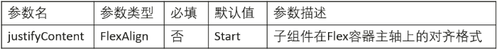
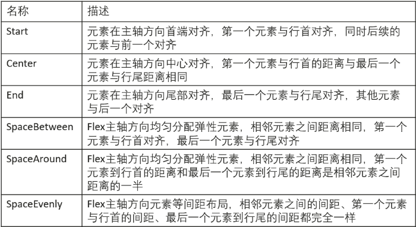

# 一次开发多端部署（ArkTS）

## 介绍

随着终端设备类型的不断丰富，用户对于应用UI界面的设计开发有了多样化的诉求，应用需要在多种终端设备上实现操作与美观层面的统一。这要求开发者在应用开发初期就考虑应用在多种终端设备上的运行场景，并据此来设计开发多套代码以适配不同设备，增加了开发成本。ArkTS是OpenHarmony提供的一种声明式UI开发范式，它提供的UI开发能力，旨在简化应用开发场景，使开发者能快速部署应用UI界面，并能适配不同的设备屏幕形态，实现“一次开发，多端部署”的目的。

本篇Codelab使用ArkTS实现应用的“一次开发，多端部署”，效果如下图所示：


### 相关概念

- [List](https://gitee.com/openharmony/docs/blob/master/zh-cn/application-dev/reference/arkui-ts/ts-container-list.md)：包含一系列相同宽度的列表项，适合连续、多行呈现同类数据，例如图片和文本。

- [Flex](https://gitee.com/openharmony/docs/blob/master/zh-cn/application-dev/reference/arkui-ts/ts-container-flex.md)：弹性布局组件。

- [Swiper](https://gitee.com/openharmony/docs/blob/master/zh-cn/application-dev/reference/arkui-ts/ts-container-swiper.md)：滑动容器，提供切换子组件显示的能力。

## 环境搭建

### 软件要求

-   [DevEco Studio](https://gitee.com/openharmony/docs/blob/master/zh-cn/application-dev/quick-start/start-overview.md#%E5%B7%A5%E5%85%B7%E5%87%86%E5%A4%87)版本：DevEco Studio 3.1 Canary1及以上版本。
-   OpenHarmony SDK版本：API version 9及以上版本。

### 硬件要求

-   开发板类型：[润和RK3568开发板](https://gitee.com/openharmony/docs/blob/master/zh-cn/device-dev/quick-start/quickstart-appendix-rk3568.md)。
-   OpenHarmony系统：3.2 Beta3及以上版本。

### 环境搭建

完成本篇Codelab我们首先要完成开发环境的搭建，本示例以**RK3568**开发板为例，参照以下步骤进行：

1.  [获取OpenHarmony系统版本](https://gitee.com/openharmony/docs/blob/master/zh-cn/device-dev/get-code/sourcecode-acquire.md#%E8%8E%B7%E5%8F%96%E6%96%B9%E5%BC%8F3%E4%BB%8E%E9%95%9C%E5%83%8F%E7%AB%99%E7%82%B9%E8%8E%B7%E5%8F%96)：标准系统解决方案（二进制）。以3.2 Beta3版本为例：

    

2.  搭建烧录环境。
    1.  [完成DevEco Device Tool的安装](https://gitee.com/openharmony/docs/blob/master/zh-cn/device-dev/quick-start/quickstart-ide-env-win.md)
    2.  [完成RK3568开发板的烧录](https://gitee.com/openharmony/docs/blob/master/zh-cn/device-dev/quick-start/quickstart-ide-3568-burn.md)

3.  搭建开发环境。
    1.  开始前请参考[工具准备](https://gitee.com/openharmony/docs/blob/master/zh-cn/application-dev/quick-start/start-overview.md#%E5%B7%A5%E5%85%B7%E5%87%86%E5%A4%87)，完成DevEco Studio的安装和开发环境配置。
    2.  开发环境配置完成后，请参考[使用工程向导](https://gitee.com/openharmony/docs/blob/master/zh-cn/application-dev/quick-start/start-with-ets-stage.md#创建ets工程)创建工程（模板选择“Empty Ability”），选择JS或者eTS语言开发。
    3.  工程创建完成后，选择使用[真机进行调测](https://gitee.com/openharmony/docs/blob/master/zh-cn/application-dev/quick-start/start-with-ets-stage.md#使用真机运行应用)。

## 代码结构解读

本篇Codelab只对核心代码进行讲解，完整代码可以直接从gitee获取。

```
├──entry/src/main/ets               // 代码区
│  ├──common
│  │  ├──bean
│  │  │  └──Item.ets                // 资源类接口
│  │  ├──constants
│  │  │  └──CommonConstants.ets     // 公共常量
│  │  └──utils
│  │     └──BreakpointSystem.ets    // 媒体查询类
│  ├──entryability
│  │  └──EntryAbility.ts            // 程序入口类
│  ├──pages
│  │  └──Home.ets                   // 应用首页
│  ├──view
│  │  ├──BottomTabsComponent.ets    // 底部页签组件
│  │  ├──HomeSwiperComponent.ets    // Swiper组件
│  │  ├──HomeTabContent.ets         // 首页内容组件
│  │  └──TopTabsComponent.ets       // 顶部标签组件
│  └──viewmodel
│     ├──BottomTabsModel.ets        // 底部页签model
│     ├──HomeListModel.ets          // 首页列表model
│     ├──HomeSwiperModel.ets        // Swiper组件model
│     └──TopTabsModel.ets           // 顶部标签model
└──entry/src/main/resources         // 资源文件夹
```

## 组件的拉伸能力

本篇Codelab的顶部标签使用了组件的拉伸能力，在设备的横屏形态和竖屏形态下，顶部标签会被等比拉伸，以保证应用在多种屏幕形态下的美观性，效果如下图所示：


本篇Codelab使用了自定义组件TopTabs来实现该效果，其中margin属性的作用是确定标签之间的间隔距离，layoutWeight属性的作用是在容器尺寸确定时，元素与兄弟节点的主轴布局尺寸会按照设置的权重进行分配，忽略本身的尺寸设置。代码如下：

```typescript
@Component
export struct TopTabs {
  build() {
    Flex({ direction: FlexDirection.Row, alignItems: ItemAlign.Center }) {
      Row() {
        ForEach(TopTabsList, item => {
          if (TopTabsList.indexOf(item) === 0) {
            Text(item)
              .fontSize($r('app.float.top_font_size_selected'))
              .fontWeight(FontWeight.Bold)
          } else {
            Text(item)
              .fontSize($r('app.float.top_font_size'))
              .fontWeight(FontWeight.Medium)
              .fontColor($r('app.color.top_tabs_font_color'))
              .opacity(Const.TOP_FONT_OPACITY)
              .margin({ left: Const.TOP_FONT_MARGIN })  // 使用百分比设置左侧距离兄弟节点的距离
          }
        })
      }
      .height(Const.FULL_SIZE)
      .layoutWeight(Const.LAYOUT_WEIGHT)  // 此处设置权重为1，则顶部标签会占满全部空间
    }
    .width(Const.FULL_SIZE)
    .height(Const.TOP_TAB_HEIGHT)
    .alignSelf(ItemAlign.Start)
  }
}
```

## 组件的占比能力

本篇Codelab的首页中，除开顶部标签和底部页签，中间部分可以上下滑动，以在不同的设备形态下能够显示全部内容，效果图如下：


该实现是将中间内容放在List中，并设置属性layoutWeight\(1\)，由于顶部标签没有设置权重，所以List权重最高，会占满顶部标签和底部页签之间的全部空间，代码如下：

```typescript
@Component
export struct HomeTabComponent {
  @StorageProp('currentBreakpoint') currentBreakpoint: string = 'md';

  build() {
    Column() {
      TopTabs()
        .margin({ bottom: $r('app.float.top_margin') })
        // 此处不设置layoutWeight权重

      List() {
      ...  // 省略中间内容
      }
      .width(Const.FULL_SIZE)
      .height(Const.FULL_SIZE)
      .listDirection(Axis.Vertical)
      .layoutWeight(Const.LAYOUT_WEIGHT)  // 此处设置权重为1
    }
    .width(Const.FULL_SIZE)
  }
}
```

## 组件的延伸能力

本篇Codelab首页中的各个子栏目，显示的图片数量能够根据容器尺寸进行调整，效果图如下：


ArkTS中的List组件自带延伸能力，在不同屏幕形态上显示的ListItem数量不同，在不能全部显示时，可以滑动来显示剩余内容，代码如下：

```typescript
List() {
  ForEach(item.Item, (listItem: SwiperItem) => {
    ListItem() {
      Column() {
	...  // 省略中间内容
      }
      .alignItems(HorizontalAlign.Start)
    }
  })
}
```

## 组件的均分能力

本篇Codelab的底部页签使用了组件的均分能力，在不同的屏幕形态上都能平均分配宽度，效果图如下：

.png)

实现方法是使用Flex组件的justifyContent参数提供均分布局能力，justifyContent参数信息如下表所示：



FlexAlign参数信息如下表所示：



本篇Codelab使用FlexAlign.SpaceEvenly来实现底部页签的均匀分布，代码如下：

```typescript
@Component
export struct BottomTabs {
  @Link bottomTabIndex: number;

  build() {
    Flex({ direction: FlexDirection.Row, justifyContent: FlexAlign.SpaceEvenly, alignItems: ItemAlign.Center }) {
      ForEach(BottomTabsList, item => {
        Column() {
          ...  // 省略中间内容
        }
        .width(Const.BOTTOM_TAB_WIDTH)
      })
    }
    .width(Const.FULL_SIZE)
    .height(Const.BOTTOM_TAB_HEIGHT)
    .backgroundColor($r('app.color.bottom_tabs_background_color'))
  }
}
```

## 多态组件

本篇Codelab在首页顶部使用了Swiper组件，Swiper是一种多态组件，可以在不同的终端设备上有不同的显示方式，效果图如下：

.png)

此处使用Swiper组件的displayCount属性来实现该效果，displayCount属性可以设置Swiper组件的元素显示个数。通过媒体查询接口获取屏幕尺寸的变化，根据变化情况改变Swiper组件的元素显示个数，即可在不同形态的设备上实现不同的显示方式，代码如下：

```typescript
// BreakpointSystem.ets
import mediaQuery from '@ohos.mediaquery';
export default class BreakpointSystem {
  ...  // 省略中间内容

  // 监听屏幕尺寸的变化
  public register() {
    this.smListener = mediaQuery.matchMediaSync('(320vp<=width<520vp)');
    this.smListener.on('change', this.isBreakpointSM);
    this.mdListener = mediaQuery.matchMediaSync('(520vp<=width<840vp)');
    this.mdListener.on('change', this.isBreakpointMD);
    this.lgListener = mediaQuery.matchMediaSync('(840vp<=width)');
    this.lgListener.on('change', this.isBreakpointLG);
  }
}

// HomeSwiperComponent.ets
@Component
export struct HomeSwiper {
  @StorageProp('currentBreakpoint') currentBreakpoint: string = 'md';
  private index: number = 0;

  build() {
    Swiper() {
      ForEach(SwiperList, item => {
        ...  // 省略中间内容
      })
    }
    .width(Const.FULL_SIZE)
    .height(Const.SWIPER_HEIGHT)
    .indicator(true)
    .indicatorStyle({ color: $r('app.color.swiper_indicator_color'), selectedColor: Color.White })
    .index(this.index)
    .autoPlay(true)
    .itemSpace(Const.ITEM_SPACE)
    .displayCount(this.currentBreakpoint === 'sm' ?
                  Const.SWIPER_COUNT_1:
                  (this.currentBreakpoint === 'md') ? Const.SWIPER_COUNT_2: Const.SWIPER_COUNT_3)  // 根据屏幕尺寸的变化来确定元素显示个数
    .margin({ bottom: Const.SWIPER_MARGIN })
  }
}
```

## 总结

您已经完成了本次Codelab的学习，并了解到以下知识点：

-   如何使用组件的拉伸、占比、延伸和均分能力进行一次开发多端部署。
-   如何使用多态组件Swiper进行一次开发多端部署。


