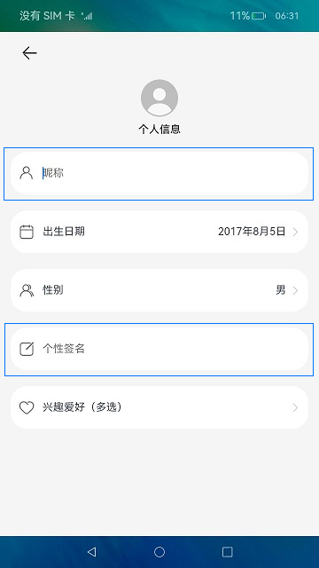
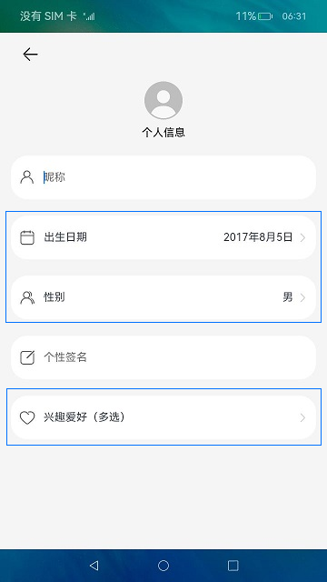
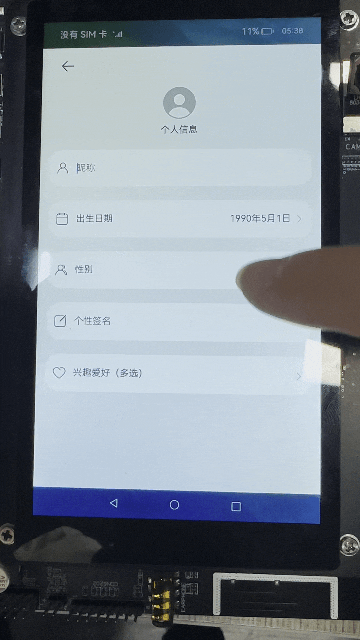

# 构建多种样式弹窗（ArkTS）

## 介绍

本篇Codelab将介绍如何使用弹窗功能，实现四种类型弹窗。分别是：警告弹窗、自定义弹窗、日期滑动选择器弹窗、文本滑动选择器弹窗。需要完成以下功能：

1.  点击左上角返回按钮展示警告弹窗。
2.  点击出生日期展示日期滑动选择器弹窗。
3.  点击性别展示文本滑动选择器弹窗。
4.  点击兴趣爱好（多选）展示自定义弹窗。


### 相关概念
- [警告弹窗](https://gitcode.com/openharmony/docs/blob/master/zh-cn/application-dev/reference/arkui-ts/ts-methods-alert-dialog-box.md)：显示警告弹窗组件，可设置文本内容与响应回调。
- [自定义弹窗](https://gitcode.com/openharmony/docs/blob/master/zh-cn/application-dev/reference/arkui-ts/ts-methods-custom-dialog-box.md)： 通过CustomDialogController类显示自定义弹窗。
- [日期滑动选择器弹窗](https://gitcode.com/openharmony/docs/blob/master/zh-cn/application-dev/reference/arkui-ts/ts-methods-datepicker-dialog.md)：根据指定范围的Date创建可以选择日期的滑动选择器，展示在弹窗上。
- [文本滑动选择器弹窗](https://gitcode.com/openharmony/docs/blob/master/zh-cn/application-dev/reference/arkui-ts/ts-methods-textpicker-dialog.md)：根据指定的选择范围创建文本选择器，展示在弹窗上。

## 环境搭建

### 软件要求

-   [DevEco Studio](https://gitcode.com/openharmony/docs/blob/master/zh-cn/application-dev/quick-start/start-overview.md#%E5%B7%A5%E5%85%B7%E5%87%86%E5%A4%87)版本：DevEco Studio 3.1 Release。
-   OpenHarmony SDK版本：API version 9。

### 硬件要求

-   开发板类型：[润和RK3568开发板](https://gitcode.com/openharmony/docs/blob/master/zh-cn/device-dev/quick-start/quickstart-appendix-rk3568.md)。
-   OpenHarmony系统：3.2 Release。

### 环境搭建

完成本篇Codelab我们首先要完成开发环境的搭建，本示例以**RK3568**开发板为例，参照以下步骤进行：

1. [获取OpenHarmony系统版本](https://gitcode.com/openharmony/docs/blob/master/zh-cn/device-dev/get-code/sourcecode-acquire.md#%E8%8E%B7%E5%8F%96%E6%96%B9%E5%BC%8F3%E4%BB%8E%E9%95%9C%E5%83%8F%E7%AB%99%E7%82%B9%E8%8E%B7%E5%8F%96)：标准系统解决方案（二进制）。以3.2 Release版本为例：

   

2. 搭建烧录环境。

   1.  [完成DevEco Device Tool的安装](https://gitcode.com/openharmony/docs/blob/master/zh-cn/device-dev/quick-start/quickstart-ide-env-win.md)
   2.  [完成RK3568开发板的烧录](https://gitcode.com/openharmony/docs/blob/master/zh-cn/device-dev/quick-start/quickstart-ide-3568-burn.md)

3. 搭建开发环境。

   1.  开始前请参考[工具准备](https://gitcode.com/openharmony/docs/blob/master/zh-cn/application-dev/quick-start/start-overview.md#%E5%B7%A5%E5%85%B7%E5%87%86%E5%A4%87)，完成DevEco Studio的安装和开发环境配置。
   2.  开发环境配置完成后，请参考[使用工程向导](https://gitcode.com/openharmony/docs/blob/master/zh-cn/application-dev/quick-start/start-with-ets-stage.md#创建ets工程)创建工程（模板选择“Empty Ability”）。
   3.  工程创建完成后，选择使用[真机进行调测](https://gitcode.com/openharmony/docs/blob/master/zh-cn/application-dev/quick-start/start-with-ets-stage.md#使用真机运行应用)。


## 代码结构解读

本篇Codelab只对核心代码进行讲解，对于完整代码，我们会在gitee中提供。

```
├──entry/src/main/ets             // 代码区 
│  ├──common
│  │  ├──constants
│  │  │  └──CommonConstants.ets   // 常量类
│  │  └──utils
│  │     ├──CommonUtils.ets       // 弹窗操作工具类
│  │     └──Logger.ets            // 日志打印工具类
│  ├──entryability
│  │  └──EntryAbility.ets         // 程序入口类
│  ├──pages
│  │  └──HomePage.ets             // 主页面
│  ├──view
│  │  ├──CustomDialogWidget.ets   // 自定义弹窗组件
│  │  ├──TextCommonWidget.ets     // 自定义Text组件
│  │  └──TextInputWidget.ets      // 自定义TextInput组件
│  └──viewmodel
│     └──HobbyModel.ets           // 兴趣爱好model类
└──entry/src/main/resources       // 资源文件目录
```

## 构建主页面

应用主页面采用Column容器嵌套自定义组件形式完成页面整体布局，效果如图所示：


从上面效果图可以看出，主界面由2个相同样式的文本输入框和3个相同样式的文本布局组成。我们可以将文本输入框抽取成TextInputWidget子组件。再将文本布局抽取成TextCommonWidget子组件。

1. 在ets目录下，点击鼠标右键 > New > Directory，新建名为view的自定义子组件目录。然后在view目录下，点击鼠标右键 > New > ArkTS File，新建两个ArkTS文件，分别为TextInputWidget子组件、TextCommonWidget子组件。

2. 文本输入框抽取成TextInputWidget子组件，效果如图所示：

   

   ```typescript
   // TextInputWidget.ets
   @Component
   export default struct TextInputWidget {
     // 文本框左侧图片
     private inputImage?: Resource; 
     // 文本框提示
     private hintText?: Resource;
   
     build() {
       Row() {
         Image(this.inputImage)
           ...
         TextInput({ placeholder: this.hintText })
           ...
       }
       ...
     }
   }
   ```

3. 文本布局抽取成TextCommonWidget子组件，效果如图所示：

   

   ```typescript
   // TextCommonWidget.ets
   @Component
   export default struct TextCommonWidget {
     // 显示内容
     @Link content: string;
     // 文字标题左侧图片
     private textImage?: Resource;
     // 文本标题
     private title?: Resource;
     // 点击事件回调
     onItemClick: () => void = () => {};
   
     build() {
       Row() {
         Image(this.textImage)
           ...
         Text(this.title)
           ...
         Text(this.content)
           ...
         Image($r('app.media.ic_arrow'))
           ....
       }
       .onClick(this.onItemClick)
       ...
     } 
   }
   ```

4. 在HomePage主界面引用TextInputWidget和TextCommonWidget子组件，然后初始化出生日期、性别、兴趣爱好默认数据。

   ```typescript
   // HomePage.ets
   @Entry
   @Component
   struct HomePage {
     @State birthdate: string = '';
     @State sex: string = '';
     @State hobbies: string = '';
   
     build() {
       Column() {
         ...
         TextInputWeight({
           inputImage: $r("app.media.ic_nickname"),
           hintText: $r("app.string.text_input_hint")
         })
         TextCommonWeight({
           textImage: $r("app.media.ic_birthdate"),
           title: $r("app.string.title_birthdate"),
           content: $birthdate,
           onItemClick: () => {
             CommonUtils.datePickerDialog((birthValue: string) => {
               this.birthdate = birthValue;
             });
           }
         }) 
         TextCommonWeight({
           textImage: $r("app.media.ic_sex"),
           title: $r("app.string.title_sex"),
           content: $sex,
           onItemClick: () => {
             CommonUtils.textPickerDialog(this.sexArray, (sexValue: string) => {
               this.sex = sexValue;
             });
           }
         })
         TextInputWeight({
           inputImage: $r("app.media.ic_signature"),
           hintText: $r("app.string.text_input_signature")
         })
         TextCommonWeight({
           textImage: $r("app.media.ic_hobbies"),
           title: $r("app.string.title_hobbies"),
           content: $hobbies,
           onItemClick: () => {
             this.customDialogController.open();
           }
         })
       }
       ...
     }
   }
   ```

## 警告弹窗

点击主页面左上角返回按钮，通过CommonUtils.alertDialog方法弹出警告弹窗，提醒用户是否进行当前操作，效果如图所示：


```typescript
// CommonUtils.ets
alertDialog(context: Context.UIAbilityContext) {
  AlertDialog.show({
    // 提示信息
    message: $r('app.string.alert_dialog_message'), 
    // 弹窗显示位置
    alignment: DialogAlignment.Bottom,
    // 弹窗偏移位置
    offset: {
      dx: 0,
      dy: CommonConstants.DY_OFFSET
    },
    primaryButton: {
      ...
    },
    secondaryButton: {
      // 退出应用
      context.terminateSelf();
      ...
    }
  });
}
```

## 日期滑动选择器弹窗

点击出生日期选项，通过CommonUtils.datePickerDialog方法弹出日期选择器弹窗，根据需要选择相应时间，效果如图所示：


```typescript
// CommonUtils.ets
datePickerDialog(dateCallback) {
  DatePickerDialog.show({
    // 开始时间
    start: new Date(CommonConstants.START_TIME),
    // 结束时间
    end: new Date(CommonConstants.END_TIME), 
    // 当前选中时间
    selected: new Date(),
    // 是否显示农历
    lunar: false,
    onAccept: (value: DatePickerResult) => {
      let year = value.year as number;
      let month = value.month as number + CommonConstants.PLUS_ONE;
      let day = value.day as number;
      let birthdate: string = this.getBirthDateValue(year, month, day);
      dateCallback(birthdate);
    }
  });
}

// 获取出生日期值
getBirthDateValue(year: number, month: number, day: number): string {
  let birthdate: string = `${year}${CommonConstants.DATE_YEAR}${month}` +
    `${CommonConstants.DATE_MONTH}${day}${CommonConstants.DATE_DAY}`;
  return birthdate;
}  

// HomePage.ets
build() {
  Column() {
    ...
    TextCommonWeight({
      textImage: $r('app.media.ic_birthdate'),
      title: $r("app.string.title_birthdate"),
      content: $birthdate,
      onItemClick: () => {
        CommonUtils.datePickerDialog((birthValue: string) => {
          this.birthdate = birthValue;
        });
      }
    })
    ...
  }
  ...
}
```

## 文本滑动选择器弹窗

点击性别选项，通过CommonUtils.textPickerDialog方法弹出性别选择器弹窗，根据需要选择相应性别，效果如图所示：



```typescript
// CommonUtils.ets
textPickerDialog(sexArray: Resource, sexCallback: (sexValue: string) => void) {
  TextPickerDialog.show({
    range: sexArray,
    selected: 0,
    onAccept: (result: TextPickerResult) => {
      sexCallback(result.value);
    },
    onCancel: () => {
      ...
    }
  });
}

// HomePage.ets
build() {
  Column() {
    ...
    TextCommonWeight({
      textImage: $r('app.media.ic_sex'),
      title: $r("app.string.title_sex"),
      content: $sex,
      onItemClick: () => {
        CommonUtils.textPickerDialog(this.sexArray, (sexValue: string) => {
          this.sex= sexValue;
        });
      }
    })
    ...
  }
  ...
}
```

## 自定义弹窗

点击兴趣爱好选项，通过customDialogController.open方法弹出自定义弹窗，根据需要选择相应的兴趣爱好，效果如图所示：


自定义弹窗实现分为以下步骤：

1. 在view目录下，点击鼠标右键 > New > ArkTS File，新建一个ArkTS文件，然后命名为CustomDialogWeight子组件。

2. 在CustomDialogWeight的aboutToAppear方法，通过manager.getStringArrayValue方法获取本地资源数据进行初始化。

   ```typescript
   // CustomDialogWeight.ets
   @State hobbyModels: HobbyModel[] = [];
   
   aboutToAppear() {
     let context: Context = getContext(this);
     if (CommonUtils.isEmpty(context) || CommonUtils.isEmpty(context.resourceManager)) {
       Logger.error(CommonConstants.TAG_CUSTOM, 'context or resourceManager is null');
       return;
     }
     let manager = context.resourceManager;
     manager.getStringArrayValue($r("app.strarray.hobbies_data").id, (error, hobbyArray) => {
       if (!CommonUtils.isEmpty(error)) {
         Logger.error(CommonConstants.TAG_CUSTOM, 'error = ' + JSON.stringify(error));
       } else {
         hobbyArray.forEach((hobbyItem: string) => {
           let hobbyModel = new HobbyModel();
           hobbyModel.label = hobbyItem;
           hobbyModel.isChecked = false;
           this.hobbyModels.push(hobbyModel);
         });
       }
     });
   }
   ```

3. 当用户点击确定按钮时，通过setHobbiesValue方法处理自定义弹窗选项结果。

   ```typescript
   // CustomDialogWeight.ets
   @State hobbyModels: HobbyModel[] = [];
   @Link hobbies: string;
   
   // 处理自定义弹窗选项结果
   setHobbiesValue(hobbyModels: HobbyModel[]) {
     if (CommonUtils.isEmptyArr(hobbyModels)) {
       Logger.error(CommonConstants.TAG_CUSTOM, 'hobbyModels length is 0');
       return;
     }
     let hobbiesText: string = '';
     hobbiesText = hobbyModels.filter((isCheckItem: HobbyModel) => isCheckItem?.isChecked)
       .map((checkedItem: HobbyModel) => {
         return checkedItem.label;
       })
       .join(CommonConstants.COMMA);
     if (hobbiesText.length > 0) {
       this.hobbies = hobbiesText;
     }
   }
   
   build() {
     Column() {
       ...
       Row() {
         Button($r('app.string.cancel_button'))
           .dialogButtonStyle()
           .onClick(() => {
             this.controller.close();
           })
         Blank()
           ...
         Button($r('app.string.definite_button'))
           .dialogButtonStyle()
           .onClick(() => {
             this.setHobbiesValue(this.hobbyModels);
             this.controller.close();
           })
       }
     }
     ...
   }
   
   @Extend(Button) function dialogButtonStyle() {
     ....
   }
   ```

4. 通过@Link修饰的hobbies把值赋给HomePage的hobbies，然后hobbies刷新显示内容。

   ```typescript
   // HomePage.ets
   @State hobbies: string = '';
   customDialogController: CustomDialogController = new CustomDialogController({
     builder: CustomDialogComponent({
       hobbies: $hobbies
     }),
     alignment: DialogAlignment.Bottom,
     customStyle: true,
     offset: {
       dx: 0,
       dy: CommonConstants.DY_OFFSET
     }
   });
   
   build() {
     Column() {
       ...
       TextCommonWeight({
         textImage: $r('app.media.ic_hobbies'),
         title: $r("app.string.title_hobbies"),
         content: $hobbies,
         onItemClick: () => {
           // 打开自定义弹窗
           this.customDialogController.open();
         }
       })
     }
     ...
   }
   ```

## 总结

您已经完成了本次Codelab的学习，并了解到以下知识点：

1.  使用CustomDialogController实现自定义弹窗。
2.  使用AlertDialog实现警告弹窗。
3.  使用DatePickerDialog实现日期滑动选择弹窗。
4.  使用TextPickerDialog实现文本滑动选择弹窗。


