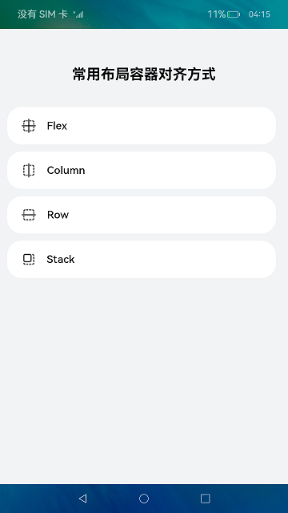
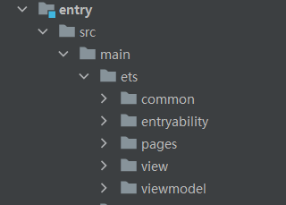
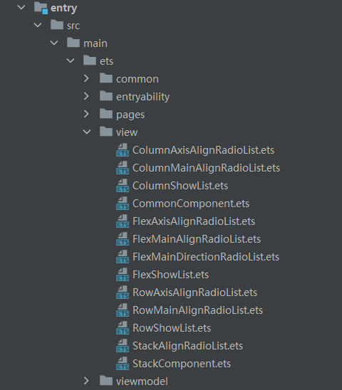
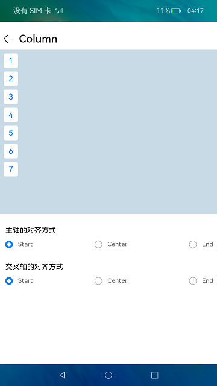
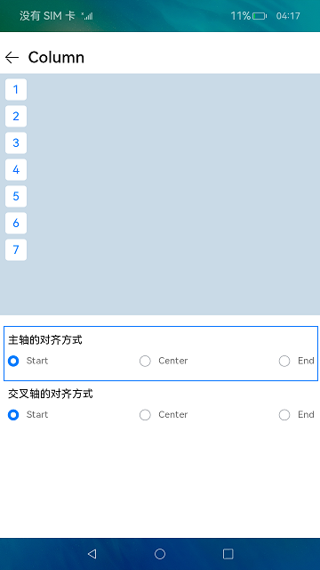
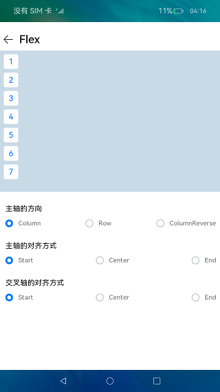
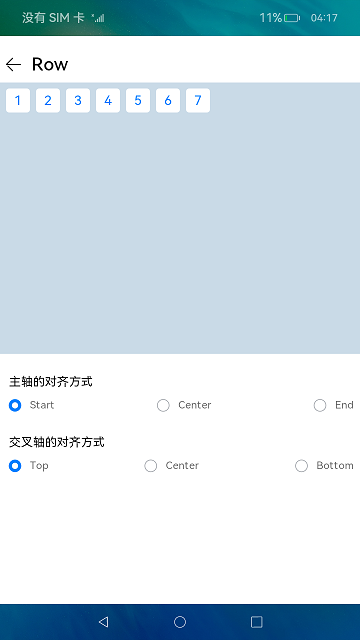
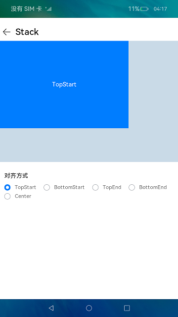

# ArkUI常用布局容器对齐方式（ArkTS）

## 介绍

基于ArkTS扩展的声明式开发范式，实现Flex、Column、Row和Stack四种常用布局容器对齐方式。

效果图如下：


### 相关概念

-   **主轴**：在布局容器中，默认存在两根轴，分别是主轴和交叉轴，不同的容器中主轴的方向不一样的。
    -   在Column容器中主轴的方向是垂直方向。
    -   在Row容器中主轴的方向是水平方向。
    -   在Flex容器中可以通过direction参数设置主轴的方向，设置为Column时，主轴的方向是垂直方向。设置为Row时，主轴的方向是水平方向
    -   在Stack容器中没有明确主轴与交叉轴，通过设置alignContent参数来改变容器内组件的对齐方式。
-   **交叉轴**：与主轴垂直相交的轴线，如果主轴是垂直方向，则交叉轴就是水平方向；如果主轴是水平方向，则交叉轴是垂直方向。

## 环境搭建

### 软件要求

-   [DevEco Studio](https://gitee.com/openharmony/docs/blob/master/zh-cn/application-dev/quick-start/start-overview.md#%E5%B7%A5%E5%85%B7%E5%87%86%E5%A4%87)版本：DevEco Studio 3.1 Beta2及以上版本。
-   OpenHarmony SDK版本：API version 9及以上版本。

### 硬件要求

-   开发板类型：[润和RK3568开发板](https://gitee.com/openharmony/docs/blob/master/zh-cn/device-dev/quick-start/quickstart-appendix-rk3568.md)。
-   OpenHarmony系统：3.2 Release及以上版本。

### 环境搭建

完成本篇Codelab我们首先要完成开发环境的搭建，本示例以**RK3568**开发板为例，参照以下步骤进行：

1. [获取OpenHarmony系统版本](https://gitee.com/openharmony/docs/blob/master/zh-cn/device-dev/get-code/sourcecode-acquire.md#%E8%8E%B7%E5%8F%96%E6%96%B9%E5%BC%8F3%E4%BB%8E%E9%95%9C%E5%83%8F%E7%AB%99%E7%82%B9%E8%8E%B7%E5%8F%96)：标准系统解决方案（二进制）。以3.2 Release版本为例：

   

2. 搭建烧录环境。

   1.  [完成DevEco Device Tool的安装](https://gitee.com/openharmony/docs/blob/master/zh-cn/device-dev/quick-start/quickstart-ide-env-win.md)
   2.  [完成RK3568开发板的烧录](https://gitee.com/openharmony/docs/blob/master/zh-cn/device-dev/quick-start/quickstart-ide-3568-burn.md)

3. 搭建开发环境。

   1.  开始前请参考[工具准备](https://gitee.com/openharmony/docs/blob/master/zh-cn/application-dev/quick-start/start-overview.md#%E5%B7%A5%E5%85%B7%E5%87%86%E5%A4%87)，完成DevEco Studio的安装和开发环境配置。
   2.  开发环境配置完成后，请参考[使用工程向导](https://gitee.com/openharmony/docs/blob/master/zh-cn/application-dev/quick-start/start-with-ets-stage.md#创建ets工程)创建工程（模板选择“Empty Ability”）。
   3.  工程创建完成后，选择使用[真机进行调测](https://gitee.com/openharmony/docs/blob/master/zh-cn/application-dev/quick-start/start-with-ets-stage.md#使用真机运行应用)。

## 代码结构解读

本篇Codelab只对核心代码进行讲解，完整代码可以直接从gitee获取。

```
├──entry/src/main/ets	                // 代码区
│  ├──common
│  │  ├──bean
│  │  │  ├──ContainerModuleItem.ets     // 属性模块对象
│  │  │  └──IndexListItem.ets           // 首页列表数据对象
│  │  └──constants
│  │     └──CommonConstants.ets	        // 样式常量类
│  ├──entryability
│  │  └──EntryAbility.ts	            // 程序入口类
│  ├──pages
│  │  ├──LayoutAlignIndex.ets           // 主界面
│  │  └──Second.ets                     // 视频播放界面		
│  ├──view
│  │  ├──ColumnAxisAlignRadioList.ets   // 自定义Column容器设置交叉轴对其方式属性
│  │  ├──ColumnMainAlignRadioList.ets   // 自定义Column容器设置主轴对其方式属性
│  │  ├──ColumnShowList.ets             // 自定义Column容器子元素列表文件
│  │  ├──CommonComponent.ets            // 自定义公共组件文件
│  │  ├──FlexAxisAlignRadioList.ets     // 自定义Flex容器设置交叉轴对其方式属性
│  │  ├──FlexMainAlignRadioList.ets     // 自定义Flex容器设置主轴对其方式属性
│  │  ├──FlexMainDirectionRadioList.ets // 自定义Flex容器设置主轴方向对其方式属性
│  │  ├──FlexShowList.ets               // 自定义Flex容器子元素列表文件
│  │  ├──RowAxisAlignRadioList.ets      // 自定义Row容器设置交叉轴对其方式属性
│  │  ├──RowMainAlignRadioList.ets      // 自定义Row容器设置主轴对其方式属性
│  │  ├──RowShowList.ets                // 自定义Row容器子元素列表文件
│  │  ├──StackAlignRadioList.ets        // 自定义Stack容器设置对其方式属性
│  │  └──StackComponent.ets             // 自定义Stack容器子元素文件
│  └──viewmodel
│     ├──AttributeModuleData.ets        // 属性模块数据
│     └──IndexData.ets                  // 首页数据
└──entry/src/main/resource              // 应用静态资源目录
```

## 构建主界面

我们将完成示例主界面的设计，主界面由标题和４个容器模块的 List 组成，效果图如下：



1.  在ets目录下，新建几个子目录，点击鼠标右键 \>New\>Directory，新建名为view的自定义子组件目录、common公共目录和viewmodel数据目录。

    

2.  在LayoutAlignIndex.ets主界面中包含显示四种容器对齐方式的入口。

    ```typescript
    @Entry
    @Component
    struct LayoutAlignIndex {
      build() {
        Column() {
          // 标题
          Text($r('app.string.index_title'))
            ...
    
          List() {
            ForEach(INDEX_LIST, (item) => {
              ListItem() {
                ListItemComp({ item: item })
                  .margin({ top: MARGIN_FONT_SIZE_SPACE.SECOND_MARGIN })
              }
            }, item => JSON.stringify(item))
          }
          .listDirection(Axis.Vertical)
          .margin({ top: MARGIN_FONT_SIZE_SPACE.EIGHTH_MARGIN })
        }
       ...
      }
    }
    
    @Component
    struct ListItemComp {
       ...
    }
    ```

## 构建不同容器对齐方式显示界面

1.  在pages目录下，点击鼠标右键 \>New\>Page，新建Second.ets页面。

    在view目录下，点击鼠标右键 \>New\>ArkTS File，新建五个ArkTS文件，分别为ColumnShowList.ets、FlexShowList.ets、RowShowList.ets、StackComponent.ets和CommonComponent.ets。

    

2. 在ColumnShowList.ets中，自定组件ColumnShowList主要效果是在Column布局容器中，设置不同的主轴与交叉轴的对齐方式属性时，显示容器内元素的对齐方式，以及主轴对其方式和交叉轴对其方式属性设置模块。

   

   具体代码如下：

   ```typescript
   @Component
   export struct ColumnShowList {
     @Consume currentColumnJustifyContent: FlexAlign;
     @Consume currentColumnAlignItems: HorizontalAlign;
   
     build() {
       Column() {
         // Column中元素对齐方式布局
         Column() {
           ForEach(LIST, (item) => {
             CommonItem({ item: item })
           }, item => JSON.stringify(item))
         }
         ...
         // 设置主轴对齐方式
         ColumnMainAlignRadioList()
           .margin({ top:MARGIN_FONT_SIZE_SPACE.EIGHTH_MARGIN })
         // 设置交叉轴对齐方式
         ColumnAxisAlignRadioList()
           .margin({ top:MARGIN_FONT_SIZE_SPACE.EIGHTH_MARGIN })
       }
       .layoutWeight(1)
       .height(ALL_PERCENT)
       .width(ALL_PERCENT)
     }
   }
   ```

   其中ColumnMainAlignRadioList子组件和ColumnAxisAlignRadioList子组件分别是设置主轴对齐方式单选框列表和设置交叉轴对齐方式单选框列表，并且在FlexShowList，RowShowList和StackComponent中都存在代码结构类似的子组件，只是设置的属性和参数单选框列表不同，后面不在重复其详细代码，这里选择其中一个单选框列表子组件来显示。

   

   具体代码如下：

   ```typescript
   @Component
   export struct ColumnMainAlignRadioList {
     ...
   
     build() {
       Column({ space: MARGIN_FONT_SIZE_SPACE.FIRST_MARGIN }) {
   　　　　// 单选框列表模块名称
         Row() {
           Text(this.moduleName)
             .fontSize(MARGIN_FONT_SIZE_SPACE.FOURTH_MARGIN)
         }
         .margin({ left: MARGIN_FONT_SIZE_SPACE.SECOND_MARGIN })
   
         Flex({
           direction: FlexDirection.Row,
           justifyContent: FlexAlign.SpaceBetween ,
           wrap:  FlexWrap.NoWrap
         }) {
           ForEach(this.radioList, (item, index) => {
             MainAlignRadioItem({ textName: item, groupName: this.groupName, 
               isChecked: index === 0 ? true : false })
               .margin({ right: MARGIN_FONT_SIZE_SPACE.COMMON_MARGIN })
           }, item => JSON.stringify(item))
         }
        ...
       }
       ...
     }
   }
   
   @Component
   struct MainAlignRadioItem {
     ...
   
     build() {
       Row() {
         Radio({ value: this.textName, group: this.groupName })
           ...
           .onClick(() => {
             switch (this.textName) {
               case ATTRIBUTE.START:
                 this.currentColumnJustifyContent = FlexAlign.Start;
                 break;
               case ATTRIBUTE.CENTER:
                 this.currentColumnJustifyContent = FlexAlign.Center;
                 break;
               default:
                 this.currentColumnJustifyContent = FlexAlign.End;
                 break;
             }
           })
         Text(this.textName)
           .fontSize(MARGIN_FONT_SIZE_SPACE.THIRD_MARGIN)
           .opacity(ATTRIBUTE_OPACITY)
       }
     }
   }
   ```

3. 在FlexShowList.ets中，自定组件FlexShowList主要效果是在Flex布局容器中，设置不同的参数时，显示容器内元素对齐方式。

   

   具体代码如下：

   ```typescript
   @Component
   export struct FlexShowList {
     @Consume list: number[];
     @Consume currentFlexDirection: FlexDirection;
     @Consume currentFlexJustifyContent: FlexAlign;
     @Consume currentFlexAlignItems: ItemAlign;
     @Consume currentFlexWrap: FlexWrap;
     @Consume currentFlexAlignContent: FlexAlign;
   
     build() {
       Column() {
         // Flex中元素对齐方式布局
         Flex({
           // 参数设置
            ...
         }) {
           ForEach(this.list, (item) => {
             CommonItem({ item: item })
           }, item => JSON.stringify(item))
         }
         ...
         // 设置主轴方向
         FlexMainDirectionRadioList().margin({ top: MARGIN_FONT_SIZE_SPACE.EIGHTH_MARGIN })
         // 设置主轴对齐方式
         FlexMainAlignRadioList().margin({ top: MARGIN_FONT_SIZE_SPACE.EIGHTH_MARGIN })
         // 设置交叉轴对齐方式
         FlexAxisAlignRadioList().margin({ top: MARGIN_FONT_SIZE_SPACE.EIGHTH_MARGIN })
       }
       .layoutWeight(1)
       .height(ALL_PERCENT)
       .width(ALL_PERCENT)
     }
   }
   ```

4. 在RowShowList.ets中，自定组件RowShowList主要效果是在Row布局容器中，当设置不同的主轴与交叉轴的对齐方式属性时，显示容器内元素的对齐方式。

   

   代码如下：

   ```typescript
   @Component
   export struct RowShowList {
     @Consume currentRowJustifyContent: FlexAlign;
     @Consume currentRowAlignItems: VerticalAlign;
   
     build() {
       Column() {
         // Row中元素对齐方式布局
         Row() {
           ForEach(LIST, (item) => {
             CommonItem({ item: item })
           }, item => JSON.stringify(item))
         }
         ...
         // 设置主轴对齐方式
         RowMainAlignRadioList()
           .margin({ top: MARGIN_FONT_SIZE_SPACE.EIGHTH_MARGIN })
         // 设置交叉轴对齐方式
         RowAxisAlignRadioList()
           .margin({ top: MARGIN_FONT_SIZE_SPACE.EIGHTH_MARGIN })
       }
       .layoutWeight(1)
       .height(ALL_PERCENT)
       .width(ALL_PERCENT)
     }
   }
   ```

5. 在StackComponent.ets中，自定组件StackComponent主要效果是在Stack布局容器中，设置不同对齐方式属性时，容器内堆叠元素的对齐方式。

   

   代码如下：

   ```typescript
   @Component
   export struct StackComponent {
     @Consume currentStackAlignContent: Alignment;
     @Consume message: string ;
     @State textAl: TextAlign = TextAlign.Center;
   
     build() {
       Column() {
         // Stack中元素对齐方式布局
         Stack({ alignContent: this.currentStackAlignContent }) {
           Text('')
             .width(ALL_PERCENT)
             .height(ALL_PERCENT)
             .fontSize(MARGIN_FONT_SIZE_SPACE.FOURTH_MARGIN)
             .backgroundColor($r('app.color.show_list_backgroundColor'))
           Text(this.message)
             ...
         }
         .margin({ top: MARGIN_FONT_SIZE_SPACE.FIRST_MARGIN })
         .width(ALL_PERCENT)
         .height(SHOW_LIST_HEIGHT_PERCENT.STACK_SHOW_LIST_HEIGHT)
         // 设置对齐方式
         StackAlignRadioList()
           .margin({ top: MARGIN_FONT_SIZE_SPACE.EIGHTH_MARGIN })
       }
       .layoutWeight(1)
       .height(ALL_PERCENT)
       .width(ALL_PERCENT)
     }
   }
   ```

6.  在CommonComponent.ets中，自定义组件CommonItem，代码如下：

    ```typescript
    @Component
    export struct CommonItem {
      private item: number;
    
      build() {
        Text(this.item.toString())
          .fontSize(MARGIN_FONT_SIZE_SPACE.FIFTH_MARGIN)
          .width(MARGIN_FONT_SIZE_SPACE.NINTH_MARGIN)
          .height(MARGIN_FONT_SIZE_SPACE.NINTH_MARGIN)
          .fontColor($r("app.color.show_list_fontColor"))
          .textAlign(TextAlign.Center)
          .align(Alignment.Center)
          .backgroundColor($r("app.color.white"))
          .borderRadius(MARGIN_FONT_SIZE_SPACE.COMMON_PADDING)
          .margin(MARGIN_FONT_SIZE_SPACE.COMMON_PADDING)
      }
    }
    ```

7.  在Second.ets页面，根据首页跳转时的参数，渲染顶部不同的容器名称和条件渲染不同的子组件。

    代码如下：

    ```typescript
    @Entry
    @Component
    struct Second {
      private moduleList: any[] = router.getParams()[MODULE_LIST];
      private componentName: string = router.getParams()[COMPONENT_NAME];
      ...
    
      build() {
        Row() {
          Column({ space: MARGIN_FONT_SIZE_SPACE.SIXTH_MARGIN }) {
            Column() {
              BackComp({ componentName: this.componentName })
              if (this.containerType === CONTAINER_TYPE.FLEX) {
                FlexShowList()
              } else if (this.containerType === CONTAINER_TYPE.COLUMN) {
                ColumnShowList()
              } else if (this.containerType === CONTAINER_TYPE.ROW) {
                RowShowList()
              } else {
                StackComponent()
              }
            }
            .width(ALL_PERCENT)
            .height(ALL_PERCENT)
          }
          .width(ALL_PERCENT)
        }
        .height(ALL_PERCENT)
      }
    }
    
    // 顶部子组件
    @Component
    struct BackComp {
       ...
    }
    ```

## 总结

目前你已经成功完成了 Codelab 并且学到了如何在四种常用的布局容器内，如何灵活的使用下列属性和参数：

1. **justifyContent**：作用在布局容器上，设置主轴的对齐方式。
2. **alignItems**：作用在布局容器上，设置交叉轴对齐方式。Flex 布局容器内子组件单行/列时生效，多行/列时不生效。
3. **alignContent**：作用在布局容器上，在 Flex 布局容器中设置交叉轴对齐方式，在 Stack 布局容器中设置容器内子组件整体的对齐方式。Flex 布局容器内子组件多行/列时生效，单行/列时不生效。
4. **alignSelf**：作用在子组件上，当想要布局容器内的某个子组件不按布局容器交叉轴方向设置的对齐方式排列时，可以用该属性覆盖 alignItems 的配置。
5. **align**：作用在子组件上，设置组件内容在组件范围内的对齐方式，只有当组件设置的 width 和 height 大小超过组件本身内容大小时生效。

   如果组件有相应的属性设置对齐方式，比如 text 组件的 textAlign 属性，可使用 align 搭配 textAlign一起使用来实现自己的UI布局。


