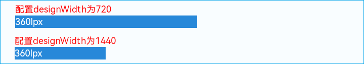
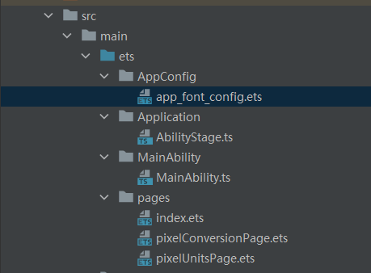
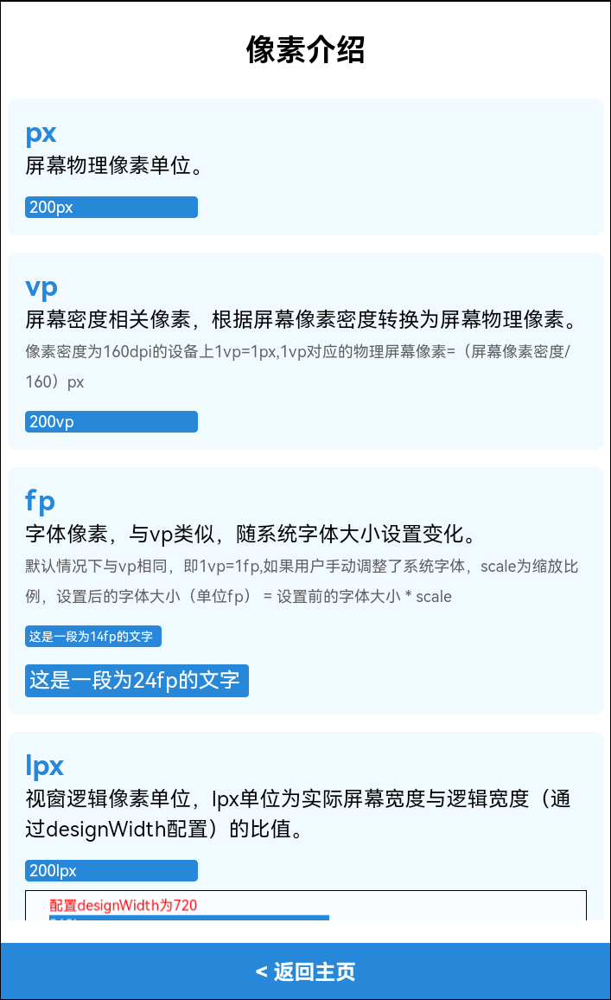
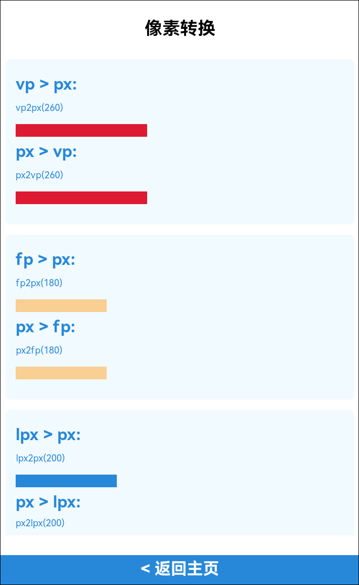

# 介绍<a name="ZH-CN_TOPIC_0000001263812402"></a>

本篇Codelab展示了像素单位与像素转换的使用方式，实现效果如下：


# 相关概念<a name="ZH-CN_TOPIC_0000001264132278"></a>

px：屏幕上真实的物理像素单位。

vp：屏幕密度相关像素，像素密度为160dpi的设备上1vp=1px。1vp对应的物理屏幕像素=（屏幕像素密度/160）px。

像素密度的计算可参考下图：


fp：字体像素，随系统字体大小变化。

lpx：视窗逻辑像素单位，lpx单位为实际屏幕宽度与逻辑宽度的比值，逻辑宽度可通过designWidth来配置。

我们为window设置不同的designWidth,可以看到在同一屏幕下展示长度是有差异的，如下图：



在了解像素的相关概念后，我们接下来开始搭建开发环境，并使用不同的像素单位来设置控件的长度、字体的大小，同时借助像素单位转换API对不同的像素单位进行转换。

# 搭建OpenHarmony环境<a name="ZH-CN_TOPIC_0000001263652526"></a>

完成本篇Codelab我们首先要完成开发环境的搭建，本示例以**RK3568**开发板为例，参照以下步骤进行：

1.  [获取OpenHarmony系统版本](https://gitee.com/openharmony/docs/blob/master/zh-cn/device-dev/get-code/sourcecode-acquire.md#%E8%8E%B7%E5%8F%96%E6%96%B9%E5%BC%8F3%E4%BB%8E%E9%95%9C%E5%83%8F%E7%AB%99%E7%82%B9%E8%8E%B7%E5%8F%96)：标准系统解决方案（二进制）。

    以3.1版本为例：

    

2.  搭建烧录环境。
    1.  [完成DevEco Device Tool的安装](https://gitee.com/openharmony/docs/blob/master/zh-cn/device-dev/quick-start/quickstart-ide-env--win.md)
    2.  [完成RK3568开发板的烧录](https://gitee.com/openharmony/docs/blob/master/zh-cn/device-dev/quick-start/quickstart-ide-3568-burn.md)

3.  搭建开发环境。
    1.  开始前请参考[工具准备](https://gitee.com/openharmony/docs/blob/master/zh-cn/application-dev/quick-start/start-overview.md#%E5%B7%A5%E5%85%B7%E5%87%86%E5%A4%87)，完成DevEco Studio的安装和开发环境配置。
    2.  开发环境配置完成后，请参考[使用工程向导](https://gitee.com/openharmony/docs/blob/master/zh-cn/application-dev/quick-start/start-with-ets-stage.md#%E5%88%9B%E5%BB%BAets%E5%B7%A5%E7%A8%8B)创建工程（模板选择“Empty Ability”），选择JS或者eTS语言开发。
    3.  工程创建完成后，选择使用[真机进行调测](https://gitee.com/openharmony/docs/blob/master/zh-cn/application-dev/quick-start/start-with-ets-stage.md#%E4%BD%BF%E7%94%A8%E7%9C%9F%E6%9C%BA%E8%BF%90%E8%A1%8C%E5%BA%94%E7%94%A8)。
# 代码结构解读<a name="ZH-CN_TOPIC_0000001311252381"></a>

本篇Codelab只对核心代码进行讲解，接下来我们来讲解整个工程的代码结构：



```
├─AppScope		        # app全局目录
│  └─resources
│      └─base
│          ├─element
│          └─media
└─entry				# entry目录
    └─src
        └─main
            ├─ets		# ets代码
            │  └─AppConfig      # 业务代码配置目录。
            │     └── app_font_config.ets #页面字体配置文件  
            │  ├─Application
            │  ├─MainAbility
            │  └─pages
            │     └── index.ets #首页  
            │     └── pixelConversionPage.ets #像素转换页面  
            │     └── pixelUnitsPage.ets #像素单位介绍页面 
            └─resources		# 资源目录
                └─base
                    ├─element
                    ├─media
                    └─profile
```
# 为控件指定不同的像素单位<a name="ZH-CN_TOPIC_0000001263812398"></a>

单位介绍页面，介绍了系统像素单位的概念，并在代码中为Text组件设置不同的像素单位：

1.设置Text组件的宽度为200px：

```
Text("200px")
  .width(200 + 'px')  
  .height(25)  
  .backgroundColor(this.blueTitleColor) 
...
```

2.设置Text组件的宽度为200vp：

```
Text("200vp")  
  .width(200 + 'vp')  
  .height(25)  
  .backgroundColor(this.blueTitleColor)
...
```

如果使用vp作为像素单位，在为组件设置具体的宽度或高度时，可以不加vp（系统默认单位为vp）。

```
Text("200vp") 
  .width(200)  
  .height(25) 
  .backgroundColor(this.blueTitleColor)  
...
```

3.设置Text组件的宽度为24fp：

```
Text("这是一段为24fp的文字")  
  .fontSize(24 + 'fp')  
  .backgroundColor(this.blueTitleColor)  
...
```

4.使用lpx像素单位：

```
Text("200lpx")  
  .width(200 + 'lpx')  
  .height(25)  
...
```



# 使用像素转换<a name="ZH-CN_TOPIC_0000001311132469"></a>

在像素转换页面，通过使用像素转换API，实现不同像素单位之间的转换：

1.vp与px之间的转换

vp转换为px：

```
...
private vp_px_width: number= 260
...
Text()  
  .width(vp2px(this.vp_px_width))    
  .height(25)  
  .backgroundColor(this.redColor)
...
```

px转换为vp：

```
Text() 
  .width(px2vp(this.vp_px_width) + 'vp')  
  .height(25)  
...
```

2.fp与px之间的转换

fp转换为px：

```
...
private fp_px_width: number= 180
...
Text()  
  .width(fp2px(this.fp_px_width))  
  .height(25)  
...
```

px转换为fp：

```
Text()  
  .width(px2fp(this.fp_px_width))  
  .height(25)  
...
```

3.lpx与px之间的转换

lpx转换为px:

```
...
private lpx_px_width: number= 200
...
Text()  
  .width(lpx2px(this.lpx_px_width))  
  .height(25)  
...
```

px转换为lpx:

```
Text()  
  .width(px2lpx(this.lpx_px_width))  
  .height(25)  
  .backgroundColor(this.blueColor)  
...
```



# 恭喜您<a name="ZH-CN_TOPIC_0000001264334146"></a>

本篇Codelab介绍像素单位的基本知识与像素单位转换API的使用，通过像素转换案例，向开发者讲解了如何使用像素单位设置组件的大小、字体像素fp的使用以及不同像素单位之间的转换。

通过本Codelab的学习，您已经学会了：

-   不同像素单位的使用
-   像素单位转换相关API的使用


