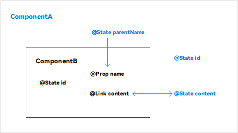
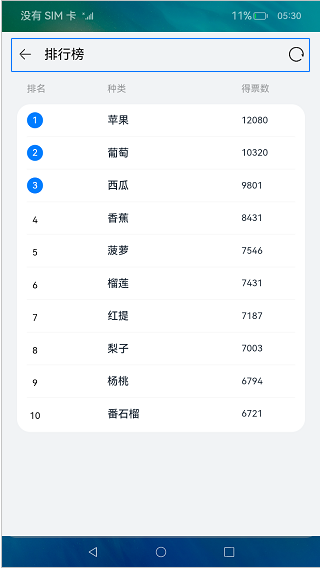
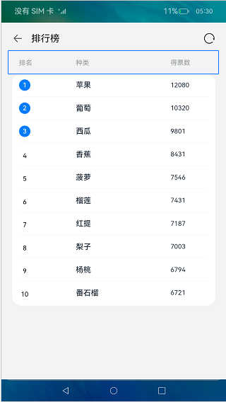
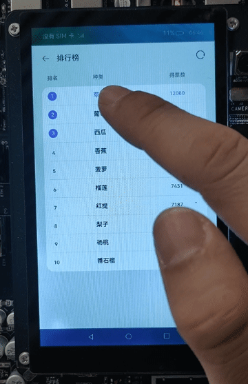
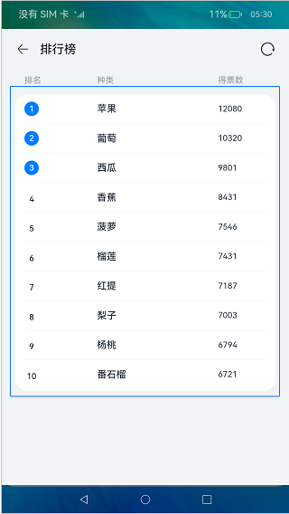

# ArkTS基础知识（ArkTS）
## 介绍
本课程使用声明式语法和组件化基础知识，搭建一个可刷新的排行榜页面。在排行榜页面中，使用循环渲染控制语法来实现列表数据渲染，使用@Builder创建排行列表布局内容，使用装饰器@State、@Prop、@Link来管理组件状态。最后我们点击系统返回按键，来学习自定义组件生命周期函数。完成效果如下图所示：


### 相关概念

1.渲染控制语法：

-   [条件渲染](https://gitee.com/openharmony/docs/blob/master/zh-cn/application-dev/quick-start/arkts-rendering-control.md#条件渲染)：使用if/else进行条件渲染。语法如下：

```typescript
Column() {
   if (this.count > 0) {
       Text('count is positive')
   }
}
```

-   [循环渲染](https://gitee.com/openharmony/docs/blob/master/zh-cn/application-dev/quick-start/arkts-rendering-control.md#循环渲染)：开发框架提供循环渲染（ForEach组件）来迭代数组，并为每个数组项创建相应的组件。ForEach定义如下：

```typescript
ForEach(
  arr: any[], // 用于迭代的数组
  itemGenerator: (item: any, index?: number) => void, // 生成子组件的lambda函数
  keyGenerator?: (item: any, index?: number) => string // 用于给定数组项生成唯一且稳定的键值
)
```

2.组件状态管理装饰器和@Builder装饰器：

组件状态管理装饰器用来管理组件中的状态，它们分别是：@State、@Prop、@Link。

-   [@State](https://gitee.com/openharmony/docs/blob/master/zh-cn/application-dev/quick-start/arkts-state-mgmt-page-level.md#state)装饰的变量是组件内部的状态数据，当这些状态数据被修改时，将会调用所在组件的build方法进行UI刷新。
-   [@Prop](https://gitee.com/openharmony/docs/blob/master/zh-cn/application-dev/quick-start/arkts-state-mgmt-page-level.md#prop)与@State有相同的语义，但初始化方式不同。@Prop装饰的变量必须使用其父组件提供的@State变量进行初始化，允许组件内部修改@Prop变量，但更改不会通知给父组件，即@Prop属于单向数据绑定。
-   [@Link](https://gitee.com/openharmony/docs/blob/master/zh-cn/application-dev/quick-start/arkts-state-mgmt-page-level.md#link)装饰的变量可以和父组件的@State变量建立双向数据绑定，需要注意的是：@Link变量不能在组件内部进行初始化。
-   [@Builder](https://gitee.com/openharmony/docs/blob/master/zh-cn/application-dev/quick-start/arkts-dynamic-ui-elememt-building.md)装饰的方法用于定义组件的声明式UI描述，在一个自定义组件内快速生成多个布局内容。

@State、@Prop、@Link三者关系如下图所示：



3.组件生命周期函数：

[自定义组件的生命周期函数](https://gitee.com/openharmony/docs/blob/master/zh-cn/application-dev/ui/ui-ts-custom-component-lifecycle-callbacks.md)用于通知用户该自定义组件的生命周期，这些回调函数是私有的，在运行时由开发框架在特定的时间进行调用，不能从应用程序中手动调用这些回调函数。 右图是自定义组件生命周期的简化图示：


> **说明：** 
>需要注意的是，部分生命周期回调函数仅对**@Entry**修饰的自定义组件生效，它们分别是：onPageShow、onPageHide、onBackPress。

## 环境搭建

### 软件要求

-   [DevEco Studio](https://gitee.com/openharmony/docs/blob/master/zh-cn/application-dev/quick-start/start-overview.md#%E5%B7%A5%E5%85%B7%E5%87%86%E5%A4%87)版本：DevEco Studio 3.1 Beta2及以上版本。
-   OpenHarmony SDK版本：API version 9及以上版本。

### 硬件要求

-   开发板类型：[润和RK3568开发板](https://gitee.com/openharmony/docs/blob/master/zh-cn/device-dev/quick-start/quickstart-appendix-rk3568.md)。
-   OpenHarmony系统：3.2 Release及以上版本。

### 环境搭建

完成本篇Codelab我们首先要完成开发环境的搭建，本示例以**RK3568**开发板为例，参照以下步骤进行：

1.  [获取OpenHarmony系统版本](https://gitee.com/openharmony/docs/blob/master/zh-cn/device-dev/get-code/sourcecode-acquire.md#%E8%8E%B7%E5%8F%96%E6%96%B9%E5%BC%8F3%E4%BB%8E%E9%95%9C%E5%83%8F%E7%AB%99%E7%82%B9%E8%8E%B7%E5%8F%96)：标准系统解决方案（二进制）。以3.2 Release版本为例：

    

2.  搭建烧录环境。
    1.  [完成DevEco Device Tool的安装](https://gitee.com/openharmony/docs/blob/master/zh-cn/device-dev/quick-start/quickstart-ide-env-win.md)
    2.  [完成RK3568开发板的烧录](https://gitee.com/openharmony/docs/blob/master/zh-cn/device-dev/quick-start/quickstart-ide-3568-burn.md)

3.  搭建开发环境。
    1.  开始前请参考[工具准备](https://gitee.com/openharmony/docs/blob/master/zh-cn/application-dev/quick-start/start-overview.md#%E5%B7%A5%E5%85%B7%E5%87%86%E5%A4%87)，完成DevEco Studio的安装和开发环境配置。
    2.  开发环境配置完成后，请参考[使用工程向导](https://gitee.com/openharmony/docs/blob/master/zh-cn/application-dev/quick-start/start-with-ets-stage.md#创建ets工程)创建工程（模板选择“Empty Ability”）。
    3.  工程创建完成后，选择使用[真机进行调测](https://gitee.com/openharmony/docs/blob/master/zh-cn/application-dev/quick-start/start-with-ets-stage.md#使用真机运行应用)。
## 代码结构解读
本篇Codelab只对核心代码进行讲解，完整代码可以直接从gitee获取。
```
├──entry/src/main/ets               // 代码区    
│  ├──common                        // 公共文件目录
│  │  ├──bean                       
│  │  │  └──RankData.ets            // 实体类
│  │  └──constants                  
│  │     └──Constants.ets           // 常量
│  ├──entryability
│  │  └──EntryAbility.ts            // 应用的入口
│  ├──model                         
│  │  └──DataModel.ets              // 模拟数据
│  ├──pages
│  │  └──RankPage.ets               // 入口页面
│  ├──view                          // 自定义组件目录
│  │  ├──ListHeaderComponent.ets
│  │  ├──ListItemComponent.ets
│  │  └──TitleComponent.ets
│  └──viewmodel                     
│     └──RankViewModel.ets         // 视图业务逻辑类
└──entry/src/main/resources	       // 资源文件目录
```
## 使用@Link封装标题组件

在TitleComponent文件中，首先使用struct对象创建自定义组件，然后使用@Link修饰器管理TitleComponent组件内的状态变量isRefreshData，状态变量isRefreshData值发生改变后，通过@Link装饰器通知页面刷新List中的数据。代码如下：

```typescript
...
@Component
export struct TitleComponent {
  @Link isRefreshData: boolean; // 判断是否刷新数据
  @State title: Resource = $r('app.string.title_default');

  build() {
    Row() {
      ...
      Row() {
        Image($r('app.media.loading'))
          .height(TitleBarStyle.IMAGE_LOADING_SIZE)
          .width(TitleBarStyle.IMAGE_LOADING_SIZE)
          .onClick(() => {
            this.isRefreshData = !this.isRefreshData;
          })
      }
      .width(TitleBarStyle.WEIGHT)
      .height(WEIGHT)
      .justifyContent(FlexAlign.End)
    }
   ...
  }
}
```

实现效果如下：



## 封装列表头部样式组件

在ListHeaderComponent文件中，我们使用常规成员变量来设置自定义组件ListHeaderComponent的widthValue和paddingValue，代码如下：

```typescript
...
@Component
export struct ListHeaderComponent {
  paddingValue: Padding | Length;
  widthValue: Length;

  build() {
    Row() {
      Text($r('app.string.page_number'))
        .fontSize(FontSize.SMALL)
        .width(ListHeaderStyle.LAYOUT_WEIGHT_LEFT)
        .fontWeight(ListHeaderStyle.FONT_WEIGHT)
        .fontColor($r('app.color.font_description'))
      Text($r('app.string.page_type'))
        .fontSize(FontSize.SMALL)
        .width(ListHeaderStyle.LAYOUT_WEIGHT_CENTER)
        .fontWeight(ListHeaderStyle.FONT_WEIGHT)
        .fontColor($r('app.color.font_description'))
      Text($r('app.string.page_vote'))
        .fontSize(FontSize.SMALL)
        .width(ListHeaderStyle.LAYOUT_WEIGHT_RIGHT)
        .fontWeight(ListHeaderStyle.FONT_WEIGHT)
        .fontColor($r('app.color.font_description'))
    }
    .width(this.widthValue)
    .padding(this.paddingValue)
  }
}
```

实现效果如下：



## 创建ListItemComponent

为了体现@Prop单向绑定功能，我们在ListItemComponent组件中添加了一个@Prop修饰的字段isSwitchDataSource，当通过点击改变ListItemComponent组件中isSwitchDataSource状态时，ListItemComponent作为List的子组件，并不会通知其父组件List刷新状态。

在代码中，我们使用@State管理ListItemComponent中的 isChange 状态，当用户点击ListItemComponent时，ListItemComponent组件中的文本颜色发生变化。我们使用条件渲染控制语句，创建的圆型文本组件。

```typescript
...
@Component
export struct ListItemComponent {
  index: number;
  private name: Resource;
  @Prop vote: string;
  @Prop isSwitchDataSource: boolean;
  // 判断是否改变ListItemComponent字体颜色
  @State isChange: boolean = false;

  build() {
    Row() {
      Column() {
        if (this.isRenderCircleText()) {
          this.CircleText(this.index);
        } else {
          Text(this.index.toString())
            .lineHeight(ItemStyle.TEXT_LAYOUT_SIZE)
            .textAlign(TextAlign.Center)
            .width(ItemStyle.TEXT_LAYOUT_SIZE)
            .fontWeight(FontWeight.BOLD)
            .fontSize(FontSize.SMALL)
        }
      }
      .width(ItemStyle.LAYOUT_WEIGHT_LEFT)
      .alignItems(HorizontalAlign.Start)

      Text(this.name)
        .width(ItemStyle.LAYOUT_WEIGHT_CENTER)
        .fontWeight(FontWeight.BOLDER)
        .fontSize(FontSize.MIDDLE)
        .fontColor(this.isChange ? ItemStyle.COLOR_BLUE : ItemStyle.COLOR_BLACK)
      Text(this.vote)
        .width(ItemStyle.LAYOUT_WEIGHT_RIGHT)
        .fontWeight(FontWeight.BOLD)
        .fontSize(FontSize.SMALL)
        .fontColor(this.isChange ? ItemStyle.COLOR_BLUE : ItemStyle.COLOR_BLACK)
    }
    .height(ItemStyle.BAR_HEIGHT)
    .width(WEIGHT)
    .onClick(() => {
      this.isSwitchDataSource = !this.isSwitchDataSource;
      this.isChange = !this.isChange;
    })
  }
  ...
}
```

效果如图所示：



## 创建RankList

为了简化代码，提高代码的可读性，我们使用@Builder描述排行列表布局内容，使用循环渲染组件ForEach创建ListItem。代码如下：

```typescript
...
  build() {
    Column() {
      // 顶部标题组件
      TitleComponent({ isRefreshData: $isSwitchDataSource, title: TITLE })
      // 列表头部样式
      ListHeaderComponent({
        paddingValue: { left: Style.RANK_PADDING,
          right: Style.RANK_PADDING },
        widthValue: Style.CONTENT_WIDTH
      }).margin({ top: Style.HEADER_MARGIN_TOP,
        bottom: Style.HEADER_MARGIN_BOTTOM })
      // 列表区域
      this.RankList(Style.CONTENT_WIDTH)
    }
    .backgroundColor($r('app.color.background'))
    .height(WEIGHT)
    .width(WEIGHT)
  }

  @Builder RankList(widthValue: Length) {
    Column() {
      List() {
        ForEach(this.isSwitchDataSource ? this.dataSource1 : this.dataSource2,
          (item, index) => {
            ListItem() {
              ListItemComponent({ index: index + 1, name: item.name, vote: item.vote,
                isSwitchDataSource: this.isSwitchDataSource
              })
            }
          }, (item, index) => item.id)
      }
      .width(WEIGHT)
      .height(Style.LIST_HEIGHT)
      .divider({ strokeWidth: Style.STROKE_WIDTH })
    }
    .padding({ left: Style.RANK_PADDING,
      right: Style.RANK_PADDING })
    .borderRadius(Style.BORDER_RADIUS)
    .width(widthValue)
    .alignItems(HorizontalAlign.Center)
    .backgroundColor(Color.White)
  }
...
```

布局效果如下：



## 使用自定义组件生命周期函数

我们通过点击系统导航返回按钮来演示onBackPress回调方法的使用，在指定的时间段内，如果满足退出条件，onBackPress将返回false，系统默认关闭当前页面。否则，提示用户需要再点击一次才能退出，同时onBackPress返回true，表示用户自己处理导航返回事件。代码如下：

```typescript
... 
@Entry
@Component
struct RankPage {
  ...
  onBackPress() {
    if (this.isShowToast()) {
      prompt.showToast({ message: $r('app.string.prompt_text'), duration: TIME });
      this.clickBackTimeRecord = new Date().getTime();
      return true;
    }
    return false;
  }
  ...
}
```
## 总结

您已经完成了本次Codelab的学习，并了解到以下知识点：

1.  条件渲染、循环渲染语法的使用。
2. @State、@Prop、@Link修饰器的使用。
3. @Builder修饰器的使用。
4. 自定义组件生命周期函数onBackPress的调用。


