# 概述

OpenHarmony  ArkUI框架提供了丰富的动画组件和接口，开发者可以根据实际场景和开发需求，选用丰富的动画组件和接口来实现不同的动画效果。

本Codelab中，我们会构建一个简易的购物应用。应用包含两级页面，分别是主页（“商品浏览”页签、“购物车”页签、“我的”页签）和商品详情页面。效果如下图所示：


# 代码结构解读

本篇Codelab只对核心代码进行讲解，首先来介绍下整个工程的代码结构：

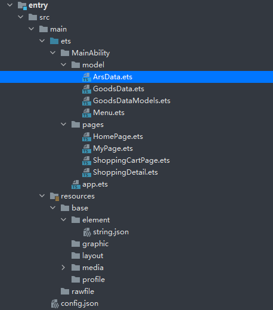

-   model：存放封装好的数据实体。
    -   ArsData：我的页签相关参数实体。
    -   GoodsData：商品列表页商品实体。
    -   GoodsDataModels：各种实体的具体数据以及获取数据的方法。
    -   Menu：我的页签菜单实体。

-   pages：存放页面。
    -   HomePage：应用主页面，包含商品列表页签。
    -   MyPage：我的页签。
    -   ShoppingCartPage：购物车页签。
    -   ShoppingDetail：商品详情页。

-   resources ：存放工程使用到的资源文件。
    -   resources/base/media：存放工程中使用的图片资源。

-   config.json：配置文件。
# 搭建OpenHarmony环境

完成本篇Codelab我们首先要完成开发环境的搭建，本示例以**Hi3516DV300**开发板为例，参照以下步骤进行：

1.  [获取OpenHarmony系统版本](https://gitee.com/openharmony/docs/blob/master/zh-cn/device-dev/get-code/sourcecode-acquire.md#%E8%8E%B7%E5%8F%96%E6%96%B9%E5%BC%8F3%E4%BB%8E%E9%95%9C%E5%83%8F%E7%AB%99%E7%82%B9%E8%8E%B7%E5%8F%96)：标准系统解决方案（二进制）

    以3.0版本为例：

    

2.  搭建烧录环境

    1.  [完成DevEco Device Tool的安装](https://gitee.com/openharmony/docs/blob/master/zh-cn/device-dev/quick-start/quickstart-standard-env-setup.md)

    2.  [完成Hi3516开发板的烧录](https://gitee.com/openharmony/docs/blob/master/zh-cn/device-dev/quick-start/quickstart-lite-steps-hi3516-burn.md)

3.  搭建开发环境

    1.  开始前请参考[下载与安装软件](https://developer.harmonyos.com/cn/docs/documentation/doc-guides/software_install-0000001053582415)、[配置开发环境](https://gitee.com/openharmony/docs/blob/master/zh-cn/application-dev/quick-start/configuring-openharmony-sdk.md)，完成DevEco Studio的安装和开发环境配置。
    2.  开发环境配置完成后，请参考[使用工程向导](https://gitee.com/openharmony/docs/blob/master/zh-cn/application-dev/quick-start/use-wizard-to-create-project.md)创建工程，使用JS或者eTS语言开发、“Application”为例，模板选择“\[Standard\]Empty Ability”。
    3.  工程创建完成后，可参考下面章节进行代码编写，使用真机进行调测：

    -   [配置OpenHarmony应用签名信息](https://gitee.com/openharmony/docs/blob/master/zh-cn/application-dev/quick-start/configuring-openharmony-app-signature.md)
    -   [hap包安装指导](https://gitee.com/openharmony/docs/blob/master/zh-cn/application-dev/quick-start/installing-openharmony-app.md)
    -   工程示例：

    
# 构建商品列表页签

在本节中，我们将完成商品列表页签的设计，效果图如下：

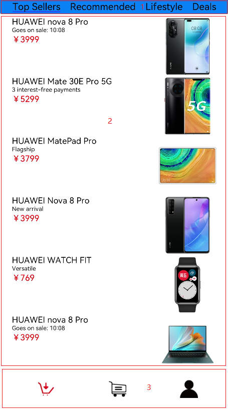

从效果图可以看出，商品列表页签主要由三个部分组成：

1.  顶部的Tabs组件。
2.  中间TabContent组件内包含List组件。其中List组件的item是一个水平布局，由一个垂直布局和一个Image组件组成；item中的垂直布局由3个Text组件组成。
3.  底部的导航页签。

实现步骤如下：

1.  在pages目录下面新建一个ETS Page，命名为HomePage.ets，在config.json文件的pages属性中会自动添加“pages/HomePage”页面路由。

    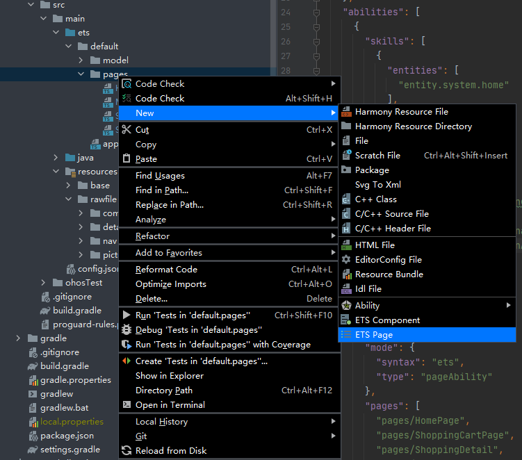

    > **说明：** 
    >-   页面文件名不能使用组件名称，比如：Text.ets、Button.ets等。
    >-   每个页面文件中必须包含入口组件。

2.  新建与pages文件夹同级的model文件夹，并在model目录下新建ArsData.ets、GoodsData.ets、Menu.ets和GoodsDataModels.ets文件，其中ArsData.ets、GoodsData.ets、Menu.ets是数据实体类，GoodsDataModels.ets是存放这三种实体数据集合，并定义了获取各种数据集合的方法。数据实体包含实体的属性和构造方法，可通过new ArsData\(string,string\) 来获取ArsData对象，ArsData.ets内容如下：

    ```
    let NextId = 0;
    export class ArsData {
      id: string;
      title: string;
      content: string;
    
      constructor(title: string, content: string) {
        this.id = `${NextId++}`;
        this.title = title;
        this.content = content;
      }
    }
    ```

    GoodsData.ets代码如下：

    ```
    let NextId = 0;
    export class GoodsData {
      id: string;
      title: string;
      content: string;
      price: number;
      imgSrc: Resource;
    
      constructor(title: string, content: string, price: number, imgSrc: Resource) {
        this.id = `${NextId++}`;
        this.title = title;
        this.content = content;
        this.price = price;
        this.imgSrc = imgSrc;
      }
    }
    ```

    一个文件中可以包含多个class ，Menu.ets中就包含了Menu类和ImageItem类，Menu.ets代码如下

    ```
    let NextId = 0;
    export class Menu {
      id: string;
      title: string;
      num: number;
    
      constructor(title: string, num: number) {
        this.id = `${NextId++}`;
        this.title = title;
        this.num = num;
      }
    }
    
    export class ImageItem {
      id: string;
      title: string;
      imageSrc: Resource;
    
      constructor(title: string, imageSrc: Resource) {
        this.id = `${NextId++}`;
        this.title = title;
        this.imageSrc = imageSrc;
      }
    }
    
    ```

    GoodsDataModels.ets代码如下：

    ```
    import {GoodsData} from './GoodsData'
    
    import {Menu, ImageItem} from './Menu'
    import {ArsData} from './ArsData'
    //获取商品列表数据
    export function initializeOnStartup(): Array<GoodsData> {
      let GoodsDataArray: Array<GoodsData> = []
      GoodsComposition.forEach(item => {
        console.log(item.title);
        GoodsDataArray.push(new GoodsData(item.title, item.content, item.price, item.imgSrc));
      })
      return GoodsDataArray;
    }
    //获取底部默认图片列表数据
    export function getIconPath(): Array<string> {
      let IconPath: Array<string> = ['nav/icon-buy.png','nav/icon-shopping-cart.png','nav/icon-my.png']
    
      return IconPath;
    }
    //获取选中后图片列表数据
    export function getIconPathSelect(): Array<string> {
      let IconPathSelect: Array<string> = ['nav/icon-home.png','nav/icon-shopping-cart-select.png','nav/icon-my-select.png']
    
      return IconPathSelect;
    }
    //获取商品详情页图片详情列表
    export function getDetailImages(): Array<string> {
      let detailImages: Array<string> = ['computer/computer1.png','computer/computer2.png','computer/computer3.png','computer/computer4.png','computer/computer5.png','computer/computer6.png']
    
      return detailImages;
    }
    
    //获取菜单数据列表
    export function getMenu(): Array<Menu> {
      let MenuArray: Array<Menu> = []
      MyMenu.forEach(item => {
        MenuArray.push(new Menu(item.title,item.num));
      })
      return MenuArray;
    }
    //获取MyTrans数据列表
    export function getTrans(): Array<ImageItem> {
      let ImageItemArray: Array<ImageItem> = []
      MyTrans.forEach(item => {
        ImageItemArray.push(new ImageItem(item.title,item.imageSrc));
      })
      return ImageItemArray;
    }
    //获取More数据列表
    export function getMore(): Array<ImageItem> {
      let ImageItemArray: Array<ImageItem> = []
      MyMore.forEach(item => {
        ImageItemArray.push(new ImageItem(item.title,item.imageSrc));
      })
      return ImageItemArray;
    }
    //获取参数列表
    export function getArs(): Array<ArsData> {
      let ArsItemArray: Array<ArsData> = []
      ArsList.forEach(item => {
        ArsItemArray.push(new ArsData(item.title,item.content));
      })
      return ArsItemArray;
    }
    //数据集合部分
    ...
    ```

3.  在HomePage.ets文件中创建商品列表页签相关的组件，其中GoodsHome效果图如下:

    

    代码如下：

    ```
    @Component
    @Component
    struct GoodsHome {
      private goodsItems: GoodsData[]
    
      build() {
        Column() {
          Tabs() {
            TabContent() {
              GoodsList({ goodsItems: this.goodsItems });
            }
            .tabBar("Top Sellers")
            .backgroundColor(Color.White)
    
            TabContent() {
              GoodsList({ goodsItems: this.goodsItems });
            }
            .tabBar("Recommended")
            .backgroundColor(Color.White)
    
            TabContent() {
              GoodsList({ goodsItems: this.goodsItems });
            }
            .tabBar("Lifestyle")
            .backgroundColor(Color.White)
    
            TabContent() {
              GoodsList({ goodsItems: this.goodsItems });
            }
            .tabBar("Deals")
            .backgroundColor(Color.White)
          }
          .barWidth(540)
          .barHeight(50)
          .scrollable(true)
          .barMode(BarMode.Scrollable)
          .backgroundColor('#007DFF')
          .height('100%')
        }
        .alignItems(HorizontalAlign.Start)
      }
    }
    ```

    在GoodsHome中使用Tabs组件，在Tabs组件中设置4个TabContent，给每个TabContent设置tabBar属性，并设置TabContent容器中的内容GoodsList组件，GoodsList组件效果图如下：

    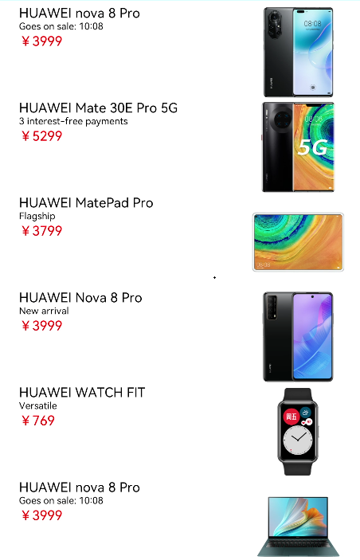

    代码如下：

    ```
    @Component
    struct GoodsList {
      private goodsItems: GoodsData[]
    
      build() {
        Column() {
          List() {
            ForEach(this.goodsItems, item => {
              ListItem() {
                GoodsListItem({ goodsItem: item })
              }
            }, item => item.id.toString())
          }
          .height('100%')
          .width('100%')
          .align(Alignment.Top)
          .margin({top: 5})
        }
      }
    }
    ```

    在GoodsList组件中遍历商品数据集合，ListItem组件中设置组件内容，并使用Navigator组件给每个Item设置顶级跳转路由，GoodsListItem组件效果图如下：

    

    代码如下：

    ```
    @Component
    struct GoodsListItem {
      private goodsItem: GoodsData
    
      build() {
        Navigator({ target: 'pages/ShoppingDetail' }) {
          Row() {
            Column() {
              Text(this.goodsItem.title)
                .fontSize(18)
              Text(this.goodsItem.content)
                .fontSize(14)
              Text('￥' + this.goodsItem.price)
                .fontSize(18)
                .fontColor(Color.Red)
            }
            .height(130)
            .width('60%')
            .margin({ left: 20 })
            .alignItems(HorizontalAlign.Start)
    
            Image(this.goodsItem.imgSrc)
              .objectFit(ImageFit.ScaleDown)
              .height(130)
              .width('30%')
              .renderMode(ImageRenderMode.Original)
              .margin({ right: 10, left: 10 })
    
          }
          .backgroundColor(Color.White)
    
        }
        .params({ goodsData: this.goodsItem })
        .margin({ right: 5 })
      }
    }
    ```

4.  在HomePage.ets中创建文件入口组件（Index）以及底部页签导航组件（HomeBottom），导入需要使用到的数据实体类以及需要使用的方法和组件，每个page文件都必须包含一个入口组件，使用@Entry修饰，HomePage文件中的入口组件（Index）代码如下：

    ```
    import {GoodsData} from '../model/GoodsData'
    import {initializeOnStartup,getIconPath,getIconPathSelect} from '../model/GoodsDataModels'
    import {ShoppingCart} from './ShoppingCartPage.ets'
    import {MyInfo} from './MyPage.ets'
    import router from '@system.router'
    @Entry
    @Component
    struct Index {
      @Provide currentPage: number = 1
      private goodsItems: GoodsData[] = initializeOnStartup()
      build() {
        Column() {
          Scroll(){
            Column() {
              if (this.currentPage == 1) {
                GoodsHome({ goodsItems: this.goodsItems })
              } else if (this.currentPage == 2) {
                //购物车列表
                ShoppingCart()
              } else {
                //我的
                MyInfo()
              }
            }
            .width('100%')
            .flexGrow(1)
            }
          .scrollable(ScrollDirection.Vertical)
          HomeBottom()
        }
        .height('93%')
        .width('100%')
        .backgroundColor("white")
    
      }
    }
    ```

    从入口组件的代码中可以看出，我们定义了一个全局变量currentPage ，并且使用@provide修饰，在其子组件\(HomeBottom\)中使用@Consume修饰。当子组件currentPage发生变化的时候，父组件currentPage也会发生变化，会重新加载页面，显示不同的页签。在入口组件中，通initializeOnStartup获取商品列表数据（goodsItems）并传入GoodsHome组件中。底部组件是由一个横向的图片列表组成，iconPath是底部初始状态下的3张图片路径数组。遍历iconPath数组，使用Image组件设置图片路径并添加到List中，给每个Image组件设置点击事件，点击更换底部3张图片。在HomeBottom中，iconPath使用的是@State修饰，当iconPath数组内容变化时，页面组件有使用到的地方都会随之发生变化。HomeBottom组件效果图如下：

    

    代码如下：

    ```
    @Component
    struct HomeBottom {
      @Consume currentPage: number
      private iconPathTmp: IconImage[] = getIconPath()
      private iconPathSelectsTmp: IconImage[] = getIconPathSelect()
      @State iconPath: IconImage[] = getIconPath()
    
      build() {
        Row() {
          Image(this.iconPath[0].imgSrc)
            .objectFit(ImageFit.Contain)
            .height(120)
            .width(120)
            .margin({left:80,top: 20})
            .renderMode(ImageRenderMode.Original)
            .onClick(()=>{
              this.iconPath[0] = this.iconPathTmp[0]
              this.iconPath[1] = this.iconPathTmp[1]
              this.iconPath[2] = this.iconPathTmp[2]
              this.currentPage = 1
            })
          Image(this.iconPath[1].imgSrc)
            .objectFit(ImageFit.Contain)
            .height(120)
            .width(120)
            .margin({left:80,top: 20})
            .renderMode(ImageRenderMode.Original)
            .onClick(()=>{
              this.iconPath[0] = this.iconPathSelectsTmp[0]
              this.iconPath[1] = this.iconPathSelectsTmp[1]
              this.iconPath[2] = this.iconPathTmp[2]
              this.currentPage = 2
            })
          Image(this.iconPath[2].imgSrc)
            .objectFit(ImageFit.Contain)
            .height(120)
            .width(120)
            .margin({left:80,top: 20})
            .renderMode(ImageRenderMode.Original)
            .onClick(()=>{
              this.iconPath[0] = this.iconPathSelectsTmp[0]
              this.iconPath[1] = this.iconPathTmp[1]
              this.iconPath[2] = this.iconPathSelectsTmp[2]
              this.currentPage = 3
            })
    
        }
        .backgroundColor(Color.White)
        .alignItems(VerticalAlign.Bottom)
        .width('100%')
        .height('10%')
      }
    }
    ```


# 构建购物车页签

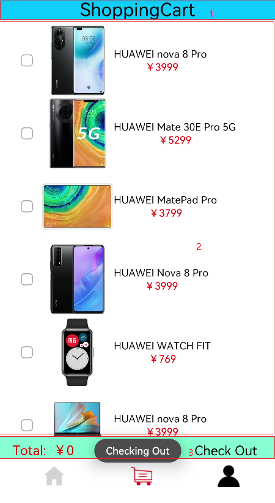

从上面效果图可以看出，主界面购物车页签主要由下面三部分组成：

1.  顶部的Text组件。
2.  中间的List组件，其中List组件的item是一个水平的布局内包含一个toggle组件，一个Image组件和一个垂直布局，其item中的垂直布局是由2个Text组件组成。
3.  底部一个水平布局包含两个Text组件。

在本任务中我们主要是构建一个购物车页签，给商品列表的每个商品设置一个单选框，可以选中与取消选中，底部Total值也会随之增加或减少，点击Check Out时会触发弹窗。下面我们来完成ShoppingCart页签。

1.  在pages目录下面新建一个ETS Page ，命名为ShoppingCart.ets，config.json文件pages属性中也会自动添加“pages/ShoppingCart”页面路由。
2.  在ShoppingCartPage.ets文件中添加入口组件\(ShoppingCart\)，并导入需要使用到的数据实体类、方法和组件。ShoppingCart组件代码如下：

    ```
    import {GoodsData} from '../model/GoodsData'
    import {initializeOnStartup} from '../model/GoodsDataModels'
    import prompt from '@system.prompt';
    
    @Entry
    @Component
     export struct ShoppingCart {
      @Provide totalPrice: number = 0
      private goodsItems: GoodsData[] = initializeOnStartup()
    
      build() {
        Column() {
          Column() {
            Text('ShoppingCart')
              .fontColor(Color.Black)
              .fontSize(25)
              .margin({ left: 60, right: 60 })
              .align(Alignment.Center)
          }
          .backgroundColor('#FF00BFFF')
          .width('100%')
          .height(30)
    
          ShopCartList({ goodsItems: this.goodsItems });
          ShopCartBottom()
        }
        .height('100%')
        .width('100%')
        .alignItems(HorizontalAlign.Start)
      }
    }
    ```

3.  新建ShopCartList组件用于存放购物车商品列表，ShopCartList组件效果图如下：

    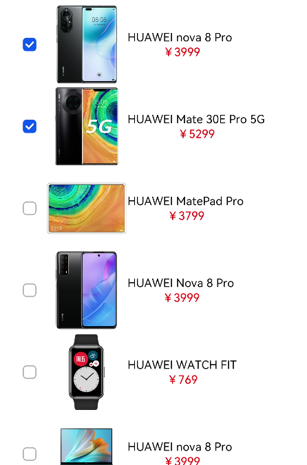

    代码如下：

    ```
    @Component
    struct ShopCartList {
      private goodsItems: GoodsData[]
    
      build() {
        Column() {
          List() {
            ForEach(this.goodsItems, item => {
              ListItem() {
                ShopCartListItem({ goodsItem: item })
              }
            }, item => item.id.toString())
          }
          .height('100%')
          .width('100%')
          .align(Alignment.Top)
          .margin({ top: 5 })
        }
        .height('90%')
      }
    }
    ```

    在ShopCartListItem中使用Toggle的单选框类型来实现每个item的选择和取消选择，在Toggle的onChage事件中来改变totalPrice的数值。ShopCartListItem组件效果图如下：

    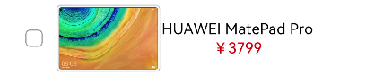

    代码如下：

    ```
    @Component
    struct ShopCartListItem {
      @Consume totalPrice: number
      private goodsItem: GoodsData
    
      build() {
        Row() {
          Toggle({ type: ToggleType.Checkbox })
            .width(13)
            .height(13)
            .onChange((isOn: boolean) => {
            if (isOn) {
              this.totalPrice += parseInt(this.goodsItem.price + '', 0)
            } else {
              this.totalPrice -= parseInt(this.goodsItem.price + '', 0)
            }
          })
          Image(this.goodsItem.imgSrc)
            .objectFit(ImageFit.ScaleDown)
            .height(130)
            .width(100)
            .renderMode(ImageRenderMode.Original)
          Column() {
            Text(this.goodsItem.title)
              .fontSize(18)
            Text('￥' + this.goodsItem.price)
              .fontSize(18)
              .fontColor(Color.Red)
          }
          .margin({left:40})
        }
        .height(100)
        .width('100%')
        .margin({ left: 20 })
        .alignItems(VerticalAlign.Center)
        .backgroundColor(Color.White)
      }
    }
    ```

4.  新建ShopCartBottom组件，ShopCartBottom组件效果图如下：

    

    代码如下：

    ```
    @Component
    struct ShopCartBottom {
      @Consume totalPrice: number
    
      build() {
        Row() {
          Text('Total:  ￥' + this.totalPrice)
            .fontColor(Color.Red)
            .fontSize(18)
            .margin({ left: 20 })
            .width(150)
          Text('Check Out')
            .fontColor(Color.Black)
            .fontSize(18)
            .margin({ right: 20, left: 180 })
            .onClick(() => {
            prompt.showToast({
              message: 'Checking Out',
              duration: 10,
              bottom: 100
            })
          })
        }
        .height(30)
        .width('100%')
        .backgroundColor('#FF7FFFD4')
        .alignItems(VerticalAlign.Bottom)
      }
    }
    ```


# 构建我的页签

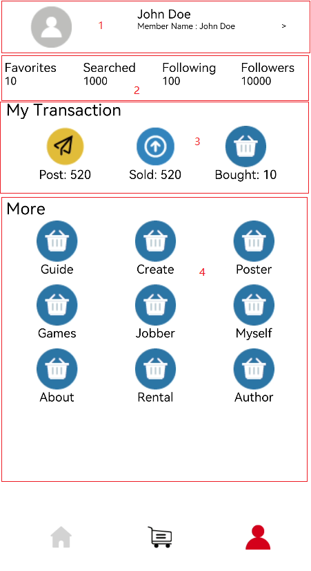

从上面效果图可以看出，主界面我的页签主要由下面四部分组成：

1.  顶部的水平布局。
2.  顶部下面的文本加数字的水平List。
3.  My Transactio模块，图片加文本的水平List。
4.  More模块,图片加文本的Grid。

在本任务中，我们构建主页我的页签，主要可以划分成下面几步：

1.  在pages目录下面新建一个ETS Page 命名为MyPage.ets，在config.json文件pages属性中也会自动添加“pages/MyPage”页面路由。
2.  在MyPage.ets文件中添加入口组件（MyInfo），组件内容如下：

    ```
    import {getMenu,getTrans,getMore} from '../model/GoodsDataModels'
    import {Menu, ImageItem} from '../model/Menu'
    @Entry
    @Component
    export struct MyInfo {
      build() {
        Column() {
          Row() {
            Image($r('app.media.icon_user'))
              .objectFit(ImageFit.Contain)
              .height(50)
              .width(50)
              .margin({left:10})
              .renderMode(ImageRenderMode.Original)
            Column() {
              Text('John Doe')
                .fontSize(15)
              Text('Member Name : John Doe                     >')
                .fontSize(15)
            }
            .height(60)
            .margin({ left: 20, top: 10 })
            .alignItems(HorizontalAlign.Start)
          }
    
          TopList()
          MyTransList()
          MoreGrid()
    
        }
        .alignItems(HorizontalAlign.Start)
        .width('100%')
        .height('100%')
        .flexGrow(1)
      }
    }
    ```

    入口组件中还包含TopList，MyTransList和MoreGrid三个子组件。

3.  在MyPage.ets文件中新建TopList组件，效果图如下：

    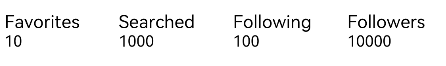

    代码如下：

    ```
    @Component
    struct TopList {
      private menus: Menu1[] = getMenu()
    
      build() {
        Row() {
          List() {
            ForEach(this.menus, item => {
              ListItem() {
                MenuItem({ menu: item })
              }
            }, item => item.id.toString())
          }
          .height('100%')
          .width('100%')
          .margin({ top: 5,left: 10})
          .edgeEffect(EdgeEffect.None)
          .listDirection(Axis.Horizontal)
        }
        .width('100%')
        .height(50)
      }
    }
    ```

    getMenu\(\)方法在上文中已有定义，是获取菜单列表的方法，TopList的子组件MenuItem内容如下：

    ```
    @Component
    struct MenuItem {
      private menu: Menu1
    
      build() {
        Column() {
          Text(this.menu.title)
            .fontSize(15)
          Text(this.menu.num + '')
            .fontSize(13)
    
        }
        .height(50)
        .width(100)
        .margin({ left: 8, right: 8 })
        .alignItems(HorizontalAlign.Start)
        .backgroundColor(Color.White)
      }
    }
    ```

4.  在MyPage.ets文件中新建MyTransList组件和MoreGrid组件，MyTransList组件效果如如下：

    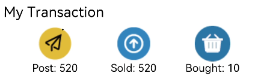

    代码如下：

    ```
    @Component
    struct MyTransList {
      private imageItems: ImageItem[] = getTrans()
    
      build() {
        Column() {
          Text('My Transaction')
            .fontSize(20)
            .margin({ left: 10 })
            .width('100%')
            .height(30)
          Row() {
            List() {
              ForEach(this.imageItems, item => {
                ListItem() {
                  DataItem({ imageItem: item })
                }
              }, item => item.id.toString())
            }
            .height(70)
            .width('100%')
            .edgeEffect(EdgeEffect.None)
            .margin({ top: 5 })
            .padding({ left: 16, right: 16 })
            .listDirection(Axis.Horizontal)
          }
        }
        .height(120)
      }
    }
    ```

    MoreGrid组件效果图如下：

    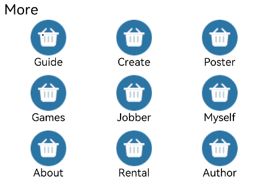

    代码如下：

    ```
    @Component
    struct MoreGrid {
      private gridRowTemplate: string = ''
      private imageItems: ImageItem[] = getMore()
      private heightValue: number
    
      aboutToAppear() {
        var rows = Math.round(this.imageItems.length / 3);
        this.gridRowTemplate = '1fr '.repeat(rows);
        this.heightValue = rows * 75;
      }
    
      build() {
        Column() {
          Text('More')
            .fontSize(20)
            .margin({ left: 10 })
            .width('100%')
            .height(30)
          Scroll() {
            Grid() {
              ForEach(this.imageItems, (item: ImageItem) => {
                GridItem() {
                  DataItem({ imageItem: item })
                }
              }, (item: ImageItem) => item.id.toString())
            }
            .rowsTemplate(this.gridRowTemplate)
            .columnsTemplate('1fr 1fr 1fr')
            .columnsGap(8)
            .rowsGap(8)
            .height(this.heightValue)
          }
          .padding({ left: 16, right: 16 })
        }
        .height(400)
      }
    }
    ```

    在MyTransList和MoreGrid组件中都包含子组件DataItem，为避免的重复代码，可以把多次要用到的结构体组件化，这里的结构体就是图片加上文本的上下结构体，DataItem组件内容如下：

    ```
    @Component
    struct DataItem {
      private imageItem: ImageItem
    
      build() {
        Column() {
          Image(this.imageItem.imageSrc)
            .objectFit(ImageFit.Contain)
            .height(50)
            .width(50)
            .renderMode(ImageRenderMode.Original)
          Text(this.imageItem.title)
            .fontSize(15)
    
        }
        .height(70)
        .width(150)
        .margin({ left: 10, right: 10 })
        .backgroundColor(Color.White)
      }
    }
    ```


# 构建商品详情页面

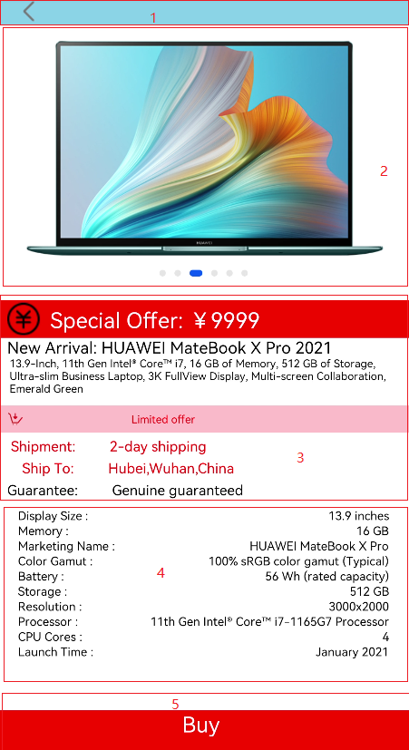

从上面效果图可以看出，商品详情页面主要由下面五部分组成：

1.  顶部的返回栏。
2.  Swiper组件。
3.  中间多个Text组件组成的布局。
4.  参数列表。
5.  底部的Buy。

在本任务中，把上面每一部分都封装成一个组件，然后再放到入口组件内，当点击顶部返回图标时返回到主页面的商品列表页签，点击底部Buy时，会触发进度条弹窗

1.  在pages目录下面新建一个ETS Page， 命名为ShoppingDetail.ets，config.json文件pages属性中也会自动添加“pages/ShoppingDetail”页面路由。
2.  在ShoppingDetail.ets文件中创建入口组件，组件内容如下：

    ```
    @Entry
    @Component
    struct ShoppingDetail {
      private arsItems: ArsData[] = getArs()
    
      build() {
        Column() {
          DetailTop()
          Scroll() {
            Column() {
              SwiperTop()
              DetailText()
              DetailArsList({ arsItems: this.arsItems })
              Image($r('app.media.computer1'))
                .height(220)
                .width('100%')
                .margin({ top: 30 })
              Image($r('app.media.computer2'))
                .height(220)
                .width('100%')
                .margin({ top: 30 })
              Image($r('app.media.computer3'))
                .height(220)
                .width('100%')
                .margin({ top: 30 })
              Image($r('app.media.computer4'))
                .height(220)
                .width('100%')
                .margin({ top: 30 })
              Image($r('app.media.computer5'))
                .height(220)
                .width('100%')
                .margin({ top: 30 })
              Image($r('app.media.computer6'))
                .height(220)
                .width('100%')
                .margin({ top: 30 })
            }
            .width('100%')
            .flexGrow(1)
          }
          .scrollable(ScrollDirection.Vertical)
    
          DetailBottom()
        }
        .height('90%')
        .width('100%')
      }
    }
    ```

    其中顶部DetailTop组件效果图如下：

    

    代码如下：

    ```
    @Component
    struct DetailTop {
      build() {
        Column() {
          Row() {
            Image($r('app.media.icon_return'))
              .height(40)
              .width(40)
              .margin({left: 20})
              .onClick(() => {
                router.push({
                  uri: "pages/HomePage"
                })
              })
    
          }
          .width('100%')
          .height(35)
          .backgroundColor('#FF87CEEB')
        }
        .width('100%')
        .height(40)
      }
    }
    ```

3.  SwiperTop组件效果图如下：

    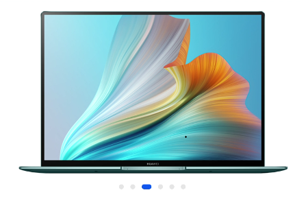

    代码如下：

    ```
    @Component
    struct SwiperTop {
      build() {
        Column() {
          Swiper() {
            Image($r('app.media.computer1'))
              .height(220)
              .width('100%')
            Image($r('app.media.computer2'))
              .height(220)
              .width('100%')
            Image($r('app.media.computer3'))
              .height(220)
              .width('100%')
            Image($r('app.media.computer4'))
              .height(220)
              .width('100%')
            Image($r('app.media.computer5'))
              .height(220)
              .width('100%')
            Image($r('app.media.computer6'))
              .height(220)
              .width('100%')
          }
          .index(0)
          .autoPlay(true)
          .interval(3000)
          .indicator(true)
          .loop(true)
          .height(250)
          .width('100%')
        }
        .height(250)
        .width('100%')
      }
    }
    ```

4.  DetailText组件效果图如下：

    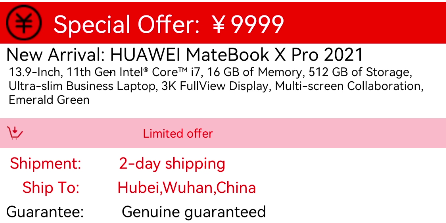

    代码如下：

    ```
    @Component
    struct DetailText {
      build() {
        Column() {
          Row() {
            Image($r('app.media.icon_promotion'))
              .objectFit(ImageFit.Contain)
              .height(30)
              .width(30)
              .margin({ left: 10 })
            Text('Special Offer: ￥9999')
              .fontColor(Color.White)
              .fontSize(20)
              .margin({ left: 10 })
    
          }
          .width('100%')
          .height(35)
          .backgroundColor(Color.Red)
    
          Column() {
            Text('New Arrival: HUAWEI MateBook X Pro 2021')
              .fontSize(18)
              .margin({ left: 10 })
              .alignSelf(ItemAlign.Start)
            Text('13.9-Inch, 11th Gen Intel® Core™ i7, 16 GB of Memory, 512 GB of Storage, Ultra-slim Business Laptop, 3K FullView Display, Multi-screen 
                              Collaboration, Emerald Green')
              .fontSize(14)
              .margin({ left: 10 })
            Row() {
              Image($r('app.media.icon_buy'))
                .objectFit(ImageFit.Contain)
                .height(30)
                .width(30)
                .margin({ left: 10 })
              Text('Limited offer')
                .fontSize(15)
                .fontColor(Color.Red)
                .margin({ left: 100 })
    
            }
            .backgroundColor(Color.Pink)
            .width('100%')
            .height(45)
            .margin({ top: 10 })
    
            Text(' Shipment:         2-day shipping')
              .fontSize(13)
              .fontColor(Color.Red)
              .margin({ left: 10, top: 5 })
              .alignSelf(ItemAlign.Start)
            Text('    Ship To:         Hubei,Wuhan,China')
              .fontSize(13)
              .fontColor(Color.Red)
              .margin({ left: 10, top: 5 })
              .alignSelf(ItemAlign.Start)
              .onClick(() => {
                prompt.showDialog({ title: 'select address', })
    
              })
            Text('Guarantee:         Genuine guaranteed')
              .fontSize(13)
              .margin({ left: 10, top: 5 })
              .alignSelf(ItemAlign.Start)
          }
          .height(170)
          .width('100%')
        }
        .height(180)
        .width('100%')
      }
    }
    ```

    DetailArsList组件效果图如下：

    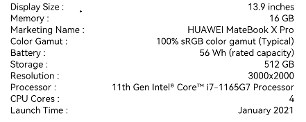

    代码如下：

    ```
    @Component
    struct DetailArsList{
      private arsItems: ArsData[]
      build() {
        Scroll() {
          Column() {
            List() {
              ForEach(this.arsItems, item => {
                ListItem() {
                  ArsListItem({ arsItem: item })
                }
              }, item => item.id.toString())
            }
            .height('100%')
            .width('100%')
            .margin({ top: 5 })
            .listDirection(Axis.Vertical)
          }
          .height(200)
        }
      }
    }
    ```

    ArsListItem组件代码如下：

    ```
    @Component
    struct ArsListItem {
      private arsItem: ArsData
    
      build() {
        Row() {
          Text(this.arsItem.title + " :")
            .fontSize(11)
            .margin({ left: 20 })
            .flexGrow(1)
          Text(this.arsItem.content)
            .fontSize(11)
            .margin({ right: 20 })
    
        }
        .height(14)
        .width('100%')
        .backgroundColor(Color.White)
      }
    }
    ```

5.  DetailBottom组件效果图如下：

    

    代码如下：

    ```
    @Component
    struct DetailBottom {
      @Provide
      private value: number= 1
      dialogController: CustomDialogController = new CustomDialogController({
        builder: DialogExample({ action: this.onAccept }),
        cancel: this.existApp,
        autoCancel: true
      });
    
      onAccept() {
    
      }
    
      existApp() {
    
      }
    
      build() {
        Column() {
          Text('Buy')
            .width(40)
            .height(25)
            .fontSize(20)
            .fontColor(Color.White)
            .onClick(() => {
              this.value = 1
              this.dialogController.open()
            })
        }
        .alignItems(HorizontalAlign.Center)
        .backgroundColor(Color.Red)
        .width('100%')
        .height('10%')
      }
    }
    ```

    DialogExample自定义弹窗组件效果图如下：

    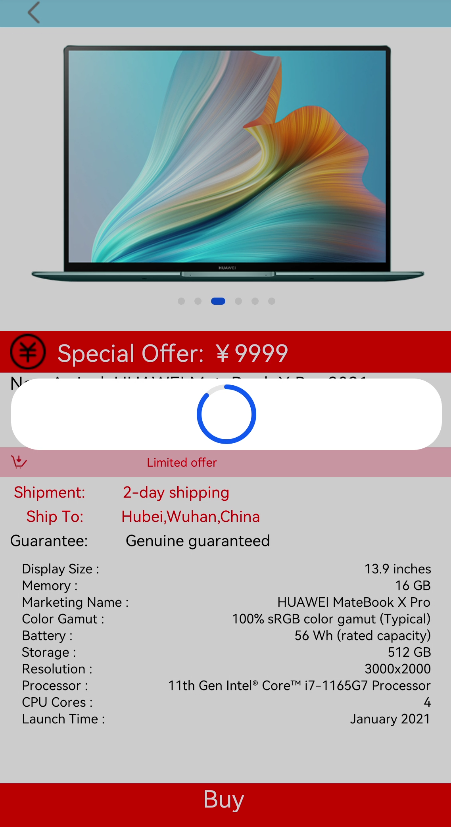

    代码如下：

    ```
    @CustomDialog
    struct DialogExample {
      @Consume
      private value: number
      controller: CustomDialogController;
      action: () => void;
    
      build() {
        Column() {
          Progress({ value: this.value++ >= 100 ? 100 : this.value, total: 100, style: ProgressStyle.Capsule })
            .height(50)
            .width(100)
            .margin({ top: 5 })
    
        }
        .height(60)
        .width(100)
      }
    }
    ```


# 完整代码

链接如下：

[gitee源码](https://gitee.com/openharmony/codelabs/tree/master/ETSUI/ShoppingEts)

# 相关概念与参考

## API 参考

1.  [Tabs组件](https://gitee.com/openharmony/docs/blob/master/zh-cn/application-dev/reference/arkui-ts/ts-container-tabs.md)
2.  [CustomDialog自定义弹窗](https://gitee.com/openharmony/docs/blob/master/zh-cn/application-dev/reference/arkui-ts/ts-methods-custom-dialog-box.md)
3.  [List组件](https://gitee.com/openharmony/docs/blob/master/zh-cn/application-dev/reference/arkui-ts/ts-container-list.md)
4.  [Grid组件](https://gitee.com/openharmony/docs/blob/master/zh-cn/application-dev/reference/arkui-ts/ts-container-grid.md)
5.  [Image组件](https://gitee.com/openharmony/docs/blob/master/zh-cn/application-dev/reference/arkui-ts/ts-basic-components-image.md)
6.  [Button组件](https://gitee.com/openharmony/docs/blob/master/zh-cn/application-dev/reference/arkui-ts/ts-basic-components-button.md)
7.  [Text组件](https://gitee.com/openharmony/docs/blob/master/zh-cn/application-dev/reference/arkui-ts/ts-basic-components-text.md)
8.  [Progress组件](https://gitee.com/openharmony/docs/blob/master/zh-cn/application-dev/reference/arkui-ts/ts-basic-components-progress.md)
9.  [Navigator组件](https://gitee.com/openharmony/docs/blob/master/zh-cn/application-dev/reference/arkui-ts/ts-container-navigator.md)
10. [TabContent组件](https://gitee.com/openharmony/docs/blob/master/zh-cn/application-dev/reference/arkui-ts/ts-container-tabcontent.md)
11. [Row组件](https://gitee.com/openharmony/docs/blob/master/zh-cn/application-dev/reference/arkui-ts/ts-container-row.md)
12. [Colunm组件](https://gitee.com/openharmony/docs/blob/master/zh-cn/application-dev/reference/arkui-ts/ts-container-column.md)
13. [Flex组件](https://gitee.com/openharmony/docs/blob/master/zh-cn/application-dev/reference/arkui-ts/ts-container-flex.md)
14. [Scroll组件](https://gitee.com/openharmony/docs/blob/master/zh-cn/application-dev/reference/arkui-ts/ts-container-scroll.md)

# 总结

本篇CodeLab灵活使用了一些组件来实现页面效果：

1.  使用Tabs组件完成商品分类。
2.  使用List组件完成商品列表、图片列表、参数列表等。
3.  使用Swiper组件完成图片的循环轮播。
4.  使用Toggle组件完成购物车商品的选择。

	
