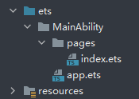
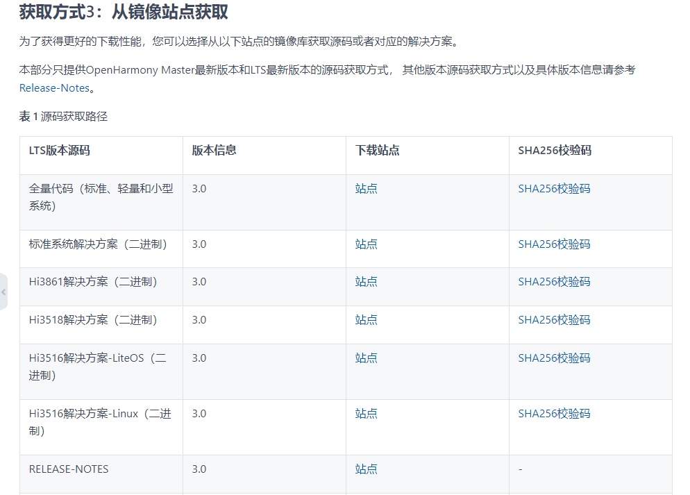
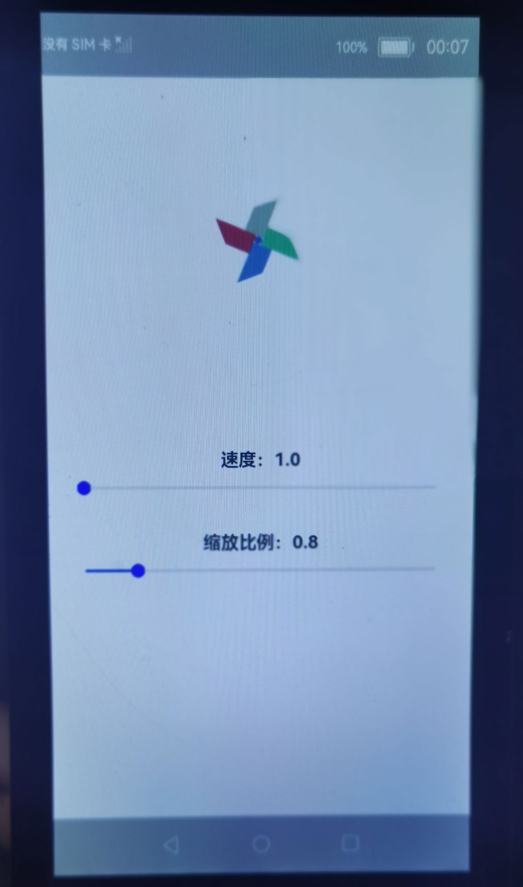
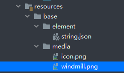

# SliderApplicationEts
# 介绍<a name="ZH-CN_TOPIC_0000001189407566"></a>

-   [应用场景](#section225718574575)

## 应用场景<a name="section225718574575"></a>

OpenHarmony eTS提供了丰富的接口和组件，开发者可以根据实际场景和开发需求，选用不同的组件和接口。在本教程中，我们将通过一个简单的样例，学习如何使用eTS开发框架的基础组件。本篇Codelab将会使用Image组件、Slider组件、Text组件共同实现一个可调节的风车动画，完成效果如下图所示：


# 相关概念<a name="ZH-CN_TOPIC_0000001234807525"></a>

-   [eTS工程目录](#section116501561575)

**Text组件**：文本组件，用于呈现一段信息。

**Image组件**：图片组件，用来渲染展示图片。

**Slider组件**：滑动条组件，用来快速调节设置值，如音量、亮度等。

## eTS工程目录<a name="section116501561575"></a>

新建工程的ETS目录如下图所示。



**各个文件夹和文件的作用：**

-   **index.ets**：用于描述UI布局、样式、事件交互和页面逻辑。
-   **app.ets**：用于全局应用逻辑和应用生命周期管理。
-   **pages**：用于存放所有组件页面。
-   **resources**：用于存放资源配置文件。

# 搭建OpenHarmony环境<a name="ZH-CN_TOPIC_0000001237143541"></a>

完成本篇Codelab我们首先要完成开发环境的搭建，本示例以**Hi3516DV300**开发板为例，参照以下步骤进行：

1. [获取OpenHarmony系统版本](https://gitee.com/openharmony/docs/blob/master/zh-cn/device-dev/get-code/sourcecode-acquire.md#%E8%8E%B7%E5%8F%96%E6%96%B9%E5%BC%8F3%E4%BB%8E%E9%95%9C%E5%83%8F%E7%AB%99%E7%82%B9%E8%8E%B7%E5%8F%96)：标准系统解决方案（二进制）

   以3.0版本为例：

   

2. 搭建烧录环境

   1.  [完成DevEco Device Tool的安装](https://gitee.com/openharmony/docs/blob/master/zh-cn/device-dev/quick-start/quickstart-standard-env-setup.md)

   2.  [完成Hi3516开发板的烧录](https://gitee.com/openharmony/docs/blob/master/zh-cn/device-dev/quick-start/quickstart-lite-steps-hi3516-burn.md)

3. 搭建开发环境

    1.  开始前请参考[工具准备](https://gitee.com/openharmony/docs/blob/master/zh-cn/application-dev/quick-start/start-overview.md#%E5%B7%A5%E5%85%B7%E5%87%86%E5%A4%87)，完成DevEco Studio的安装和开发环境配置。
    2.  开发环境配置完成后，请参考[使用工程向导](https://gitee.com/openharmony/docs/blob/master/zh-cn/application-dev/quick-start/start-with-ets-fa.md#%E5%88%9B%E5%BB%BAets%E5%B7%A5%E7%A8%8B)创建工程（模板选择“Empty Ability”），选择JS或者eTS语言开发。
    3.  工程创建完成后，选择使用[真机进行调测](https://gitee.com/openharmony/docs/blob/master/zh-cn/application-dev/quick-start/start-with-ets-fa.md#%E4%BD%BF%E7%94%A8%E7%9C%9F%E6%9C%BA%E8%BF%90%E8%A1%8C%E5%BA%94%E7%94%A8)。


# 任务一：如何让风车动起来<a name="ZH-CN_TOPIC_0000001190407514"></a>

整个程序的页面构造十分简洁，由Image组件构成风车，Text组件和Slider组件构成文本显示和图像控制，具体效果如下图所示：



将代码写在默认文件index.ets中。整个页面使用了一个Image组件、两个Text组件、两个Slider组件。整个布局由上到下，呈线性排列。

首先使用Image组件填充页面上半部分，删掉默认代码中的Text组件，添加Image组件，给定使用图片的路径，并通过“.”运算符链式调用为组件配置多个属性。由于整个页面布局呈线性排列，所以需要将默认的Flex更换为Column，同时也将本工程使用到的参数一并声明给出，参数具体代码如下：

```
@Entry
@Component
struct Index {
  @State private speed: number = 5
  @State private imageSize: number = 1
  @State private angle: number = 0
  @State private interval: number = 0

  build() {
    Column() {
      Row() {
        Image($r('app.media.windmill'))
          .objectFit(ImageFit.Contain)
          .height(150)
          .width(150)
          .position({ x: 110, y: 100 })
          .rotate({ x: 0, y: 0, z: 1, angle: this.angle })
          .scale({ x: this.imageSize, y: this.imageSize })
      }
      .width(375)
      .height(375)
    }
    .margin({ left: 30, right: 30 })
  }
}
```

将工程中使用到的图片，添加到**resources -\> base -\> media**目录下。



那么如何让风车动起来呢 ，这里就要用到组件通用属性中的图形变换，给Image组件配置了rotate属性和scale属性，其具体的含义如下表：

<a name="table5585125154810"></a>

<table><thead align="left"><tr id="row458682524820"><th class="cellrowborder" valign="top" width="11.48%" id="mcps1.1.5.1.1"><p id="p1758618257483"><a name="p1758618257483"></a><a name="p1758618257483"></a>名称</p>
</th>
<th class="cellrowborder" valign="top" width="38.519999999999996%" id="mcps1.1.5.1.2"><p id="p65861025144815"><a name="p65861025144815"></a><a name="p65861025144815"></a>参数类型</p>
</th>
<th class="cellrowborder" valign="top" width="15.15%" id="mcps1.1.5.1.3"><p id="p10586102510480"><a name="p10586102510480"></a><a name="p10586102510480"></a>默认值</p>
</th>
<th class="cellrowborder" valign="top" width="34.849999999999994%" id="mcps1.1.5.1.4"><p id="p195861225154813"><a name="p195861225154813"></a><a name="p195861225154813"></a>描述</p>
</th>
</tr>
</thead>
<tbody><tr id="row12586102564818"><td class="cellrowborder" valign="top" width="11.48%" headers="mcps1.1.5.1.1 "><p id="p3020mcpsimp"><a name="p3020mcpsimp"></a><a name="p3020mcpsimp"></a>rotate</p>
</td>
<td class="cellrowborder" valign="top" width="38.519999999999996%" headers="mcps1.1.5.1.2 "><p id="p3022mcpsimp"><a name="p3022mcpsimp"></a><a name="p3022mcpsimp"></a>{x?: Angle, y?: Angle, z?: Angle, centerX?: Length, centerY?: Length}</p>
</td>
<td class="cellrowborder" valign="top" width="15.15%" headers="mcps1.1.5.1.3 "><p id="p558618252487"><a name="p558618252487"></a><a name="p558618252487"></a>{x: 0, y: 0, z: 0}</p>
</td>
<td class="cellrowborder" valign="top" width="34.849999999999994%" headers="mcps1.1.5.1.4 "><p id="p3028mcpsimp"><a name="p3028mcpsimp"></a><a name="p3028mcpsimp"></a>可以分别设置绕X轴、Y轴、Z轴的旋转角度，正角度为顺时针转动，负角度为逆时针转动，默认值为0，同时可以通过centerX和centerY设置旋转的中心点。</p>
</td>
</tr>
<tr id="row858617255483"><td class="cellrowborder" valign="top" width="11.48%" headers="mcps1.1.5.1.1 "><p id="p3042mcpsimp"><a name="p3042mcpsimp"></a><a name="p3042mcpsimp"></a>scale</p>
</td>
<td class="cellrowborder" valign="top" width="38.519999999999996%" headers="mcps1.1.5.1.2 "><p id="p3044mcpsimp"><a name="p3044mcpsimp"></a><a name="p3044mcpsimp"></a>{x?: number, y?: number, z?: number, centerX?: Length, centerY?: Length}</p>
</td>
<td class="cellrowborder" valign="top" width="15.15%" headers="mcps1.1.5.1.3 "><p id="p6586122519482"><a name="p6586122519482"></a><a name="p6586122519482"></a>{x: 1, y: 1, z: 1}</p>
</td>
<td class="cellrowborder" valign="top" width="34.849999999999994%" headers="mcps1.1.5.1.4 "><p id="p3050mcpsimp"><a name="p3050mcpsimp"></a><a name="p3050mcpsimp"></a>可以分别设置X轴、Y轴、Z轴的缩放比例，默认值为1，同时可以通过centerX和centerY设置缩放的中心点。</p>
</td>
</tr>
</tbody>
</table>


所以要想使风车转起来，我们只需要在应用启动的时候，以固定的时间间隔调整rotate的角度也就是参数angle，接下来和build\(\)同级，继续添加如下方法：

```
speedChange() {
  var that = this;
  that.angle = 0;
  this.interval = setInterval(function () {
    that.angle += that.speed
  }, 15 )
}

onPageShow() {
  clearInterval(this.interval)
  this.speedChange()
}
```

其中onPageShow是生命周期方法，表示从程序启动时，便开始执行。自此我们已经实现了风车的旋转效果。

# 任务二：调节风车的转速和大小<a name="ZH-CN_TOPIC_0000001189727534"></a>

在这个任务中，我们将一起实现风车的转速和大小的调节。为了实现此效果我们需要用到Slider组件进行滑动调节，并且将数据实时显示在Text组件上。我们发现每个Text组件只有显示的内容不一样，组件的属性是一致的。所以我们使用自定义构造函数@Builder简化代码，和build\(\)同级有如下代码：

```
@Builder DescribeText(text:string, speed: number) {
  Stack() {
    Text(text + speed.toFixed(1))
      .margin({ top: 30 })
      .fontSize(20)
      .fontWeight(FontWeight.Bold)
  }
} 
```

接下来结合Slider组件，实现调节风车的效果。首先实现速度的调节，在Slider的构造参数中，给定初始值和样式。在onChange事件中，将滑动的value给到事先定义好的变量speed，实现Text组件的更新，并且通过调用speedChange\(\)方法实现转速的改变，在Column\(\)中有添加下代码：

```
Image()
...  
this.DescribeText('速度：',this.speed)

Slider({value: this.speed, min: 1, max: 10,step: 1,style:SliderStyle.OUTSET})
	.showTips(true)
	.blockColor(Color.Blue)
	.onChange((value: number,mode:SliderChangeMode) => {
	this.speed = value
	clearInterval(this.interval)
	this.speedChange()
})
...
```

使用同样的方法，我们可以实现风车大小的改变，在Column\(\)中添加如下代码：

```
...
this.DescribeText('缩放比例：', this.imageSize)

Slider({value: this.imageSize, min: 0.5, max: 2.5, step: 0.1,style:SliderStyle.OUTSET})
	.showTips(true)
	.blockColor(Color.Blue)
	.onChange((value: number, mode:SliderChangeMode) => {
	this.imageSize = value
})
...
```

自此我们已经完成了所有的工作：使用Slider、Image、Text组件，实现了一个可以调节风车大小和转速的简易应用。

# 恭喜您<a name="ZH-CN_TOPIC_0000001235087515"></a>

在本篇Codelab中，我们主要为大家讲解了部分基础组件的使用，让大家可以通过简单的代码，上手eTS的开发，我们主要介绍了：

-   Slider组件的使用
-   Image组件的使用
-   @Builder注解的使用

同时逐步分解代码，和大家一起完成了的应用开发。希望通过本教程，各位开发者可以对基础组件有一个初步的了解，并对声明式编程框架具有新的认识。
